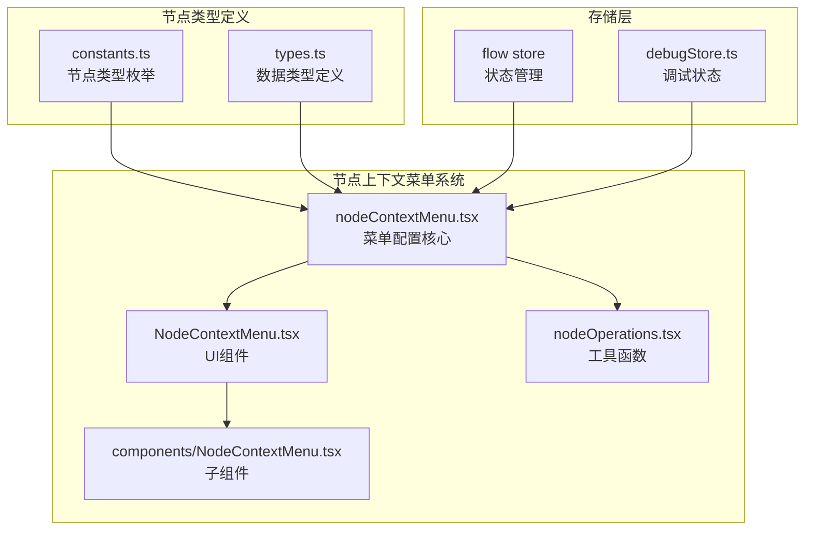
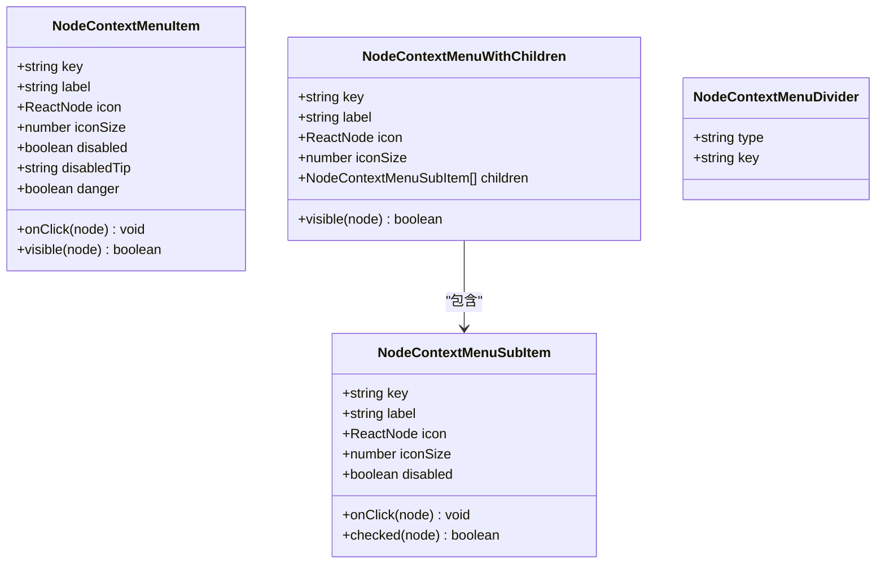
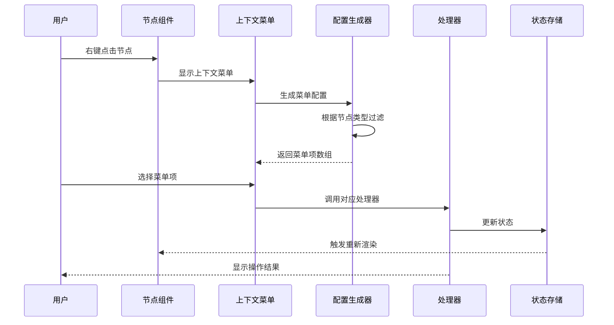
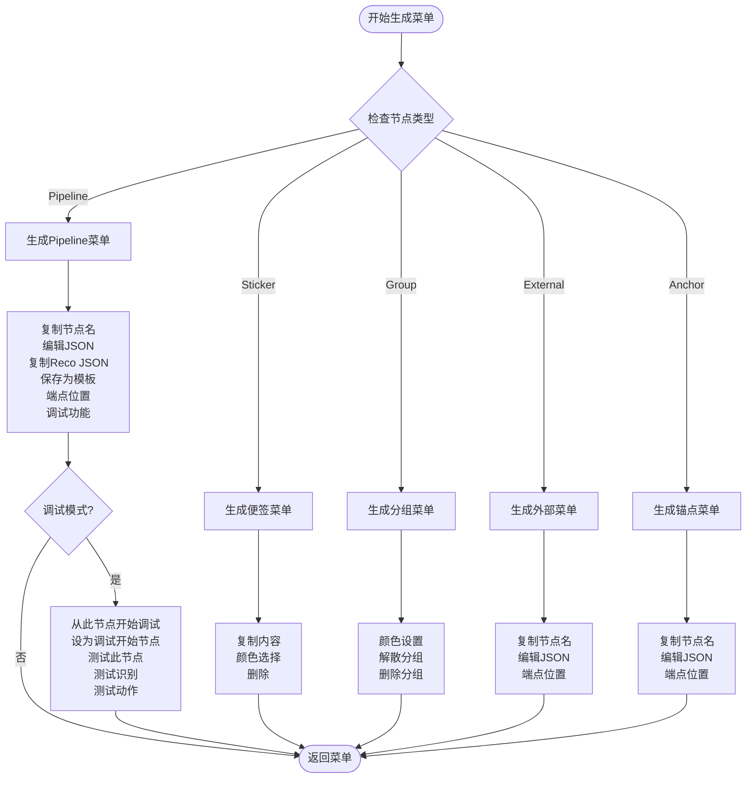
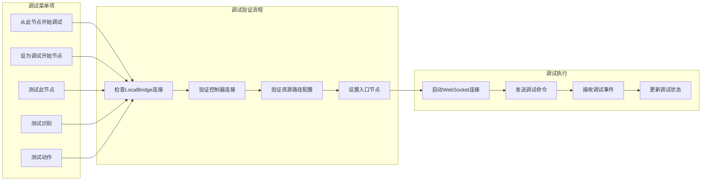
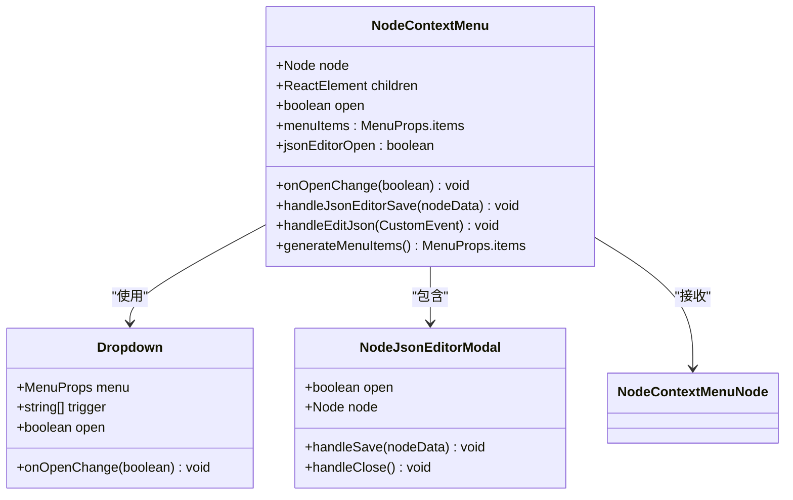
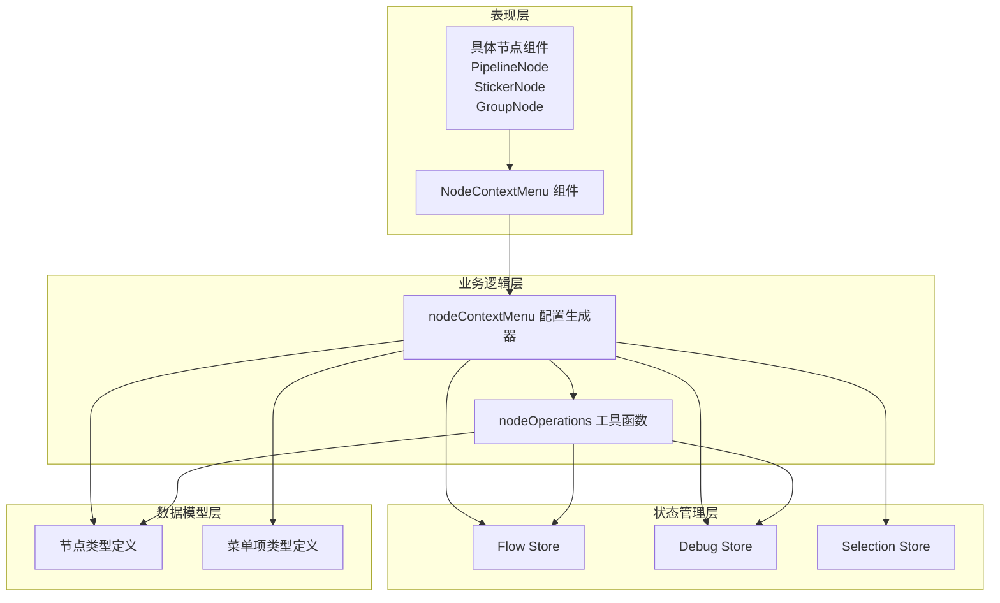

# 节点上下文菜单

<cite>
**本文档引用的文件**
- [nodeContextMenu.tsx](file://src/components/flow/nodes/nodeContextMenu.tsx)
- [NodeContextMenu.tsx](file://src/components/flow/nodes/components/NodeContextMenu.tsx)
- [nodeOperations.tsx](file://src/components/flow/nodes/utils/nodeOperations.tsx)
- [constants.ts](file://src/components/flow/nodes/constants.ts)
- [types.ts](file://src/stores/flow/types.ts)
- [index.ts](file://src/stores/flow/index.ts)
- [selectionSlice.ts](file://src/stores/flow/slices/selectionSlice.ts)
- [debugStore.ts](file://src/stores/debugStore.ts)
- [Flow.tsx](file://src/components/Flow.tsx)
- [PipelineNode/index.tsx](file://src/components/flow/nodes/PipelineNode/index.tsx)
- [StickerNode.tsx](file://src/components/flow/nodes/StickerNode.tsx)
- [GroupNode.tsx](file://src/components/flow/nodes/GroupNode.tsx)
</cite>

## 目录
1. [简介](#简介)
2. [项目结构](#项目结构)
3. [核心组件](#核心组件)
4. [架构概览](#架构概览)
5. [详细组件分析](#详细组件分析)
6. [依赖关系分析](#依赖关系分析)
7. [性能考虑](#性能考虑)
8. [故障排除指南](#故障排除指南)
9. [结论](#结论)

## 简介

节点上下文菜单是 MAA Pipeline Editor 中一个关键的用户交互功能，它为不同类型的节点提供了丰富的操作选项。该系统支持多种节点类型（Pipeline、External、Anchor、Sticker、Group），每个节点类型都有其特定的功能和菜单项。

系统采用模块化设计，将菜单配置逻辑与 UI 组件分离，实现了高度的可扩展性和维护性。通过统一的接口定义和类型安全的设计，确保了不同节点类型之间的一致性体验。

## 项目结构

节点上下文菜单系统主要分布在以下目录结构中：

**图表来源**
- [nodeContextMenu.tsx:1-603](file://src/components/flow/nodes/nodeContextMenu.tsx#L1-L603)
- [NodeContextMenu.tsx:1-227](file://src/components/flow/nodes/components/NodeContextMenu.tsx#L1-L227)
- [constants.ts:1-47](file://src/components/flow/nodes/constants.ts#L1-L47)
- [types.ts:1-362](file://src/stores/flow/types.ts#L1-L362)

**章节来源**
- [nodeContextMenu.tsx:1-603](file://src/components/flow/nodes/nodeContextMenu.tsx#L1-L603)
- [NodeContextMenu.tsx:1-227](file://src/components/flow/nodes/components/NodeContextMenu.tsx#L1-L227)

## 核心组件

### 菜单项类型系统

系统定义了完整的菜单项类型层次结构，支持普通菜单项、带子菜单的菜单项和分隔线：

**图表来源**
- [nodeContextMenu.tsx:27-71](file://src/components/flow/nodes/nodeContextMenu.tsx#L27-L71)

### 节点类型联合体

系统支持五种不同的节点类型，每种类型都有其特定的数据结构和行为：

| 节点类型 | 数据类型 | 主要功能 | 特殊属性 |
|---------|----------|----------|----------|
| Pipeline | PipelineNodeDataType | 核心识别和动作节点 | recognition, action, others |
| External | ExternalNodeDataType | 外部节点连接 | - |
| Anchor | AnchorNodeDataType | 重定向节点 | - |
| Sticker | StickerNodeDataType | 便签注释 | content, color |
| Group | GroupNodeDataType | 分组容器 | color |

**章节来源**
- [types.ts:107-163](file://src/stores/flow/types.ts#L107-L163)
- [constants.ts:14-20](file://src/components/flow/nodes/constants.ts#L14-L20)

## 架构概览

节点上下文菜单系统采用分层架构设计，实现了关注点分离和高内聚低耦合：

**图表来源**
- [NodeContextMenu.tsx:77-203](file://src/components/flow/nodes/components/NodeContextMenu.tsx#L77-L203)
- [nodeContextMenu.tsx:378-602](file://src/components/flow/nodes/nodeContextMenu.tsx#L378-L602)

## 详细组件分析

### 菜单配置生成器

菜单配置生成器是整个系统的核心，负责根据节点类型动态生成相应的菜单项：

**图表来源**
- [nodeContextMenu.tsx:378-602](file://src/components/flow/nodes/nodeContextMenu.tsx#L378-L602)

### 调试功能集成

系统深度集成了调试功能，为 Pipeline 节点提供了强大的调试支持：

**图表来源**
- [nodeContextMenu.tsx:114-176](file://src/components/flow/nodes/nodeContextMenu.tsx#L114-L176)
- [debugStore.ts:143-200](file://src/stores/debugStore.ts#L143-L200)

**章节来源**
- [nodeContextMenu.tsx:105-291](file://src/components/flow/nodes/nodeContextMenu.tsx#L105-L291)
- [debugStore.ts:1-200](file://src/stores/debugStore.ts#L1-L200)

### UI 组件实现

NodeContextMenu 组件负责将配置转换为实际的 UI 元素，并处理用户交互：

**图表来源**
- [NodeContextMenu.tsx:18-227](file://src/components/flow/nodes/components/NodeContextMenu.tsx#L18-L227)

**章节来源**
- [NodeContextMenu.tsx:26-227](file://src/components/flow/nodes/components/NodeContextMenu.tsx#L26-L227)

### 工具函数模块

nodeOperations 模块提供了通用的操作函数，被菜单处理器调用：

| 函数名称 | 功能描述 | 参数类型 | 返回值 |
|---------|----------|----------|--------|
| copyNodeName | 复制节点名称 | nodeName: string, nodeType?: NodeTypeEnum | void |
| saveNodeAsTemplate | 保存节点为模板 | nodeName: string, nodeData: PipelineNodeDataType | void |
| deleteNode | 删除节点 | nodeId: string | void |
| copyNodeRecoJSON | 复制识别JSON | nodeId: string | void |

**章节来源**
- [nodeOperations.tsx:12-184](file://src/components/flow/nodes/utils/nodeOperations.tsx#L12-L184)

## 依赖关系分析

节点上下文菜单系统的依赖关系体现了清晰的分层架构：

**图表来源**
- [nodeContextMenu.tsx:14-25](file://src/components/flow/nodes/nodeContextMenu.tsx#L14-L25)
- [NodeContextMenu.tsx:7-16](file://src/components/flow/nodes/components/NodeContextMenu.tsx#L7-L16)

**章节来源**
- [index.ts:15-24](file://src/stores/flow/index.ts#L15-L24)
- [selectionSlice.ts:12-102](file://src/stores/flow/slices/selectionSlice.ts#L12-L102)

## 性能考虑

系统在设计时充分考虑了性能优化：

### 渲染优化
- 使用 React.memo 对节点组件进行记忆化缓存
- 通过 useMemo 优化菜单项的计算
- 防抖机制减少频繁的状态更新

### 内存管理
- 调试记录和识别详情采用 LRU 缓存策略
- 定期清理过期的调试数据
- 控制识别记录的最大数量

### 异步处理
- 调试启动采用异步验证流程
- WebSocket 通信使用非阻塞模式
- 消息提示采用轻量级通知

## 故障排除指南

### 常见问题及解决方案

| 问题类型 | 症状 | 可能原因 | 解决方案 |
|---------|------|----------|----------|
| 菜单不显示 | 右键无反应 | 节点类型不支持 | 检查节点类型定义 |
| 调试失败 | 启动调试报错 | 连接状态异常 | 验证 LocalBridge 连接 |
| 模板保存失败 | 保存模板失败 | 模板名称冲突 | 检查模板名称唯一性 |
| JSON 编辑异常 | 编辑器无法打开 | 事件监听问题 | 检查事件分发机制 |

### 调试模式验证

当启用调试模式时，系统会自动添加调试相关的菜单项。如果这些菜单项不可用，需要检查：

1. **调试存储状态**：确认 debugMode 为 true
2. **连接状态验证**：检查 LocalBridge 和控制器连接
3. **资源路径配置**：确保 resourcePaths 非空
4. **入口节点设置**：验证 entryNode 配置

**章节来源**
- [nodeContextMenu.tsx:187-243](file://src/components/flow/nodes/nodeContextMenu.tsx#L187-L243)
- [debugStore.ts:143-200](file://src/stores/debugStore.ts#L143-L200)

## 结论

节点上下文菜单系统展现了优秀的软件工程实践，通过模块化设计、类型安全和清晰的关注点分离，实现了高度可维护和可扩展的用户界面功能。

系统的主要优势包括：

1. **类型安全**：完整的 TypeScript 类型定义确保了编译时的安全性
2. **可扩展性**：模块化的架构设计便于添加新的节点类型和菜单项
3. **用户体验**：直观的右键菜单提供了一致的操作体验
4. **调试集成**：深度集成的调试功能提升了开发效率
5. **性能优化**：合理的缓存和防抖机制保证了良好的响应性能

该系统为 MAA Pipeline Editor 提供了强大而灵活的节点操作能力，是整个应用的重要组成部分。