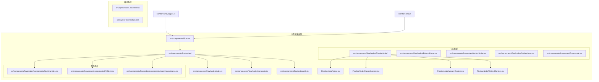
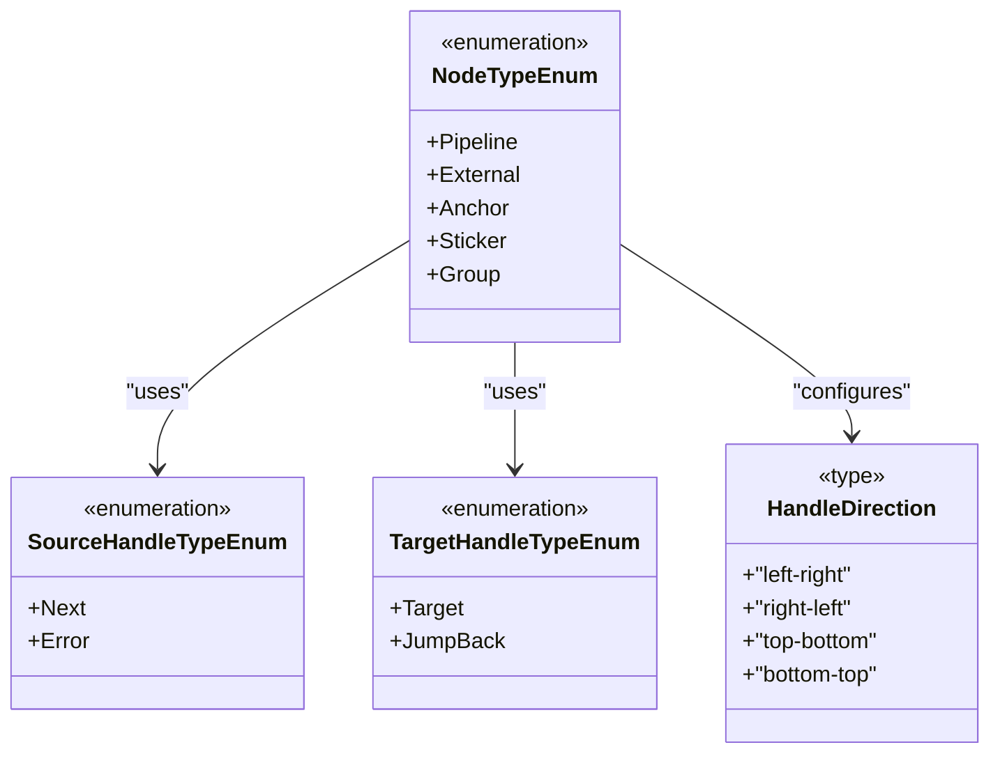
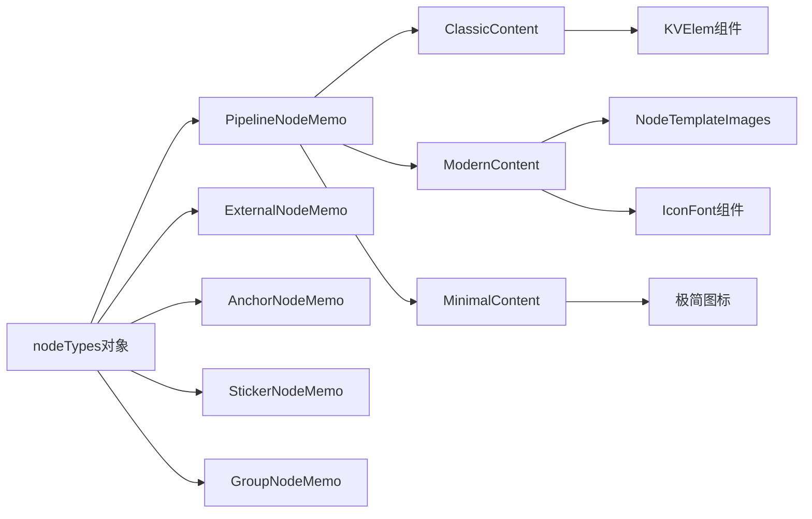
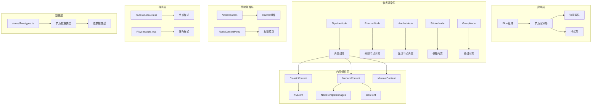
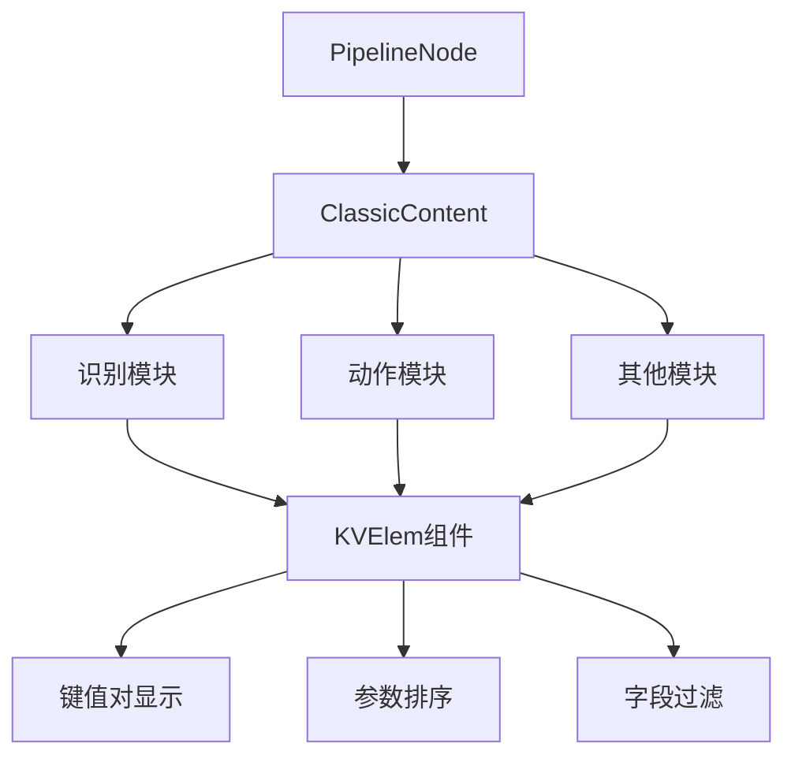
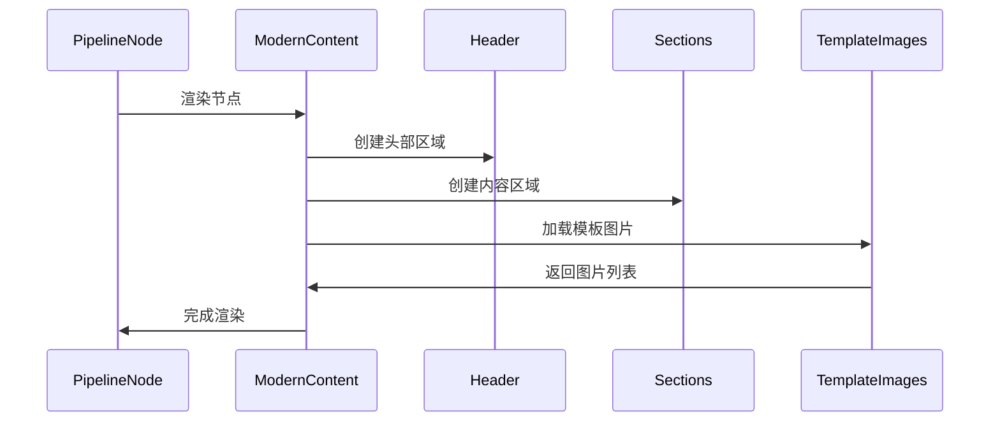
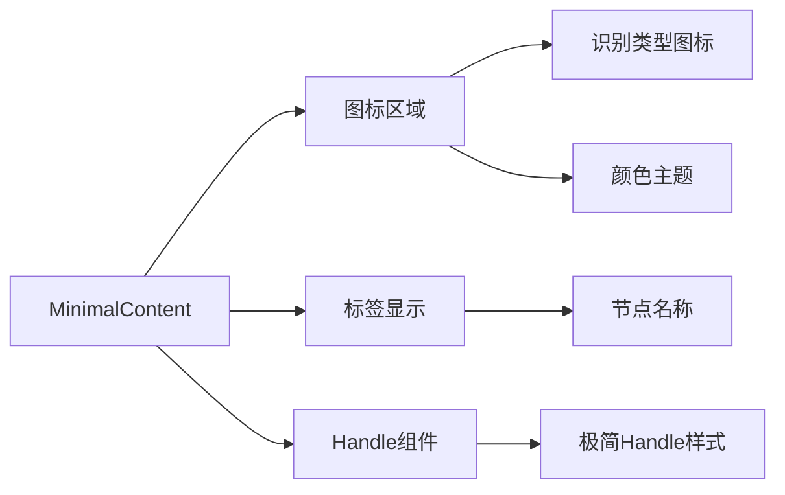
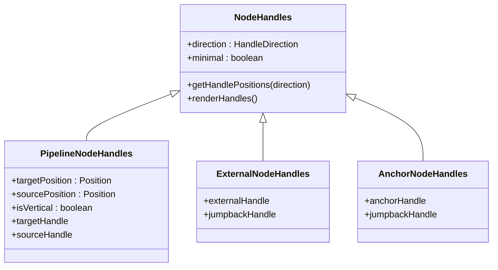
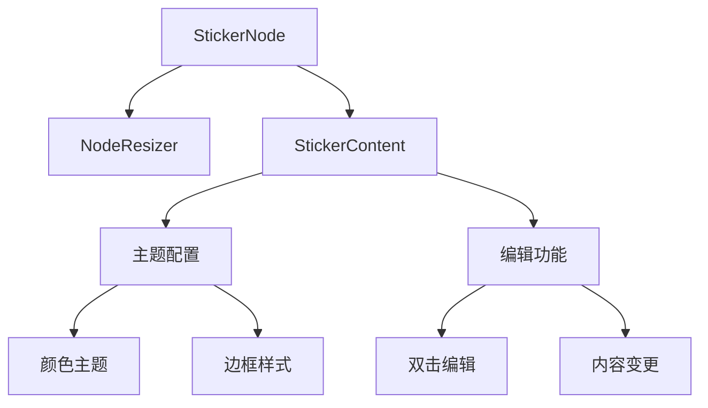
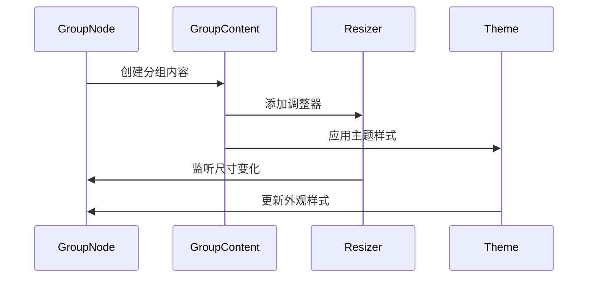

# 节点渲染系统

<cite>
**本文档引用的文件**
- [Flow.tsx](file://src/components/Flow.tsx)
- [nodes/index.ts](file://src/components/flow/nodes/index.ts)
- [nodes/constants.ts](file://src/components/flow/nodes/constants.ts)
- [nodes/utils.ts](file://src/components/flow/nodes/utils.ts)
- [PipelineNode/index.tsx](file://src/components/flow/nodes/PipelineNode/index.tsx)
- [PipelineNode/ClassicContent.tsx](file://src/components/flow/nodes/PipelineNode/ClassicContent.tsx)
- [PipelineNode/ModernContent.tsx](file://src/components/flow/nodes/PipelineNode/ModernContent.tsx)
- [PipelineNode/MinimalContent.tsx](file://src/components/flow/nodes/PipelineNode/MinimalContent.tsx)
- [NodeHandles.tsx](file://src/components/flow/nodes/components/NodeHandles.tsx)
- [ExternalNode.tsx](file://src/components/flow/nodes/ExternalNode.tsx)
- [AnchorNode.tsx](file://src/components/flow/nodes/AnchorNode.tsx)
- [StickerNode.tsx](file://src/components/flow/nodes/StickerNode.tsx)
- [GroupNode.tsx](file://src/components/flow/nodes/GroupNode.tsx)
- [nodes.module.less](file://src/styles/nodes.module.less)
- [stores/flow/types.ts](file://src/stores/flow/types.ts)
</cite>

## 目录
1. [简介](#简介)
2. [项目结构](#项目结构)
3. [核心组件](#核心组件)
4. [架构概览](#架构概览)
5. [详细组件分析](#详细组件分析)
6. [依赖关系分析](#依赖关系分析)
7. [性能考虑](#性能考虑)
8. [故障排除指南](#故障排除指南)
9. [结论](#结论)

## 简介

节点渲染系统是 MAA Pipeline Editor 的核心可视化组件，基于 React Flow 构建，提供了丰富的节点类型和渲染策略。该系统支持五种不同的节点类型：Pipeline 节点、External 节点、Anchor 节点、Sticker 便签节点和 Group 分组节点，每种节点都有独特的渲染风格和交互行为。

系统采用模块化设计，通过统一的节点注册机制和可扩展的内容渲染策略，实现了高度灵活的节点渲染架构。支持三种渲染风格：经典风格、现代风格和极简风格，满足不同用户的需求和偏好。

## 项目结构

节点渲染系统主要分布在以下目录结构中：



**图表来源**
- [Flow.tsx:1-616](file://src/components/Flow.tsx#L1-L616)
- [nodes/index.ts:1-26](file://src/components/flow/nodes/index.ts#L1-L26)

**章节来源**
- [Flow.tsx:1-616](file://src/components/Flow.tsx#L1-L616)
- [nodes/index.ts:1-26](file://src/components/flow/nodes/index.ts#L1-L26)

## 核心组件

### 节点类型系统

系统定义了五种核心节点类型，每种类型都有其特定的功能和渲染方式：



**图表来源**
- [constants.ts:1-47](file://src/components/flow/nodes/constants.ts#L1-L47)

### 节点渲染策略

系统采用统一的节点注册机制，通过 `nodeTypes` 对象集中管理所有节点类型的渲染组件：



**图表来源**
- [nodes/index.ts:8-14](file://src/components/flow/nodes/index.ts#L8-L14)
- [PipelineNode/index.tsx:164-173](file://src/components/flow/nodes/PipelineNode/index.tsx#L164-L173)

**章节来源**
- [constants.ts:1-47](file://src/components/flow/nodes/constants.ts#L1-L47)
- [nodes/index.ts:1-26](file://src/components/flow/nodes/index.ts#L1-L26)

## 架构概览

节点渲染系统采用分层架构设计，从底层的节点类型定义到顶层的渲染组件，形成了清晰的层次结构：



**图表来源**
- [Flow.tsx:534-578](file://src/components/Flow.tsx#L534-L578)
- [PipelineNode/index.tsx:22-194](file://src/components/flow/nodes/PipelineNode/index.tsx#L22-L194)

## 详细组件分析

### Pipeline 节点系统

Pipeline 节点是系统的核心组件，支持三种不同的渲染风格：

#### 经典风格渲染

经典风格提供详细的参数展示，适合需要完整信息显示的场景：



**图表来源**
- [PipelineNode/ClassicContent.tsx:16-114](file://src/components/flow/nodes/PipelineNode/ClassicContent.tsx#L16-L114)

#### 现代风格渲染

现代风格采用卡片式布局，提供更好的视觉层次：



**图表来源**
- [PipelineNode/ModernContent.tsx:34-278](file://src/components/flow/nodes/PipelineNode/ModernContent.tsx#L34-L278)

#### 极简风格渲染

极简风格专注于核心功能，提供简洁的视觉体验：



**图表来源**
- [PipelineNode/MinimalContent.tsx:11-58](file://src/components/flow/nodes/PipelineNode/MinimalContent.tsx#L11-L58)

**章节来源**
- [PipelineNode/index.tsx:22-194](file://src/components/flow/nodes/PipelineNode/index.tsx#L22-L194)
- [PipelineNode/ClassicContent.tsx:16-114](file://src/components/flow/nodes/PipelineNode/ClassicContent.tsx#L16-L114)
- [PipelineNode/ModernContent.tsx:34-278](file://src/components/flow/nodes/PipelineNode/ModernContent.tsx#L34-L278)
- [PipelineNode/MinimalContent.tsx:11-58](file://src/components/flow/nodes/PipelineNode/MinimalContent.tsx#L11-L58)

### 节点句柄系统

句柄系统负责节点间的连接和交互：



**图表来源**
- [NodeHandles.tsx:37-131](file://src/components/flow/nodes/components/NodeHandles.tsx#L37-L131)

**章节来源**
- [NodeHandles.tsx:1-254](file://src/components/flow/nodes/components/NodeHandles.tsx#L1-L254)

### 特殊节点类型

#### 便签节点

便签节点提供注释和标记功能：



**图表来源**
- [StickerNode.tsx:165-213](file://src/components/flow/nodes/StickerNode.tsx#L165-L213)

#### 分组节点

分组节点用于组织和管理相关节点：



**图表来源**
- [GroupNode.tsx:112-161](file://src/components/flow/nodes/GroupNode.tsx#L112-L161)

**章节来源**
- [StickerNode.tsx:1-237](file://src/components/flow/nodes/StickerNode.tsx#L1-L237)
- [GroupNode.tsx:1-184](file://src/components/flow/nodes/GroupNode.tsx#L1-L184)

## 依赖关系分析

节点渲染系统具有清晰的依赖层次结构：

```mermaid
graph TB
subgraph "外部依赖"
A[@xyflow/react] --> B[ReactFlow组件]
C[antd] --> D[UI组件库]
E[classnames] --> F[CSS类名组合]
end
subgraph "内部依赖"
G[zustand] --> H[状态管理]
I[ahooks] --> J[React Hooks工具]
K[less] --> L[样式处理]
end
subgraph "核心模块"
M[Flow.tsx] --> N[节点类型注册]
N --> O[节点渲染组件]
O --> P[样式系统]
end
subgraph "工具模块"
Q[utils.ts] --> R[图标配置]
Q --> S[颜色主题]
T[constants.ts] --> U[枚举类型]
end
M --> G
M --> I
O --> Q
O --> T
```

**图表来源**
- [Flow.tsx:34-36](file://src/components/Flow.tsx#L34-L36)
- [nodes/utils.ts:1-139](file://src/components/flow/nodes/utils.ts#L1-L139)

**章节来源**
- [Flow.tsx:1-616](file://src/components/Flow.tsx#L1-L616)
- [nodes/utils.ts:1-139](file://src/components/flow/nodes/utils.ts#L1-L139)

## 性能考虑

节点渲染系统在设计时充分考虑了性能优化：

### 渲染优化策略

1. **组件记忆化**：所有节点组件都使用 `memo` 进行优化，避免不必要的重新渲染
2. **条件渲染**：根据配置动态决定是否渲染详细字段
3. **样式缓存**：使用 `useMemo` 缓存计算结果，减少重复计算
4. **懒加载**：模板图片等资源按需加载

### 内存管理

- 使用 `ResizeObserver` 监听画布大小变化，避免频繁的 DOM 查询
- 合理的事件处理程序绑定和解绑
- 及时清理定时器和观察者

### 渲染性能

- 最小化 DOM 节点数量
- 使用 CSS 动画而非 JavaScript 动画
- 优化 SVG 和图标渲染

## 故障排除指南

### 常见问题及解决方案

#### 节点渲染异常

**问题**：节点无法正确渲染或显示错误

**可能原因**：
1. 节点数据格式不正确
2. 样式文件加载失败
3. 组件依赖缺失

**解决步骤**：
1. 检查节点数据结构是否符合类型定义
2. 验证样式文件是否正确导入
3. 确认所有依赖组件都已正确注册

#### 句柄连接问题

**问题**：节点间无法正确连接或连接线显示异常

**可能原因**：
1. 句柄位置配置错误
2. 连接规则冲突
3. 节点尺寸计算问题

**解决步骤**：
1. 检查 `handleDirection` 配置
2. 验证连接规则设置
3. 确认节点尺寸计算逻辑

#### 性能问题

**问题**：大量节点时渲染卡顿

**优化建议**：
1. 减少节点详细信息的显示
2. 使用虚拟化技术处理大量节点
3. 优化样式计算和渲染

**章节来源**
- [stores/flow/types.ts:1-362](file://src/stores/flow/types.ts#L1-L362)

## 结论

节点渲染系统通过模块化的设计和灵活的渲染策略，为用户提供了强大而直观的可视化编辑体验。系统支持多种节点类型和渲染风格，能够满足不同场景下的需求。

关键优势包括：
- **高度可扩展**：模块化的组件设计便于添加新的节点类型
- **性能优化**：多层优化策略确保系统在大数据量下的流畅运行
- **用户体验**：丰富的交互功能和视觉反馈提升用户满意度
- **维护友好**：清晰的代码结构和完善的类型定义便于长期维护

未来可以考虑的方向包括：
- 进一步优化大规模节点的渲染性能
- 增加更多的自定义节点类型
- 改进节点间的连接和布局算法
- 增强主题和样式的定制能力