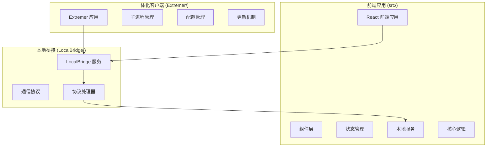
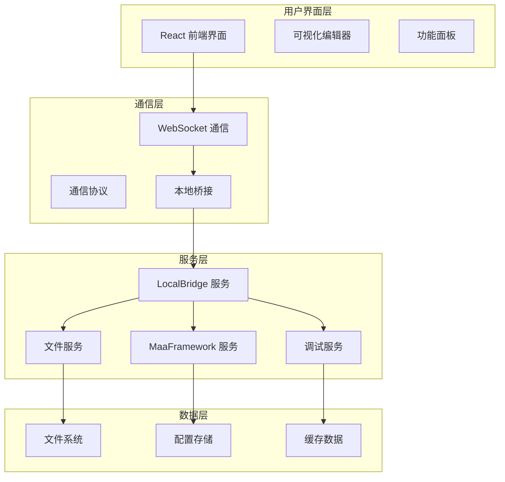
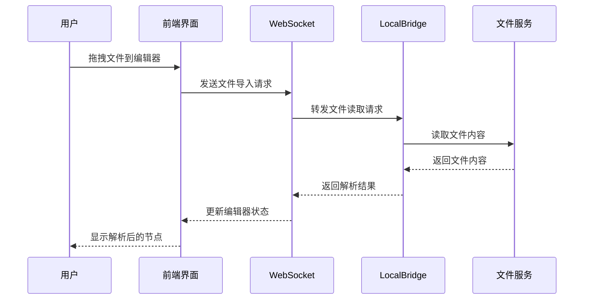
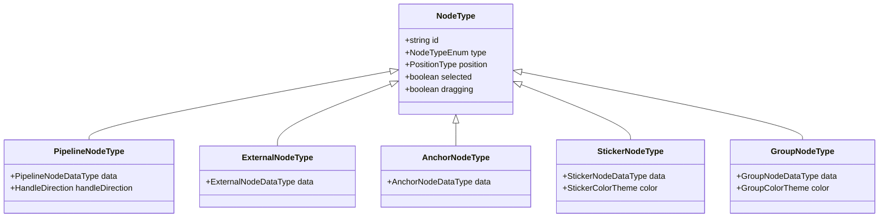
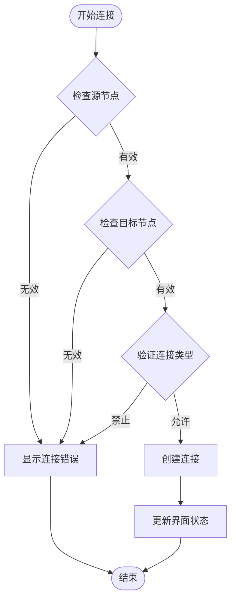
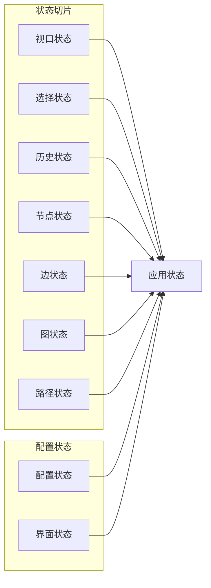
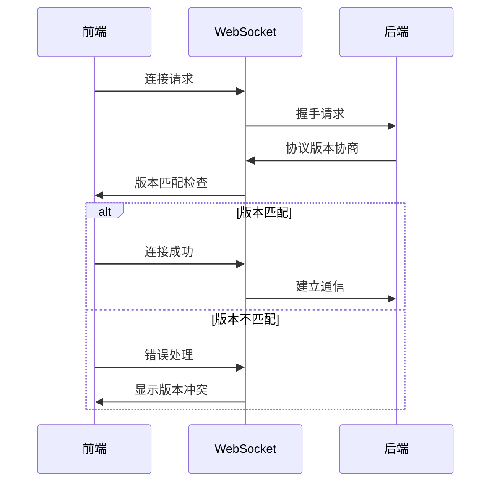
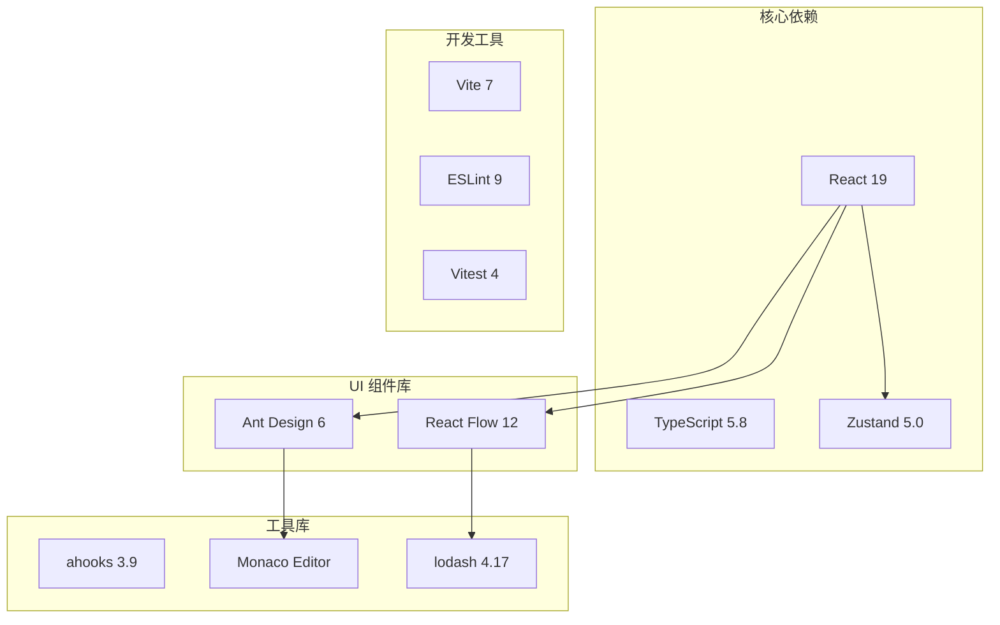
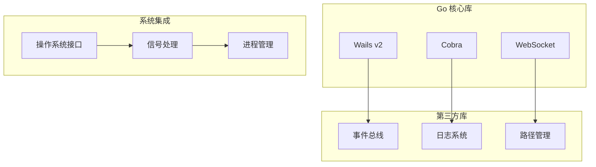
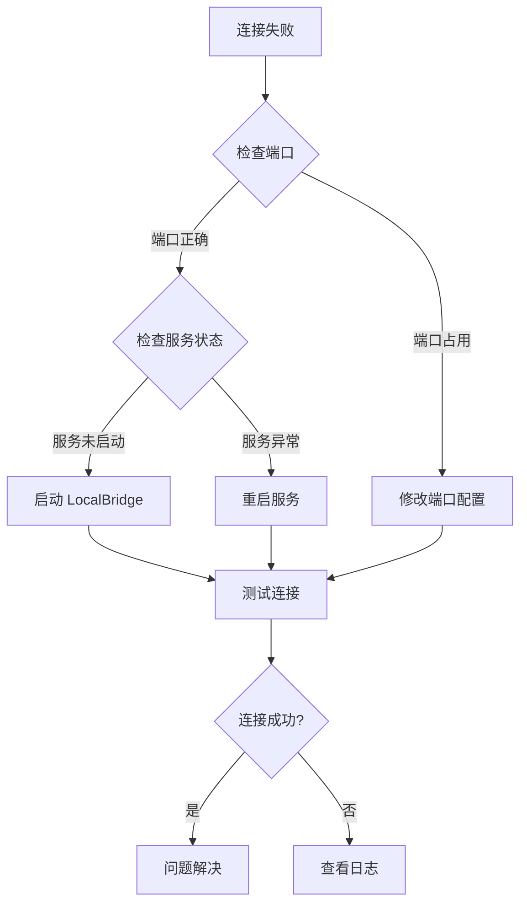

# Pipeline Editor

<cite>
**本文档引用的文件**
- [README.md](file://README.md)
- [package.json](file://package.json)
- [src/App.tsx](file://src/App.tsx)
- [src/main.tsx](file://src/main.tsx)
- [src/components/Flow.tsx](file://src/components/Flow.tsx)
- [src/core/parser/index.ts](file://src/core/parser/index.ts)
- [src/services/server.ts](file://src/services/server.ts)
- [src/stores/flow/types.ts](file://src/stores/flow/types.ts)
- [src/stores/configStore.ts](file://src/stores/configStore.ts)
- [src/components/flow/nodes/constants.ts](file://src/components/flow/nodes/constants.ts)
- [src/core/fields/fieldTypes.ts](file://src/core/fields/fieldTypes.ts)
- [Extremer/app.go](file://Extremer/app.go)
- [Extremer/internal/bridge/subprocess.go](file://Extremer/internal/bridge/subprocess.go)
- [LocalBridge/cmd/lb/main.go](file://LocalBridge/cmd/lb/main.go)
- [LocalBridge/internal/protocol/file/file_handler.go](file://LocalBridge/internal/protocol/file/file_handler.go)
</cite>

## 目录
1. [简介](#简介)
2. [项目结构](#项目结构)
3. [核心组件](#核心组件)
4. [架构概览](#架构概览)
5. [详细组件分析](#详细组件分析)
6. [依赖关系分析](#依赖关系分析)
7. [性能考虑](#性能考虑)
8. [故障排除指南](#故障排除指南)
9. [结论](#结论)

## 简介

MaaPipelineEditor (MPE) 是一款基于 React 和 Go 技术栈开发的可视化 Pipeline 编辑器，专为 MaaFramework 设计。该项目采用前后端分离架构，提供了完整的 Pipeline 可视化编辑、调试、分享功能。

### 主要特性

- **可视化编辑**：基于 React Flow 的节点拖拽编辑器
- **多格式支持**：支持 Pipeline JSON 和 JSONC 格式
- **本地服务集成**：通过 LocalBridge 提供文件管理和调试功能
- **AI 辅助**：集成智能节点搜索和补全功能
- **跨平台支持**：支持 Windows、macOS 和 Linux 平台
- **实时预览**：支持实时屏幕预览和调试

## 项目结构

项目采用模块化的组织方式，主要分为以下几个核心部分：

**图表来源**
- [src/main.tsx:1-18](file://src/main.tsx#L1-L18)
- [Extremer/app.go:1-620](file://Extremer/app.go#L1-L620)
- [LocalBridge/cmd/lb/main.go:1-882](file://LocalBridge/cmd/lb/main.go#L1-L882)

**章节来源**
- [README.md:31-151](file://README.md#L31-L151)
- [package.json:1-66](file://package.json#L1-L66)

## 核心组件

### 前端应用架构

前端应用基于 React 19 和 TypeScript 构建，采用模块化的设计模式：

#### 应用入口
- **App.tsx**: 主应用组件，负责全局状态管理和组件协调
- **main.tsx**: 应用启动入口，初始化 WebSocket 服务

#### 核心功能模块
- **Flow 组件**: 基于 React Flow 的可视化编辑器
- **解析器模块**: Pipeline 格式转换和验证
- **状态管理**: 基于 Zustand 的状态管理系统
- **服务层**: WebSocket 通信和本地服务集成

**章节来源**
- [src/App.tsx:111-333](file://src/App.tsx#L111-L333)
- [src/main.tsx:1-18](file://src/main.tsx#L1-L18)

### 本地服务架构

LocalBridge 是一个独立的 Go 服务，提供文件管理和调试功能：

#### 服务组件
- **WebSocket 服务器**: 与前端建立实时通信
- **文件协议处理器**: 处理文件读写操作
- **MFW 协议处理器**: 管理 MaaFramework 服务
- **事件总线**: 处理系统事件和通知

**章节来源**
- [LocalBridge/cmd/lb/main.go:182-440](file://LocalBridge/cmd/lb/main.go#L182-L440)

### 一体化客户端

Extremer 是一个基于 Wails 的桌面应用程序，集成了 LocalBridge 服务：

#### 核心功能
- **子进程管理**: 自动启动和管理 LocalBridge
- **配置管理**: 提供图形化配置界面
- **端口分配**: 自动分配和管理服务端口
- **日志管理**: 集成的日志查看和管理功能

**章节来源**
- [Extremer/app.go:181-475](file://Extremer/app.go#L181-L475)

## 架构概览

系统采用三层架构设计，实现了前后端分离和本地服务集成：

**图表来源**
- [src/services/server.ts:20-373](file://src/services/server.ts#L20-L373)
- [Extremer/internal/bridge/subprocess.go:12-132](file://Extremer/internal/bridge/subprocess.go#L12-L132)

### 数据流架构

**图表来源**
- [src/App.tsx:115-140](file://src/App.tsx#L115-L140)
- [LocalBridge/internal/protocol/file/file_handler.go:67-137](file://LocalBridge/internal/protocol/file/file_handler.go#L67-L137)

## 详细组件分析

### 可视化编辑器组件

Flow 组件是整个应用的核心，基于 React Flow 实现了强大的可视化编辑功能：

#### 节点类型系统

**图表来源**
- [src/stores/flow/types.ts:165-235](file://src/stores/flow/types.ts#L165-L235)
- [src/components/flow/nodes/constants.ts:14-20](file://src/components/flow/nodes/constants.ts#L14-L20)

#### 连接系统

编辑器支持多种连接模式和验证机制：

**图表来源**
- [src/components/Flow.tsx:264-323](file://src/components/Flow.tsx#L264-L323)

**章节来源**
- [src/components/Flow.tsx:195-616](file://src/components/Flow.tsx#L195-L616)

### 状态管理系统

应用采用 Zustand 实现轻量级状态管理：

#### 状态切片设计

**图表来源**
- [src/stores/flow/types.ts:247-362](file://src/stores/flow/types.ts#L247-L362)

**章节来源**
- [src/stores/flow/types.ts:1-362](file://src/stores/flow/types.ts#L1-L362)

### 通信协议系统

WebSocket 通信协议经过精心设计，支持多种消息类型和错误处理：

#### 协议版本管理

**图表来源**
- [src/services/server.ts:40-65](file://src/services/server.ts#L40-L65)

**章节来源**
- [src/services/server.ts:1-373](file://src/services/server.ts#L1-L373)

### 字段系统

应用支持丰富的字段类型，满足不同节点的需求：

#### 字段类型体系

| 字段类型 | 描述 | 示例用途 |
|---------|------|----------|
| int | 整数类型 | 延迟时间、索引值 |
| string | 字符串类型 | 路径、标识符 |
| bool | 布尔类型 | 开关、标志位 |
| list<string> | 字符串列表 | 资源路径、标签 |
| array<int, 4> | 坐标数组 | ROI 区域、位置信息 |
| image_path | 图片路径 | 模板图片、资源文件 |

**章节来源**
- [src/core/fields/fieldTypes.ts:1-27](file://src/core/fields/fieldTypes.ts#L1-L27)

## 依赖关系分析

### 前端依赖架构

**图表来源**
- [package.json:20-42](file://package.json#L20-L42)

### 后端依赖架构

**图表来源**
- [LocalBridge/cmd/lb/main.go:3-35](file://LocalBridge/cmd/lb/main.go#L3-L35)

**章节来源**
- [package.json:1-66](file://package.json#L1-L66)

## 性能考虑

### 前端性能优化

1. **虚拟化渲染**: 大型节点列表采用虚拟化技术
2. **状态隔离**: 使用 Zustand 实现细粒度状态管理
3. **懒加载**: 组件按需加载，减少初始包大小
4. **缓存策略**: 本地文件内容和配置缓存

### 后端性能优化

1. **连接池管理**: WebSocket 连接复用和池化
2. **异步处理**: 文件操作和网络请求异步化
3. **内存管理**: 及时释放不再使用的资源
4. **并发控制**: 限制同时处理的请求数量

## 故障排除指南

### 常见问题诊断

#### 连接问题

#### 版本兼容性问题

1. **协议版本不匹配**: 检查前端和后端协议版本
2. **MaaFramework 版本**: 确认 MFW 库版本兼容性
3. **配置文件格式**: 验证 JSON/JSONC 格式正确性

**章节来源**
- [src/services/server.ts:104-251](file://src/services/server.ts#L104-L251)

### 调试工具

应用提供了完善的调试功能：

1. **实时日志**: WebSocket 连接状态和错误日志
2. **节点调试**: 单个节点的执行状态监控
3. **性能分析**: 编辑器性能指标监控
4. **配置验证**: 自动检测配置错误

## 结论

MaaPipelineEditor 是一个设计精良的可视化 Pipeline 编辑器，具有以下特点：

### 技术优势

- **架构清晰**: 前后端分离，职责明确
- **扩展性强**: 模块化设计，易于功能扩展
- **用户体验佳**: 直观的可视化编辑和丰富的辅助功能
- **跨平台支持**: 完整的多平台部署方案

### 应用价值

该编辑器特别适合 MaaFramework 资源开发者，提供了：
- 高效的 Pipeline 构建和编辑体验
- 强大的本地服务集成能力
- 智能的 AI 辅助功能
- 完善的调试和分享工具

### 发展方向

未来可以考虑的功能增强：
- 更丰富的节点类型和模板
- 更强大的 AI 辅助功能
- 更好的团队协作支持
- 更完善的性能监控和分析工具