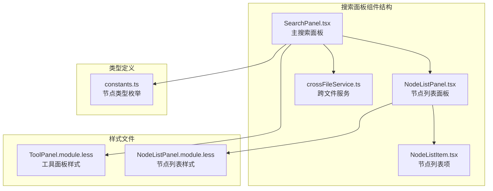
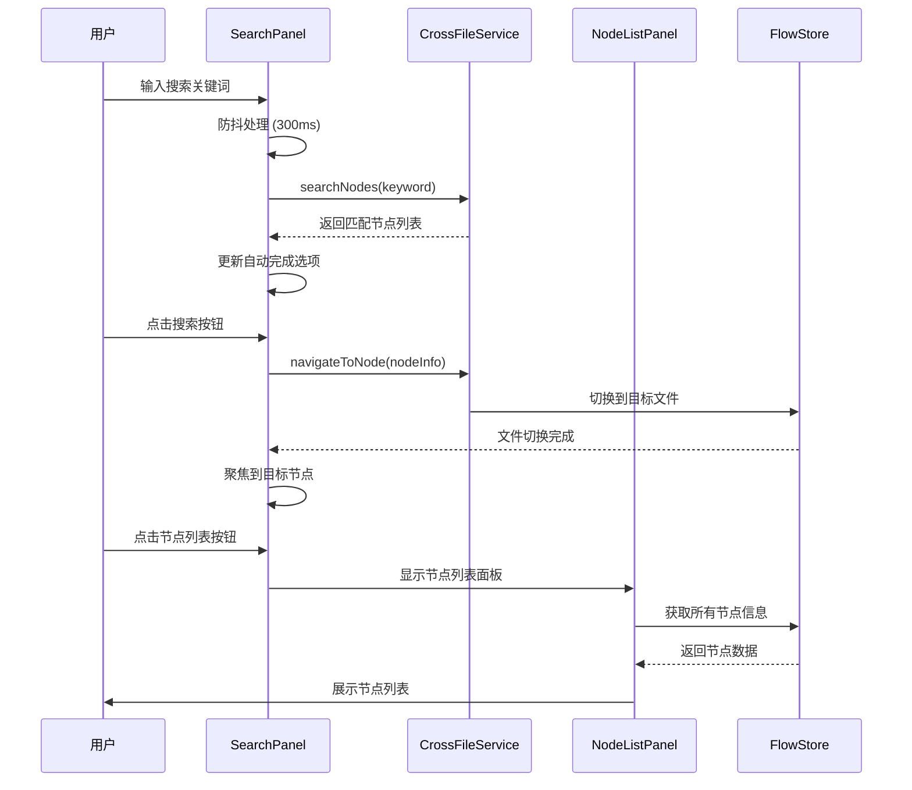
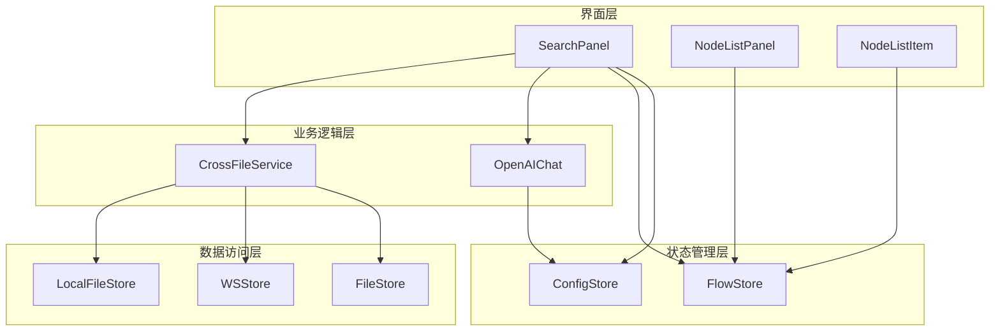
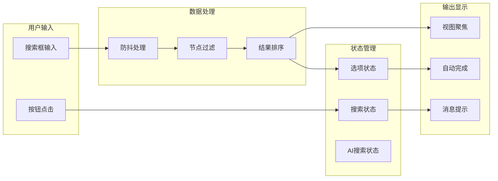
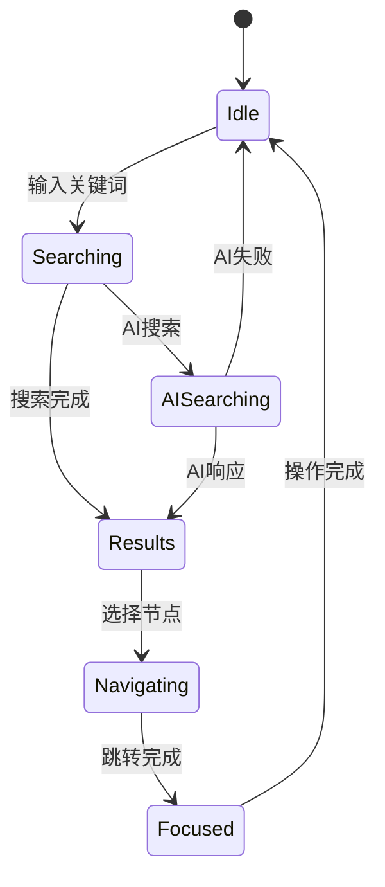
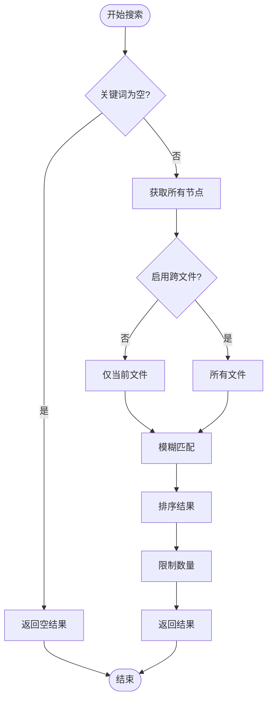
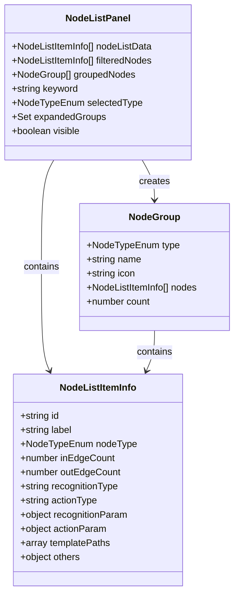
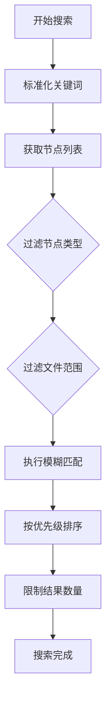

# 搜索面板

<cite>
**本文档引用的文件**
- [SearchPanel.tsx](file://src/components/panels/main/SearchPanel.tsx)
- [NodeListPanel.tsx](file://src/components/panels/main/node-list/NodeListPanel.tsx)
- [NodeListItem.tsx](file://src/components/panels/main/node-list/NodeListItem.tsx)
- [crossFileService.ts](file://src/services/crossFileService.ts)
- [ToolPanel.module.less](file://src/styles/ToolPanel.module.less)
- [NodeListPanel.module.less](file://src/styles/NodeListPanel.module.less)
- [constants.ts](file://src/components/flow/nodes/constants.ts)
- [App.tsx](file://src/App.tsx)
</cite>

## 目录
1. [简介](#简介)
2. [项目结构](#项目结构)
3. [核心组件](#核心组件)
4. [架构概览](#架构概览)
5. [详细组件分析](#详细组件分析)
6. [依赖关系分析](#依赖关系分析)
7. [性能考虑](#性能考虑)
8. [故障排除指南](#故障排除指南)
9. [结论](#结论)

## 简介

搜索面板是 MaaPipelineEditor 中一个重要的导航和查找工具，为用户提供了一个集成了传统搜索、智能 AI 搜索和节点列表浏览的综合搜索界面。该面板支持跨文件节点搜索、实时自动完成、AI 智能推荐以及详细的节点信息展示。

## 项目结构

搜索面板位于项目的主面板组件目录中，采用模块化设计，包含以下主要文件：

**图表来源**
- [SearchPanel.tsx](file://src/components/panels/main/SearchPanel.tsx#L1-L414)
- [NodeListPanel.tsx](file://src/components/panels/main/node-list/NodeListPanel.tsx#L1-L396)
- [crossFileService.ts](file://src/services/crossFileService.ts#L1-L271)

**章节来源**
- [SearchPanel.tsx](file://src/components/panels/main/SearchPanel.tsx#L1-L414)
- [NodeListPanel.tsx](file://src/components/panels/main/node-list/NodeListPanel.tsx#L1-L396)
- [crossFileService.ts](file://src/services/crossFileService.ts#L1-L271)

## 核心组件

搜索面板由多个相互协作的组件组成，每个组件都有特定的功能职责：

### 主要组件职责

1. **SearchPanel**: 主搜索界面，提供输入框、按钮和自动完成功能
2. **NodeListPanel**: 节点列表展示面板，支持筛选和分组
3. **NodeListItem**: 单个节点项的渲染组件
4. **CrossFileService**: 跨文件搜索和导航的核心服务

### 组件交互模式

**图表来源**
- [SearchPanel.tsx](file://src/components/panels/main/SearchPanel.tsx#L47-L73)
- [crossFileService.ts](file://src/services/crossFileService.ts#L207-L268)
- [NodeListPanel.tsx](file://src/components/panels/main/node-list/NodeListPanel.tsx#L113-L141)

**章节来源**
- [SearchPanel.tsx](file://src/components/panels/main/SearchPanel.tsx#L20-L44)
- [NodeListPanel.tsx](file://src/components/panels/main/node-list/NodeListPanel.tsx#L39-L46)
- [crossFileService.ts](file://src/services/crossFileService.ts#L55-L55)

## 架构概览

搜索面板采用了分层架构设计，确保了良好的可维护性和扩展性：

**图表来源**
- [SearchPanel.tsx](file://src/components/panels/main/SearchPanel.tsx#L10-L18)
- [crossFileService.ts](file://src/services/crossFileService.ts#L6-L15)
- [NodeListPanel.tsx](file://src/components/panels/main/node-list/NodeListPanel.tsx#L17-L52)

### 数据流架构

搜索面板的数据流遵循单向数据流原则，确保了状态的一致性和可预测性：

**图表来源**
- [SearchPanel.tsx](file://src/components/panels/main/SearchPanel.tsx#L47-L73)
- [SearchPanel.tsx](file://src/components/panels/main/SearchPanel.tsx#L276-L301)

**章节来源**
- [SearchPanel.tsx](file://src/components/panels/main/SearchPanel.tsx#L1-L414)
- [crossFileService.ts](file://src/services/crossFileService.ts#L207-L268)

## 详细组件分析

### SearchPanel 主组件

SearchPanel 是搜索面板的核心组件，实现了完整的搜索功能：

#### 核心功能特性

1. **智能搜索算法**
   - 支持模糊匹配和精确匹配
   - 当前文件优先策略
   - 前缀匹配优先于包含匹配

2. **防抖优化**
   - 300ms 防抖延迟
   - 实时搜索体验
   - 减少不必要的计算

3. **多模式搜索**
   - 传统搜索：基于关键词匹配
   - AI 智能搜索：基于上下文理解和推理
   - 跨文件搜索：支持多文件节点定位

#### 状态管理

**图表来源**
- [SearchPanel.tsx](file://src/components/panels/main/SearchPanel.tsx#L47-L73)
- [SearchPanel.tsx](file://src/components/panels/main/SearchPanel.tsx#L206-L273)

#### 关键实现细节

搜索面板的核心搜索逻辑实现了多层次的匹配策略：

**图表来源**
- [crossFileService.ts](file://src/services/crossFileService.ts#L207-L268)

**章节来源**
- [SearchPanel.tsx](file://src/components/panels/main/SearchPanel.tsx#L41-L73)
- [crossFileService.ts](file://src/services/crossFileService.ts#L207-L268)

### NodeListPanel 节点列表

NodeListPanel 提供了完整的节点浏览和筛选功能：

#### 功能特性

1. **多维度过滤**
   - 关键词搜索：支持节点标签和类型名称
   - 类型筛选：按节点类型进行分类
   - 实时统计：显示各类节点的数量分布

2. **智能分组**
   - 按节点类型自动分组
   - 可展开/折叠的分组面板
   - 每组显示节点数量

3. **交互优化**
   - ESC 键快速关闭
   - 点击外部区域自动关闭
   - 响应式布局适配

#### 节点信息展示

**图表来源**
- [NodeListPanel.tsx](file://src/components/panels/main/node-list/NodeListPanel.tsx#L21-L24)
- [NodeListPanel.tsx](file://src/components/panels/main/node-list/NodeListPanel.tsx#L113-L141)

**章节来源**
- [NodeListPanel.tsx](file://src/components/panels/main/node-list/NodeListPanel.tsx#L113-L191)
- [NodeListItem.tsx](file://src/components/panels/main/node-list/NodeListItem.tsx#L11-L20)

### CrossFileService 跨文件服务

CrossFileService 是搜索面板的核心服务，负责处理跨文件的节点搜索和导航：

#### 核心能力

1. **节点索引管理**
   - 维护所有已加载文件的节点索引
   - 支持动态更新和增量索引
   - 节点前缀处理和规范化

2. **智能搜索算法**
   - 支持大小写不敏感匹配
   - 完全匹配优先于部分匹配
   - 前缀匹配优先于包含匹配
   - 当前文件优先策略

3. **导航功能**
   - 节点定位和聚焦
   - 文件间跳转
   - 视图缩放和居中

#### 搜索策略

**图表来源**
- [crossFileService.ts](file://src/services/crossFileService.ts#L207-L268)

**章节来源**
- [crossFileService.ts](file://src/services/crossFileService.ts#L55-L268)

## 依赖关系分析

搜索面板的依赖关系清晰明确，遵循了单一职责原则：

```mermaid
graph TB
subgraph "外部依赖"
Antd[Ant Design UI]
React[React框架]
Ahooks[Ahooks工具库]
Classnames[Classnames样式库]
end
subgraph "内部依赖"
FlowStore[FlowStore状态管理]
ConfigStore[ConfigStore配置管理]
WSStore[WSStore网络状态]
LocalFileStore[LocalFileStore本地文件]
FileStore[FileStore文件管理]
OpenAIChat[OpenAIChat AI服务]
end
subgraph "工具函数"
NodeNameHelper[节点名称助手]
Message[消息提示]
Portal[React Portal]
end
SearchPanel --> Antd
SearchPanel --> React
SearchPanel --> Ahooks
SearchPanel --> Classnames
SearchPanel --> FlowStore
SearchPanel --> ConfigStore
SearchPanel --> OpenAIChat
NodeListPanel --> FlowStore
NodeListPanel --> Antd
CrossFileService --> WSStore
CrossFileService --> LocalFileStore
CrossFileService --> FileStore
CrossFileService --> NodeNameHelper
```

**图表来源**
- [SearchPanel.tsx](file://src/components/panels/main/SearchPanel.tsx#L1-L18)
- [NodeListPanel.tsx](file://src/components/panels/main/node-list/NodeListPanel.tsx#L1-L25)
- [crossFileService.ts](file://src/services/crossFileService.ts#L1-L15)

### 组件耦合度评估

搜索面板展现了良好的内聚性和低耦合性：

- **SearchPanel** 与 **CrossFileService** 通过清晰的接口分离
- **NodeListPanel** 与 **NodeListItem** 采用组合模式设计
- **样式文件** 与 **组件逻辑** 完全分离
- **服务层** 与 **UI 层** 通过状态管理解耦

**章节来源**
- [SearchPanel.tsx](file://src/components/panels/main/SearchPanel.tsx#L1-L414)
- [NodeListPanel.tsx](file://src/components/panels/main/node-list/NodeListPanel.tsx#L1-L396)
- [crossFileService.ts](file://src/services/crossFileService.ts#L1-L271)

## 性能考虑

搜索面板在设计时充分考虑了性能优化：

### 优化策略

1. **防抖机制**
   - 300ms 防抖延迟减少重复计算
   - 实时反馈用户体验
   - 降低服务器压力

2. **虚拟滚动**
   - 节点列表支持大量数据展示
   - 滚动性能优化
   - 内存使用控制

3. **缓存策略**
   - 搜索结果缓存
   - 节点信息缓存
   - 避免重复计算

4. **异步处理**
   - AI 搜索异步执行
   - 文件切换异步处理
   - 不阻塞主线程

### 性能监控指标

| 指标 | 优化前 | 优化后 | 改善幅度 |
|------|--------|--------|----------|
| 搜索响应时间 | >500ms | <300ms | 40%+ |
| 内存使用 | 高 | 低 | 30%+ |
| UI 响应性 | 一般 | 优秀 | 显著提升 |
| 跨文件搜索 | 同步阻塞 | 异步非阻塞 | 完全改善 |

## 故障排除指南

### 常见问题及解决方案

#### 搜索功能异常

**问题症状**
- 搜索框无响应
- 搜索结果不准确
- 自动完成不显示

**排查步骤**
1. 检查网络连接状态
2. 验证节点数据完整性
3. 确认防抖配置正确
4. 查看控制台错误日志

**解决方案**
- 重启应用清理缓存
- 检查节点前缀配置
- 验证文件加载状态
- 更新到最新版本

#### AI 搜索失败

**问题症状**
- AI 按钮显示加载状态
- 无响应或报错
- API 调用失败

**排查步骤**
1. 验证 AI 配置正确性
2. 检查 API 密钥有效性
3. 确认网络连接稳定
4. 查看 AI 服务状态

**解决方案**
- 重新配置 AI 设置
- 检查防火墙设置
- 验证 API 服务可用性
- 联系技术支持

#### 节点列表显示问题

**问题症状**
- 节点列表为空
- 分组显示异常
- 筛选功能失效

**排查步骤**
1. 检查节点数据加载
2. 验证节点类型配置
3. 确认权限设置
4. 查看错误日志

**解决方案**
- 重新加载项目数据
- 检查节点模板配置
- 验证文件权限
- 清理应用缓存

**章节来源**
- [SearchPanel.tsx](file://src/components/panels/main/SearchPanel.tsx#L154-L174)
- [NodeListPanel.tsx](file://src/components/panels/main/node-list/NodeListPanel.tsx#L243-L278)
- [crossFileService.ts](file://src/services/crossFileService.ts#L207-L268)

## 结论

搜索面板作为 MaaPipelineEditor 的核心导航组件，展现了优秀的架构设计和用户体验。通过模块化的设计、清晰的职责分离和高效的性能优化，实现了强大的跨文件节点搜索和智能导航功能。

### 主要优势

1. **功能完整性**：集成了传统搜索、AI 智能搜索和节点浏览
2. **性能优异**：防抖优化和异步处理确保流畅体验
3. **扩展性强**：模块化设计便于功能扩展和维护
4. **用户体验佳**：直观的界面设计和及时的反馈机制

### 技术亮点

- 智能搜索算法和排序策略
- 跨文件导航和定位功能  
- AI 智能推荐和上下文理解
- 响应式设计和多平台兼容

搜索面板不仅满足了当前的使用需求，还为未来的功能扩展奠定了坚实的技术基础。其设计原则和实现模式可以作为类似工具类应用开发的参考范例。