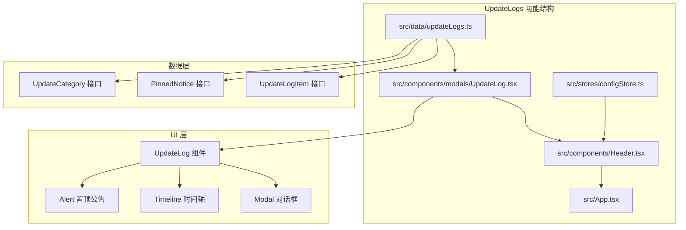
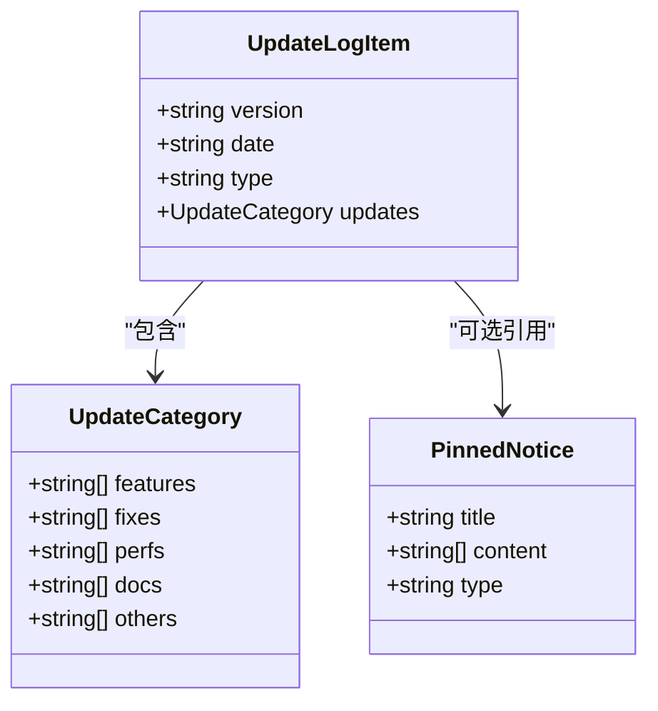
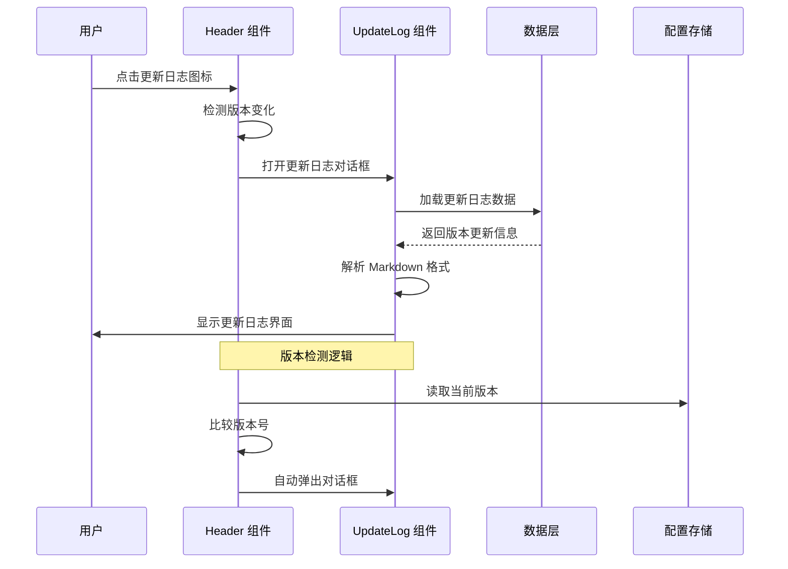
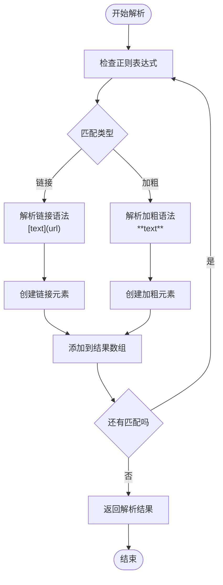
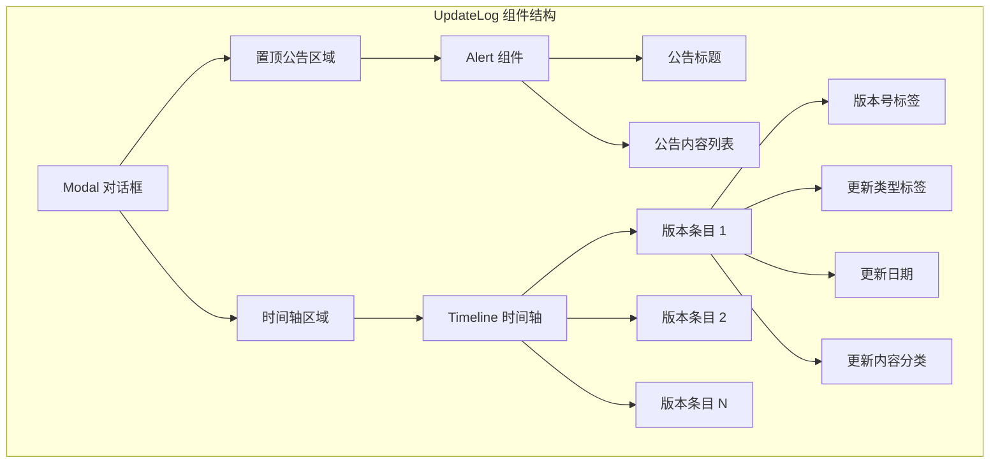
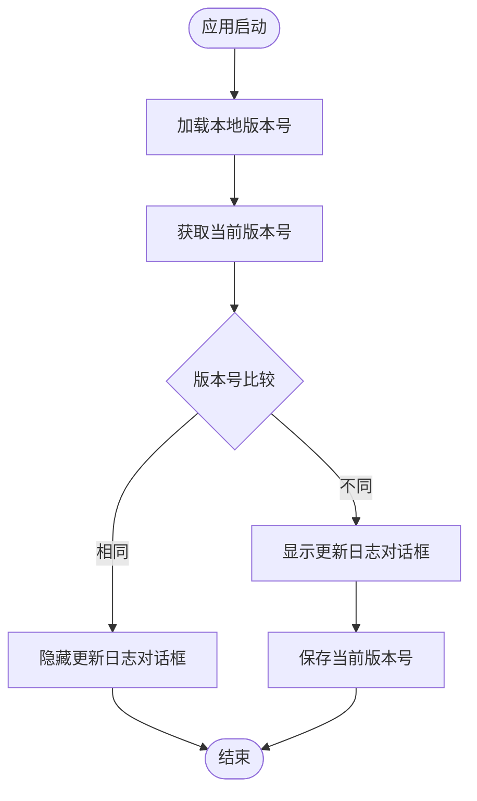
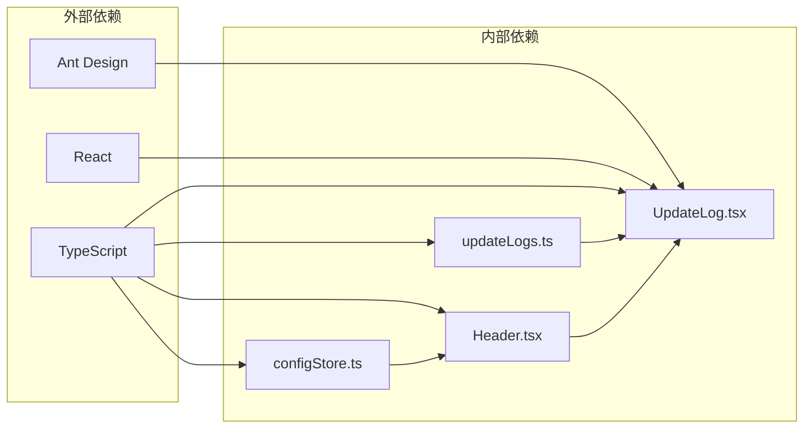

# UpdateLogs 更新日志功能文档

<cite>
**本文档引用的文件**
- [updateLogs.ts](file://src/data/updateLogs.ts)
- [UpdateLog.tsx](file://src/components/modals/UpdateLog.tsx)
- [Header.tsx](file://src/components/Header.tsx)
- [configStore.ts](file://src/stores/configStore.ts)
- [App.tsx](file://src/App.tsx)
</cite>

## 目录
1. [简介](#简介)
2. [项目结构](#项目结构)
3. [核心组件](#核心组件)
4. [架构概览](#架构概览)
5. [详细组件分析](#详细组件分析)
6. [依赖关系分析](#依赖关系分析)
7. [性能考虑](#性能考虑)
8. [故障排除指南](#故障排除指南)
9. [结论](#结论)

## 简介

UpdateLogs 是 MaaPipelineEditor 项目中的更新日志功能模块，负责展示应用程序的历史版本更新信息和重要公告。该功能采用现代化的设计理念，提供了直观的可视化界面，让用户能够轻松了解软件的功能演进历程。

该功能的核心特点包括：
- **版本化更新管理**：按照时间顺序展示各个版本的更新内容
- **多维度分类**：将更新内容分为新功能、问题修复、体验优化等多个类别
- **智能触发机制**：在版本升级时自动弹出更新日志对话框
- **Markdown 支持**：支持基本的 Markdown 语法渲染，包括链接和加粗文本
- **置顶公告系统**：提供重要的全局公告展示功能

## 项目结构

UpdateLogs 功能在项目中的组织结构如下：

**图表来源**
- [updateLogs.ts](file://src/data/updateLogs.ts#L1-L635)
- [UpdateLog.tsx](file://src/components/modals/UpdateLog.tsx#L1-L246)

**章节来源**
- [updateLogs.ts](file://src/data/updateLogs.ts#L1-L635)
- [UpdateLog.tsx](file://src/components/modals/UpdateLog.tsx#L1-L246)

## 核心组件

### 数据模型设计

UpdateLogs 功能基于三个核心接口构建：

#### UpdateLogItem 接口
这是更新日志的主要数据结构，包含版本信息和更新内容：

**图表来源**
- [updateLogs.ts](file://src/data/updateLogs.ts#L28-L33)
- [updateLogs.ts](file://src/data/updateLogs.ts#L13-L19)
- [updateLogs.ts](file://src/data/updateLogs.ts#L4-L8)

#### 更新类型系统
系统支持四种更新类型，每种类型都有特定的颜色标识和中文标签：

| 类型代码 | 英文名称 | 中文标签 | 颜色 |
|---------|----------|----------|------|
| major | Major Update | 重大更新 | red |
| feature | New Feature | 新功能 | blue |
| fix | Bug Fix | 修复 | orange |
| perf | Performance | 优化 | green |

**章节来源**
- [updateLogs.ts](file://src/data/updateLogs.ts#L28-L33)
- [UpdateLog.tsx](file://src/components/modals/UpdateLog.tsx#L63-L91)

## 架构概览

UpdateLogs 功能采用分层架构设计，实现了清晰的关注点分离：

**图表来源**
- [Header.tsx](file://src/components/Header.tsx#L267-L277)
- [UpdateLog.tsx](file://src/components/modals/UpdateLog.tsx#L13-L246)

## 详细组件分析

### UpdateLog 组件实现

UpdateLog 组件是整个功能的核心，负责渲染更新日志界面：

#### Markdown 解析引擎
组件内置了一个轻量级的 Markdown 解析器，支持以下语法：
- **加粗文本**：使用双星号包围的文本
- **超链接**：使用 `[文本](URL)` 语法

**图表来源**
- [UpdateLog.tsx](file://src/components/modals/UpdateLog.tsx#L15-L61)

#### 界面渲染策略
组件采用分层渲染策略，首先显示置顶公告，然后展示完整的更新历史：

**图表来源**
- [UpdateLog.tsx](file://src/components/modals/UpdateLog.tsx#L146-L242)

**章节来源**
- [UpdateLog.tsx](file://src/components/modals/UpdateLog.tsx#L1-L246)

### Header 集成机制

Header 组件负责管理 UpdateLog 组件的生命周期和触发条件：

#### 版本检测逻辑
组件通过比较本地存储的版本号与当前版本来决定是否显示更新日志：

**图表来源**
- [Header.tsx](file://src/components/Header.tsx#L267-L277)

**章节来源**
- [Header.tsx](file://src/components/Header.tsx#L226-L277)

### 数据管理策略

updateLogs.ts 文件包含了完整的更新历史数据，采用静态数据管理方式：

#### 数据结构特点
- **类型安全**：使用 TypeScript 接口确保数据完整性
- **扩展性**：支持未来版本的无缝扩展
- **国际化**：所有文本内容均为中文，符合目标用户需求
- **维护性**：结构化的数据组织便于维护和更新

**章节来源**
- [updateLogs.ts](file://src/data/updateLogs.ts#L49-L635)

## 依赖关系分析

UpdateLogs 功能的依赖关系相对简单，主要依赖于 Ant Design 组件库：

**图表来源**
- [UpdateLog.tsx](file://src/components/modals/UpdateLog.tsx#L1-L4)
- [configStore.ts](file://src/stores/configStore.ts#L5-L11)

### 组件耦合度分析

UpdateLogs 功能展现了良好的低耦合设计：
- **数据与界面分离**：数据层和 UI 层职责明确
- **单一职责原则**：每个组件都有明确的功能边界
- **可测试性**：组件结构简单，易于单元测试

**章节来源**
- [UpdateLog.tsx](file://src/components/modals/UpdateLog.tsx#L1-L246)
- [Header.tsx](file://src/components/Header.tsx#L1-L424)

## 性能考虑

### 渲染性能优化
- **虚拟滚动**：对于大量更新记录的情况，可考虑实现虚拟滚动
- **懒加载**：更新日志对话框采用按需加载，避免不必要的渲染
- **内存管理**：组件卸载时自动清理事件监听器

### 数据访问优化
- **静态数据**：更新日志数据为静态内容，无需网络请求
- **缓存策略**：版本号信息存储在本地存储中，减少重复计算

## 故障排除指南

### 常见问题及解决方案

#### 更新日志不显示
**症状**：点击更新日志图标后没有反应
**可能原因**：
1. 版本检测逻辑异常
2. 组件状态管理问题
3. 样式冲突

**解决步骤**：
1. 检查版本号比较逻辑
2. 验证组件状态更新
3. 检查 CSS 样式冲突

#### Markdown 渲染问题
**症状**：链接或加粗文本显示异常
**可能原因**：
1. 正则表达式匹配错误
2. DOM 结构创建问题
3. 样式应用失败

**解决步骤**：
1. 验证正则表达式语法
2. 检查元素创建逻辑
3. 确认样式应用正确

#### 性能问题
**症状**：更新日志对话框打开缓慢
**可能原因**：
1. 大量 DOM 操作
2. 事件监听器过多
3. 样式计算复杂

**解决步骤**：
1. 优化 DOM 操作
2. 清理事件监听器
3. 简化样式计算

**章节来源**
- [UpdateLog.tsx](file://src/components/modals/UpdateLog.tsx#L15-L61)
- [Header.tsx](file://src/components/Header.tsx#L267-L277)

## 结论

UpdateLogs 功能展现了优秀的软件工程实践，具有以下突出特点：

### 设计优势
- **简洁明了**：界面设计直观易懂，用户体验良好
- **功能完整**：涵盖了版本更新展示的所有核心需求
- **扩展性强**：数据结构设计支持未来的功能扩展
- **维护友好**：代码结构清晰，便于长期维护

### 技术亮点
- **类型安全**：完整的 TypeScript 类型定义确保代码质量
- **组件化设计**：遵循 React 组件化开发最佳实践
- **性能优化**：合理的性能考虑和优化策略
- **测试友好**：组件设计便于单元测试和集成测试

### 改进建议
1. **国际化支持**：可考虑添加多语言支持
2. **搜索功能**：为大量更新记录添加搜索过滤功能
3. **导出功能**：允许用户导出更新日志内容
4. **个性化设置**：允许用户自定义显示偏好

该功能模块为 MaaPipelineEditor 提供了完善的版本历史展示能力，是用户体验的重要组成部分。