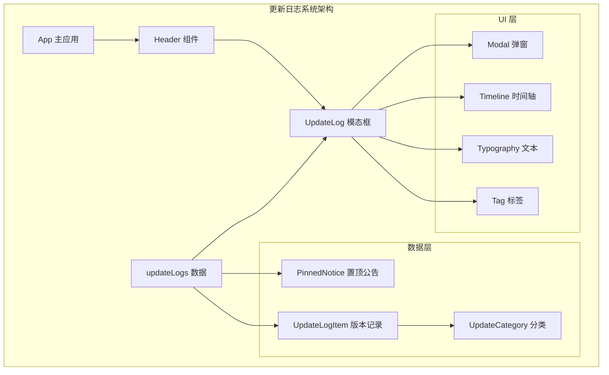
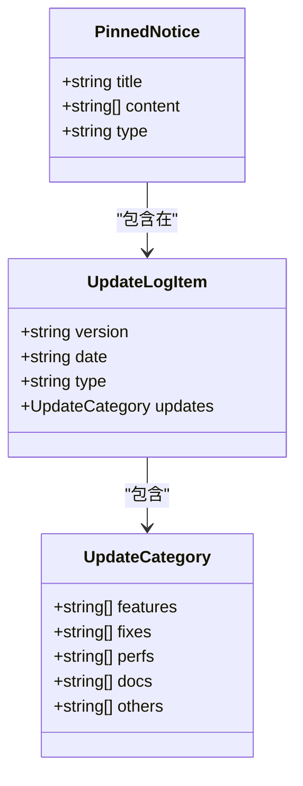
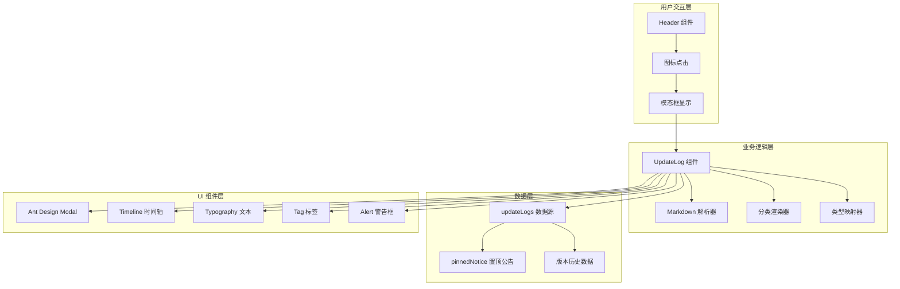
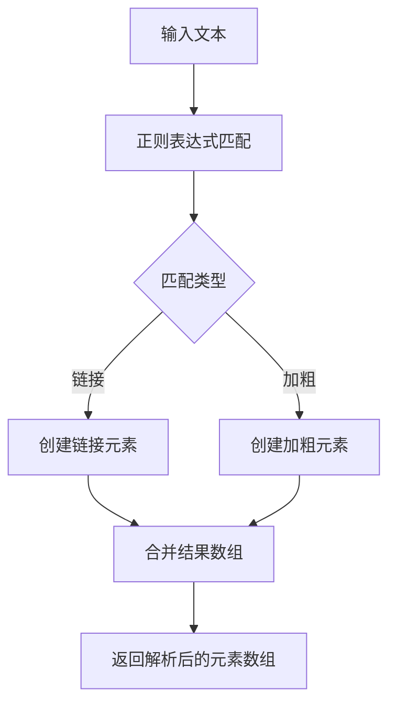
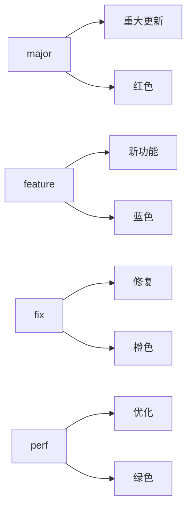
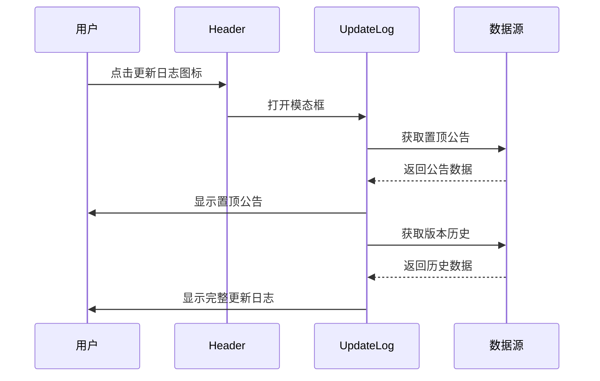
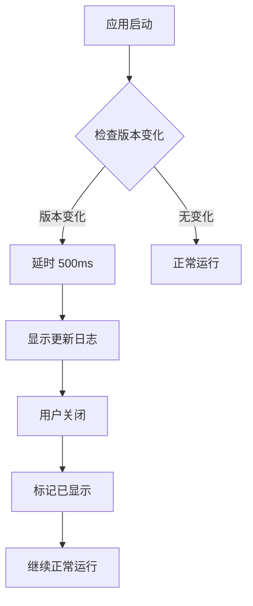
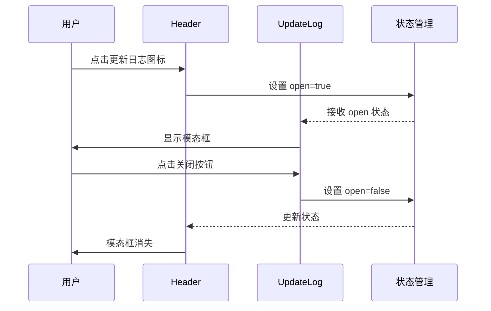
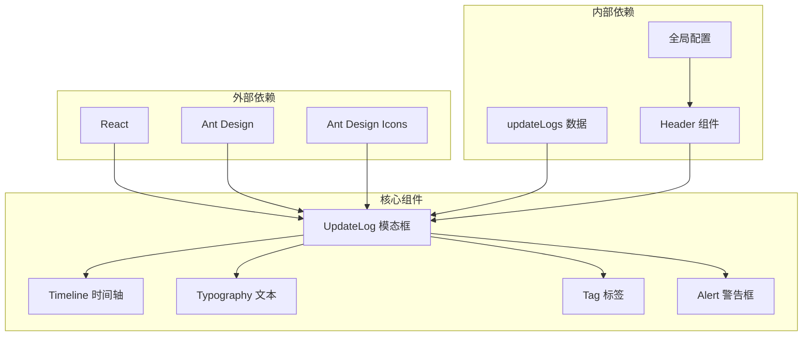
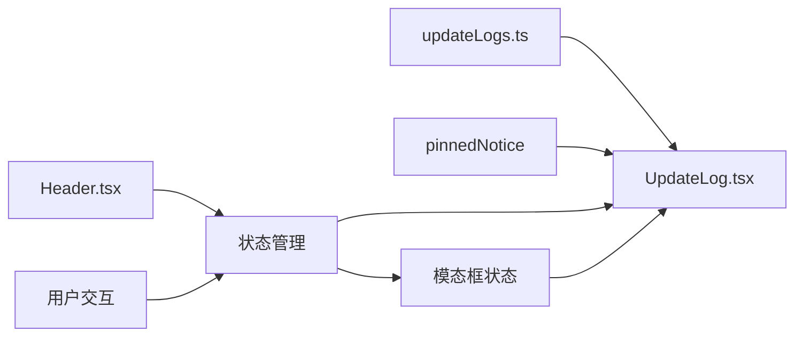

# UpdateLogs.ts

<cite>
**本文档引用的文件**
- [UpdateLog.tsx](file://src/components/modals/UpdateLog.tsx)
- [updateLogs.ts](file://src/data/updateLogs.ts)
- [Header.tsx](file://src/components/Header.tsx)
- [App.tsx](file://src/App.tsx)
</cite>

## 目录
1. [简介](#简介)
2. [项目结构](#项目结构)
3. [核心组件](#核心组件)
4. [架构概览](#架构概览)
5. [详细组件分析](#详细组件分析)
6. [依赖分析](#依赖分析)
7. [性能考虑](#性能考虑)
8. [故障排除指南](#故障排除指南)
9. [结论](#结论)

## 简介

UpdateLogs.ts 是 MaaPipelineEditor 项目中的更新日志管理系统，负责展示应用程序的历史版本更新信息和置顶公告。该系统采用现代化的 React 组件设计，结合 Ant Design UI 库，为用户提供直观的版本更新浏览体验。

该系统的核心功能包括：
- 展示完整的版本历史记录
- 实时置顶公告显示
- 多维度更新分类（新功能、问题修复、体验优化等）
- Markdown 格式支持（链接和加粗文本）
- 响应式设计和良好的用户体验

## 项目结构

更新日志系统在项目中的组织结构如下：



**图表来源**
- [UpdateLog.tsx:1-246](file://src/components/modals/UpdateLog.tsx#L1-L246)
- [updateLogs.ts:1-660](file://src/data/updateLogs.ts#L1-L660)

**章节来源**
- [UpdateLog.tsx:1-246](file://src/components/modals/UpdateLog.tsx#L1-L246)
- [updateLogs.ts:1-660](file://src/data/updateLogs.ts#L1-L660)

## 核心组件

### UpdateLog 模态框组件

UpdateLog 是一个基于 Ant Design Modal 的现代化更新日志展示组件，具有以下核心特性：

#### 主要功能
- **置顶公告显示**：展示重要通知和公告信息
- **版本历史浏览**：以时间轴形式展示所有版本更新
- **多分类内容**：支持新功能、问题修复、体验优化等分类
- **Markdown 解析**：支持链接和加粗文本格式
- **响应式设计**：适配不同屏幕尺寸

#### 组件接口
```typescript
interface UpdateLogProps {
  open: boolean;
  onClose: () => void;
}
```

#### 数据结构
系统使用强类型的数据结构来确保数据完整性：



**图表来源**
- [updateLogs.ts:28-33](file://src/data/updateLogs.ts#L28-L33)
- [updateLogs.ts:10-19](file://src/data/updateLogs.ts#L10-L19)
- [updateLogs.ts:39-47](file://src/data/updateLogs.ts#L39-L47)

**章节来源**
- [UpdateLog.tsx:8-11](file://src/components/modals/UpdateLog.tsx#L8-L11)
- [updateLogs.ts:28-33](file://src/data/updateLogs.ts#L28-L33)

## 架构概览

更新日志系统的整体架构采用分层设计，确保了良好的可维护性和扩展性：



**图表来源**
- [Header.tsx:393-414](file://src/components/Header.tsx#L393-L414)
- [UpdateLog.tsx:146-242](file://src/components/modals/UpdateLog.tsx#L146-L242)

## 详细组件分析

### UpdateLog 组件实现

#### Markdown 解析器
组件内置了高效的 Markdown 解析器，支持以下格式：
- **链接格式**：`[文本](链接地址)`
- **加粗格式**：`**加粗文本**`

解析器使用正则表达式进行高效匹配和替换：



**图表来源**
- [UpdateLog.tsx:15-61](file://src/components/modals/UpdateLog.tsx#L15-L61)

#### 分类渲染系统
系统支持四种主要的更新分类：

| 分类代码 | 中文名称 | 图标 | 颜色 |
|---------|---------|------|------|
| features | 新功能 | ✨ | 蓝色 |
| perfs | 体验优化 | 🚀 | 绿色 |
| fixes | 问题修复 | 🐞 | 橙色 |
| others | 其他更新 | 📦 | 默认 |

#### 类型映射系统
版本类型映射到中文标签和颜色：



**图表来源**
- [UpdateLog.tsx:78-91](file://src/components/modals/UpdateLog.tsx#L78-L91)

**章节来源**
- [UpdateLog.tsx:15-91](file://src/components/modals/UpdateLog.tsx#L15-L91)

### 数据管理架构

#### 置顶公告系统
置顶公告具有最高优先级，始终显示在更新日志顶部：



**图表来源**
- [Header.tsx:393-414](file://src/components/Header.tsx#L393-L414)
- [updateLogs.ts:39-47](file://src/data/updateLogs.ts#L39-L47)

#### 版本历史管理
版本历史数据采用数组结构，按时间倒序排列，最新版本位于顶部：

| 版本号 | 发布日期 | 类型 | 主要特性 |
|--------|----------|------|----------|
| 1.3.0 | 2026-3 | major | 直角走线与避让走线模式 |
| 1.2.3 | 2026-3-8 | feature | 前驱与后继关系面板 |
| 1.2.2 | 2026-3-5 | feature | WithPseudoMinimize 支持 |
| 1.2.1 | 2026-3-2 | feature | DirectHit 适配 |
| 1.2.0 | 2026-2-23 | major | 协议版本指定功能 |

**章节来源**
- [updateLogs.ts:49-660](file://src/data/updateLogs.ts#L49-L660)

### 用户交互流程

#### 自动显示机制
系统会在检测到版本更新时自动显示更新日志：



**图表来源**
- [Header.tsx:267-277](file://src/components/Header.tsx#L267-L277)

#### 手动触发机制
用户也可以随时通过头部导航栏的手动触发：



**图表来源**
- [Header.tsx:393-414](file://src/components/Header.tsx#L393-L414)
- [UpdateLog.tsx:147-156](file://src/components/modals/UpdateLog.tsx#L147-L156)

**章节来源**
- [Header.tsx:267-277](file://src/components/Header.tsx#L267-L277)
- [Header.tsx:393-414](file://src/components/Header.tsx#L393-L414)

## 依赖分析

### 组件依赖关系



**图表来源**
- [UpdateLog.tsx:1-4](file://src/components/modals/UpdateLog.tsx#L1-L4)
- [Header.tsx:24](file://src/components/Header.tsx#L24)

### 数据依赖链

系统采用单向数据流设计，确保数据的一致性和可预测性：



**图表来源**
- [updateLogs.ts:39-47](file://src/data/updateLogs.ts#L39-L47)
- [UpdateLog.tsx:3](file://src/components/modals/UpdateLog.tsx#L3)

**章节来源**
- [UpdateLog.tsx:1-4](file://src/components/modals/UpdateLog.tsx#L1-L4)
- [updateLogs.ts:39-47](file://src/data/updateLogs.ts#L39-L47)

## 性能考虑

### 渲染优化策略

1. **虚拟滚动**：对于大量历史记录，可考虑实现虚拟滚动以提升性能
2. **懒加载**：置顶公告和版本历史可实现懒加载
3. **记忆化**：Markdown 解析结果可进行缓存
4. **防抖处理**：窗口大小变化时的响应式处理

### 内存管理
- 组件卸载时自动清理事件监听器
- 状态管理采用局部状态，避免全局污染
- 图标和样式的动态加载优化

## 故障排除指南

### 常见问题及解决方案

#### 更新日志不显示
**症状**：点击更新日志图标无反应
**可能原因**：
- 版本检测逻辑异常
- 状态管理问题
- 组件渲染错误

**解决步骤**：
1. 检查版本检测逻辑（localStorage 中的版本号）
2. 验证状态管理器是否正确传递 props
3. 查看控制台错误信息

#### Markdown 格式解析失败
**症状**：链接或加粗文本显示异常
**可能原因**：
- 正则表达式匹配错误
- HTML 结构构建问题
- 样式冲突

**解决步骤**：
1. 验证正则表达式的正确性
2. 检查 React 元素的 key 属性
3. 确认样式类名的正确性

#### 性能问题
**症状**：页面加载缓慢或模态框打开卡顿
**可能原因**：
- 大量 DOM 元素渲染
- 事件监听器过多
- 样式计算复杂

**优化建议**：
1. 实现虚拟滚动
2. 减少不必要的 re-render
3. 优化 CSS 样式

**章节来源**
- [UpdateLog.tsx:15-61](file://src/components/modals/UpdateLog.tsx#L15-L61)
- [Header.tsx:267-277](file://src/components/Header.tsx#L267-L277)

## 结论

UpdateLogs.ts 系统展现了优秀的前端架构设计，通过清晰的分层结构、强类型的数据管理和优雅的用户界面，为用户提供了优质的版本更新浏览体验。

### 主要优势
1. **模块化设计**：组件职责明确，易于维护和扩展
2. **类型安全**：完整的 TypeScript 类型定义确保数据完整性
3. **用户体验**：直观的界面设计和流畅的交互体验
4. **可扩展性**：良好的架构支持未来功能扩展

### 技术亮点
- 响应式设计适配多种设备
- 高效的 Markdown 解析算法
- 智能的版本检测机制
- 灵活的分类展示系统

该系统不仅满足了当前的功能需求，更为未来的功能扩展奠定了坚实的技术基础。