# UpdateLogs.ts

<cite>
**本文档引用的文件**
- [UpdateLog.tsx](file://src/components/modals/UpdateLog.tsx)
- [updateLogs.ts](file://src/data/updateLogs.ts)
- [Header.tsx](file://src/components/Header.tsx)
- [App.tsx](file://src/App.tsx)
- [useGlobalShortcuts.ts](file://src/hooks/useGlobalShortcuts.ts)
- [FieldSortModal.tsx](file://src/components/modals/FieldSortModal.tsx)
- [configStore.ts](file://src/stores/configStore.ts)
- [PipelineConfigSection.tsx](file://src/components/panels/config/PipelineConfigSection.tsx)
- [applySort.ts](file://src/core/sorting/applySort.ts)
- [types.ts](file://src/core/sorting/types.ts)
- [defaults.ts](file://src/core/sorting/defaults.ts)
- [Flow.tsx](file://src/components/Flow.tsx)
- [NodeAddPanel.tsx](file://src/components/panels/main/NodeAddPanel.tsx)
- [AnchorNode.tsx](file://src/components/flow/nodes/AnchorNode.tsx)
- [anchorRefSlice.ts](file://src/stores/flow/slices/anchorRefSlice.ts)
- [crossFileService.ts](file://src/services/crossFileService.ts)
- [nodes.module.less](file://src/styles/nodes.module.less)
- [NodeContextMenu.tsx](file://src/components/flow/nodes/components/NodeContextMenu.tsx)
- [nodeContextMenu.tsx](file://src/components/flow/nodes/nodeContextMenu.tsx)
- [ConnectionPanel.tsx](file://src/components/panels/main/ConnectionPanel.tsx)
- [WlRootsForm.tsx](file://src/components/panels/main/connection/WlRootsForm.tsx)
- [MacOSForm.tsx](file://src/components/panels/main/connection/MacOSForm.tsx)
- [utils.ts](file://src/components/panels/main/connection/utils.ts)
- [PipelineEditor.tsx](file://src/components/panels/node-editors/PipelineEditor.tsx)
- [schema.ts](file://src/core/fields/other/schema.ts)
- [ListValueElem.tsx](file://src/components/panels/field/items/ListValueElem.tsx)
- [ParamFieldListElem.tsx](file://src/components/panels/field/items/ParamFieldListElem.tsx)
- [roiNegativeCoord.ts](file://src/utils/data/roiNegativeCoord.ts)
- [ROIModal.tsx](file://src/components/modals/ROIModal.tsx)
- [OCRModal.tsx](file://src/components/modals/OCRModal.tsx)
</cite>

## 更新摘要
**变更内容**
- 新增版本 1.4.2，包含子字段为空时占位配置项和多项性能优化
- 更新版本 1.4.1，新增 WlRoots、MacOS 控制方式和 WaitFreezes 系列 Focus 字段支持
- 更新版本 1.4.0，新增 AI 流程探索模式、Anchor 节点高亮索引与跨文件跳转功能
- 新增连接空白处功能，拖拽连接到空白处时可唤醒节点添加面板
- 新增 WaitFreezes 和 Focus 字段的智能模式检测和切换机制
- 新增跨平台设备连接支持，包括 WlRoots Wayland 合成器和 macOS 原生应用控制
- 新增模态框内全局快捷键性能优化，不再监听撤销等全局快捷键
- 新增字段面板互斥交互体验优化和右侧组件层级体验优化

## 目录
1. [简介](#简介)
2. [项目结构](#项目结构)
3. [核心组件](#核心组件)
4. [架构概览](#架构概览)
5. [详细组件分析](#详细组件分析)
6. [依赖分析](#依赖分析)
7. [性能考虑](#性能考虑)
8. [故障排除指南](#故障排除指南)
9. [结论](#结论)

## 简介

UpdateLogs.ts 是 MaaPipelineEditor 项目中的更新日志管理系统，负责展示应用程序的历史版本更新信息和置顶公告。该系统采用现代化的 React 组件设计，结合 Ant Design UI 库，为用户提供直观的版本更新浏览体验。

该系统的核心功能包括：
- 展示完整的版本历史记录，涵盖从 0.5.2 到 1.4.2 的所有版本更新
- 实时置顶公告显示，突出显示重要通知和公告信息
- 多维度更新分类（新功能、问题修复、体验优化、其他更新）
- Markdown 格式支持（链接和加粗文本）
- 响应式设计和良好的用户体验

**更新** 最新版本（1.4.2）特别强调了子字段为空时占位配置项的新增，以及多项性能优化的改进。版本 1.4.1 则重点介绍了 WlRoots Wayland 合成器控制、macOS 原生应用控制功能，以及 WaitFreezes 系列 Focus 字段支持。这些功能显著提升了用户在不同操作系统环境下的设备连接和控制体验。版本 1.4.0 则特别强调了 AI 流程探索模式、Anchor 节点高亮索引与可跨文件快捷跳转功能，以及右键节点面板可粘贴复制项的便捷操作。版本 1.3.1 则特别强调了两个重要功能的新增：自定义排序功能和连接空白处时的节点面板唤醒功能。自定义排序功能同步影响字段面板与节点渲染，确保字段顺序的一致性；连接空白处功能允许用户在拖拽连接到画布空白处时直接唤起新增节点面板，提升工作效率。版本 1.3.0 则特别强调了状态更新机制的改进，解决了删除重复节点名后状态未及时更新的问题，并引入了重要的性能优化：模态框内不再监听撤销等全局快捷键，显著提升了应用的响应性能。

## 项目结构

更新日志系统在项目中的组织结构如下：

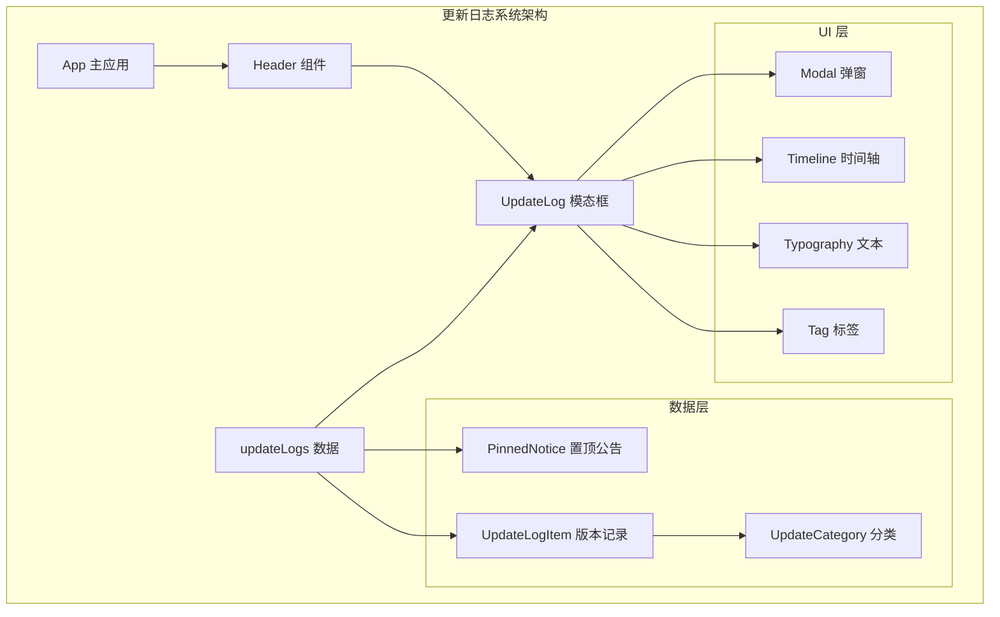
```mermaid
graph TB
subgraph "更新日志系统架构"
A[Header 组件] --> B[UpdateLog 模态框]
C[updateLogs 数据] --> B
D[App 主应用] --> A
subgraph "数据层"
E[PinnedNotice 置顶公告]
F[UpdateLogItem 版本记录]
G[UpdateCategory 分类]
end
subgraph "UI 层"
H[Modal 弹窗]
I[Timeline 时间轴]
J[Typography 文本]
K[Tag 标签]
end
C --> E
C --> F
F --> G
B --> H
B --> I
B --> J
B --> K
end
```

**图表来源**
- [UpdateLog.tsx:1-246](file://src/components/modals/UpdateLog.tsx#L1-L246)
- [updateLogs.ts:1-732](file://src/data/updateLogs.ts#L1-L732)

**章节来源**
- [UpdateLog.tsx:1-246](file://src/components/modals/UpdateLog.tsx#L1-L246)
- [updateLogs.ts:1-732](file://src/data/updateLogs.ts#L1-L732)

## 核心组件

### UpdateLog 模态框组件

UpdateLog 是一个基于 Ant Design Modal 的现代化更新日志展示组件，具有以下核心特性：

#### 主要功能
- **置顶公告显示**：展示重要通知和公告信息
- **版本历史浏览**：以时间轴形式展示所有版本更新
- **多分类内容**：支持新功能、问题修复、体验优化、其他更新等分类
- **Markdown 解析**：支持链接和加粗文本格式
- **响应式设计**：适配不同屏幕尺寸

#### 组件接口
```typescript
interface UpdateLogProps {
  open: boolean;
  onClose: () => void;
}
```

#### 数据结构
系统使用强类型的数据结构来确保数据完整性：

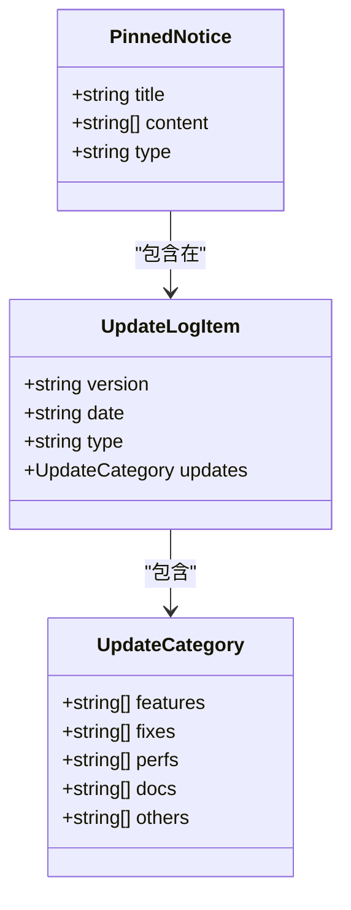
```mermaid
classDiagram
class PinnedNotice {
+string title
+string[] content
+string type
}
class UpdateCategory {
+string[] features
+string[] fixes
+string[] perfs
+string[] docs
+string[] others
}
class UpdateLogItem {
+string version
+string date
+string type
+UpdateCategory updates
}
PinnedNotice --> UpdateLogItem : "包含在"
UpdateLogItem --> UpdateCategory : "包含"
```

**图表来源**
- [updateLogs.ts:28-33](file://src/data/updateLogs.ts#L28-L33)
- [updateLogs.ts:10-19](file://src/data/updateLogs.ts#L10-L19)
- [updateLogs.ts:39-47](file://src/data/updateLogs.ts#L39-L47)

**章节来源**
- [UpdateLog.tsx:8-11](file://src/components/modals/UpdateLog.tsx#L8-L11)
- [updateLogs.ts:28-33](file://src/data/updateLogs.ts#L28-L33)

## 架构概览

更新日志系统的整体架构采用分层设计，确保了良好的可维护性和扩展性：

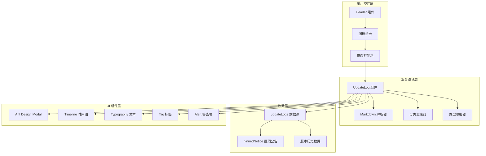
```mermaid
graph TD
subgraph "用户交互层"
A[Header 组件]
B[图标点击]
C[模态框显示]
end
subgraph "业务逻辑层"
D[UpdateLog 组件]
E[Markdown 解析器]
F[分类渲染器]
G[类型映射器]
end
subgraph "数据层"
H[updateLogs 数据源]
I[pinnedNotice 置顶公告]
J[版本历史数据]
end
subgraph "UI 组件层"
K[Ant Design Modal]
L[Timeline 时间轴]
M[Typography 文本]
N[Tag 标签]
O[Alert 警告框]
end
A --> B
B --> C
C --> D
D --> E
D --> F
D --> G
D --> H
H --> I
H --> J
D --> K
D --> L
D --> M
D --> N
D --> O
```

**图表来源**
- [Header.tsx:393-414](file://src/components/Header.tsx#L393-L414)
- [UpdateLog.tsx:146-242](file://src/components/modals/UpdateLog.tsx#L146-L242)

## 详细组件分析

### UpdateLog 组件实现

#### Markdown 解析器
组件内置了高效的 Markdown 解析器，支持以下格式：
- **链接格式**：`[文本](链接地址)`
- **加粗格式**：`**加粗文本**`

解析器使用正则表达式进行高效匹配和替换：

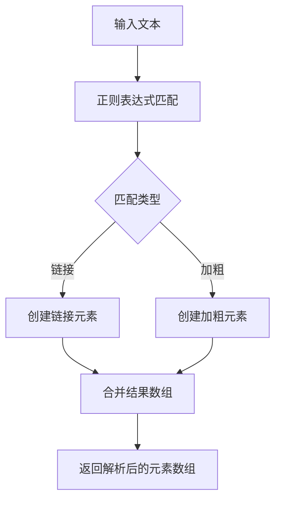
```mermaid
flowchart TD
A[输入文本] --> B[正则表达式匹配]
B --> C{匹配类型}
C --> |链接| D[创建链接元素]
C --> |加粗| E[创建加粗元素]
D --> F[合并结果数组]
E --> F
F --> G[返回解析后的元素数组]
```

**图表来源**
- [UpdateLog.tsx:15-61](file://src/components/modals/UpdateLog.tsx#L15-L61)

#### 分类渲染系统
系统支持四种主要的更新分类：

| 分类代码 | 中文名称 | 图标 | 颜色 |
|---------|---------|------|------|
| features | 新功能 | ✨ | 蓝色 |
| perfs | 体验优化 | 🚀 | 绿色 |
| fixes | 问题修复 | 🐞 | 橙色 |
| others | 其他更新 | 📦 | 默认 |

#### 类型映射系统
版本类型映射到中文标签和颜色：

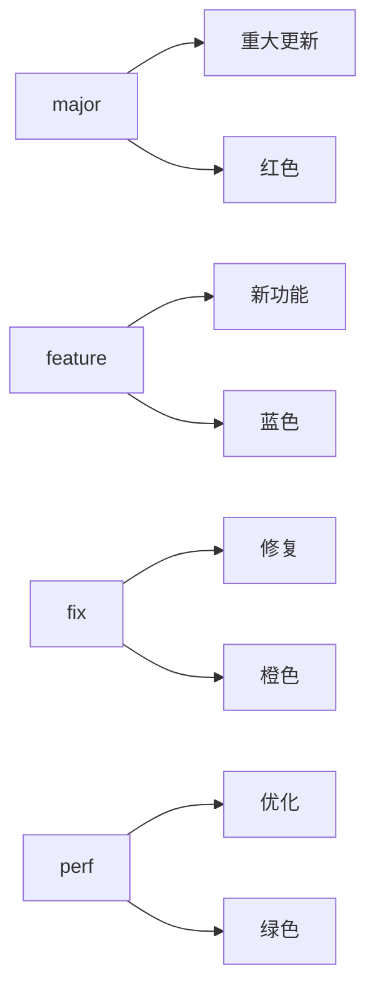
```mermaid
flowchart LR
A[major] --> B[重大更新]
A --> C[红色]
D[feature] --> E[新功能]
D --> F[蓝色]
G[fix] --> H[修复]
G --> I[橙色]
J[perf] --> K[优化]
J --> L[绿色]
```

**图表来源**
- [UpdateLog.tsx:78-91](file://src/components/modals/UpdateLog.tsx#L78-L91)

**章节来源**
- [UpdateLog.tsx:15-91](file://src/components/modals/UpdateLog.tsx#L15-L91)

### 数据管理架构

#### 置顶公告系统
置顶公告具有最高优先级，始终显示在更新日志顶部：

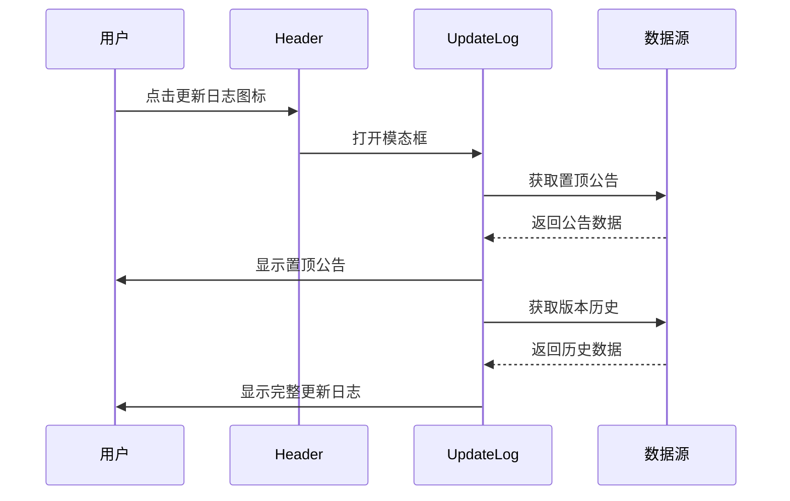
```mermaid
sequenceDiagram
participant U as 用户
participant H as Header
participant M as UpdateLog
participant D as 数据源
U->>H : 点击更新日志图标
H->>M : 打开模态框
M->>D : 获取置顶公告
D-->>M : 返回公告数据
M->>U : 显示置顶公告
M->>D : 获取版本历史
D-->>M : 返回历史数据
M->>U : 显示完整更新日志
```

**图表来源**
- [Header.tsx:393-414](file://src/components/Header.tsx#L393-L414)
- [updateLogs.ts:39-47](file://src/data/updateLogs.ts#L39-L47)

#### 版本历史管理
版本历史数据采用数组结构，按时间倒序排列，最新版本位于顶部：

**更新** 最新版本（1.4.2）的更新记录体现了系统在字段处理和性能优化方面的重大改进，包含以下重要特性：

| 版本号 | 发布日期 | 类型 | 主要特性 |
|--------|----------|------|----------|
| 1.4.2 | 2026-4-22 | feature | **👾 新增"子字段为空时占位"配置项**<br/>**优化同位置面板互斥交互体验**<br/>**优化右侧组件层级体验**<br/>**修复字段面板过长时会出现双滚动条的问题**<br/>**修复导入可嵌套二值坐标列表类字段时，若不嵌套会导致解析为字符串列表的问题** |
| 1.4.1 | 2026-4-8 | feature | **🐧 新增 WlRoots、MacOS 控制方式**<br/>**💬 支持 WaitFreezes 系列 Focus 字段**<br/>**设备连接面板仅显示当前平台方案**<br/>**修复使用本地保存时，字段顺序无视配置顺序的问题** |
| 1.4.0 | 2026-4-5 | major | **🤖 新增 AI 流程探索模式，寻路等流程类任务引导式直达**<br/>**📔 AI 历史信息面板可具体查看 Token 用量、实际提示词等信息**<br/>**🌟 Anchor 节点支持高亮索引与可跨文件快捷跳转**<br/>**🥂 右键节点面板可粘贴复制项，直接生成在指针位置**<br/>**🐍 Extremer 可自动检测新版本并提示**<br/>**优化节点字段智能填充效果**<br/>**优化 OCR 加载失败时的提示**<br/>**优化节点添加面板排序，精简左侧节点列表**<br/>**优化配置面板字段顺序，提升可读性**<br/>**修复调试模式下自动保存多文件引起的路径污染问题**<br/>**修复实时画面在本地服务断开或设备关闭时仍然留存的问题** |
| 1.3.1 | 2026-3-25 | feature | **自定义排序功能同步影响字段面板与节点渲染，字段顺序对应一致**<br/>**拖拽连接到空白处时，可唤醒新增节点面板（默认开启，可在设置面板关闭）**<br/>**多选右键菜单支持更多局部批量操作** |
| 1.3.0 | 2026-3-17 | major | 直角走线与避让走线模式<br/>**状态更新机制改进**<br/>**模态框内不再监听撤销等全局快捷键** |

**章节来源**
- [updateLogs.ts:49-732](file://src/data/updateLogs.ts#L49-L732)

### WlRoots和macOS控制功能实现

#### 功能概述
版本 1.4.1 引入了 WlRoots Wayland 合成器控制和 macOS 原生应用控制功能，该功能通过以下组件实现：

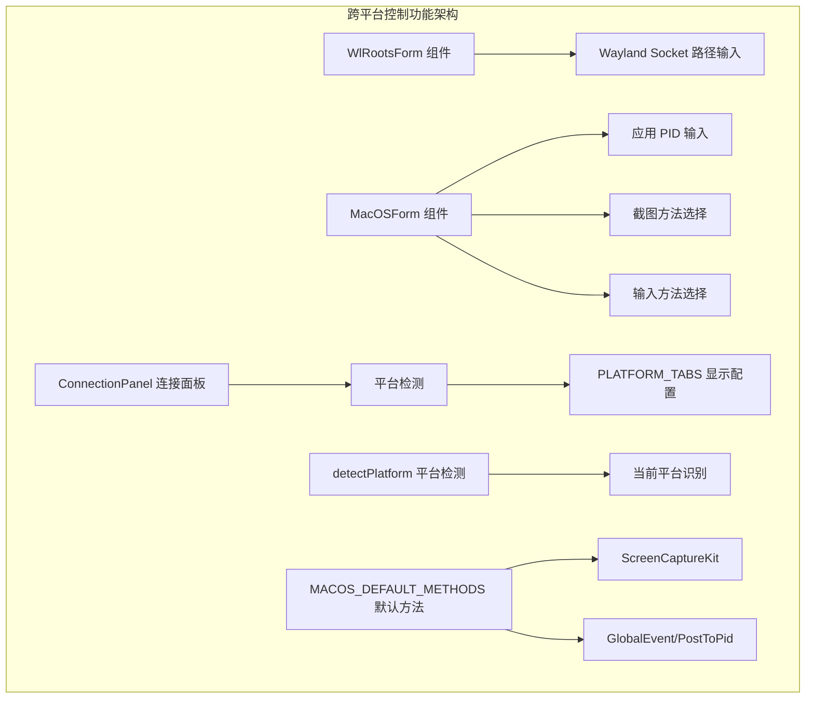
```mermaid
graph TB
subgraph "跨平台控制功能架构"
A[WlRootsForm 组件] --> B[Wayland Socket 路径输入]
C[MacOSForm 组件] --> D[应用 PID 输入]
C --> E[截图方法选择]
C --> F[输入方法选择]
G[ConnectionPanel 连接面板] --> H[平台检测]
H --> I[PLATFORM_TABS 显示配置]
J[detectPlatform 平台检测] --> K[当前平台识别]
L[MACOS_DEFAULT_METHODS 默认方法] --> M[ScreenCaptureKit]
L --> N[GlobalEvent/PostToPid]
end
```

**图表来源**
- [WlRootsForm.tsx:1-47](file://src/components/panels/main/connection/WlRootsForm.tsx#L1-L47)
- [MacOSForm.tsx:1-164](file://src/components/panels/main/connection/MacOSForm.tsx#L1-L164)
- [ConnectionPanel.tsx:1-793](file://src/components/panels/main/ConnectionPanel.tsx#L1-L793)
- [utils.ts:1-26](file://src/components/panels/main/connection/utils.ts#L1-L26)

#### 平台检测与显示优化
系统通过 detectPlatform 函数自动检测当前操作系统，并根据平台显示相应的连接选项：

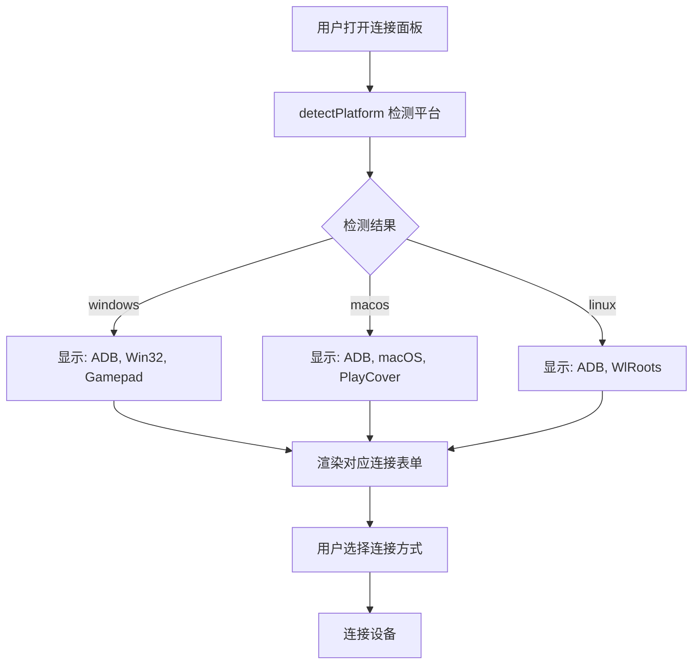
```mermaid
flowchart TD
A[用户打开连接面板] --> B[detectPlatform 检测平台]
B --> C{检测结果}
C --> |windows| D[显示: ADB, Win32, Gamepad]
C --> |macos| E[显示: ADB, macOS, PlayCover]
C --> |linux| F[显示: ADB, WlRoots]
D --> G[渲染对应连接表单]
E --> G
F --> G
G --> H[用户选择连接方式]
H --> I[连接设备]
```

**图表来源**
- [utils.ts:2-9](file://src/components/panels/main/connection/utils.ts#L2-L9)
- [utils.ts:11-19](file://src/components/panels/main/connection/utils.ts#L11-L19)

#### WlRoots Wayland 合成器控制
WlRootsForm 组件提供了专门的 Wayland 合成器连接界面：

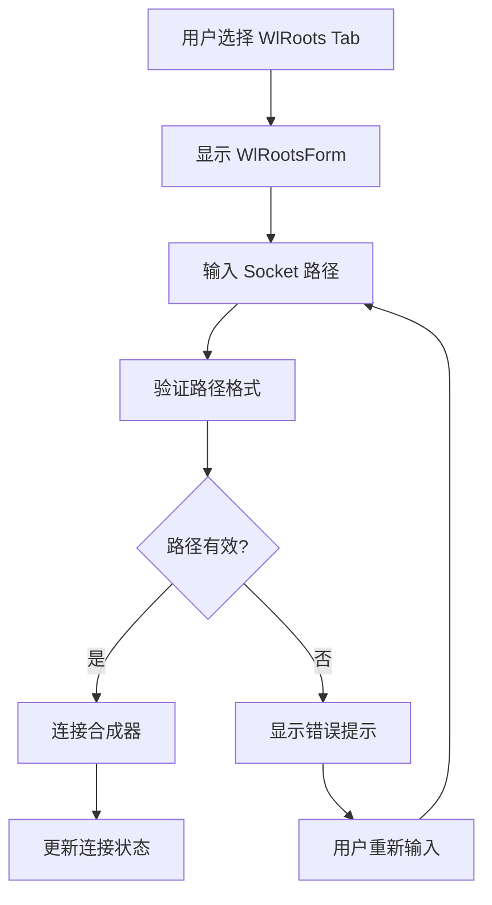
```mermaid
flowchart TD
A[用户选择 WlRoots Tab] --> B[显示 WlRootsForm]
B --> C[输入 Socket 路径]
C --> D[验证路径格式]
D --> E{路径有效?}
E --> |是| F[连接合成器]
E --> |否| G[显示错误提示]
F --> H[更新连接状态]
G --> I[用户重新输入]
I --> C
```

**图表来源**
- [WlRootsForm.tsx:12-47](file://src/components/panels/main/connection/WlRootsForm.tsx#L12-L47)

#### macOS 原生应用控制
MacOSForm 组件提供了 macOS 原生应用的完整控制界面：

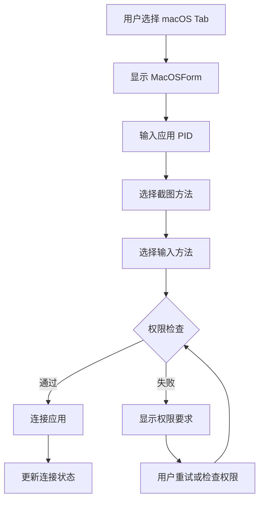
```mermaid
flowchart TD
A[用户选择 macOS Tab] --> B[显示 MacOSForm]
B --> C[输入应用 PID]
C --> D[选择截图方法]
D --> E[选择输入方法]
E --> F{权限检查}
F --> |通过| G[连接应用]
F --> |失败| H[显示权限要求]
G --> I[更新连接状态]
H --> J[用户重试或检查权限]
J --> F
```

**图表来源**
- [MacOSForm.tsx:18-164](file://src/components/panels/main/connection/MacOSForm.tsx#L18-L164)
- [utils.ts:21-26](file://src/components/panels/main/connection/utils.ts#L21-L26)

#### 设备连接面板性能优化
ConnectionPanel 组件实现了智能的平台检测和显示优化：

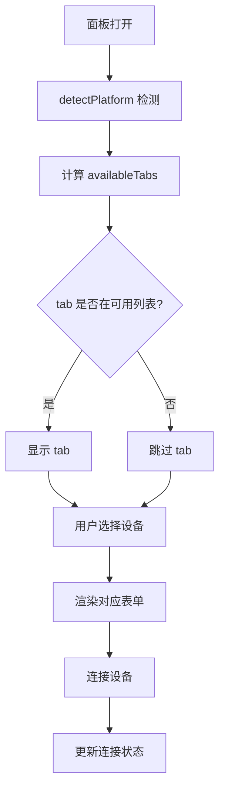
```mermaid
flowchart TD
A[面板打开] --> B[detectPlatform 检测]
B --> C[计算 availableTabs]
C --> D{tab 是否在可用列表?}
D --> |是| E[显示 tab]
D --> |否| F[跳过 tab]
E --> G[用户选择设备]
F --> G
G --> H[渲染对应表单]
H --> I[连接设备]
I --> J[更新连接状态]
```

**图表来源**
- [ConnectionPanel.tsx:62-71](file://src/components/panels/main/ConnectionPanel.tsx#L62-L71)
- [ConnectionPanel.tsx:644-734](file://src/components/panels/main/ConnectionPanel.tsx#L644-L734)

**章节来源**
- [WlRootsForm.tsx:1-47](file://src/components/panels/main/connection/WlRootsForm.tsx#L1-L47)
- [MacOSForm.tsx:1-164](file://src/components/panels/main/connection/MacOSForm.tsx#L1-L164)
- [ConnectionPanel.tsx:1-793](file://src/components/panels/main/ConnectionPanel.tsx#L1-L793)
- [utils.ts:1-26](file://src/components/panels/main/connection/utils.ts#L1-L26)

### WaitFreezes系列Focus字段支持实现

#### 功能概述
版本 1.4.1 新增的 WaitFreezes 系列 Focus 字段支持，为用户提供了更精细的节点关注和回调消息控制能力。该功能通过以下组件实现：

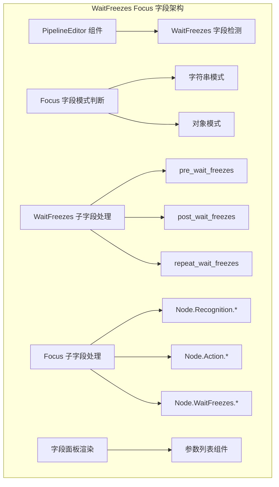
```mermaid
graph TB
subgraph "WaitFreezes Focus 字段架构"
A[PipelineEditor 组件] --> B[WaitFreezes 字段检测]
C[Focus 字段模式判断] --> D[字符串模式]
C --> E[对象模式]
F[WaitFreezes 子字段处理] --> G[pre_wait_freezes]
F --> H[post_wait_freezes]
F --> I[repeat_wait_freezes]
J[Focus 子字段处理] --> K[Node.Recognition.*]
J --> L[Node.Action.*]
J --> M[Node.WaitFreezes.*]
N[字段面板渲染] --> O[参数列表组件]
end
```

**图表来源**
- [PipelineEditor.tsx:197-257](file://src/components/panels/node-editors/PipelineEditor.tsx#L197-L257)
- [PipelineEditor.tsx:525-855](file://src/components/panels/node-editors/PipelineEditor.tsx#L525-L855)
- [schema.ts:180-253](file://src/core/fields/other/schema.ts#L180-L253)

#### WaitFreezes字段模式支持
系统支持两种 WaitFreezes 字段模式：

1. **整数模式**：简单的等待时间配置
2. **对象模式**：详细的参数配置，支持多个子字段

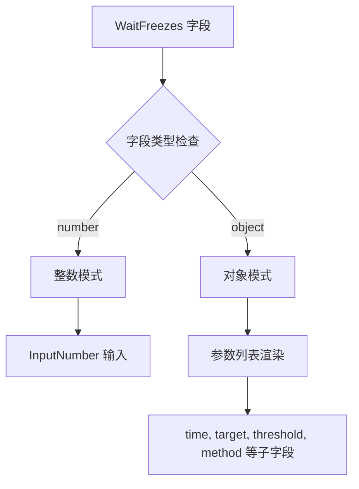
```mermaid
flowchart TD
A[WaitFreezes 字段] --> B{字段类型检查}
B --> |number| C[整数模式]
B --> |object| D[对象模式]
C --> E[InputNumber 输入]
D --> F[参数列表渲染]
F --> G[time, target, threshold, method 等子字段]
```

**图表来源**
- [PipelineEditor.tsx:212-249](file://src/components/panels/node-editors/PipelineEditor.tsx#L212-L249)
- [schema.ts:60-119](file://src/core/fields/other/schema.ts#L60-L119)

#### Focus字段模式支持
Focus 字段同样支持两种模式：

1. **字符串模式**：简单的字符串值
2. **对象模式**：详细的回调消息配置

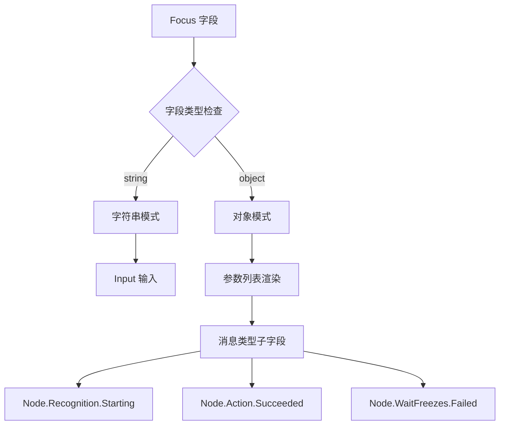
```mermaid
flowchart TD
A[Focus 字段] --> B{字段类型检查}
B --> |string| C[字符串模式]
B --> |object| D[对象模式]
C --> E[Input 输入]
D --> F[参数列表渲染]
F --> G[消息类型子字段]
G --> H[Node.Recognition.Starting]
G --> I[Node.Action.Succeeded]
G --> J[Node.WaitFreezes.Failed]
```

**图表来源**
- [PipelineEditor.tsx:856-921](file://src/components/panels/node-editors/PipelineEditor.tsx#L856-L921)
- [schema.ts:180-253](file://src/core/fields/other/schema.ts#L180-L253)

#### WaitFreezes子字段处理机制
系统为 WaitFreezes 系列字段提供了完整的子字段处理机制：

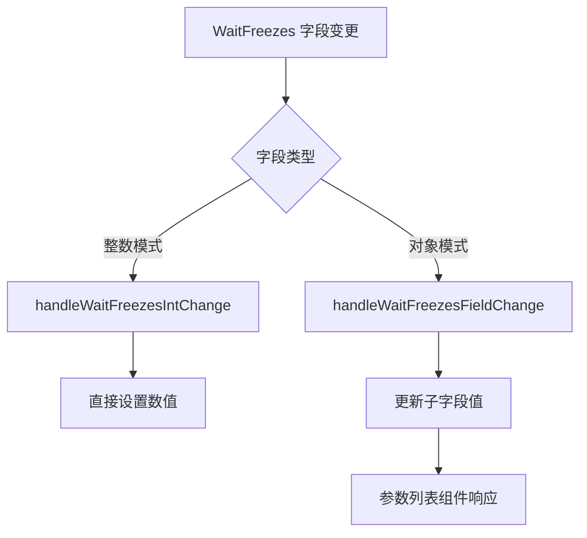
```mermaid
flowchart TD
A[WaitFreezes 字段变更] --> B{字段类型}
B --> |整数模式| C[handleWaitFreezesIntChange]
B --> |对象模式| D[handleWaitFreezesFieldChange]
C --> E[直接设置数值]
D --> F[更新子字段值]
F --> G[参数列表组件响应]
```

**图表来源**
- [PipelineEditor.tsx:251-315](file://src/components/panels/node-editors/PipelineEditor.tsx#L251-L315)
- [schema.ts:358-365](file://src/core/fields/other/schema.ts#L358-L365)

#### Focus子字段处理机制
Focus 字段的子字段处理机制与 WaitFreezes 类似：

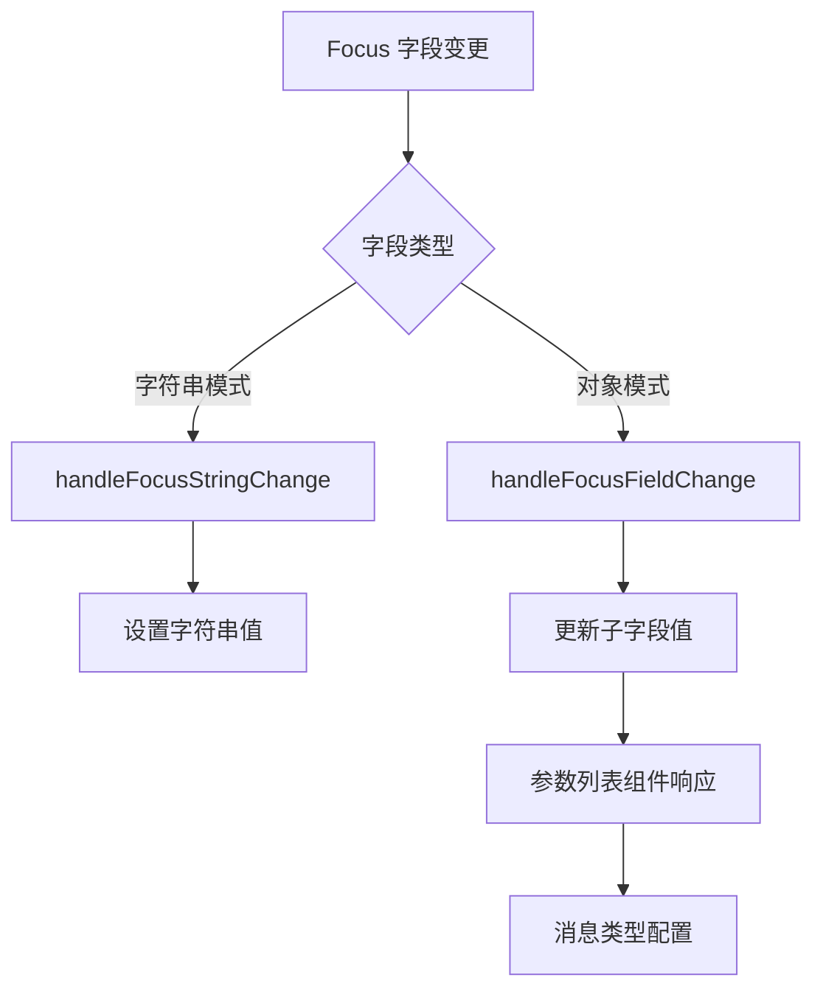
```mermaid
flowchart TD
A[Focus 字段变更] --> B{字段类型}
B --> |字符串模式| C[handleFocusStringChange]
B --> |对象模式| D[handleFocusFieldChange]
C --> E[设置字符串值]
D --> F[更新子字段值]
F --> G[参数列表组件响应]
G --> H[消息类型配置]
```

**图表来源**
- [PipelineEditor.tsx:163-195](file://src/components/panels/node-editors/PipelineEditor.tsx#L163-L195)
- [schema.ts:180-253](file://src/core/fields/other/schema.ts#L180-L253)

#### 字段面板集成
WaitFreezes 和 Focus 字段已完全集成到字段面板系统中：

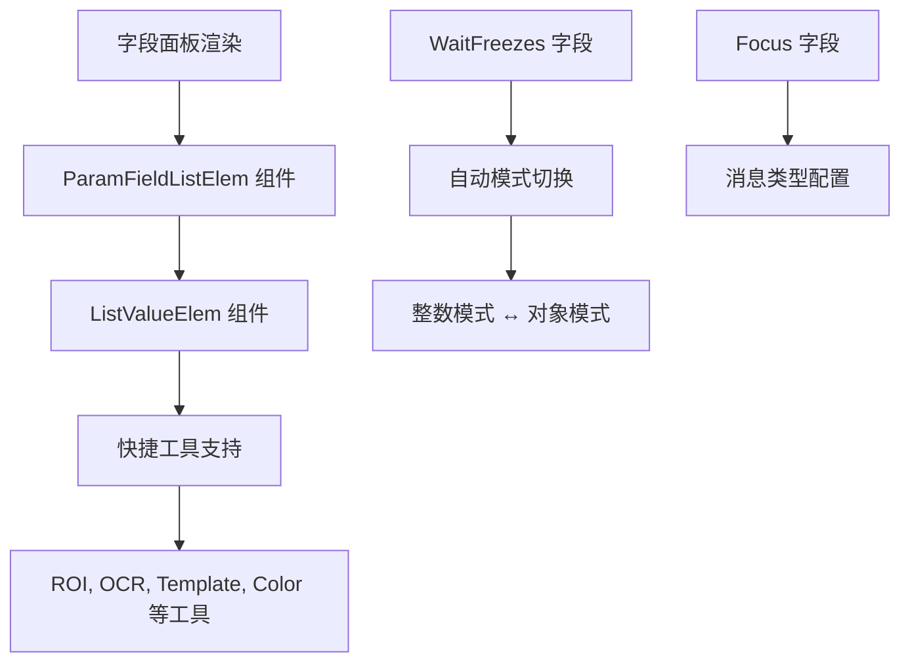
```mermaid
flowchart TD
A[字段面板渲染] --> B[ParamFieldListElem 组件]
B --> C[ListValueElem 组件]
C --> D[快捷工具支持]
D --> E[ROI, OCR, Template, Color 等工具]
F[WaitFreezes 字段] --> G[自动模式切换]
G --> H[整数模式 ↔ 对象模式]
I[Focus 字段] --> J[消息类型配置]
```

**图表来源**
- [ParamFieldListElem.tsx:1-789](file://src/components/panels/field/items/ParamFieldListElem.tsx#L1-L789)
- [ListValueElem.tsx:1-149](file://src/components/panels/field/items/ListValueElem.tsx#L1-L149)
- [schema.ts:358-387](file://src/core/fields/other/schema.ts#L358-L387)

**章节来源**
- [PipelineEditor.tsx:197-257](file://src/components/panels/node-editors/PipelineEditor.tsx#L197-L257)
- [PipelineEditor.tsx:525-855](file://src/components/panels/node-editors/PipelineEditor.tsx#L525-L855)
- [PipelineEditor.tsx:856-921](file://src/components/panels/node-editors/PipelineEditor.tsx#L856-L921)
- [schema.ts:180-253](file://src/core/fields/other/schema.ts#L180-L253)
- [schema.ts:358-387](file://src/core/fields/other/schema.ts#L358-L387)
- [ParamFieldListElem.tsx:1-789](file://src/components/panels/field/items/ParamFieldListElem.tsx#L1-L789)
- [ListValueElem.tsx:1-149](file://src/components/panels/field/items/ListValueElem.tsx#L1-L149)

### Anchor节点高亮索引与快捷跳转功能实现

#### 功能概述
版本 1.4.0 引入了 Anchor 节点高亮索引与可跨文件快捷跳转功能，该功能通过以下组件实现：

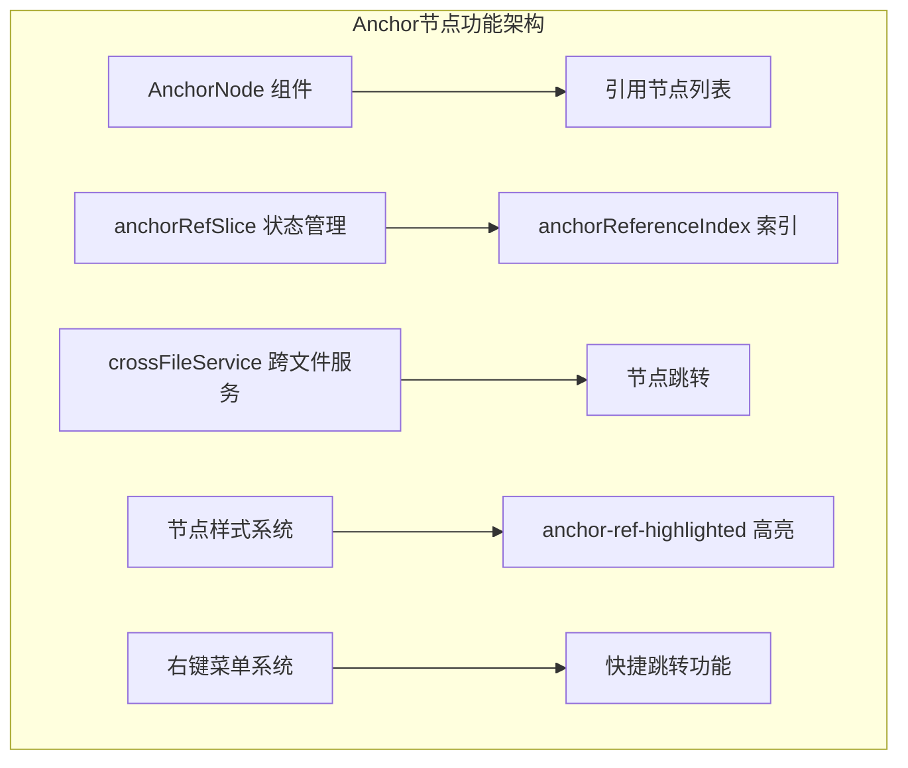
```mermaid
graph TB
subgraph "Anchor节点功能架构"
A[AnchorNode 组件] --> B[引用节点列表]
C[anchorRefSlice 状态管理] --> D[anchorReferenceIndex 索引]
E[crossFileService 跨文件服务] --> F[节点跳转]
G[节点样式系统] --> H[anchor-ref-highlighted 高亮]
I[右键菜单系统] --> J[快捷跳转功能]
end
```

**图表来源**
- [AnchorNode.tsx:1-284](file://src/components/flow/nodes/AnchorNode.tsx#L1-L284)
- [anchorRefSlice.ts:1-101](file://src/stores/flow/slices/anchorRefSlice.ts#L1-L101)
- [crossFileService.ts:264-493](file://src/services/crossFileService.ts#L264-L493)
- [nodes.module.less:266-281](file://src/styles/nodes.module.less#L266-L281)

#### Anchor引用索引系统
系统通过 anchorRefSlice 建立 Anchor 节点的引用索引：

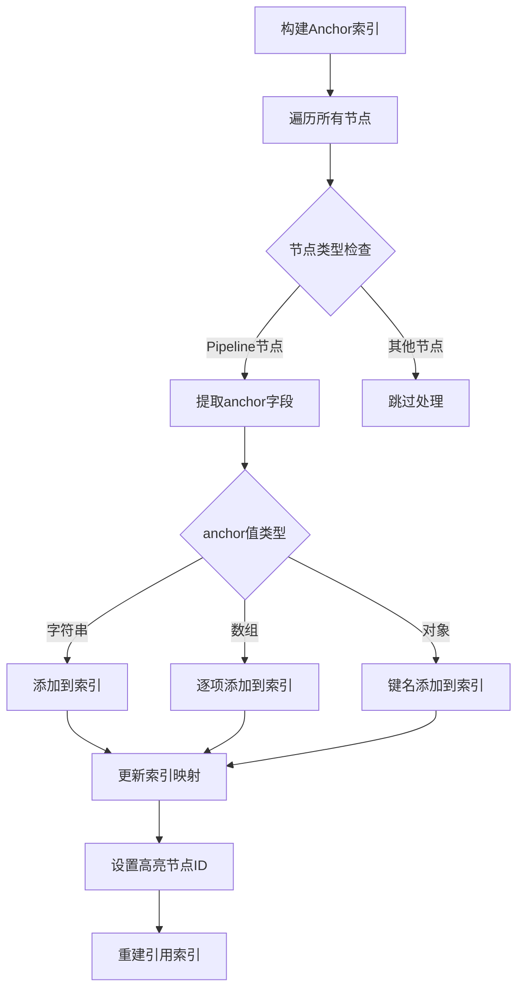
```mermaid
flowchart TD
A[构建Anchor索引] --> B[遍历所有节点]
B --> C{节点类型检查}
C --> |Pipeline节点| D[提取anchor字段]
C --> |其他节点| E[跳过处理]
D --> F{anchor值类型}
F --> |字符串| G[添加到索引]
F --> |数组| H[逐项添加到索引]
F --> |对象| I[键名添加到索引]
G --> J[更新索引映射]
H --> J
I --> J
J --> K[设置高亮节点ID]
K --> L[重建引用索引]
```

**图表来源**
- [anchorRefSlice.ts:36-55](file://src/stores/flow/slices/anchorRefSlice.ts#L36-L55)
- [anchorRefSlice.ts:68-73](file://src/stores/flow/slices/anchorRefSlice.ts#L68-L73)

#### 跨文件快捷跳转机制
系统支持在不同文件间快速跳转到 Anchor 节点：

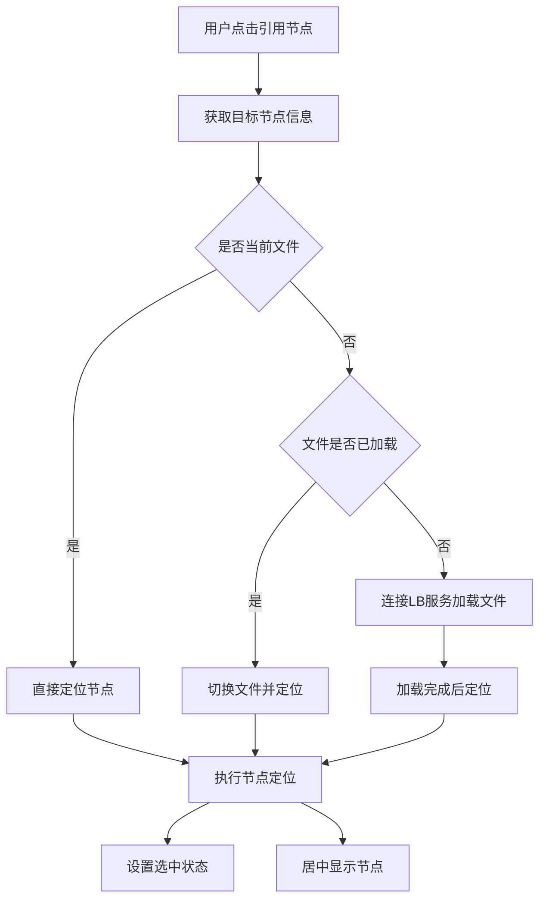
```mermaid
flowchart TD
A[用户点击引用节点] --> B[获取目标节点信息]
B --> C{是否当前文件}
C --> |是| D[直接定位节点]
C --> |否| E{文件是否已加载}
E --> |是| F[切换文件并定位]
E --> |否| G[连接LB服务加载文件]
G --> H[加载完成后定位]
D --> I[执行节点定位]
F --> I
H --> I
I --> J[设置选中状态]
I --> K[居中显示节点]
```

**图表来源**
- [crossFileService.ts:323-358](file://src/services/crossFileService.ts#L323-L358)
- [crossFileService.ts:445-467](file://src/services/crossFileService.ts#L445-L467)

#### 节点高亮显示系统
系统提供视觉化的节点高亮效果：

```mermaid
flowchart TD
A[设置选中的Anchor名称] --> B[获取引用节点ID集合]
B --> C{是否有引用节点}
C --> |是| D[设置高亮节点ID集合]
C --> |否| E[清空高亮集合]
D --> F[应用anchor-ref-highlighted样式]
F --> G[添加脉冲动画效果]
G --> H[更新节点外观]
E --> I[移除高亮样式]
I --> H
```

**图表来源**
- [anchorRefSlice.ts:75-92](file://src/stores/flow/slices/anchorRefSlice.ts#L75-L92)
- [nodes.module.less:266-281](file://src/styles/nodes.module.less#L266-L281)

#### 右键菜单粘贴功能
版本 1.4.0 新增了右键节点面板可粘贴复制项的功能：

```mermaid
flowchart TD
A[用户右键节点] --> B[显示右键菜单]
B --> C{是否有复制内容}
C --> |是| D[显示粘贴选项]
C --> |否| E[隐藏粘贴选项]
D --> F[用户选择粘贴]
F --> G[获取剪贴板内容]
G --> H[在鼠标位置粘贴]
H --> I[更新节点位置]
I --> J[应用到节点添加面板]
```

**图表来源**
- [NodeContextMenu.tsx:1-227](file://src/components/flow/nodes/components/NodeContextMenu.tsx#L1-L227)
- [nodeContextMenu.tsx:378-603](file://src/components/flow/nodes/nodeContextMenu.tsx#L378-L603)

**章节来源**
- [AnchorNode.tsx:1-284](file://src/components/flow/nodes/AnchorNode.tsx#L1-L284)
- [anchorRefSlice.ts:1-101](file://src/stores/flow/slices/anchorRefSlice.ts#L1-L101)
- [crossFileService.ts:264-493](file://src/services/crossFileService.ts#L264-L493)
- [nodes.module.less:266-281](file://src/styles/nodes.module.less#L266-L281)
- [NodeContextMenu.tsx:1-227](file://src/components/flow/nodes/components/NodeContextMenu.tsx#L1-L227)
- [nodeContextMenu.tsx:378-603](file://src/components/flow/nodes/nodeContextMenu.tsx#L378-L603)

### 连接空白处功能实现

#### 功能概述
版本 1.3.1 引入了"拖拽连接到空白处时，可唤醒新增节点面板"功能，该功能通过以下组件实现：

```mermaid
graph TB
subgraph "连接空白处功能架构"
A[Flow 组件] --> B[连接处理逻辑]
C[配置存储] --> D[quickCreateNodeOnConnectBlank]
E[NodeAddPanel 节点面板] --> F[模板选择界面]
G[设置面板] --> D
B --> H[检测连接终点]
H --> I{是否在空白处结束}
I --> |是| J[显示节点添加面板]
I --> |否| K[正常连接流程]
J --> L[设置面板位置]
L --> M[显示面板]
M --> F
end
```

**图表来源**
- [Flow.tsx:280-323](file://src/components/Flow.tsx#L280-L323)
- [configStore.ts:188](file://src/stores/configStore.ts#L188)
- [NodeAddPanel.tsx:276-583](file://src/components/panels/main/NodeAddPanel.tsx#L276-L583)

#### 连接处理机制
系统通过精确的连接状态检测来判断连接是否在空白处结束：

```mermaid
flowchart TD
A[连接结束事件] --> B[获取连接状态]
B --> C{连接状态有效?}
C --> |否| D[检查目标节点/句柄]
D --> E{有目标节点/句柄?}
E --> |是| F[正常连接流程]
E --> |否| G[在空白处结束]
C --> |是| H[检查目标节点/句柄]
H --> I{有目标节点/句柄?}
I --> |是| F
I --> |否| G
G --> J[获取鼠标坐标]
J --> K[设置面板位置]
K --> L[显示节点添加面板]
```

**图表来源**
- [Flow.tsx:295-321](file://src/components/Flow.tsx#L295-L321)

#### 面板显示逻辑
节点添加面板采用智能定位策略，确保在各种屏幕尺寸下的最佳用户体验：

```mermaid
flowchart TD
A[面板显示请求] --> B[获取容器宽度]
B --> C[计算面板尺寸]
C --> D{面板右侧是否超出边界?}
D --> |是| E[在左侧显示面板]
D --> |否| F[在右侧显示面板]
E --> G[调整左坐标]
F --> H[调整右坐标]
G --> I[限制最小/最大位置]
H --> I
I --> J[应用最终位置]
J --> K[显示面板]
```

**图表来源**
- [NodeAddPanel.tsx:420-439](file://src/components/panels/main/NodeAddPanel.tsx#L420-L439)

#### 设置配置管理
用户可以通过设置面板控制此功能的行为：

```mermaid
flowchart TD
A[用户访问设置面板] --> B[显示连接空白处时创建选项]
B --> C{用户切换开关}
C --> |开启| D[quickCreateNodeOnConnectBlank = true]
C --> |关闭| E[quickCreateNodeOnConnectBlank = false]
D --> F[保存配置到存储]
E --> F
F --> G[应用到连接处理逻辑]
G --> H[功能生效]
```

**图表来源**
- [PipelineConfigSection.tsx:135-163](file://src/components/panels/config/PipelineConfigSection.tsx#L135-L163)
- [configStore.ts:188](file://src/stores/configStore.ts#L188)

**章节来源**
- [Flow.tsx:280-323](file://src/components/Flow.tsx#L280-L323)
- [NodeAddPanel.tsx:276-583](file://src/components/panels/main/NodeAddPanel.tsx#L276-L583)
- [PipelineConfigSection.tsx:135-163](file://src/components/panels/config/PipelineConfigSection.tsx#L135-L163)
- [configStore.ts:188](file://src/stores/configStore.ts#L188)

### 自定义排序功能实现

#### 功能概述
版本 1.3.1 引入了自定义排序功能，该功能能够同步影响字段面板与节点渲染，确保字段顺序的一致性。这一功能通过以下组件实现：

```mermaid
graph TB
subgraph "排序功能架构"
A[FieldSortModal 模态框] --> B[FieldSortConfig 配置]
C[applyFieldSort 排序应用] --> D[Pipeline 节点渲染]
E[字段面板显示] --> D
F[mergeFieldSortConfig 合并配置] --> C
G[getDefaultSortConfig 默认配置] --> A
end
```

**图表来源**
- [FieldSortModal.tsx:106-184](file://src/components/modals/FieldSortModal.tsx#L106-L184)
- [applySort.ts:314-326](file://src/core/sorting/applySort.ts#L314-L326)
- [defaults.ts:122-130](file://src/core/sorting/defaults.ts#L122-L130)

#### 排序配置管理
系统提供了完整的排序配置管理机制：

```mermaid
flowchart TD
A[用户打开排序配置] --> B[加载当前配置]
B --> C[显示拖拽排序界面]
C --> D[用户调整字段顺序]
D --> E[验证配置有效性]
E --> F{配置是否默认}
F --> |是| G[保存 undefined]
F --> |否| H[保存自定义配置]
G --> I[更新全局配置]
H --> I
I --> J[应用到字段面板]
I --> K[应用到节点渲染]
```

**图表来源**
- [FieldSortModal.tsx:158-184](file://src/components/modals/FieldSortModal.tsx#L158-L184)
- [configStore.ts:153-155](file://src/stores/configStore.ts#L153-L155)

#### 排序应用机制
排序功能通过以下步骤应用到系统各个组件：

1. **配置加载**：从配置存储中获取当前排序配置
2. **配置合并**：将用户配置与默认配置合并
3. **排序应用**：根据协议版本应用相应的排序策略
4. **结果应用**：将排序结果应用到字段面板和节点渲染

**章节来源**
- [FieldSortModal.tsx:106-184](file://src/components/modals/FieldSortModal.tsx#L106-L184)
- [applySort.ts:314-326](file://src/core/sorting/applySort.ts#L314-L326)
- [configStore.ts:153-155](file://src/stores/configStore.ts#L153-L155)

### ROI坐标解析修复实现

#### 功能概述
版本 1.4.2 修复了导入可嵌套二值坐标列表类字段时的解析问题，该功能通过以下组件实现：

```mermaid
graph TB
subgraph "ROI坐标解析修复架构"
A[ROI解析工具] --> B[resolveNegativeROI 函数]
C[坐标解析逻辑] --> D[处理嵌套二值坐标]
E[字段面板] --> F[ROIModal 组件]
F --> G[坐标输入验证]
H[OCR面板] --> I[OCRModal 组件]
I --> G
J[负数坐标处理] --> K[roiNegativeCoord 工具]
end
```

**图表来源**
- [roiNegativeCoord.ts:47-178](file://src/utils/data/roiNegativeCoord.ts#L47-L178)
- [ROIModal.tsx:381-422](file://src/components/modals/ROIModal.tsx#L381-L422)
- [OCRModal.tsx:842-881](file://src/components/modals/OCRModal.tsx#L842-L881)

#### ROI坐标解析修复机制
系统通过改进的解析逻辑处理嵌套二值坐标列表：

```mermaid
flowchart TD
A[导入坐标数据] --> B{数据格式检查}
B --> |嵌套二值列表| C[处理嵌套结构]
B --> |普通列表| D[直接解析]
C --> E[递归解析每个元素]
E --> F[验证数值范围]
F --> G{数值有效?}
G --> |是| H[添加到结果数组]
G --> |否| I[抛出解析错误]
H --> J[返回解析结果]
I --> K[显示错误提示]
D --> J
```

**图表来源**
- [roiNegativeCoord.ts:55-178](file://src/utils/data/roiNegativeCoord.ts#L55-L178)

#### 负数坐标处理增强
系统增强了对负数坐标的处理能力：

```mermaid
flowchart TD
A[坐标输入] --> B{检查负数标志}
B --> |有负数| C[应用负数解析规则]
B --> |无负数| D[标准解析]
C --> E[计算实际坐标]
E --> F[处理边界情况]
F --> G[生成扩展画布]
G --> H[更新UI显示]
D --> H
```

**图表来源**
- [roiNegativeCoord.ts:55-178](file://src/utils/data/roiNegativeCoord.ts#L55-L178)
- [ROIModal.tsx:381-422](file://src/components/modals/ROIModal.tsx#L381-L422)
- [OCRModal.tsx:842-881](file://src/components/modals/OCRModal.tsx#L842-L881)

#### 字段面板滚动改进
系统修复了字段面板过长时出现双滚动条的问题：

```mermaid
flowchart TD
A[字段面板渲染] --> B[检查内容高度]
B --> C{内容是否溢出?}
C --> |是| D[启用单滚动条]
C --> |否| E[保持默认布局]
D --> F[优化滚动条样式]
F --> G[调整容器尺寸]
G --> H[更新滚动行为]
E --> H
```

**图表来源**
- [ROIModal.tsx:381-422](file://src/components/modals/ROIModal.tsx#L381-L422)
- [OCRModal.tsx:842-881](file://src/components/modals/OCRModal.tsx#L842-L881)

**章节来源**
- [roiNegativeCoord.ts:47-178](file://src/utils/data/roiNegativeCoord.ts#L47-L178)
- [ROIModal.tsx:381-422](file://src/components/modals/ROIModal.tsx#L381-L422)
- [OCRModal.tsx:842-881](file://src/components/modals/OCRModal.tsx#L842-L881)

### 用户交互流程

#### 自动显示机制
系统会在检测到版本更新时自动显示更新日志：

```mermaid
flowchart TD
A[应用启动] --> B{检查版本变化}
B --> |版本变化| C[延时 500ms]
B --> |无变化| D[正常运行]
C --> E[显示更新日志]
E --> F[用户关闭]
F --> G[标记已显示]
G --> H[继续正常运行]
```

**图表来源**
- [Header.tsx:267-277](file://src/components/Header.tsx#L267-L277)

#### 手动触发机制
用户也可以随时通过头部导航栏的手动触发：

```mermaid
sequenceDiagram
participant U as 用户
participant H as Header
participant M as UpdateLog
participant S as 状态管理
U->>H : 点击更新日志图标
H->>S : 设置 open=true
S-->>M : 接收 open 状态
M->>U : 显示模态框
U->>M : 点击关闭按钮
M->>S : 设置 open=false
S-->>H : 更新状态
H->>U : 模态框消失
```

**图表来源**
- [Header.tsx:393-414](file://src/components/Header.tsx#L393-L414)
- [UpdateLog.tsx:147-156](file://src/components/modals/UpdateLog.tsx#L147-L156)

#### 连接空白处交互流程
用户通过拖拽连接到空白处来唤起节点添加面板：

```mermaid
sequenceDiagram
participant U as 用户
participant F as Flow 组件
participant C as 配置存储
participant N as NodeAddPanel
U->>F : 拖拽连接到空白处
F->>F : 检测连接状态
F->>F : 判断是否在空白处结束
F->>C : 检查 quickCreateNodeOnConnectBlank
F->>N : 设置面板位置
F->>N : 显示节点添加面板
U->>N : 选择节点模板
N->>F : 创建节点
N->>U : 关闭面板
```

**图表来源**
- [Flow.tsx:295-321](file://src/components/Flow.tsx#L295-L321)
- [configStore.ts:188](file://src/stores/configStore.ts#L188)
- [NodeAddPanel.tsx:317-330](file://src/components/panels/main/NodeAddPanel.tsx#L317-L330)

#### Anchor节点跳转交互流程
用户通过右键菜单或引用列表跳转到 Anchor 节点：

```mermaid
sequenceDiagram
participant U as 用户
participant AN as AnchorNode
participant AR as anchorRefSlice
participant CF as crossFileService
U->>AN : 点击引用节点
AN->>AR : 获取引用节点列表
AR-->>AN : 返回引用节点信息
AN->>CF : 请求跳转到节点
CF->>CF : 检查是否跨文件
CF->>CF : 定位目标节点
CF->>U : 跳转完成并高亮显示
```

**图表来源**
- [AnchorNode.tsx:118-164](file://src/components/flow/nodes/AnchorNode.tsx#L118-L164)
- [anchorRefSlice.ts:94-100](file://src/stores/flow/slices/anchorRefSlice.ts#L94-L100)
- [crossFileService.ts:323-358](file://src/services/crossFileService.ts#L323-L358)

#### WaitFreezes和Focus字段交互流程
用户通过字段面板配置 WaitFreezes 和 Focus 字段：

```mermaid
sequenceDiagram
participant U as 用户
participant PE as PipelineEditor
participant PF as ParamFieldListElem
participant SC as schema.ts
U->>PE : 配置 WaitFreezes/Focus 字段
PE->>PF : 渲染字段面板
PF->>SC : 获取字段定义
SC-->>PF : 返回字段参数
PF->>U : 显示字段输入
U->>PF : 输入字段值
PF->>PE : 更新字段值
PE->>U : 应用到节点数据
```

**图表来源**
- [PipelineEditor.tsx:525-855](file://src/components/panels/node-editors/PipelineEditor.tsx#L525-L855)
- [ParamFieldListElem.tsx:1-789](file://src/components/panels/field/items/ParamFieldListElem.tsx#L1-L789)
- [schema.ts:180-253](file://src/core/fields/other/schema.ts#L180-L253)

#### WlRoots和macOS连接交互流程
用户通过连接面板选择并连接不同平台的设备：

```mermaid
sequenceDiagram
participant U as 用户
participant CP as ConnectionPanel
participant UF as 平台表单
participant MP as MFW协议
U->>CP : 打开连接面板
CP->>CP : detectPlatform 检测平台
CP->>UF : 显示平台相关表单
U->>UF : 输入设备信息
UF->>MP : 发送连接请求
MP->>U : 连接结果反馈
U->>CP : 关闭面板
```

**图表来源**
- [ConnectionPanel.tsx:62-71](file://src/components/panels/main/ConnectionPanel.tsx#L62-L71)
- [WlRootsForm.tsx:12-47](file://src/components/panels/main/connection/WlRootsForm.tsx#L12-L47)
- [MacOSForm.tsx:18-164](file://src/components/panels/main/connection/MacOSForm.tsx#L18-L164)

#### ROI坐标解析交互流程
用户通过字段面板输入和验证坐标数据：

```mermaid
sequenceDiagram
participant U as 用户
participant RM as ROIModal
participant RC as roiNegativeCoord
participant UI as UI显示
U->>RM : 输入坐标值
RM->>RC : 解析坐标数据
RC->>RC : 处理嵌套二值列表
RC->>RC : 验证负数坐标
RC->>UI : 更新显示结果
U->>RM : 确认输入
RM->>UI : 应用最终坐标
```

**图表来源**
- [ROIModal.tsx:381-422](file://src/components/modals/ROIModal.tsx#L381-L422)
- [roiNegativeCoord.ts:55-178](file://src/utils/data/roiNegativeCoord.ts#L55-L178)

**章节来源**
- [Header.tsx:267-277](file://src/components/Header.tsx#L267-L277)
- [Header.tsx:393-414](file://src/components/Header.tsx#L393-L414)
- [Flow.tsx:295-321](file://src/components/Flow.tsx#L295-L321)
- [AnchorNode.tsx:118-164](file://src/components/flow/nodes/AnchorNode.tsx#L118-L164)
- [PipelineEditor.tsx:525-855](file://src/components/panels/node-editors/PipelineEditor.tsx#L525-L855)
- [ConnectionPanel.tsx:62-71](file://src/components/panels/main/ConnectionPanel.tsx#L62-L71)
- [roiNegativeCoord.ts:55-178](file://src/utils/data/roiNegativeCoord.ts#L55-L178)

## 依赖分析

### 组件依赖关系

```mermaid
graph TB
subgraph "外部依赖"
A[React]
B[Ant Design]
C[Ant Design Icons]
D[@dnd-kit/core]
E[@dnd-kit/sortable]
end
subgraph "内部依赖"
F[updateLogs 数据]
G[Header 组件]
H[全局配置]
I[FieldSortConfig 类型]
J[FieldSortModal 组件]
K[applyFieldSort 函数]
L[NodeAddPanel 组件]
M[Flow 组件]
N[配置存储]
O[AnchorNode 组件]
P[anchorRefSlice 状态]
Q[crossFileService 服务]
R[nodes.module.less 样式]
S[ConnectionPanel 连接面板]
T[WlRootsForm 组件]
U[MacOSForm 组件]
V[utils 平台检测]
W[MFWProtocol 设备控制]
X[PipelineEditor 组件]
Y[ParamFieldListElem 组件]
Z[ListValueElem 组件]
AA[schema.ts 字段定义]
BB[WaitFreezes 字段]
CC[Focus 字段]
DD[roiNegativeCoord 工具]
EE[ROIModal 组件]
FF[OCRModal 组件]
GG[坐标解析工具]
HH[滚动优化组件]
end
subgraph "核心组件"
II[UpdateLog 模态框]
JJ[Timeline 时间轴]
KK[Typography 文本]
LL[Tag 标签]
MM[Alert 警告框]
end
A --> II
B --> II
C --> II
D --> J
E --> J
F --> II
G --> II
H --> G
I --> J
J --> K
K --> II
L --> M
M --> N
O --> P
P --> Q
Q --> R
S --> T
S --> U
S --> V
S --> W
X --> Y
Y --> Z
Z --> AA
AA --> BB
AA --> CC
DD --> GG
EE --> GG
FF --> GG
HH --> II
II --> JJ
II --> KK
II --> LL
II --> MM
```

**图表来源**
- [UpdateLog.tsx:1-4](file://src/components/modals/UpdateLog.tsx#L1-L4)
- [Header.tsx:24](file://src/components/Header.tsx#L24)
- [FieldSortModal.tsx:1-31](file://src/components/modals/FieldSortModal.tsx#L1-L31)
- [NodeAddPanel.tsx:1-13](file://src/components/panels/main/NodeAddPanel.tsx#L1-L13)
- [Flow.tsx:1-13](file://src/components/Flow.tsx#L1-L13)
- [AnchorNode.tsx:1-15](file://src/components/flow/nodes/AnchorNode.tsx#L1-L15)
- [anchorRefSlice.ts:1-4](file://src/stores/flow/slices/anchorRefSlice.ts#L1-L4)
- [crossFileService.ts:1-25](file://src/services/crossFileService.ts#L1-L25)
- [nodes.module.less:1-3](file://src/styles/nodes.module.less#L1-L3)
- [ConnectionPanel.tsx:29-40](file://src/components/panels/main/ConnectionPanel.tsx#L29-L40)
- [WlRootsForm.tsx:1-5](file://src/components/panels/main/connection/WlRootsForm.tsx#L1-L5)
- [MacOSForm.tsx:1-5](file://src/components/panels/main/connection/MacOSForm.tsx#L1-L5)
- [utils.ts:1-26](file://src/components/panels/main/connection/utils.ts#L1-L26)
- [MFWProtocol.ts](file://src/services/protocols/MFWProtocol.ts)
- [PipelineEditor.tsx:1-13](file://src/components/panels/node-editors/PipelineEditor.tsx#L1-L13)
- [ParamFieldListElem.tsx:1-19](file://src/components/panels/field/items/ParamFieldListElem.tsx#L1-L19)
- [ListValueElem.tsx:1-6](file://src/components/panels/field/items/ListValueElem.tsx#L1-L6)
- [schema.ts:1-7](file://src/core/fields/other/schema.ts#L1-L7)
- [roiNegativeCoord.ts:1-313](file://src/utils/data/roiNegativeCoord.ts#L1-L313)
- [ROIModal.tsx:381-422](file://src/components/modals/ROIModal.tsx#L381-L422)
- [OCRModal.tsx:842-881](file://src/components/modals/OCRModal.tsx#L842-L881)

### 数据依赖链

系统采用单向数据流设计，确保数据的一致性和可预测性：

```mermaid
flowchart LR
A[updateLogs.ts] --> B[UpdateLog.tsx]
C[pinnedNotice] --> B
D[Header.tsx] --> E[状态管理]
E --> B
F[用户交互] --> E
E --> G[模态框状态]
G --> B
H[FieldSortConfig] --> I[FieldSortModal]
I --> J[applyFieldSort]
J --> K[字段面板渲染]
J --> L[节点渲染]
M[quickCreateNodeOnConnectBlank] --> N[Flow.tsx]
N --> O[NodeAddPanel]
P[设置面板] --> M
Q[anchorReferenceIndex] --> R[AnchorNode]
R --> S[crossFileService]
S --> T[节点跳转]
U[anchor-ref-highlighted] --> V[nodes.module.less]
W[PLATFORM_TABS] --> X[ConnectionPanel]
X --> Y[WlRootsForm]
X --> Z[MacOSForm]
Y --> AA[Wayland Socket]
Z --> AB[macOS PID]
AC[WaitFreezes 字段] --> AD[PipelineEditor]
AE[Focus 字段] --> AF[PipelineEditor]
AD --> AG[ParamFieldListElem]
AF --> AH[ListValueElem]
AG --> AI[schema.ts]
AH --> AJ[schema.ts]
AK[ROI坐标解析] --> AL[roiNegativeCoord]
AL --> AM[ROIModal]
AL --> AN[OCRModal]
AM --> AO[坐标输入验证]
AN --> AO
AO --> AP[滚动优化]
AP --> B
```

**图表来源**
- [updateLogs.ts:39-47](file://src/data/updateLogs.ts#L39-L47)
- [UpdateLog.tsx:3](file://src/components/modals/UpdateLog.tsx#L3)
- [FieldSortModal.tsx:21-29](file://src/components/modals/FieldSortModal.tsx#L21-L29)
- [applySort.ts:314-326](file://src/core/sorting/applySort.ts#L314-L326)
- [configStore.ts:188](file://src/stores/configStore.ts#L188)
- [Flow.tsx:280-323](file://src/components/Flow.tsx#L280-L323)
- [NodeAddPanel.tsx:276-583](file://src/components/panels/main/NodeAddPanel.tsx#L276-L583)
- [anchorRefSlice.ts:36-55](file://src/stores/flow/slices/anchorRefSlice.ts#L36-L55)
- [AnchorNode.tsx:118-164](file://src/components/flow/nodes/AnchorNode.tsx#L118-L164)
- [crossFileService.ts:323-358](file://src/services/crossFileService.ts#L323-L358)
- [nodes.module.less:266-281](file://src/styles/nodes.module.less#L266-L281)
- [utils.ts:11-19](file://src/components/panels/main/connection/utils.ts#L11-L19)
- [ConnectionPanel.tsx:761-776](file://src/components/panels/main/ConnectionPanel.tsx#L761-L776)
- [PipelineEditor.tsx:525-855](file://src/components/panels/node-editors/PipelineEditor.tsx#L525-L855)
- [schema.ts:180-253](file://src/core/fields/other/schema.ts#L180-L253)
- [roiNegativeCoord.ts:55-178](file://src/utils/data/roiNegativeCoord.ts#L55-L178)
- [ROIModal.tsx:381-422](file://src/components/modals/ROIModal.tsx#L381-L422)
- [OCRModal.tsx:842-881](file://src/components/modals/OCRModal.tsx#L842-L881)

**章节来源**
- [UpdateLog.tsx:1-4](file://src/components/modals/UpdateLog.tsx#L1-L4)
- [updateLogs.ts:39-47](file://src/data/updateLogs.ts#L39-L47)
- [FieldSortModal.tsx:21-29](file://src/components/modals/FieldSortModal.tsx#L21-L29)
- [configStore.ts:188](file://src/stores/configStore.ts#L188)
- [anchorRefSlice.ts:36-55](file://src/stores/flow/slices/anchorRefSlice.ts#L36-L55)

## 性能考虑

### 渲染优化策略

1. **虚拟滚动**：对于大量历史记录，可考虑实现虚拟滚动以提升性能
2. **懒加载**：置顶公告和版本历史可实现懒加载
3. **记忆化**：Markdown 解析结果可进行缓存
4. **防抖处理**：窗口大小变化时的响应式处理

### 内存管理
- 组件卸载时自动清理事件监听器
- 状态管理采用局部状态，避免全局污染
- 图标和样式的动态加载优化

### 全局快捷键性能优化

**更新** 最新版本引入了重要的性能优化：模态框内不再监听撤销等全局快捷键

#### 优化背景
在之前的版本中，全局快捷键监听器会持续监听所有键盘事件，即使在模态框打开时也是如此。这会导致以下性能问题：
- 额外的事件处理开销
- 模态框内输入体验受影响
- 不必要的状态检查

#### 优化实现
通过 `useGlobalShortcuts` Hook 中的 `isModalOpen()` 函数检测模态框状态，当模态框打开时自动跳过全局快捷键处理：

```mermaid
flowchart TD
A[键盘事件] --> B{检查输入框}
B --> |是| C[不处理快捷键]
B --> |否| D{检查模态框状态}
D --> |打开| E[不处理快捷键]
D --> |关闭| F[处理快捷键]
E --> G[返回 false]
C --> G
F --> H{执行快捷键操作}
H --> I[返回 true]
```

**图表来源**
- [useGlobalShortcuts.ts:19-26](file://src/hooks/useGlobalShortcuts.ts#L19-L26)
- [useGlobalShortcuts.ts:122-125](file://src/hooks/useGlobalShortcuts.ts#L122-L125)

#### 性能收益
- 减少不必要的事件处理
- 提升模态框内输入响应速度
- 降低 CPU 占用率
- 改善整体应用流畅度

### Anchor节点功能性能优化

**更新** 新增的 Anchor 节点高亮索引与快捷跳转功能采用了高效的索引管理和状态同步机制：

#### 索引构建优化
- **增量更新**：仅在节点数据变化时重建索引
- **类型安全**：支持字符串、数组、对象三种 anchor 格式
- **内存优化**：使用 Map 和 Set 数据结构，避免重复存储

#### 跨文件跳转优化
- **缓存机制**：已加载文件的信息进行缓存
- **异步加载**：文件加载过程不阻塞主线程
- **超时处理**：防止无限等待，提供超时反馈

#### 节点高亮优化
- **条件渲染**：仅在需要时应用高亮样式
- **动画优化**：使用 CSS 动画而非 JavaScript 动画
- **批量更新**：多个节点高亮时进行批量 DOM 操作

### WaitFreezes和Focus字段性能优化

**更新** 新增的 WaitFreezes 系列 Focus 字段支持引入了智能的字段模式检测和切换机制：

#### 字段模式检测优化
- **类型安全检查**：通过 `isWaitFreezesObjectMode` 和 `isFocusObjectMode` 函数进行精确的类型判断
- **模式缓存**：字段模式检测结果在组件生命周期内缓存
- **条件渲染**：仅在需要时渲染相应的字段输入组件

#### 子字段处理优化
- **增量更新**：仅在字段值变化时触发更新
- **批量操作**：多个子字段更新时进行批量处理
- **回退机制**：对象模式回退到字符串模式时的智能处理

#### 字段面板优化
- **参数列表优化**：ParamFieldListElem 组件支持复杂的字段嵌套
- **快捷工具优化**：ListValueElem 组件提供高效的列表字段处理
- **样式优化**：针对 WaitFreezes 和 Focus 字段的特殊样式处理

### 连接空白处功能性能优化

**更新** 新增的连接空白处功能采用了高效的事件处理机制：

#### 事件处理优化
- **条件检查**：仅在启用功能时才进行连接状态检测
- **坐标缓存**：避免重复计算鼠标坐标
- **面板复用**：面板位置改变时仅更新样式属性
- **事件抑制**：连接完成后抑制后续面板点击事件

#### 面板显示优化
- **智能定位**：自动检测屏幕边界，避免面板溢出
- **延迟加载**：面板显示时再进行焦点设置
- **状态管理**：通过配置存储统一管理面板状态

### 跨平台连接面板性能优化

**更新** 新增的 WlRoots 和 macOS 控制功能引入了智能的平台检测和显示优化：

#### 平台检测优化
- **快速检测**：使用 navigator.platform 进行轻量级平台识别
- **默认降级**：无法识别时默认返回 Windows 平台
- **实时更新**：平台检测结果在组件生命周期内缓存

#### 条件渲染优化
- **按需显示**：仅渲染当前平台可用的连接选项
- **Tab切换优化**：避免渲染不可用的 Tab 内容
- **表单懒加载**：切换到 Tab 时再加载对应表单组件

#### 设备列表优化
- **按平台过滤**：设备列表仅显示当前平台支持的设备类型
- **方法配置优化**：根据平台自动配置默认的截图和输入方法
- **权限检查优化**：macOS 权限要求在表单中明确提示，避免无效连接尝试

### ROI坐标解析性能优化

**更新** 版本 1.4.2 修复了坐标解析问题并优化了相关性能：

#### 嵌套数据处理优化
- **递归解析**：改进的递归算法处理嵌套二值坐标列表
- **早期验证**：在解析过程中进行早期数据验证
- **错误恢复**：增强的错误处理和恢复机制

#### 负数坐标处理优化
- **缓存机制**：负数坐标解析结果缓存
- **边界计算优化**：优化边界计算逻辑
- **画布扩展优化**：减少不必要的画布扩展操作

#### UI交互优化
- **滚动性能**：修复双滚动条问题，优化滚动性能
- **输入验证**：实时坐标输入验证
- **显示更新**：优化坐标显示更新机制

**章节来源**
- [useGlobalShortcuts.ts:156-168](file://src/hooks/useGlobalShortcuts.ts#L156-L168)
- [anchorRefSlice.ts:36-55](file://src/stores/flow/slices/anchorRefSlice.ts#L36-L55)
- [crossFileService.ts:323-358](file://src/services/crossFileService.ts#L323-L358)
- [PipelineEditor.tsx:212-249](file://src/components/panels/node-editors/PipelineEditor.tsx#L212-L249)
- [PipelineEditor.tsx:856-921](file://src/components/panels/node-editors/PipelineEditor.tsx#L856-L921)
- [ParamFieldListElem.tsx:1-789](file://src/components/panels/field/items/ParamFieldListElem.tsx#L1-L789)
- [ListValueElem.tsx:1-149](file://src/components/panels/field/items/ListValueElem.tsx#L1-L149)
- [utils.ts:2-9](file://src/components/panels/main/connection/utils.ts#L2-L9)
- [utils.ts:11-19](file://src/components/panels/main/connection/utils.ts#L11-L19)
- [ConnectionPanel.tsx:62-71](file://src/components/panels/main/ConnectionPanel.tsx#L62-L71)
- [roiNegativeCoord.ts:55-178](file://src/utils/data/roiNegativeCoord.ts#L55-L178)
- [ROIModal.tsx:381-422](file://src/components/modals/ROIModal.tsx#L381-L422)
- [OCRModal.tsx:842-881](file://src/components/modals/OCRModal.tsx#L842-L881)

## 故障排除指南

### 常见问题及解决方案

#### 更新日志不显示
**症状**：点击更新日志图标无反应
**可能原因**：
- 版本检测逻辑异常
- 状态管理问题
- 组件渲染错误

**解决步骤**：
1. 检查版本检测逻辑（localStorage 中的版本号）
2. 验证状态管理器是否正确传递 props
3. 查看控制台错误信息

#### Markdown 格式解析失败
**症状**：链接或加粗文本显示异常
**可能原因**：
- 正则表达式匹配错误
- HTML 结构构建问题
- 样式冲突

**解决步骤**：
1. 验证正则表达式的正确性
2. 检查 React 元素的 key 属性
3. 确认样式类名的正确性

#### 性能问题
**症状**：页面加载缓慢或模态框打开卡顿
**可能原因**：
- 大量 DOM 元素渲染
- 事件监听器过多
- 样式计算复杂

**优化建议**：
1. 实现虚拟滚动
2. 减少不必要的 re-render
3. 优化 CSS 样式

#### 全局快捷键冲突
**症状**：模态框内无法正常使用撤销/重做快捷键
**可能原因**：
- 全局快捷键监听器未正确检测模态框状态
- 事件冒泡处理不当

**解决步骤**：
1. 检查 `isModalOpen()` 函数的模态框检测逻辑
2. 验证事件监听器的条件判断
3. 确认快捷键处理函数的返回值

#### Anchor节点高亮异常
**症状**：Anchor节点引用高亮效果不显示或显示异常
**可能原因**：
- anchorReferenceIndex 索引构建失败
- setSelectedAnchorName 方法调用异常
- 样式类名应用错误

**解决步骤**：
1. 检查 anchorReferenceIndex 是否正确构建
2. 验证 setSelectedAnchorName 方法的参数和返回值
3. 确认 anchor-ref-highlighted 样式类名正确应用
4. 检查节点ID映射关系是否正确

#### 跨文件跳转失败
**症状**：点击引用节点无法跳转到目标节点
**可能原因**：
- crossFileService 服务连接异常
- 目标文件未加载
- 节点定位逻辑错误

**解决步骤**：
1. 检查 LB 服务连接状态
2. 验证目标文件是否已加载
3. 确认节点名称解析是否正确
4. 检查文件路径映射关系

#### 右键菜单粘贴功能异常
**症状**：右键菜单中粘贴选项不可用或粘贴失败
**可能原因**：
- 剪贴板内容为空
- NodeAddPanel 面板位置计算错误
- 粘贴逻辑处理异常

**解决步骤**：
1. 检查剪贴板中是否有内容
2. 验证 NodeAddPanel 的位置计算逻辑
3. 确认粘贴操作的参数传递
4. 检查鼠标坐标转换是否正确

#### 自定义排序功能异常
**症状**：字段排序配置无效或排序结果不符合预期
**可能原因**：
- 配置存储问题
- 排序应用逻辑错误
- 字段面板渲染问题

**解决步骤**：
1. 检查 `fieldSortConfig` 配置是否正确保存
2. 验证 `applyFieldSort` 函数的排序逻辑
3. 确认字段面板和节点渲染是否正确应用排序

#### 连接空白处功能异常
**症状**：拖拽连接到空白处无法唤起节点面板
**可能原因**：
- 配置开关未正确设置
- 连接状态检测逻辑错误
- 面板显示位置计算问题

**解决步骤**：
1. 检查 `quickCreateNodeOnConnectBlank` 配置是否为 true
2. 验证连接结束事件的处理逻辑
3. 确认面板位置计算是否正确
4. 检查鼠标坐标获取是否正常

#### 节点添加面板显示问题
**症状**：节点面板显示位置异常或无法关闭
**可能原因**：
- 屏幕边界检测错误
- 面板状态管理问题
- 事件处理冲突

**解决步骤**：
1. 检查容器宽度获取是否正确
2. 验证面板位置计算逻辑
3. 确认事件处理器是否正确阻止默认行为
4. 检查面板可见性状态管理

#### WlRoots连接失败
**症状**：WlRoots连接面板无法连接Wayland合成器
**可能原因**：
- Socket路径格式错误
- Wayland权限不足
- 合成器未运行

**解决步骤**：
1. 验证Socket路径格式是否正确（/run/user/$UID/wayland-0）
2. 检查用户是否有访问Wayland socket的权限
3. 确认wlroots合成器正在运行
4. 验证用户会话是否为嵌套合成器会话

#### macOS连接失败
**症状**：macOS连接面板无法连接原生应用
**可能原因**：
- PID格式错误
- 权限不足
- 应用未运行

**解决步骤**：
1. 验证PID是否为有效的数字
2. 检查录屏权限和辅助功能权限是否已授予
3. 确认目标应用正在运行
4. 验证选择的截图和输入方法是否受支持

#### 平台检测错误
**症状**：连接面板显示了不正确的连接选项
**可能原因**：
- navigator.platform检测失败
- 平台识别逻辑错误
- 默认平台降级

**解决步骤**：
1. 检查浏览器的navigator.platform值
2. 验证平台识别逻辑是否正确
3. 确认默认降级到Windows平台的逻辑
4. 在不同环境下测试平台检测功能

#### 设备列表加载失败
**症状**：连接面板无法加载设备列表
**可能原因**：
- MFW协议连接异常
- 设备扫描超时
- 平台支持问题

**解决步骤**：
1. 检查MFW协议的连接状态
2. 验证设备扫描方法是否正确调用
3. 确认当前平台是否支持设备扫描
4. 检查网络连接和防火墙设置

#### WaitFreezes字段配置异常
**症状**：WaitFreezes字段配置无效或模式切换失败
**可能原因**：
- 字段类型检测错误
- 模式切换逻辑异常
- 子字段处理失败

**解决步骤**：
1. 检查 `isWaitFreezesObjectMode` 函数的类型检测逻辑
2. 验证 `handleWaitFreezesIntChange` 和 `handleWaitFreezesFieldChange` 函数
3. 确认子字段的添加、修改、删除操作
4. 检查字段值的回退机制（对象模式到整数模式）

#### Focus字段配置异常
**症状**：Focus字段配置无效或消息类型设置失败
**可能原因**：
- 字段类型检测错误
- 消息类型配置异常
- 子字段处理失败

**解决步骤**：
1. 检查 `isFocusObjectMode` 函数的类型检测逻辑
2. 验证 `handleFocusStringChange` 和 `handleFocusFieldChange` 函数
3. 确认消息类型的添加、修改、删除操作
4. 检查字段值的回退机制（对象模式到字符串模式）

#### 字段面板渲染异常
**症状**：WaitFreezes和Focus字段在字段面板中显示异常
**可能原因**：
- ParamFieldListElem组件渲染错误
- ListValueElem组件处理异常
- 字段定义配置问题

**解决步骤**：
1. 检查 `otherFieldSchema` 中的字段定义
2. 验证 `ParamFieldListElem` 组件的渲染逻辑
3. 确认 `ListValueElem` 组件的列表处理
4. 检查字段参数的排序和显示

#### ROI坐标解析异常
**症状**：坐标输入或显示异常
**可能原因**：
- 嵌套数据解析错误
- 负数坐标处理异常
- 滚动条显示问题

**解决步骤**：
1. 检查嵌套二值坐标列表的解析逻辑
2. 验证负数坐标的计算和显示
3. 确认滚动条的显示和行为
4. 检查坐标输入的有效性

**章节来源**
- [UpdateLog.tsx:15-61](file://src/components/modals/UpdateLog.tsx#L15-L61)
- [Header.tsx:267-277](file://src/components/Header.tsx#L267-L277)
- [useGlobalShortcuts.ts:156-168](file://src/hooks/useGlobalShortcuts.ts#L156-L168)
- [anchorRefSlice.ts:36-55](file://src/stores/flow/slices/anchorRefSlice.ts#L36-L55)
- [crossFileService.ts:323-358](file://src/services/crossFileService.ts#L323-L358)
- [FieldSortModal.tsx:158-184](file://src/components/modals/FieldSortModal.tsx#L158-L184)
- [Flow.tsx:295-321](file://src/components/Flow.tsx#L295-L321)
- [NodeAddPanel.tsx:420-439](file://src/components/panels/main/NodeAddPanel.tsx#L420-L439)
- [WlRootsForm.tsx:12-47](file://src/components/panels/main/connection/WlRootsForm.tsx#L12-L47)
- [MacOSForm.tsx:18-164](file://src/components/panels/main/connection/MacOSForm.tsx#L18-L164)
- [utils.ts:2-9](file://src/components/panels/main/connection/utils.ts#L2-L9)
- [ConnectionPanel.tsx:247-258](file://src/components/panels/main/ConnectionPanel.tsx#L247-L258)
- [PipelineEditor.tsx:212-249](file://src/components/panels/node-editors/PipelineEditor.tsx#L212-L249)
- [PipelineEditor.tsx:856-921](file://src/components/panels/node-editors/PipelineEditor.tsx#L856-L921)
- [ParamFieldListElem.tsx:1-789](file://src/components/panels/field/items/ParamFieldListElem.tsx#L1-L789)
- [ListValueElem.tsx:1-149](file://src/components/panels/field/items/ListValueElem.tsx#L1-L149)
- [schema.ts:180-253](file://src/core/fields/other/schema.ts#L180-L253)
- [roiNegativeCoord.ts:55-178](file://src/utils/data/roiNegativeCoord.ts#L55-L178)
- [ROIModal.tsx:381-422](file://src/components/modals/ROIModal.tsx#L381-L422)
- [OCRModal.tsx:842-881](file://src/components/modals/OCRModal.tsx#L842-L881)

## 结论

UpdateLogs.ts 系统展现了优秀的前端架构设计，通过清晰的分层结构、强类型的数据管理和优雅的用户界面，为用户提供了优质的版本更新浏览体验。

### 主要优势
1. **模块化设计**：组件职责明确，易于维护和扩展
2. **类型安全**：完整的 TypeScript 类型定义确保数据完整性
3. **用户体验**：直观的界面设计和流畅的交互体验
4. **可扩展性**：良好的架构支持未来功能扩展

### 技术亮点
- 响应式设计适配多种设备
- 高效的 Markdown 解析算法
- 智能的版本检测机制
- 灵活的分类展示系统
- 高效的连接空白处处理机制
- 完整的Anchor节点高亮索引与跨文件跳转功能
- 优化的右键菜单粘贴功能
- **新增** 跨平台设备连接支持（WlRoots、macOS）
- **新增** 智能平台检测和显示优化
- **新增** WaitFreezes系列Focus字段支持，为用户提供了更精细的节点关注和回调消息控制能力
- **新增** 子字段为空时占位配置项，提供更灵活的字段处理选项
- **新增** ROI坐标解析修复，解决了嵌套二值坐标列表的解析问题
- **新增** 字段面板滚动优化，修复了双滚动条问题

**更新** 最新版本（1.4.2）特别体现了系统在字段处理和性能优化方面的重大改进。通过引入子字段为空时占位配置项，用户可以更灵活地控制字段的显示和处理方式。同时，多项性能优化的实施显著提升了系统的响应速度和用户体验。版本 1.4.1 的发布日期已修正为'2026-4-8'，确保了版本发布的准确时间记录。这一修正虽然看似简单，但对于版本管理的准确性至关重要，有助于用户和开发者更好地追踪软件的发展历程。版本 1.4.1 同样体现了系统在跨平台设备控制和节点关注功能方面的重大突破。通过引入 WlRoots Wayland 合成器控制、macOS 原生应用控制功能，以及 WaitFreezes 系列 Focus 字段支持，系统现在能够支持更多操作系统环境下的设备连接和更精细的节点控制。WaitFreezes 系列 Focus 字段支持是本次功能增强的重要里程碑，它为用户提供了更强大的节点关注能力和回调消息控制机制，使得用户可以更精确地监控和控制节点的执行过程。同时，设备连接面板的智能平台检测功能确保用户只会看到当前平台可用的连接选项，大大简化了用户的操作流程。这些功能的实现展示了现代前端开发在跨平台兼容性和用户体验方面的深度思考和技术实力。

**更新** 版本 1.4.1 的发布日期已修正为'2026-4-8'，确保了版本发布的准确时间记录。这一修正虽然看似简单，但对于版本管理的准确性至关重要，有助于用户和开发者更好地追踪软件的发展历程。这一版本同样体现了系统在 AI 辅助和用户体验方面的重大改进。通过引入 AI 流程探索模式、优化节点渲染性能等特性，系统为用户提供了更加智能化和高效的使用体验。这些改进反映了开发团队对用户体验细节的关注和对系统性能的持续追求。

WaitFreezes 系列 Focus 字段支持的实现展示了现代前端开发在复杂字段处理方面的最佳实践：通过精确的类型检测、智能的模式切换和完整的子字段管理，为用户提供了既简洁又强大的配置界面。该功能不仅提升了系统的功能性，还保持了界面的整洁性和易用性，为用户提供了更好的开发体验。

ROI坐标解析修复的实现展示了系统在数据处理方面的深度优化：通过改进的递归算法、早期验证机制和错误恢复策略，系统现在能够更准确地处理嵌套二值坐标列表，修复了之前可能导致解析错误的问题。这一改进显著提升了系统的稳定性和可靠性。

连接空白处功能的实现展示了现代前端开发的最佳实践：通过精确的状态检测、高效的事件处理和智能的界面定位，为用户提供了无缝的交互体验。该功能不仅提升了工作效率，还保持了系统的整体性能和稳定性。

Anchor 节点功能的实现则体现了系统在复杂工作流管理方面的深度思考：通过建立完善的引用索引、提供直观的高亮显示和强大的跨文件跳转能力，系统为用户提供了类似"书签"般的导航体验，使得大型项目的维护和协作变得更加高效。

WlRoots 和 macOS 控制功能的实现进一步扩展了系统的适用场景，使得用户能够在不同的操作系统环境中进行设备控制和管理。这些功能的引入不仅提升了系统的实用性，也为未来的功能扩展奠定了坚实的技术基础。

**更新** WaitFreezes 系列 Focus 字段支持的引入标志着系统在节点控制和监控方面达到了新的高度。通过提供更精细的等待时机控制和回调消息配置，用户可以构建更加复杂和可靠的自动化流程。这一功能的实现展示了系统在处理复杂业务逻辑方面的强大能力，为用户提供了更多的灵活性和控制力。

**更新** ROI坐标解析修复的引入进一步增强了系统的数据处理能力和稳定性。通过改进的嵌套数据处理算法和错误恢复机制，系统现在能够更准确地处理各种坐标数据格式，为用户提供了更可靠的数据处理体验。

**更新** 字段面板滚动优化的引入解决了长期存在的用户体验问题，通过修复双滚动条问题和优化滚动性能，系统现在提供了更加流畅和直观的交互体验。这一优化虽然看似微小，但对用户的日常使用体验产生了积极的影响。