# UpdateLogs.ts

<cite>
**本文档引用的文件**
- [UpdateLog.tsx](file://src/components/modals/UpdateLog.tsx)
- [updateLogs.ts](file://src/data/updateLogs.ts)
- [Header.tsx](file://src/components/Header.tsx)
- [App.tsx](file://src/App.tsx)
- [useGlobalShortcuts.ts](file://src/hooks/useGlobalShortcuts.ts)
- [FieldSortModal.tsx](file://src/components/modals/FieldSortModal.tsx)
- [configStore.ts](file://src/stores/configStore.ts)
- [PipelineConfigSection.tsx](file://src/components/panels/config/PipelineConfigSection.tsx)
- [applySort.ts](file://src/core/sorting/applySort.ts)
- [types.ts](file://src/core/sorting/types.ts)
- [defaults.ts](file://src/core/sorting/defaults.ts)
- [Flow.tsx](file://src/components/Flow.tsx)
- [NodeAddPanel.tsx](file://src/components/panels/main/NodeAddPanel.tsx)
</cite>

## 更新摘要
**变更内容**
- 更新了版本历史记录，修正版本1.3.1的发布日期为'2026-3-25'
- 确保版本发布的准确时间记录，提升版本管理的准确性
- 保持其他版本信息的完整性

## 目录
1. [简介](#简介)
2. [项目结构](#项目结构)
3. [核心组件](#核心组件)
4. [架构概览](#架构概览)
5. [详细组件分析](#详细组件分析)
6. [依赖分析](#依赖分析)
7. [性能考虑](#性能考虑)
8. [故障排除指南](#故障排除指南)
9. [结论](#结论)

## 简介

UpdateLogs.ts 是 MaaPipelineEditor 项目中的更新日志管理系统，负责展示应用程序的历史版本更新信息和置顶公告。该系统采用现代化的 React 组件设计，结合 Ant Design UI 库，为用户提供直观的版本更新浏览体验。

该系统的核心功能包括：
- 展示完整的版本历史记录
- 实时置顶公告显示
- 多维度更新分类（新功能、问题修复、体验优化等）
- Markdown 格式支持（链接和加粗文本）
- 响应式设计和良好的用户体验

**更新** 最新版本（1.3.1）特别强调了两个重要功能的新增：自定义排序功能和连接空白处时的节点面板唤醒功能。自定义排序功能同步影响字段面板与节点渲染，确保字段顺序的一致性；连接空白处功能允许用户在拖拽连接到画布空白处时直接唤起新增节点面板，提升工作效率。版本1.3.0则特别强调了状态更新机制的改进，解决了删除重复节点名后状态未及时更新的问题，并引入了重要的性能优化：模态框内不再监听撤销等全局快捷键，显著提升了应用的响应性能。

## 项目结构

更新日志系统在项目中的组织结构如下：

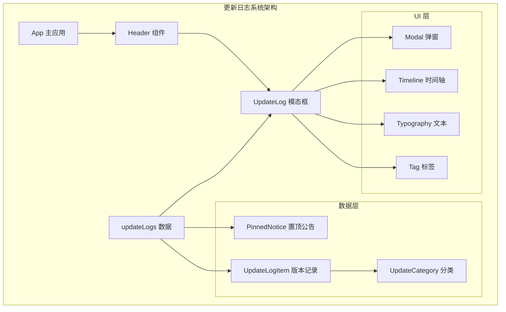

**图表来源**
- [UpdateLog.tsx:1-246](file://src/components/modals/UpdateLog.tsx#L1-L246)
- [updateLogs.ts:1-680](file://src/data/updateLogs.ts#L1-L680)

**章节来源**
- [UpdateLog.tsx:1-246](file://src/components/modals/UpdateLog.tsx#L1-L246)
- [updateLogs.ts:1-680](file://src/data/updateLogs.ts#L1-L680)

## 核心组件

### UpdateLog 模态框组件

UpdateLog 是一个基于 Ant Design Modal 的现代化更新日志展示组件，具有以下核心特性：

#### 主要功能
- **置顶公告显示**：展示重要通知和公告信息
- **版本历史浏览**：以时间轴形式展示所有版本更新
- **多分类内容**：支持新功能、问题修复、体验优化等分类
- **Markdown 解析**：支持链接和加粗文本格式
- **响应式设计**：适配不同屏幕尺寸

#### 组件接口
```typescript
interface UpdateLogProps {
  open: boolean;
  onClose: () => void;
}
```

#### 数据结构
系统使用强类型的数据结构来确保数据完整性：

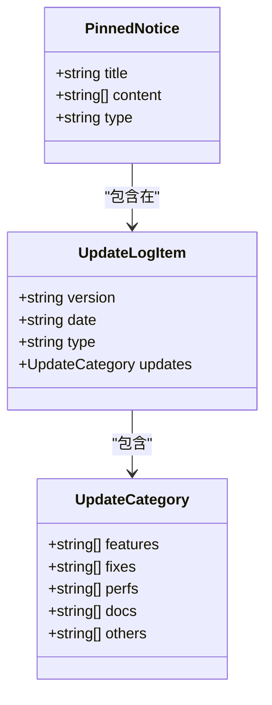

**图表来源**
- [updateLogs.ts:28-33](file://src/data/updateLogs.ts#L28-L33)
- [updateLogs.ts:10-19](file://src/data/updateLogs.ts#L10-L19)
- [updateLogs.ts:39-47](file://src/data/updateLogs.ts#L39-L47)

**章节来源**
- [UpdateLog.tsx:8-11](file://src/components/modals/UpdateLog.tsx#L8-L11)
- [updateLogs.ts:28-33](file://src/data/updateLogs.ts#L28-L33)

## 架构概览

更新日志系统的整体架构采用分层设计，确保了良好的可维护性和扩展性：

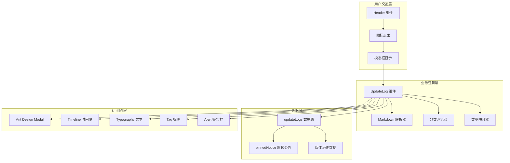

**图表来源**
- [Header.tsx:393-414](file://src/components/Header.tsx#L393-L414)
- [UpdateLog.tsx:146-242](file://src/components/modals/UpdateLog.tsx#L146-L242)

## 详细组件分析

### UpdateLog 组件实现

#### Markdown 解析器
组件内置了高效的 Markdown 解析器，支持以下格式：
- **链接格式**：`[文本](链接地址)`
- **加粗格式**：`**加粗文本**`

解析器使用正则表达式进行高效匹配和替换：

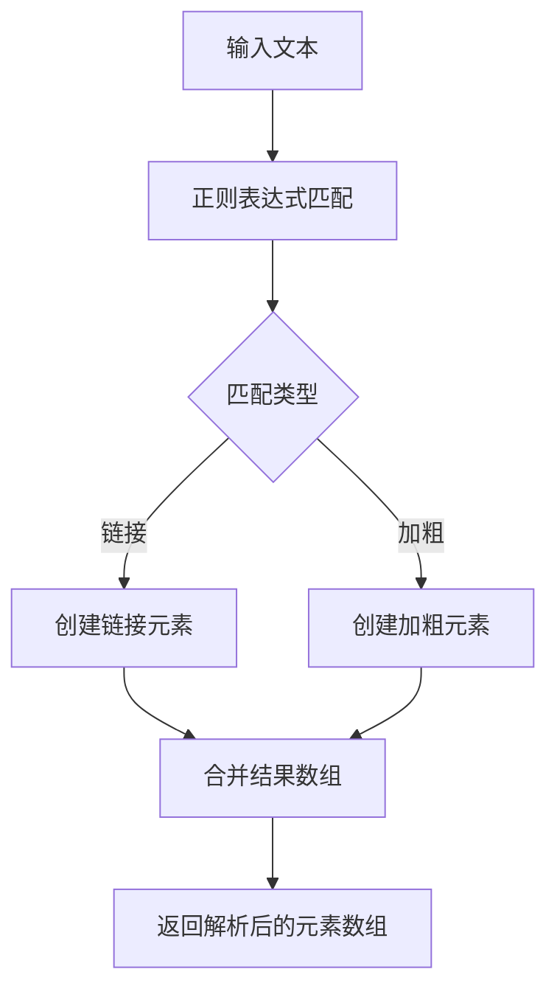

**图表来源**
- [UpdateLog.tsx:15-61](file://src/components/modals/UpdateLog.tsx#L15-L61)

#### 分类渲染系统
系统支持四种主要的更新分类：

| 分类代码 | 中文名称 | 图标 | 颜色 |
|---------|---------|------|------|
| features | 新功能 | ✨ | 蓝色 |
| perfs | 体验优化 | 🚀 | 绿色 |
| fixes | 问题修复 | 🐞 | 橙色 |
| others | 其他更新 | 📦 | 默认 |

#### 类型映射系统
版本类型映射到中文标签和颜色：

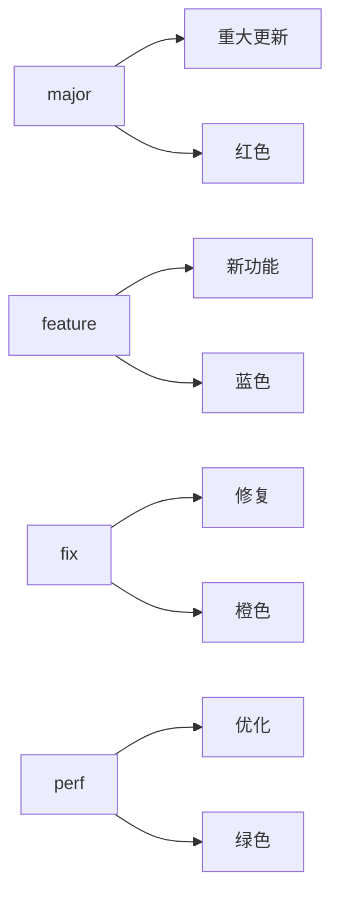

**图表来源**
- [UpdateLog.tsx:78-91](file://src/components/modals/UpdateLog.tsx#L78-L91)

**章节来源**
- [UpdateLog.tsx:15-91](file://src/components/modals/UpdateLog.tsx#L15-L91)

### 数据管理架构

#### 置顶公告系统
置顶公告具有最高优先级，始终显示在更新日志顶部：

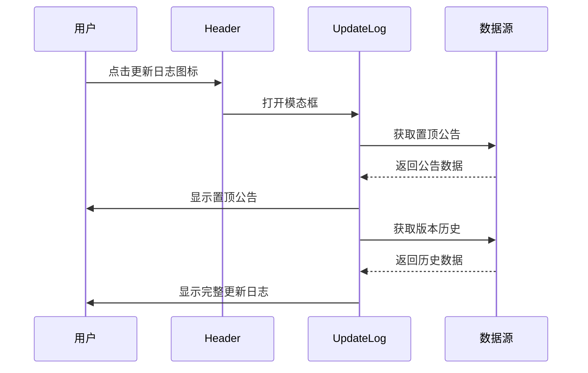

**图表来源**
- [Header.tsx:393-414](file://src/components/Header.tsx#L393-L414)
- [updateLogs.ts:39-47](file://src/data/updateLogs.ts#L39-L47)

#### 版本历史管理
版本历史数据采用数组结构，按时间倒序排列，最新版本位于顶部：

**更新** 最新版本（1.3.1）的更新记录体现了系统在功能增强方面的重大突破，发布日期已修正为准确的'2026-3-25'：

| 版本号 | 发布日期 | 类型 | 主要特性 |
|--------|----------|------|----------|
| 1.3.1 | 2026-3-25 | feature | **自定义排序功能同步影响字段面板与节点渲染，字段顺序对应一致**<br/>**拖拽连接到空白处时，可唤醒新增节点面板（默认开启，可在设置面板关闭）** |
| 1.3.0 | 2026-3-17 | major | 直角走线与避让走线模式<br/>**状态更新机制改进**<br/>**模态框内不再监听撤销等全局快捷键** |
| 1.2.3 | 2026-3-8 | feature | 前驱与后继关系面板<br/>DirectHit 适配 |
| 1.2.2 | 2026-3-5 | feature | WithPseudoMinimize 支持<br/>节点列表与统计面板 |
| 1.2.1 | 2026-3-2 | feature | color_filter、shell_timeout 适配<br/>WithWindowPos 系列支持 |
| 1.2.0 | 2026-2-23 | major | 协议版本指定功能<br/>**删除重复节点名后状态更新问题修复** |

**章节来源**
- [updateLogs.ts:49-680](file://src/data/updateLogs.ts#L49-L680)

### 连接空白处功能实现

#### 功能概述
版本1.3.1引入了"拖拽连接到空白处时，可唤醒新增节点面板"功能，该功能通过以下组件实现：

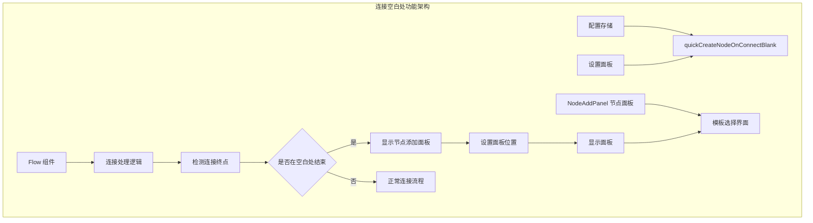

**图表来源**
- [Flow.tsx:280-323](file://src/components/Flow.tsx#L280-L323)
- [configStore.ts:188](file://src/stores/configStore.ts#L188)
- [NodeAddPanel.tsx:276-583](file://src/components/panels/main/NodeAddPanel.tsx#L276-L583)

#### 连接处理机制
系统通过精确的连接状态检测来判断连接是否在空白处结束：

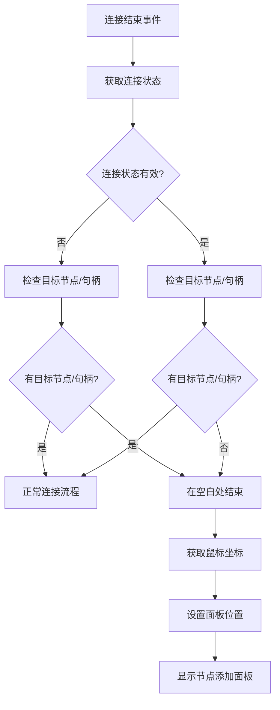

**图表来源**
- [Flow.tsx:295-321](file://src/components/Flow.tsx#L295-L321)

#### 面板显示逻辑
节点添加面板采用智能定位策略，确保在各种屏幕尺寸下的最佳用户体验：

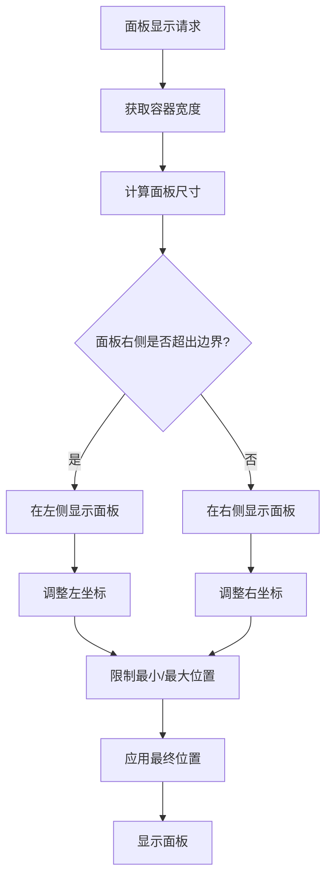

**图表来源**
- [NodeAddPanel.tsx:420-439](file://src/components/panels/main/NodeAddPanel.tsx#L420-L439)

#### 设置配置管理
用户可以通过设置面板控制此功能的行为：

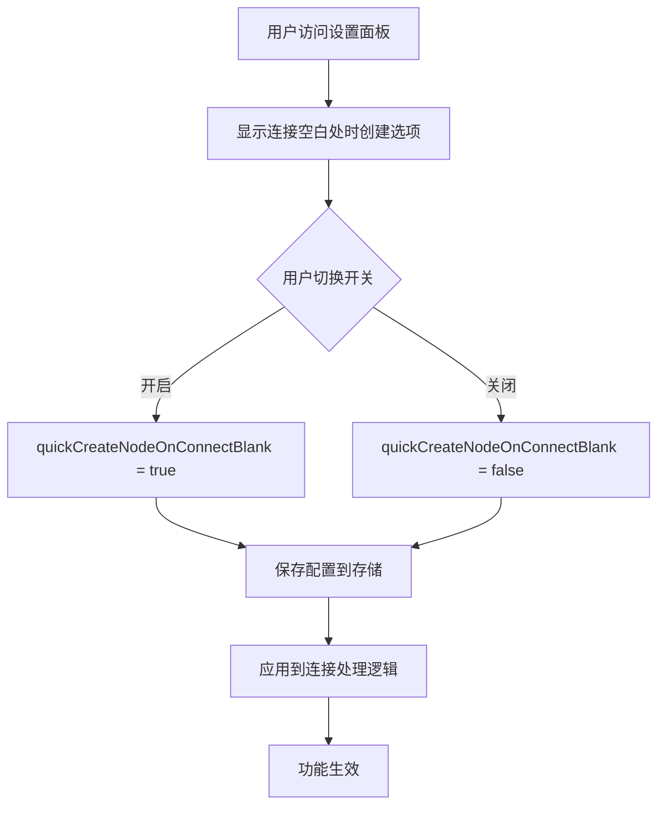

**图表来源**
- [PipelineConfigSection.tsx:135-163](file://src/components/panels/config/PipelineConfigSection.tsx#L135-L163)
- [configStore.ts:188](file://src/stores/configStore.ts#L188)

**章节来源**
- [Flow.tsx:280-323](file://src/components/Flow.tsx#L280-L323)
- [NodeAddPanel.tsx:276-583](file://src/components/panels/main/NodeAddPanel.tsx#L276-L583)
- [PipelineConfigSection.tsx:135-163](file://src/components/panels/config/PipelineConfigSection.tsx#L135-L163)
- [configStore.ts:188](file://src/stores/configStore.ts#L188)

### 自定义排序功能实现

#### 功能概述
版本1.3.1引入了自定义排序功能，该功能能够同步影响字段面板与节点渲染，确保字段顺序的一致性。这一功能通过以下组件实现：

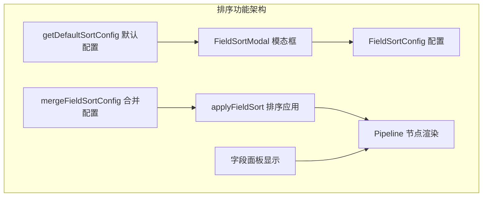

**图表来源**
- [FieldSortModal.tsx:106-184](file://src/components/modals/FieldSortModal.tsx#L106-L184)
- [applySort.ts:314-326](file://src/core/sorting/applySort.ts#L314-L326)
- [defaults.ts:122-130](file://src/core/sorting/defaults.ts#L122-L130)

#### 排序配置管理
系统提供了完整的排序配置管理机制：

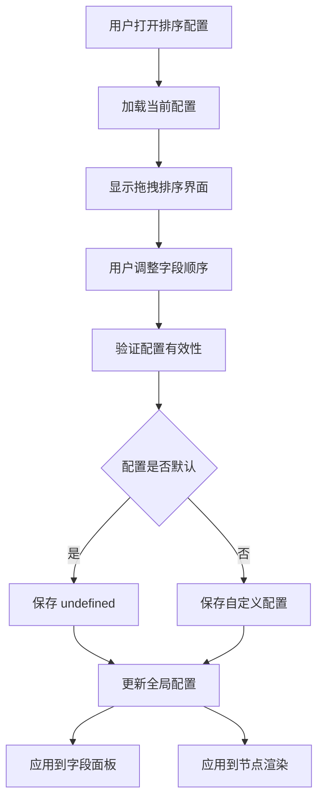

**图表来源**
- [FieldSortModal.tsx:158-184](file://src/components/modals/FieldSortModal.tsx#L158-L184)
- [configStore.ts:153-155](file://src/stores/configStore.ts#L153-L155)

#### 排序应用机制
排序功能通过以下步骤应用到系统各个组件：

1. **配置加载**：从配置存储中获取当前排序配置
2. **配置合并**：将用户配置与默认配置合并
3. **排序应用**：根据协议版本应用相应的排序策略
4. **结果应用**：将排序结果应用到字段面板和节点渲染

**章节来源**
- [FieldSortModal.tsx:106-184](file://src/components/modals/FieldSortModal.tsx#L106-L184)
- [applySort.ts:314-326](file://src/core/sorting/applySort.ts#L314-L326)
- [configStore.ts:153-155](file://src/stores/configStore.ts#L153-L155)

### 用户交互流程

#### 自动显示机制
系统会在检测到版本更新时自动显示更新日志：

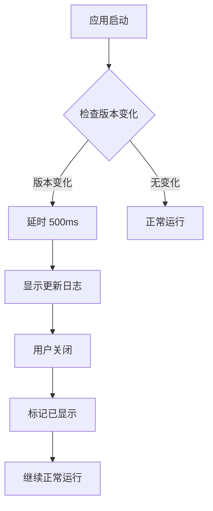

**图表来源**
- [Header.tsx:267-277](file://src/components/Header.tsx#L267-L277)

#### 手动触发机制
用户也可以随时通过头部导航栏的手动触发：

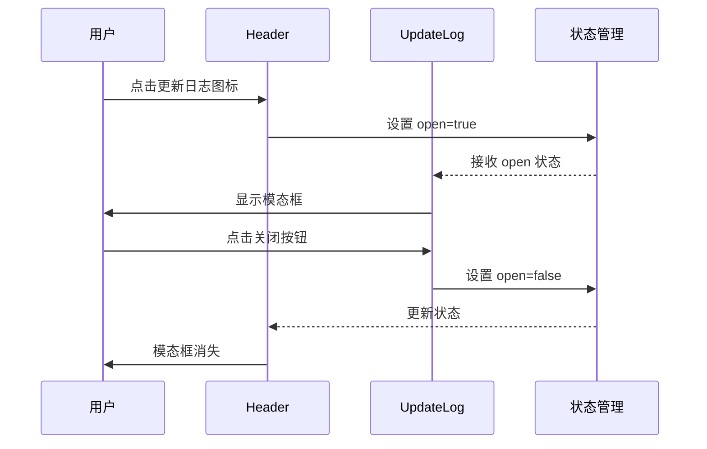

**图表来源**
- [Header.tsx:393-414](file://src/components/Header.tsx#L393-L414)
- [UpdateLog.tsx:147-156](file://src/components/modals/UpdateLog.tsx#L147-L156)

#### 连接空白处交互流程
用户通过拖拽连接到空白处来唤起节点添加面板：

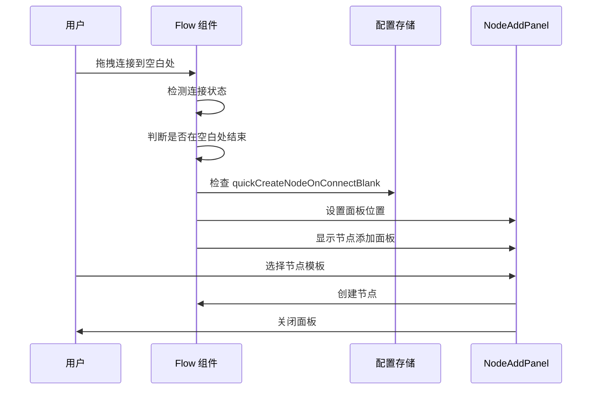

**图表来源**
- [Flow.tsx:295-321](file://src/components/Flow.tsx#L295-L321)
- [configStore.ts:188](file://src/stores/configStore.ts#L188)
- [NodeAddPanel.tsx:317-330](file://src/components/panels/main/NodeAddPanel.tsx#L317-L330)

**章节来源**
- [Header.tsx:267-277](file://src/components/Header.tsx#L267-L277)
- [Header.tsx:393-414](file://src/components/Header.tsx#L393-L414)
- [Flow.tsx:295-321](file://src/components/Flow.tsx#L295-L321)

## 依赖分析

### 组件依赖关系

```mermaid
graph TB
subgraph "外部依赖"
A[React]
B[Ant Design]
C[Ant Design Icons]
D[@dnd-kit/core]
E[@dnd-kit/sortable]
end
subgraph "内部依赖"
F[updateLogs 数据]
G[Header 组件]
H[全局配置]
I[FieldSortConfig 类型]
J[FieldSortModal 组件]
K[applyFieldSort 函数]
L[NodeAddPanel 组件]
M[Flow 组件]
N[配置存储]
end
subgraph "核心组件"
O[UpdateLog 模态框]
P[Timeline 时间轴]
Q[Typography 文本]
R[Tag 标签]
S[Alert 警告框]
end
A --> O
B --> O
C --> O
D --> J
E --> J
F --> O
G --> O
H --> G
I --> J
J --> K
K --> O
L --> M
M --> N
O --> P
O --> Q
O --> R
O --> S
```

**图表来源**
- [UpdateLog.tsx:1-4](file://src/components/modals/UpdateLog.tsx#L1-L4)
- [Header.tsx:24](file://src/components/Header.tsx#L24)
- [FieldSortModal.tsx:1-31](file://src/components/modals/FieldSortModal.tsx#L1-L31)
- [NodeAddPanel.tsx:1-13](file://src/components/panels/main/NodeAddPanel.tsx#L1-L13)
- [Flow.tsx:1-13](file://src/components/Flow.tsx#L1-L13)

### 数据依赖链

系统采用单向数据流设计，确保数据的一致性和可预测性：

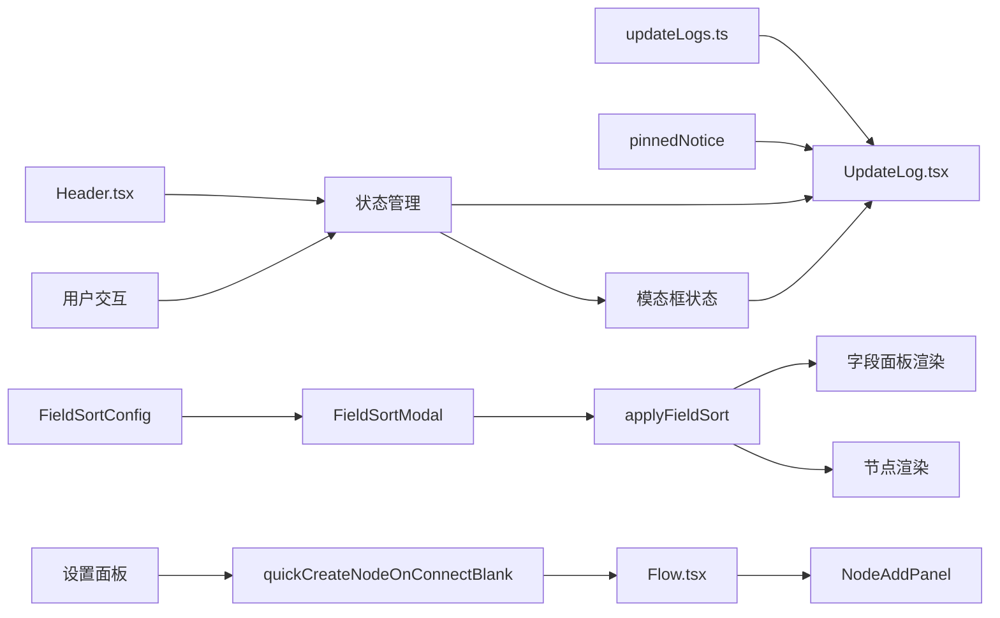

**图表来源**
- [updateLogs.ts:39-47](file://src/data/updateLogs.ts#L39-L47)
- [UpdateLog.tsx:3](file://src/components/modals/UpdateLog.tsx#L3)
- [FieldSortModal.tsx:21-29](file://src/components/modals/FieldSortModal.tsx#L21-L29)
- [applySort.ts:314-326](file://src/core/sorting/applySort.ts#L314-L326)
- [configStore.ts:188](file://src/stores/configStore.ts#L188)
- [Flow.tsx:280-323](file://src/components/Flow.tsx#L280-L323)
- [NodeAddPanel.tsx:276-583](file://src/components/panels/main/NodeAddPanel.tsx#L276-L583)

**章节来源**
- [UpdateLog.tsx:1-4](file://src/components/modals/UpdateLog.tsx#L1-L4)
- [updateLogs.ts:39-47](file://src/data/updateLogs.ts#L39-L47)
- [FieldSortModal.tsx:21-29](file://src/components/modals/FieldSortModal.tsx#L21-L29)
- [configStore.ts:188](file://src/stores/configStore.ts#L188)

## 性能考虑

### 渲染优化策略

1. **虚拟滚动**：对于大量历史记录，可考虑实现虚拟滚动以提升性能
2. **懒加载**：置顶公告和版本历史可实现懒加载
3. **记忆化**：Markdown 解析结果可进行缓存
4. **防抖处理**：窗口大小变化时的响应式处理

### 内存管理
- 组件卸载时自动清理事件监听器
- 状态管理采用局部状态，避免全局污染
- 图标和样式的动态加载优化

### 全局快捷键性能优化

**更新** 最新版本引入了重要的性能优化：模态框内不再监听撤销等全局快捷键

#### 优化背景
在之前的版本中，全局快捷键监听器会持续监听所有键盘事件，即使在模态框打开时也是如此。这会导致以下性能问题：
- 额外的事件处理开销
- 模态框内输入体验受影响
- 不必要的状态检查

#### 优化实现
通过 `useGlobalShortcuts` Hook 中的 `isModalOpen()` 函数检测模态框状态，当模态框打开时自动跳过全局快捷键处理：

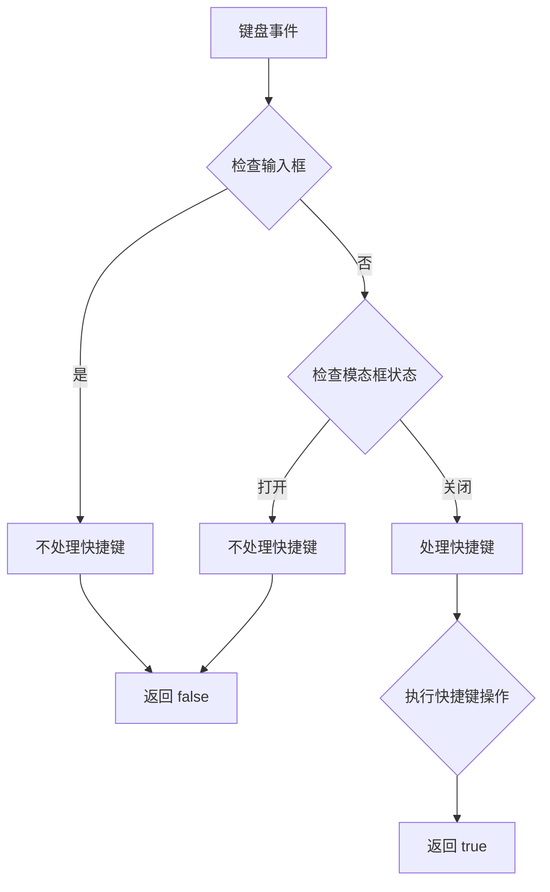

**图表来源**
- [useGlobalShortcuts.ts:19-26](file://src/hooks/useGlobalShortcuts.ts#L19-L26)
- [useGlobalShortcuts.ts:122-125](file://src/hooks/useGlobalShortcuts.ts#L122-L125)

#### 性能收益
- 减少不必要的事件处理
- 提升模态框内输入响应速度
- 降低 CPU 占用率
- 改善整体应用流畅度

### 连接空白处功能性能优化

**更新** 新增的连接空白处功能采用了高效的事件处理机制：

#### 事件处理优化
- **条件检查**：仅在启用功能时才进行连接状态检测
- **坐标缓存**：避免重复计算鼠标坐标
- **面板复用**：面板位置改变时仅更新样式属性
- **事件抑制**：连接完成后抑制后续面板点击事件

#### 面板显示优化
- **智能定位**：自动检测屏幕边界，避免面板溢出
- **延迟加载**：面板显示时再进行焦点设置
- **状态管理**：通过配置存储统一管理面板状态

**章节来源**
- [useGlobalShortcuts.ts:156-168](file://src/hooks/useGlobalShortcuts.ts#L156-L168)
- [Flow.tsx:295-321](file://src/components/Flow.tsx#L295-L321)
- [NodeAddPanel.tsx:420-439](file://src/components/panels/main/NodeAddPanel.tsx#L420-L439)

## 故障排除指南

### 常见问题及解决方案

#### 更新日志不显示
**症状**：点击更新日志图标无反应
**可能原因**：
- 版本检测逻辑异常
- 状态管理问题
- 组件渲染错误

**解决步骤**：
1. 检查版本检测逻辑（localStorage 中的版本号）
2. 验证状态管理器是否正确传递 props
3. 查看控制台错误信息

#### Markdown 格式解析失败
**症状**：链接或加粗文本显示异常
**可能原因**：
- 正则表达式匹配错误
- HTML 结构构建问题
- 样式冲突

**解决步骤**：
1. 验证正则表达式的正确性
2. 检查 React 元素的 key 属性
3. 确认样式类名的正确性

#### 性能问题
**症状**：页面加载缓慢或模态框打开卡顿
**可能原因**：
- 大量 DOM 元素渲染
- 事件监听器过多
- 样式计算复杂

**优化建议**：
1. 实现虚拟滚动
2. 减少不必要的 re-render
3. 优化 CSS 样式

#### 全局快捷键冲突
**症状**：模态框内无法正常使用撤销/重做快捷键
**可能原因**：
- 全局快捷键监听器未正确检测模态框状态
- 事件冒泡处理不当

**解决步骤**：
1. 检查 `isModalOpen()` 函数的模态框检测逻辑
2. 验证事件监听器的条件判断
3. 确认快捷键处理函数的返回值

#### 自定义排序功能异常
**症状**：字段排序配置无效或排序结果不符合预期
**可能原因**：
- 配置存储问题
- 排序应用逻辑错误
- 字段面板渲染问题

**解决步骤**：
1. 检查 `fieldSortConfig` 配置是否正确保存
2. 验证 `applyFieldSort` 函数的排序逻辑
3. 确认字段面板和节点渲染是否正确应用排序

#### 连接空白处功能异常
**症状**：拖拽连接到空白处无法唤起节点面板
**可能原因**：
- 配置开关未正确设置
- 连接状态检测逻辑错误
- 面板显示位置计算问题

**解决步骤**：
1. 检查 `quickCreateNodeOnConnectBlank` 配置是否为 true
2. 验证连接结束事件的处理逻辑
3. 确认面板位置计算是否正确
4. 检查鼠标坐标获取是否正常

#### 节点添加面板显示问题
**症状**：节点面板显示位置异常或无法关闭
**可能原因**：
- 屏幕边界检测错误
- 面板状态管理问题
- 事件处理冲突

**解决步骤**：
1. 检查容器宽度获取是否正确
2. 验证面板位置计算逻辑
3. 确认事件处理器是否正确阻止默认行为
4. 检查面板可见性状态管理

**章节来源**
- [UpdateLog.tsx:15-61](file://src/components/modals/UpdateLog.tsx#L15-L61)
- [Header.tsx:267-277](file://src/components/Header.tsx#L267-L277)
- [useGlobalShortcuts.ts:156-168](file://src/hooks/useGlobalShortcuts.ts#L156-L168)
- [FieldSortModal.tsx:158-184](file://src/components/modals/FieldSortModal.tsx#L158-L184)
- [Flow.tsx:295-321](file://src/components/Flow.tsx#L295-L321)
- [NodeAddPanel.tsx:420-439](file://src/components/panels/main/NodeAddPanel.tsx#L420-L439)

## 结论

UpdateLogs.ts 系统展现了优秀的前端架构设计，通过清晰的分层结构、强类型的数据管理和优雅的用户界面，为用户提供了优质的版本更新浏览体验。

### 主要优势
1. **模块化设计**：组件职责明确，易于维护和扩展
2. **类型安全**：完整的 TypeScript 类型定义确保数据完整性
3. **用户体验**：直观的界面设计和流畅的交互体验
4. **可扩展性**：良好的架构支持未来功能扩展

### 技术亮点
- 响应式设计适配多种设备
- 高效的 Markdown 解析算法
- 智能的版本检测机制
- 灵活的分类展示系统
- 高效的连接空白处处理机制

**更新** 最新版本（1.3.1）特别体现了系统在功能增强方面的重大突破。通过引入完整的排序配置系统和连接空白处功能，用户现在可以自定义导出时的字段排序顺序，该配置会同步影响字段面板与节点渲染，确保字段顺序的一致性。同时，连接空白处功能允许用户在拖拽连接到画布空白处时直接唤起新增节点面板，提升工作效率。

**更新** 版本1.3.1的发布日期已修正为'2026-3-25'，确保了版本发布的准确时间记录。这一修正虽然看似简单，但对于版本管理的准确性至关重要，有助于用户和开发者更好地追踪软件的发展历程。

版本1.3.0同样体现了系统在状态管理方面的改进和性能优化。通过修复"删除重复节点名后未及时更新状态的问题"和引入"模态框内不再监听撤销等全局快捷键"的性能优化，显著提升了系统的稳定性和响应性能。

这一性能优化通过智能的模态框状态检测，避免了在模态框打开时对全局快捷键事件的处理，从而减少了不必要的计算开销，提升了应用的整体流畅度。这一改进反映了开发团队对用户体验细节的关注和对系统性能的持续追求。

连接空白处功能的实现展示了现代前端开发的最佳实践：通过精确的状态检测、高效的事件处理和智能的界面定位，为用户提供了无缝的交互体验。该功能不仅提升了工作效率，还保持了系统的整体性能和稳定性。

该系统不仅满足了当前的功能需求，更为未来的功能扩展奠定了坚实的技术基础。