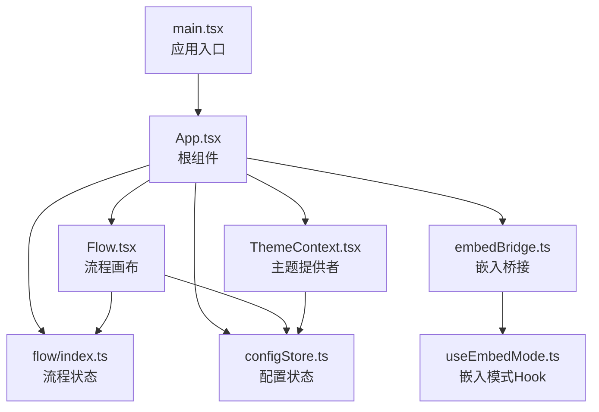
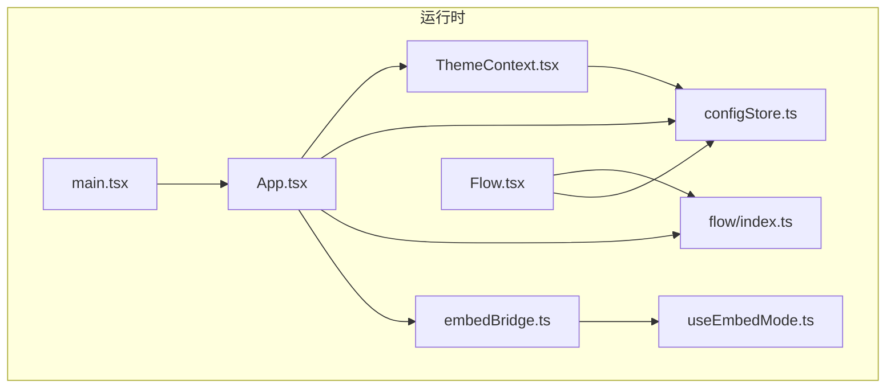
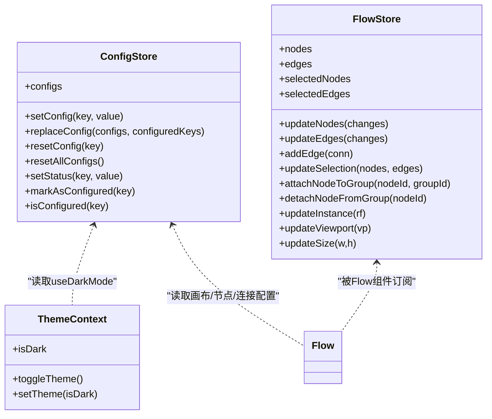
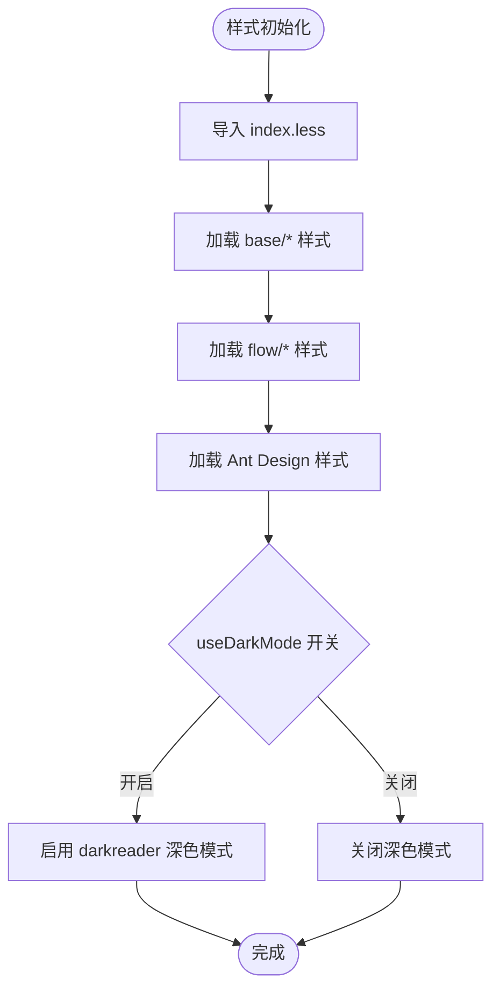
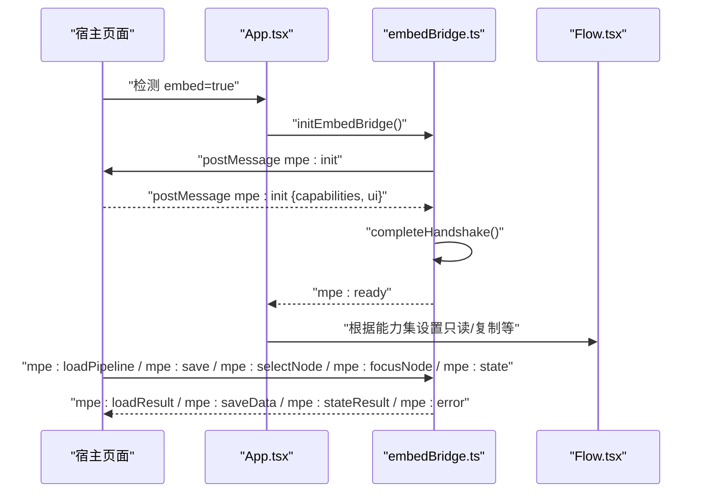
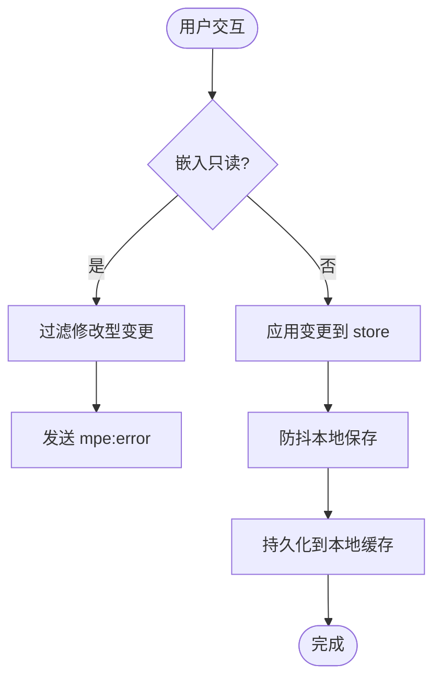
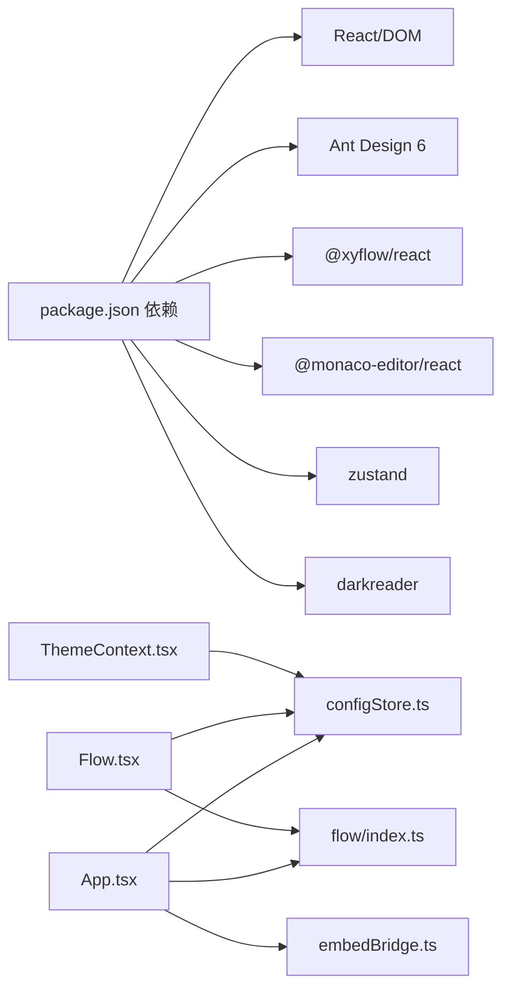

# 前端架构

<cite>
**本文引用的文件**
- [package.json](file://package.json)
- [vite.config.ts](file://vite.config.ts)
- [src/main.tsx](file://src/main.tsx)
- [src/App.tsx](file://src/App.tsx)
- [tsconfig.json](file://tsconfig.json)
- [src/styles/index.less](file://src/styles/index.less)
- [src/contexts/ThemeContext.tsx](file://src/contexts/ThemeContext.tsx)
- [src/components/Flow.tsx](file://src/components/Flow.tsx)
- [src/stores/flow/index.ts](file://src/stores/flow/index.ts)
- [src/stores/configStore.ts](file://src/stores/configStore.ts)
- [src/hooks/useEmbedMode.ts](file://src/hooks/useEmbedMode.ts)
- [src/utils/embedBridge.ts](file://src/utils/embedBridge.ts)
</cite>

## 目录
1. [引言](#引言)
2. [项目结构](#项目结构)
3. [核心组件](#核心组件)
4. [架构总览](#架构总览)
5. [详细组件分析](#详细组件分析)
6. [依赖分析](#依赖分析)
7. [性能考虑](#性能考虑)
8. [故障排查指南](#故障排查指南)
9. [结论](#结论)
10. [附录](#附录)

## 引言
本文件面向MaaPipelineEditor前端，聚焦于基于React 18 + TypeScript + Vite的现代技术栈，系统梳理组件层次与模块化设计、Zustand状态管理架构与使用模式、样式系统（Less/主题/响应式）、构建配置与开发工具链、TypeScript类型体系在大型项目中的应用，并提供组件设计模式、最佳实践与性能优化策略。

## 项目结构
- 技术栈
  - 前端框架：React 18（通过@vitejs/plugin-react-swc启用SWC加速）
  - 状态管理：Zustand（轻量、函数式slice组合）
  - 可视化与流程图：@xyflow/react
  - UI库：Ant Design 6（配合darkreader实现深色主题）
  - 编辑器：Monaco Editor（集成@monaco-editor/react）
  - 样式：Less（模块化Less + Ant Design样式覆盖）
  - 构建：Vite（Rollup打包、代码分割、开发服务器）
  - 类型：TypeScript（多项目引用配置）
- 关键入口
  - 应用入口：src/main.tsx
  - 根组件：src/App.tsx
  - 主题上下文：src/contexts/ThemeContext.tsx
  - 流程画布：src/components/Flow.tsx
  - 状态中心：src/stores/flow/index.ts、src/stores/configStore.ts
  - 嵌入桥接：src/utils/embedBridge.ts、src/hooks/useEmbedMode.ts

**图表来源**
- [src/main.tsx:1-20](file://src/main.tsx#L1-L20)
- [src/App.tsx:1-597](file://src/App.tsx#L1-L597)
- [src/components/Flow.tsx:1-709](file://src/components/Flow.tsx#L1-L709)
- [src/contexts/ThemeContext.tsx:1-68](file://src/contexts/ThemeContext.tsx#L1-L68)
- [src/stores/configStore.ts:1-440](file://src/stores/configStore.ts#L1-L440)
- [src/stores/flow/index.ts:1-124](file://src/stores/flow/index.ts#L1-L124)
- [src/utils/embedBridge.ts:1-282](file://src/utils/embedBridge.ts#L1-L282)
- [src/hooks/useEmbedMode.ts:1-30](file://src/hooks/useEmbedMode.ts#L1-L30)

**章节来源**
- [package.json:1-75](file://package.json#L1-L75)
- [vite.config.ts:1-66](file://vite.config.ts#L1-L66)
- [src/main.tsx:1-20](file://src/main.tsx#L1-L20)
- [src/App.tsx:1-597](file://src/App.tsx#L1-L597)
- [tsconfig.json:1-8](file://tsconfig.json#L1-L8)

## 核心组件
- 应用入口与初始化
  - 初始化WebSocket与开发控制台，挂载StrictMode根节点，渲染App。
- 根组件App
  - 负责嵌入模式检测与桥接、URL参数解析、WebSocket连接、新手引导、星标提醒、文件拖拽导入、主题Provider包裹。
- 流程画布Flow
  - 基于@xyflow/react，封装节点/边变更、复制粘贴、磁吸对齐、视口变化持久化、内联字段/边面板、快捷键监听、只读与能力控制。
- 主题上下文ThemeContext
  - 基于darkreader动态切换深色模式，与配置状态联动。
- 状态管理
  - 配置状态：集中管理导出、节点、连接、画布、组件、本地服务、AI等配置项及默认值、迁移与持久化。
  - 流程状态：以Zustand slice组合方式组织视图、选择、历史、节点、边、图谱、路径、锚点、探索等状态域。
- 嵌入桥接
  - 提供postMessage双向通信、握手协议、能力集与UI配置、消息路由与清理。

**章节来源**
- [src/main.tsx:1-20](file://src/main.tsx#L1-L20)
- [src/App.tsx:136-597](file://src/App.tsx#L136-L597)
- [src/components/Flow.tsx:235-709](file://src/components/Flow.tsx#L235-L709)
- [src/contexts/ThemeContext.tsx:22-68](file://src/contexts/ThemeContext.tsx#L22-L68)
- [src/stores/configStore.ts:270-440](file://src/stores/configStore.ts#L270-L440)
- [src/stores/flow/index.ts:18-28](file://src/stores/flow/index.ts#L18-L28)
- [src/utils/embedBridge.ts:70-282](file://src/utils/embedBridge.ts#L70-L282)

## 架构总览
整体采用“入口 -> 根组件 -> 功能模块 -> 状态中心”的分层架构；Flow作为核心可视化容器，承载节点与边的增删改查、布局与交互；ThemeContext与ConfigStore共同驱动UI外观与行为；嵌入桥接模块在iframe场景下提供协议化的宿主通信。

**图表来源**
- [src/main.tsx:1-20](file://src/main.tsx#L1-L20)
- [src/App.tsx:1-597](file://src/App.tsx#L1-L597)
- [src/contexts/ThemeContext.tsx:1-68](file://src/contexts/ThemeContext.tsx#L1-L68)
- [src/components/Flow.tsx:1-709](file://src/components/Flow.tsx#L1-L709)
- [src/stores/configStore.ts:1-440](file://src/stores/configStore.ts#L1-L440)
- [src/stores/flow/index.ts:1-124](file://src/stores/flow/index.ts#L1-L124)
- [src/utils/embedBridge.ts:1-282](file://src/utils/embedBridge.ts#L1-L282)
- [src/hooks/useEmbedMode.ts:1-30](file://src/hooks/useEmbedMode.ts#L1-L30)

## 详细组件分析

### Zustand状态管理架构与使用模式
- 设计原则
  - Slice组合：将大状态拆分为视图、选择、历史、节点、边、图谱、路径、锚点、探索等slice，分别创建并合并，提升可维护性与可测试性。
  - 函数式更新：通过create返回的set/get组合，避免类组件复杂生命周期。
  - 类型安全：通过FlowStore与各slice输入输出类型约束，保证跨模块协作一致性。
- 关键使用
  - Flow状态：useFlowStore通过useShallow浅比较订阅，减少无关渲染；提供节点/边增删改、选择、历史、分组图元、坐标转换等方法。
  - 配置状态：useConfigStore集中管理配置默认值、迁移、加解密（如AI密钥）、持久化与批量替换；提供分类映射与导出过滤。
- 最佳实践
  - 将副作用（如localStorage、网络请求）放在store内部或通过中间件封装，保持组件纯净。
  - 对高频更新的slice使用useShallow订阅，避免不必要的重渲染。
  - 将跨组件共享的纯逻辑抽离为store辅助函数，统一入口调用。

**图表来源**
- [src/stores/configStore.ts:270-440](file://src/stores/configStore.ts#L270-L440)
- [src/stores/flow/index.ts:18-28](file://src/stores/flow/index.ts#L18-L28)
- [src/contexts/ThemeContext.tsx:22-68](file://src/contexts/ThemeContext.tsx#L22-L68)
- [src/components/Flow.tsx:235-709](file://src/components/Flow.tsx#L235-L709)

**章节来源**
- [src/stores/flow/index.ts:1-124](file://src/stores/flow/index.ts#L1-L124)
- [src/stores/configStore.ts:1-440](file://src/stores/configStore.ts#L1-L440)

### 样式系统：Less、主题定制与响应式
- 结构与组织
  - 入口样式聚合：src/styles/index.less引入基础、全局、流程画布与Ant Design样式。
  - 基础与全局：字体、用户选择禁用、滚动与最小尺寸约束等。
  - Ant Design覆盖：通过Ant Design Less变量覆盖实现主题与组件样式定制。
- 主题定制
  - ThemeProvider结合darkreader动态切换深色模式，受useDarkMode配置控制。
  - 画布背景模式：pure/eyecare两种模式，影响背景色。
- 响应式与布局
  - 通过Flex布局与Less模块化样式控制面板与画布区域的自适应与间距。
  - Flow画布使用ResizeObserver与防抖更新尺寸，保障视口变化时的稳定性。

**图表来源**
- [src/styles/index.less:1-30](file://src/styles/index.less#L1-L30)
- [src/contexts/ThemeContext.tsx:22-68](file://src/contexts/ThemeContext.tsx#L22-L68)

**章节来源**
- [src/styles/index.less:1-30](file://src/styles/index.less#L1-L30)
- [src/contexts/ThemeContext.tsx:1-68](file://src/contexts/ThemeContext.tsx#L1-L68)
- [src/components/Flow.tsx:624-645](file://src/components/Flow.tsx#L624-L645)

### 嵌入模式与桥接通信
- 场景与目标
  - 在iframe中运行，宿主通过postMessage进行协议化通信，支持只读、复制、撤销重做、自动布局、AI、搜索、自定义模板等能力开关与UI隐藏面板。
- 关键流程
  - 环境检测：通过URL参数判断是否嵌入模式。
  - 握手：接收宿主mpe:init，完成能力集与UI配置下发，发送mpe:ready。
  - 生命周期：注册消息处理器，提供sendToParent与onParentMessage；在App卸载时清理。
  - 能力控制：Flow根据能力集限制节点/边变更与连接创建。
- 数据契约
  - 协议版本、消息类型、请求ID、负载体；能力集与UI配置默认值与校验。

**图表来源**
- [src/App.tsx:184-352](file://src/App.tsx#L184-L352)
- [src/utils/embedBridge.ts:179-282](file://src/utils/embedBridge.ts#L179-L282)
- [src/components/Flow.tsx:300-331](file://src/components/Flow.tsx#L300-L331)

**章节来源**
- [src/hooks/useEmbedMode.ts:1-30](file://src/hooks/useEmbedMode.ts#L1-L30)
- [src/utils/embedBridge.ts:1-282](file://src/utils/embedBridge.ts#L1-L282)
- [src/App.tsx:184-352](file://src/App.tsx#L184-L352)

### 流程画布与交互
- 核心能力
  - 节点/边变更：支持只读模式下的选择性变更过滤；连接起止/结束事件处理；双击/右键空白处打开节点添加面板。
  - 磁吸对齐：基于视口与节点集合计算对齐参考线，拖拽时实时更新，松开时落位。
  - 视口与尺寸：监听视口变化与容器尺寸变化，防抖保存视口与尺寸。
  - 快捷键：复制/粘贴节点，忽略文本编辑器焦点。
  - 内联面板：节点/边字段面板随选择变化即时展示。
- 性能要点
  - 使用useShallow订阅flow状态，避免无关渲染。
  - ResizeObserver与debounce减少频繁计算。
  - 只读模式下过滤修改型变更，降低无效更新。

**图表来源**
- [src/components/Flow.tsx:300-345](file://src/components/Flow.tsx#L300-L345)
- [src/components/Flow.tsx:173-186](file://src/components/Flow.tsx#L173-L186)

**章节来源**
- [src/components/Flow.tsx:1-709](file://src/components/Flow.tsx#L1-L709)

## 依赖分析
- 外部依赖
  - React 18 + SWC：高性能开发体验与构建速度。
  - Ant Design 6 + darkreader：提供成熟UI与深色主题能力。
  - @xyflow/react：流程图绘制与交互。
  - Monaco Editor：代码/JSON编辑能力。
  - zustand：轻量状态管理，支持slice组合与中间件扩展。
- 内部耦合
  - App对配置、WebSocket、嵌入桥接、分享参数、文件缓存均有强依赖。
  - Flow对配置与流程状态高度耦合，同时通过useShallow降低渲染成本。
  - ThemeContext与ConfigStore弱耦合，仅读取useDarkMode。

**图表来源**
- [package.json:24-48](file://package.json#L24-L48)
- [src/App.tsx:15-72](file://src/App.tsx#L15-L72)
- [src/components/Flow.tsx:30-42](file://src/components/Flow.tsx#L30-L42)
- [src/contexts/ThemeContext.tsx:2-6](file://src/contexts/ThemeContext.tsx#L2-L6)

**章节来源**
- [package.json:1-75](file://package.json#L1-L75)
- [src/App.tsx:1-597](file://src/App.tsx#L1-L597)
- [src/components/Flow.tsx:1-709](file://src/components/Flow.tsx#L1-L709)

## 性能考虑
- 代码分割
  - Vite Rollup按模块拆分：monaco-editor、tesseract.js、react-json-view独立chunk，减少首屏体积与并行加载压力。
- 构建与懒加载
  - App内对JsonViewer与DebugModal使用React.lazy与Suspense，按需加载。
  - Flow内部对节点/边面板与内联面板采用条件渲染，避免常驻DOM。
- 渲染优化
  - Flow使用useShallow订阅flow状态，减少不必要重渲染。
  - ResizeObserver与debounce更新尺寸与视口，避免高频计算。
- 状态与缓存
  - 配置状态持久化到localStorage，启动时恢复；Flow变更采用防抖本地保存，降低写盘频率。
- 嵌入模式优化
  - 只读模式下过滤修改型变更，减少无效更新与消息往返。

**章节来源**
- [vite.config.ts:24-40](file://vite.config.ts#L24-L40)
- [src/App.tsx:75-80](file://src/App.tsx#L75-L80)
- [src/components/Flow.tsx:79-92](file://src/components/Flow.tsx#L79-L92)
- [src/components/Flow.tsx:624-645](file://src/components/Flow.tsx#L624-L645)
- [src/stores/configStore.ts:417-440](file://src/stores/configStore.ts#L417-L440)

## 故障排查指南
- 嵌入模式问题
  - 现象：无法接收宿主消息或能力集未生效。
  - 排查：确认URL参数embed=true与origin校验；检查握手是否完成；查看控制台错误与消息路由。
- 只读模式误判
  - 现象：用户无法拖拽/连线。
  - 排查：检查嵌入能力集中的readOnly与allowUndoRedo；确认Flow对修改型变更的过滤逻辑。
- 主题切换异常
  - 现象：深色模式未生效或切换无效。
  - 排查：确认useDarkMode配置项；检查darkreader启用/禁用时机；确认ThemeContext Provider包裹范围。
- WebSocket连接失败
  - 现象：无法连接本地服务或断连不清空设备状态。
  - 排查：检查wsPort与wsAutoConnect；确认App中连接逻辑与断连回调；验证Wails环境与端口事件。
- 性能卡顿
  - 现象：拖拽/缩放/频繁变更导致卡顿。
  - 排查：确认useShallow订阅；检查ResizeObserver与debounce参数；评估是否需要拆分更多懒加载模块。

**章节来源**
- [src/utils/embedBridge.ts:179-282](file://src/utils/embedBridge.ts#L179-L282)
- [src/components/Flow.tsx:300-345](file://src/components/Flow.tsx#L300-L345)
- [src/contexts/ThemeContext.tsx:22-68](file://src/contexts/ThemeContext.tsx#L22-L68)
- [src/App.tsx:415-493](file://src/App.tsx#L415-L493)

## 结论
本前端架构以React 18 + TypeScript + Vite为基础，结合Zustand的slice化状态管理、Less样式体系与@xyflow/react流程图能力，形成高可维护、可扩展且具备良好用户体验的编辑器前端。通过嵌入桥接协议、防抖与懒加载等策略，兼顾功能完整性与性能表现。建议持续完善类型体系、增强单元测试覆盖率，并在后续迭代中进一步细化模块边界与状态契约。

## 附录
- TypeScript配置
  - 多项目引用：app与node分别配置，统一根references。
- 构建与脚本
  - 开发：vite dev；生产：vite build；多模式构建：--mode extremer/past等；测试：vitest + happy-dom；覆盖率：v8报告器。
- 开发工具链
  - ESLint + TypeScript ESLint；React Hooks/React Refresh插件；Less编译；Monaco Editor与Tesseract.js按需加载。

**章节来源**
- [tsconfig.json:1-8](file://tsconfig.json#L1-L8)
- [package.json:6-23](file://package.json#L6-L23)
- [vite.config.ts:47-63](file://vite.config.ts#L47-L63)