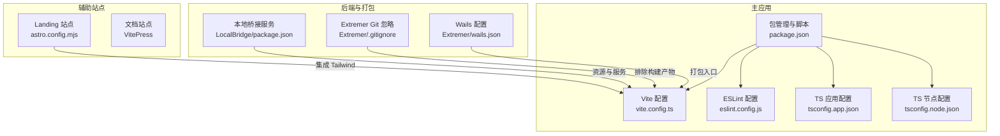
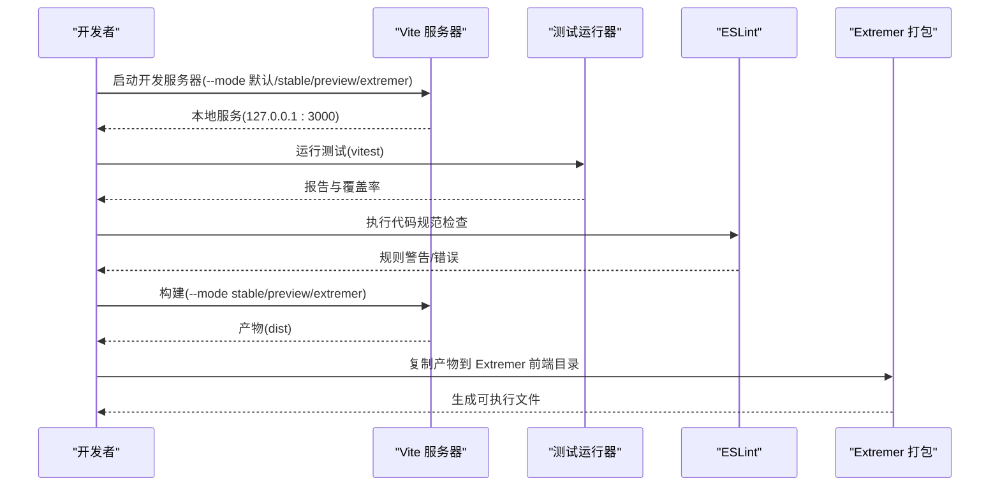
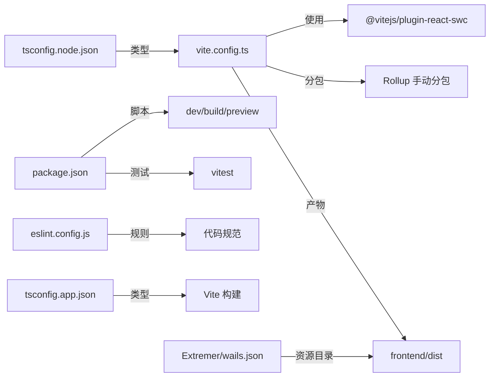

# 构建配置与开发工具

<cite>
**本文引用的文件**
- [vite.config.ts](file://vite.config.ts)
- [package.json](file://package.json)
- [eslint.config.js](file://eslint.config.js)
- [tsconfig.json](file://tsconfig.json)
- [tsconfig.app.json](file://tsconfig.app.json)
- [tsconfig.node.json](file://tsconfig.node.json)
- [.gitignore](file://.gitignore)
- [Landing/astro.config.mjs](file://Landing/astro.config.mjs)
- [Extremer/.gitignore](file://Extremer/.gitignore)
- [Extremer/wails.json](file://Extremer/wails.json)
- [LocalBridge/package.json](file://LocalBridge/package.json)
</cite>

## 目录
1. [简介](#简介)
2. [项目结构](#项目结构)
3. [核心组件](#核心组件)
4. [架构总览](#架构总览)
5. [详细组件分析](#详细组件分析)
6. [依赖关系分析](#依赖关系分析)
7. [性能考虑](#性能考虑)
8. [故障排查指南](#故障排查指南)
9. [结论](#结论)
10. [附录](#附录)

## 简介
本文件系统性梳理 MaaPipelineEditor 的前端构建配置与开发工具链，覆盖 Vite、TypeScript、ESLint、Git 忽略规则、开发与预览模式、分包策略、测试与覆盖率、以及与 Wails 打包集成的构建流程。目标是帮助开发者快速理解并高效使用当前的构建与开发体系。

## 项目结构
该仓库采用多模块组织：主应用（Vite + React + TypeScript）、Landing 页面（Astro）、文档站点（VitePress）、本地桥接服务（Go）以及打包宿主（Extremer，基于 Wails）。各模块拥有独立的构建与配置文件，通过顶层脚本进行统一调度。

图表来源
- [vite.config.ts](file://vite.config.ts)
- [package.json](file://package.json)
- [eslint.config.js](file://eslint.config.js)
- [tsconfig.app.json](file://tsconfig.app.json)
- [tsconfig.node.json](file://tsconfig.node.json)
- [Landing/astro.config.mjs](file://Landing/astro.config.mjs)
- [Extremer/.gitignore](file://Extremer/.gitignore)
- [Extremer/wails.json](file://Extremer/wails.json)
- [LocalBridge/package.json](file://LocalBridge/package.json)

章节来源
- [vite.config.ts](file://vite.config.ts)
- [package.json](file://package.json)
- [Landing/astro.config.mjs](file://Landing/astro.config.mjs)
- [Extremer/.gitignore](file://Extremer/.gitignore)
- [Extremer/wails.json](file://Extremer/wails.json)
- [LocalBridge/package.json](file://LocalBridge/package.json)

## 核心组件
- Vite 构建与开发服务器：定义基础路径、开发服务器地址与端口、插件、分包策略、别名与测试配置。
- TypeScript 多配置：应用侧与节点侧分别配置，确保严格类型与打包器模式兼容。
- ESLint 规范：基于 TypeScript ESLint 推荐规则，结合 React Hooks 与 React Refresh 插件，统一团队风格。
- Git 忽略：区分根仓库与 Extremer 子模块的忽略规则，避免误提交构建产物与日志。
- 开发脚本：统一入口，支持主应用、Landing、文档站点与本地服务的启动与构建。

章节来源
- [vite.config.ts](file://vite.config.ts)
- [package.json](file://package.json)
- [eslint.config.js](file://eslint.config.js)
- [tsconfig.json](file://tsconfig.json)
- [tsconfig.app.json](file://tsconfig.app.json)
- [tsconfig.node.json](file://tsconfig.node.json)
- [.gitignore](file://.gitignore)
- [Extremer/.gitignore](file://Extremer/.gitignore)

## 架构总览
下图展示从开发到打包的关键流程：Vite 在不同模式下调整基础路径；测试在虚拟 DOM 环境运行并生成覆盖率报告；ESLint 在 CI/本地执行静态检查；Extremer 作为 Wails 宿主，将前端构建产物复制到其前端目录以供打包。

图表来源
- [vite.config.ts](file://vite.config.ts)
- [package.json](file://package.json)
- [eslint.config.js](file://eslint.config.js)
- [Extremer/wails.json](file://Extremer/wails.json)

## 详细组件分析

### Vite 配置详解
- 模式化基础路径
  - stable：基础路径为“/stable/”，用于稳定发布。
  - preview：基础路径为“/MaaPipelineEditor/”，用于预览页面。
  - extremer：基础路径为“./”，适配 Wails 内嵌资源。
  - 其他模式：基础路径为“/{mode}/”，便于分支或功能演示。
- 开发服务器
  - 主机：127.0.0.1
  - 端口：3000
- 插件
  - @vitejs/plugin-react-swc：React 快速转译。
- 分包策略（Rollup）
  - monaco-editor 与 @monaco-editor/react：单独拆分为“monaco-editor”块。
  - tesseract.js：单独拆分为“tesseract”块。
  - @microlink/react-json-view：单独拆分为“react-json-view”块。
- 别名
  - “@” 指向 src 目录，提升导入便捷性。
- 测试配置（vitest）
  - 全局启用、Happy DOM 环境、自定义 setup 文件。
  - 覆盖率提供者为 v8，报告格式包括文本、JSON、HTML、LCov。
  - 排除项覆盖 node_modules、tests、类型声明、配置文件、mock 数据与 dist 目录等。

章节来源
- [vite.config.ts](file://vite.config.ts)

### TypeScript 配置详解
- 根配置（tsconfig.json）
  - 使用 references 引入应用与节点两套配置，实现分层编译与缓存隔离。
- 应用侧（tsconfig.app.json）
  - 目标与运行时库：ES2022 + DOM/DOM.Iterable
  - 模块解析：bundler（Vite/Rollup），允许 TS 扩展名导入，保持原生模块语法
  - JSX：react-jsx
  - 严格模式：开启严格检查与未使用项检测
  - 包含范围：src
- 节点侧（tsconfig.node.json）
  - 目标：ES2023
  - 模块解析：bundler
  - 仅包含：vite.config.ts（保证 Vite 配置的类型安全）

章节来源
- [tsconfig.json](file://tsconfig.json)
- [tsconfig.app.json](file://tsconfig.app.json)
- [tsconfig.node.json](file://tsconfig.node.json)

### ESLint 配则详解
- 继承推荐配置
  - @eslint/js 推荐
  - typescript-eslint 推荐
  - eslint-plugin-react-hooks 推荐规则集
  - eslint-plugin-react-refresh 适配 Vite 的热更新刷新策略
- 忽略范围
  - dist、Extremer 前端 JS、Landing 构建产物、开发指导文档、VitePress 缓存、图标字体生成产物等。
- 语言选项
  - ECMA 版本：2020
  - 浏览器全局变量可用
- 关键规则
  - 对 any 类型放宽
  - 未使用表达式与变量、switch 常量表达式、无用转义、优先使用 const 等给出警告
  - 关闭对仅导出组件的限制，降低开发摩擦

章节来源
- [eslint.config.js](file://eslint.config.js)

### Git 忽略规则与版本控制策略
- 根仓库忽略
  - 测试临时数据、日志、常见包管理器日志、构建产物、Playwright 结果、.astro 构建目录、编辑器文件等。
  - 保留 .vscode/extensions.json，便于团队共享扩展建议。
- Extremer 子模块忽略
  - 排除 Wails 构建产物（build/bin）、前端构建产物（frontend/dist）、Go 临时文件、IDE 文件与 macOS 系统文件。
  - 显式保留资源目录（如 maafw、resource）与 .gitkeep，确保目录结构纳入版本控制。
- 版本控制建议
  - 将构建产物与日志排除在版本控制之外，避免污染历史。
  - 对于资源目录中的模型与 OCR 数据，按需纳入并明确说明用途。

章节来源
- [.gitignore](file://.gitignore)
- [Extremer/.gitignore](file://Extremer/.gitignore)

### 开发环境搭建与调试工具
- 启动命令
  - 主应用：yarn dev 或 npm run dev
  - Landing 站点：yarn landing
  - 文档站点：yarn doc
  - 本地服务：yarn server（由 LocalBridge 脚本调用 Go 构建并启动）
- 调试要点
  - 使用 Vite 开发服务器（127.0.0.1:3000）进行热重载与实时调试。
  - 测试：yarn test（或对应框架命令）在 Vitest 中运行，生成覆盖率报告。
  - ESLint：yarn lint 执行静态检查，修复警告以维持代码质量。
- 与 Wails 集成
  - 使用 --mode extremer 构建，并通过脚本将产物复制到 Extremer 前端目录，再由 Wails 打包生成可执行文件。

章节来源
- [package.json](file://package.json)
- [vite.config.ts](file://vite.config.ts)
- [LocalBridge/package.json](file://LocalBridge/package.json)
- [Extremer/wails.json](file://Extremer/wails.json)

### 生产环境构建优化与部署配置
- 构建模式
  - stable：适用于稳定发布，基础路径为“/stable/”。
  - preview：适用于预览页面，基础路径为“/MaaPipelineEditor/”。
  - extremer：构建产物用于 Wails 打包，基础路径为“./”。
  - 其他模式：动态基础路径“/{mode}/”，便于分支演示。
- 分包优化
  - 将体积较大的第三方库拆分为独立 chunk，减少首屏加载体积并提升缓存命中率。
- 资源部署
  - Landing 站点：Astro 配置中设置 base 与站点地址，便于静态部署。
  - 文档站点：VitePress 默认按 Vite 配置输出，可配合 CDN 与路径前缀部署。
- Wails 打包
  - Extremer 的 wails.json 指定前端构建目录与输出文件名，确保打包时包含正确的静态资源。

章节来源
- [vite.config.ts](file://vite.config.ts)
- [Landing/astro.config.mjs](file://Landing/astro.config.mjs)
- [Extremer/wails.json](file://Extremer/wails.json)

### 热重载与开发服务器配置
- 开发服务器
  - 主机绑定至 127.0.0.1，端口 3000，便于本地调试与跨设备访问（受限于网络配置）。
  - React Fast Refresh 由 @vitejs/plugin-react-swc 与 ESLint 插件共同保障。
- 测试环境
  - Vitest 使用 Happy DOM 提供轻量 DOM 实现，提升测试速度与稳定性。
- 路径与别名
  - “@” 别名指向 src，简化相对路径导入，提高可维护性。

章节来源
- [vite.config.ts](file://vite.config.ts)
- [eslint.config.js](file://eslint.config.js)

## 依赖关系分析
- Vite 与 TypeScript
  - tsconfig.app.json 的 bundler 模式与 Vite 的模块解析一致，避免重复打包与类型冲突。
- ESLint 与 TypeScript
  - typescript-eslint 与 React Hooks/Refresh 插件协同，确保类型安全与开发体验。
- 测试与覆盖率
  - Vitest 与 V8 提供者配合，生成多格式报告，便于持续集成与本地审查。
- Wails 打包
  - Extremer 通过 wails.json 指定资源目录，构建脚本将 Vite 产物复制到指定位置，形成最终可执行文件。

图表来源
- [vite.config.ts](file://vite.config.ts)
- [package.json](file://package.json)
- [eslint.config.js](file://eslint.config.js)
- [tsconfig.app.json](file://tsconfig.app.json)
- [tsconfig.node.json](file://tsconfig.node.json)
- [Extremer/wails.json](file://Extremer/wails.json)

章节来源
- [vite.config.ts](file://vite.config.ts)
- [package.json](file://package.json)
- [eslint.config.js](file://eslint.config.js)
- [tsconfig.app.json](file://tsconfig.app.json)
- [tsconfig.node.json](file://tsconfig.node.json)
- [Extremer/wails.json](file://Extremer/wails.json)

## 性能考虑
- 分包策略
  - 将 monaco-editor、tesseract.js、react-json-view 等大体积依赖拆分为独立 chunk，降低首屏体积。
- 构建模式选择
  - 根据部署场景选择合适的基础路径与模式，避免不必要的资源重定向。
- 测试与覆盖率
  - 在 CI 中启用覆盖率报告，有助于识别热点与冗余代码，指导优化。
- 资源与缓存
  - 通过合理的 chunk 名称与缓存策略，提升浏览器缓存命中率，缩短二次加载时间。

## 故障排查指南
- 构建失败或资源路径异常
  - 检查 --mode 参数与基础路径配置是否匹配部署路径。
  - 确认 Rollup 分包策略未遗漏关键依赖。
- 热重载失效
  - 确保开发服务器端口未被占用，且未被防火墙拦截。
  - 检查 React Fast Refresh 插件与 ESLint 规则是否存在冲突。
- 测试报错
  - 确认 Vitest 环境与 setup 文件正确加载，Happy DOM 是否满足 DOM API 需求。
- ESLint 报错
  - 按规则提示修复未使用变量、表达式与类型问题，必要时调整规则级别。
- Wails 打包产物缺失
  - 确认构建脚本已将 dist 目录复制到 Extremer 前端目录，且 wails.json 资源路径正确。

章节来源
- [vite.config.ts](file://vite.config.ts)
- [package.json](file://package.json)
- [eslint.config.js](file://eslint.config.js)
- [Extremer/wails.json](file://Extremer/wails.json)

## 结论
本项目的构建与开发工具链围绕 Vite、TypeScript、ESLint 与 Vitest 展开，辅以 Astro 与 Wails 的多模块协作。通过模式化的基础路径、精细的分包策略、严格的类型约束与代码规范，以及完善的测试与覆盖率机制，整体开发体验与产物质量得到良好保障。建议在后续迭代中持续优化分包粒度与缓存策略，并完善 CI 中的 ESLint 与覆盖率阈值。

## 附录
- 常用脚本
  - 开发：yarn dev
  - 构建：yarn build（默认 stable）、yarn build:extremer（复制到 Extremer 并构建）
  - 预览：yarn preview
  - 测试：yarn test（或对应框架命令）
  - 规范检查：yarn lint
  - Landing：yarn landing / yarn landing:build / yarn landing:test
  - 文档：yarn doc
  - 本地服务：yarn server（由 LocalBridge 脚本调用）
- 模式说明
  - stable：稳定发布路径
  - preview：预览路径
  - extremer：Wails 内嵌路径
  - 其他：动态模式路径

章节来源
- [package.json](file://package.json)
- [vite.config.ts](file://vite.config.ts)
- [Landing/astro.config.mjs](file://Landing/astro.config.mjs)
- [Extremer/wails.json](file://Extremer/wails.json)
- [LocalBridge/package.json](file://LocalBridge/package.json)