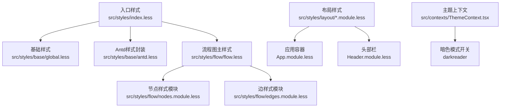
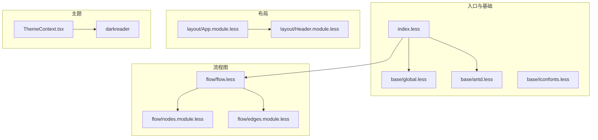
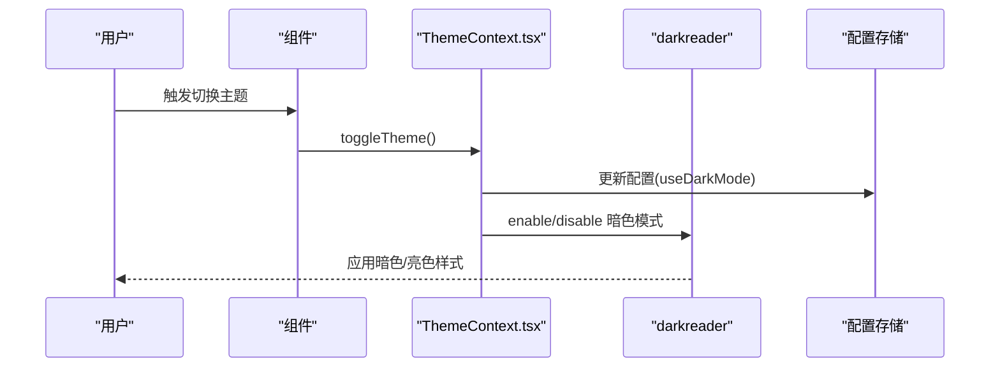
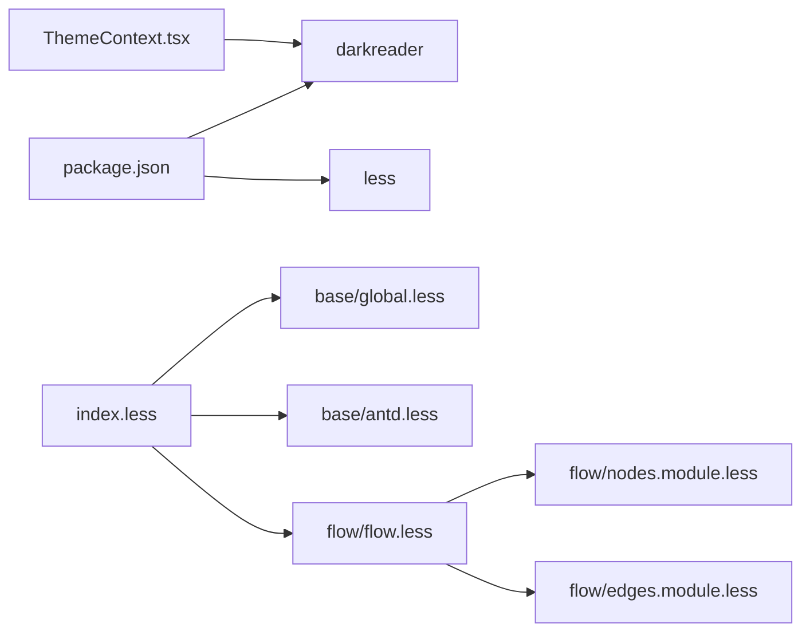

# 样式系统与主题

<cite>
**本文引用的文件**
- [src/styles/index.less](file://src/styles/index.less)
- [src/styles/base/global.less](file://src/styles/base/global.less)
- [src/styles/base/antd.less](file://src/styles/base/antd.less)
- [src/styles/base/iconfonts.less](file://src/styles/base/iconfonts.less)
- [src/styles/flow/flow.less](file://src/styles/flow/flow.less)
- [src/styles/flow/nodes.module.less](file://src/styles/flow/nodes.module.less)
- [src/styles/flow/edges.module.less](file://src/styles/flow/edges.module.less)
- [src/styles/layout/App.module.less](file://src/styles/layout/App.module.less)
- [src/styles/layout/Header.module.less](file://src/styles/layout/Header.module.less)
- [src/contexts/ThemeContext.tsx](file://src/contexts/ThemeContext.tsx)
- [package.json](file://package.json)
</cite>

## 目录
1. [引言](#引言)
2. [项目结构](#项目结构)
3. [核心组件](#核心组件)
4. [架构总览](#架构总览)
5. [详细组件分析](#详细组件分析)
6. [依赖分析](#依赖分析)
7. [性能考虑](#性能考虑)
8. [故障排查指南](#故障排查指南)
9. [结论](#结论)
10. [附录](#附录)

## 引言
本文件面向MaaPipelineEditor的样式系统与主题机制，系统性梳理Less预处理器在项目中的使用与配置方式，解析样式模块化组织（基础样式、组件样式、布局样式、流程图样式），并深入分析主题系统（颜色变量、字体系统、响应式设计、暗色主题与动态切换）。同时提供样式编写最佳实践、性能优化建议以及常见问题排查思路。

## 项目结构
样式体系以“入口聚合 + 分层模块”组织：入口通过index.less统一引入基础、全局与流程图样式；Ant Design样式通过antd.less进行二次封装；各功能域（布局、流程图节点/边）采用模块化Less文件管理，配合React组件按需引入对应样式模块。

图表来源
- [src/styles/index.less:1-30](file://src/styles/index.less#L1-L30)
- [src/styles/base/global.less:1-155](file://src/styles/base/global.less#L1-L155)
- [src/styles/base/antd.less:1-47](file://src/styles/base/antd.less#L1-L47)
- [src/styles/flow/flow.less:1-26](file://src/styles/flow/flow.less#L1-L26)
- [src/styles/flow/nodes.module.less:1-907](file://src/styles/flow/nodes.module.less#L1-L907)
- [src/styles/flow/edges.module.less:1-98](file://src/styles/flow/edges.module.less#L1-L98)
- [src/styles/layout/App.module.less:1-32](file://src/styles/layout/App.module.less#L1-L32)
- [src/styles/layout/Header.module.less:1-127](file://src/styles/layout/Header.module.less#L1-L127)
- [src/contexts/ThemeContext.tsx:1-68](file://src/contexts/ThemeContext.tsx#L1-L68)

章节来源
- [src/styles/index.less:1-30](file://src/styles/index.less#L1-L30)
- [src/styles/base/global.less:1-155](file://src/styles/base/global.less#L1-L155)
- [src/styles/base/antd.less:1-47](file://src/styles/base/antd.less#L1-L47)
- [src/styles/flow/flow.less:1-26](file://src/styles/flow/flow.less#L1-L26)
- [src/styles/flow/nodes.module.less:1-907](file://src/styles/flow/nodes.module.less#L1-L907)
- [src/styles/flow/edges.module.less:1-98](file://src/styles/flow/edges.module.less#L1-L98)
- [src/styles/layout/App.module.less:1-32](file://src/styles/layout/App.module.less#L1-L32)
- [src/styles/layout/Header.module.less:1-127](file://src/styles/layout/Header.module.less#L1-L127)
- [src/contexts/ThemeContext.tsx:1-68](file://src/contexts/ThemeContext.tsx#L1-L68)

## 核心组件
- 入口聚合与基础规范
  - index.less负责全局重置、字体族、尺寸基线与模块导入，确保全站一致性。
  - base/global.less提供通用工具类（居中、省略、可拖动面板等）与Antd覆盖。
  - base/antd.less对Antd组件进行轻量定制（如标签页下划线、通知宽度等）。
  - base/iconfonts.less为图标交互提供统一hover缩放与过渡。
- 流程图样式
  - flow/flow.less定义流程图通用颜色变量与连接线样式。
  - flow/nodes.module.less提供现代/极简/贴纸等多种节点风格，并定义Handle位置与选中态。
  - flow/edges.module.less定义边的颜色分类、动画与控制点交互。
- 布局样式
  - layout/App.module.less定义容器、头部、内容区与工作区的布局骨架。
  - layout/Header.module.less实现标题多尺寸适配与主题按钮交互。
- 主题系统
  - ThemeContext.tsx基于darkreader实现暗色模式动态切换，并与配置存储联动。

章节来源
- [src/styles/index.less:1-30](file://src/styles/index.less#L1-L30)
- [src/styles/base/global.less:1-155](file://src/styles/base/global.less#L1-L155)
- [src/styles/base/antd.less:1-47](file://src/styles/base/antd.less#L1-L47)
- [src/styles/base/iconfonts.less:1-11](file://src/styles/base/iconfonts.less#L1-L11)
- [src/styles/flow/flow.less:1-26](file://src/styles/flow/flow.less#L1-L26)
- [src/styles/flow/nodes.module.less:1-907](file://src/styles/flow/nodes.module.less#L1-L907)
- [src/styles/flow/edges.module.less:1-98](file://src/styles/flow/edges.module.less#L1-L98)
- [src/styles/layout/App.module.less:1-32](file://src/styles/layout/App.module.less#L1-L32)
- [src/styles/layout/Header.module.less:1-127](file://src/styles/layout/Header.module.less#L1-L127)
- [src/contexts/ThemeContext.tsx:1-68](file://src/contexts/ThemeContext.tsx#L1-L68)

## 架构总览
样式系统采用“入口聚合 + 功能域模块”的分层组织，结合Less变量与混合（mixins）实现主题与风格复用；Antd通过局部覆盖实现一致的视觉语言；主题系统通过上下文与外部库实现运行时切换。

图表来源
- [src/styles/index.less:1-30](file://src/styles/index.less#L1-L30)
- [src/styles/base/global.less:1-155](file://src/styles/base/global.less#L1-L155)
- [src/styles/base/antd.less:1-47](file://src/styles/base/antd.less#L1-L47)
- [src/styles/base/iconfonts.less:1-11](file://src/styles/base/iconfonts.less#L1-L11)
- [src/styles/flow/flow.less:1-26](file://src/styles/flow/flow.less#L1-L26)
- [src/styles/flow/nodes.module.less:1-907](file://src/styles/flow/nodes.module.less#L1-L907)
- [src/styles/flow/edges.module.less:1-98](file://src/styles/flow/edges.module.less#L1-L98)
- [src/styles/layout/App.module.less:1-32](file://src/styles/layout/App.module.less#L1-L32)
- [src/styles/layout/Header.module.less:1-127](file://src/styles/layout/Header.module.less#L1-L127)
- [src/contexts/ThemeContext.tsx:1-68](file://src/contexts/ThemeContext.tsx#L1-L68)

## 详细组件分析

### Less预处理与配置
- 预处理器选择
  - 项目使用Less作为CSS预处理器，入口通过@import组织模块化样式。
- 入口聚合
  - index.less集中引入基础、全局与流程图样式，保证加载顺序与作用域隔离。
- 变量与混合
  - flow/flow.less定义流程图颜色变量，nodes.module.less与edges.module.less通过变量与混合实现颜色与过渡的一致性。
- Antd覆盖
  - base/antd.less对Antd组件进行轻量覆盖，避免全局污染，保持与UI库的兼容性。

章节来源
- [src/styles/index.less:1-30](file://src/styles/index.less#L1-L30)
- [src/styles/flow/flow.less:1-26](file://src/styles/flow/flow.less#L1-L26)
- [src/styles/flow/nodes.module.less:1-907](file://src/styles/flow/nodes.module.less#L1-L907)
- [src/styles/flow/edges.module.less:1-98](file://src/styles/flow/edges.module.less#L1-L98)
- [src/styles/base/antd.less:1-47](file://src/styles/base/antd.less#L1-L47)

### 样式模块化组织
- 基础样式
  - base/global.less提供通用工具类与Antd覆盖，减少重复代码。
  - base/iconfonts.less统一图标交互行为。
- 组件样式
  - flow/nodes.module.less定义多种节点风格（现代/极简/贴纸），并提供Handle定位与选中态。
  - flow/edges.module.less定义边的颜色分类与动画效果。
- 布局样式
  - layout/App.module.less定义容器、头部、内容区与工作区布局。
  - layout/Header.module.less实现标题多尺寸适配与主题按钮交互。

章节来源
- [src/styles/base/global.less:1-155](file://src/styles/base/global.less#L1-L155)
- [src/styles/base/iconfonts.less:1-11](file://src/styles/base/iconfonts.less#L1-L11)
- [src/styles/flow/nodes.module.less:1-907](file://src/styles/flow/nodes.module.less#L1-L907)
- [src/styles/flow/edges.module.less:1-98](file://src/styles/flow/edges.module.less#L1-L98)
- [src/styles/layout/App.module.less:1-32](file://src/styles/layout/App.module.less#L1-L32)
- [src/styles/layout/Header.module.less:1-127](file://src/styles/layout/Header.module.less#L1-L127)

### 主题系统实现
- 暗色模式
  - ThemeContext.tsx通过darkreader启用/禁用暗色模式，并将用户偏好同步至配置存储。
- 动态主题切换
  - 提供toggleTheme/setTheme接口，支持外部组件触发主题切换。
- 配置持久化
  - 主题状态与应用配置存储联动，确保刷新后仍保持用户偏好。

图表来源
- [src/contexts/ThemeContext.tsx:1-68](file://src/contexts/ThemeContext.tsx#L1-L68)

章节来源
- [src/contexts/ThemeContext.tsx:1-68](file://src/contexts/ThemeContext.tsx#L1-L68)

### 颜色变量、字体系统与响应式设计
- 颜色变量
  - flow/flow.less定义流程图主色、下一步、跳转回、错误等颜色变量，nodes.module.less/edges.module.less通过变量与混合统一颜色体系。
- 字体系统
  - index.less设置全局字体族与字号，确保跨平台一致性。
- 响应式设计
  - layout/Header.module.less针对不同屏幕宽度调整标题与版本信息展示，体现响应式策略。

章节来源
- [src/styles/flow/flow.less:1-26](file://src/styles/flow/flow.less#L1-L26)
- [src/styles/flow/nodes.module.less:1-907](file://src/styles/flow/nodes.module.less#L1-L907)
- [src/styles/flow/edges.module.less:1-98](file://src/styles/flow/edges.module.less#L1-L98)
- [src/styles/index.less:1-30](file://src/styles/index.less#L1-L30)
- [src/styles/layout/Header.module.less:1-127](file://src/styles/layout/Header.module.less#L1-L127)

### 样式覆盖与定制策略
- 局部覆盖
  - base/antd.less对Antd组件进行局部覆盖，避免全局污染。
- 模块化命名空间
  - nodes.module.less/edges.module.less采用模块化命名空间，避免样式冲突。
- 工具类复用
  - base/global.less提供通用工具类，提升复用率与维护性。

章节来源
- [src/styles/base/antd.less:1-47](file://src/styles/base/antd.less#L1-L47)
- [src/styles/base/global.less:1-155](file://src/styles/base/global.less#L1-L155)
- [src/styles/flow/nodes.module.less:1-907](file://src/styles/flow/nodes.module.less#L1-L907)
- [src/styles/flow/edges.module.less:1-98](file://src/styles/flow/edges.module.less#L1-L98)

### 最佳实践与性能优化
- 变量与混合优先
  - 使用Less变量与混合统一颜色与过渡，降低重复代码。
- 模块化拆分
  - 将样式按功能域拆分为独立模块，便于维护与按需加载。
- 减少全局污染
  - 通过:global与局部覆盖控制作用域，避免样式泄漏。
- 性能优化建议
  - 合理使用动画与阴影，避免过度重绘。
  - 在组件层面按需引入样式模块，减少打包体积。
  - 利用darkreader的启用/禁用时机，避免不必要的计算。

章节来源
- [src/styles/flow/nodes.module.less:1-907](file://src/styles/flow/nodes.module.less#L1-L907)
- [src/styles/flow/edges.module.less:1-98](file://src/styles/flow/edges.module.less#L1-L98)
- [src/styles/base/antd.less:1-47](file://src/styles/base/antd.less#L1-L47)
- [src/contexts/ThemeContext.tsx:1-68](file://src/contexts/ThemeContext.tsx#L1-L68)

## 依赖分析
- 外部依赖
  - darkreader用于运行时暗色模式切换。
  - less用于编译Less样式。
- 内部依赖
  - index.less聚合基础与功能域样式。
  - nodes.module.less/edges.module.less依赖flow/flow.less的颜色变量。
  - ThemeContext.tsx依赖配置存储与darkreader。

图表来源
- [package.json:1-75](file://package.json#L1-L75)
- [src/styles/index.less:1-30](file://src/styles/index.less#L1-L30)
- [src/styles/flow/flow.less:1-26](file://src/styles/flow/flow.less#L1-L26)
- [src/styles/flow/nodes.module.less:1-907](file://src/styles/flow/nodes.module.less#L1-L907)
- [src/styles/flow/edges.module.less:1-98](file://src/styles/flow/edges.module.less#L1-L98)
- [src/contexts/ThemeContext.tsx:1-68](file://src/contexts/ThemeContext.tsx#L1-L68)

章节来源
- [package.json:1-75](file://package.json#L1-L75)
- [src/styles/index.less:1-30](file://src/styles/index.less#L1-L30)
- [src/styles/flow/flow.less:1-26](file://src/styles/flow/flow.less#L1-L26)
- [src/styles/flow/nodes.module.less:1-907](file://src/styles/flow/nodes.module.less#L1-L907)
- [src/styles/flow/edges.module.less:1-98](file://src/styles/flow/edges.module.less#L1-L98)
- [src/contexts/ThemeContext.tsx:1-68](file://src/contexts/ThemeContext.tsx#L1-L68)

## 性能考虑
- 样式体积控制
  - 按需引入样式模块，避免一次性加载过多样式。
  - 合理拆分公共样式与业务样式，减少冗余。
- 渲染性能
  - 控制动画数量与复杂度，避免频繁重排重绘。
  - 使用box-shadow与透明度时注意浏览器合成层开销。
- 主题切换性能
  - darkreader启用/禁用时机应与用户操作解耦，避免阻塞主线程。

## 故障排查指南
- 暗色模式不生效
  - 检查ThemeContext.tsx中useDarkMode状态是否正确更新。
  - 确认darkreader已正确启用/禁用。
- 样式覆盖失效
  - 检查Antd覆盖是否使用:global或正确的选择器优先级。
  - 确认index.less加载顺序是否正确。
- 响应式异常
  - 检查Header.module.less媒体查询断点与元素可见性逻辑。
- 打包构建问题
  - 确认Less编译配置与Vite集成正常，无语法错误。

章节来源
- [src/contexts/ThemeContext.tsx:1-68](file://src/contexts/ThemeContext.tsx#L1-L68)
- [src/styles/base/antd.less:1-47](file://src/styles/base/antd.less#L1-L47)
- [src/styles/layout/Header.module.less:1-127](file://src/styles/layout/Header.module.less#L1-L127)
- [package.json:1-75](file://package.json#L1-L75)

## 结论
MaaPipelineEditor的样式系统以Less为核心，通过入口聚合与功能域模块化实现清晰的组织结构；Antd覆盖与自定义变量确保视觉一致性；主题系统通过上下文与darkreader实现动态切换。遵循变量优先、模块化拆分与按需加载的最佳实践，可在保证体验的同时提升性能与可维护性。

## 附录
- 关键文件路径
  - 入口样式：src/styles/index.less
  - 基础样式：src/styles/base/global.less、src/styles/base/antd.less、src/styles/base/iconfonts.less
  - 流程图样式：src/styles/flow/flow.less、src/styles/flow/nodes.module.less、src/styles/flow/edges.module.less
  - 布局样式：src/styles/layout/App.module.less、src/styles/layout/Header.module.less
  - 主题上下文：src/contexts/ThemeContext.tsx
  - 依赖声明：package.json