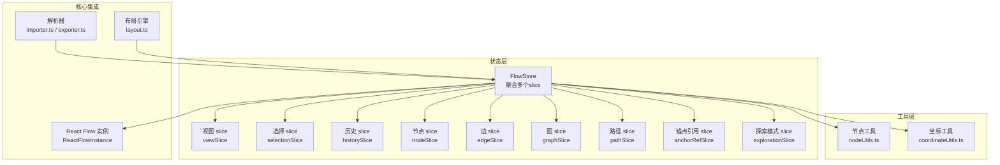
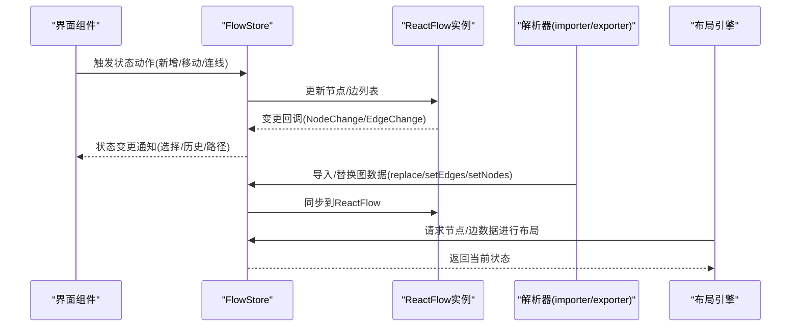
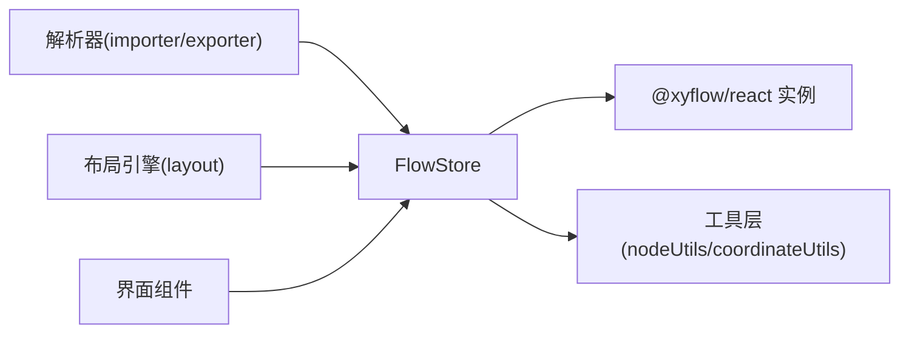
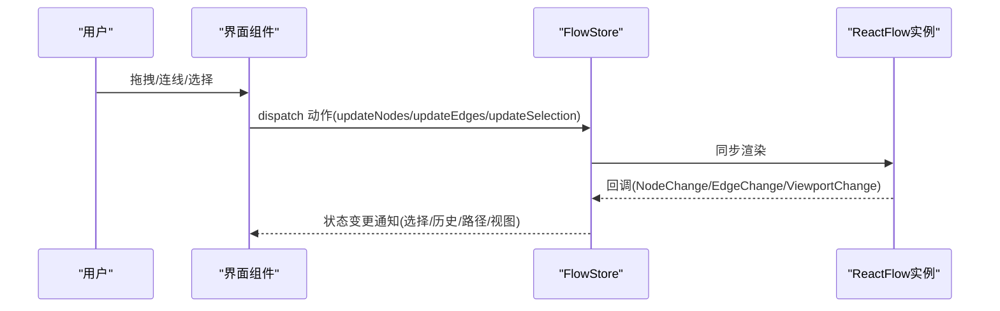

# Flow状态管理

<cite>
**本文档引用的文件**
- [src/stores/flow/index.ts](file://src/stores/flow/index.ts)
- [src/stores/flow/types.ts](file://src/stores/flow/types.ts)
- [src/stores/flow/utils/nodeUtils.ts](file://src/stores/flow/utils/nodeUtils.ts)
- [src/stores/flow/utils/coordinateUtils.ts](file://src/stores/flow/utils/coordinateUtils.ts)
- [src/components/flow/nodes/index.ts](file://src/components/flow/nodes/index.ts)
- [src/core/parser/importer.ts](file://src/core/parser/importer.ts)
- [src/core/parser/exporter.ts](file://src/core/parser/exporter.ts)
- [src/core/layout.ts](file://src/core/layout.ts)
</cite>

## 目录
1. [简介](#简介)
2. [项目结构](#项目结构)
3. [核心组件](#核心组件)
4. [架构总览](#架构总览)
5. [详细组件分析](#详细组件分析)
6. [依赖分析](#依赖分析)
7. [性能考虑](#性能考虑)
8. [故障排查指南](#故障排查指南)
9. [结论](#结论)
10. [附录](#附录)

## 简介
本文件系统性阐述 Flow 状态管理的设计与实现，重点覆盖以下方面：
- Flow Store 的整体架构与各 slice 的职责边界
- graph slice、node slice、edge slice、selection slice 等核心 slice 的功能与交互
- 状态更新的触发机制与响应流程
- 状态持久化与缓存策略
- 状态查询与更新的最佳实践
- 状态调试与性能优化方法

## 项目结构
Flow 状态管理位于前端 stores 层，采用 Zustand 的多 slice 组合模式，围绕 React Flow 实例构建可视化编辑器的状态中枢。核心入口负责聚合各 slice，并导出统一的 FlowStore 类型与工具函数。

图表来源
- [src/stores/flow/index.ts:18-28](file://src/stores/flow/index.ts#L18-L28)
- [src/stores/flow/types.ts:429-439](file://src/stores/flow/types.ts#L429-L439)
- [src/core/parser/importer.ts:516-519](file://src/core/parser/importer.ts#L516-L519)
- [src/core/parser/exporter.ts:1](file://src/core/parser/exporter.ts#L1)
- [src/core/layout.ts:216](file://src/core/layout.ts#L216)

章节来源
- [src/stores/flow/index.ts:1-124](file://src/stores/flow/index.ts#L1-L124)
- [src/stores/flow/types.ts:1-439](file://src/stores/flow/types.ts#L1-L439)

## 核心组件
- FlowStore 类型：由视图、选择、历史、节点、边、图、路径、锚点引用、探索模式等 slice 的状态与动作组成，统一对外暴露。
- 节点工具：提供节点创建、查找、去重、相对/绝对坐标转换、序列化等能力。
- 坐标工具：处理父子节点坐标链解析、运行时绝对矩形计算、导入位置归一化等。
- React Flow 集成：通过 ReactFlowInstance 管理画布实例、视口与渲染状态。

章节来源
- [src/stores/flow/types.ts:429-439](file://src/stores/flow/types.ts#L429-L439)
- [src/stores/flow/utils/nodeUtils.ts:15-339](file://src/stores/flow/utils/nodeUtils.ts#L15-L339)
- [src/stores/flow/utils/coordinateUtils.ts:1-199](file://src/stores/flow/utils/coordinateUtils.ts#L1-L199)

## 架构总览
Flow Store 以“多 slice 聚合”的方式组织状态，每个 slice 负责特定领域（如节点、边、选择、历史），并通过统一的 FlowStore 类型暴露给业务模块。React Flow 提供底层的节点/边渲染与交互支持；解析器与布局引擎在导入/导出与布局阶段调用 FlowStore 的接口进行状态同步。

图表来源
- [src/stores/flow/index.ts:18-28](file://src/stores/flow/index.ts#L18-L28)
- [src/core/parser/importer.ts:516-519](file://src/core/parser/importer.ts#L516-L519)
- [src/core/layout.ts:41](file://src/core/layout.ts#L41)

## 详细组件分析

### 视图 slice（viewSlice）
- 职责：维护 ReactFlow 实例、视口状态与画布尺寸，提供更新实例与视口的方法。
- 关键点：与 React Flow 的生命周期绑定，确保实例可用性与视口一致性。

章节来源
- [src/stores/flow/types.ts:239-247](file://src/stores/flow/types.ts#L239-L247)

### 选择 slice（selectionSlice）
- 职责：维护当前选中的节点与边、目标节点、防抖后的选中集与定时器映射。
- 关键点：提供批量更新与清空选择的能力，支持防抖以减少频繁渲染。

章节来源
- [src/stores/flow/types.ts:249-261](file://src/stores/flow/types.ts#L249-L261)

### 历史 slice（historySlice）
- 职责：维护历史栈、索引与保存节流，提供撤销/重做、初始化与清理。
- 关键点：支持延迟保存与操作描述注入，便于审计与回溯。

章节来源
- [src/stores/flow/types.ts:263-275](file://src/stores/flow/types.ts#L263-L275)

### 节点 slice（nodeSlice）
- 职责：管理节点列表、ID 计数器、批量更新与节点数据写入；提供分组/解组、挂载/卸载到分组等操作。
- 关键点：与节点工具协作，保证节点顺序与父子关系正确；支持批量数据更新以提升性能。

章节来源
- [src/stores/flow/types.ts:277-301](file://src/stores/flow/types.ts#L277-L301)
- [src/stores/flow/utils/nodeUtils.ts:281-339](file://src/stores/flow/utils/nodeUtils.ts#L281-L339)

### 边 slice（edgeSlice）
- 职责：管理边列表、控制重置键与目标边集、边数据与标签更新、添加边与重置控制。
- 关键点：通过 sourceHandle/targetHandle 约束连接规则，支持跳转/锚点等属性扩展。

章节来源
- [src/stores/flow/types.ts:303-314](file://src/stores/flow/types.ts#L303-L314)

### 图 slice（graphSlice）
- 职责：提供替换图、粘贴图、位移节点、重置粘贴计数等能力，支持视图适配与历史/保存开关。
- 关键点：与导入器配合执行整图替换，确保视图适配与历史记录一致性。

章节来源
- [src/stores/flow/types.ts:316-339](file://src/stores/flow/types.ts#L316-L339)
- [src/core/parser/importer.ts:516-519](file://src/core/parser/importer.ts#L516-L519)

### 路径 slice（pathSlice）
- 职责：路径模式开关、起止节点、路径节点/边集合、路径计算与清除。
- 关键点：基于边的 next 连接关系推导路径，服务于流程验证与导航。

章节来源
- [src/stores/flow/types.ts:341-353](file://src/stores/flow/types.ts#L341-L353)

### 锚点引用 slice（anchorRefSlice）
- 职责：锚点名称到使用节点的索引映射、高亮集合、选中锚点名、重建索引与查询。
- 关键点：支持锚点驱动的节点高亮与联动，提升复杂图的可读性。

章节来源
- [src/stores/flow/types.ts:355-369](file://src/stores/flow/types.ts#L355-L369)

### 探索模式 slice（explorationSlice）
- 职责：探索状态机（空闲/预测/审核/执行/确认/完成）、目标、起止节点、Ghost 节点、步骤计数与错误/进度信息。
- 关键点：提供 start/execute/confirm/nextStep/regenerate/complete/abort 等动作，支撑 AI 驱动的探索流程。

章节来源
- [src/stores/flow/types.ts:371-426](file://src/stores/flow/types.ts#L371-L426)

### 节点工具（nodeUtils）
- 职责：创建各类节点（Pipeline/External/Anchor/Sticker/Group）、查找/筛选/去重、计算新节点位置、确保分组顺序。
- 关键点：提供节点名去重逻辑，区分外部/锚点同 label 视觉副本与跨类型冲突。

章节来源
- [src/stores/flow/utils/nodeUtils.ts:15-339](file://src/stores/flow/utils/nodeUtils.ts#L15-L339)

### 坐标工具（coordinateUtils）
- 职责：父子链解析、绝对/相对坐标转换、运行时绝对矩形计算、导入位置归一化、序列化节点位置。
- 关键点：兼容相对/绝对坐标模式，保证嵌套分组场景下的位置一致性。

章节来源
- [src/stores/flow/utils/coordinateUtils.ts:1-199](file://src/stores/flow/utils/coordinateUtils.ts#L1-L199)

### React Flow 节点类型注册
- 职责：集中导出节点类型与句柄方向常量，供 Flow 组件使用。
- 关键点：统一节点类型注册，便于扩展与维护。

章节来源
- [src/components/flow/nodes/index.ts:1-26](file://src/components/flow/nodes/index.ts#L1-L26)

### 解析器与 FlowStore 的交互
- 导入：调用 replace/setEdges/setNodes 初始化图数据，必要时触发视图适配与历史初始化。
- 导出：读取当前 nodes/edges 状态生成配置或资源描述。

章节来源
- [src/core/parser/importer.ts:516-519](file://src/core/parser/importer.ts#L516-L519)
- [src/core/parser/exporter.ts:1](file://src/core/parser/exporter.ts#L1)

### 布局引擎与 FlowStore 的交互
- 读取：在布局阶段从 FlowStore 获取节点/边数据，结合布局算法输出位置。
- 写入：通过 updateNodes 将布局结果写回状态，驱动 React Flow 重绘。

章节来源
- [src/core/layout.ts:41](file://src/core/layout.ts#L41)
- [src/core/layout.ts:216](file://src/core/layout.ts#L216)

## 依赖分析
- 组件耦合：FlowStore 作为中枢，被解析器、布局引擎与 UI 组件广泛依赖；各 slice 内聚各自领域逻辑，降低跨 slice 依赖。
- 外部依赖：React Flow 提供实例与渲染能力；Zustand 提供轻量状态管理。
- 循环依赖：通过工具函数拆分避免 slice 间循环引用；解析器与布局引擎仅单向依赖 FlowStore。

图表来源
- [src/stores/flow/index.ts:18-28](file://src/stores/flow/index.ts#L18-L28)
- [src/core/parser/importer.ts:516-519](file://src/core/parser/importer.ts#L516-L519)
- [src/core/layout.ts:41](file://src/core/layout.ts#L41)

## 性能考虑
- 批量更新：优先使用批量写入（如批量设置节点数据、批量更新节点/边）以减少渲染次数。
- 防抖与节流：对高频事件（如选择变化、视口滚动）采用防抖/节流，降低状态抖动。
- 历史保存节流：历史 slice 支持延迟保存与节流，避免频繁快照导致的内存压力。
- 坐标计算缓存：在需要频繁计算绝对/相对坐标的场景，可引入缓存策略（例如按父链哈希缓存）。
- 分片渲染：对于大型图，可考虑分片加载与懒渲染，结合视口裁剪减少不必要的重绘。
- 选择性订阅：UI 组件仅订阅所需字段，避免全局重渲染。

## 故障排查指南
- 节点名冲突告警：当存在跨类型同名或 Pipeline 自身重复时，系统会收集冲突标签并写入错误存储，可通过错误存储查看具体冲突项。
- 路径计算异常：检查边的 sourceHandle 是否包含“next”，以及是否存在环路或断链。
- 坐标错位：确认父子节点的坐标模式（相对/绝对），必要时使用坐标工具进行归一化与序列化。
- 导入后视图不匹配：调用图 slice 的替换/适配方法，并确保历史初始化与视图重置。
- 探索模式卡滞：检查探索状态机流转是否被中断，确认 Ghost 节点是否成功创建与高亮。

章节来源
- [src/stores/flow/index.ts:84-104](file://src/stores/flow/index.ts#L84-L104)
- [src/stores/flow/types.ts:341-353](file://src/stores/flow/types.ts#L341-L353)
- [src/stores/flow/utils/coordinateUtils.ts:161-191](file://src/stores/flow/utils/coordinateUtils.ts#L161-L191)
- [src/stores/flow/types.ts:316-339](file://src/stores/flow/types.ts#L316-L339)
- [src/stores/flow/types.ts:381-426](file://src/stores/flow/types.ts#L381-L426)

## 结论
Flow 状态管理通过多 slice 聚合实现了清晰的职责划分与良好的扩展性。借助工具层与 React Flow 的深度集成，系统在节点/边管理、坐标处理、历史与探索模式等方面提供了完善的支持。遵循批量更新、防抖节流与缓存策略，可在保持交互流畅的同时提升整体性能。

## 附录

### 状态更新触发与响应流程（序列图）

图表来源
- [src/stores/flow/types.ts:277-314](file://src/stores/flow/types.ts#L277-L314)
- [src/stores/flow/types.ts:239-247](file://src/stores/flow/types.ts#L239-L247)

### 状态持久化与缓存策略
- 持久化：通过解析器导出当前 nodes/edges 与视图状态，支持落盘或传输。
- 缓存：对热点计算（如坐标链、路径计算）进行缓存；对历史快照进行节流保存。
- 清理：提供历史清理与粘贴计数重置，避免状态膨胀。

章节来源
- [src/core/parser/exporter.ts:1](file://src/core/parser/exporter.ts#L1)
- [src/stores/flow/types.ts:263-275](file://src/stores/flow/types.ts#L263-L275)
- [src/stores/flow/types.ts:316-339](file://src/stores/flow/types.ts#L316-L339)

### 最佳实践清单
- 使用工具函数创建节点，确保默认值与一致性。
- 在批量更新前先收集变更，最后一次性提交，减少渲染。
- 对高频交互采用防抖/节流，避免状态抖动。
- 导入数据时先 replace，再 initHistory，最后适配视图。
- 使用坐标工具进行位置归一化与序列化，保证跨版本兼容。
- 探索模式下严格遵循状态机流转，及时清理中间态。