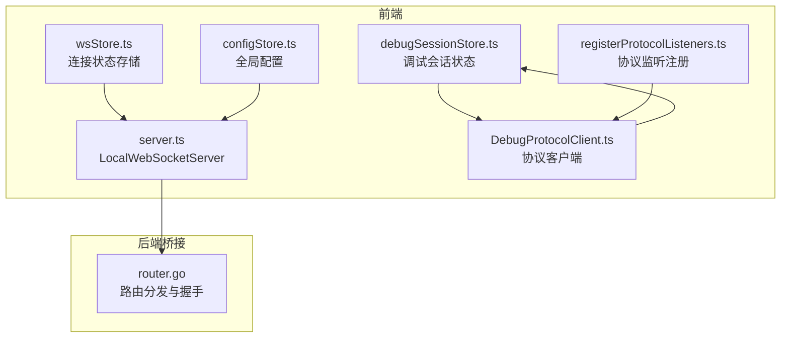
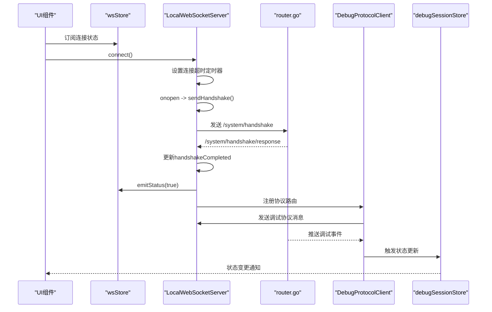
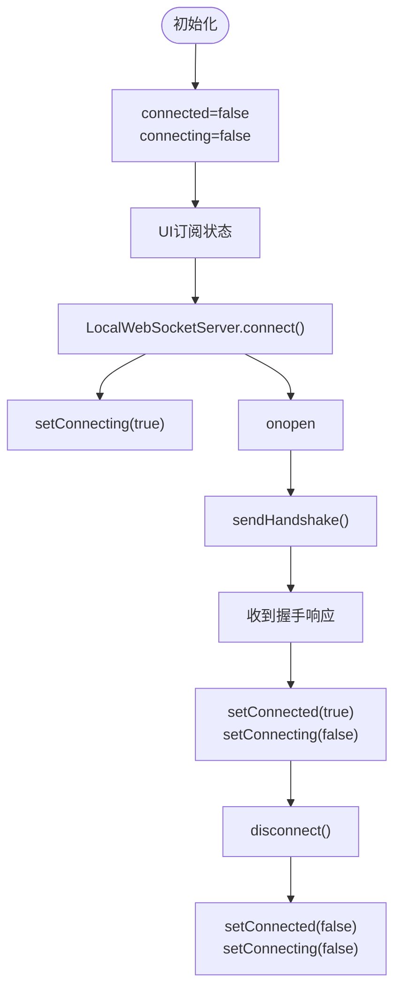
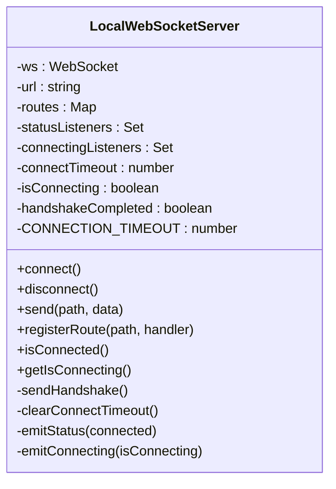
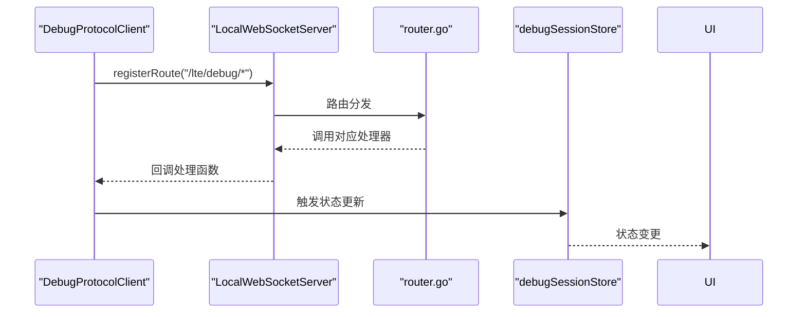
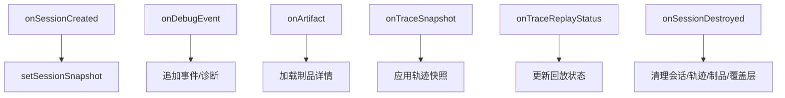
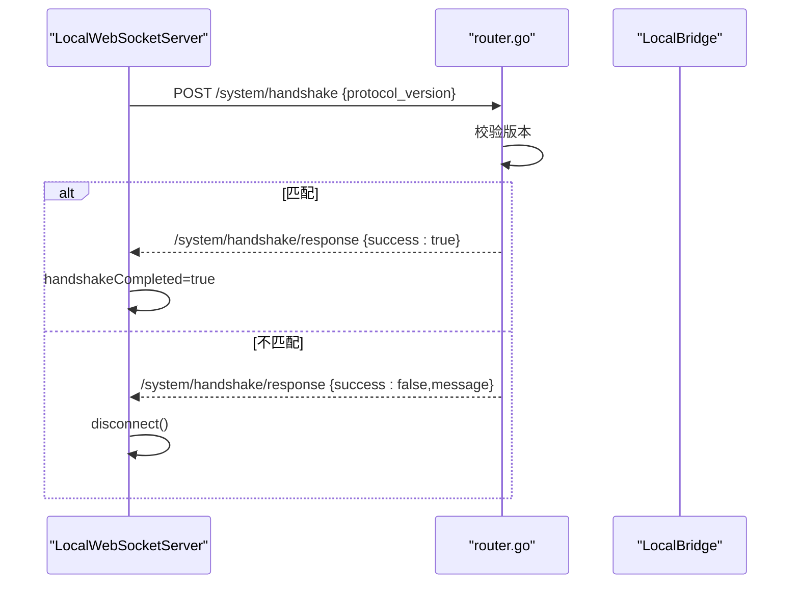
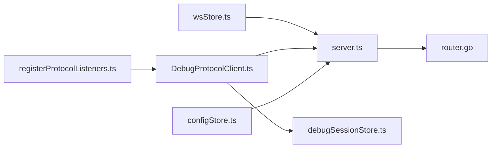

# WebSocket状态管理

<cite>
**本文档引用的文件**
- [wsStore.ts](file://src/stores/wsStore.ts)
- [server.ts](file://src/services/server.ts)
- [DebugProtocolClient.ts](file://src/services/protocols/DebugProtocolClient.ts)
- [router.go](file://LocalBridge/internal/router/router.go)
- [type.ts](file://src/services/type.ts)
- [configStore.ts](file://src/stores/configStore.ts)
- [registerProtocolListeners.ts](file://src/features/debug/registerProtocolListeners.ts)
- [debugSessionStore.ts](file://src/stores/debugSessionStore.ts)
</cite>

## 目录
1. [简介](#简介)
2. [项目结构](#项目结构)
3. [核心组件](#核心组件)
4. [架构总览](#架构总览)
5. [详细组件分析](#详细组件分析)
6. [依赖关系分析](#依赖关系分析)
7. [性能考虑](#性能考虑)
8. [故障排查指南](#故障排查指南)
9. [结论](#结论)

## 简介
本文件聚焦于项目中的WebSocket状态管理机制，系统性阐述ws store在连接管理、消息传递和状态同步中的作用；详细说明连接状态的跟踪与管理、消息路由与协议分发、调试会话状态的生命周期管理；并提供连接状态监控与故障诊断方法，以及性能优化与连接池管理的实现细节。

## 项目结构
WebSocket相关能力主要分布在以下模块：
- 前端状态层：wsStore（连接状态）、debugSessionStore（调试会话状态）
- 前端服务层：LocalWebSocketServer（连接生命周期与消息路由）、协议客户端（DebugProtocolClient）
- 后端桥接层：Go语言实现的router（协议版本握手与路由分发）
- 类型与配置：SystemRoutes、HandshakeRequest/Response、协议版本等

**图表来源**
- [wsStore.ts:1-24](file://src/stores/wsStore.ts#L1-L24)
- [server.ts:22-345](file://src/services/server.ts#L22-L345)
- [DebugProtocolClient.ts:31-121](file://src/services/protocols/DebugProtocolClient.ts#L31-L121)
- [router.go:57-143](file://LocalBridge/internal/router/router.go#L57-L143)
- [configStore.ts:7-13](file://src/stores/configStore.ts#L7-L13)
- [registerProtocolListeners.ts:15-154](file://src/features/debug/registerProtocolListeners.ts#L15-L154)

**章节来源**
- [wsStore.ts:1-24](file://src/stores/wsStore.ts#L1-L24)
- [server.ts:22-345](file://src/services/server.ts#L22-L345)
- [DebugProtocolClient.ts:31-121](file://src/services/protocols/DebugProtocolClient.ts#L31-L121)
- [router.go:57-143](file://LocalBridge/internal/router/router.go#L57-L143)
- [configStore.ts:7-13](file://src/stores/configStore.ts#L7-L13)
- [registerProtocolListeners.ts:15-154](file://src/features/debug/registerProtocolListeners.ts#L15-L154)

## 核心组件
- wsStore：轻量的状态存储，维护连接状态与连接中状态，供UI层订阅使用。
- LocalWebSocketServer：负责WebSocket连接生命周期、消息路由、握手校验、错误处理与状态通知。
- DebugProtocolClient：封装调试协议的消息发送与事件监听，将后端推送转换为前端store状态变更。
- 调试会话状态：debugSessionStore集中管理会话、运行、资源健康、能力清单等状态。
- Go路由与握手：router.go负责协议版本校验与消息路由分发。

**章节来源**
- [wsStore.ts:7-23](file://src/stores/wsStore.ts#L7-L23)
- [server.ts:22-345](file://src/services/server.ts#L22-L345)
- [DebugProtocolClient.ts:31-121](file://src/services/protocols/DebugProtocolClient.ts#L31-L121)
- [debugSessionStore.ts:36-80](file://src/stores/debugSessionStore.ts#L36-L80)
- [router.go:115-143](file://LocalBridge/internal/router/router.go#L115-L143)

## 架构总览
WebSocket连接采用“前端服务层 + 后端桥接层”的双层架构。前端通过LocalWebSocketServer发起连接，完成协议版本握手后进入消息路由阶段；后端router根据路径分发到对应处理器；前端协议客户端订阅特定路径事件，驱动调试会话状态更新。

**图表来源**
- [server.ts:109-255](file://src/services/server.ts#L109-L255)
- [router.go:115-143](file://LocalBridge/internal/router/router.go#L115-L143)
- [DebugProtocolClient.ts:77-121](file://src/services/protocols/DebugProtocolClient.ts#L77-L121)
- [registerProtocolListeners.ts:21-38](file://src/features/debug/registerProtocolListeners.ts#L21-L38)

## 详细组件分析

### wsStore：连接状态存储
- 提供connected与connecting两个布尔状态位，分别表示“已连接”和“连接中”。
- 通过setConnected/setConnecting进行状态写入，供UI组件订阅渲染。
- 该store本身不直接管理连接生命周期，而是作为状态信号源被其他组件驱动。

**图表来源**
- [wsStore.ts:18-23](file://src/stores/wsStore.ts#L18-L23)
- [server.ts:109-168](file://src/services/server.ts#L109-L168)

**章节来源**
- [wsStore.ts:7-23](file://src/stores/wsStore.ts#L7-L23)

### LocalWebSocketServer：连接生命周期与消息路由
- 连接管理
  - 防重复连接：isConnecting防抖，避免并发connect。
  - 连接超时：CONNECTION_TIMEOUT（毫秒）内未握手成功则主动关闭并发出错误通知。
  - 握手流程：onopen后发送协议版本，等待/system/handshake/response，成功后设置handshakeCompleted。
  - 状态通知：emitStatus/emitConnecting向订阅者广播连接状态变化。
- 消息路由
  - onmessage解析JSON，按path分派到routes映射的处理器。
  - registerRoute批量注册系统与业务路由。
- 错误处理
  - onerror/onclose统一清理定时器与状态，并发出用户可见的通知。
- 状态查询
  - isConnected综合判断WebSocket OPEN且握手完成。

**图表来源**
- [server.ts:22-343](file://src/services/server.ts#L22-L343)

**章节来源**
- [server.ts:109-255](file://src/services/server.ts#L109-L255)
- [server.ts:290-318](file://src/services/server.ts#L290-L318)
- [server.ts:336-342](file://src/services/server.ts#L336-L342)

### DebugProtocolClient：协议消息与事件监听
- 路由注册：在register中绑定调试协议的多个路径到内部处理器。
- 请求方法：封装各类调试操作（创建会话、启动/停止运行、资源预检/健康检查、截图、回放等）。
- 事件监听：提供多类事件监听器（能力清单、会话创建/销毁/快照、调试事件、运行状态、资源结果、回放状态、错误等），并将后端推送转换为前端store动作。
- 状态查询：isConnected委托底层LocalWebSocketServer。

**图表来源**
- [DebugProtocolClient.ts:77-121](file://src/services/protocols/DebugProtocolClient.ts#L77-L121)
- [registerProtocolListeners.ts:21-38](file://src/features/debug/registerProtocolListeners.ts#L21-L38)

**章节来源**
- [DebugProtocolClient.ts:77-121](file://src/services/protocols/DebugProtocolClient.ts#L77-L121)
- [registerProtocolListeners.ts:21-38](file://src/features/debug/registerProtocolListeners.ts#L21-L38)

### 调试会话状态：会话建立、数据传输与结束
- 会话建立：onSessionCreated触发setSessionSnapshot，记录会话快照。
- 数据传输：onDebugEvent追加事件、更新诊断与覆盖层；onArtifact加载详细产物；onTraceSnapshot与onTraceReplayStatus更新轨迹与回放状态。
- 会话结束：onSessionDestroyed清理会话、轨迹、制品与覆盖层。
- 资源与能力：onCapabilities设置能力清单；onResourcePreflight/onResourceHealth更新资源状态；onRunStopRequested记录停止请求。

**图表来源**
- [registerProtocolListeners.ts:25-34](file://src/features/debug/registerProtocolListeners.ts#L25-L34)
- [registerProtocolListeners.ts:59-99](file://src/features/debug/registerProtocolListeners.ts#L59-L99)
- [registerProtocolListeners.ts:128-142](file://src/features/debug/registerProtocolListeners.ts#L128-L142)
- [registerProtocolListeners.ts:144-153](file://src/features/debug/registerProtocolListeners.ts#L144-L153)

**章节来源**
- [debugSessionStore.ts:36-80](file://src/stores/debugSessionStore.ts#L36-L80)
- [registerProtocolListeners.ts:21-154](file://src/features/debug/registerProtocolListeners.ts#L21-L154)

### 协议版本握手与路由分发
- 前端：SystemRoutes定义握手路径，HandshakeRequest/Response定义握手载荷。
- 后端：router.go接收握手请求，校验协议版本，返回/system/handshake/response；若版本不匹配，触发协议不匹配回调。
- 前端：收到握手响应后，若成功则标记handshakeCompleted并发出连接成功通知；否则断开连接并提示版本不匹配。

**图表来源**
- [type.ts:2-5](file://src/services/type.ts#L2-L5)
- [type.ts:8-18](file://src/services/type.ts#L8-L18)
- [router.go:115-143](file://LocalBridge/internal/router/router.go#L115-L143)
- [server.ts:42-66](file://src/services/server.ts#L42-L66)

**章节来源**
- [type.ts:2-18](file://src/services/type.ts#L2-L18)
- [router.go:115-143](file://LocalBridge/internal/router/router.go#L115-L143)
- [server.ts:42-66](file://src/services/server.ts#L42-L66)

## 依赖关系分析
- wsStore依赖LocalWebSocketServer的状态通知，形成单向数据流。
- LocalWebSocketServer依赖router.go进行消息路由与握手处理。
- DebugProtocolClient依赖LocalWebSocketServer发送消息并订阅调试事件。
- registerProtocolListeners将DebugProtocolClient事件映射到debugSessionStore等状态存储。
- configStore提供协议版本与端口等配置，影响连接行为。

**图表来源**
- [wsStore.ts:1-24](file://src/stores/wsStore.ts#L1-L24)
- [server.ts:22-345](file://src/services/server.ts#L22-L345)
- [DebugProtocolClient.ts:31-121](file://src/services/protocols/DebugProtocolClient.ts#L31-L121)
- [debugSessionStore.ts:1-260](file://src/stores/debugSessionStore.ts#L1-L260)
- [registerProtocolListeners.ts:1-189](file://src/features/debug/registerProtocolListeners.ts#L1-L189)
- [configStore.ts:7-13](file://src/stores/configStore.ts#L7-L13)

**章节来源**
- [wsStore.ts:1-24](file://src/stores/wsStore.ts#L1-L24)
- [server.ts:22-345](file://src/services/server.ts#L22-L345)
- [DebugProtocolClient.ts:31-121](file://src/services/protocols/DebugProtocolClient.ts#L31-L121)
- [debugSessionStore.ts:1-260](file://src/stores/debugSessionStore.ts#L1-L260)
- [registerProtocolListeners.ts:1-189](file://src/features/debug/registerProtocolListeners.ts#L1-L189)
- [configStore.ts:7-13](file://src/stores/configStore.ts#L7-L13)

## 性能考虑
- 连接超时与防抖：CONNECTION_TIMEOUT与isConnecting防重复连接，减少无效资源占用。
- 路由分发：router.go支持精确匹配与前缀匹配，降低查找成本。
- 状态更新：DebugProtocolClient将事件转为store动作，避免UI直连底层WebSocket，降低耦合与复杂度。
- 配置驱动：协议版本与端口来自configStore，便于统一调整与灰度发布。

**章节来源**
- [server.ts:31-31](file://src/services/server.ts#L31-L31)
- [router.go:86-100](file://LocalBridge/internal/router/router.go#L86-L100)
- [configStore.ts:118-173](file://src/stores/configStore.ts#L118-L173)

## 故障排查指南
- 连接超时
  - 现象：弹出“连接超时”通知，随后自动断开。
  - 排查：确认本地服务已启动、端口可用；检查网络与防火墙；查看CONNECTION_TIMEOUT设置。
  - 参考：[server.ts:131-163](file://src/services/server.ts#L131-L163)
- 握手失败
  - 现象：协议版本不匹配，断开连接并提示版本不一致。
  - 排查：升级前端或后端至兼容版本；核对globalConfig.protocolVersion与后端版本。
  - 参考：[router.go:128-138](file://LocalBridge/internal/router/router.go#L128-L138)，[configStore.ts:12-12](file://src/stores/configStore.ts#L12-L12)
- 连接异常断开
  - 现象：onclose触发，发出“本地服务已断开连接”提示。
  - 排查：检查后端进程状态、日志；确认消息格式正确；查看ws.readyState。
  - 参考：[server.ts:216-223](file://src/services/server.ts#L216-L223)
- 发送失败
  - 现象：send返回false，控制台输出错误日志。
  - 排查：确认WebSocket处于OPEN状态；检查JSON序列化与消息格式。
  - 参考：[server.ts:290-304](file://src/services/server.ts#L290-L304)
- 会话状态异常
  - 现象：会话未清理或状态不同步。
  - 排查：确认onSessionDestroyed是否触发；检查事件监听注册是否生效。
  - 参考：[registerProtocolListeners.ts:29-34](file://src/features/debug/registerProtocolListeners.ts#L29-L34)

**章节来源**
- [server.ts:131-163](file://src/services/server.ts#L131-L163)
- [server.ts:216-223](file://src/services/server.ts#L216-L223)
- [server.ts:290-304](file://src/services/server.ts#L290-L304)
- [router.go:128-138](file://LocalBridge/internal/router/router.go#L128-L138)
- [configStore.ts:12-12](file://src/stores/configStore.ts#L12-L12)
- [registerProtocolListeners.ts:29-34](file://src/features/debug/registerProtocolListeners.ts#L29-L34)

## 结论
本项目的WebSocket状态管理以wsStore为核心状态信号源，结合LocalWebSocketServer的连接生命周期管理与router.go的协议版本握手及路由分发，形成了清晰的前后端协作模型。DebugProtocolClient与registerProtocolListeners进一步将后端事件转化为调试会话状态，确保UI层能够实时反映后端状态变化。通过连接超时、防抖与状态通知等机制，系统在可用性与稳定性方面具备良好表现；配合配置驱动与事件解耦，便于扩展与维护。