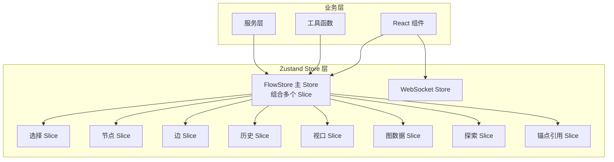
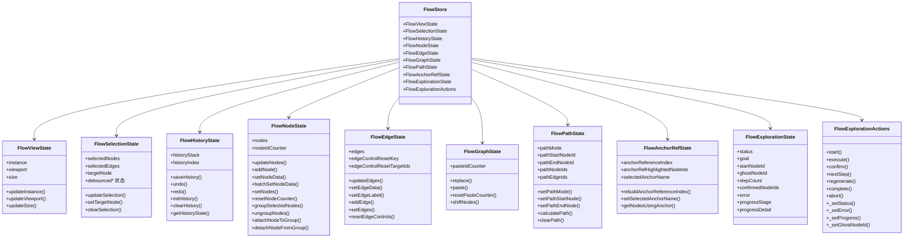
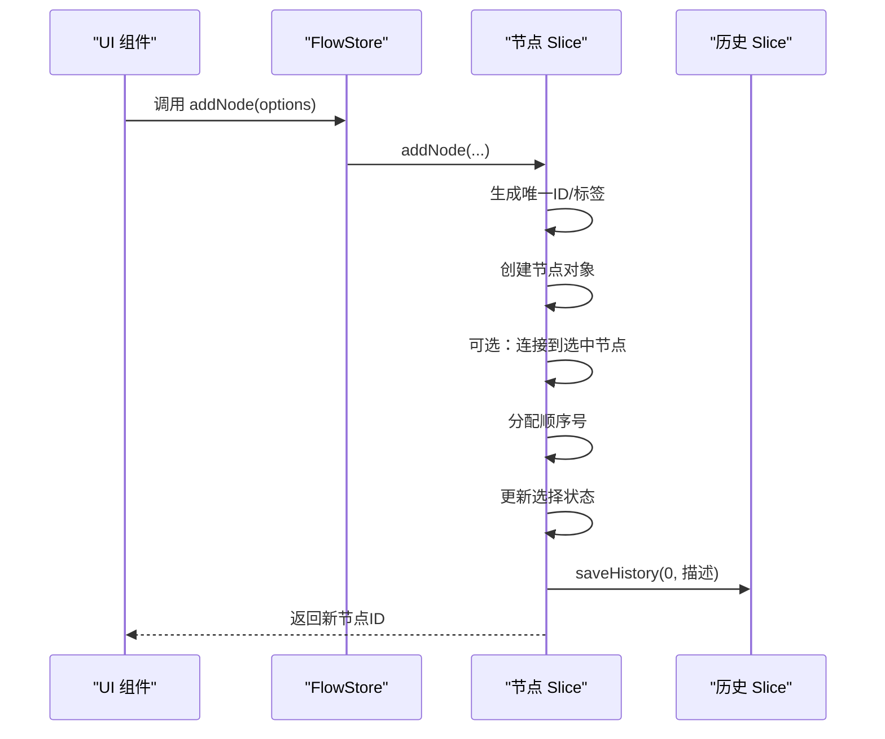
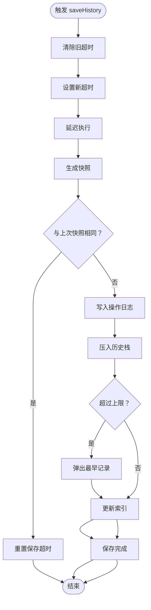
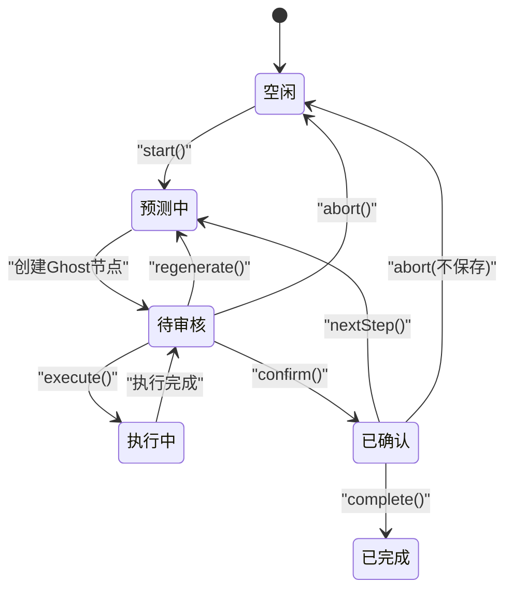
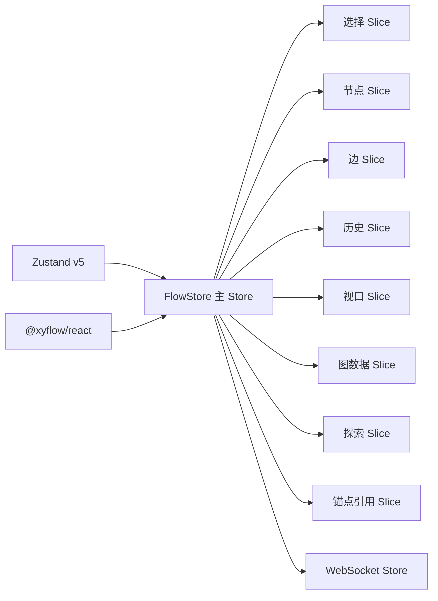

# Zustand架构设计

<cite>
**本文档引用的文件**
- [wsStore.ts](file://src/stores/wsStore.ts)
- [flow/index.ts](file://src/stores/flow/index.ts)
- [flow/types.ts](file://src/stores/flow/types.ts)
- [flow/slices/selectionSlice.ts](file://src/stores/flow/slices/selectionSlice.ts)
- [flow/slices/nodeSlice.ts](file://src/stores/flow/slices/nodeSlice.ts)
- [flow/slices/edgeSlice.ts](file://src/stores/flow/slices/edgeSlice.ts)
- [flow/slices/historySlice.ts](file://src/stores/flow/slices/historySlice.ts)
- [flow/slices/viewSlice.ts](file://src/stores/flow/slices/viewSlice.ts)
- [flow/slices/graphSlice.ts](file://src/stores/flow/slices/graphSlice.ts)
- [flow/slices/explorationSlice.ts](file://src/stores/flow/slices/explorationSlice.ts)
- [flow/slices/anchorRefSlice.ts](file://src/stores/flow/slices/anchorRefSlice.ts)
- [package.json](file://package.json)
</cite>

## 目录
1. [简介](#简介)
2. [项目结构](#项目结构)
3. [核心组件](#核心组件)
4. [架构总览](#架构总览)
5. [详细组件分析](#详细组件分析)
6. [依赖关系分析](#依赖关系分析)
7. [性能考虑](#性能考虑)
8. [故障排除指南](#故障排除指南)
9. [结论](#结论)

## 简介
本文件系统性阐述 MaaPipelineEditor 中基于 Zustand 的状态管理架构设计。项目采用 Zustand v5 作为核心状态容器，结合 slice 模式对复杂的工作流编辑器状态进行模块化拆分，涵盖节点/边管理、历史撤销重做、视口控制、锚点引用索引、探索模式等关键能力。文档重点解释：

- Zustand 在本项目中的整体设计理念与架构模式
- 状态容器的设计原则：模块化组织与 Store 职责边界
- 核心概念：slice 模式、action 设计与状态订阅机制
- 相比其他状态管理库的优势与适用场景
- 架构决策的技术考量与性能影响分析

## 项目结构
Zustand 在本项目中的组织方式遵循“主 Store + 多个 slice”的模式。主入口组合多个 slice，每个 slice 负责特定领域的状态与行为；同时，项目还包含独立的轻量级 Store（如 WebSocket 状态），体现按领域拆分与关注点分离。

**图表来源**
- [flow/index.ts:18-28](file://src/stores/flow/index.ts#L18-L28)
- [flow/types.ts:429-438](file://src/stores/flow/types.ts#L429-L438)
- [wsStore.ts:1-24](file://src/stores/wsStore.ts#L1-L24)

**章节来源**
- [flow/index.ts:1-124](file://src/stores/flow/index.ts#L1-L124)
- [flow/types.ts:1-439](file://src/stores/flow/types.ts#L1-L439)
- [wsStore.ts:1-24](file://src/stores/wsStore.ts#L1-L24)

## 核心组件
本节梳理项目中使用 Zustand 的核心组件与职责边界：

- FlowStore 主 Store：聚合所有 slice，统一导出类型与工具函数，负责跨 slice 的协调与副作用触发（如历史记录、锚点索引重建等）。
- 各 Slice：按功能域划分，每个 slice 独立维护状态与 action，通过 set/get 访问与更新状态，避免跨 slice 的耦合。
- 独立 Store：如 WebSocket Store，用于管理连接状态，保持最小职责与清晰边界。
- 类型系统：通过 FlowStore 联合类型将各 slice 的状态与 action 合并，确保类型安全与开发体验。

**章节来源**
- [flow/index.ts:18-28](file://src/stores/flow/index.ts#L18-L28)
- [flow/types.ts:429-438](file://src/stores/flow/types.ts#L429-L438)
- [wsStore.ts:1-24](file://src/stores/wsStore.ts#L1-L24)

## 架构总览
Zustand 在本项目中的架构遵循以下原则：

- 模块化：每个 slice 聚焦单一职责，降低复杂度与维护成本
- 明确边界：主 Store 作为协调者，不直接持有业务数据，仅协调各 slice 的协作
- 类型安全：通过 FlowStore 联合类型约束，确保 action 与状态的类型一致性
- 性能友好：使用 set 的部分更新与选择器订阅，减少不必要的渲染

**图表来源**
- [flow/types.ts:239-438](file://src/stores/flow/types.ts#L239-L438)

## 详细组件分析

### FlowStore 主 Store 与 Slice 组合
- 组合策略：主入口通过 create 将多个 slice 的状态与 action 合并为单一 Store，便于全局访问与类型推断
- 协调职责：在关键操作后触发副作用（如历史记录保存、锚点索引重建），保证状态一致性
- 导出工具：提供节点/边查询、坐标转换、视口适配等工具函数，供 UI 与服务层复用

**章节来源**
- [flow/index.ts:18-28](file://src/stores/flow/index.ts#L18-L28)
- [flow/index.ts:84-123](file://src/stores/flow/index.ts#L84-L123)

### 视口与实例管理（viewSlice）
- 职责：维护 ReactFlow 实例、视口状态与画布尺寸
- 关键点：通过 updateInstance/updateViewport/updateSize 更新状态，为其他 slice 提供渲染上下文

**章节来源**
- [flow/slices/viewSlice.ts:1-28](file://src/stores/flow/slices/viewSlice.ts#L1-L28)

### 选择与防抖（selectionSlice）
- 职责：管理节点/边的选择状态，并提供防抖版本的“选中”状态，降低频繁更新导致的渲染压力
- 防抖机制：通过全局定时器在稳定期批量同步选中状态，避免高频交互引发的过度重渲染
- 特殊逻辑：单选 Anchor 节点时高亮引用该 anchor 的节点集合

**章节来源**
- [flow/slices/selectionSlice.ts:1-112](file://src/stores/flow/slices/selectionSlice.ts#L1-L112)

### 节点管理（nodeSlice）
- 职责：节点增删改、分组/解组、批量更新、ID 生成与去重、坐标转换与顺序分配
- 关键流程：
  - addNode：根据类型创建节点，自动链接到选中节点，分配顺序号，可选聚焦视图
  - updateNodes：应用 XYFlow 的变更，处理删除时的子节点脱离与选中状态清理
  - setNodeData/batchSetNodeData：深拷贝节点，按类型更新 recognition/action/others 字段，必要时重建锚点索引
  - 分组/解组：计算包围盒，转换绝对/相对坐标，维持正确的父子层级顺序

**图表来源**
- [flow/slices/nodeSlice.ts:138-308](file://src/stores/flow/slices/nodeSlice.ts#L138-L308)
- [flow/slices/historySlice.ts:54-122](file://src/stores/flow/slices/historySlice.ts#L54-L122)

**章节来源**
- [flow/slices/nodeSlice.ts:1-718](file://src/stores/flow/slices/nodeSlice.ts#L1-L718)

### 边管理（edgeSlice）
- 职责：边的增删改、顺序调整、属性设置、冲突检测与控制点重置
- 关键流程：
  - addEdge：计算链接顺序，避免 next 与 on_error 同时指向同一目标
  - setEdgeLabel：维护同源同类型边的顺序一致性
  - setEdgeData：动态增删 attributes，保持选中状态同步

**章节来源**
- [flow/slices/edgeSlice.ts:1-238](file://src/stores/flow/slices/edgeSlice.ts#L1-L238)

### 历史撤销重做（historySlice）
- 职责：快照保存、差异检测、撤销/重做、历史上限控制
- 性能优化：
  - serializeState 与 fastClone 降低序列化开销
  - saveTimeout 防抖合并多次变更
  - 结构化克隆降级回退，兼容不同环境

**图表来源**
- [flow/slices/historySlice.ts:54-122](file://src/stores/flow/slices/historySlice.ts#L54-L122)
- [flow/slices/historySlice.ts:124-202](file://src/stores/flow/slices/historySlice.ts#L124-L202)

**章节来源**
- [flow/slices/historySlice.ts:1-244](file://src/stores/flow/slices/historySlice.ts#L1-L244)

### 图数据与粘贴（graphSlice）
- 职责：替换整幅图、批量粘贴、节点位移、自动分组检测
- 关键流程：
  - paste：克隆节点/边，生成新 ID，处理父子关系映射，自动检测并加入现有分组
  - replace：确保 Group 节点顺序正确，可选聚焦视图与跳过历史记录

**章节来源**
- [flow/slices/graphSlice.ts:1-310](file://src/stores/flow/slices/graphSlice.ts#L1-L310)

### 探索模式（explorationSlice）
- 职责：AI 驱动的探索流程，包括预测、审核、执行、下一步、重新生成与完成
- 状态机：idle → predicting → reviewing → executing → confirmed → completed
- 与主 Store 协作：创建 Ghost 节点、应用预测结果、建立连接、验证节点数据

**图表来源**
- [flow/slices/explorationSlice.ts:22-344](file://src/stores/flow/slices/explorationSlice.ts#L22-L344)

**章节来源**
- [flow/slices/explorationSlice.ts:1-344](file://src/stores/flow/slices/explorationSlice.ts#L1-L344)

### 锚点引用索引（anchorRefSlice）
- 职责：从节点数据中提取 anchor 名称，构建“锚点 → 使用该锚点的节点 ID 集合”的索引，支持高亮与查询
- 关键点：支持字符串、数组、对象三种格式的 anchor 字段解析；在节点列表变化时重建索引

**章节来源**
- [flow/slices/anchorRefSlice.ts:1-101](file://src/stores/flow/slices/anchorRefSlice.ts#L1-L101)

### WebSocket 状态（wsStore）
- 职责：管理 WebSocket 的连接状态（已连接/连接中），提供 setConnected/setConnecting 方法
- 设计：简洁明了的二元状态与对应 setter，适合 UI 状态展示与流程控制

**章节来源**
- [wsStore.ts:1-24](file://src/stores/wsStore.ts#L1-L24)

## 依赖关系分析
- 外部依赖：Zustand v5 作为状态容器，XYFlow 提供 ReactFlow 的状态与事件桥接
- 内部依赖：各 slice 通过 get/set 访问彼此状态，主 Store 协调跨 slice 行为
- 类型依赖：FlowStore 联合类型确保类型安全；工具函数与类型定义分布在 types.ts 中

**图表来源**
- [package.json:48-48](file://package.json#L48-L48)
- [flow/index.ts:1-16](file://src/stores/flow/index.ts#L1-L16)

**章节来源**
- [package.json:24-48](file://package.json#L24-L48)
- [flow/index.ts:1-16](file://src/stores/flow/index.ts#L1-L16)

## 性能考虑
- 选择器订阅：通过选择器精确订阅所需状态，避免全 Store 重渲染
- 防抖与批处理：选择 Slice 的防抖机制与历史 Slice 的超时合并，有效降低频繁更新带来的渲染压力
- 结构化克隆降级：在不支持结构化克隆的环境中回退到 JSON 序列化，保证兼容性
- 历史记录上限：固定历史栈大小，防止内存膨胀
- 坐标与布局：在粘贴与分组场景中，优先计算绝对坐标再转换为相对坐标，减少重复计算

[本节为通用性能讨论，无需列出具体文件来源]

## 故障排除指南
- 选择异常抖动：检查 selectionSlice 的防抖定时器是否被频繁重置，确认交互频率与阈值设置
- 历史记录卡顿：排查 saveTimeout 是否过多累积，适当增加延迟或合并变更
- 锚点高亮失效：确认 anchorRefSlice 的索引是否在节点列表变化后重建
- 探索模式异常：检查设备连接状态与 AI 配置，确保 start 前置条件满足

[本节为通用故障排除建议，无需列出具体文件来源]

## 结论
Zustand 在 MaaPipelineEditor 中提供了简洁而强大的状态管理能力。通过主 Store + 多个 slice 的模块化设计，项目实现了职责清晰、类型安全、易于扩展的状态架构。相比其他状态管理库，Zustand 的优势在于：

- 低样板代码：无需 Provider 包装即可直接创建与使用 Store
- 类型友好：与 TypeScript 协同良好，类型推断自然
- 性能可控：支持选择器订阅与细粒度更新，避免不必要的渲染
- 生态契合：与 XYFlow 等 UI 库无缝集成

在本项目中，Zustand 的 slice 模式与主 Store 协调机制，有效支撑了复杂工作流编辑器的交互需求与性能要求。