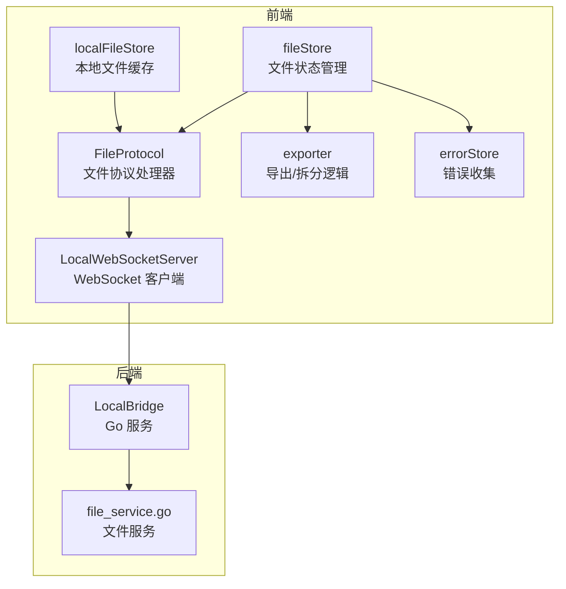
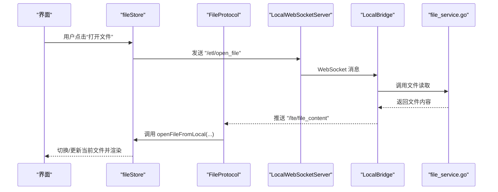
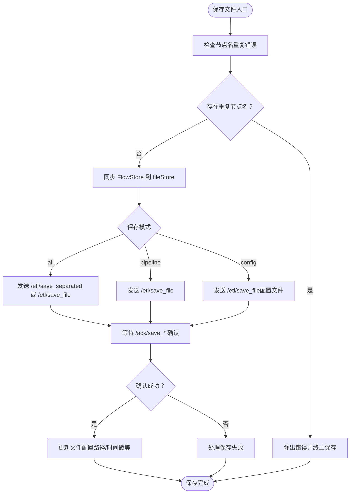
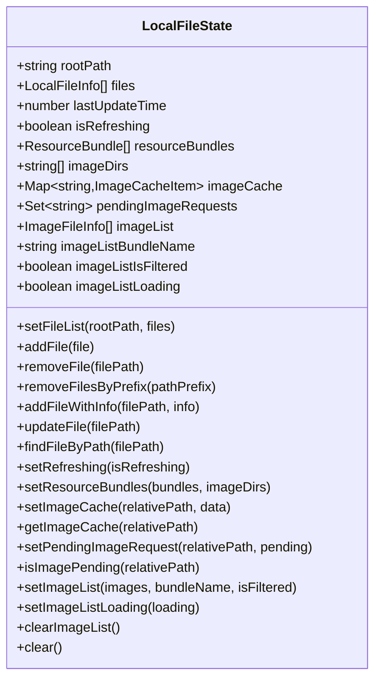
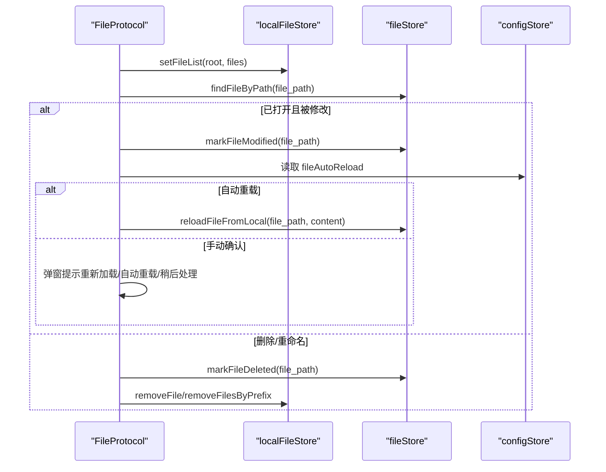
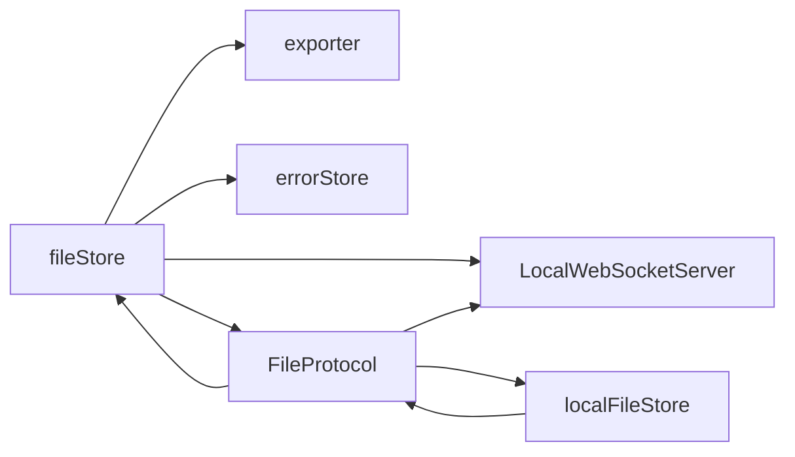

# 文件状态管理

<cite>
**本文档引用的文件**
- [fileStore.ts](file://src/stores/fileStore.ts)
- [localFileStore.ts](file://src/stores/localFileStore.ts)
- [FileProtocol.ts](file://src/services/protocols/FileProtocol.ts)
- [server.ts](file://src/services/server.ts)
- [exporter.ts](file://src/core/parser/exporter.ts)
- [errorStore.ts](file://src/stores/errorStore.ts)
- [shareHelper.ts](file://src/utils/data/shareHelper.ts)
- [file_service.go](file://LocalBridge/internal/service/file/file_service.go)
</cite>

## 目录
1. [简介](#简介)
2. [项目结构](#项目结构)
3. [核心组件](#核心组件)
4. [架构总览](#架构总览)
5. [详细组件分析](#详细组件分析)
6. [依赖关系分析](#依赖关系分析)
7. [性能考量](#性能考量)
8. [故障排查指南](#故障排查指南)
9. [结论](#结论)

## 简介
本文件围绕“文件状态管理”展开，重点解释以下方面：
- file store 与 local file store 的设计目的与功能差异
- 文件列表、当前文件、文件状态等数据结构的管理
- 文件操作（打开、保存、导入、导出）的状态更新机制与同步
- 文件监控与热重载的状态处理
- 文件状态的持久化与缓存策略
- 文件操作的错误处理与状态回滚机制

## 项目结构
文件状态管理涉及前端 Zustand Store、WebSocket 协议层、后端文件服务以及导出/解析模块之间的协作。下图展示主要组件及其交互关系。

图表来源
- [fileStore.ts:345-933](file://src/stores/fileStore.ts#L345-L933)
- [localFileStore.ts:125-339](file://src/stores/localFileStore.ts#L125-L339)
- [FileProtocol.ts:1-581](file://src/services/protocols/FileProtocol.ts#L1-L581)
- [server.ts:22-388](file://src/services/server.ts#L22-L388)
- [exporter.ts:1-320](file://src/core/parser/exporter.ts#L1-L320)
- [file_service.go:252-405](file://LocalBridge/internal/service/file/file_service.go#L252-L405)

章节来源
- [fileStore.ts:345-933](file://src/stores/fileStore.ts#L345-L933)
- [localFileStore.ts:125-339](file://src/stores/localFileStore.ts#L125-L339)
- [FileProtocol.ts:1-581](file://src/services/protocols/FileProtocol.ts#L1-L581)
- [server.ts:22-388](file://src/services/server.ts#L22-L388)
- [exporter.ts:1-320](file://src/core/parser/exporter.ts#L1-L320)
- [file_service.go:252-405](file://LocalBridge/internal/service/file/file_service.go#L252-L405)

## 核心组件
- fileStore：管理“已打开的文件集合”、“当前文件”、“文件配置”等，负责文件的打开、保存、切换、重载、标记删除/外部修改等状态更新，并与导出模块协作生成 JSON。
- localFileStore：管理“本地文件列表缓存”、“资源包信息”、“图片缓存/请求队列”等，用于 UI 展示与资源浏览，不进行 localStorage 持久化，始终从后端实时获取。
- FileProtocol：通过 WebSocket 接收后端推送的文件列表、文件内容、文件变更通知，并处理保存确认、创建文件确认等，协调前端状态与后端行为。
- LocalWebSocketServer：封装 WebSocket 连接、握手、路由注册与消息发送，作为前后端通信桥梁。
- exporter：将 Flow 状态转换为 Pipeline 对象/字符串，支持常规合并与分离模式导出。
- errorStore：收集节点名重复等错误，用于保存/导出前的前置校验。

章节来源
- [fileStore.ts:345-933](file://src/stores/fileStore.ts#L345-L933)
- [localFileStore.ts:125-339](file://src/stores/localFileStore.ts#L125-L339)
- [FileProtocol.ts:1-581](file://src/services/protocols/FileProtocol.ts#L1-L581)
- [server.ts:22-388](file://src/services/server.ts#L22-L388)
- [exporter.ts:1-320](file://src/core/parser/exporter.ts#L1-L320)
- [errorStore.ts:1-39](file://src/stores/errorStore.ts#L1-L39)

## 架构总览
文件状态管理采用“前端 Store + 协议处理器 + WebSocket + 后端服务”的分层架构：
- 前端 Store 负责业务状态与 UI 同步
- 协议处理器负责消息路由与状态联动
- WebSocket 提供双向通信通道
- 后端服务负责文件扫描、变更监听与内容推送

图表来源
- [FileProtocol.ts:109-141](file://src/services/protocols/FileProtocol.ts#L109-L141)
- [fileStore.ts:574-661](file://src/stores/fileStore.ts#L574-L661)
- [server.ts:290-304](file://src/services/server.ts#L290-L304)
- [file_service.go:252-405](file://LocalBridge/internal/service/file/file_service.go#L252-L405)

## 详细组件分析

### fileStore：文件状态与操作
- 数据结构
  - files：已打开文件数组，每个元素包含 fileName、nodes、edges、config
  - currentFile：当前活动文件
  - FileConfigType：文件配置，包含路径、坐标模式、分离配置路径、是否删除/外部修改、最后同步时间、节点顺序映射等
- 关键能力
  - 打开文件：openFileFromLocal，支持合并配置、键序提取、视口恢复、避免重复打开
  - 保存文件：saveFileToLocal，支持常规保存与分离保存，等待后端确认并更新配置
  - 切换文件：switchFile，保存当前视口、检测外部修改、必要时触发重载
  - 标记状态：markFileDeleted/markFileModified/reloadFileFromLocal
  - 本地持久化：localSave，序列化 files 并写入 localStorage
  - 节点顺序：assignNodeOrder/removeNodeOrder/getNodeOrder
- 错误处理
  - 保存前校验节点名重复错误
  - 保存确认超时处理（FileProtocol.waitForSaveAck）
  - 本地存储配额异常提示

图表来源
- [fileStore.ts:664-847](file://src/stores/fileStore.ts#L664-L847)
- [FileProtocol.ts:541-579](file://src/services/protocols/FileProtocol.ts#L541-L579)
- [exporter.ts:304-319](file://src/core/parser/exporter.ts#L304-L319)

章节来源
- [fileStore.ts:345-933](file://src/stores/fileStore.ts#L345-L933)
- [exporter.ts:1-320](file://src/core/parser/exporter.ts#L1-L320)
- [errorStore.ts:1-39](file://src/stores/errorStore.ts#L1-L39)

### localFileStore：本地文件缓存
- 设计目的
  - 存储从 LocalBridge 推送的本地文件列表与资源信息，用于 UI 展示与资源浏览
  - 不进行 localStorage 持久化，始终从后端实时获取，保证 UI 与后端一致
- 关键能力
  - setFileList/addFile/removeFile/removeFilesByPrefix/updateFile/findFileByPath
  - 资源包与图片缓存：setImageCache/getImageCache/setPendingImageRequest/isImagePending
  - 图片列表：setImageList/setImageListLoading/clearImageList
  - 清空缓存：clear
- 状态字段
  - rootPath、files、lastUpdateTime、isRefreshing
  - resourceBundles、imageDirs、imageCache、pendingImageRequests
  - imageList、imageListBundleName、imageListIsFiltered、imageListLoading

图表来源
- [localFileStore.ts:61-123](file://src/stores/localFileStore.ts#L61-L123)
- [localFileStore.ts:130-339](file://src/stores/localFileStore.ts#L130-L339)

章节来源
- [localFileStore.ts:125-339](file://src/stores/localFileStore.ts#L125-L339)

### FileProtocol：文件协议处理器
- 职责
  - 注册接收路由：/lte/file_list、/lte/file_content、/lte/file_changed
  - 注册确认路由：/ack/save_file、/ack/save_separated、/ack/create_file
  - 处理文件列表推送、文件内容推送、文件变更通知
  - 处理保存确认、创建文件确认
  - 保存确认机制：waitForSaveAck/resolveSaveCallback/clearAllPendingCallbacks
- 热重载与变更处理
  - modified：忽略刚保存的文件变更通知，检测已打开文件并标记为外部修改，根据配置自动重载或弹窗提示
  - deleted/renamed：清理已打开文件的路径/状态
- 与 fileStore/localFileStore 的协作
  - 调用 fileStore.openFileFromLocal/reloadFileFromLocal/markFileDeleted/markFileModified
  - 调用 localFileStore.setFileList/removeFile/removeFilesByPrefix/updateFile

图表来源
- [FileProtocol.ts:78-231](file://src/services/protocols/FileProtocol.ts#L78-L231)
- [fileStore.ts:849-931](file://src/stores/fileStore.ts#L849-L931)

章节来源
- [FileProtocol.ts:1-581](file://src/services/protocols/FileProtocol.ts#L1-L581)

### LocalWebSocketServer：WebSocket 通信
- 功能
  - 连接/断开、握手、路由注册、消息发送
  - 连接状态监听、超时处理、错误提示
- 与协议层协作
  - 由 FileProtocol 注册路由，统一处理文件相关消息

章节来源
- [server.ts:22-388](file://src/services/server.ts#L22-L388)

### 导出与导入：exporter 与本地导入
- 导出
  - flowToPipeline：生成 Pipeline 对象，支持配置导出与节点顺序
  - flowToPipelineString：输出 JSON 字符串
  - flowToSeparatedStrings：分离导出（管道 + 配置）
- 本地导入
  - shareHelper.importFromLocalFile：通过 File System Access API 读取本地文件并新建文件加载内容

章节来源
- [exporter.ts:1-320](file://src/core/parser/exporter.ts#L1-L320)
- [shareHelper.ts:265-312](file://src/utils/data/shareHelper.ts#L265-L312)

## 依赖关系分析
- fileStore 依赖
  - 导出模块：flowToPipeline/flowToSeparatedStrings
  - 错误模块：findErrorsByType（保存前校验）
  - WebSocket：localServer（发送保存/打开请求）
  - FileProtocol：等待保存确认
- localFileStore 依赖
  - 仅用于 UI 缓存，不依赖 fileStore 的持久化
- FileProtocol 依赖
  - fileStore/localFileStore/configStore（读取配置）
  - LocalWebSocketServer（发送请求）

图表来源
- [fileStore.ts:1-24](file://src/stores/fileStore.ts#L1-L24)
- [exporter.ts:1-6](file://src/core/parser/exporter.ts#L1-L6)
- [errorStore.ts:1-11](file://src/stores/errorStore.ts#L1-L11)
- [server.ts:9-18](file://src/services/server.ts#L9-L18)
- [localFileStore.ts:1-1](file://src/stores/localFileStore.ts#L1-L1)

章节来源
- [fileStore.ts:1-24](file://src/stores/fileStore.ts#L1-L24)
- [exporter.ts:1-6](file://src/core/parser/exporter.ts#L1-L6)
- [errorStore.ts:1-11](file://src/stores/errorStore.ts#L1-L11)
- [server.ts:9-18](file://src/services/server.ts#L9-L18)
- [localFileStore.ts:1-1](file://src/stores/localFileStore.ts#L1-L1)

## 性能考量
- 保存确认超时：FileProtocol.waitForSaveAck 设置超时，避免阻塞 UI
- 本地存储配额：localSave 捕获 QuotaExceededError 并提示用户清理空间
- 图片缓存：localFileStore 使用 Map/Set 管理图片缓存与请求状态，避免重复请求
- 节点顺序：使用 nodeOrderMap 与 nextOrderNumber，减少不必要的重排
- 分离保存：仅发送需要的部分，降低网络负载

## 故障排查指南
- 保存失败
  - 检查是否存在节点名重复错误
  - 确认 WebSocket 连接状态与后端握手版本
  - 查看保存确认超时日志与 FileProtocol.pendingSaveCallbacks 清理
- 文件被外部修改
  - 若开启自动重载，确认 fileAutoReload 配置
  - 若手动处理，检查弹窗提示与 FileProtocol.showFileChangedModal
- 本地存储空间不足
  - 清理浏览器域名数据或减少文件数量
- 文件监控忽略自身写入
  - 后端 file_service.go 通过 recentlyWrittenFiles 与防抖窗口忽略自身写入事件

章节来源
- [fileStore.ts:234-273](file://src/stores/fileStore.ts#L234-L273)
- [FileProtocol.ts:408-532](file://src/services/protocols/FileProtocol.ts#L408-L532)
- [file_service.go:252-405](file://LocalBridge/internal/service/file/file_service.go#L252-L405)

## 结论
- fileStore 专注于“已打开文件”的状态管理与操作，负责与导出模块、错误模块、WebSocket 的协同
- localFileStore 专注于“本地文件列表与资源”的缓存展示，不进行持久化，确保 UI 与后端一致
- FileProtocol 作为前后端的桥梁，统一处理文件列表、内容、变更与确认消息，实现热重载与状态同步
- 通过保存确认机制、错误前置校验、图片缓存与分离保存等策略，提升用户体验与系统稳定性