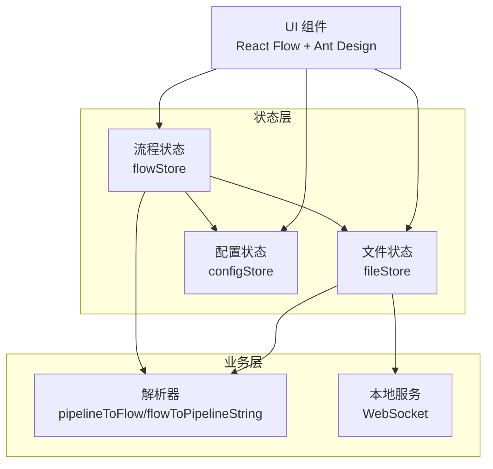
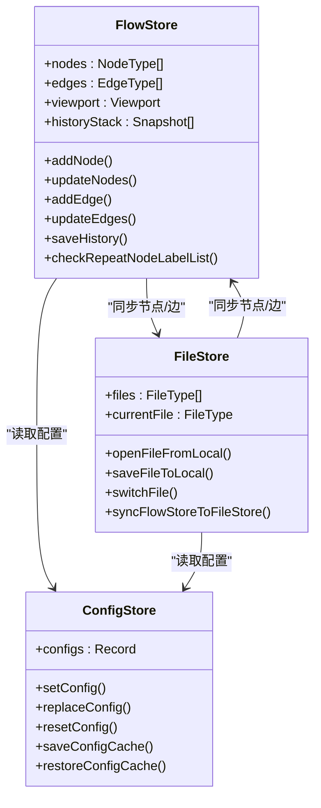
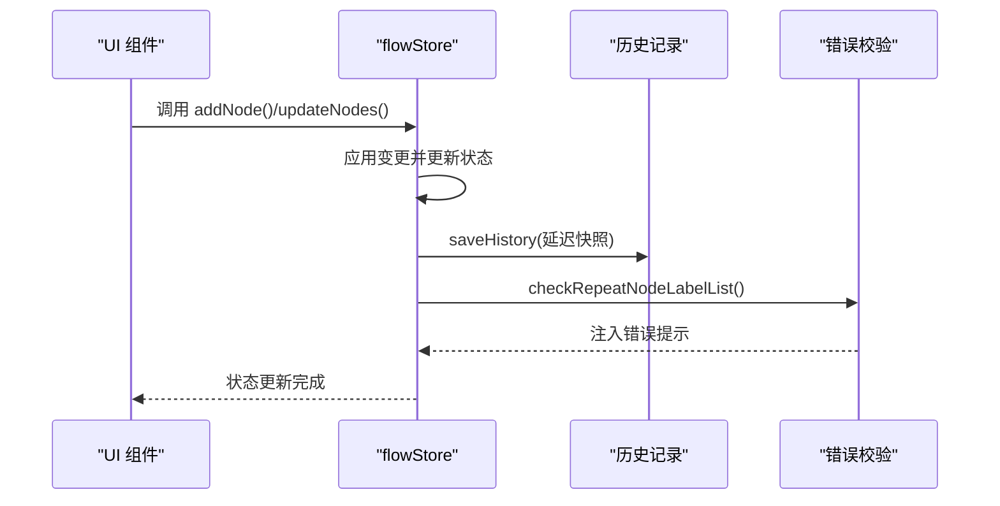
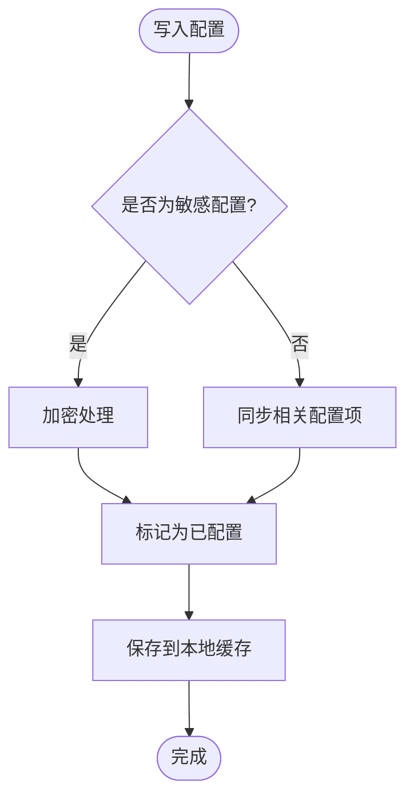
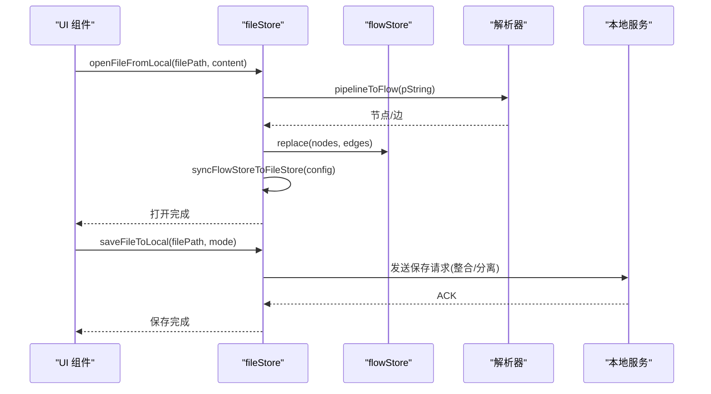
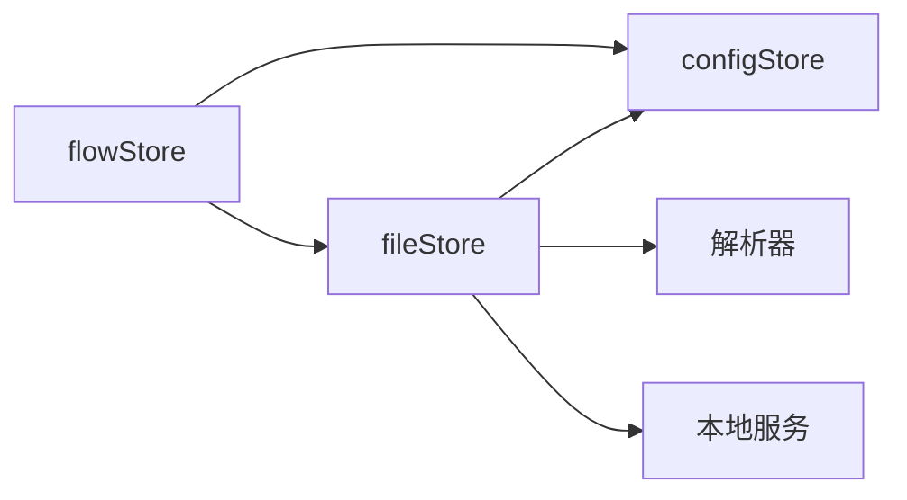

# 状态管理系统

<cite>
**本文档引用的文件**
- [src/stores/flow/index.ts](file://src/stores/flow/index.ts)
- [src/stores/flow/types.ts](file://src/stores/flow/types.ts)
- [src/stores/flow/slices/nodeSlice.ts](file://src/stores/flow/slices/nodeSlice.ts)
- [src/stores/flow/slices/edgeSlice.ts](file://src/stores/flow/slices/edgeSlice.ts)
- [src/stores/configStore.ts](file://src/stores/configStore.ts)
- [src/stores/fileStore.ts](file://src/stores/fileStore.ts)
</cite>

## 目录
1. [简介](#简介)
2. [项目结构](#项目结构)
3. [核心组件](#核心组件)
4. [架构总览](#架构总览)
5. [详细组件分析](#详细组件分析)
6. [依赖关系分析](#依赖关系分析)
7. [性能考量](#性能考量)
8. [故障排查指南](#故障排查指南)
9. [结论](#结论)
10. [附录](#附录)

## 简介
本文件系统性梳理 MaaPipelineEditor 的状态管理实现，重点围绕 Zustand 的使用与架构设计展开。项目采用单页应用架构，结合 React Flow 作为可视化编辑器，Zustand 作为轻量级全局状态容器，将“流程图状态”“配置状态”“文件状态”等进行清晰分层与职责划分，并通过切片（slice）模式组合多模块状态，形成可维护、可扩展的状态体系。

## 项目结构
- 状态层位于 src/stores，按功能划分为：
  - 流程状态（flow store）：负责节点、边、视口、历史、探索等与画布交互密切的状态
  - 配置状态（config store）：负责 UI 行为、导出策略、本地服务、AI 等配置项
  - 文件状态（file store）：负责多文件管理、本地/远程同步、持久化与缓存
- flow store 采用 slice 模式，将视口、选择、历史、节点、边、图数据、路径、锚点引用、探索等拆分为独立 slice，最终在入口文件中组合为单一 store
- config store 与 file store 采用标准 Zustand create 形态，提供配置读写、默认值恢复、持久化缓存等能力

图表来源
- [src/stores/flow/index.ts:18-28](file://src/stores/flow/index.ts#L18-L28)
- [src/stores/configStore.ts:270-413](file://src/stores/configStore.ts#L270-L413)
- [src/stores/fileStore.ts:15-22](file://src/stores/fileStore.ts#L15-L22)

章节来源
- [src/stores/flow/index.ts:1-124](file://src/stores/flow/index.ts#L1-L124)
- [src/stores/configStore.ts:1-440](file://src/stores/configStore.ts#L1-L440)
- [src/stores/fileStore.ts:1-933](file://src/stores/fileStore.ts#L1-L933)

## 核心组件
- flow store（流程状态）
  - 采用 slice 模式，组合视口、选择、历史、节点、边、图数据、路径、锚点引用、探索等状态与动作
  - 提供节点增删改、边连接、历史记录、视口控制、探索模式等能力
- config store（配置状态）
  - 管理 UI 行为、导出策略、本地服务、AI 等配置项，默认值与迁移逻辑完善
  - 提供配置持久化与缓存恢复能力
- file store（文件状态）
  - 管理多文件、当前文件、文件配置（路径、坐标系、视口、节点顺序等）
  - 提供本地/远程文件打开、保存、重载、同步等能力，并与 flow store 协同保持一致性

章节来源
- [src/stores/flow/index.ts:18-28](file://src/stores/flow/index.ts#L18-L28)
- [src/stores/flow/types.ts:239-439](file://src/stores/flow/types.ts#L239-L439)
- [src/stores/configStore.ts:179-268](file://src/stores/configStore.ts#L179-L268)
- [src/stores/fileStore.ts:25-44](file://src/stores/fileStore.ts#L25-L44)

## 架构总览
Zustand 在本项目中的定位是“轻量、直观、可组合”的全局状态容器。flow store 通过 slice 模式将复杂状态拆分，config store 与 file store 则分别承担配置与文件层面的状态管理。三者之间通过状态读取与相互调用实现协作，例如：
- file store 在打开/保存文件时会同步 flow store 的节点与边
- flow store 在节点/边变更时会触发历史记录与错误校验
- config store 的配置变化会影响节点样式、导出行为与本地服务策略

图表来源
- [src/stores/flow/index.ts:84-104](file://src/stores/flow/index.ts#L84-L104)
- [src/stores/configStore.ts:270-413](file://src/stores/configStore.ts#L270-L413)
- [src/stores/fileStore.ts:92-130](file://src/stores/fileStore.ts#L92-L130)

## 详细组件分析

### flow store（流程状态）
- 设计要点
  - 采用 slice 模式：将视口、选择、历史、节点、边、图数据、路径、锚点引用、探索等拆分为独立 slice，便于维护与测试
  - 与 React Flow 深度集成：通过实例句柄与视口状态联动，支持聚焦、适配视图、尺寸变化等
  - 历史记录：统一的 saveHistory/undo/redo 机制，支持延迟快照与操作描述
  - 错误校验：如节点名重复等，通过错误 store 注入错误提示
- 关键数据结构
  - 节点类型：Pipeline、External、Anchor、Sticker、Group
  - 边类型：带标签与属性的连接，支持 next/on_error 等语义
  - 历史快照：记录节点与边的集合，支持回退与前进
- 关键流程
  - 节点增删改：通过 applyNodeChanges 应用变更，同时维护选择状态与锚点索引
  - 边连接：计算连接顺序，避免 next/on_error 冲突
  - 视口与尺寸：响应窗口变化，提供适配视图与聚焦节点的能力

图表来源
- [src/stores/flow/slices/nodeSlice.ts:44-136](file://src/stores/flow/slices/nodeSlice.ts#L44-L136)
- [src/stores/flow/index.ts:84-104](file://src/stores/flow/index.ts#L84-L104)

章节来源
- [src/stores/flow/index.ts:18-28](file://src/stores/flow/index.ts#L18-L28)
- [src/stores/flow/types.ts:239-439](file://src/stores/flow/types.ts#L239-L439)
- [src/stores/flow/slices/nodeSlice.ts:36-718](file://src/stores/flow/slices/nodeSlice.ts#L36-L718)
- [src/stores/flow/slices/edgeSlice.ts:16-238](file://src/stores/flow/slices/edgeSlice.ts#L16-L238)

### config store（配置状态）
- 设计要点
  - 配置分类与迁移：通过配置映射与迁移逻辑，兼容旧版配置（如 isExportConfig 与 configHandlingMode 的互斥）
  - 默认值与重置：提供默认配置与一键重置能力
  - 加密存储：敏感配置（如 AI API Key）在写入时进行加密处理
  - 持久化：提供本地缓存保存与恢复，包含已配置键追踪
- 关键数据结构
  - configs：包含导出、节点、连接、画布、组件、本地服务、AI 等配置项
  - status：面板显隐、宽度等 UI 状态
- 关键流程
  - setConfig：写入配置并同步相关配置项
  - replaceConfig：批量替换配置并迁移旧字段
  - saveConfigCache/restoreConfigCache：本地持久化与恢复

图表来源
- [src/stores/configStore.ts:270-311](file://src/stores/configStore.ts#L270-L311)
- [src/stores/configStore.ts:312-366](file://src/stores/configStore.ts#L312-L366)
- [src/stores/configStore.ts:417-440](file://src/stores/configStore.ts#L417-L440)

章节来源
- [src/stores/configStore.ts:179-268](file://src/stores/configStore.ts#L179-L268)
- [src/stores/configStore.ts:270-413](file://src/stores/configStore.ts#L270-L413)
- [src/stores/configStore.ts:415-440](file://src/stores/configStore.ts#L415-L440)

### file store（文件状态）
- 设计要点
  - 多文件管理：files 数组与 currentFile 协同，支持切换、新增、删除、拖拽排序
  - 与 flow store 同步：通过 syncFlowStoreToFileStore 保证节点/边与文件配置的一致性
  - 本地/远程协同：支持从本地打开、保存到本地、重载外部修改、分离/整合配置保存
  - 节点顺序与视口：维护节点顺序映射与视口缓存，提升体验
- 关键数据结构
  - FileType：包含文件名、节点、边、配置
  - FileConfigType：包含路径、坐标系、分离配置路径、视口、节点顺序等
- 关键流程
  - openFileFromLocal：解析内容、合并配置、切换文件、同步到 flow store
  - saveFileToLocal：根据配置处理模式（整合/分离）发送保存请求
  - reloadFileFromLocal：检测外部修改并触发重载
  - localSave：本地持久化 files 与配置缓存

图表来源
- [src/stores/fileStore.ts:574-661](file://src/stores/fileStore.ts#L574-L661)
- [src/stores/fileStore.ts:664-832](file://src/stores/fileStore.ts#L664-L832)
- [src/stores/fileStore.ts:92-130](file://src/stores/fileStore.ts#L92-L130)

章节来源
- [src/stores/fileStore.ts:25-44](file://src/stores/fileStore.ts#L25-L44)
- [src/stores/fileStore.ts:346-375](file://src/stores/fileStore.ts#L346-L375)
- [src/stores/fileStore.ts:574-661](file://src/stores/fileStore.ts#L574-L661)
- [src/stores/fileStore.ts:664-832](file://src/stores/fileStore.ts#L664-L832)
- [src/stores/fileStore.ts:92-130](file://src/stores/fileStore.ts#L92-L130)

## 依赖关系分析
- 组件耦合
  - flow store 与 config store：flow store 在节点创建、布局、视口适配等场景读取 config store 的配置
  - flow store 与 file store：flow store 的节点/边变更需同步到 file store，file store 的切换也需驱动 flow store 的替换
  - file store 与 config store：保存/打开文件时读取配置处理模式与 JSON 缩进等
- 外部依赖
  - React Flow：提供节点/边变更、视口、尺寸等能力
  - 本地服务（WebSocket）：负责文件打开/保存/重载等与后端的通信
  - 解析器：负责 pipeline 与 flow 的相互转换

图表来源
- [src/stores/flow/index.ts:13-15](file://src/stores/flow/index.ts#L13-L15)
- [src/stores/fileStore.ts:15-22](file://src/stores/fileStore.ts#L15-L22)

章节来源
- [src/stores/flow/index.ts:13-15](file://src/stores/flow/index.ts#L13-L15)
- [src/stores/fileStore.ts:15-22](file://src/stores/fileStore.ts#L15-L22)

## 性能考量
- 状态粒度与更新范围
  - flow store 采用 slice 模式，每个 slice 仅管理自身状态，减少无关更新
  - 节点/边更新通过 applyNodeChanges/applyEdgeChanges 应用，避免全量深拷贝
- 历史记录与快照
  - saveHistory 支持延迟快照，降低频繁变更带来的性能压力
- 本地持久化
  - file store 在本地保存时对 savedViewport 进行取整，减少冗余精度
  - config store 仅保存必要字段，避免缓存膨胀
- UI 响应
  - 通过 Debounce 选择状态与目标节点，减少渲染抖动

章节来源
- [src/stores/flow/slices/nodeSlice.ts:44-136](file://src/stores/flow/slices/nodeSlice.ts#L44-L136)
- [src/stores/flow/slices/edgeSlice.ts:25-66](file://src/stores/flow/slices/edgeSlice.ts#L25-L66)
- [src/stores/fileStore.ts:234-273](file://src/stores/fileStore.ts#L234-L273)
- [src/stores/configStore.ts:417-440](file://src/stores/configStore.ts#L417-L440)

## 故障排查指南
- 常见问题与定位
  - 节点名重复：flow store 在节点变更后调用 checkRepeatNodeLabelList，错误类型为 NodeNameRepeat，可在错误面板查看
  - 保存失败：当存在重复节点名时，保存会被阻断并提示具体节点名
  - 本地存储配额不足：localSave 捕获 QuotaExceededError 并弹出通知
  - 外部修改文件：switchFile 时检测 isModifiedExternally，必要时触发重载
- 调试建议
  - 使用浏览器开发者工具观察 Zustand 状态变化，关注关键动作（addNode、updateNodes、addEdge、updateEdges、saveHistory）
  - 在 config store 中检查配置项是否正确迁移（如 isExportConfig 与 configHandlingMode）
  - 在 file store 中核对文件路径、分离配置路径与 lastSyncTime

章节来源
- [src/stores/flow/index.ts:84-104](file://src/stores/flow/index.ts#L84-L104)
- [src/stores/fileStore.ts:688-699](file://src/stores/fileStore.ts#L688-L699)
- [src/stores/fileStore.ts:260-272](file://src/stores/fileStore.ts#L260-L272)
- [src/stores/fileStore.ts:443-493](file://src/stores/fileStore.ts#L443-L493)

## 结论
本项目基于 Zustand 构建了清晰、可维护的状态管理体系：flow store 通过 slice 模式实现强内聚低耦合；config store 提供完善的配置迁移与持久化；file store 实现多文件与本地/远程协同。三者配合 React Flow 与本地服务，形成高效、稳定的可视化编辑体验。建议在后续迭代中持续关注状态粒度与性能优化，完善调试工具链与可观测性。

## 附录
- 最佳实践
  - 使用 slice 模式拆分复杂状态，明确边界与职责
  - 在关键动作处统一记录历史快照，便于回滚与审计
  - 对敏感配置进行加密存储，并在持久化时过滤冗余字段
  - 在文件打开/保存流程中严格校验前置条件（如重复节点名），并在 UI 层给出明确反馈
- 性能优化建议
  - 减少不必要的状态更新，利用浅比较与选择器
  - 合理设置历史记录的延迟与阈值，避免频繁快照
  - 对本地缓存进行压缩与分块，避免单次写入过大
- 开发工具
  - 使用浏览器插件或 Zustand 自带的 devtools 观察状态变化
  - 在关键流程（打开/保存/重载）增加日志输出，便于定位问题