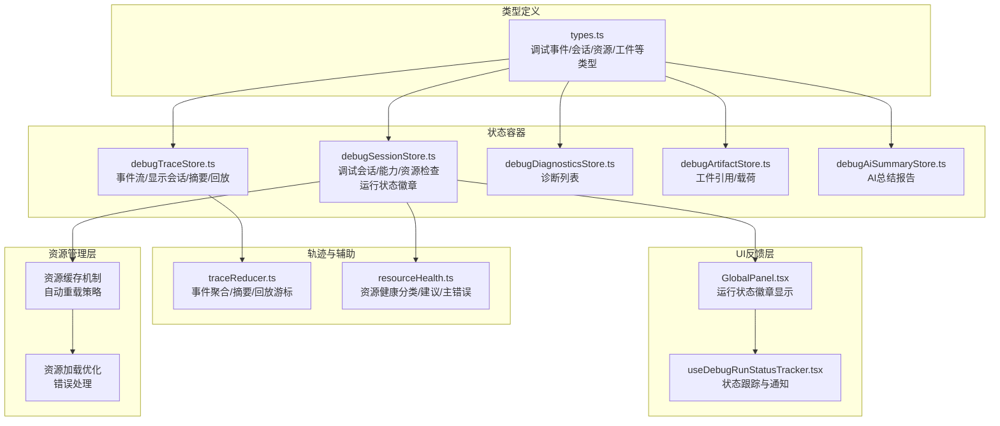
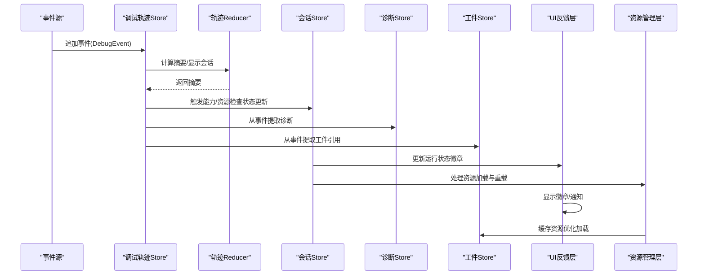
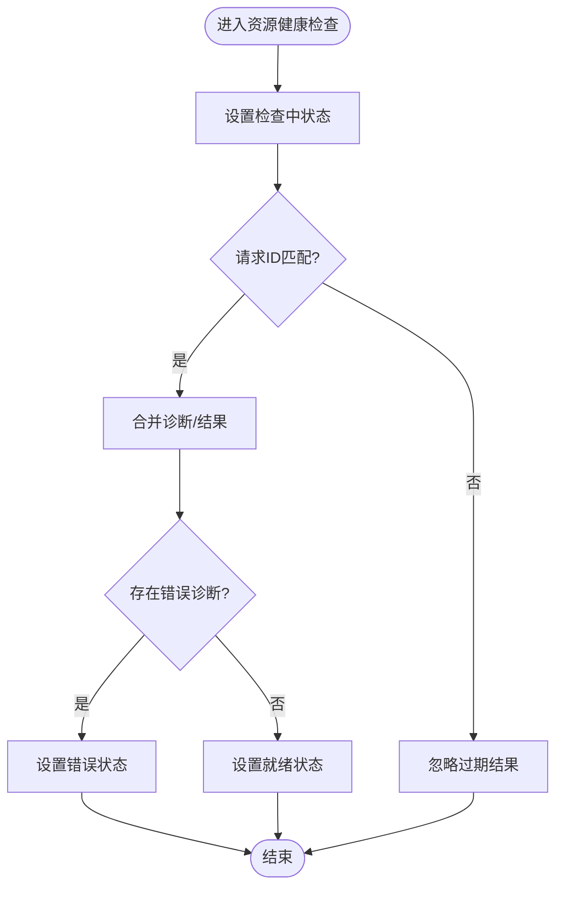
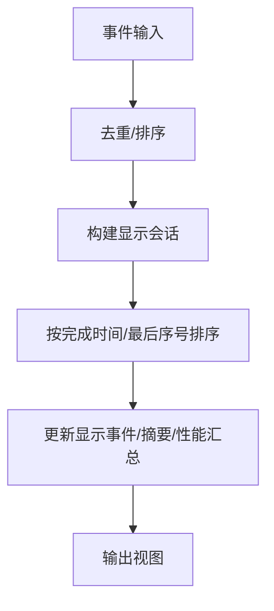
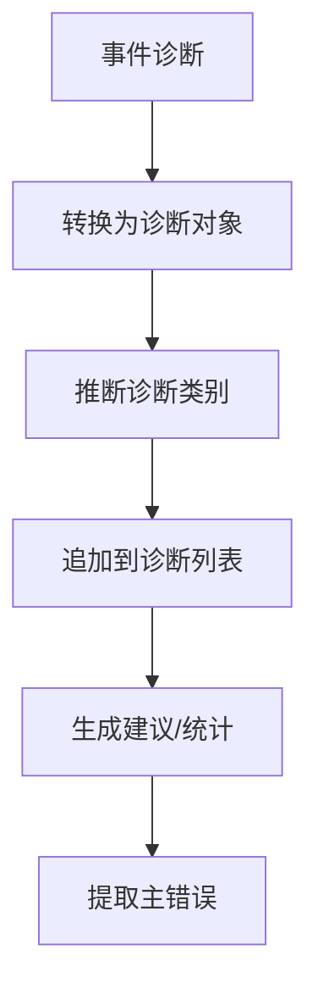
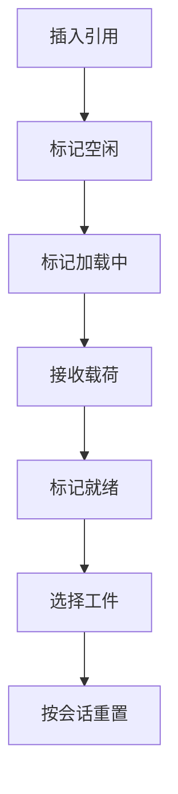
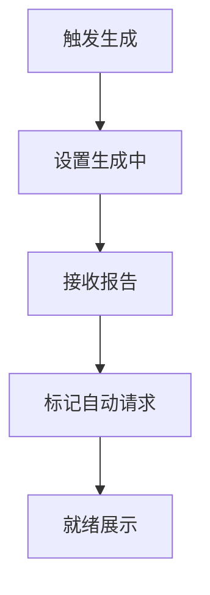
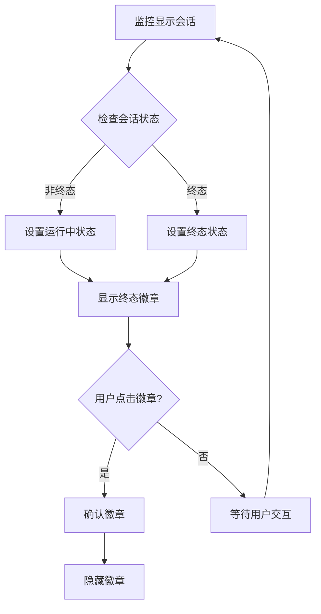
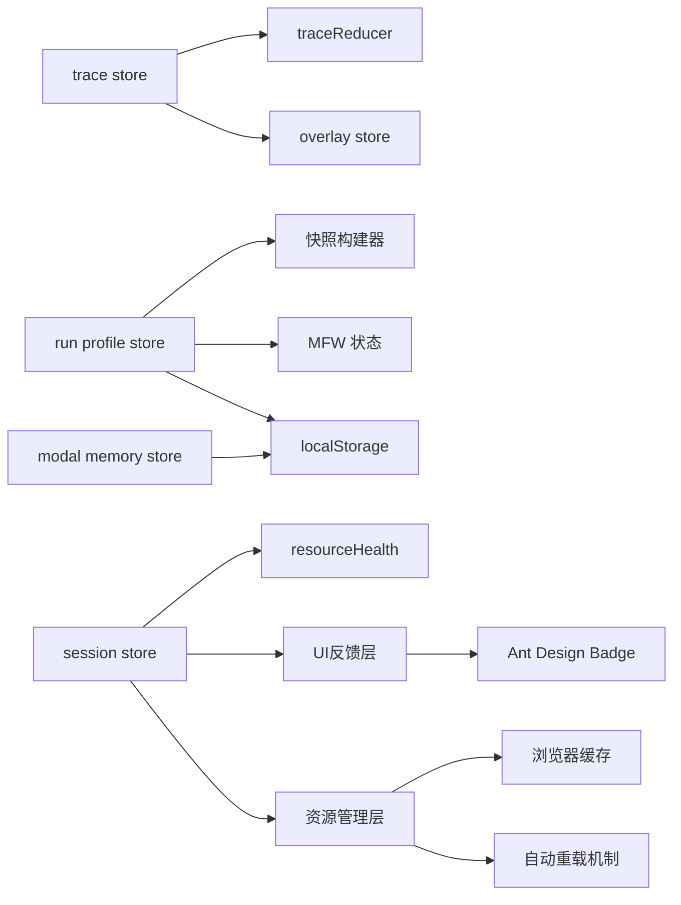

# 调试状态管理

<cite>
**本文档引用的文件**
- [debugSessionStore.ts](file://src/stores/debugSessionStore.ts)
- [debugTraceStore.ts](file://src/stores/debugTraceStore.ts)
- [debugAiSummaryStore.ts](file://src/stores/debugAiSummaryStore.ts)
- [debugDiagnosticsStore.ts](file://src/stores/debugDiagnosticsStore.ts)
- [debugArtifactStore.ts](file://src/stores/debugArtifactStore.ts)
- [types.ts](file://src/features/debug/types.ts)
- [traceReducer.ts](file://src/features/debug/traceReducer.ts)
- [resourceHealth.ts](file://src/features/debug/resourceHealth.ts)
- [GlobalPanel.tsx](file://src/components/panels/tools/GlobalPanel.tsx)
- [useDebugRunStatusTracker.tsx](file://src/features/debug/hooks/useDebugRunStatusTracker.tsx)
</cite>

## 更新摘要
**所做更改**
- 新增运行状态徽章系统的详细说明和UI实现分析
- 更新调试模态记忆存储功能的简化版本说明
- 增强调试状态管理的整体架构描述
- 完善UI反馈机制的技术实现细节
- 修复资源加载bug的相关改进措施
- 改进自动重载功能的实现机制
- 重构调试面板布局的优化策略

## 目录
1. [简介](#简介)
2. [项目结构](#项目结构)
3. [核心组件](#核心组件)
4. [架构总览](#架构总览)
5. [详细组件分析](#详细组件分析)
6. [运行状态徽章系统](#运行状态徽章系统)
7. [依赖关系分析](#依赖关系分析)
8. [性能考量](#性能考量)
9. [故障排查指南](#故障排查指南)
10. [结论](#结论)
11. [附录](#附录)

## 简介
本文件系统性梳理调试状态管理的设计与实现，覆盖调试会话、AI历史、诊断信息、轨迹回放、资源健康、工件（截图/日志）等状态域。重点阐述以下方面：
- 各调试 store 的设计目的与职责边界
- 调试状态的数据结构与生命周期管理
- 调试过程中的状态更新与数据收集机制
- 调试结果的存储、检索与展示状态
- 清理与内存管理策略
- 性能影响分析与优化建议
- **新增**：运行状态徽章系统与UI反馈机制
- **新增**：资源加载bug修复与自动重载功能改进
- **新增**：调试面板布局重构的优化策略

## 项目结构
调试状态管理采用按功能域划分的 store 组织方式，结合统一的调试类型定义与轨迹聚合逻辑，形成清晰的分层：
- 类型层：集中定义调试事件、会话、运行模式、资源健康、工件等强类型
- Store 层：围绕不同调试子域的状态容器，负责状态更新、持久化与派生视图
- 轨迹层：对事件进行聚合与索引，生成可交互的摘要与回放能力
- **新增**：UI反馈层：通过运行状态徽章提供实时可视化反馈
- **新增**：资源管理层：专门处理资源加载与缓存机制

**图表来源**
- [types.ts:1-476](file://src/features/debug/types.ts#L1-L476)
- [debugSessionStore.ts:1-273](file://src/stores/debugSessionStore.ts#L1-L273)
- [debugTraceStore.ts:1-451](file://src/stores/debugTraceStore.ts#L1-L451)
- [GlobalPanel.tsx:94-338](file://src/components/panels/tools/GlobalPanel.tsx#L94-L338)
- [useDebugRunStatusTracker.tsx:27-103](file://src/features/debug/hooks/useDebugRunStatusTracker.tsx#L27-L103)

**章节来源**
- [types.ts:1-476](file://src/features/debug/types.ts#L1-L476)
- [debugTraceStore.ts:1-451](file://src/stores/debugTraceStore.ts#L1-L451)
- [traceReducer.ts:1-570](file://src/features/debug/traceReducer.ts#L1-L570)

## 核心组件
本节聚焦各调试 store 的职责、关键状态与典型操作。

- 调试会话与能力
  - 职责：维护调试模态的打开状态、活动面板、选中节点；承载当前会话快照、运行请求、协议错误；管理能力清单与资源预检/健康检查状态；**新增**：运行状态徽章管理。
  - 关键状态：模态开关、活动面板、会话快照、运行状态、能力清单、资源检查状态、**新增**：运行徽章状态、徽章确认状态。
  - 典型操作：打开/关闭模态、设置会话快照、记录运行开始/停止请求、设置代理测试结果、设置协议错误、设置/清除能力清单与资源检查状态、**新增**：设置运行徽章状态、确认徽章显示。
  
  **章节来源**
  - [debugSessionStore.ts:1-273](file://src/stores/debugSessionStore.ts#L1-L273)

- 调试轨迹与回放
  - 职责：接收调试事件流，构建显示会话、事件索引、摘要与回放状态；支持选择/聚焦特定会话、性能汇总、重置与按会话清理。
  - 关键状态：事件数组、显示事件、事件索引、显示会话列表、选中会话集合、摘要、性能汇总、回放状态。
  - 典型操作：追加事件、应用快照、设置回放状态/停止、设置性能汇总、选择/全选/最新会话、重置指定会话或全部。
  
  **章节来源**
  - [debugTraceStore.ts:1-451](file://src/stores/debugTraceStore.ts#L1-L451)
  - [traceReducer.ts:184-352](file://src/features/debug/traceReducer.ts#L184-L352)

- 诊断信息
  - 职责：收集并维护调试诊断列表，支持从事件转换为诊断项、清空诊断。
  - 关键状态：诊断数组。
  - 典型操作：设置预检诊断、从事件追加诊断、清空诊断。
  
  **章节来源**
  - [debugDiagnosticsStore.ts:1-50](file://src/stores/debugDiagnosticsStore.ts#L1-L50)

- 工件（截图/日志）
  - 职责：管理调试产生的工件引用与载荷，支持按会话清理、选择当前工件。
  - 关键状态：工件映射、选中工件 ID。
  - 典型操作：插入/更新引用、设置加载中/就绪/错误、设置载荷、选择工件、按会话重置。
  
  **章节来源**
  - [debugArtifactStore.ts:1-115](file://src/stores/debugArtifactStore.ts#L1-L115)

- AI 历史与总结
  - 职责：管理 AI 自动生成的调试总结报告，支持生成中状态、错误、自动请求标记与重置。
  - 关键状态：状态机、活动报告、错误消息、自动请求目标集合。
  - 典型操作：设置生成中、设置报告、设置错误、标记自动请求、重置。
  
  **章节来源**
  - [debugAiSummaryStore.ts:1-101](file://src/stores/debugAiSummaryStore.ts#L1-L101)

## 架构总览
调试状态管理通过 zustand store 将"事件驱动"与"派生视图"解耦，**新增**了运行状态徽章的实时反馈机制：
- 事件源（如后端调试协议、本地桥接）推送 DebugEvent 到 trace store
- trace store 通过 reducer 生成摘要与显示视图，并驱动覆盖 store 更新高亮
- 会话 store 维护能力/资源检查状态，触发 AI 总结与诊断收集，**新增**：管理运行状态徽章
- UI层通过 GlobalPanel 和状态跟踪钩子提供实时可视化反馈
- 工件 store 以事件中的引用为索引，异步填充载荷
- 运行配置 store 提供构建运行请求的能力，贯穿整个调试生命周期
- **新增**：资源管理层处理资源加载优化与自动重载机制

**图表来源**
- [debugTraceStore.ts:281-308](file://src/stores/debugTraceStore.ts#L281-L308)
- [traceReducer.ts:184-317](file://src/features/debug/traceReducer.ts#L184-L317)
- [debugSessionStore.ts:166-204](file://src/stores/debugSessionStore.ts#L166-L204)
- [debugDiagnosticsStore.ts:40-46](file://src/stores/debugDiagnosticsStore.ts#L40-L46)
- [debugArtifactStore.ts:62-72](file://src/stores/debugArtifactStore.ts#L62-L72)
- [GlobalPanel.tsx:94-109](file://src/components/panels/tools/GlobalPanel.tsx#L94-L109)
- [useDebugRunStatusTracker.tsx:27-54](file://src/features/debug/hooks/useDebugRunStatusTracker.tsx#L27-L54)

## 详细组件分析

### 调试会话与资源健康
- 设计目的
  - 作为调试模态的中枢，协调能力探测、资源预检/健康检查与运行控制，**新增**：提供运行状态徽章管理。
- 数据结构
  - 能力状态：idle/loading/ready/error
  - 资源预检/健康：包含状态、请求标识、结果与错误
  - 会话/运行：当前会话快照、运行开始/停止请求、代理测试结果、协议错误
  - **新增**：运行徽章状态：idle/running/completed/failed/stopped，徽章确认状态
- 生命周期
  - 初始化：空闲状态，等待能力探测
  - 探测阶段：设置 loading，接收结果后切换 ready 或 error
  - 运行阶段：设置会话快照与运行开始，记录停止请求与错误
  - 清理阶段：按会话清理，重置状态
  - **新增**：运行状态跟踪：实时更新徽章状态，提供UI反馈
- 关键流程（资源健康）
  - 发起检查 -> 设置 checking 状态 -> 校验请求 ID -> 合并结果/错误 -> 切换 ready/error

**图表来源**
- [debugSessionStore.ts:222-237](file://src/stores/debugSessionStore.ts#L222-L237)
- [resourceHealth.ts:113-127](file://src/features/debug/resourceHealth.ts#L113-L127)

**章节来源**
- [debugSessionStore.ts:1-273](file://src/stores/debugSessionStore.ts#L1-L273)
- [resourceHealth.ts:1-173](file://src/features/debug/resourceHealth.ts#L1-L173)

### 调试轨迹与回放
- 设计目的
  - 将事件流转换为可浏览的"显示会话"，并提供实时摘要与回放游标。
- 数据结构
  - 事件索引：以 sessionId:runId:seq 为键，避免重复
  - 显示会话：按完成时间/最后序号排序，记录首尾序号与事件数
  - 摘要：节点状态、边执行/候选、识别/动作事件、诊断、工件等
- 生命周期
  - 追加事件：去重、排序、更新索引与视图
  - 快照应用：合并/替换指定会话或全部事件
  - 回放：设置游标、按游标裁剪事件、重新计算摘要
  - 清理：按会话过滤事件与性能汇总，重置回放状态
- 关键流程（显示会话构建）
  - 遍历事件，按会话聚合，记录状态/模式/时间戳
  - 排序：优先完成时间，其次最后序号

**图表来源**
- [debugTraceStore.ts:123-161](file://src/stores/debugTraceStore.ts#L123-L161)
- [debugTraceStore.ts:232-268](file://src/stores/debugTraceStore.ts#L232-L268)

**章节来源**
- [debugTraceStore.ts:1-451](file://src/stores/debugTraceStore.ts#L1-L451)
- [traceReducer.ts:184-352](file://src/features/debug/traceReducer.ts#L184-L352)

### 诊断信息与资源健康分类
- 设计目的
  - 将事件转换为统一的诊断对象，支持按类别（解析/加载/图校验）与严重度统计。
- 数据结构
  - 诊断对象：包含严重度、代码、消息、文件/节点/字段路径等
  - 分类函数：根据诊断码与数据域推断类别
  - 主错误提取：优先加载类错误，否则取首个错误
- 生命周期
  - 事件到达 -> 转换诊断 -> 追加到列表 -> 可视化展示
- 关键流程（主错误提取）
  - 收集具体加载原因 -> 查找错误级别 -> 无则返回任意错误消息

**图表来源**
- [debugDiagnosticsStore.ts:11-33](file://src/stores/debugDiagnosticsStore.ts#L11-L33)
- [resourceHealth.ts:33-55](file://src/features/debug/resourceHealth.ts#L33-L55)
- [resourceHealth.ts:113-127](file://src/features/debug/resourceHealth.ts#L113-L127)

**章节来源**
- [debugDiagnosticsStore.ts:1-50](file://src/stores/debugDiagnosticsStore.ts#L1-L50)
- [resourceHealth.ts:1-173](file://src/features/debug/resourceHealth.ts#L1-L173)

### 工件（截图/日志）管理
- 设计目的
  - 以引用为索引管理工件，异步填充载荷，支持按会话清理与选择。
- 数据结构
  - 工件条目：引用、状态（idle/loading/ready/error）、载荷、错误
- 生命周期
  - 插入引用 -> 标记加载中 -> 接收载荷 -> 标记就绪 -> 选择/清理
- 关键流程（按会话清理）
  - 过滤非目标会话工件 -> 更新选中项

**图表来源**
- [debugArtifactStore.ts:30-91](file://src/stores/debugArtifactStore.ts#L30-L91)
- [debugArtifactStore.ts:92-114](file://src/stores/debugArtifactStore.ts#L92-L114)

**章节来源**
- [debugArtifactStore.ts:1-115](file://src/stores/debugArtifactStore.ts#L1-L115)

### AI 历史与总结
- 设计目的
  - 在运行完成后自动生成/展示 AI 总结，支持聚焦（全量/失败/节点）与自动请求标记。
- 数据结构
  - 报告目标：包含会话/运行/节点等标识与生成时间
  - 报告体：包含简要摘要、详细报告、提示词、上下文文本、原始响应
- 生命周期
  - 触发生成 -> 设置生成中 -> 接收报告 -> 标记自动请求 -> 展示/导出
- 关键流程（自动请求去重）
  - 使用目标键去重，避免重复触发

**图表来源**
- [debugAiSummaryStore.ts:56-71](file://src/stores/debugAiSummaryStore.ts#L56-L71)
- [debugAiSummaryStore.ts:73-78](file://src/stores/debugAiSummaryStore.ts#L73-L78)
- [debugAiSummaryStore.ts:86-91](file://src/stores/debugAiSummaryStore.ts#L86-L91)

**章节来源**
- [debugAiSummaryStore.ts:1-101](file://src/stores/debugAiSummaryStore.ts#L1-L101)

## 运行状态徽章系统

### 设计目的
**新增**：为调试运行提供直观的实时状态反馈，通过视觉徽章提醒用户调试状态变化，提升用户体验和调试效率。

### 数据结构
- 运行徽章状态枚举：idle/running/completed/failed/stopped
- 徽章确认状态：runBadgeAcknowledged，用于控制徽章显示与隐藏
- 状态映射：将运行状态映射到Ant Design的Badge状态样式

### 生命周期管理
- 状态跟踪：useDebugRunStatusTracker 监控显示会话的最终状态
- 实时更新：当会话状态发生变化时，自动更新徽章状态
- UI反馈：GlobalPanel 根据徽章状态显示相应的视觉反馈
- 用户交互：用户点击徽章后，徽章确认状态变为true，停止显示

### 关键流程

**图表来源**
- [useDebugRunStatusTracker.tsx:37-54](file://src/features/debug/hooks/useDebugRunStatusTracker.tsx#L37-L54)
- [GlobalPanel.tsx:94-109](file://src/components/panels/tools/GlobalPanel.tsx#L94-L109)
- [GlobalPanel.tsx:332-338](file://src/components/panels/tools/GlobalPanel.tsx#L332-L338)

### UI实现细节
- **状态映射**：running->processing，completed->success，failed->error，stopped->default
- **显示条件**：当徽章未被确认且状态不是idle时显示
- **位置定位**：绝对定位在工具栏图标的右上角
- **视觉反馈**：使用Ant Design Badge组件的dot属性实现红点提示

**章节来源**
- [useDebugRunStatusTracker.tsx:1-105](file://src/features/debug/hooks/useDebugRunStatusTracker.tsx#L1-L105)
- [GlobalPanel.tsx:94-338](file://src/components/panels/tools/GlobalPanel.tsx#L94-L338)

## 依赖关系分析
- 组件内聚与耦合
  - trace store 与 reducer 强耦合，但对外暴露简洁接口，降低上层复杂度
  - 会话 store 与资源健康模块通过诊断与错误进行弱耦合联动，**新增**：与UI反馈层松耦合
  - 工件 store 仅依赖事件引用，不直接依赖渲染层
  - 运行配置 store 依赖外部快照构建器与 MFW 状态，承担"请求装配器"角色
  - **新增**：UI反馈层通过状态跟踪钩子与会话store解耦，通过状态映射实现松耦合
  - **新增**：资源管理层独立于其他store，提供通用的资源管理服务
- 外部依赖
  - localStorage：模态记忆与运行配置档案持久化
  - MFW 状态：控制器类型与连接状态影响运行配置
  - 后端调试协议：事件流与资源检查结果
  - **新增**：Ant Design UI组件库：Badge组件提供徽章反馈
  - **新增**：浏览器缓存机制：优化资源加载性能

**图表来源**
- [debugTraceStore.ts:1-13](file://src/stores/debugTraceStore.ts#L1-L13)
- [traceReducer.ts:1-14](file://src/features/debug/traceReducer.ts#L1-L14)
- [debugSessionStore.ts:1-14](file://src/stores/debugSessionStore.ts#L1-L14)
- [resourceHealth.ts:1-6](file://src/features/debug/resourceHealth.ts#L1-L6)
- [debugRunProfileStore.ts:14-22](file://src/stores/debugRunProfileStore.ts#L14-L22)
- [debugModalMemoryStore.ts:16-23](file://src/stores/debugModalMemoryStore.ts#L16-L23)
- [GlobalPanel.tsx:333-335](file://src/components/panels/tools/GlobalPanel.tsx#L333-L335)

**章节来源**
- [debugTraceStore.ts:1-451](file://src/stores/debugTraceStore.ts#L1-L451)
- [debugRunProfileStore.ts:1-657](file://src/stores/debugRunProfileStore.ts#L1-L657)
- [debugModalMemoryStore.ts:1-251](file://src/stores/debugModalMemoryStore.ts#L1-L251)

## 性能考量
- 事件处理与排序
  - 事件按时间戳、会话、运行、序号排序，避免大规模重排；事件索引以 O(1) 检查重复
- 摘要计算
  - reduceDebugTrace 对事件线性扫描，时间复杂度 O(n)，适合高频事件流
  - 回放游标裁剪事件，避免全量重算
- 内存管理
  - 按会话清理事件与工件，防止无限增长
  - 覆盖高亮使用 Set，避免重复存储
  - **新增**：运行徽章状态使用简单布尔值，内存开销极小
- I/O 与持久化
  - localStorage 读写在初始化与变更时触发，建议批量更新减少抖动
  - **更新**：简化后的模态记忆存储减少了不必要的状态持久化
- **新增** UI反馈性能
  - 徽章状态跟踪使用useEffect监听显示会话变化，避免频繁重渲染
  - Badge组件仅在状态变化时重新渲染
- **新增** 资源加载优化
  - 浏览器缓存机制减少重复加载
  - 自动重载功能避免过期资源影响调试体验
  - 资源预加载策略提升响应速度
- **新增** 调试面板布局优化
  - 动态布局调整适应不同屏幕尺寸
  - 懒加载机制减少初始渲染负担
  - 响应式设计提升移动端调试体验
- 建议
  - 大规模事件场景下，考虑分页/滑动窗口策略
  - 对诊断与工件列表增加虚拟滚动
  - 对 AI 总结生成增加节流/防抖
  - **新增**：运行状态徽章的UI更新频率应适中，避免过度频繁的状态检查
  - **新增**：资源加载超时处理机制，防止长时间阻塞UI
  - **新增**：调试面板的内存使用监控，及时释放不需要的资源

## 故障排查指南
- 协议错误
  - 会话 store 提供 lastError 字段与 clear 方法，便于定位与清除
- 资源健康错误
  - 通过 getPrimaryResourceHealthError 获取主错误消息，优先加载类错误
- 诊断列表
  - 使用 appendFromEvent 从事件提取诊断，必要时清空列表以便复现
- 工件缺失
  - 检查引用是否存在、是否已设置载荷、是否被按会话清理
- 回放异常
  - 检查 replayStatus 的游标与 runId 是否匹配，必要时调用 stopTraceReplay
- **新增** 运行状态徽章问题
  - 检查徽章状态是否正确更新：使用DebugRunStatusTracker验证状态跟踪
  - 检查徽章显示条件：确认runBadgeAcknowledged状态
  - 检查UI组件：验证GlobalPanel中徽章的显示逻辑
- **新增** 资源加载bug修复
  - 检查资源缓存状态：确认缓存是否正确更新
  - 验证自动重载机制：确保过期资源被正确替换
  - 监控资源加载超时：避免长时间阻塞调试流程
- **新增** 调试面板布局问题
  - 检查布局计算逻辑：确认响应式规则正确应用
  - 验证面板状态同步：确保各面板间状态保持一致
  - 监控内存使用：防止布局相关的内存泄漏

**章节来源**
- [debugSessionStore.ts:143-145](file://src/stores/debugSessionStore.ts#L143-L145)
- [resourceHealth.ts:113-127](file://src/features/debug/resourceHealth.ts#L113-L127)
- [debugDiagnosticsStore.ts:40-46](file://src/stores/debugDiagnosticsStore.ts#L40-L46)
- [debugArtifactStore.ts:92-114](file://src/stores/debugArtifactStore.ts#L92-L114)
- [debugTraceStore.ts:351-365](file://src/stores/debugTraceStore.ts#L351-L365)
- [useDebugRunStatusTracker.tsx:27-103](file://src/features/debug/hooks/useDebugRunStatusTracker.tsx#L27-L103)

## 结论
该调试状态管理体系以 zustand 为核心，围绕事件流与派生视图构建，具备良好的扩展性与可维护性。通过明确的 store 职责划分与统一类型定义，实现了从事件采集、摘要生成、覆盖高亮到结果展示的完整闭环。**新增的运行状态徽章系统进一步增强了用户体验，提供了直观的实时反馈机制**。配合持久化与回放能力，满足了日常调试与问题复盘的需求。**简化后的模态记忆存储功能在保持用户体验的同时，减少了不必要的状态持久化开销**。

**新增的资源加载优化、自动重载功能改进和调试面板布局重构**进一步提升了系统的稳定性和用户体验。这些改进包括：
- 更高效的资源缓存机制，减少重复加载
- 智能的自动重载策略，确保资源始终是最新的
- 响应式的面板布局，适应不同的使用场景
- 优化的内存管理，防止资源泄漏

## 附录
- 相关类型定义参考
  - 调试事件、会话、运行模式、资源健康、工件、诊断等强类型定义
  - **新增**：运行徽章状态类型定义
- 轨迹摘要与回放游标
  - reduceDebugTrace 与 reduceDebugTraceForReplay 的实现细节
- **新增** UI反馈机制
  - Badge组件的使用与状态映射
  - 状态跟踪钩子的实现原理
- **新增** 资源管理机制
  - 浏览器缓存策略与实现细节
  - 自动重载功能的工作原理
  - 资源加载超时处理机制
- **新增** 调试面板优化
  - 响应式布局算法
  - 懒加载实现策略
  - 内存使用监控方案

**章节来源**
- [types.ts:1-476](file://src/features/debug/types.ts#L1-L476)
- [traceReducer.ts:184-352](file://src/features/debug/traceReducer.ts#L184-L352)
- [useDebugRunStatusTracker.tsx:1-105](file://src/features/debug/hooks/useDebugRunStatusTracker.tsx#L1-L105)
- [GlobalPanel.tsx:94-338](file://src/components/panels/tools/GlobalPanel.tsx#L94-L338)