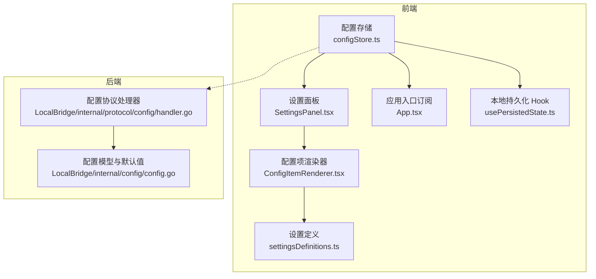
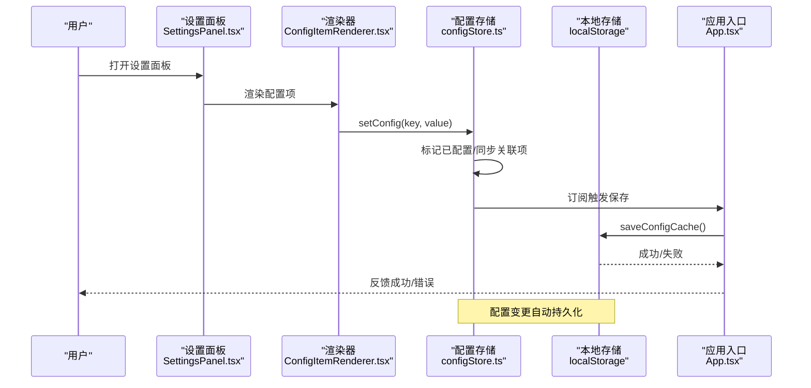
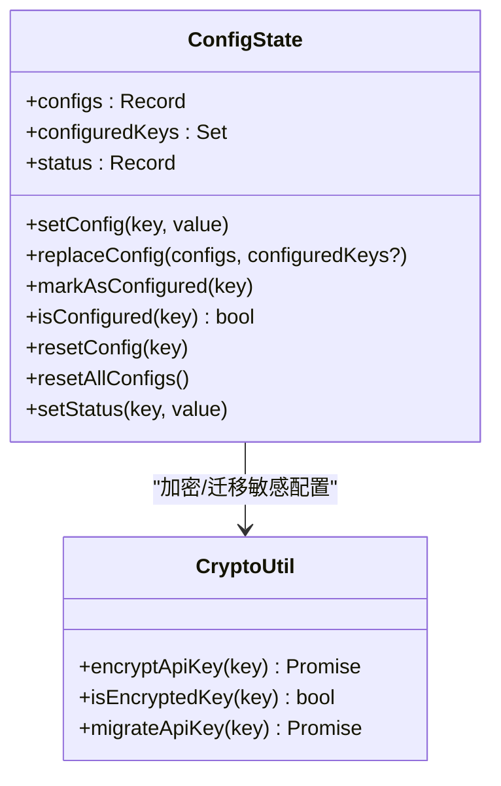
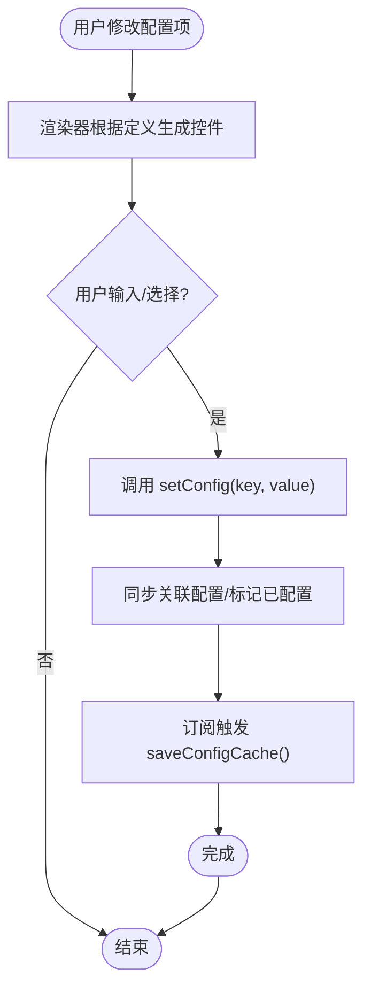
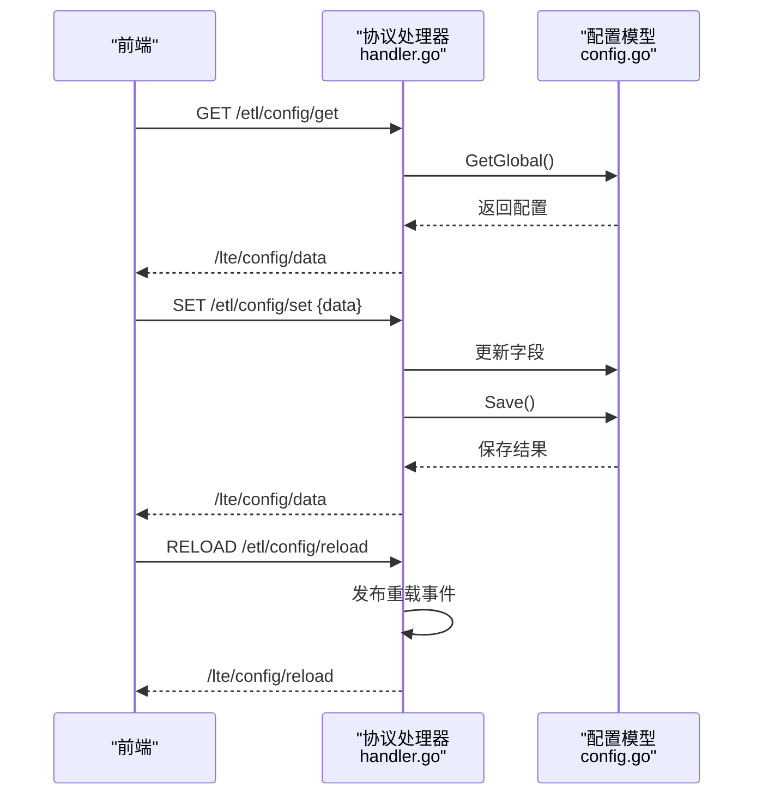
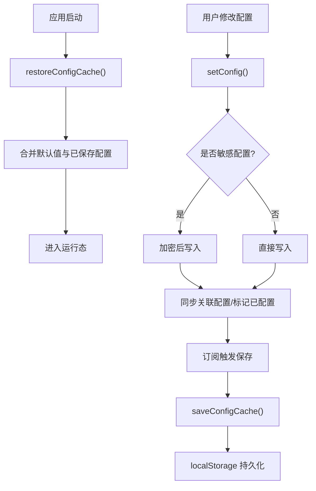
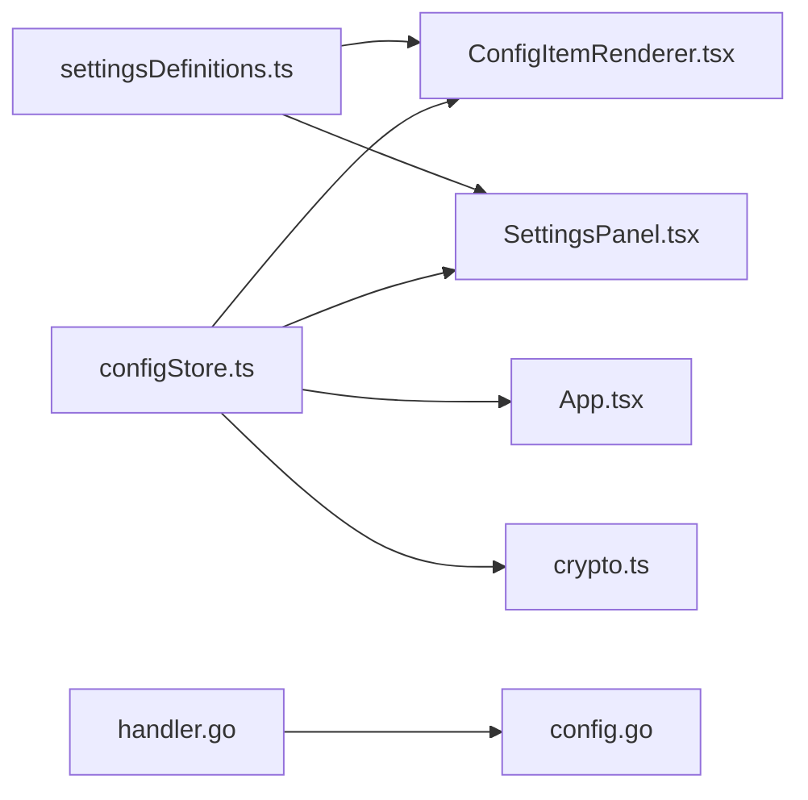

# 配置状态管理

<cite>
**本文档引用的文件**
- [configStore.ts](file://src/stores/configStore.ts)
- [settingsDefinitions.ts](file://src/components/panels/settings/settingsDefinitions.ts)
- [ConfigItemRenderer.tsx](file://src/components/panels/settings/ConfigItemRenderer.tsx)
- [SettingsPanel.tsx](file://src/components/panels/settings/SettingsPanel.tsx)
- [App.tsx](file://src/App.tsx)
- [usePersistedState.ts](file://src/hooks/usePersistedState.ts)
- [config.go](file://LocalBridge/internal/config/config.go)
- [handler.go](file://LocalBridge/internal/protocol/config/handler.go)
- [crypto.ts](file://src/utils/ai/crypto.ts)
</cite>

## 目录
1. [简介](#简介)
2. [项目结构](#项目结构)
3. [核心组件](#核心组件)
4. [架构总览](#架构总览)
5. [详细组件分析](#详细组件分析)
6. [依赖关系分析](#依赖关系分析)
7. [性能考量](#性能考量)
8. [故障排查指南](#故障排查指南)
9. [结论](#结论)
10. [附录](#附录)

## 简介
本文件系统性阐述本项目的配置状态管理设计与实现，涵盖用户配置、应用设置与偏好数据的存储结构、初始化与更新流程、持久化策略、配置分类与管理策略、验证与默认值处理、迁移与版本兼容、以及调试与监控方法。文档面向不同技术背景的读者，既提供高层架构说明，也包含代码级细节与可视化图表。

## 项目结构
配置状态管理涉及前端 Zustand 存储、设置面板渲染、持久化缓存与后端 LocalBridge 配置协议等多个层面。前端负责用户交互与本地持久化，后端负责服务端配置的读取、更新与保存。

**图表来源**
- [configStore.ts:1-440](file://src/stores/configStore.ts#L1-L440)
- [SettingsPanel.tsx:1-175](file://src/components/panels/settings/SettingsPanel.tsx#L1-L175)
- [ConfigItemRenderer.tsx:1-281](file://src/components/panels/settings/ConfigItemRenderer.tsx#L1-L281)
- [settingsDefinitions.ts:1-708](file://src/components/panels/settings/settingsDefinitions.ts#L1-L708)
- [App.tsx:342-395](file://src/App.tsx#L342-L395)
- [usePersistedState.ts:1-36](file://src/hooks/usePersistedState.ts#L1-L36)
- [config.go:1-339](file://LocalBridge/internal/config/config.go#L1-L339)
- [handler.go:1-237](file://LocalBridge/internal/protocol/config/handler.go#L1-L237)

**章节来源**
- [configStore.ts:1-440](file://src/stores/configStore.ts#L1-L440)
- [settingsDefinitions.ts:1-708](file://src/components/panels/settings/settingsDefinitions.ts#L1-L708)
- [SettingsPanel.tsx:1-175](file://src/components/panels/settings/SettingsPanel.tsx#L1-L175)
- [ConfigItemRenderer.tsx:1-281](file://src/components/panels/settings/ConfigItemRenderer.tsx#L1-L281)
- [App.tsx:342-395](file://src/App.tsx#L342-L395)
- [usePersistedState.ts:1-36](file://src/hooks/usePersistedState.ts#L1-L36)
- [config.go:1-339](file://LocalBridge/internal/config/config.go#L1-L339)
- [handler.go:1-237](file://LocalBridge/internal/protocol/config/handler.go#L1-L237)

## 核心组件
- 前端配置存储（Zustand）
  - 提供配置项的类型化定义、默认值、增删改查、已配置追踪、批量替换与重置、UI 状态管理。
  - 支持敏感配置（如 AI Key）的加密存储与迁移。
  - 通过订阅自动持久化到 localStorage，实现跨会话恢复。
- 设置面板与渲染器
  - 通过声明式定义生成配置项，支持多种控件类型与动态提示/占位。
  - 提供搜索、分组、可见性条件、排序等功能。
- 后端配置模型与协议
  - 定义服务端配置结构（服务器、文件、日志、MaaFramework），提供默认值与路径规范化。
  - 提供配置获取、设置、重载的协议处理器，支持保存并广播重载事件。

**章节来源**
- [configStore.ts:178-413](file://src/stores/configStore.ts#L178-L413)
- [settingsDefinitions.ts:16-64](file://src/components/panels/settings/settingsDefinitions.ts#L16-L64)
- [SettingsPanel.tsx:35-95](file://src/components/panels/settings/SettingsPanel.tsx#L35-L95)
- [ConfigItemRenderer.tsx:22-191](file://src/components/panels/settings/ConfigItemRenderer.tsx#L22-L191)
- [config.go:42-48](file://LocalBridge/internal/config/config.go#L42-L48)
- [handler.go:49-171](file://LocalBridge/internal/protocol/config/handler.go#L49-L171)

## 架构总览
配置状态管理采用“前端 ZUSTAND + 本地持久化 + 后端配置协议”的分层设计。前端负责用户交互与本地持久化，后端负责服务端配置的读取、更新与保存。二者通过协议进行数据交换，确保配置的一致性与可追溯性。

**图表来源**
- [SettingsPanel.tsx:35-95](file://src/components/panels/settings/SettingsPanel.tsx#L35-L95)
- [ConfigItemRenderer.tsx:57-191](file://src/components/panels/settings/ConfigItemRenderer.tsx#L57-L191)
- [configStore.ts:270-311](file://src/stores/configStore.ts#L270-L311)
- [App.tsx:366-379](file://src/App.tsx#L366-L379)
- [configStore.ts:417-439](file://src/stores/configStore.ts#L417-L439)

## 详细组件分析

### 前端配置存储（Zustand）
- 设计要点
  - 类型安全：通过 ConfigState 严格约束配置项与状态字段。
  - 默认值与重置：集中定义默认值，支持逐项与全部重置。
  - 已配置追踪：维护 configuredKeys 集合，用于区分用户显式配置与默认值。
  - 敏感信息加密：AI Key 在写入前加密，避免明文存储。
  - 迁移逻辑：从旧字段（如 isExportConfig）迁移到新字段（configHandlingMode），并同步双向一致性。
  - 本地持久化：订阅状态变化，自动保存到 localStorage，启动时恢复。
- 数据结构与复杂度
  - 配置项访问：O(1) 读写。
  - 批量替换：O(n) 遍历合并，n 为传入配置项数量。
  - 已配置集合操作：O(1) 插入/查询。
- 依赖链
  - 依赖设置定义（settingsDefinitions.ts）进行 UI 渲染。
  - 依赖应用入口订阅（App.tsx）进行持久化。
  - 依赖加密工具（crypto.ts）进行敏感信息处理。

**图表来源**
- [configStore.ts:178-413](file://src/stores/configStore.ts#L178-L413)
- [crypto.ts:105-119](file://src/utils/ai/crypto.ts#L105-L119)

**章节来源**
- [configStore.ts:118-177](file://src/stores/configStore.ts#L118-L177)
- [configStore.ts:270-413](file://src/stores/configStore.ts#L270-L413)
- [configStore.ts:415-439](file://src/stores/configStore.ts#L415-L439)
- [crypto.ts:105-119](file://src/utils/ai/crypto.ts#L105-L119)

### 设置面板与渲染器
- 功能特性
  - 按分类（export/node/connection/canvas/component/local-service/ai/management）组织配置项。
  - 支持搜索、分组、可见性条件、动态提示与占位、排序。
  - 渲染多种控件：开关、下拉、数值、输入、密码、滑块、按钮、自定义。
  - 修改状态可视化：已修改项显示小圆点，支持一键恢复默认。
- 交互流程
  - 用户在设置面板修改配置项 → 渲染器调用 setConfig → 存储更新 → 订阅触发持久化。

**图表来源**
- [SettingsPanel.tsx:59-94](file://src/components/panels/settings/SettingsPanel.tsx#L59-L94)
- [ConfigItemRenderer.tsx:57-191](file://src/components/panels/settings/ConfigItemRenderer.tsx#L57-L191)
- [configStore.ts:270-311](file://src/stores/configStore.ts#L270-L311)
- [configStore.ts:417-439](file://src/stores/configStore.ts#L417-L439)

**章节来源**
- [settingsDefinitions.ts:96-691](file://src/components/panels/settings/settingsDefinitions.ts#L96-L691)
- [SettingsPanel.tsx:35-175](file://src/components/panels/settings/SettingsPanel.tsx#L35-L175)
- [ConfigItemRenderer.tsx:22-281](file://src/components/panels/settings/ConfigItemRenderer.tsx#L22-L281)

### 后端配置模型与协议
- 配置模型
  - 定义服务器、文件、日志、MaaFramework 四类配置，提供默认值与路径规范化。
  - 提供保存方法，序列化为 JSON 并写入文件。
- 协议处理器
  - 提供获取、设置、重载三类路由，支持增量更新与错误反馈。
  - 设置成功后保存配置并返回最新配置，必要时发布重载事件。

**图表来源**
- [handler.go:49-171](file://LocalBridge/internal/protocol/config/handler.go#L49-L171)
- [config.go:42-48](file://LocalBridge/internal/config/config.go#L42-L48)
- [config.go:195-212](file://LocalBridge/internal/config/config.go#L195-L212)

**章节来源**
- [config.go:42-123](file://LocalBridge/internal/config/config.go#L42-L123)
- [config.go:195-212](file://LocalBridge/internal/config/config.go#L195-L212)
- [handler.go:49-204](file://LocalBridge/internal/protocol/config/handler.go#L49-L204)

### 配置分类与管理策略
- 分类体系
  - 导出（export）：导出行为与格式控制。
  - 节点（node）：节点外观与交互行为。
  - 连接（connection）：连线样式与交互。
  - 画布（canvas）：画布背景与聚焦行为。
  - 组件（component）：面板模式、实时画面、历史记录等。
  - 本地服务（local-service）：端口、自动连接、文件监听、跨文件搜索等。
  - AI（ai）：API 类型、URL、Key、模型、温度、代理等。
  - 管理（management）：导出/导入配置、重置默认值等。
- 管理策略
  - 通过 configCategoryMap 将具体配置项归类，支持按类别筛选与导出。
  - 通过 settingsDefinitions 统一声明配置项的 UI 行为、可见性与提示信息。
  - 通过 replaceConfig 支持批量导入与迁移，自动同步关联字段。

**章节来源**
- [configStore.ts:19-82](file://src/stores/configStore.ts#L19-L82)
- [configStore.ts:84-97](file://src/stores/configStore.ts#L84-L97)
- [settingsDefinitions.ts:96-708](file://src/components/panels/settings/settingsDefinitions.ts#L96-L708)

### 初始化、更新与持久化流程
- 初始化
  - 应用启动时，从 localStorage 恢复配置缓存（restoreConfigCache），并合并到当前状态。
  - 若存在已配置键集合，将其还原为 Set 结构，保证后续判断正确。
- 更新
  - 用户在设置面板修改配置项，渲染器调用 setConfig，存储内部更新并标记已配置。
  - 对于敏感配置（如 AI Key），先进行加密再写入。
  - 对于关联配置（如导出方案与开关），自动同步双向一致。
- 持久化
  - 订阅状态变化，一旦 configs 或 configuredKeys 发生变化，立即保存到 localStorage。
  - 保存内容包含配置值与已配置键集合，确保下次启动能准确恢复。

**图表来源**
- [App.tsx:366-379](file://src/App.tsx#L366-L379)
- [configStore.ts:417-439](file://src/stores/configStore.ts#L417-L439)
- [configStore.ts:270-311](file://src/stores/configStore.ts#L270-L311)
- [configStore.ts:312-366](file://src/stores/configStore.ts#L312-L366)

**章节来源**
- [App.tsx:366-379](file://src/App.tsx#L366-L379)
- [configStore.ts:417-439](file://src/stores/configStore.ts#L417-L439)
- [configStore.ts:270-366](file://src/stores/configStore.ts#L270-L366)

### 验证与默认值处理
- 默认值
  - 集中定义在 configDefaults，作为重置与对比基准。
  - 渲染器通过比较当前值与默认值，判断是否已修改并显示恢复默认按钮。
- 验证
  - 设置面板提供动态提示与占位，帮助用户理解配置含义与取值范围。
  - 对于路径类配置（如根目录、日志目录），后端提供路径规范化与安全检查（LocalBridge 配置模块）。

**章节来源**
- [configStore.ts:175-177](file://src/stores/configStore.ts#L175-L177)
- [ConfigItemRenderer.tsx:44-55](file://src/components/panels/settings/ConfigItemRenderer.tsx#L44-L55)
- [settingsDefinitions.ts:46-49](file://src/components/panels/settings/settingsDefinitions.ts#L46-L49)
- [config.go:126-153](file://LocalBridge/internal/config/config.go#L126-L153)

### 迁移与版本兼容
- 字段迁移
  - 从 isExportConfig 迁移到 configHandlingMode，自动同步双向一致。
  - 导入配置时，批量标记已配置键，避免误判为默认值。
- 敏感信息迁移
  - 将明文 AI Key 迁移为加密格式，确保后续安全存储。
- 版本兼容
  - 通过 replaceConfig 合并现有配置，避免因字段缺失导致异常。
  - 保留默认值作为兜底，确保新增字段不影响老版本配置。

**章节来源**
- [configStore.ts:326-366](file://src/stores/configStore.ts#L326-L366)
- [crypto.ts:105-119](file://src/utils/ai/crypto.ts#L105-L119)

### 调试与监控方法
- 前端调试
  - 订阅状态变化，捕获保存失败并打印错误日志。
  - 通过设置面板的搜索与分组，快速定位问题配置项。
  - 使用“恢复默认”功能快速回滚可疑配置。
- 后端调试
  - 通过协议处理器的日志输出，跟踪配置获取、设置与重载过程。
  - 使用安全检查函数（如根目录安全检查）评估潜在风险。
- 监控建议
  - 建立配置变更审计：记录关键配置的变更时间、用户、值差异。
  - 性能监控：关注批量替换与加密操作的耗时，必要时异步化处理。

**章节来源**
- [App.tsx:374-376](file://src/App.tsx#L374-L376)
- [handler.go:28-47](file://LocalBridge/internal/protocol/config/handler.go#L28-L47)
- [config.go:234-296](file://LocalBridge/internal/config/config.go#L234-L296)

## 依赖关系分析
- 前端依赖
  - configStore.ts 依赖 settingsDefinitions.ts（声明式定义）、App.tsx（订阅持久化）、crypto.ts（敏感信息处理）。
  - SettingsPanel.tsx 与 ConfigItemRenderer.tsx 依赖 settingsDefinitions.ts 与 configStore.ts。
- 后端依赖
  - handler.go 依赖 config.go（配置模型与默认值）。
- 耦合与内聚
  - 前端配置存储与设置定义解耦，便于扩展新的配置项。
  - 后端配置模型与协议处理器职责清晰，便于维护与测试。

**图表来源**
- [settingsDefinitions.ts:1-708](file://src/components/panels/settings/settingsDefinitions.ts#L1-L708)
- [ConfigItemRenderer.tsx:1-281](file://src/components/panels/settings/ConfigItemRenderer.tsx#L1-L281)
- [SettingsPanel.tsx:1-175](file://src/components/panels/settings/SettingsPanel.tsx#L1-L175)
- [configStore.ts:1-440](file://src/stores/configStore.ts#L1-L440)
- [App.tsx:342-395](file://src/App.tsx#L342-L395)
- [crypto.ts:105-119](file://src/utils/ai/crypto.ts#L105-L119)
- [handler.go:1-237](file://LocalBridge/internal/protocol/config/handler.go#L1-L237)
- [config.go:1-339](file://LocalBridge/internal/config/config.go#L1-L339)

**章节来源**
- [configStore.ts:1-440](file://src/stores/configStore.ts#L1-L440)
- [settingsDefinitions.ts:1-708](file://src/components/panels/settings/settingsDefinitions.ts#L1-L708)
- [SettingsPanel.tsx:1-175](file://src/components/panels/settings/SettingsPanel.tsx#L1-L175)
- [ConfigItemRenderer.tsx:1-281](file://src/components/panels/settings/ConfigItemRenderer.tsx#L1-L281)
- [App.tsx:342-395](file://src/App.tsx#L342-L395)
- [crypto.ts:105-119](file://src/utils/ai/crypto.ts#L105-L119)
- [handler.go:1-237](file://LocalBridge/internal/protocol/config/handler.go#L1-L237)
- [config.go:1-339](file://LocalBridge/internal/config/config.go#L1-L339)

## 性能考量
- 写入优化
  - 前端：通过订阅与本地持久化，避免频繁 I/O；仅在配置或已配置键发生变化时保存。
  - 后端：保存配置时进行序列化与文件写入，建议在高并发场景下增加锁或队列。
- 加密成本
  - AI Key 加密为异步操作，避免阻塞 UI；可在后台任务中处理批量迁移。
- 渲染优化
  - 设置面板支持搜索与分组，减少一次性渲染的节点数量。
  - 使用 useMemo 缓存动态占位与提示内容，降低重复计算。

## 故障排查指南
- 配置未保存
  - 检查订阅是否正常触发（App.tsx 中的 subscribe）。
  - 查看 saveConfigCache() 是否抛出异常（控制台错误日志）。
- 配置恢复异常
  - 确认 localStorage 中的键值结构是否正确（包含 __configuredKeys）。
  - 检查 replaceConfig 的合并逻辑是否覆盖了必要的字段。
- 敏感信息问题
  - 确认 AI Key 是否为加密格式（以特定前缀开头）。
  - 如需迁移，使用迁移函数将明文 Key 转为加密格式。
- 后端配置无效
  - 检查协议处理器的路由与数据结构是否匹配。
  - 确认配置保存后是否返回最新配置并发布重载事件。

**章节来源**
- [App.tsx:374-376](file://src/App.tsx#L374-L376)
- [configStore.ts:417-439](file://src/stores/configStore.ts#L417-L439)
- [configStore.ts:351-362](file://src/stores/configStore.ts#L351-L362)
- [handler.go:152-171](file://LocalBridge/internal/protocol/config/handler.go#L152-L171)

## 结论
本项目的配置状态管理通过前端 Zustand 存储、声明式设置定义、本地持久化与后端配置协议形成完整的闭环。其设计兼顾易用性与安全性，支持配置分类、迁移与版本兼容，并提供了完善的调试与监控手段。未来可在以下方面持续优化：增强配置变更审计、引入配置校验规则、优化加密与批量处理性能。

## 附录
- 常用术语
  - 配置项：用户可调整的参数单元。
  - 已配置：用户显式设置过的配置项。
  - 敏感配置：涉及隐私或安全的配置（如 API Key）。
  - 迁移：从旧字段或格式向新字段或格式的转换。
- 相关文件索引
  - 前端配置存储：[configStore.ts](file://src/stores/configStore.ts)
  - 设置定义：[settingsDefinitions.ts](file://src/components/panels/settings/settingsDefinitions.ts)
  - 设置面板：[SettingsPanel.tsx](file://src/components/panels/settings/SettingsPanel.tsx)
  - 配置项渲染器：[ConfigItemRenderer.tsx](file://src/components/panels/settings/ConfigItemRenderer.tsx)
  - 应用入口订阅：[App.tsx](file://src/App.tsx)
  - 本地持久化 Hook：[usePersistedState.ts](file://src/hooks/usePersistedState.ts)
  - 后端配置模型：[config.go](file://LocalBridge/internal/config/config.go)
  - 后端配置协议：[handler.go](file://LocalBridge/internal/protocol/config/handler.go)
  - 敏感信息处理：[crypto.ts](file://src/utils/ai/crypto.ts)