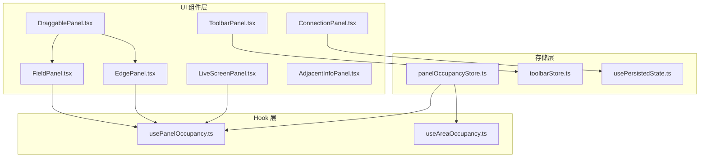
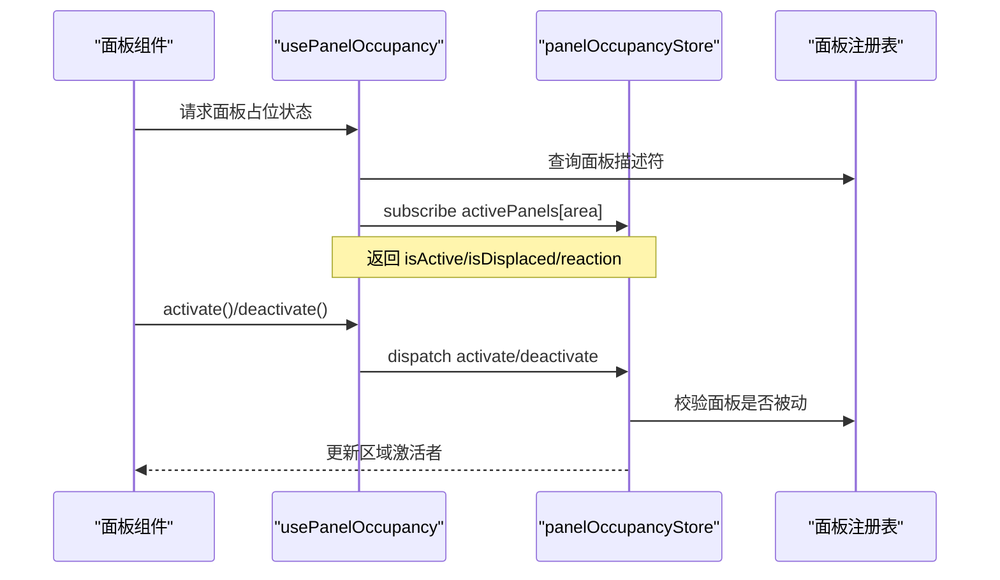
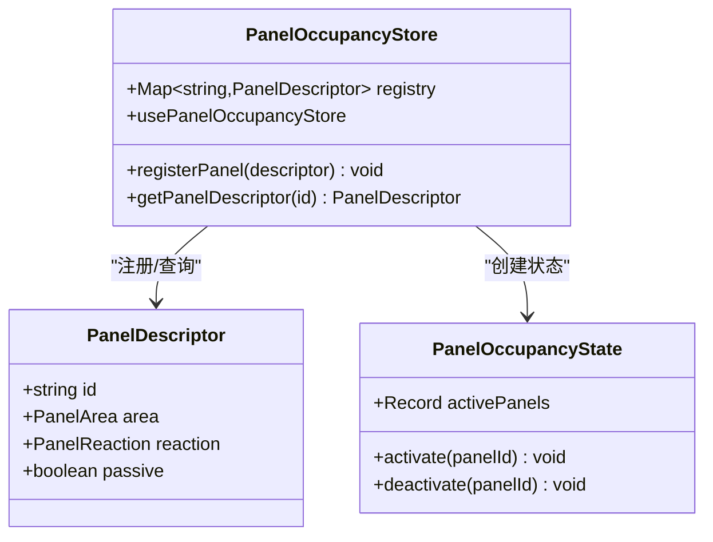
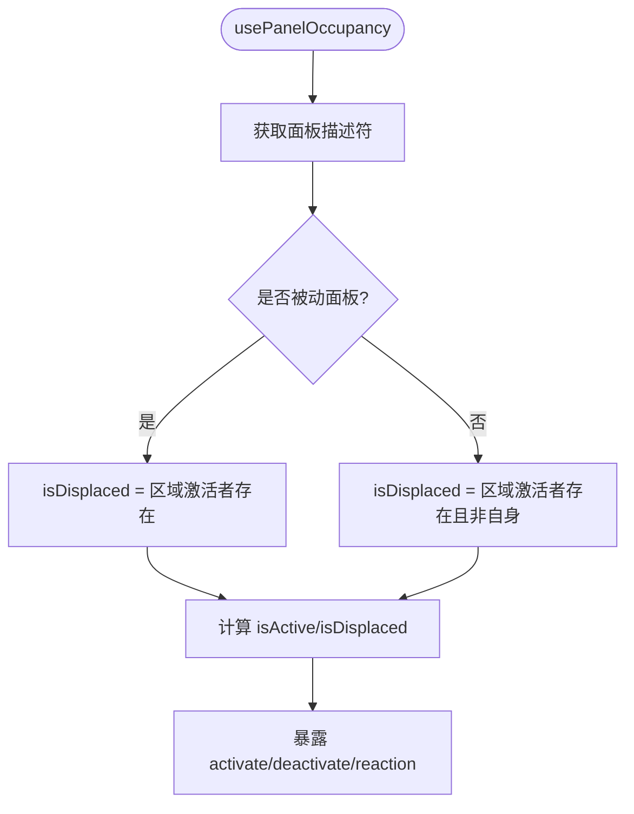
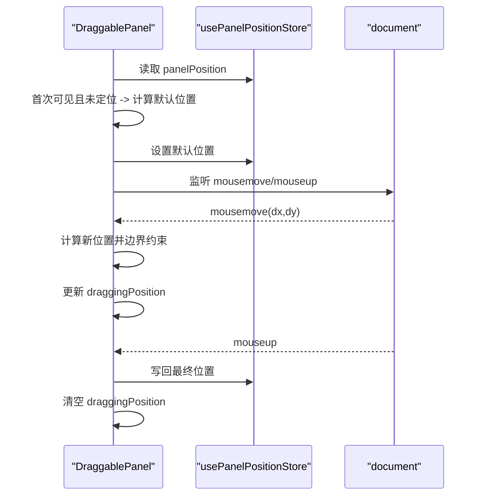
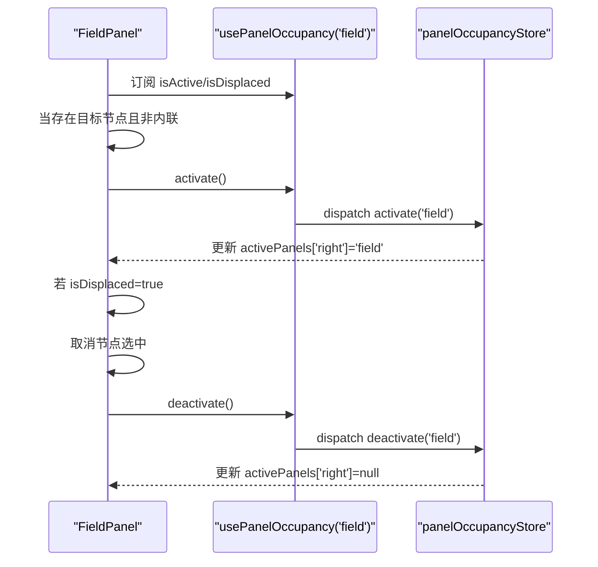
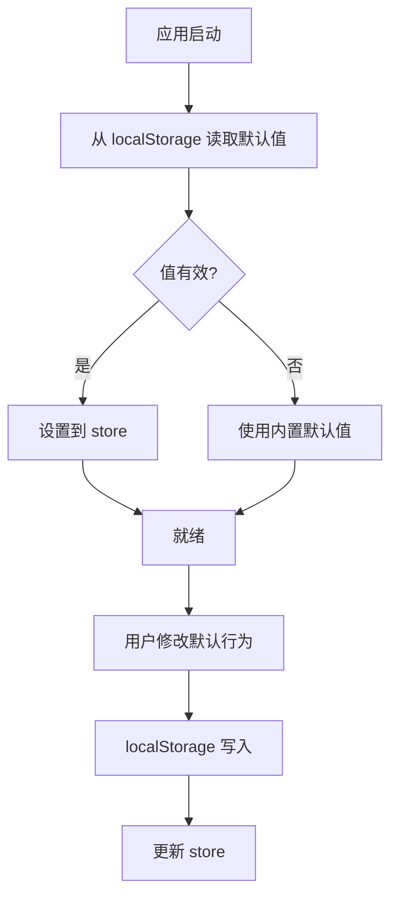
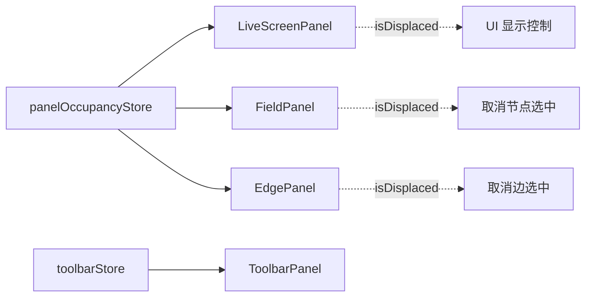
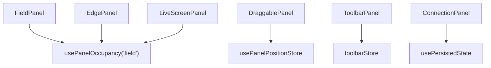

# 面板状态管理

<cite>
**本文档引用的文件**
- [panelOccupancyStore.ts](file://src/stores/panelOccupancyStore.ts)
- [usePanelOccupancy.ts](file://src/hooks/usePanelOccupancy.ts)
- [useAreaOccupancy.ts](file://src/hooks/useAreaOccupancy.ts)
- [DraggablePanel.tsx](file://src/components/panels/common/DraggablePanel.tsx)
- [FieldPanel.tsx](file://src/components/panels/main/FieldPanel.tsx)
- [EdgePanel.tsx](file://src/components/panels/main/EdgePanel.tsx)
- [LiveScreenPanel.tsx](file://src/components/panels/main/LiveScreenPanel.tsx)
- [AdjacentInfoPanel.tsx](file://src/components/panels/main/AdjacentInfoPanel.tsx)
- [toolbarStore.ts](file://src/stores/toolbarStore.ts)
- [ToolbarPanel.tsx](file://src/components/panels/main/ToolbarPanel.tsx)
- [usePersistedState.ts](file://src/hooks/usePersistedState.ts)
- [ConnectionPanel.tsx](file://src/components/panels/main/ConnectionPanel.tsx)
</cite>

## 目录
1. [简介](#简介)
2. [项目结构](#项目结构)
3. [核心组件](#核心组件)
4. [架构总览](#架构总览)
5. [详细组件分析](#详细组件分析)
6. [依赖关系分析](#依赖关系分析)
7. [性能考虑](#性能考虑)
8. [故障排除指南](#故障排除指南)
9. [结论](#结论)

## 简介
本文件系统性阐述工作流编辑器中“面板状态管理”的设计与实现，重点覆盖以下方面：
- 面板占用状态与互斥机制：如何在同一区域内实现“同一时刻仅一个面板激活”的约束，并区分主动面板与被动面板。
- 工具栏状态管理：默认导入/导出行为的持久化与恢复。
- 面板可见性、位置、大小等状态的数据结构与更新逻辑：拖拽面板的位置存储与边界约束。
- 面板布局计算与存储策略：面板模式（内联/可拖拽）与布局计算。
- 面板状态与其他功能模块的协调与冲突解决：如实时画面面板与占位系统的协作。

## 项目结构
围绕面板状态管理的关键目录与文件如下：
- 存储层（Zustand）：panelOccupancyStore.ts（面板占位互斥）、toolbarStore.ts（工具栏状态）、多个面板组件（FieldPanel、EdgePanel、LiveScreenPanel）。
- Hook 层：usePanelOccupancy.ts（面板占位交互）、useAreaOccupancy.ts（区域占位观察）。
- UI 组件层：DraggablePanel.tsx（可拖拽面板封装）、各主面板组件（FieldPanel、EdgePanel、LiveScreenPanel、AdjacentInfoPanel）。
- 持久化：usePersistedState.ts（通用 localStorage 持久化 Hook）、ConnectionPanel.tsx 中的具体使用示例。

**图表来源**
- [panelOccupancyStore.ts:1-136](file://src/stores/panelOccupancyStore.ts#L1-L136)
- [toolbarStore.ts:1-95](file://src/stores/toolbarStore.ts#L1-L95)
- [usePanelOccupancy.ts:1-60](file://src/hooks/usePanelOccupancy.ts#L1-L60)
- [useAreaOccupancy.ts:1-29](file://src/hooks/useAreaOccupancy.ts#L1-L29)
- [DraggablePanel.tsx:1-178](file://src/components/panels/common/DraggablePanel.tsx#L1-L178)
- [FieldPanel.tsx:1-491](file://src/components/panels/main/FieldPanel.tsx#L1-L491)
- [EdgePanel.tsx:1-299](file://src/components/panels/main/EdgePanel.tsx#L1-L299)
- [LiveScreenPanel.tsx:1-156](file://src/components/panels/main/LiveScreenPanel.tsx#L1-L156)
- [AdjacentInfoPanel.tsx:1-344](file://src/components/panels/main/AdjacentInfoPanel.tsx#L1-L344)
- [ToolbarPanel.tsx:1-22](file://src/components/panels/main/ToolbarPanel.tsx#L1-L22)
- [ConnectionPanel.tsx:1-954](file://src/components/panels/main/ConnectionPanel.tsx#L1-L954)

**章节来源**
- [panelOccupancyStore.ts:1-136](file://src/stores/panelOccupancyStore.ts#L1-L136)
- [toolbarStore.ts:1-95](file://src/stores/toolbarStore.ts#L1-L95)
- [usePanelOccupancy.ts:1-60](file://src/hooks/usePanelOccupancy.ts#L1-L60)
- [useAreaOccupancy.ts:1-29](file://src/hooks/useAreaOccupancy.ts#L1-L29)
- [DraggablePanel.tsx:1-178](file://src/components/panels/common/DraggablePanel.tsx#L1-L178)
- [FieldPanel.tsx:1-491](file://src/components/panels/main/FieldPanel.tsx#L1-L491)
- [EdgePanel.tsx:1-299](file://src/components/panels/main/EdgePanel.tsx#L1-L299)
- [LiveScreenPanel.tsx:1-156](file://src/components/panels/main/LiveScreenPanel.tsx#L1-L156)
- [AdjacentInfoPanel.tsx:1-344](file://src/components/panels/main/AdjacentInfoPanel.tsx#L1-L344)
- [ToolbarPanel.tsx:1-22](file://src/components/panels/main/ToolbarPanel.tsx#L1-L22)
- [ConnectionPanel.tsx:1-954](file://src/components/panels/main/ConnectionPanel.tsx#L1-L954)

## 核心组件
- 面板占位互斥系统（Zustand Store）
  - 管理区域（右侧/左侧/底部）内的激活面板映射，提供 activate/deactivate 动作。
  - 面板注册表：声明式注册面板及其所属区域、反应形态（关闭/隐藏/偏移）与是否被动。
  - 主动面板：可抢占区域；被动面板：仅观察，不参与抢占。
- 面板占位 Hook
  - usePanelOccupancy：返回 isActive、isDisplaced、activate、deactivate、reaction 等。
  - useAreaOccupancy：返回某区域的激活面板 ID 与是否被占用。
- 可拖拽面板封装
  - DraggablePanel：统一处理拖拽起始、移动、释放与边界约束，位置状态存于独立 store。
- 工具栏状态管理
  - toolbarStore：默认导入/导出行为的持久化与恢复，支持类型安全的枚举校验。
- 持久化 Hook
  - usePersistedState：通用 localStorage 持久化，自动恢复与保存。

**章节来源**
- [panelOccupancyStore.ts:1-136](file://src/stores/panelOccupancyStore.ts#L1-L136)
- [usePanelOccupancy.ts:1-60](file://src/hooks/usePanelOccupancy.ts#L1-L60)
- [useAreaOccupancy.ts:1-29](file://src/hooks/useAreaOccupancy.ts#L1-L29)
- [DraggablePanel.tsx:1-178](file://src/components/panels/common/DraggablePanel.tsx#L1-L178)
- [toolbarStore.ts:1-95](file://src/stores/toolbarStore.ts#L1-L95)
- [usePersistedState.ts:1-37](file://src/hooks/usePersistedState.ts#L1-L37)

## 架构总览
面板状态管理采用“声明式注册 + 命令式动作”的模式：
- 声明式：在初始化阶段注册面板描述符（区域、反应形态、是否被动）。
- 命令式：面板组件通过 Hook 与 Store 交互，执行 activate/deactivate。
- 被动面板通过 isDisplaced 观察状态变化，执行相应 UI 行为（隐藏/偏移/关闭）。

**图表来源**
- [panelOccupancyStore.ts:87-135](file://src/stores/panelOccupancyStore.ts#L87-L135)
- [usePanelOccupancy.ts:16-60](file://src/hooks/usePanelOccupancy.ts#L16-L60)

## 详细组件分析

### 面板占位互斥系统
- 数据结构
  - activePanels：记录每个区域当前激活的面板 ID。
  - 注册表：Map<string, PanelDescriptor>，键为面板 ID。
- 行为规则
  - activate：仅允许主动面板抢占；成功后更新对应区域的激活者。
  - deactivate：仅当当前面板是区域激活者时才释放。
- 面板类型
  - 主动面板：抢占区域（如字段面板、连接面板、节点列表）。
  - 被动面板：不抢占，仅观察（如实时画面、识别预览、探索悬浮按钮）。

**图表来源**
- [panelOccupancyStore.ts:10-135](file://src/stores/panelOccupancyStore.ts#L10-L135)

**章节来源**
- [panelOccupancyStore.ts:1-136](file://src/stores/panelOccupancyStore.ts#L1-L136)

### 面板占位 Hook
- usePanelOccupancy
  - 提供 isActive、isDisplaced、activate、deactivate、reaction。
  - 被动面板：isDisplaced 条件为“区域存在激活者”。
  - 主动面板：isDisplaced 条件为“区域激活者存在且非自身”。
- useAreaOccupancy
  - 返回某区域的 activePanelId 与 isOccupied。

**图表来源**
- [usePanelOccupancy.ts:16-60](file://src/hooks/usePanelOccupancy.ts#L16-L60)

**章节来源**
- [usePanelOccupancy.ts:1-60](file://src/hooks/usePanelOccupancy.ts#L1-L60)
- [useAreaOccupancy.ts:1-29](file://src/hooks/useAreaOccupancy.ts#L1-L29)

### 可拖拽面板封装（DraggablePanel）
- 位置状态
  - usePanelPositionStore：保存面板当前位置（x,y），初始为空。
- 拖拽逻辑
  - 仅在标题栏区域可拖拽；阻止与图标交互元素冲突。
  - 拖拽中更新本地 draggingPosition，拖拽结束写回 store 并清空临时状态。
- 边界约束
  - 限制在窗口可视区域内，防止面板移出屏幕。
- 默认位置
  - 首次可见且未定位时，基于窗口尺寸与默认偏移计算初始位置。

**图表来源**
- [DraggablePanel.tsx:13-178](file://src/components/panels/common/DraggablePanel.tsx#L13-L178)

**章节来源**
- [DraggablePanel.tsx:1-178](file://src/components/panels/common/DraggablePanel.tsx#L1-L178)

### 主面板与占位系统的协同
- 字段面板（FieldPanel）
  - 当存在目标节点且面板模式非内联时，激活占位；否则释放。
  - 若被排挤（isDisplaced 为真），自动取消节点选中，避免状态混乱。
- 连接面板（EdgePanel）
  - 当存在唯一选中边且无节点选中时激活；同样处理 isDisplaced 的取消选中逻辑。
- 实时画面面板（LiveScreenPanel）
  - 通过 isDisplaced 控制是否显示；若被排挤则不渲染，避免资源浪费与 UI 冲突。

**图表来源**
- [FieldPanel.tsx:109-144](file://src/components/panels/main/FieldPanel.tsx#L109-L144)
- [panelOccupancyStore.ts:98-135](file://src/stores/panelOccupancyStore.ts#L98-L135)

**章节来源**
- [FieldPanel.tsx:1-491](file://src/components/panels/main/FieldPanel.tsx#L1-L491)
- [EdgePanel.tsx:1-299](file://src/components/panels/main/EdgePanel.tsx#L1-L299)
- [LiveScreenPanel.tsx:1-156](file://src/components/panels/main/LiveScreenPanel.tsx#L1-L156)

### 工具栏状态管理
- 默认导入/导出行为
  - 通过 toolbarStore 管理 defaultImportAction/defaultExportAction。
  - 从 localStorage 恢复默认值，提供类型校验函数保证安全性。
  - 支持设置新默认值并持久化。
- 与 UI 的结合
  - ToolbarPanel 集成导入、导出、JSON 预览按钮，工具栏状态影响默认行为。

**图表来源**
- [toolbarStore.ts:27-94](file://src/stores/toolbarStore.ts#L27-L94)
- [ToolbarPanel.tsx:1-22](file://src/components/panels/main/ToolbarPanel.tsx#L1-L22)

**章节来源**
- [toolbarStore.ts:1-95](file://src/stores/toolbarStore.ts#L1-L95)
- [ToolbarPanel.tsx:1-22](file://src/components/panels/main/ToolbarPanel.tsx#L1-L22)

### 面板布局计算与存储策略
- 面板模式
  - 内联（inline）：不单独占据区域，直接渲染在画布侧边。
  - 可拖拽（draggable）：独立浮动面板，支持拖拽与位置持久化。
- 布局计算
  - 可拖拽面板：首次可见时根据窗口尺寸与默认偏移计算初始位置；拖拽过程边界约束；拖拽结束写回 store。
  - 内联面板：通过 CSS 类名控制显隐，不参与区域占位。
- 存储策略
  - 位置：usePanelPositionStore（Zustand）+ DraggablePanel 内部逻辑。
  - 其他配置：ConnectionPanel 使用 usePersistedState 对设备参数进行持久化。

**章节来源**
- [FieldPanel.tsx:451-487](file://src/components/panels/main/FieldPanel.tsx#L451-L487)
- [EdgePanel.tsx:277-295](file://src/components/panels/main/EdgePanel.tsx#L277-L295)
- [DraggablePanel.tsx:62-81](file://src/components/panels/common/DraggablePanel.tsx#L62-L81)
- [ConnectionPanel.tsx:80-148](file://src/components/panels/main/ConnectionPanel.tsx#L80-L148)
- [usePersistedState.ts:1-37](file://src/hooks/usePersistedState.ts#L1-L37)

### 面板状态的持久化与恢复
- 通用持久化 Hook
  - usePersistedState：自动恢复与保存，带前缀隔离键空间。
- 具体应用
  - ConnectionPanel：对 ADB 路径、设备地址、PlayCover 参数、Gamepad 类型、macOS 方法等进行持久化。
  - toolbarStore：默认导入/导出行为持久化。
- 注意事项
  - 解析失败时静默忽略，避免破坏整体状态。
  - 键空间前缀避免与其他模块冲突。

**章节来源**
- [usePersistedState.ts:1-37](file://src/hooks/usePersistedState.ts#L1-L37)
- [ConnectionPanel.tsx:80-148](file://src/components/panels/main/ConnectionPanel.tsx#L80-L148)
- [toolbarStore.ts:38-94](file://src/stores/toolbarStore.ts#L38-L94)

### 面板状态与其他功能模块的协调与冲突解决
- 实时画面与占位系统
  - LiveScreenPanel 通过 isDisplaced 控制显示：若被排挤（如字段面板激活），则不渲染，避免资源竞争与 UI 占位冲突。
- 节点/边面板与占位系统
  - 当面板被排挤时，自动取消节点或边的选中状态，避免状态不一致。
- 工具栏默认行为
  - 通过 toolbarStore 的默认值影响导入/导出按钮的行为，避免每次都需要手动选择。

**图表来源**
- [LiveScreenPanel.tsx:19-48](file://src/components/panels/main/LiveScreenPanel.tsx#L19-L48)
- [FieldPanel.tsx:131-143](file://src/components/panels/main/FieldPanel.tsx#L131-L143)
- [EdgePanel.tsx:158-171](file://src/components/panels/main/EdgePanel.tsx#L158-L171)
- [toolbarStore.ts:81-94](file://src/stores/toolbarStore.ts#L81-L94)

**章节来源**
- [LiveScreenPanel.tsx:1-156](file://src/components/panels/main/LiveScreenPanel.tsx#L1-L156)
- [FieldPanel.tsx:120-144](file://src/components/panels/main/FieldPanel.tsx#L120-L144)
- [EdgePanel.tsx:148-172](file://src/components/panels/main/EdgePanel.tsx#L148-L172)
- [toolbarStore.ts:1-95](file://src/stores/toolbarStore.ts#L1-L95)

## 依赖关系分析
- 组件耦合
  - 面板组件依赖 usePanelOccupancy Hook，间接依赖 panelOccupancyStore。
  - DraggablePanel 独立于面板业务逻辑，仅依赖位置存储。
  - 工具栏组件依赖 toolbarStore。
- 外部依赖
  - localStorage：用于持久化配置与默认行为。
  - 浏览器事件：mousemove/mouseup 用于拖拽。

**图表来源**
- [FieldPanel.tsx:109-110](file://src/components/panels/main/FieldPanel.tsx#L109-L110)
- [EdgePanel.tsx:137-138](file://src/components/panels/main/EdgePanel.tsx#L137-L138)
- [LiveScreenPanel.tsx](file://src/components/panels/main/LiveScreenPanel.tsx#L19)
- [DraggablePanel.tsx:19-22](file://src/components/panels/common/DraggablePanel.tsx#L19-L22)
- [ToolbarPanel.tsx:1-22](file://src/components/panels/main/ToolbarPanel.tsx#L1-L22)
- [ConnectionPanel.tsx:80-148](file://src/components/panels/main/ConnectionPanel.tsx#L80-L148)

**章节来源**
- [panelOccupancyStore.ts:1-136](file://src/stores/panelOccupancyStore.ts#L1-L136)
- [DraggablePanel.tsx:1-178](file://src/components/panels/common/DraggablePanel.tsx#L1-L178)
- [toolbarStore.ts:1-95](file://src/stores/toolbarStore.ts#L1-L95)
- [usePersistedState.ts:1-37](file://src/hooks/usePersistedState.ts#L1-L37)

## 性能考虑
- 状态粒度
  - panelOccupancyStore 仅维护区域激活者映射，状态树小，订阅成本低。
- 计算优化
  - usePanelOccupancy 使用 useMemo 缓存返回值，减少不必要的重渲染。
- DOM 事件
  - DraggablePanel 仅在标题栏区域响应拖拽，避免与内部交互元素冲突。
- 资源控制
  - LiveScreenPanel 在页面不可见或被排挤时停止截图请求，降低资源消耗。

[本节为通用指导，无需特定文件分析]

## 故障排除指南
- 面板未正确显示
  - 检查面板是否注册为被动面板：被动面板不会抢占区域，需确认区域激活者是否为预期面板。
  - 检查 isDisplaced：若为真，面板可能被自动隐藏或偏移。
- 拖拽位置异常
  - 确认 DraggablePanel 的默认偏移与窗口尺寸计算是否符合预期。
  - 检查边界约束逻辑是否导致位置被强制修正。
- 工具栏默认行为未生效
  - 检查 localStorage 中的键是否存在且格式正确。
  - 确认 isValidImportAction/isValidExportAction 的校验逻辑是否拒绝了非法值。
- 实时画面不显示
  - 检查 isDisplaced 与 enableLiveScreen 配置组合。
  - 检查连接状态与控制器 ID 是否有效。

**章节来源**
- [panelOccupancyStore.ts:105-135](file://src/stores/panelOccupancyStore.ts#L105-L135)
- [DraggablePanel.tsx:113-128](file://src/components/panels/common/DraggablePanel.tsx#L113-L128)
- [toolbarStore.ts:56-79](file://src/stores/toolbarStore.ts#L56-L79)
- [LiveScreenPanel.tsx:44-48](file://src/components/panels/main/LiveScreenPanel.tsx#L44-L48)

## 结论
本系统通过“声明式注册 + 命令式动作”的方式实现了简洁而强大的面板占位互斥机制，配合 Hook 与 Zusta nd 存储，使面板可见性、位置与工具栏行为得以高效管理。被动面板与主动面板的区分有效避免了 UI 冲突，而持久化策略确保用户体验的一致性。未来可在以下方面进一步完善：
- 面板注册的动态化支持（运行时增删）。
- 更丰富的面板反应形态（如“合并/堆叠”）。
- 面板布局的序列化与主题化方案。