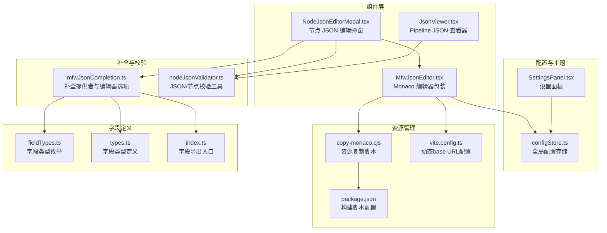
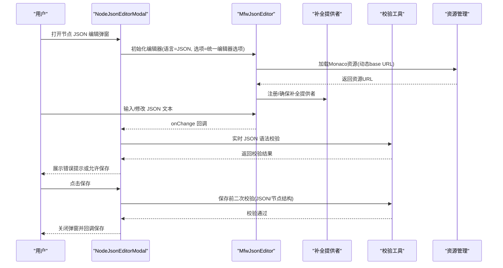
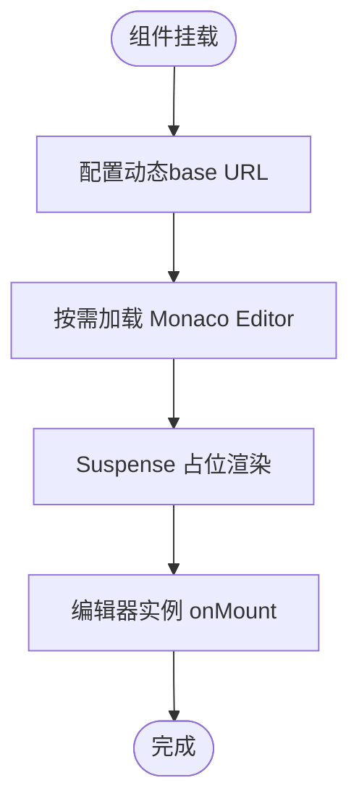
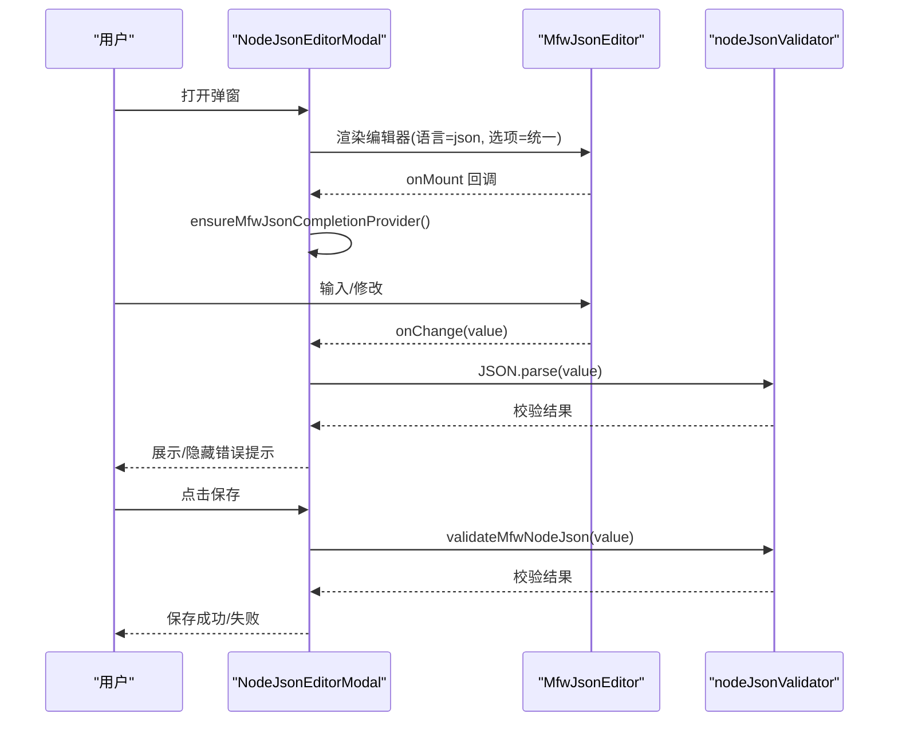
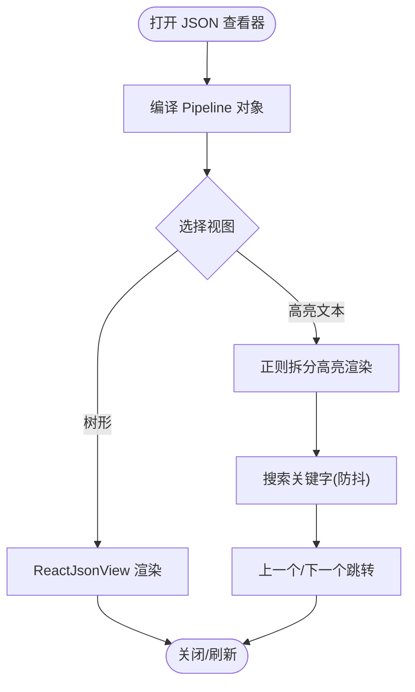
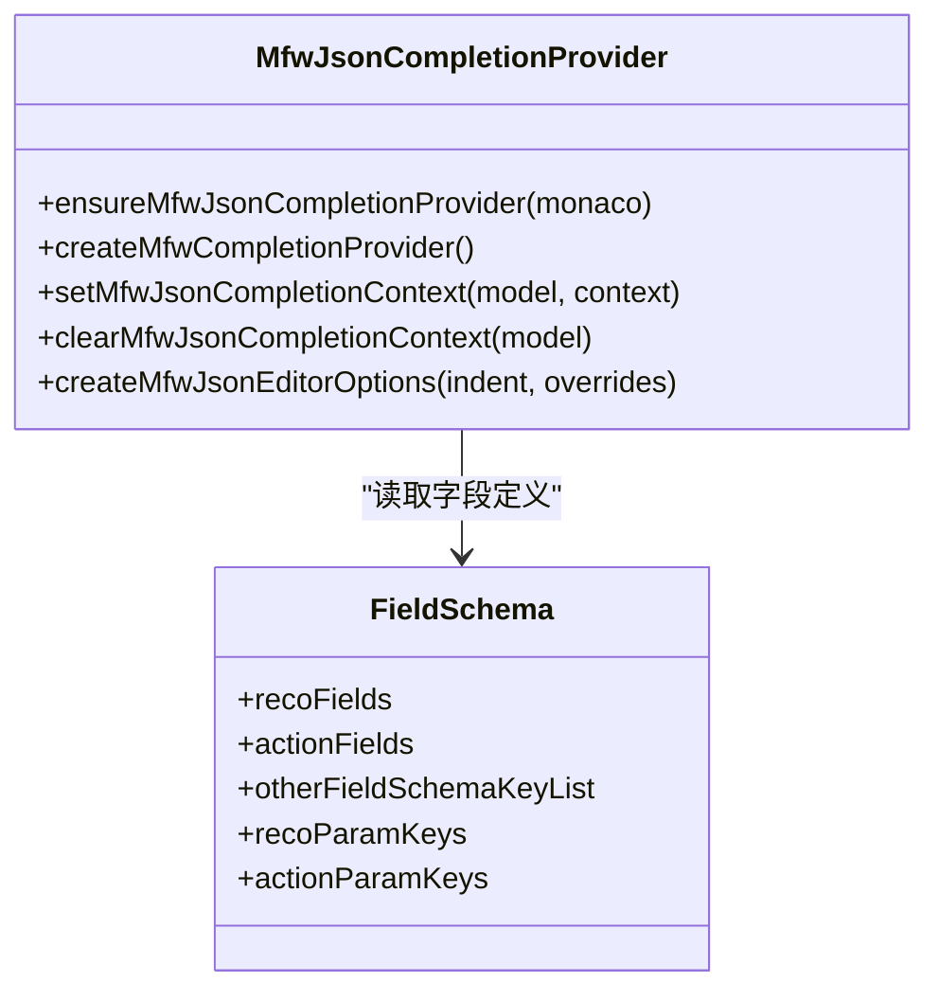
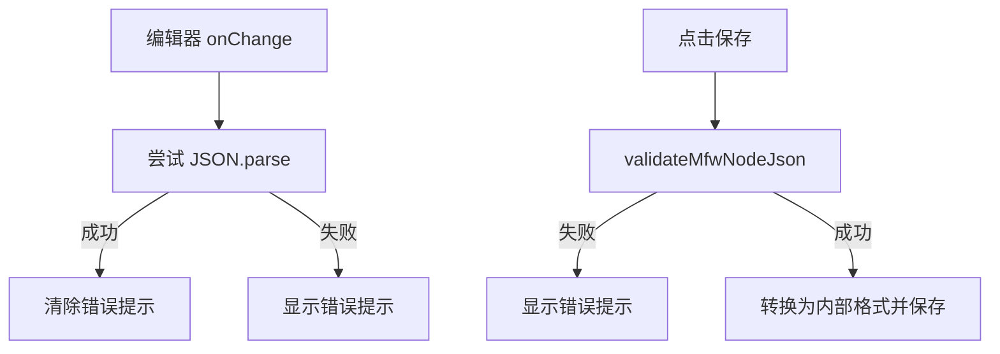
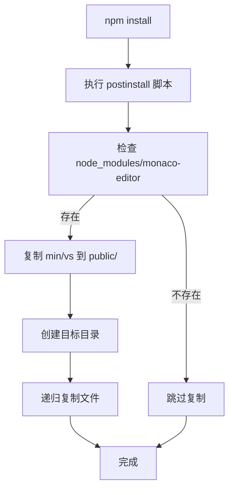
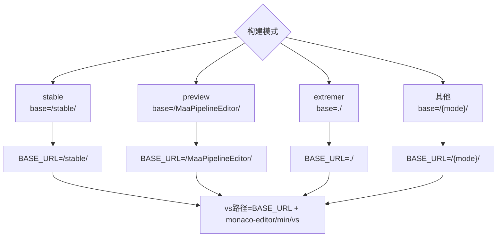
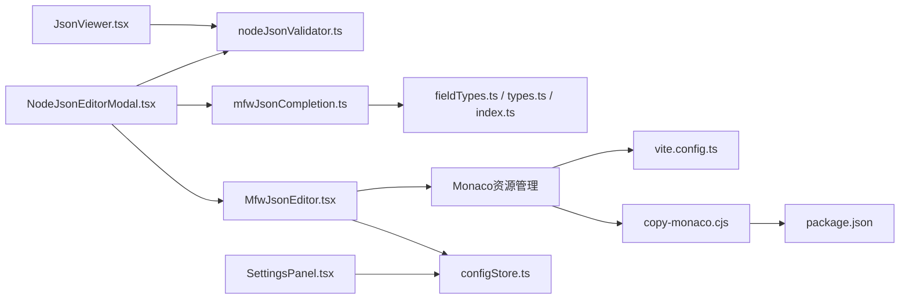

# JSON编辑器

<cite>
**本文档引用的文件**
- [MfwJsonEditor.tsx](file://src/components/json/MfwJsonEditor.tsx)
- [mfwJsonCompletion.ts](file://src/components/json/mfwJsonCompletion.ts)
- [mfwJsonCompletion.test.ts](file://src/components/json/mfwJsonCompletion.test.ts)
- [NodeJsonEditorModal.tsx](file://src/components/modals/NodeJsonEditorModal.tsx)
- [nodeJsonValidator.ts](file://src/utils/node/nodeJsonValidator.ts)
- [JsonViewer.tsx](file://src/components/JsonViewer.tsx)
- [configStore.ts](file://src/stores/configStore.ts)
- [fieldTypes.ts](file://src/core/fields/fieldTypes.ts)
- [types.ts](file://src/core/fields/types.ts)
- [index.ts](file://src/core/fields/index.ts)
- [SettingsPanel.tsx](file://src/components/panels/settings/SettingsPanel.tsx)
- [copy-monaco.cjs](file://scripts/copy-monaco.cjs)
- [vite.config.ts](file://vite.config.ts)
- [package.json](file://package.json)
</cite>

## 更新摘要
**所做更改**
- 新增Monaco编辑器资源管理章节，详细介绍copy-monaco.cjs脚本的作用和配置
- 更新动态base URL配置说明，解释不同构建模式下的路径处理
- 增强部署和资源加载机制的文档说明
- 完善Monaco编辑器集成架构图，反映新的资源管理流程

## 目录
1. [简介](#简介)
2. [项目结构](#项目结构)
3. [核心组件](#核心组件)
4. [架构总览](#架构总览)
5. [组件详解](#组件详解)
6. [Monaco编辑器资源管理](#monaco编辑器资源管理)
7. [依赖关系分析](#依赖关系分析)
8. [性能考量](#性能考量)
9. [故障排查指南](#故障排查指南)
10. [结论](#结论)
11. [附录](#附录)

## 简介
本文件系统性地记录 MFW JSON 编辑器在本项目中的实现与使用方式，覆盖以下方面：
- 编辑器基础能力：基于 Monaco Editor 的 React 包装组件
- 语法高亮与主题：通过 Monaco 的语言与主题机制实现
- 智能补全：基于识别/动作字段定义的上下文感知补全
- 错误提示：实时 JSON 语法校验与错误信息展示
- 配置方法：如何通过设置面板调整缩进等编辑偏好
- 定制与扩展：如何注入节点名建议、复用补全提供者
- 资源管理：Monaco编辑器静态资源的复制与部署机制
- 使用示例与常见问题：在节点 JSON 编辑弹窗中的集成方式

## 项目结构
围绕 JSON 编辑器的相关模块分布如下：
- 组件层
  - MFW JSON 编辑器包装组件：负责按需加载 Monaco 并提供懒加载占位
  - 节点 JSON 编辑弹窗：承载编辑器、实时校验与保存逻辑
  - JSON 查看器：用于以树形/高亮文本方式浏览编译后的 Pipeline JSON
- 补全与校验
  - 补全提供者：根据字段定义动态生成键/值建议
  - 校验工具：JSON 语法校验与节点数据结构校验
- 配置与主题
  - 设置面板：集中管理编辑器相关配置项
  - Monaco 编辑器选项：统一的编辑器行为与外观配置
- 资源管理
  - Monaco资源复制脚本：自动化复制编辑器静态资源到公共目录
  - 动态base URL配置：支持多环境部署的路径处理

**图表来源**
- [MfwJsonEditor.tsx:1-31](file://src/components/json/MfwJsonEditor.tsx#L1-L31)
- [NodeJsonEditorModal.tsx:1-244](file://src/components/modals/NodeJsonEditorModal.tsx#L1-L244)
- [JsonViewer.tsx:1-277](file://src/components/JsonViewer.tsx#L1-L277)
- [mfwJsonCompletion.ts:1-439](file://src/components/json/mfwJsonCompletion.ts#L1-L439)
- [nodeJsonValidator.ts:1-367](file://src/utils/node/nodeJsonValidator.ts#L1-L367)
- [configStore.ts:1-200](file://src/stores/configStore.ts#L1-L200)
- [SettingsPanel.tsx:1-49](file://src/components/panels/settings/SettingsPanel.tsx#L1-L49)
- [copy-monaco.cjs:1-32](file://scripts/copy-monaco.cjs#L1-L32)
- [vite.config.ts:1-66](file://vite.config.ts#L1-L66)
- [package.json:1-76](file://package.json#L1-L76)
- [fieldTypes.ts:1-27](file://src/core/fields/fieldTypes.ts#L1-L27)
- [types.ts:1-34](file://src/core/fields/types.ts#L1-L34)
- [index.ts:1-46](file://src/core/fields/index.ts#L1-L46)

**章节来源**
- [MfwJsonEditor.tsx:1-31](file://src/components/json/MfwJsonEditor.tsx#L1-L31)
- [NodeJsonEditorModal.tsx:1-244](file://src/components/modals/NodeJsonEditorModal.tsx#L1-L244)
- [JsonViewer.tsx:1-277](file://src/components/JsonViewer.tsx#L1-L277)
- [mfwJsonCompletion.ts:1-439](file://src/components/json/mfwJsonCompletion.ts#L1-L439)
- [nodeJsonValidator.ts:1-367](file://src/utils/node/nodeJsonValidator.ts#L1-L367)
- [configStore.ts:118-177](file://src/stores/configStore.ts#L118-L177)
- [SettingsPanel.tsx:1-49](file://src/components/panels/settings/SettingsPanel.tsx#L1-L49)
- [copy-monaco.cjs:1-32](file://scripts/copy-monaco.cjs#L1-L32)
- [vite.config.ts:1-66](file://vite.config.ts#L1-L66)
- [package.json:1-76](file://package.json#L1-L76)

## 核心组件
- MFW JSON 编辑器包装组件
  - 作用：按需加载 Monaco Editor，并提供加载占位；对外透传 Monaco 的编辑器属性
  - 关键点：使用 React.lazy 与 Suspense 实现延迟加载；默认语言为 json；通过动态base URL配置加载资源
- 节点 JSON 编辑弹窗
  - 作用：承载单个节点的 JSON 编辑体验，包含实时语法校验、格式化、保存与错误提示
  - 关键点：挂载时注册补全提供者；使用统一编辑器选项；保存前进行 JSON 校验
- JSON 查看器
  - 作用：以树形视图与高亮文本两种方式查看编译后的 Pipeline JSON，支持关键字搜索与定位
  - 关键点：高亮文本视图基于正则拆分渲染；树形视图使用第三方库并内置折叠策略

**章节来源**
- [MfwJsonEditor.tsx:1-31](file://src/components/json/MfwJsonEditor.tsx#L1-L31)
- [NodeJsonEditorModal.tsx:1-244](file://src/components/modals/NodeJsonEditorModal.tsx#L1-L244)
- [JsonViewer.tsx:1-277](file://src/components/JsonViewer.tsx#L1-L277)

## 架构总览
MFW JSON 编辑器由"组件层 + 补全与校验层 + 配置层 + 资源管理层"构成，整体交互如下：

**图表来源**
- [NodeJsonEditorModal.tsx:57-129](file://src/components/modals/NodeJsonEditorModal.tsx#L57-L129)
- [mfwJsonCompletion.ts:399-410](file://src/components/json/mfwJsonCompletion.ts#L399-L410)
- [nodeJsonValidator.ts:103-144](file://src/utils/node/nodeJsonValidator.ts#L103-L144)
- [MfwJsonEditor.tsx:6-10](file://src/components/json/MfwJsonEditor.tsx#L6-L10)

## 组件详解

### MFW JSON 编辑器包装组件
- 设计要点
  - 使用 React.lazy 按需加载 Monaco Editor，减少首屏体积
  - 提供加载占位，提升用户体验
  - 透传 Monaco 编辑器属性，便于外部配置
  - 通过动态base URL配置加载编辑器资源，支持多环境部署
- 适用场景
  - 在弹窗、侧边面板等需要延迟加载的场景中使用
  - 与补全提供者配合，实现智能补全

**图表来源**
- [MfwJsonEditor.tsx:1-31](file://src/components/json/MfwJsonEditor.tsx#L1-L31)

**章节来源**
- [MfwJsonEditor.tsx:1-31](file://src/components/json/MfwJsonEditor.tsx#L1-L31)

### 节点 JSON 编辑弹窗
- 功能特性
  - 实时 JSON 语法校验：输入变更即刻校验，出现错误时禁用保存按钮
  - 格式化：一键格式化 JSON，使用配置的缩进
  - 保存：保存前进行二次校验，通过后转换为内部存储格式并回调保存
  - 错误提示：使用 Ant Design 的 Alert 展示错误信息
- 与编辑器的集成
  - 通过 onMount 注册补全提供者
  - 使用统一编辑器选项，保证一致的编辑体验

**图表来源**
- [NodeJsonEditorModal.tsx:57-129](file://src/components/modals/NodeJsonEditorModal.tsx#L57-L129)
- [nodeJsonValidator.ts:38-51](file://src/utils/node/nodeJsonValidator.ts#L38-L51)

**章节来源**
- [NodeJsonEditorModal.tsx:1-244](file://src/components/modals/NodeJsonEditorModal.tsx#L1-L244)
- [nodeJsonValidator.ts:1-367](file://src/utils/node/nodeJsonValidator.ts#L1-L367)

### JSON 查看器
- 功能特性
  - 树形视图：以结构化方式查看 JSON，支持折叠/展开
  - 高亮文本视图：按关键字高亮并支持前后跳转
  - 搜索：防抖搜索，统计匹配数量，支持跳转到上一个/下一个
- 适用场景
  - 查看编译后的 Pipeline JSON 结构
  - 定位特定键/值位置

**图表来源**
- [JsonViewer.tsx:113-277](file://src/components/JsonViewer.tsx#L113-L277)

**章节来源**
- [JsonViewer.tsx:1-277](file://src/components/JsonViewer.tsx#L1-L277)

### 补全提供者与智能补全
- 机制说明
  - 基于识别/动作字段定义生成建议
  - 支持节点名建议注入，用于运行时覆盖场景
  - 保持字符串内快速建议开启，避免在引号内补全失效
- 关键实现
  - 注册补全提供者一次，避免重复注册
  - 维护模型级别的补全上下文，支持跨文件节点名建议
  - 提供统一编辑器选项，包含缩进、换行、格式化等

**图表来源**
- [mfwJsonCompletion.ts:1-439](file://src/components/json/mfwJsonCompletion.ts#L1-L439)
- [fieldTypes.ts:1-27](file://src/core/fields/fieldTypes.ts#L1-L27)
- [types.ts:1-34](file://src/core/fields/types.ts#L1-L34)
- [index.ts:1-46](file://src/core/fields/index.ts#L1-L46)

**章节来源**
- [mfwJsonCompletion.ts:1-439](file://src/components/json/mfwJsonCompletion.ts#L1-L439)
- [mfwJsonCompletion.test.ts:1-150](file://src/components/json/mfwJsonCompletion.test.ts#L1-L150)
- [fieldTypes.ts:1-27](file://src/core/fields/fieldTypes.ts#L1-L27)
- [types.ts:1-34](file://src/core/fields/types.ts#L1-L34)
- [index.ts:1-46](file://src/core/fields/index.ts#L1-L46)

### 校验与错误提示
- 实时校验
  - 在编辑器 onChange 中进行 JSON 语法校验，出现错误时显示提示并禁用保存
- 保存校验
  - 保存前再次调用校验工具，确保 JSON 有效且满足节点数据结构要求
- 错误提示
  - 使用 Ant Design 的 Alert 组件展示错误消息，支持手动关闭

**图表来源**
- [NodeJsonEditorModal.tsx:87-129](file://src/components/modals/NodeJsonEditorModal.tsx#L87-L129)
- [nodeJsonValidator.ts:103-144](file://src/utils/node/nodeJsonValidator.ts#L103-L144)

**章节来源**
- [NodeJsonEditorModal.tsx:1-244](file://src/components/modals/NodeJsonEditorModal.tsx#L1-L244)
- [nodeJsonValidator.ts:1-367](file://src/utils/node/nodeJsonValidator.ts#L1-L367)

## Monaco编辑器资源管理

### 资源复制脚本
项目使用copy-monaco.cjs脚本自动化管理Monaco编辑器的静态资源，确保在构建过程中正确复制所需的VS代码文件。

- 脚本功能
  - 自动检测node_modules中的monaco-editor资源
  - 递归复制min/vs目录到public/monaco-editor/min/vs
  - 支持条件执行，当资源不存在时跳过复制
- 执行时机
  - 通过postinstall钩子在npm安装后自动执行
  - 确保每次安装依赖后都能获得最新的编辑器资源

**图表来源**
- [copy-monaco.cjs:1-32](file://scripts/copy-monaco.cjs#L1-L32)

**章节来源**
- [copy-monaco.cjs:1-32](file://scripts/copy-monaco.cjs#L1-L32)
- [package.json:6-24](file://package.json#L6-L24)

### 动态base URL配置
Vite配置支持多种构建模式，通过动态base URL确保Monaco编辑器资源在不同环境下正确加载。

- 配置策略
  - stable模式：使用"/stable/"作为基础路径
  - preview模式：使用"/MaaPipelineEditor/"适配GitHub Pages
  - extremer模式：使用"./"支持相对路径部署
  - 其他模式：使用"/{mode}/"动态生成路径
- 编辑器资源映射
  - Monaco编辑器通过loader.config设置vs路径为`${import.meta.env.BASE_URL}monaco-editor/min/vs`
  - 确保资源路径与构建时的base配置保持一致

**图表来源**
- [vite.config.ts:5-13](file://vite.config.ts#L5-L13)
- [MfwJsonEditor.tsx:6-10](file://src/components/json/MfwJsonEditor.tsx#L6-L10)

**章节来源**
- [vite.config.ts:1-66](file://vite.config.ts#L1-L66)
- [MfwJsonEditor.tsx:1-31](file://src/components/json/MfwJsonEditor.tsx#L1-L31)

### 资源加载优化
项目通过多种方式优化Monaco编辑器的资源加载和性能表现。

- 代码分割
  - 通过Rollup的manualChunks配置将monaco-editor和@monaco-editor/react分离打包
  - 创建独立的"monaco-editor"chunk，避免与应用代码混合
- 懒加载策略
  - 使用React.lazy实现编辑器组件的按需加载
  - 结合Suspense提供加载占位符，改善用户体验
- 资源缓存
  - 通过静态资源复制确保浏览器能够正确缓存编辑器文件
  - 支持CDN部署场景下的资源访问

**章节来源**
- [vite.config.ts:21-40](file://vite.config.ts#L21-L40)
- [MfwJsonEditor.tsx:1-31](file://src/components/json/MfwJsonEditor.tsx#L1-L31)

## 依赖关系分析
- 组件耦合
  - NodeJsonEditorModal 依赖 MfwJsonEditor、补全提供者与校验工具
  - JsonViewer 依赖编译管线输出与校验工具
- 外部依赖
  - Monaco Editor：提供语言、主题、补全、诊断等能力
  - Ant Design：提供 UI 组件与布局
  - 第三方 JSON 视图库：用于树形渲染
- 配置依赖
  - 编辑器缩进等偏好来自全局配置存储
  - 设置面板集中管理配置项
- 资源依赖
  - Monaco编辑器静态资源通过copy-monaco.cjs脚本管理
  - 动态base URL配置确保资源路径正确解析

**图表来源**
- [NodeJsonEditorModal.tsx:1-244](file://src/components/modals/NodeJsonEditorModal.tsx#L1-L244)
- [MfwJsonEditor.tsx:1-31](file://src/components/json/MfwJsonEditor.tsx#L1-L31)
- [mfwJsonCompletion.ts:1-439](file://src/components/json/mfwJsonCompletion.ts#L1-L439)
- [nodeJsonValidator.ts:1-367](file://src/utils/node/nodeJsonValidator.ts#L1-L367)
- [JsonViewer.tsx:1-277](file://src/components/JsonViewer.tsx#L1-L277)
- [configStore.ts:118-177](file://src/stores/configStore.ts#L118-L177)
- [SettingsPanel.tsx:1-49](file://src/components/panels/settings/SettingsPanel.tsx#L1-L49)
- [copy-monaco.cjs:1-32](file://scripts/copy-monaco.cjs#L1-L32)
- [vite.config.ts:1-66](file://vite.config.ts#L1-L66)
- [package.json:1-76](file://package.json#L1-L76)
- [fieldTypes.ts:1-27](file://src/core/fields/fieldTypes.ts#L1-L27)
- [types.ts:1-34](file://src/core/fields/types.ts#L1-L34)
- [index.ts:1-46](file://src/core/fields/index.ts#L1-L46)

**章节来源**
- [NodeJsonEditorModal.tsx:1-244](file://src/components/modals/NodeJsonEditorModal.tsx#L1-L244)
- [MfwJsonEditor.tsx:1-31](file://src/components/json/MfwJsonEditor.tsx#L1-L31)
- [mfwJsonCompletion.ts:1-439](file://src/components/json/mfwJsonCompletion.ts#L1-L439)
- [nodeJsonValidator.ts:1-367](file://src/utils/node/nodeJsonValidator.ts#L1-L367)
- [JsonViewer.tsx:1-277](file://src/components/JsonViewer.tsx#L1-L277)
- [configStore.ts:118-177](file://src/stores/configStore.ts#L118-L177)
- [SettingsPanel.tsx:1-49](file://src/components/panels/settings/SettingsPanel.tsx#L1-L49)
- [copy-monaco.cjs:1-32](file://scripts/copy-monaco.cjs#L1-L32)
- [vite.config.ts:1-66](file://vite.config.ts#L1-L66)
- [package.json:1-76](file://package.json#L1-L76)
- [fieldTypes.ts:1-27](file://src/core/fields/fieldTypes.ts#L1-L27)
- [types.ts:1-34](file://src/core/fields/types.ts#L1-L34)
- [index.ts:1-46](file://src/core/fields/index.ts#L1-L46)

## 性能考量
- 懒加载与按需渲染
  - 编辑器组件按需加载，降低首屏资源占用
  - 弹窗关闭时可释放相关状态，避免常驻内存
- 编辑器选项优化
  - 统一缩进、自动布局、格式化开关等减少不必要的重排
  - 关闭小地图、限制空白字符渲染，提升滚动性能
- 搜索与高亮
  - 高亮文本视图采用正则拆分渲染，注意大数据量时的渲染成本
  - 树形视图支持折叠，减少一次性渲染节点数量
- 资源加载优化
  - 通过代码分割将Monaco编辑器独立打包，提升缓存效率
  - 动态base URL配置支持CDN部署，优化资源加载速度

[本节为通用指导，无需列出具体文件来源]

## 故障排查指南
- 编辑器未显示或白屏
  - 检查按需加载是否成功，确认网络可访问 Monaco 资源
  - 确认 Suspense 占位样式正常
  - 验证copy-monaco.cjs脚本是否正确执行
- 补全不生效
  - 确认 onMount 中已调用补全提供者的注册函数
  - 检查是否重复注册导致冲突
- 保存时报错
  - 检查实时校验是否显示错误；修正 JSON 语法后再保存
  - 若为节点结构错误，参考校验工具返回的错误信息完善字段
- 搜索无结果
  - 确认关键字非空且已触发防抖；检查匹配数量是否为 0
  - 大数据量时，高亮文本视图渲染可能较慢，建议切换为树形视图
- 资源加载失败
  - 检查vite配置中的base URL是否与实际部署路径匹配
  - 确认public/monaco-editor目录是否存在且包含完整资源
  - 验证动态base URL配置是否正确解析

**章节来源**
- [MfwJsonEditor.tsx:1-31](file://src/components/json/MfwJsonEditor.tsx#L1-L31)
- [NodeJsonEditorModal.tsx:1-244](file://src/components/modals/NodeJsonEditorModal.tsx#L1-L244)
- [mfwJsonCompletion.ts:399-410](file://src/components/json/mfwJsonCompletion.ts#L399-L410)
- [nodeJsonValidator.ts:103-144](file://src/utils/node/nodeJsonValidator.ts#L103-L144)
- [JsonViewer.tsx:128-164](file://src/components/JsonViewer.tsx#L128-L164)
- [copy-monaco.cjs:1-32](file://scripts/copy-monaco.cjs#L1-L32)
- [vite.config.ts:1-66](file://vite.config.ts#L1-L66)

## 结论
本项目的 MFW JSON 编辑器以 Monaco Editor 为核心，结合统一的补全提供者与校验工具，在节点 JSON 编辑场景下提供了良好的开发体验。通过设置面板与配置存储，用户可以灵活调整编辑偏好；通过智能补全与错误提示，显著降低了 JSON 编写成本。

**新增的Monaco编辑器资源管理机制**进一步增强了编辑器的部署灵活性和性能表现。通过copy-monaco.cjs脚本自动化资源复制和动态base URL配置，项目能够在不同部署环境中正确加载编辑器资源，支持CDN部署和多环境发布需求。

[本节为总结性内容，无需列出具体文件来源]

## 附录

### 配置方法：编辑器缩进与主题
- 缩进配置
  - 来源：全局配置存储中的 jsonIndent，默认值为 4
  - 应用：编辑器选项中使用该值作为 tabSize 与插入空格
- 主题与外观
  - 默认主题：vs
  - 编辑器选项：统一的字体大小、行号、自动布局、格式化开关等

**章节来源**
- [configStore.ts:118-177](file://src/stores/configStore.ts#L118-L177)
- [NodeJsonEditorModal.tsx:149-150](file://src/components/modals/NodeJsonEditorModal.tsx#L149-L150)
- [mfwJsonCompletion.ts:412-439](file://src/components/json/mfwJsonCompletion.ts#L412-L439)

### 使用示例：在节点 JSON 编辑弹窗中集成
- 步骤
  - 渲染 MfwJsonEditor，设置语言为 json，绑定 value 与 onChange
  - 在 onMount 中调用补全提供者的注册函数
  - 实时校验：在 onChange 中尝试 JSON.parse，出现错误时显示提示
  - 保存：保存前调用校验工具，通过后转换为内部格式并回调保存

**章节来源**
- [NodeJsonEditorModal.tsx:1-244](file://src/components/modals/NodeJsonEditorModal.tsx#L1-L244)
- [mfwJsonCompletion.ts:399-410](file://src/components/json/mfwJsonCompletion.ts#L399-L410)

### 扩展接口：注入节点名建议
- 接口
  - setMfwJsonCompletionContext：为指定模型设置节点名建议
  - clearMfwJsonCompletionContext：清理模型的补全上下文
- 场景
  - 在运行时覆盖场景中，向所有文件提供节点名建议，同时排除系统保留名

**章节来源**
- [mfwJsonCompletion.ts:382-397](file://src/components/json/mfwJsonCompletion.ts#L382-L397)
- [mfwJsonCompletion.test.ts:118-149](file://src/components/json/mfwJsonCompletion.test.ts#L118-L149)

### 资源管理配置：Monaco编辑器部署
- 脚本配置
  - 通过postinstall钩子自动执行copy-monaco.cjs
  - 确保Monaco编辑器资源在安装时就绪
- 构建配置
  - 支持多种构建模式的base URL动态配置
  - 通过manualChunks实现Monaco资源的独立打包
- 部署考虑
  - 支持相对路径和绝对路径的部署场景
  - 优化资源加载性能，支持CDN部署

**章节来源**
- [copy-monaco.cjs:1-32](file://scripts/copy-monaco.cjs#L1-L32)
- [vite.config.ts:1-66](file://vite.config.ts#L1-L66)
- [package.json:1-76](file://package.json#L1-L76)