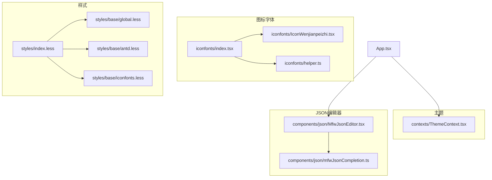
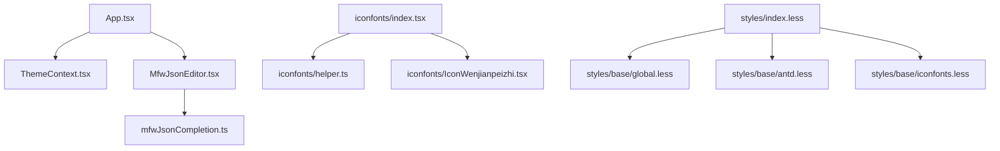
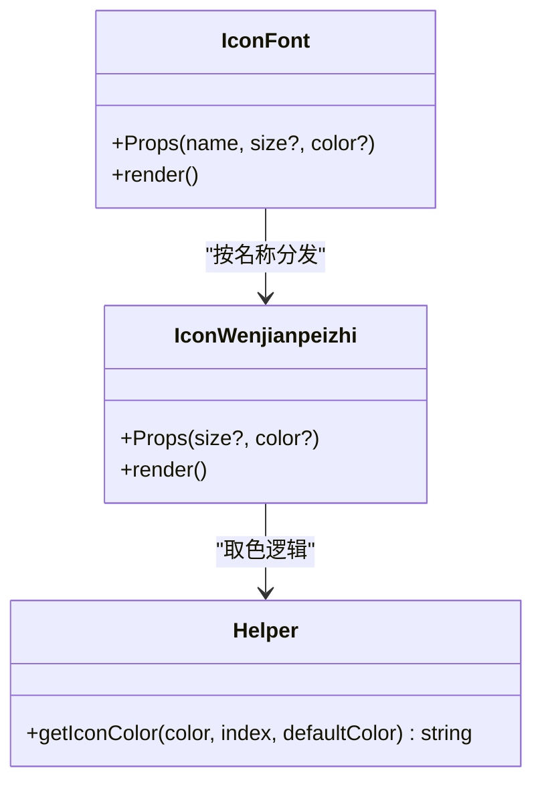
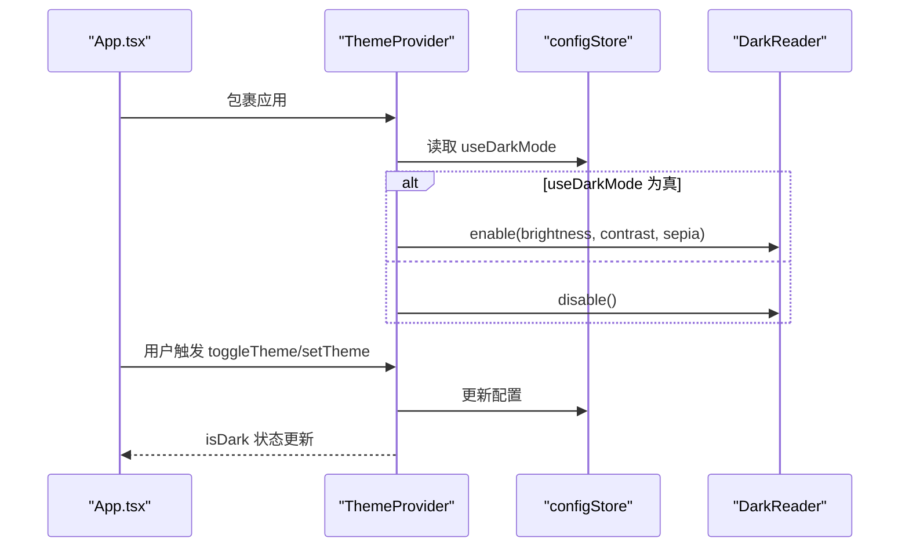
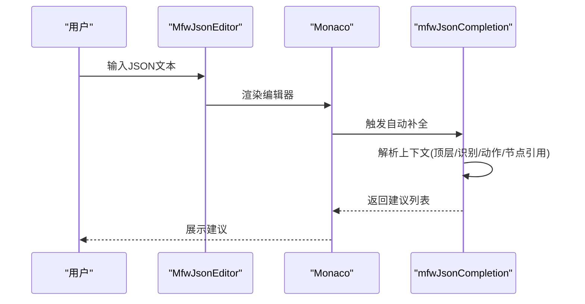
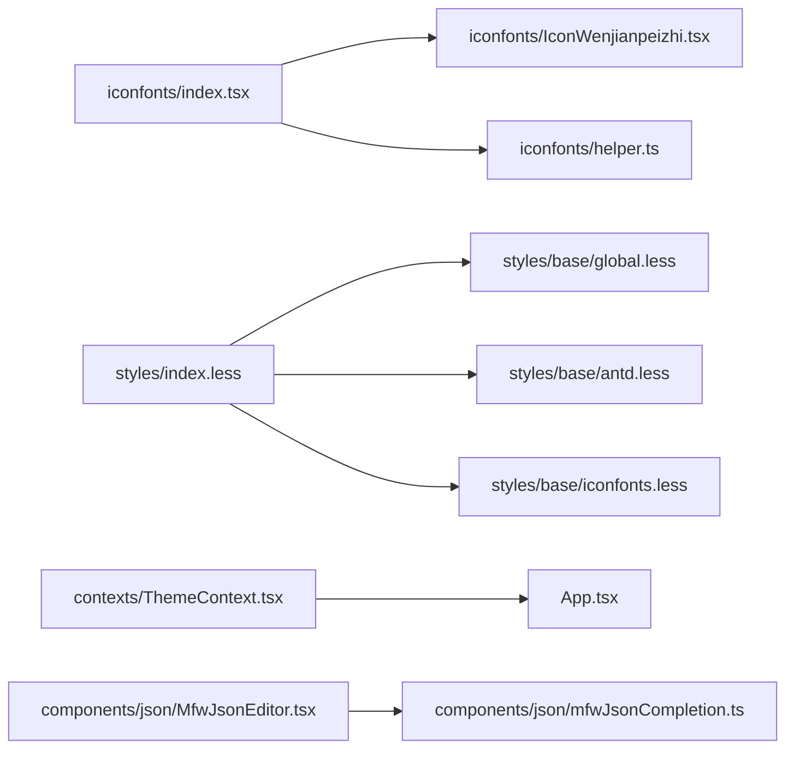

# UI基础组件

<cite>
**本文引用的文件**   
- [src/components/iconfonts/index.tsx](file://src/components/iconfonts/index.tsx)
- [src/components/iconfonts/helper.ts](file://src/components/iconfonts/helper.ts)
- [src/components/iconfonts/IconWenjianpeizhi.tsx](file://src/components/iconfonts/IconWenjianpeizhi.tsx)
- [src/styles/base/iconfonts.less](file://src/styles/base/iconfonts.less)
- [src/styles/base/global.less](file://src/styles/base/global.less)
- [src/styles/base/antd.less](file://src/styles/base/antd.less)
- [src/styles/index.less](file://src/styles/index.less)
- [src/contexts/ThemeContext.tsx](file://src/contexts/ThemeContext.tsx)
- [iconfont.json](file://iconfont.json)
- [src/components/json/MfwJsonEditor.tsx](file://src/components/json/MfwJsonEditor.tsx)
- [src/components/json/mfwJsonCompletion.ts](file://src/components/json/mfwJsonCompletion.ts)
- [src/stores/configStore.ts](file://src/stores/configStore.ts)
- [src/hooks/useEmbedMode.ts](file://src/hooks/useEmbedMode.ts)
- [src/App.tsx](file://src/App.tsx)
</cite>

## 目录
1. [简介](#简介)
2. [项目结构](#项目结构)
3. [核心组件](#核心组件)
4. [架构总览](#架构总览)
5. [详细组件分析](#详细组件分析)
6. [依赖关系分析](#依赖关系分析)
7. [性能考量](#性能考量)
8. [故障排查指南](#故障排查指南)
9. [结论](#结论)
10. [附录](#附录)

## 简介
本文件面向UI基础组件的使用者与维护者，系统化梳理以下内容：
- 图标字体系统：Iconfont组件的注册、命名规范、颜色与尺寸控制、样式交互与复用模式
- 基础样式与主题系统：Less组织结构、Ant Design覆盖、暗色模式集成与切换机制
- JSON编辑器组件：基于Monaco的延迟加载、语法高亮、自动补全与上下文感知
- 组件复用模式与最佳实践：统一入口导出、类型约束、默认值策略
- 可访问性与响应式设计：键盘可达、屏幕阅读器友好、媒体查询与无障碍标签

## 项目结构
UI基础组件主要分布在如下位置：
- 图标字体：src/components/iconfonts（集中导出与按名称分发）
- 样式体系：src/styles（基础样式、Antd覆盖、全局工具类）
- 主题上下文：src/contexts/ThemeContext.tsx
- JSON编辑器：src/components/json（编辑器封装与自动补全提供者）
- 应用入口：src/App.tsx（主题提供者注入）

**图示来源**
- [src/components/iconfonts/index.tsx:1-427](file://src/components/iconfonts/index.tsx#L1-L427)
- [src/components/iconfonts/helper.ts:1-13](file://src/components/iconfonts/helper.ts#L1-L13)
- [src/components/iconfonts/IconWenjianpeizhi.tsx:1-34](file://src/components/iconfonts/IconWenjianpeizhi.tsx#L1-L34)
- [src/styles/index.less:1-30](file://src/styles/index.less#L1-L30)
- [src/styles/base/global.less:1-155](file://src/styles/base/global.less#L1-L155)
- [src/styles/base/antd.less:1-47](file://src/styles/base/antd.less#L1-L47)
- [src/styles/base/iconfonts.less:1-11](file://src/styles/base/iconfonts.less#L1-L11)
- [src/contexts/ThemeContext.tsx:1-68](file://src/contexts/ThemeContext.tsx#L1-L68)
- [src/components/json/MfwJsonEditor.tsx:1-24](file://src/components/json/MfwJsonEditor.tsx#L1-L24)
- [src/components/json/mfwJsonCompletion.ts:1-439](file://src/components/json/mfwJsonCompletion.ts#L1-L439)
- [src/App.tsx:1-200](file://src/App.tsx#L1-L200)

**章节来源**
- [src/components/iconfonts/index.tsx:1-427](file://src/components/iconfonts/index.tsx#L1-L427)
- [src/styles/index.less:1-30](file://src/styles/index.less#L1-L30)
- [src/contexts/ThemeContext.tsx:1-68](file://src/contexts/ThemeContext.tsx#L1-L68)
- [src/components/json/MfwJsonEditor.tsx:1-24](file://src/components/json/MfwJsonEditor.tsx#L1-L24)
- [src/components/json/mfwJsonCompletion.ts:1-439](file://src/components/json/mfwJsonCompletion.ts#L1-L439)
- [src/App.tsx:1-200](file://src/App.tsx#L1-L200)

## 核心组件
- Iconfont组件：统一入口导出所有图标，按名称分发渲染对应SVG组件；支持size与color传参，配合工具函数处理多色填充
- 主题上下文：提供isDark、toggleTheme、setTheme能力，与DarkReader联动实现暗色模式
- JSON编辑器：基于Monaco延迟加载，提供默认编辑器配置与加载占位
- 自动补全提供者：解析JSON上下文，动态生成字段建议、节点名建议与值建议，注册为Monaco语言提供者

**章节来源**
- [src/components/iconfonts/index.tsx:208-427](file://src/components/iconfonts/index.tsx#L208-L427)
- [src/components/iconfonts/helper.ts:4-12](file://src/components/iconfonts/helper.ts#L4-L12)
- [src/contexts/ThemeContext.tsx:22-67](file://src/contexts/ThemeContext.tsx#L22-L67)
- [src/components/json/MfwJsonEditor.tsx:15-21](file://src/components/json/MfwJsonEditor.tsx#L15-L21)
- [src/components/json/mfwJsonCompletion.ts:255-410](file://src/components/json/mfwJsonCompletion.ts#L255-L410)

## 架构总览
UI基础组件围绕“样式—主题—图标—编辑器”的层次展开，应用入口注入主题上下文，图标系统通过集中导出与按名分发实现低耦合扩展，JSON编辑器以Monaco为核心提供专业编辑体验。

**图示来源**
- [src/App.tsx:43-43](file://src/App.tsx#L43-L43)
- [src/contexts/ThemeContext.tsx:22-55](file://src/contexts/ThemeContext.tsx#L22-L55)
- [src/components/iconfonts/index.tsx:216-424](file://src/components/iconfonts/index.tsx#L216-L424)
- [src/components/iconfonts/helper.ts:4-12](file://src/components/iconfonts/helper.ts#L4-L12)
- [src/components/iconfonts/IconWenjianpeizhi.tsx:16-26](file://src/components/iconfonts/IconWenjianpeizhi.tsx#L16-L26)
- [src/components/json/MfwJsonEditor.tsx:15-21](file://src/components/json/MfwJsonEditor.tsx#L15-L21)
- [src/components/json/mfwJsonCompletion.ts:255-410](file://src/components/json/mfwJsonCompletion.ts#L255-L410)
- [src/styles/index.less:1-30](file://src/styles/index.less#L1-L30)
- [src/styles/base/global.less:1-155](file://src/styles/base/global.less#L1-L155)
- [src/styles/base/antd.less:1-47](file://src/styles/base/antd.less#L1-L47)
- [src/styles/base/iconfonts.less:1-11](file://src/styles/base/iconfonts.less#L1-L11)

## 详细组件分析

### 图标字体系统
- 统一入口与命名规范
  - 入口文件集中导出所有图标组件，并定义IconNames联合类型，确保调用侧类型安全
  - 支持带连字符与下划线的名称，便于与外部图标库映射
- 渲染与参数
  - IconFont根据name进行switch分发，未匹配返回空节点
  - 单个图标组件接收size与color，内部通过默认样式与工具函数计算最终fill色
- 颜色与尺寸
  - 默认尺寸由iconfont.json配置，单个图标可覆写
  - 多色图标支持color数组，按索引取色或回退默认色
- 交互样式
  - iconfonts.less提供通用交互类，如悬停缩放与透明度变化

**图示来源**
- [src/components/iconfonts/index.tsx:208-427](file://src/components/iconfonts/index.tsx#L208-L427)
- [src/components/iconfonts/helper.ts:4-12](file://src/components/iconfonts/helper.ts#L4-L12)
- [src/components/iconfonts/IconWenjianpeizhi.tsx:16-31](file://src/components/iconfonts/IconWenjianpeizhi.tsx#L16-L31)

**章节来源**
- [src/components/iconfonts/index.tsx:1-427](file://src/components/iconfonts/index.tsx#L1-L427)
- [src/components/iconfonts/helper.ts:1-13](file://src/components/iconfonts/helper.ts#L1-L13)
- [src/components/iconfonts/IconWenjianpeizhi.tsx:1-34](file://src/components/iconfonts/IconWenjianpeizhi.tsx#L1-L34)
- [src/styles/base/iconfonts.less:1-11](file://src/styles/base/iconfonts.less#L1-L11)
- [iconfont.json:1-8](file://iconfont.json#L1-L8)

### 主题系统与样式组织
- 主题上下文
  - 提供toggleTheme/setTheme与DarkReader联动，同步useDarkMode状态
  - 通过配置存储读取初始主题，避免闪烁
- 样式组织
  - styles/index.less统一引入基础样式、全局工具类与Antd覆盖
  - global.less提供布局、面板、选择器等通用样式
  - antd.less覆盖Ant Design默认行为，保持一致的视觉与交互
- 暗色模式
  - 通过DarkReader在浏览器层面注入CSS滤镜，无需逐组件重写

**图示来源**
- [src/contexts/ThemeContext.tsx:22-55](file://src/contexts/ThemeContext.tsx#L22-L55)
- [src/stores/configStore.ts:1-200](file://src/stores/configStore.ts#L1-L200)
- [src/App.tsx:43-43](file://src/App.tsx#L43-L43)

**章节来源**
- [src/contexts/ThemeContext.tsx:1-68](file://src/contexts/ThemeContext.tsx#L1-L68)
- [src/styles/index.less:1-30](file://src/styles/index.less#L1-L30)
- [src/styles/base/global.less:1-155](file://src/styles/base/global.less#L1-L155)
- [src/styles/base/antd.less:1-47](file://src/styles/base/antd.less#L1-L47)

### JSON编辑器与自动补全
- 编辑器封装
  - MfwJsonEditor基于@monaco-editor/react懒加载，提供加载占位与memo缓存
  - 默认启用格式化、行号、空白渲染、自动布局等
- 自动补全提供者
  - 解析当前光标上下文，识别顶层字段、识别类型、动作类型、节点引用等
  - 动态生成字段建议与节点名建议，合并去重并排序
  - 注册为Monaco语言提供者，支持触发字符与字符串内快速建议

**图示来源**
- [src/components/json/MfwJsonEditor.tsx:15-21](file://src/components/json/MfwJsonEditor.tsx#L15-L21)
- [src/components/json/mfwJsonCompletion.ts:255-380](file://src/components/json/mfwJsonCompletion.ts#L255-L380)

**章节来源**
- [src/components/json/MfwJsonEditor.tsx:1-24](file://src/components/json/MfwJsonEditor.tsx#L1-L24)
- [src/components/json/mfwJsonCompletion.ts:1-439](file://src/components/json/mfwJsonCompletion.ts#L1-L439)

### 组件复用模式与最佳实践
- 统一入口导出：iconfonts/index.tsx集中导出所有图标，便于按需引入与IDE提示
- 类型约束：IconNames联合类型约束name参数，减少运行期错误
- 默认值策略：单个图标组件设置默认size，入口组件不强制必填，降低调用复杂度
- 懒加载与性能：JSON编辑器懒加载与Suspense占位，避免首屏阻塞
- 上下文解耦：主题切换通过配置存储与DarkReader，不侵入各组件内部

**章节来源**
- [src/components/iconfonts/index.tsx:208-427](file://src/components/iconfonts/index.tsx#L208-L427)
- [src/components/iconfonts/IconWenjianpeizhi.tsx:29-31](file://src/components/iconfonts/IconWenjianpeizhi.tsx#L29-L31)
- [src/components/json/MfwJsonEditor.tsx:15-21](file://src/components/json/MfwJsonEditor.tsx#L15-L21)
- [src/contexts/ThemeContext.tsx:22-55](file://src/contexts/ThemeContext.tsx#L22-L55)

### 可访问性与响应式设计
- 可访问性
  - 主题上下文与DarkReader提升对比度与可读性，间接改善可访问性
  - 建议在具体组件中补充ARIA属性与键盘操作（例如节点选择、面板开关），遵循WCAG 2.1 AA
- 响应式设计
  - styles/base/global.less提供Flex工具类与面板基类，适配不同容器布局
  - 模块样式中存在@media规则（如模态框），建议在面板与表单组件中延续该策略
  - 建议在关键交互元素添加aria-*属性与语义角色，确保跨设备与辅助技术可用

**章节来源**
- [src/styles/base/global.less:1-155](file://src/styles/base/global.less#L1-L155)
- [src/styles/modals/UpdateLog.module.less:274-300](file://src/styles/modals/UpdateLog.module.less#L274-L300)

## 依赖关系分析
- 图标系统
  - iconfonts/index.tsx依赖各具体图标组件与helper.ts的颜色计算
  - iconfonts.less提供通用交互样式
- 主题系统
  - ThemeContext.tsx依赖DarkReader与配置存储
  - App.tsx作为根组件包裹ThemeProvider
- JSON编辑器
  - MfwJsonEditor.tsx依赖@monaco-editor/react与Suspense
  - mfwJsonCompletion.ts依赖jsonc-parser与Monaco语言API

**图示来源**
- [src/components/iconfonts/index.tsx:1-427](file://src/components/iconfonts/index.tsx#L1-L427)
- [src/components/iconfonts/helper.ts:1-13](file://src/components/iconfonts/helper.ts#L1-L13)
- [src/components/iconfonts/IconWenjianpeizhi.tsx:1-34](file://src/components/iconfonts/IconWenjianpeizhi.tsx#L1-L34)
- [src/styles/index.less:1-30](file://src/styles/index.less#L1-L30)
- [src/styles/base/global.less:1-155](file://src/styles/base/global.less#L1-L155)
- [src/styles/base/antd.less:1-47](file://src/styles/base/antd.less#L1-L47)
- [src/styles/base/iconfonts.less:1-11](file://src/styles/base/iconfonts.less#L1-L11)
- [src/contexts/ThemeContext.tsx:1-68](file://src/contexts/ThemeContext.tsx#L1-L68)
- [src/App.tsx:43-43](file://src/App.tsx#L43-L43)
- [src/components/json/MfwJsonEditor.tsx:1-24](file://src/components/json/MfwJsonEditor.tsx#L1-L24)
- [src/components/json/mfwJsonCompletion.ts:1-439](file://src/components/json/mfwJsonCompletion.ts#L1-L439)

**章节来源**
- [src/components/iconfonts/index.tsx:1-427](file://src/components/iconfonts/index.tsx#L1-L427)
- [src/contexts/ThemeContext.tsx:1-68](file://src/contexts/ThemeContext.tsx#L1-L68)
- [src/components/json/MfwJsonEditor.tsx:1-24](file://src/components/json/MfwJsonEditor.tsx#L1-L24)
- [src/components/json/mfwJsonCompletion.ts:1-439](file://src/components/json/mfwJsonCompletion.ts#L1-L439)

## 性能考量
- 图标渲染
  - 使用memo与默认props减少重复渲染
  - 颜色计算逻辑简单，避免在渲染路径中做重型运算
- JSON编辑器
  - 懒加载与Suspense占位避免首屏阻塞
  - 默认开启格式化与空白渲染，建议在大文档场景下调小渲染范围
- 主题切换
  - DarkReader在浏览器层面生效，避免逐组件重绘
  - 初始状态来自配置存储，减少闪烁与抖动

[本节为通用指导，不直接分析具体文件]

## 故障排查指南
- 图标不显示或颜色异常
  - 检查name是否在IconNames集合内，确认大小写与连字符
  - 若为多色图标，确认color传入为数组且索引有效
- 主题切换无效
  - 确认配置存储中的useDarkMode已更新
  - 检查DarkReader初始化参数与浏览器兼容性
- JSON编辑器空白或加载缓慢
  - 确认@monaco-editor/react已正确安装
  - 检查网络环境与Suspense占位是否正常显示
- 自动补全无建议
  - 确认已调用ensureMfwJsonCompletionProvider并注册提供者
  - 检查上下文解析逻辑（顶层/识别/动作/节点引用）是否符合预期

**章节来源**
- [src/components/iconfonts/index.tsx:208-427](file://src/components/iconfonts/index.tsx#L208-L427)
- [src/components/iconfonts/helper.ts:4-12](file://src/components/iconfonts/helper.ts#L4-L12)
- [src/contexts/ThemeContext.tsx:27-37](file://src/contexts/ThemeContext.tsx#L27-L37)
- [src/components/json/MfwJsonEditor.tsx:15-21](file://src/components/json/MfwJsonEditor.tsx#L15-L21)
- [src/components/json/mfwJsonCompletion.ts:400-410](file://src/components/json/mfwJsonCompletion.ts#L400-L410)

## 结论
本UI基础组件体系以“样式—主题—图标—编辑器”为主线，形成清晰的分层与职责边界。图标系统通过统一入口与类型约束提升可维护性；主题系统以DarkReader实现暗色模式，兼顾性能与一致性；JSON编辑器结合Monaco提供专业编辑体验，并通过上下文感知增强自动补全质量。建议在后续迭代中进一步完善可访问性与响应式细节，持续优化用户体验。

[本节为总结性内容，不直接分析具体文件]

## 附录
- 图标字体配置参考：iconfont.json
- 嵌入模式状态Hook：useEmbedMode.ts
- 应用入口主题提供者：App.tsx

**章节来源**
- [iconfont.json:1-8](file://iconfont.json#L1-L8)
- [src/hooks/useEmbedMode.ts:1-30](file://src/hooks/useEmbedMode.ts#L1-L30)
- [src/App.tsx:43-43](file://src/App.tsx#L43-L43)