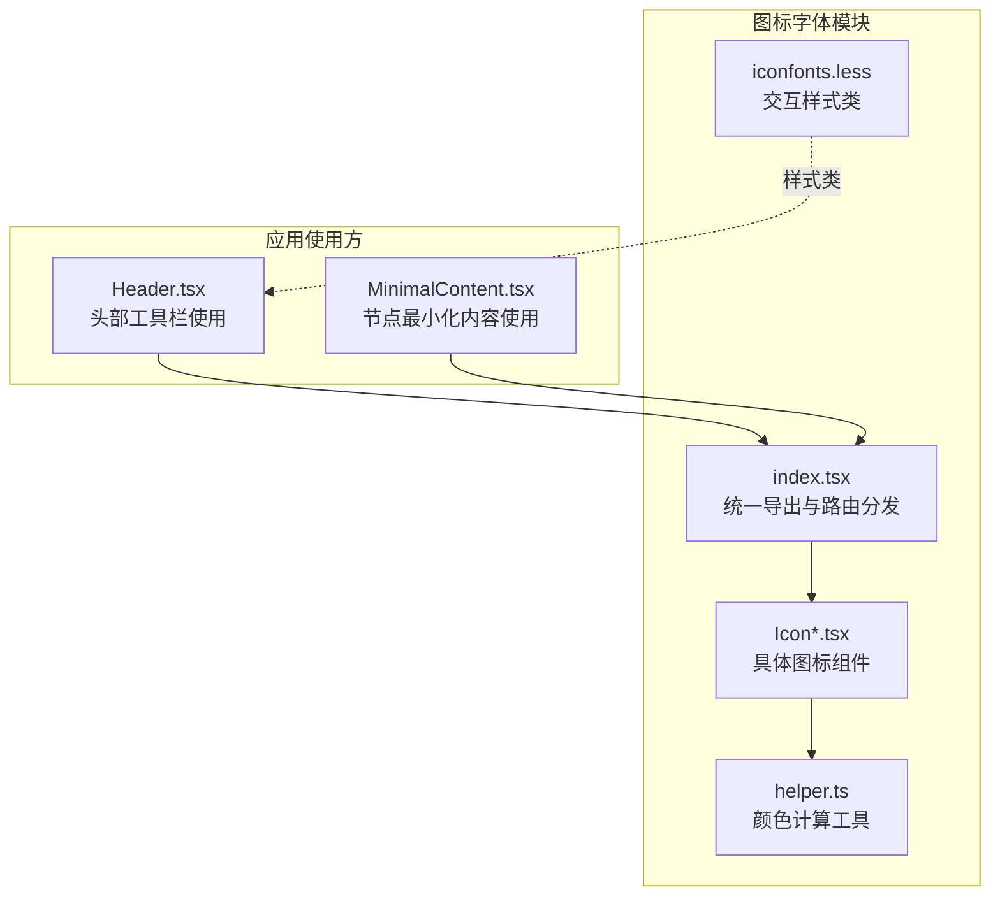
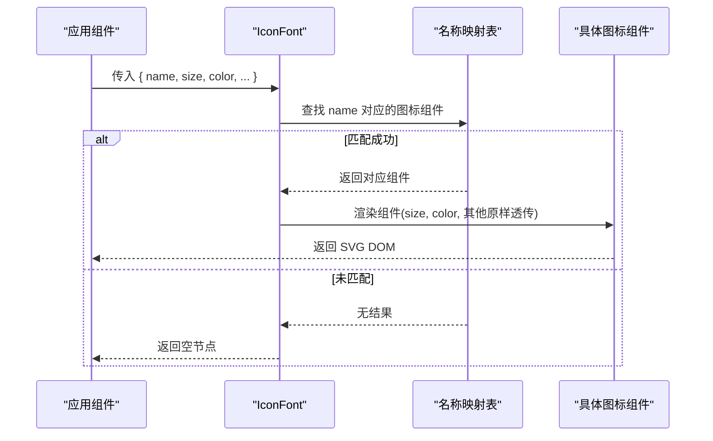
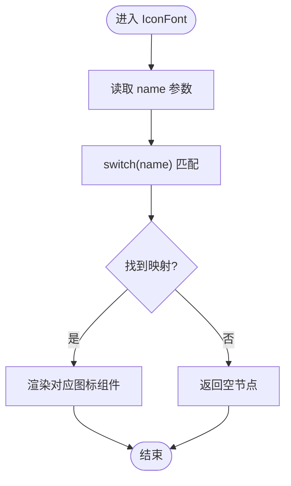
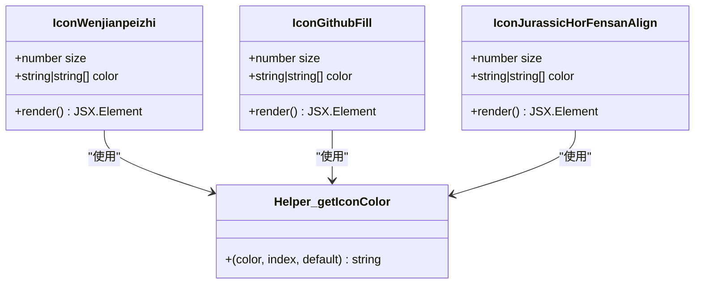
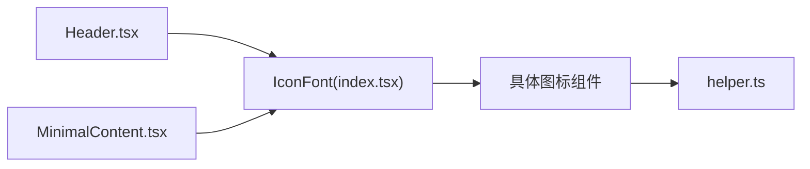

# 图标字体系统

<cite>
**本文档引用的文件**
- [src/components/iconfonts/index.tsx](file://src/components/iconfonts/index.tsx)
- [src/components/iconfonts/helper.ts](file://src/components/iconfonts/helper.ts)
- [iconfont.json](file://iconfont.json)
- [src/styles/base/iconfonts.less](file://src/styles/base/iconfonts.less)
- [src/components/iconfonts/IconWenjianpeizhi.tsx](file://src/components/iconfonts/IconWenjianpeizhi.tsx)
- [src/components/iconfonts/IconGithubFill.tsx](file://src/components/iconfonts/IconGithubFill.tsx)
- [src/components/iconfonts/IconJurassicHorFensanAlign.tsx](file://src/components/iconfonts/IconJurassicHorFensanAlign.tsx)
- [src/components/iconfonts/IconA0415AnxiaqidongPushtoactivate.tsx](file://src/components/iconfonts/IconA0415AnxiaqidongPushtoactivate.tsx)
- [src/components/iconfonts/IconZidingyi.tsx](file://src/components/iconfonts/IconZidingyi.tsx)
- [src/components/Header.tsx](file://src/components/Header.tsx)
- [src/components/flow/nodes/PipelineNode/MinimalContent.tsx](file://src/components/flow/nodes/PipelineNode/MinimalContent.tsx)
</cite>

## 目录
1. [简介](#简介)
2. [项目结构](#项目结构)
3. [核心组件](#核心组件)
4. [架构总览](#架构总览)
5. [详细组件分析](#详细组件分析)
6. [依赖关系分析](#依赖关系分析)
7. [性能考虑](#性能考虑)
8. [故障排除指南](#故障排除指南)
9. [结论](#结论)
10. [附录](#附录)

## 简介
本系统基于阿里图标字体（Iconfont）生成的 SVG 图标资源，通过 TypeScript/React 将每个 SVG 图标封装为独立的函数式组件，并由一个统一的 IconFont 组件进行按名路由分发。该设计实现了图标资源的模块化管理、类型安全的图标选择以及灵活的颜色与尺寸定制能力。

## 项目结构
图标字体系统主要位于前端源码的组件目录中，采用“单图标一文件”的组织方式，配合一个入口索引文件集中导出与路由分发。

**图表来源**
- [src/components/iconfonts/index.tsx:1-427](file://src/components/iconfonts/index.tsx#L1-L427)
- [src/components/iconfonts/helper.ts:1-13](file://src/components/iconfonts/helper.ts#L1-L13)
- [src/styles/base/iconfonts.less:1-11](file://src/styles/base/iconfonts.less#L1-L11)
- [src/components/Header.tsx:460-500](file://src/components/Header.tsx#L460-L500)
- [src/components/flow/nodes/PipelineNode/MinimalContent.tsx:35-58](file://src/components/flow/nodes/PipelineNode/MinimalContent.tsx#L35-L58)

**章节来源**
- [src/components/iconfonts/index.tsx:1-427](file://src/components/iconfonts/index.tsx#L1-L427)
- [src/components/iconfonts/helper.ts:1-13](file://src/components/iconfonts/helper.ts#L1-L13)
- [src/styles/base/iconfonts.less:1-11](file://src/styles/base/iconfonts.less#L1-L11)
- [src/components/Header.tsx:460-500](file://src/components/Header.tsx#L460-L500)
- [src/components/flow/nodes/PipelineNode/MinimalContent.tsx:35-58](file://src/components/flow/nodes/PipelineNode/MinimalContent.tsx#L35-L58)

## 核心组件
- IconFont 统一路由组件：接收 name 属性，根据预定义的图标名称映射到对应的具体图标组件；未匹配时返回空节点。
- 具体图标组件：每个图标组件均以 Icon 前缀命名，内部使用 SVG 路径绘制图形，支持 size 与 color 两个通用属性。
- 辅助工具：getIconColor 提供多段配色的解析逻辑，支持字符串或数组两种传参形式。
- 样式类：icon-interactive 提供悬停交互效果，便于在界面中增强可点击性。

**章节来源**
- [src/components/iconfonts/index.tsx:210-427](file://src/components/iconfonts/index.tsx#L210-L427)
- [src/components/iconfonts/helper.ts:4-12](file://src/components/iconfonts/helper.ts#L4-L12)
- [src/styles/base/iconfonts.less:1-11](file://src/styles/base/iconfonts.less#L1-L11)

## 架构总览
图标字体系统采用“配置驱动 + 模块化组件”的架构模式：

**图表来源**
- [src/components/iconfonts/index.tsx:216-424](file://src/components/iconfonts/index.tsx#L216-L424)

## 详细组件分析

### IconFont 组件
- 功能职责：作为统一入口，负责将字符串名称映射到具体图标组件实例。
- 类型约束：通过 IconNames 联合类型限定可用名称集合，确保调用侧的类型安全。
- 扩展机制：新增图标时需在 index.tsx 中：
  - 导入新组件
  - 在 export 列表中导出默认组件
  - 在 switch 分支中增加 name -> 组件 的映射
- 性能特征：switch 分支为 O(n) 匹配，n 为已注册图标数量；当前约 180+ 个图标，switch 代价可接受。

**图表来源**
- [src/components/iconfonts/index.tsx:216-424](file://src/components/iconfonts/index.tsx#L216-L424)

**章节来源**
- [src/components/iconfonts/index.tsx:208-427](file://src/components/iconfonts/index.tsx#L208-L427)

### 具体图标组件（示例）
- 命名规范：Icon{中文拼音首字母缩写或语义化英文}，如 IconWenjianpeizhi、IconGithubFill。
- 结构模式：统一的 props 接口（继承 SVGAttributes 并剔除 color），默认样式常量，SVG 路径绘制，getIconColor 计算填充色。
- 多段配色：部分图标包含多个 path，通过 getIconColor(index) 为不同段落设置颜色，提升视觉层次。

**图表来源**
- [src/components/iconfonts/IconWenjianpeizhi.tsx:1-34](file://src/components/iconfonts/IconWenjianpeizhi.tsx#L1-L34)
- [src/components/iconfonts/IconGithubFill.tsx:1-34](file://src/components/iconfonts/IconGithubFill.tsx#L1-L34)
- [src/components/iconfonts/IconJurassicHorFensanAlign.tsx:1-38](file://src/components/iconfonts/IconJurassicHorFensanAlign.tsx#L1-L38)
- [src/components/iconfonts/helper.ts:4-12](file://src/components/iconfonts/helper.ts#L4-L12)

**章节来源**
- [src/components/iconfonts/IconWenjianpeizhi.tsx:1-34](file://src/components/iconfonts/IconWenjianpeizhi.tsx#L1-L34)
- [src/components/iconfonts/IconGithubFill.tsx:1-34](file://src/components/iconfonts/IconGithubFill.tsx#L1-L34)
- [src/components/iconfonts/IconJurassicHorFensanAlign.tsx:1-38](file://src/components/iconfonts/IconJurassicHorFensanAlign.tsx#L1-L38)
- [src/components/iconfonts/IconA0415AnxiaqidongPushtoactivate.tsx:1-34](file://src/components/iconfonts/IconA0415AnxiaqidongPushtoactivate.tsx#L1-L34)
- [src/components/iconfonts/IconZidingyi.tsx:1-106](file://src/components/iconfonts/IconZidingyi.tsx#L1-L106)

### 辅助工具 getIconColor
- 输入：color（字符串或字符串数组）、当前段索引、默认颜色。
- 输出：针对当前段的最终颜色值。
- 设计要点：当 color 为数组时，按索引取值，越界则回退到默认色；字符串则直接使用。

**章节来源**
- [src/components/iconfonts/helper.ts:4-12](file://src/components/iconfonts/helper.ts#L4-L12)

### 样式类 icon-interactive
- 效果：悬停时透明度与缩放变化，提供交互反馈。
- 使用场景：在头部工具栏等需要强调可点击性的区域。

**章节来源**
- [src/styles/base/iconfonts.less:1-11](file://src/styles/base/iconfonts.less#L1-L11)

## 依赖关系分析
- IconFont 依赖所有具体图标组件与其导出列表。
- 具体图标组件依赖 helper.ts 的颜色计算工具。
- 应用组件通过 import IconFont 使用系统，典型位置包括 Header 与节点内容组件。

**图表来源**
- [src/components/iconfonts/index.tsx:1-427](file://src/components/iconfonts/index.tsx#L1-L427)
- [src/components/iconfonts/helper.ts:1-13](file://src/components/iconfonts/helper.ts#L1-L13)
- [src/components/Header.tsx:460-500](file://src/components/Header.tsx#L460-L500)
- [src/components/flow/nodes/PipelineNode/MinimalContent.tsx:35-58](file://src/components/flow/nodes/PipelineNode/MinimalContent.tsx#L35-L58)

**章节来源**
- [src/components/iconfonts/index.tsx:1-427](file://src/components/iconfonts/index.tsx#L1-L427)
- [src/components/iconfonts/helper.ts:1-13](file://src/components/iconfonts/helper.ts#L1-L13)
- [src/components/Header.tsx:460-500](file://src/components/Header.tsx#L460-L500)
- [src/components/flow/nodes/PipelineNode/MinimalContent.tsx:35-58](file://src/components/flow/nodes/PipelineNode/MinimalContent.tsx#L35-L58)

## 性能考虑
- 当前实现为静态导入 + switch 分发，适合图标数量在数百量级的场景；随着图标规模增长，建议引入动态导入与按需加载策略，减少初始包体积。
- 可结合 Webpack/Rspack 的动态 import 或 Vite 的动态导入能力，仅在首次使用某图标时才加载对应组件文件。
- 对于高频使用的图标，可在应用启动阶段进行预热加载，降低首次渲染延迟。
- SVG 内联渲染避免了额外的网络请求，但过多的路径会增加 DOM 体积；可通过压缩 SVG、合并路径等方式优化。

[本节为通用性能建议，不直接分析特定文件，故无“章节来源”]

## 故障排除指南
- 图标不显示
  - 检查 name 是否在 IconNames 联合类型中；若新增图标，请同步更新 index.tsx 的导入、导出与 switch 分支。
  - 确认具体图标组件的默认 size 是否合理，必要时显式传入 size。
- 颜色异常
  - 若传入 color 为数组，确认索引是否正确；越界将回退到默认色。
  - 多段配色的图标（如包含多个 path），检查各段 fill 是否正确传递给 getIconColor。
- 交互样式无效
  - 确认是否正确应用 icon-interactive 类名；LESS 文件已在基础样式中定义。

**章节来源**
- [src/components/iconfonts/index.tsx:208-427](file://src/components/iconfonts/index.tsx#L208-L427)
- [src/components/iconfonts/helper.ts:4-12](file://src/components/iconfonts/helper.ts#L4-L12)
- [src/styles/base/iconfonts.less:1-11](file://src/styles/base/iconfonts.less#L1-L11)

## 结论
该图标字体系统通过“配置 + 模块化组件”的方式，实现了图标资源的清晰管理与类型安全调用。借助统一的 IconFont 路由与 helper 工具，系统具备良好的扩展性与可维护性。建议在未来引入动态导入与预热加载策略，进一步优化首屏性能与包体积。

[本节为总结性内容，不直接分析特定文件，故无“章节来源”]

## 附录

### 图标字体配置
- 配置文件用于指定图标字体资源地址、输出目录、单位与默认尺寸等参数，确保生成的图标组件与项目风格一致。

**章节来源**
- [iconfont.json:1-8](file://iconfont.json#L1-L8)

### 使用示例路径
- 头部工具栏使用示例：在头部工具栏中通过 IconFont 渲染更新日志与 Github 图标，并应用交互样式类。
- 节点内容使用示例：在节点最小化布局中根据识别器配置动态选择图标，若无配置则回退到默认图标。

**章节来源**
- [src/components/Header.tsx:460-500](file://src/components/Header.tsx#L460-L500)
- [src/components/flow/nodes/PipelineNode/MinimalContent.tsx:35-58](file://src/components/flow/nodes/PipelineNode/MinimalContent.tsx#L35-L58)