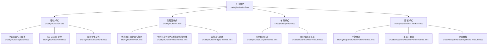
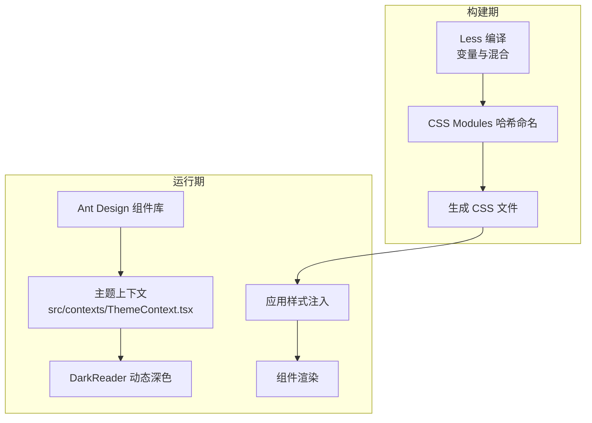
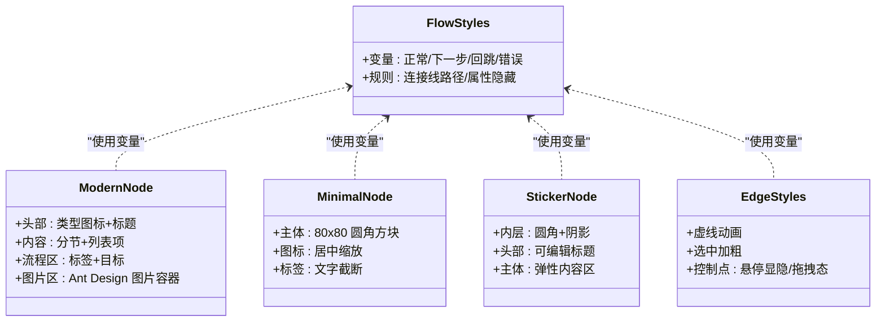
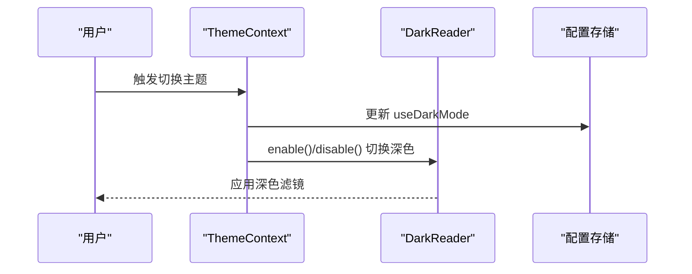
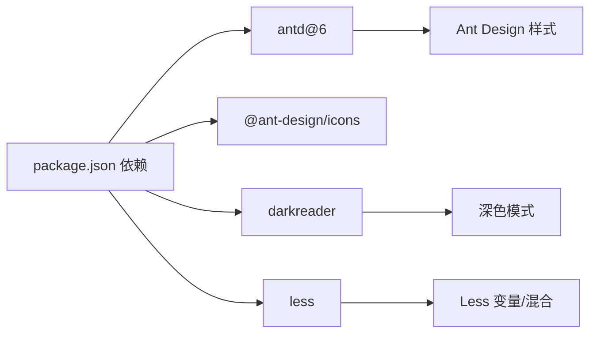

# 样式系统

<cite>
**本文引用的文件**
- [src/styles/index.less](file://src/styles/index.less)
- [src/styles/base/antd.less](file://src/styles/base/antd.less)
- [src/styles/base/global.less](file://src/styles/base/global.less)
- [src/styles/base/iconfonts.less](file://src/styles/base/iconfonts.less)
- [src/styles/layout/App.module.less](file://src/styles/layout/App.module.less)
- [src/styles/layout/Flow.module.less](file://src/styles/layout/Flow.module.less)
- [src/styles/flow/flow.less](file://src/styles/flow/flow.less)
- [src/styles/flow/nodes.module.less](file://src/styles/flow/nodes.module.less)
- [src/styles/flow/edges.module.less](file://src/styles/flow/edges.module.less)
- [src/styles/panels/FieldPanel.module.less](file://src/styles/panels/FieldPanel.module.less)
- [src/styles/panels/ToolbarPanel.module.less](file://src/styles/panels/ToolbarPanel.module.less)
- [src/styles/panels/SettingsPanel.module.less](file://src/styles/panels/SettingsPanel.module.less)
- [src/contexts/ThemeContext.tsx](file://src/contexts/ThemeContext.tsx)
- [package.json](file://package.json)
</cite>

## 目录
1. [简介](#简介)
2. [项目结构](#项目结构)
3. [核心组件](#核心组件)
4. [架构总览](#架构总览)
5. [详细组件分析](#详细组件分析)
6. [依赖关系分析](#依赖关系分析)
7. [性能考量](#性能考量)
8. [故障排查指南](#故障排查指南)
9. [结论](#结论)
10. [附录](#附录)

## 简介
本文件系统性梳理本仓库的样式体系，重点覆盖以下方面：
- Less 样式文件的组织结构与模块化设计
- Ant Design 样式的集成与定制策略
- 全局样式配置与主题变量的使用方式
- 样式覆盖的最佳实践与 CSS-in-JS 的适用场景
- 响应式设计与移动端适配建议

## 项目结构
样式系统采用“入口聚合 + 分层模块 + 组件级样式”的组织方式：
- 入口聚合：通过单一入口 Less 将基础样式、全局样式、流程图样式与 Ant Design 样式统一注入
- 分层模块：按功能域拆分为 base、layout、flow、panels 等目录，便于职责分离与复用
- 组件级样式：大量使用 CSS Modules，配合 Less 变量与混合，确保作用域隔离与可维护性

图表来源
- [src/styles/index.less:1-30](file://src/styles/index.less#L1-L30)
- [src/styles/base/global.less:1-155](file://src/styles/base/global.less#L1-L155)
- [src/styles/base/antd.less:1-47](file://src/styles/base/antd.less#L1-L47)
- [src/styles/base/iconfonts.less:1-11](file://src/styles/base/iconfonts.less#L1-L11)
- [src/styles/flow/flow.less:1-26](file://src/styles/flow/flow.less#L1-L26)
- [src/styles/flow/nodes.module.less:1-907](file://src/styles/flow/nodes.module.less#L1-L907)
- [src/styles/flow/edges.module.less:1-98](file://src/styles/flow/edges.module.less#L1-L98)
- [src/styles/layout/App.module.less:1-32](file://src/styles/layout/App.module.less#L1-L32)
- [src/styles/layout/Flow.module.less:1-7](file://src/styles/layout/Flow.module.less#L1-L7)
- [src/styles/panels/FieldPanel.module.less:1-204](file://src/styles/panels/FieldPanel.module.less#L1-L204)
- [src/styles/panels/ToolbarPanel.module.less:1-71](file://src/styles/panels/ToolbarPanel.module.less#L1-L71)
- [src/styles/panels/SettingsPanel.module.less:1-154](file://src/styles/panels/SettingsPanel.module.less#L1-L154)

章节来源
- [src/styles/index.less:1-30](file://src/styles/index.less#L1-L30)

## 核心组件
- 入口样式聚合
  - 统一引入图标字体、全局样式、流程图样式与 Ant Design 定制样式，确保加载顺序与作用域一致
- 基础样式层
  - 全局重置与工具类：提供通用布局、溢出省略、面板基类等
  - Ant Design 定制：针对标签页、通知等组件进行视觉与行为微调
  - 图标字体交互：统一图标交互态与过渡效果
- 流程图样式层
  - 主题变量：定义流程图连接线颜色与语义色
  - 节点样式：现代/极简/贴纸等多种节点风格，支持选中态与调试态高亮
  - 边样式：带动画的虚线连接、控制点与标签样式
- 布局样式层
  - 应用容器：顶部阴影、内容区弹性布局、工作区相对定位
  - 画布编辑器：全尺寸相对定位，作为流程图渲染根容器
- 面板样式层
  - 字段面板：标签页内容区滚动、工具按钮悬停缩放、列表项布局
  - 工具栏面板：悬浮工具条、下拉菜单动画与高亮态
  - 设置面板：抽屉式弹层、侧边导航、搜索与分组标题

章节来源
- [src/styles/base/global.less:1-155](file://src/styles/base/global.less#L1-L155)
- [src/styles/base/antd.less:1-47](file://src/styles/base/antd.less#L1-L47)
- [src/styles/base/iconfonts.less:1-11](file://src/styles/base/iconfonts.less#L1-L11)
- [src/styles/flow/flow.less:1-26](file://src/styles/flow/flow.less#L1-L26)
- [src/styles/flow/nodes.module.less:1-907](file://src/styles/flow/nodes.module.less#L1-L907)
- [src/styles/flow/edges.module.less:1-98](file://src/styles/flow/edges.module.less#L1-L98)
- [src/styles/layout/App.module.less:1-32](file://src/styles/layout/App.module.less#L1-L32)
- [src/styles/layout/Flow.module.less:1-7](file://src/styles/layout/Flow.module.less#L1-L7)
- [src/styles/panels/FieldPanel.module.less:1-204](file://src/styles/panels/FieldPanel.module.less#L1-L204)
- [src/styles/panels/ToolbarPanel.module.less:1-71](file://src/styles/panels/ToolbarPanel.module.less#L1-L71)
- [src/styles/panels/SettingsPanel.module.less:1-154](file://src/styles/panels/SettingsPanel.module.less#L1-L154)

## 架构总览
样式系统遵循“Less 变量 + CSS Modules + Ant Design 定制”的组合策略：
- Less 变量用于主题与语义色，集中管理颜色与尺寸
- CSS Modules 提供局部作用域，避免命名冲突
- Ant Design 通过定制与 ConfigProvider/StyleProvider 协作，实现主题覆盖与 SSR 支持

图表来源
- [src/contexts/ThemeContext.tsx:1-68](file://src/contexts/ThemeContext.tsx#L1-L68)
- [package.json:24-49](file://package.json#L24-L49)

## 详细组件分析

### 入口样式与全局重置
- 入口聚合：统一引入基础与功能样式，确保全局字体、尺寸与容器尺寸一致
- 全局重置：去除默认 margin/padding，设置基础字体族与换行策略；容器尺寸统一至 100%

章节来源
- [src/styles/index.less:1-30](file://src/styles/index.less#L1-L30)
- [src/styles/base/global.less:1-155](file://src/styles/base/global.less#L1-L155)

### Ant Design 定制
- 标签页：隐藏分割线、底部指示条动画、激活态背景与宽度变化
- 通知操作区：强制占满宽度，提升交互一致性
- 全局选择器：AutoComplete 高度限制、下拉项换行、大尺寸适配

章节来源
- [src/styles/base/antd.less:1-47](file://src/styles/base/antd.less#L1-L47)
- [src/styles/base/global.less:96-154](file://src/styles/base/global.less#L96-L154)

### 流程图样式与节点变体
- 主题变量：定义正常、下一步、回跳、错误等语义色，用于连接线与标签
- 节点风格：
  - 现代风格：清晰的头部、分节内容区、流程标签与模板图片展示
  - 极简风格：80×80 圆角方块、仅显示图标与名称、悬停阴影与位移
  - 贴纸风格：带可编辑标题、内联阴影、可抓取拖拽
- 选中与调试态：统一的阴影与描边增强可识别性
- 边样式：虚线动画、选中加粗、控制点与偏移点的交互反馈

图表来源
- [src/styles/flow/flow.less:1-26](file://src/styles/flow/flow.less#L1-L26)
- [src/styles/flow/nodes.module.less:70-340](file://src/styles/flow/nodes.module.less#L70-L340)
- [src/styles/flow/nodes.module.less:608-750](file://src/styles/flow/nodes.module.less#L608-L750)
- [src/styles/flow/nodes.module.less:752-800](file://src/styles/flow/nodes.module.less#L752-L800)
- [src/styles/flow/edges.module.less:1-98](file://src/styles/flow/edges.module.less#L1-L98)

章节来源
- [src/styles/flow/flow.less:1-26](file://src/styles/flow/flow.less#L1-L26)
- [src/styles/flow/nodes.module.less:1-907](file://src/styles/flow/nodes.module.less#L1-L907)
- [src/styles/flow/edges.module.less:1-98](file://src/styles/flow/edges.module.less#L1-L98)

### 布局样式
- 应用容器：顶部阴影、内容区弹性布局、工作区相对定位，确保画布全屏渲染
- 画布编辑器：相对定位、100% 尺寸，作为 React Flow 渲染根容器

章节来源
- [src/styles/layout/App.module.less:1-32](file://src/styles/layout/App.module.less#L1-L32)
- [src/styles/layout/Flow.module.less:1-7](file://src/styles/layout/Flow.module.less#L1-L7)

### 面板样式
- 字段面板：标签页内容区滚动、工具按钮悬停缩放、列表项键值布局
- 工具栏面板：悬浮工具条、下拉菜单动画、高亮态与边框色变化
- 设置面板：抽屉式弹层、侧边导航、搜索输入与分组标题

章节来源
- [src/styles/panels/FieldPanel.module.less:1-204](file://src/styles/panels/FieldPanel.module.less#L1-L204)
- [src/styles/panels/ToolbarPanel.module.less:1-71](file://src/styles/panels/ToolbarPanel.module.less#L1-L71)
- [src/styles/panels/SettingsPanel.module.less:1-154](file://src/styles/panels/SettingsPanel.module.less#L1-L154)

### 主题上下文与深色模式
- 主题上下文：提供 isDark、toggleTheme、setTheme 方法，并与 DarkReader 集成
- 深色模式：根据配置启用/禁用，参数可调亮度、对比度与色相

图表来源
- [src/contexts/ThemeContext.tsx:22-56](file://src/contexts/ThemeContext.tsx#L22-L56)

章节来源
- [src/contexts/ThemeContext.tsx:1-68](file://src/contexts/ThemeContext.tsx#L1-L68)

## 依赖关系分析
- 组件依赖
  - 节点样式依赖流程图主题变量与全局工具类
  - 面板样式依赖 Ant Design 组件与全局工具类
  - 布局样式独立于组件，但被各功能区共享
- 第三方依赖
  - Ant Design 6 与 @ant-design/icons
  - DarkReader 用于动态深色模式
  - Less 用于变量与混合编译

图表来源
- [package.json:24-49](file://package.json#L24-L49)

章节来源
- [package.json:24-49](file://package.json#L24-L49)

## 性能考量
- CSS Modules 哈希命名减少全局污染，但需注意样式打包体积与重复类名导致的冗余
- Less 变量与混合在构建期计算，建议避免过度嵌套与重复计算
- Ant Design 样式按需引入与定制，减少未使用组件的样式体积
- 深色模式通过 DarkReader 注入滤镜，注意与第三方组件的兼容性

## 故障排查指南
- 样式未生效
  - 检查入口样式是否正确引入与编译
  - 确认 CSS Modules 类名哈希与实际使用一致
- Ant Design 样式冲突
  - 使用 :global 包裹全局选择器，或通过 ConfigProvider 覆盖主题 token
  - 避免在组件内部直接覆盖 Ant Design 内部类名
- 深色模式异常
  - 确认 DarkReader 参数与 useDarkMode 配置同步
  - 检查第三方组件是否支持深色模式或需要额外覆盖

章节来源
- [src/styles/base/antd.less:1-47](file://src/styles/base/antd.less#L1-L47)
- [src/contexts/ThemeContext.tsx:26-37](file://src/contexts/ThemeContext.tsx#L26-L37)

## 结论
本样式系统以 Less 与 CSS Modules 为核心，结合 Ant Design 定制与 DarkReader 深色模式，实现了模块化、可维护且具备良好扩展性的前端样式体系。通过主题变量与语义色统一流程图与组件风格，辅以面板与布局的模块化设计，满足复杂工作流编辑器的视觉一致性与可用性需求。

## 附录

### 样式覆盖最佳实践
- 优先使用 Ant Design 的 ConfigProvider/StyleProvider 进行主题定制
- 对于局部覆盖，使用 :global 包裹并限定作用域，避免全局污染
- CSS Modules 与 :global 并存时，明确划分边界，保持命名规范

### CSS-in-JS 使用场景
- 组件级样式：Ant Design 在组件级使用 CSS-in-JS 获得性能优势
- 应用级样式：更推荐 CSS Modules 与自动哈希，降低缓存与稳定性风险
- 与 CSS 变量结合：在 Ant Design 5.x 的基础上，可探索将 token 映射为 CSS 变量以获得更快的主题切换体验

章节来源
- [src/styles/base/antd.less:1-47](file://src/styles/base/antd.less#L1-L47)
- [src/contexts/ThemeContext.tsx:22-56](file://src/contexts/ThemeContext.tsx#L22-L56)