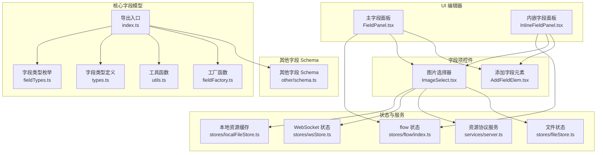
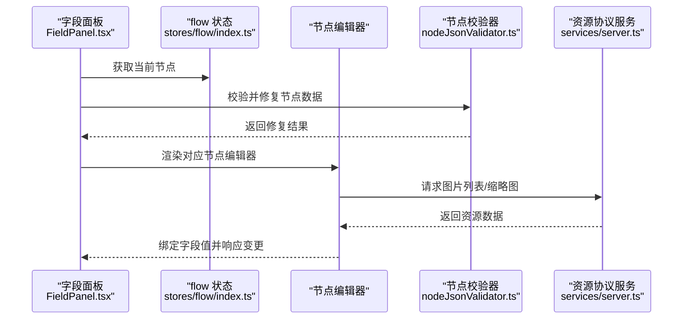
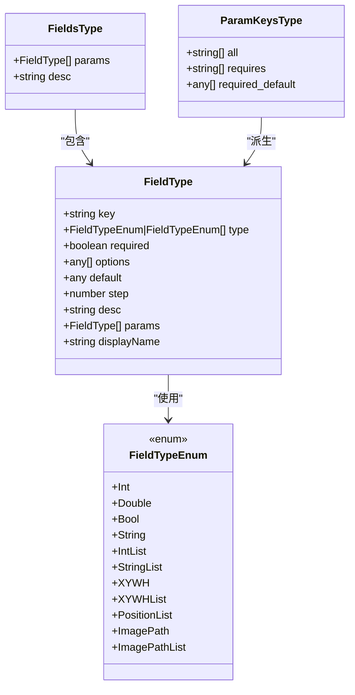
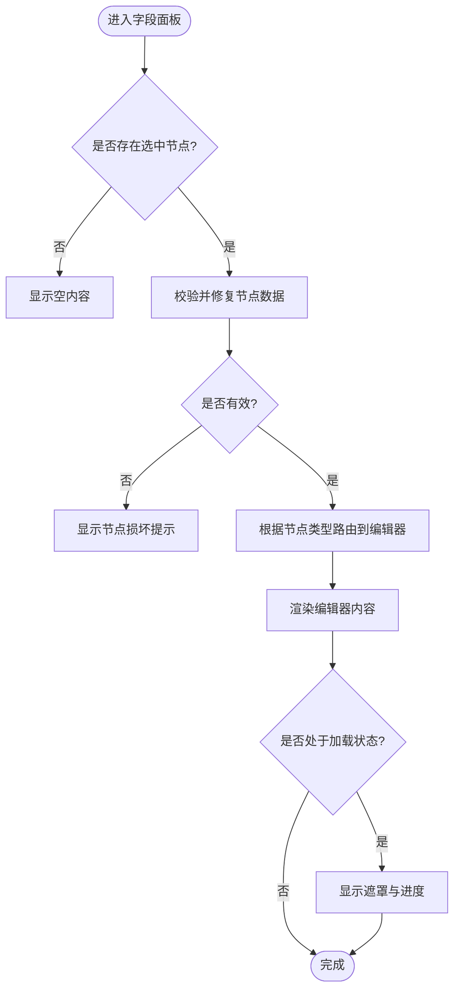
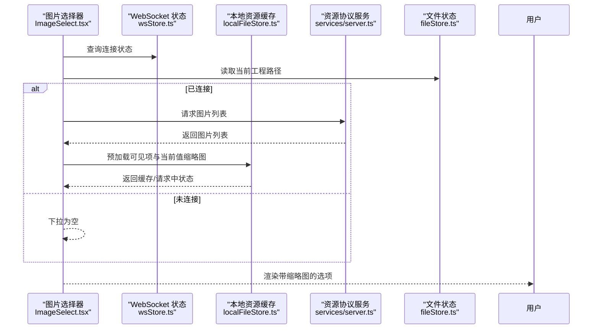
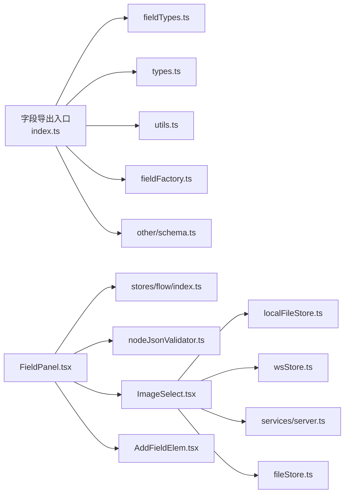

# 字段编辑器

<cite>
**本文档引用的文件**
- [src/core/fields/index.ts](file://src/core/fields/index.ts)
- [src/core/fields/types.ts](file://src/core/fields/types.ts)
- [src/core/fields/fieldTypes.ts](file://src/core/fields/fieldTypes.ts)
- [src/core/fields/utils.ts](file://src/core/fields/utils.ts)
- [src/core/fields/fieldFactory.ts](file://src/core/fields/fieldFactory.ts)
- [src/core/fields/other/schema.ts](file://src/core/fields/other/schema.ts)
- [src/components/panels/main/FieldPanel.tsx](file://src/components/panels/main/FieldPanel.tsx)
- [src/components/panels/main/InlineFieldPanel.tsx](file://src/components/panels/main/InlineFieldPanel.tsx)
- [src/components/panels/field/items/ImageSelect.tsx](file://src/components/panels/field/items/ImageSelect.tsx)
- [src/components/panels/field/items/AddFieldElem.tsx](file://src/components/panels/field/items/AddFieldElem.tsx)
- [src/stores/flow/index.ts](file://src/stores/flow/index.ts)
- [src/stores/localFileStore.ts](file://src/stores/localFileStore.ts)
- [src/services/server.ts](file://src/services/server.ts)
- [src/stores/wsStore.ts](file://src/stores/wsStore.ts)
- [src/stores/fileStore.ts](file://src/stores/fileStore.ts)
- [src/utils/node/nodeJsonValidator.ts](file://src/utils/node/nodeJsonValidator.ts)
</cite>

## 目录
1. [简介](#简介)
2. [项目结构](#项目结构)
3. [核心组件](#核心组件)
4. [架构总览](#架构总览)
5. [详细组件分析](#详细组件分析)
6. [依赖分析](#依赖分析)
7. [性能考虑](#性能考虑)
8. [故障排查指南](#故障排查指南)
9. [结论](#结论)
10. [附录](#附录)

## 简介
本文件系统性梳理字段编辑器的设计理念、架构模式与实现细节，覆盖字段类型体系、Schema 定义、动态生成与配置、数据绑定与验证、以及扩展与自定义方法。文档同时给出性能优化建议与用户体验改进建议，帮助开发者在保证一致性的同时提升易用性与稳定性。

## 项目结构
字段编辑器由“核心字段模型 + UI 编辑器 + 动态渲染 + 验证与持久化”四层构成：
- 核心字段模型：统一的字段类型、Schema 与工厂/工具函数，支撑所有节点类型的字段定义与参数提取。
- UI 编辑器：主面板与内嵌面板负责承载不同节点类型的字段编辑界面，并提供错误边界与修复能力。
- 动态渲染：根据节点类型与字段 Schema 动态生成表单项，支持文本、数值、布尔、列表、结构体、图片路径等多种输入控件。
- 验证与持久化：对节点数据进行校验与修复，支持 JSON 直接编辑与历史记录保存。

图表来源
- [src/core/fields/index.ts:1-46](file://src/core/fields/index.ts#L1-L46)
- [src/core/fields/fieldTypes.ts:1-27](file://src/core/fields/fieldTypes.ts#L1-L27)
- [src/core/fields/types.ts:1-34](file://src/core/fields/types.ts#L1-L34)
- [src/core/fields/utils.ts:1-41](file://src/core/fields/utils.ts#L1-L41)
- [src/core/fields/fieldFactory.ts:1-16](file://src/core/fields/fieldFactory.ts#L1-L16)
- [src/core/fields/other/schema.ts:1-387](file://src/core/fields/other/schema.ts#L1-L387)
- [src/components/panels/main/FieldPanel.tsx:1-491](file://src/components/panels/main/FieldPanel.tsx#L1-L491)
- [src/components/panels/main/InlineFieldPanel.tsx:174-233](file://src/components/panels/main/InlineFieldPanel.tsx#L174-L233)
- [src/components/panels/field/items/ImageSelect.tsx:1-291](file://src/components/panels/field/items/ImageSelect.tsx#L1-L291)
- [src/components/panels/field/items/AddFieldElem.tsx:1-62](file://src/components/panels/field/items/AddFieldElem.tsx#L1-L62)
- [src/stores/flow/index.ts](file://src/stores/flow/index.ts)
- [src/stores/localFileStore.ts](file://src/stores/localFileStore.ts)
- [src/stores/wsStore.ts](file://src/stores/wsStore.ts)
- [src/services/server.ts](file://src/services/server.ts)
- [src/stores/fileStore.ts](file://src/stores/fileStore.ts)

章节来源
- [src/core/fields/index.ts:1-46](file://src/core/fields/index.ts#L1-L46)
- [src/components/panels/main/FieldPanel.tsx:103-491](file://src/components/panels/main/FieldPanel.tsx#L103-L491)

## 核心组件
- 字段类型与枚举：统一定义字段类型（整数、浮点、布尔、字符串、列表、结构体、图片路径等），确保 UI 控件与数据模型一致。
- 字段 Schema：按节点类型拆分（识别、动作、其他），每个字段包含 key、type、required、default、desc、params 等元信息。
- 工具与工厂：提供参数键集合生成、大小写映射生成、字段创建辅助函数，便于批量声明与维护。
- 主面板与内嵌面板：根据当前节点类型动态渲染对应编辑器，内置错误边界与修复流程，支持 JSON 直接编辑与进度反馈。
- 字段项控件：如图片选择器、添加字段按钮等，提供直观的用户交互与资源加载能力。

章节来源
- [src/core/fields/types.ts:6-24](file://src/core/fields/types.ts#L6-L24)
- [src/core/fields/fieldTypes.ts:4-26](file://src/core/fields/fieldTypes.ts#L4-L26)
- [src/core/fields/utils.ts:6-40](file://src/core/fields/utils.ts#L6-L40)
- [src/core/fields/fieldFactory.ts:6-15](file://src/core/fields/fieldFactory.ts#L6-L15)
- [src/core/fields/other/schema.ts:7-387](file://src/core/fields/other/schema.ts#L7-L387)
- [src/components/panels/main/FieldPanel.tsx:207-345](file://src/components/panels/main/FieldPanel.tsx#L207-L345)
- [src/components/panels/main/InlineFieldPanel.tsx:174-233](file://src/components/panels/main/InlineFieldPanel.tsx#L174-L233)

## 架构总览
字段编辑器采用“模型驱动 + 动态渲染”的架构模式：
- 模型驱动：通过统一的 FieldType 与 Schema 描述字段元数据，UI 依据元数据动态生成表单控件。
- 动态渲染：根据节点类型路由到对应编辑器；编辑器内部再根据字段 Schema 渲染具体控件。
- 数据绑定：控件变更通过状态管理更新节点数据；支持批量参数键提取与默认值注入。
- 验证与修复：在渲染前对节点数据进行校验，出现可修复问题时提供一键修复与警告提示。
- 资源集成：图片选择器与本地资源服务联动，按需加载缩略图，提升交互体验。

图表来源
- [src/components/panels/main/FieldPanel.tsx:177-204](file://src/components/panels/main/FieldPanel.tsx#L177-L204)
- [src/utils/node/nodeJsonValidator.ts](file://src/utils/node/nodeJsonValidator.ts)
- [src/services/server.ts](file://src/services/server.ts)
- [src/stores/flow/index.ts](file://src/stores/flow/index.ts)

章节来源
- [src/components/panels/main/FieldPanel.tsx:103-491](file://src/components/panels/main/FieldPanel.tsx#L103-L491)
- [src/utils/node/nodeJsonValidator.ts](file://src/utils/node/nodeJsonValidator.ts)

## 详细组件分析

### 字段类型与 Schema 设计
- 字段类型枚举：涵盖基础标量、列表、结构体与图片路径等，满足识别、动作、等待冻结等场景的参数表达。
- 字段类型定义：包含 key、type、required、options、default、step、desc、params、displayName 等，支持复杂结构体参数的嵌套描述。
- 工具函数：
  - 参数键集合生成：从字段集合中提取 all、requires、required_default，便于表单初始化与必填校验。
  - 大小写映射生成：将字段集合键转为大写映射，便于兼容大小写差异。
- 工厂函数：简化字段定义与批量创建，降低样板代码。

图表来源
- [src/core/fields/types.ts:6-24](file://src/core/fields/types.ts#L6-L24)
- [src/core/fields/fieldTypes.ts:4-26](file://src/core/fields/fieldTypes.ts#L4-L26)

章节来源
- [src/core/fields/types.ts:1-34](file://src/core/fields/types.ts#L1-L34)
- [src/core/fields/fieldTypes.ts:1-27](file://src/core/fields/fieldTypes.ts#L1-L27)
- [src/core/fields/utils.ts:1-41](file://src/core/fields/utils.ts#L1-L41)
- [src/core/fields/fieldFactory.ts:1-16](file://src/core/fields/fieldFactory.ts#L1-L16)

### 主面板与内嵌面板
- 主面板（拖拽/固定）：根据节点类型路由到对应编辑器，内置错误边界捕获渲染异常并提供修复入口；支持 JSON 直接编辑与进度反馈遮罩。
- 内嵌面板（画布内）：在视口内浮动显示，适配缩放与定位，同样提供编辑器、遮罩与 JSON 编辑能力。
- 节点验证：在渲染前进行校验，若发现可修复问题则显示警告与一键修复按钮；不可修复则提示删除重建。

图表来源
- [src/components/panels/main/FieldPanel.tsx:177-204](file://src/components/panels/main/FieldPanel.tsx#L177-L204)
- [src/components/panels/main/FieldPanel.tsx:207-345](file://src/components/panels/main/FieldPanel.tsx#L207-L345)
- [src/components/panels/main/InlineFieldPanel.tsx:174-233](file://src/components/panels/main/InlineFieldPanel.tsx#L174-L233)

章节来源
- [src/components/panels/main/FieldPanel.tsx:103-491](file://src/components/panels/main/FieldPanel.tsx#L103-L491)
- [src/components/panels/main/InlineFieldPanel.tsx:174-233](file://src/components/panels/main/InlineFieldPanel.tsx#L174-L233)

### 图片选择器组件
- 功能特性：支持手动输入与下拉选择；在连接本地桥时自动拉取图片列表并预加载缩略图；提供搜索过滤与占位图。
- 性能策略：仅对可见项与当前值预加载缩略图；使用缓存与请求去重；下拉框打开时才发起请求。
- 用户体验：显示缩略图与相对路径，支持 bundle 名称展示；加载中与空状态友好提示。

图表来源
- [src/components/panels/field/items/ImageSelect.tsx:28-288](file://src/components/panels/field/items/ImageSelect.tsx#L28-L288)
- [src/stores/wsStore.ts](file://src/stores/wsStore.ts)
- [src/stores/localFileStore.ts](file://src/stores/localFileStore.ts)
- [src/services/server.ts](file://src/services/server.ts)
- [src/stores/fileStore.ts](file://src/stores/fileStore.ts)

章节来源
- [src/components/panels/field/items/ImageSelect.tsx:1-291](file://src/components/panels/field/items/ImageSelect.tsx#L1-L291)

### 添加字段元素
- 功能特性：在字段列表中展示可添加的参数项，基于字段 Schema 的 displayName 或 key 提示；点击后触发添加逻辑。
- 交互设计：使用气泡提示展示字段描述；支持批量展示可添加项。

章节来源
- [src/components/panels/field/items/AddFieldElem.tsx:12-61](file://src/components/panels/field/items/AddFieldElem.tsx#L12-L61)

### 其他字段 Schema（含等待冻结、焦点等）
- 等待冻结：支持整数与对象两种模式，参数包含 time、target、target_offset、threshold、method、rate_limit、timeout 等，用于精确控制等待画面静止的条件与行为。
- 焦点：支持多种消息类型的模板配置，可指定展示渠道（日志、提示、通知、对话框、模态框），并支持占位符替换。
- 其他通用参数：如速率限制、超时、锚点、反转、启用开关、最大命中次数、前后延时、重复执行与等待冻结等。

章节来源
- [src/core/fields/other/schema.ts:7-387](file://src/core/fields/other/schema.ts#L7-L387)

## 依赖分析
- 字段模型依赖：主入口导出字段类型、Schema、工具与工厂，形成稳定的对外接口。
- UI 依赖：面板组件依赖状态管理与资源服务；图片选择器依赖本地资源缓存与 WebSocket 状态。
- 验证依赖：节点校验器独立于 UI，提供可复用的修复逻辑。

图表来源
- [src/core/fields/index.ts:1-46](file://src/core/fields/index.ts#L1-L46)
- [src/components/panels/main/FieldPanel.tsx:103-491](file://src/components/panels/main/FieldPanel.tsx#L103-L491)
- [src/components/panels/field/items/ImageSelect.tsx:1-291](file://src/components/panels/field/items/ImageSelect.tsx#L1-L291)
- [src/components/panels/field/items/AddFieldElem.tsx:1-62](file://src/components/panels/field/items/AddFieldElem.tsx#L1-L62)
- [src/stores/flow/index.ts](file://src/stores/flow/index.ts)
- [src/stores/localFileStore.ts](file://src/stores/localFileStore.ts)
- [src/stores/wsStore.ts](file://src/stores/wsStore.ts)
- [src/services/server.ts](file://src/services/server.ts)
- [src/stores/fileStore.ts](file://src/stores/fileStore.ts)
- [src/utils/node/nodeJsonValidator.ts](file://src/utils/node/nodeJsonValidator.ts)

章节来源
- [src/core/fields/index.ts:1-46](file://src/core/fields/index.ts#L1-L46)
- [src/components/panels/main/FieldPanel.tsx:103-491](file://src/components/panels/main/FieldPanel.tsx#L103-L491)

## 性能考虑
- 按需加载与缓存
  - 图片选择器仅对可见项与当前值请求缩略图，限制并发数量，避免一次性加载过多资源。
  - 使用缓存与“请求中”标记，减少重复请求。
- 渲染优化
  - 主面板与内嵌面板均使用记忆化与防抖策略，避免不必要的重渲染。
  - 下拉框打开时才触发资源请求，减少初始负载。
- 网络与状态
  - 仅在连接状态下请求资源列表，未连接时降级为空状态，避免无效网络调用。
- 数据绑定
  - 通过参数键集合与默认值映射，减少初始化与校验成本，提升表单构建效率。

章节来源
- [src/components/panels/field/items/ImageSelect.tsx:75-102](file://src/components/panels/field/items/ImageSelect.tsx#L75-L102)
- [src/components/panels/main/FieldPanel.tsx:103-128](file://src/components/panels/main/FieldPanel.tsx#L103-L128)

## 故障排查指南
- 渲染失败
  - 现象：节点编辑器渲染报错。
  - 处理：错误边界捕获并提示可能原因；可尝试修复节点；若仍失败，建议删除并重新创建。
- 节点数据损坏
  - 现象：节点数据结构缺失或不合法。
  - 处理：面板顶部显示警告与一键修复按钮；修复后自动应用；若不可修复，提示删除重建。
- 图片列表为空或加载缓慢
  - 现象：图片选择器下拉为空或加载中。
  - 处理：确认已连接本地桥；等待资源列表返回；检查网络与资源路径；查看缓存与请求队列状态。

章节来源
- [src/components/panels/main/FieldPanel.tsx:40-100](file://src/components/panels/main/FieldPanel.tsx#L40-L100)
- [src/components/panels/main/FieldPanel.tsx:177-204](file://src/components/panels/main/FieldPanel.tsx#L177-L204)
- [src/components/panels/field/items/ImageSelect.tsx:53-62](file://src/components/panels/field/items/ImageSelect.tsx#L53-L62)

## 结论
字段编辑器通过“模型驱动 + 动态渲染 + 资源集成 + 验证修复”的架构，实现了跨节点类型的统一字段编辑体验。其清晰的类型体系、灵活的 Schema 定义与完善的工具链，使得扩展与自定义变得简单；结合按需加载、缓存与记忆化等性能策略，兼顾了交互流畅性与系统稳定性。建议在新增字段类型时遵循现有模式，保持 Schema 与控件的一致性，并充分利用验证与修复机制保障数据质量。

## 附录
- 扩展与自定义指南
  - 新增字段类型：在字段类型枚举中添加新类型，并在相应 Schema 中使用。
  - 新增字段参数：使用工厂函数创建字段条目，补充 key、type、default、desc、params 等元信息。
  - 新增控件：在字段项控件目录中实现新控件，遵循受控组件模式，接入状态管理与资源服务。
  - 新增节点编辑器：在主面板路由中添加新节点类型的渲染分支，确保错误边界与修复流程覆盖。
  - 参数键与默认值：利用工具函数生成参数键集合与默认值映射，减少样板代码。
- 最佳实践
  - 保持字段 Schema 的可读性与一致性，优先使用 displayName 提升可读性。
  - 对复杂结构体参数（如等待冻结、焦点）提供清晰的 params 描述与默认值。
  - 在控件层面做好空状态与加载状态的提示，提升用户体验。
  - 对资源类控件（如图片选择器）实施按需加载与缓存策略，避免性能瓶颈。