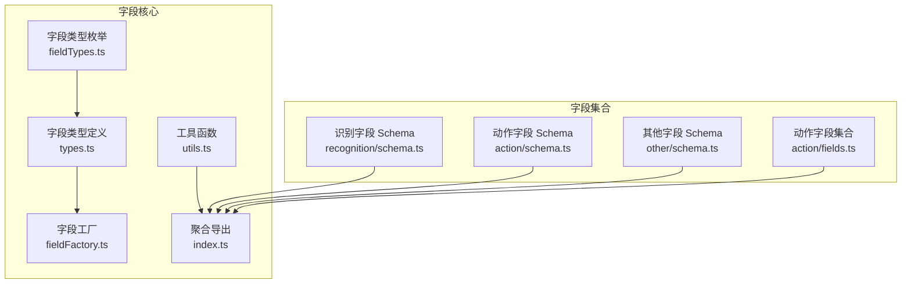
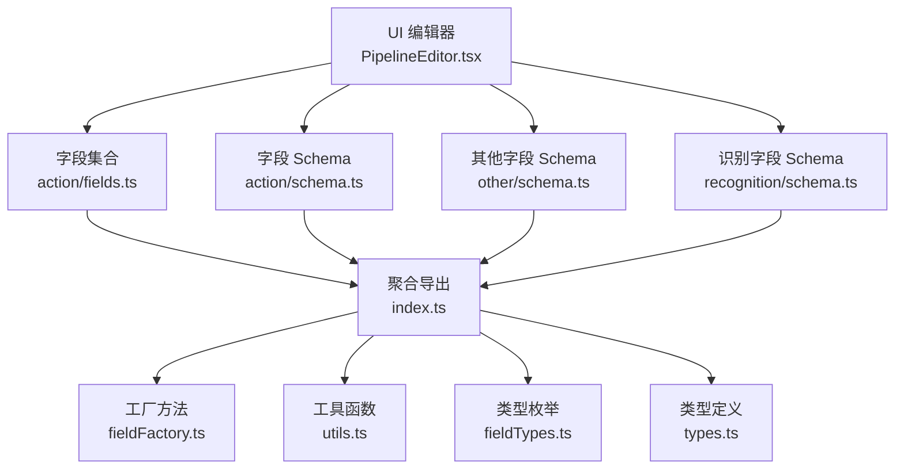
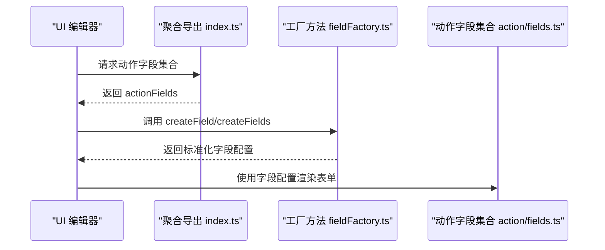
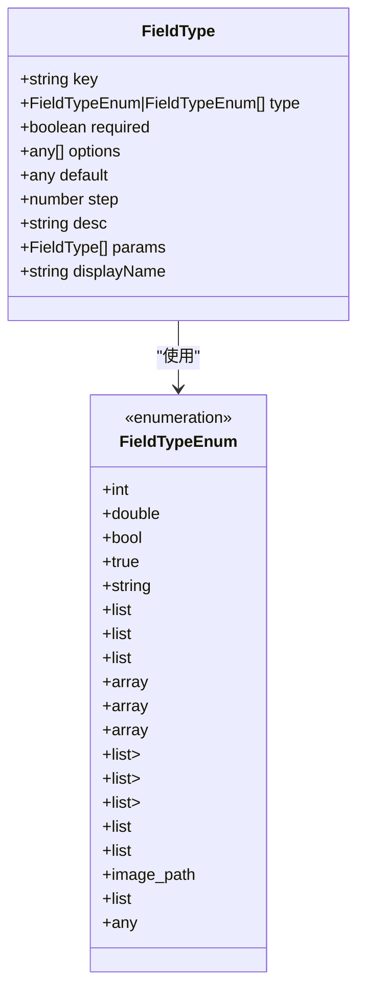
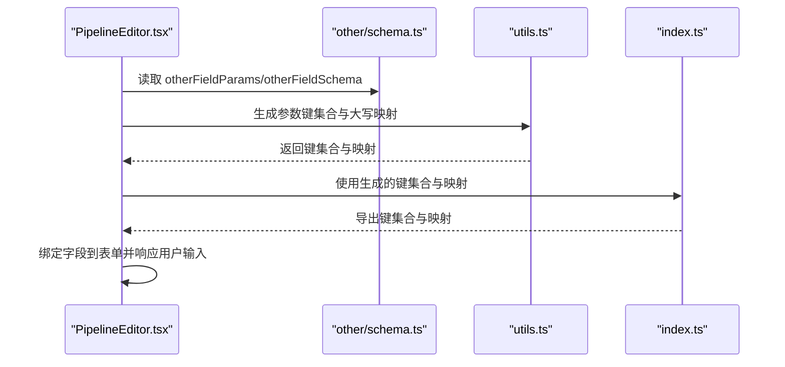
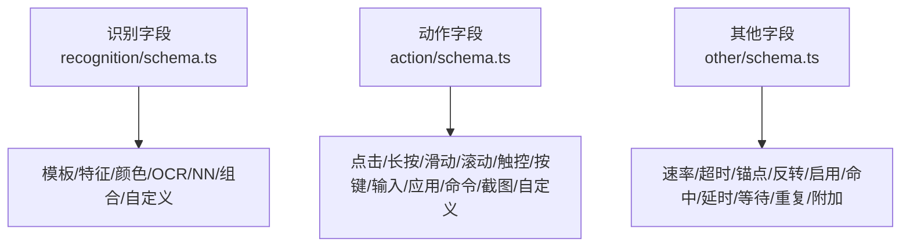
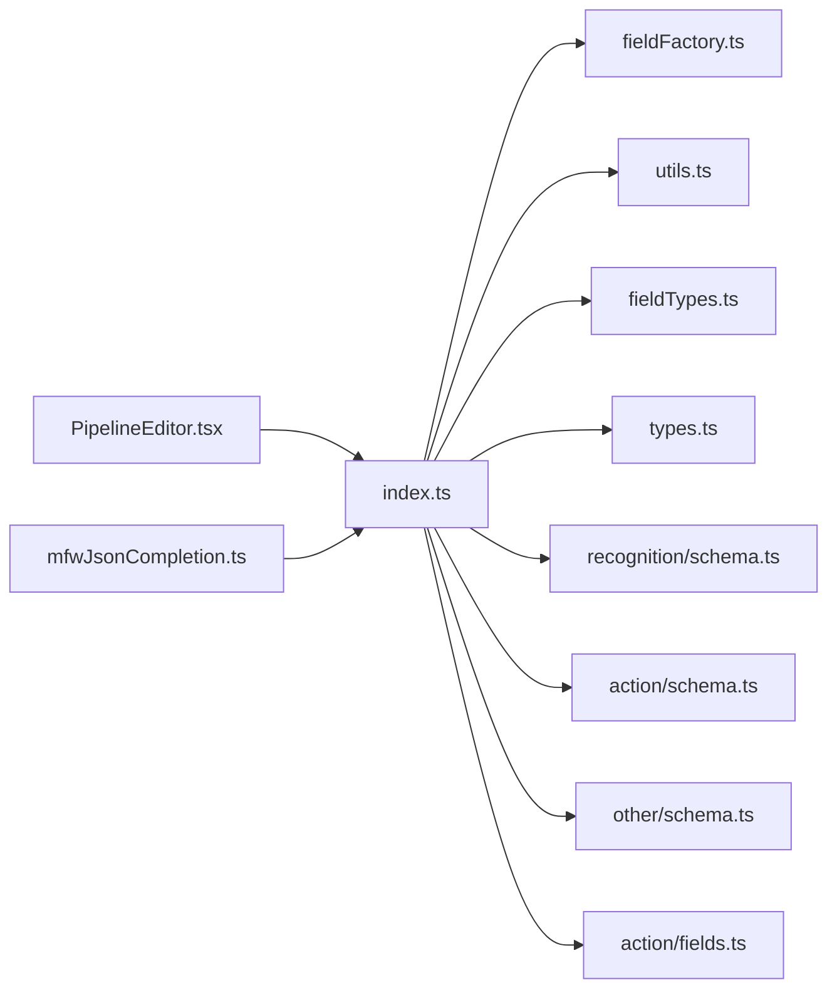

# 字段编辑器核心架构

<cite>
**本文档引用的文件**
- [fieldFactory.ts](file://src/core/fields/fieldFactory.ts)
- [types.ts](file://src/core/fields/types.ts)
- [fieldTypes.ts](file://src/core/fields/fieldTypes.ts)
- [index.ts](file://src/core/fields/index.ts)
- [utils.ts](file://src/core/fields/utils.ts)
- [fields.ts](file://src/core/fields.ts)
- [action/schema.ts](file://src/core/fields/action/schema.ts)
- [action/fields.ts](file://src/core/fields/action/fields.ts)
- [other/schema.ts](file://src/core/fields/other/schema.ts)
- [recognition/schema.ts](file://src/core/fields/recognition/schema.ts)
- [PipelineEditor.tsx](file://src/components/panels/node-editors/PipelineEditor.tsx)
- [mfwJsonCompletion.ts](file://src/components/json/mfwJsonCompletion.ts)
</cite>

## 目录
1. [简介](#简介)
2. [项目结构](#项目结构)
3. [核心组件](#核心组件)
4. [架构总览](#架构总览)
5. [详细组件分析](#详细组件分析)
6. [依赖关系分析](#依赖关系分析)
7. [性能考量](#性能考量)
8. [故障排查指南](#故障排查指南)
9. [结论](#结论)
10. [附录](#附录)

## 简介
本文件系统性梳理字段编辑器的核心架构，重点围绕“字段工厂模式”展开，解释字段类型定义、工厂方法与动态创建机制；详解字段类型系统（基础类型、复合类型、自定义类型）；阐述字段验证与数据绑定；给出扩展接口与自定义指南；并总结性能优化策略与最佳实践。

## 项目结构
字段编辑器位于前端工程的 core/fields 目录，采用模块化分层设计：
- 类型与枚举：定义字段类型、集合与参数键映射
- 字段工厂：提供 createField/createFields 简化字段声明
- 字段类型系统：通过枚举 FieldTypeEnum 描述基础与复合类型
- 字段集合：按功能域拆分为 recognition、action、other 三类
- 工具函数：生成参数键集合、大写映射
- 导出聚合：统一导出类型、枚举、字段集合与工具函数

**图表来源**
- [types.ts:1-34](file://src/core/fields/types.ts#L1-L34)
- [fieldTypes.ts:1-27](file://src/core/fields/fieldTypes.ts#L1-L27)
- [fieldFactory.ts:1-16](file://src/core/fields/fieldFactory.ts#L1-L16)
- [utils.ts:1-41](file://src/core/fields/utils.ts#L1-L41)
- [index.ts:1-46](file://src/core/fields/index.ts#L1-L46)
- [recognition/schema.ts:1-276](file://src/core/fields/recognition/schema.ts#L1-L276)
- [action/schema.ts:1-316](file://src/core/fields/action/schema.ts#L1-L316)
- [other/schema.ts:1-387](file://src/core/fields/other/schema.ts#L1-L387)
- [action/fields.ts:1-149](file://src/core/fields/action/fields.ts#L1-L149)

**章节来源**
- [index.ts:1-46](file://src/core/fields/index.ts#L1-L46)
- [fields.ts:1-2](file://src/core/fields.ts#L1-L2)

## 核心组件
- 字段类型定义：描述字段的键、类型、默认值、步长、描述、选项、是否必填、子参数等
- 字段类型枚举：统一的基础与复合类型标识，覆盖数值、布尔、字符串、列表、数组、对象、图片路径等
- 字段工厂：提供 createField/createFields，简化字段声明与批量创建
- 字段集合：按功能域组织字段 Schema 与集合，便于 UI 与校验使用
- 工具函数：生成参数键集合、生成大写映射，便于大小写无关查找与排序

**章节来源**
- [types.ts:6-24](file://src/core/fields/types.ts#L6-L24)
- [fieldTypes.ts:4-26](file://src/core/fields/fieldTypes.ts#L4-L26)
- [fieldFactory.ts:6-15](file://src/core/fields/fieldFactory.ts#L6-L15)
- [utils.ts:6-40](file://src/core/fields/utils.ts#L6-L40)

## 架构总览
字段编辑器采用“工厂 + 枚举 + Schema + 集合”的分层架构：
- 工厂层：提供便捷的字段创建 API
- 类型层：统一字段类型定义与枚举
- 集合层：按领域划分字段 Schema 与集合
- 工具层：参数键生成、大小写映射
- UI 层：通过字段集合驱动表单渲染与数据绑定

**图表来源**
- [PipelineEditor.tsx:458-495](file://src/components/panels/node-editors/PipelineEditor.tsx#L458-L495)
- [action/fields.ts:7-149](file://src/core/fields/action/fields.ts#L7-L149)
- [action/schema.ts:7-291](file://src/core/fields/action/schema.ts#L7-L291)
- [other/schema.ts:7-386](file://src/core/fields/other/schema.ts#L7-L386)
- [recognition/schema.ts:7-268](file://src/core/fields/recognition/schema.ts#L7-L268)
- [index.ts:7-29](file://src/core/fields/index.ts#L7-L29)
- [fieldFactory.ts:6-15](file://src/core/fields/fieldFactory.ts#L6-L15)
- [utils.ts:6-40](file://src/core/fields/utils.ts#L6-L40)
- [fieldTypes.ts:4-26](file://src/core/fields/fieldTypes.ts#L4-L26)
- [types.ts:6-24](file://src/core/fields/types.ts#L6-L24)

## 详细组件分析

### 字段工厂模式与动态创建
- 工厂方法
  - createField：接收 FieldType 配置，返回原配置，用于简化字段声明
  - createFields：批量创建字段，返回字段数组
- 动态创建机制
  - 字段集合通过 Schema 定义字段，配合工厂方法实现声明式构建
  - 聚合导出 index.ts 将各领域字段集合统一导出，供 UI 使用

**图表来源**
- [index.ts:7-29](file://src/core/fields/index.ts#L7-L29)
- [fieldFactory.ts:6-15](file://src/core/fields/fieldFactory.ts#L6-L15)
- [action/fields.ts:7-149](file://src/core/fields/action/fields.ts#L7-L149)

**章节来源**
- [fieldFactory.ts:6-15](file://src/core/fields/fieldFactory.ts#L6-L15)
- [index.ts:35-35](file://src/core/fields/index.ts#L35-L35)

### 字段类型系统
- 基础字段类型
  - 数值：Int、Double、IntList、DoubleList
  - 布尔：Bool、True
  - 字符串：String、StringList、ImagePath、ImagePathList
  - 数组：XYWH、XYWHList、IntPair、StringPair、StringPairList
  - 对象：Any、ObjectList、StringOrObjectList
- 复合字段类型
  - 位置/区域：PositionList（支持 true | string | array<int, 4>）
  - 列表嵌套：IntListList、StringPairList、XYWHList
  - 结构化字段：含 params 子字段（如 focus、waitFreezes）
- 自定义字段类型
  - 通过 Any、ObjectList、StringOrObjectList 支持自定义对象与混合类型
  - 识别/动作/其他领域通过 Schema 定义专用字段，形成领域特定类型族

**图表来源**
- [types.ts:6-16](file://src/core/fields/types.ts#L6-L16)
- [fieldTypes.ts:4-26](file://src/core/fields/fieldTypes.ts#L4-L26)

**章节来源**
- [fieldTypes.ts:4-26](file://src/core/fields/fieldTypes.ts#L4-L26)
- [types.ts:6-16](file://src/core/fields/types.ts#L6-L16)

### 字段验证机制
- 必填校验：required 标记字段在集合中强制存在
- 类型校验：根据 FieldTypeEnum 约束字段类型与取值范围
- 选项校验：options 提供可选值集合，确保输入合法
- 默认值校验：default 提供回退值，保证字段完整性
- 结构化字段校验：params 子字段定义嵌套结构，支持深层校验
- 实际应用
  - UI 层依据字段集合与 Schema 渲染表单并进行即时校验
  - JSON 补全与提示依赖字段键集合与描述信息

**章节来源**
- [types.ts:9-16](file://src/core/fields/types.ts#L9-L16)
- [action/schema.ts:9-291](file://src/core/fields/action/schema.ts#L9-L291)
- [other/schema.ts:7-386](file://src/core/fields/other/schema.ts#L7-L386)
- [recognition/schema.ts:7-268](file://src/core/fields/recognition/schema.ts#L7-L268)

### 数据绑定系统
- 字段到 UI 的绑定
  - PipelineEditor.tsx 通过字段集合渲染 AddFieldElem 等组件，实现字段增删改查
  - onListAdd/onListEdit/onListDelete 等回调负责数据变更
- 字段键与集合的映射
  - utils.ts 生成参数键集合与大写映射，便于大小写无关查找
  - index.ts 导出生成后的键集合与映射，供编辑器与补全使用

**图表来源**
- [PipelineEditor.tsx:480-495](file://src/components/panels/node-editors/PipelineEditor.tsx#L480-L495)
- [other/schema.ts:343-387](file://src/core/fields/other/schema.ts#L343-L387)
- [utils.ts:6-40](file://src/core/fields/utils.ts#L6-L40)
- [index.ts:42-45](file://src/core/fields/index.ts#L42-L45)

**章节来源**
- [PipelineEditor.tsx:458-495](file://src/components/panels/node-editors/PipelineEditor.tsx#L458-L495)
- [utils.ts:6-40](file://src/core/fields/utils.ts#L6-L40)
- [index.ts:42-45](file://src/core/fields/index.ts#L42-L45)

### 字段编辑器扩展接口与自定义指南
- 新增字段类型
  - 在 fieldTypes.ts 中扩展 FieldTypeEnum
  - 在 types.ts 中完善 FieldType 以支持新类型
- 新增字段集合
  - 在相应领域目录（如 recognition、action、other）新增 Schema 与字段集合
  - 在 index.ts 中导出新的字段集合与工具函数
- 新增字段验证规则
  - 在字段 Schema 中设置 required、options、default、step 等约束
  - 如需复杂校验，可在 UI 层补充校验逻辑
- 新增数据绑定行为
  - 在 UI 组件中扩展 AddFieldElem 等组件，支持新字段类型的渲染与交互
  - 通过回调函数实现数据变更与持久化

**章节来源**
- [fieldTypes.ts:4-26](file://src/core/fields/fieldTypes.ts#L4-L26)
- [types.ts:6-16](file://src/core/fields/types.ts#L6-L16)
- [index.ts:7-29](file://src/core/fields/index.ts#L7-L29)

### 字段类型系统详解
- 识别字段（recognition）
  - ROI、模板匹配、特征匹配、颜色匹配、OCR、神经网络、组合识别、自定义识别
  - 支持多种排序与预期匹配策略
- 动作字段（action）
  - 点击、长按、滑动、多指滑动、滚动、触控、按键、输入、应用控制、命令执行、截图、自定义动作
  - 支持目标定位、偏移、压力、接触点、时序等参数
- 其他字段（other）
  - 速率限制、超时、锚点、反转、启用、最大命中、延时、等待画面静止、重复执行、附加信息等
  - 支持结构化参数（如 focus、waitFreezes）

**图表来源**
- [recognition/schema.ts:7-268](file://src/core/fields/recognition/schema.ts#L7-L268)
- [action/schema.ts:7-291](file://src/core/fields/action/schema.ts#L7-L291)
- [other/schema.ts:7-386](file://src/core/fields/other/schema.ts#L7-L386)

**章节来源**
- [recognition/schema.ts:7-268](file://src/core/fields/recognition/schema.ts#L7-L268)
- [action/schema.ts:7-291](file://src/core/fields/action/schema.ts#L7-L291)
- [other/schema.ts:7-386](file://src/core/fields/other/schema.ts#L7-L386)

## 依赖关系分析
- 模块耦合
  - index.ts 作为聚合导出，集中管理字段集合与工具函数
  - utils.ts 依赖字段集合生成键集合与映射，被 index.ts 导出
  - 各领域 Schema 与 fields 通过 index.ts 聚合，降低 UI 层耦合
- 外部依赖
  - UI 层通过 PipelineEditor.tsx 与 mfwJsonCompletion.ts 使用字段集合
  - JSON 补全依赖字段键集合与描述信息

**图表来源**
- [index.ts:1-46](file://src/core/fields/index.ts#L1-L46)
- [fieldFactory.ts:1-16](file://src/core/fields/fieldFactory.ts#L1-L16)
- [utils.ts:1-41](file://src/core/fields/utils.ts#L1-L41)
- [fieldTypes.ts:1-27](file://src/core/fields/fieldTypes.ts#L1-L27)
- [types.ts:1-34](file://src/core/fields/types.ts#L1-L34)
- [recognition/schema.ts:1-276](file://src/core/fields/recognition/schema.ts#L1-L276)
- [action/schema.ts:1-316](file://src/core/fields/action/schema.ts#L1-L316)
- [other/schema.ts:1-387](file://src/core/fields/other/schema.ts#L1-L387)
- [action/fields.ts:1-149](file://src/core/fields/action/fields.ts#L1-L149)
- [PipelineEditor.tsx:458-495](file://src/components/panels/node-editors/PipelineEditor.tsx#L458-L495)
- [mfwJsonCompletion.ts:333-380](file://src/components/json/mfwJsonCompletion.ts#L333-L380)

**章节来源**
- [index.ts:1-46](file://src/core/fields/index.ts#L1-L46)
- [mfwJsonCompletion.ts:333-380](file://src/components/json/mfwJsonCompletion.ts#L333-L380)

## 性能考量
- 字段集合预计算
  - 通过 utils.ts 生成参数键集合与大写映射，避免运行时重复计算
  - index.ts 导出预计算结果，减少 UI 层开销
- 渲染优化
  - 使用字段集合驱动表单渲染，避免冗余 DOM
  - 对结构化字段（如 focus、waitFreezes）采用懒加载与条件渲染
- 数据绑定优化
  - 通过回调函数精准更新数据，避免不必要的重渲染
  - 列表操作（增删改）采用就地修改与最小化更新策略

[本节为通用性能指导，无需具体文件引用]

## 故障排查指南
- 字段缺失或类型错误
  - 检查字段 Schema 是否正确设置 required、type、default
  - 确认字段键集合与映射是否正确生成与导出
- UI 不显示或渲染异常
  - 核对 PipelineEditor.tsx 中字段集合使用是否正确
  - 检查 AddFieldElem 等组件的参数传递
- JSON 补全不生效
  - 确认 mfwJsonCompletion.ts 中字段键集合与描述信息是否正确
  - 检查字段集合导出是否完整

**章节来源**
- [utils.ts:6-25](file://src/core/fields/utils.ts#L6-L25)
- [index.ts:42-45](file://src/core/fields/index.ts#L42-L45)
- [PipelineEditor.tsx:480-495](file://src/components/panels/node-editors/PipelineEditor.tsx#L480-L495)
- [mfwJsonCompletion.ts:333-380](file://src/components/json/mfwJsonCompletion.ts#L333-L380)

## 结论
字段编辑器通过工厂模式、统一类型系统与模块化集合设计，实现了高内聚、低耦合的字段管理架构。配合工具函数与聚合导出，为 UI 层提供了简洁、稳定的字段能力。通过扩展接口与自定义指南，开发者可快速新增字段类型与集合，满足复杂业务场景。

## 附录
- 字段工厂 API
  - createField：简化字段声明
  - createFields：批量创建字段
- 工具函数
  - generateParamKeys：从字段配置生成参数键映射
  - generateUpperValues：生成大写值映射
- 聚合导出
  - 导出类型、枚举、字段集合与工具函数，供 UI 使用

**章节来源**
- [fieldFactory.ts:6-15](file://src/core/fields/fieldFactory.ts#L6-L15)
- [utils.ts:6-40](file://src/core/fields/utils.ts#L6-L40)
- [index.ts:1-46](file://src/core/fields/index.ts#L1-L46)