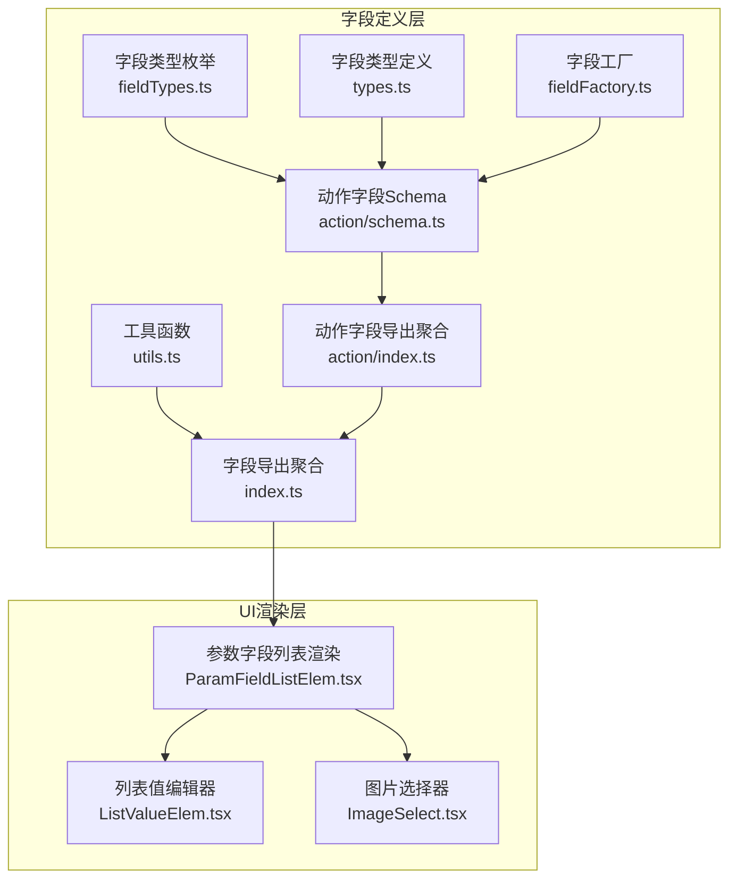
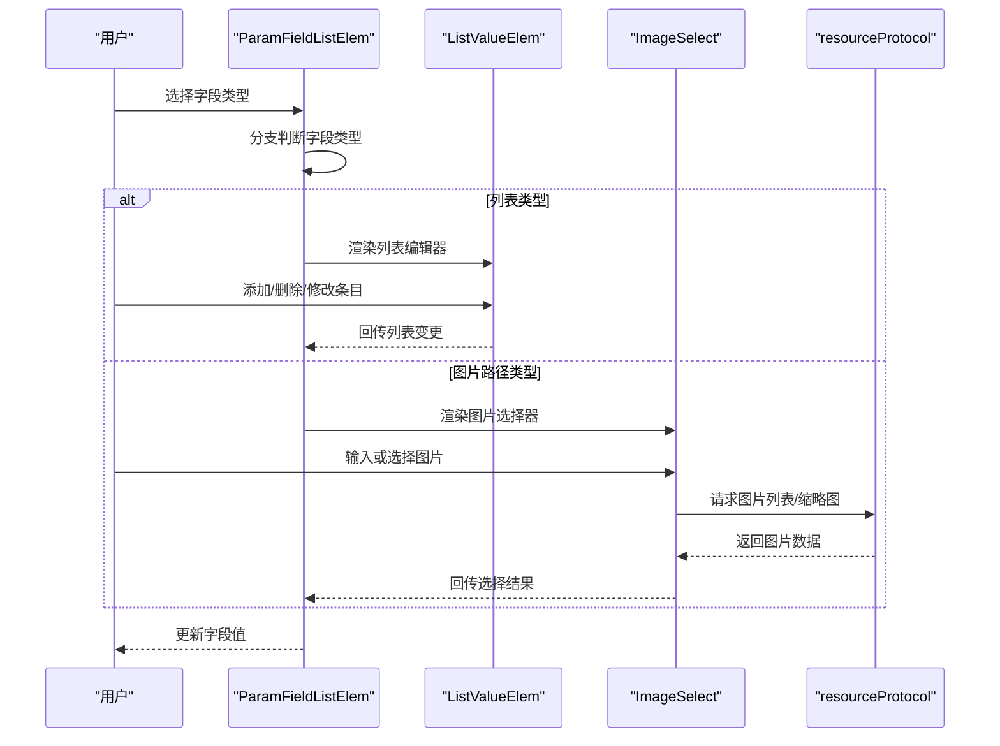
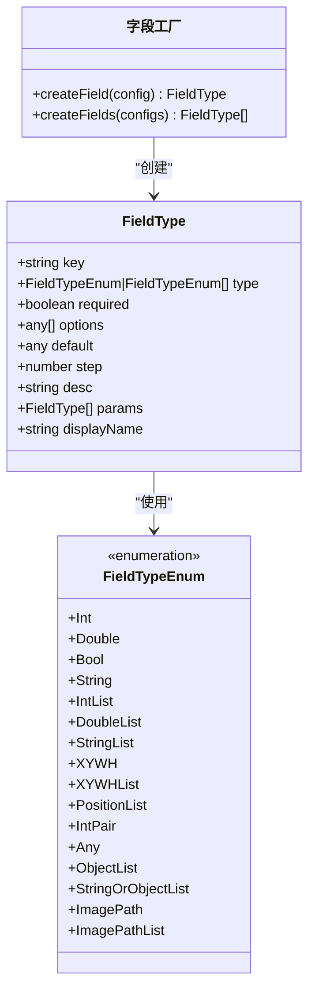
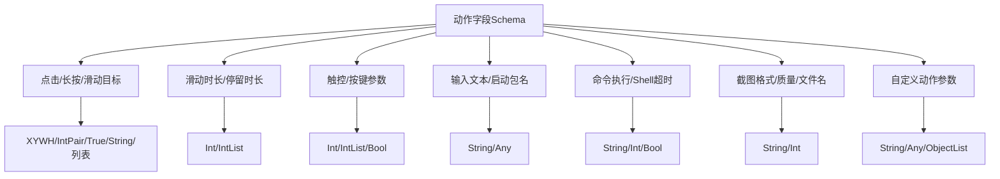
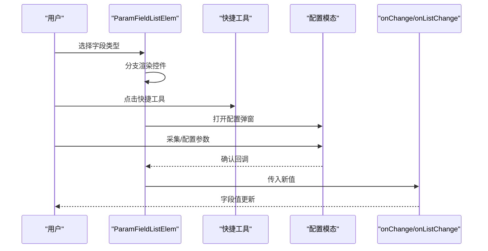
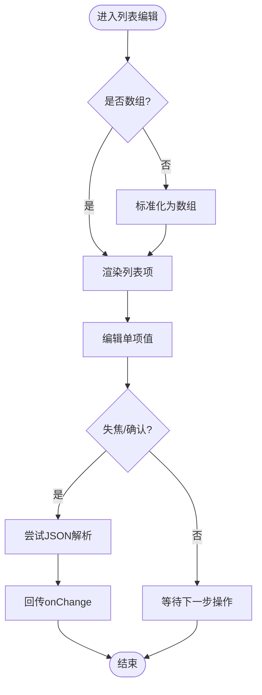
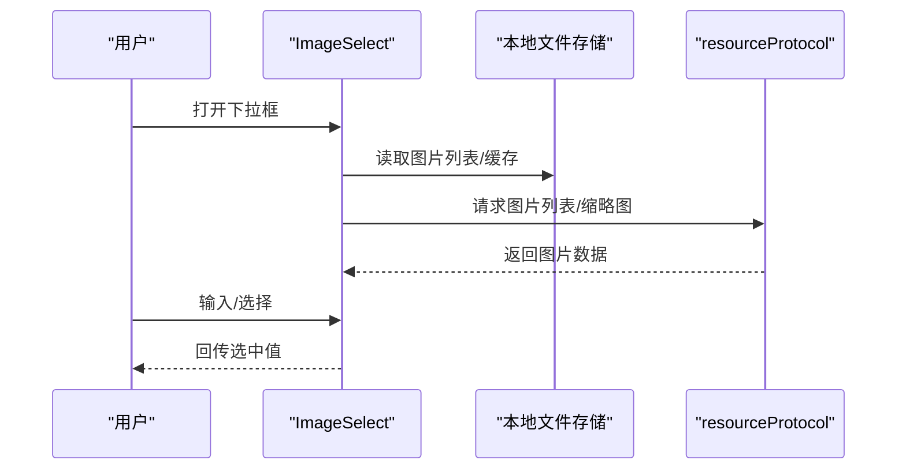
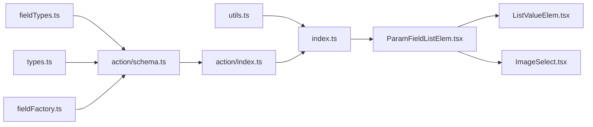

# 字段编辑器组件

<cite>
**本文档引用的文件**
- [src/core/fields/index.ts](file://src/core/fields/index.ts)
- [src/core/fields/types.ts](file://src/core/fields/types.ts)
- [src/core/fields/fieldFactory.ts](file://src/core/fields/fieldFactory.ts)
- [src/core/fields/utils.ts](file://src/core/fields/utils.ts)
- [src/core/fields/fieldTypes.ts](file://src/core/fields/fieldTypes.ts)
- [src/core/fields/action/schema.ts](file://src/core/fields/action/schema.ts)
- [src/core/fields/action/index.ts](file://src/core/fields/action/index.ts)
- [src/components/panels/field/items/ImageSelect.tsx](file://src/components/panels/field/items/ImageSelect.tsx)
- [src/components/panels/field/items/ListValueElem.tsx](file://src/components/panels/field/items/ListValueElem.tsx)
- [src/components/panels/field/items/ParamFieldListElem.tsx](file://src/components/panels/field/items/ParamFieldListElem.tsx)
- [src/components/panels/field/items/index.ts](file://src/components/panels/field/items/index.ts)
</cite>

## 目录
1. [简介](#简介)
2. [项目结构](#项目结构)
3. [核心组件](#核心组件)
4. [架构总览](#架构总览)
5. [详细组件分析](#详细组件分析)
6. [依赖关系分析](#依赖关系分析)
7. [性能考量](#性能考量)
8. [故障排查指南](#故障排查指南)
9. [结论](#结论)
10. [附录](#附录)

## 简介
本文件系统性梳理字段编辑器组件的设计与实现，覆盖文本输入、选择器、图片选择器、列表值等常见编辑形态；阐明字段类型体系、字段工厂与工具函数的作用；解释组件间交互与数据传递机制；并提供样式定制与主题适配建议，以及扩展与自定义指南。

## 项目结构
字段编辑器由“字段定义层”和“UI渲染层”两部分组成：
- 字段定义层：统一管理字段类型、字段工厂、工具函数与各业务领域的字段 Schema（如动作领域）。
- UI渲染层：根据字段类型动态渲染不同输入控件，提供快捷工具、模态弹窗、列表增删改等交互能力。

**图表来源**
- [src/core/fields/fieldTypes.ts:1-27](file://src/core/fields/fieldTypes.ts#L1-L27)
- [src/core/fields/types.ts:1-34](file://src/core/fields/types.ts#L1-L34)
- [src/core/fields/fieldFactory.ts:1-16](file://src/core/fields/fieldFactory.ts#L1-L16)
- [src/core/fields/utils.ts:1-41](file://src/core/fields/utils.ts#L1-L41)
- [src/core/fields/action/schema.ts:1-316](file://src/core/fields/action/schema.ts#L1-L316)
- [src/core/fields/action/index.ts:1-7](file://src/core/fields/action/index.ts#L1-L7)
- [src/core/fields/index.ts:1-46](file://src/core/fields/index.ts#L1-L46)
- [src/components/panels/field/items/ParamFieldListElem.tsx:1-789](file://src/components/panels/field/items/ParamFieldListElem.tsx#L1-L789)
- [src/components/panels/field/items/ListValueElem.tsx:1-149](file://src/components/panels/field/items/ListValueElem.tsx#L1-L149)
- [src/components/panels/field/items/ImageSelect.tsx:1-291](file://src/components/panels/field/items/ImageSelect.tsx#L1-L291)

**章节来源**
- [src/core/fields/index.ts:1-46](file://src/core/fields/index.ts#L1-L46)
- [src/core/fields/action/index.ts:1-7](file://src/core/fields/action/index.ts#L1-L7)

## 核心组件
- 字段类型体系：通过枚举定义基础类型与复合类型，支撑 UI 渲染与数据校验。
- 字段工厂：提供 createField/createFields 简化字段定义。
- 工具函数：生成参数键集合、默认值集合与大写映射，便于统一处理。
- 动作字段 Schema：集中描述动作类节点的参数键、类型、默认值与说明。
- 参数字段列表渲染器：根据字段类型动态渲染输入控件，支持快捷工具与模态弹窗。
- 列表值编辑器：统一处理数组/列表类型的输入，支持增删改与步进数值。
- 图片选择器：结合本地资源协议，提供自动补全与缩略图预览。

**章节来源**
- [src/core/fields/fieldTypes.ts:1-27](file://src/core/fields/fieldTypes.ts#L1-L27)
- [src/core/fields/fieldFactory.ts:1-16](file://src/core/fields/fieldFactory.ts#L1-L16)
- [src/core/fields/utils.ts:1-41](file://src/core/fields/utils.ts#L1-L41)
- [src/core/fields/action/schema.ts:1-316](file://src/core/fields/action/schema.ts#L1-L316)
- [src/components/panels/field/items/ParamFieldListElem.tsx:1-789](file://src/components/panels/field/items/ParamFieldListElem.tsx#L1-L789)
- [src/components/panels/field/items/ListValueElem.tsx:1-149](file://src/components/panels/field/items/ListValueElem.tsx#L1-L149)
- [src/components/panels/field/items/ImageSelect.tsx:1-291](file://src/components/panels/field/items/ImageSelect.tsx#L1-L291)

## 架构总览
字段编辑器采用“类型驱动 + 动态渲染”的架构：
- 类型驱动：以 FieldTypeEnum 与 FieldType 描述字段元信息。
- 动态渲染：ParamFieldListElem 根据字段类型分支渲染不同控件。
- 数据通道：onChange/onListChange 等回调逐层向上回传，保持父子组件解耦。
- 快捷工具：通过模态弹窗与设备连接状态联动，提升编辑效率。

**图表来源**
- [src/components/panels/field/items/ParamFieldListElem.tsx:435-683](file://src/components/panels/field/items/ParamFieldListElem.tsx#L435-L683)
- [src/components/panels/field/items/ListValueElem.tsx:60-149](file://src/components/panels/field/items/ListValueElem.tsx#L60-L149)
- [src/components/panels/field/items/ImageSelect.tsx:54-102](file://src/components/panels/field/items/ImageSelect.tsx#L54-L102)

## 详细组件分析

### 字段类型与工厂
- 字段类型枚举：涵盖整型、浮点、布尔、字符串、列表、坐标数组、对象列表、图片路径等。
- 字段类型定义：统一字段结构，包含 key、type、required、options、default、step、desc、params、displayName 等。
- 字段工厂：提供 createField/createFields，简化字段声明。
- 工具函数：generateParamKeys 生成字段键集合（all/requires/required_default），generateUpperValues 生成大写映射。

**图表来源**
- [src/core/fields/types.ts:6-16](file://src/core/fields/types.ts#L6-L16)
- [src/core/fields/fieldTypes.ts:4-26](file://src/core/fields/fieldTypes.ts#L4-L26)
- [src/core/fields/fieldFactory.ts:6-15](file://src/core/fields/fieldFactory.ts#L6-L15)

**章节来源**
- [src/core/fields/types.ts:1-34](file://src/core/fields/types.ts#L1-L34)
- [src/core/fields/fieldTypes.ts:1-27](file://src/core/fields/fieldTypes.ts#L1-L27)
- [src/core/fields/fieldFactory.ts:1-16](file://src/core/fields/fieldFactory.ts#L1-L16)
- [src/core/fields/utils.ts:6-40](file://src/core/fields/utils.ts#L6-L40)

### 动作字段 Schema
- 集中定义动作类节点的参数键、类型、默认值与说明，覆盖点击、长按、滑动、触控、按键、输入、应用、命令、截图、自定义动作等场景。
- 提供字段键列表与多 Swipe 内部字段排序列表，确保渲染顺序与业务一致性。

**图表来源**
- [src/core/fields/action/schema.ts:7-291](file://src/core/fields/action/schema.ts#L7-L291)

**章节来源**
- [src/core/fields/action/schema.ts:1-316](file://src/core/fields/action/schema.ts#L1-L316)
- [src/core/fields/action/index.ts:1-7](file://src/core/fields/action/index.ts#L1-L7)

### 参数字段列表渲染器（ParamFieldListElem）
- 功能特性
  - 动态渲染：根据字段类型分支渲染选择器、开关、数字输入、文本域、列表编辑器、图片选择器等。
  - 快捷工具：针对 ROI、OCR、模板、颜色、位移差值、ROI偏移等提供一键采集与配置。
  - 列表管理：支持列表字段的增删改与步进数值输入。
  - 模态弹窗：在设备连接状态下打开相应配置弹窗，确认后回填值。
  - 排序控制：支持按指定顺序渲染字段。
- 属性配置
  - 参数：paramData、paramType、onChange、onDelete、onListChange、onListAdd、onListDelete、sortOrder。
  - 依赖：mfw 连接状态、模态弹窗状态、当前操作的列表索引。
- 使用方法
  - 将字段类型数组与当前值传入，组件自动渲染对应输入控件与快捷工具。
  - 通过回调函数向上回传变更，保持数据流单向。

**图表来源**
- [src/components/panels/field/items/ParamFieldListElem.tsx:73-788](file://src/components/panels/field/items/ParamFieldListElem.tsx#L73-L788)

**章节来源**
- [src/components/panels/field/items/ParamFieldListElem.tsx:1-789](file://src/components/panels/field/items/ParamFieldListElem.tsx#L1-L789)

### 列表值编辑器（ListValueElem）
- 功能特性
  - 统一处理字符串/数组/对象/数字列表，支持 JSON 解析与回退。
  - 数字列表支持步进（step）与精确度控制。
  - 列表项支持快捷工具、删除与新增。
- 属性配置
  - 参数：key、valueList、onChange、onAdd、onDelete、placeholder、step、quickToolRender。
  - 行为：失焦时提交，允许 JSON 字符串与原始字符串混合。
- 使用方法
  - 作为 ParamFieldListElem 的子组件，用于渲染列表字段。

**图表来源**
- [src/components/panels/field/items/ListValueElem.tsx:60-149](file://src/components/panels/field/items/ListValueElem.tsx#L60-L149)

**章节来源**
- [src/components/panels/field/items/ListValueElem.tsx:1-149](file://src/components/panels/field/items/ListValueElem.tsx#L1-L149)

### 图片选择器（ImageSelect）
- 功能特性
  - 下拉自动补全 + 手动输入组合模式。
  - 连接 LocalBridge 时请求图片列表与缩略图，支持搜索过滤与占位图。
  - 仅在可见项与当前值范围内请求缩略图，限制并发数量以优化性能。
- 属性配置
  - 参数：value、onChange、placeholder、inList。
  - 依赖：WebSocket 连接状态、当前文件路径、本地图片缓存与待请求集合。
- 使用方法
  - 作为 ParamFieldListElem 的子组件，用于渲染图片路径字段与列表项。

**图表来源**
- [src/components/panels/field/items/ImageSelect.tsx:28-288](file://src/components/panels/field/items/ImageSelect.tsx#L28-L288)

**章节来源**
- [src/components/panels/field/items/ImageSelect.tsx:1-291](file://src/components/panels/field/items/ImageSelect.tsx#L1-L291)

### 组件导出与聚合
- 字段导出聚合：统一导出类型、枚举、识别/动作/其他字段、工具函数与工厂。
- 子组件导出：ParamFieldListElem、ListValueElem、ImageSelect、TemplatePreview 等。

**章节来源**
- [src/core/fields/index.ts:1-46](file://src/core/fields/index.ts#L1-L46)
- [src/components/panels/field/items/index.ts:1-5](file://src/components/panels/field/items/index.ts#L1-L5)

## 依赖关系分析
- 字段定义层内部依赖：fieldTypes.ts 与 types.ts 为基础，fieldFactory.ts 与 utils.ts 为工具，action/schema.ts 为业务定义。
- UI 渲染层依赖：ParamFieldListElem 依赖 ListValueElem 与 ImageSelect；ImageSelect 依赖本地文件存储与资源协议。
- 导出聚合：index.ts 汇总导出，便于上层按需引入。

**图表来源**
- [src/core/fields/fieldTypes.ts:1-27](file://src/core/fields/fieldTypes.ts#L1-L27)
- [src/core/fields/types.ts:1-34](file://src/core/fields/types.ts#L1-L34)
- [src/core/fields/fieldFactory.ts:1-16](file://src/core/fields/fieldFactory.ts#L1-L16)
- [src/core/fields/utils.ts:1-41](file://src/core/fields/utils.ts#L1-L41)
- [src/core/fields/action/schema.ts:1-316](file://src/core/fields/action/schema.ts#L1-L316)
- [src/core/fields/action/index.ts:1-7](file://src/core/fields/action/index.ts#L1-L7)
- [src/core/fields/index.ts:1-46](file://src/core/fields/index.ts#L1-L46)
- [src/components/panels/field/items/ParamFieldListElem.tsx:1-789](file://src/components/panels/field/items/ParamFieldListElem.tsx#L1-L789)
- [src/components/panels/field/items/ListValueElem.tsx:1-149](file://src/components/panels/field/items/ListValueElem.tsx#L1-L149)
- [src/components/panels/field/items/ImageSelect.tsx:1-291](file://src/components/panels/field/items/ImageSelect.tsx#L1-L291)

**章节来源**
- [src/core/fields/index.ts:1-46](file://src/core/fields/index.ts#L1-L46)
- [src/components/panels/field/items/index.ts:1-5](file://src/components/panels/field/items/index.ts#L1-L5)

## 性能考量
- 图片加载优化：仅在下拉打开且可见范围内请求缩略图，限制并发数量，避免阻塞 UI。
- 列表渲染优化：列表值编辑器在失焦时提交，减少频繁重渲染。
- 数据解析优化：列表值编辑器优先尝试 JSON 解析，失败回退为字符串，兼顾灵活性与稳定性。
- 字段排序：通过排序列表控制渲染顺序，减少不必要的 DOM 重排。

[本节为通用性能建议，无需特定文件引用]

## 故障排查指南
- 图片选择器无选项
  - 检查 WebSocket 连接状态与当前文件路径是否正确。
  - 确认资源协议已请求图片列表与缩略图。
- 缩略图不显示
  - 检查本地缓存与待请求集合，确认请求是否被去重。
  - 确认下拉框处于打开状态且可见项数量在阈值内。
- 列表值编辑器无法提交
  - 确认失焦事件是否触发，检查 JSON 解析逻辑。
  - 对于 IntList/DoubleList，确认 step 配置是否合理。
- 快捷工具不可用
  - 检查 mfw 连接状态，确保已连接设备后再打开模态弹窗。
  - 确认当前操作的列表索引是否正确传递至回调。

**章节来源**
- [src/components/panels/field/items/ImageSelect.tsx:54-102](file://src/components/panels/field/items/ImageSelect.tsx#L54-L102)
- [src/components/panels/field/items/ListValueElem.tsx:44-56](file://src/components/panels/field/items/ListValueElem.tsx#L44-L56)
- [src/components/panels/field/items/ParamFieldListElem.tsx:118-199](file://src/components/panels/field/items/ParamFieldListElem.tsx#L118-L199)

## 结论
字段编辑器通过“类型驱动 + 动态渲染 + 快捷工具 + 模态弹窗”的设计，实现了高扩展性与易用性的统一。字段定义层提供清晰的类型体系与工具函数，UI 渲染层则以组件化方式承载复杂交互。配合性能优化与完善的故障排查策略，能够满足多样化的字段编辑需求。

[本节为总结性内容，无需特定文件引用]

## 附录

### 组件自定义与扩展指南
- 新增字段类型
  - 在字段类型枚举中添加新类型，并在字段定义中使用。
  - 若涉及特殊渲染逻辑，在 ParamFieldListElem 中增加对应分支。
- 新增字段工厂
  - 使用 createField/createFields 简化字段声明，保持一致的结构。
- 新增快捷工具
  - 在快捷工具配置中添加新的键与图标映射。
  - 实现打开/确认回调，并在模态弹窗中完成采集与回填。
- 新增动作字段
  - 在动作字段 Schema 中补充新参数键、类型、默认值与说明。
  - 如需排序，维护字段键列表或排序数组。

**章节来源**
- [src/core/fields/fieldTypes.ts:4-26](file://src/core/fields/fieldTypes.ts#L4-L26)
- [src/core/fields/fieldFactory.ts:6-15](file://src/core/fields/fieldFactory.ts#L6-L15)
- [src/core/fields/action/schema.ts:7-291](file://src/core/fields/action/schema.ts#L7-L291)
- [src/components/panels/field/items/ParamFieldListElem.tsx:39-65](file://src/components/panels/field/items/ParamFieldListElem.tsx#L39-L65)

### 样式定制与主题适配
- 统一样式模块：各组件共享面板样式模块，便于统一调整外观。
- 主题适配建议
  - 使用 CSS 变量或主题切换逻辑，统一控制颜色、字号与间距。
  - 对图片选择器的缩略图容器与图标容器进行主题化改造。
  - 为快捷工具图标与操作按钮提供 hover/active 状态样式。

**章节来源**
- [src/components/panels/field/items/ImageSelect.tsx:10](file://src/components/panels/field/items/ImageSelect.tsx#L10)
- [src/components/panels/field/items/ParamFieldListElem.tsx:1-22](file://src/components/panels/field/items/ParamFieldListElem.tsx#L1-L22)