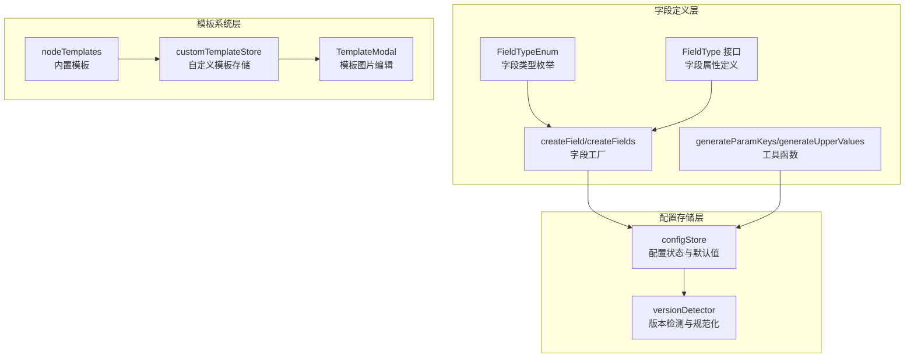
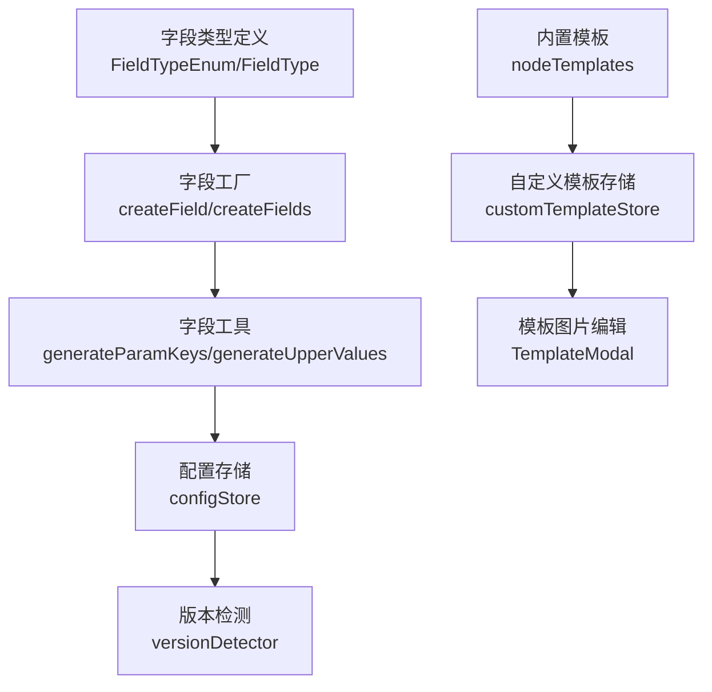
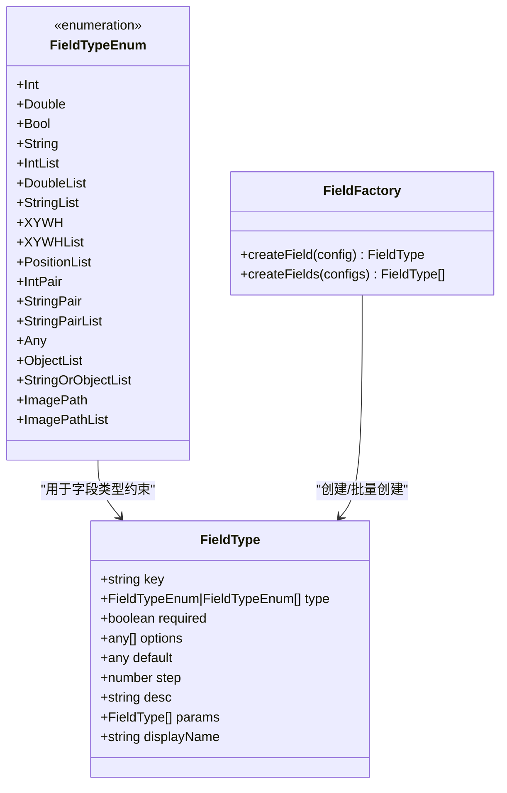
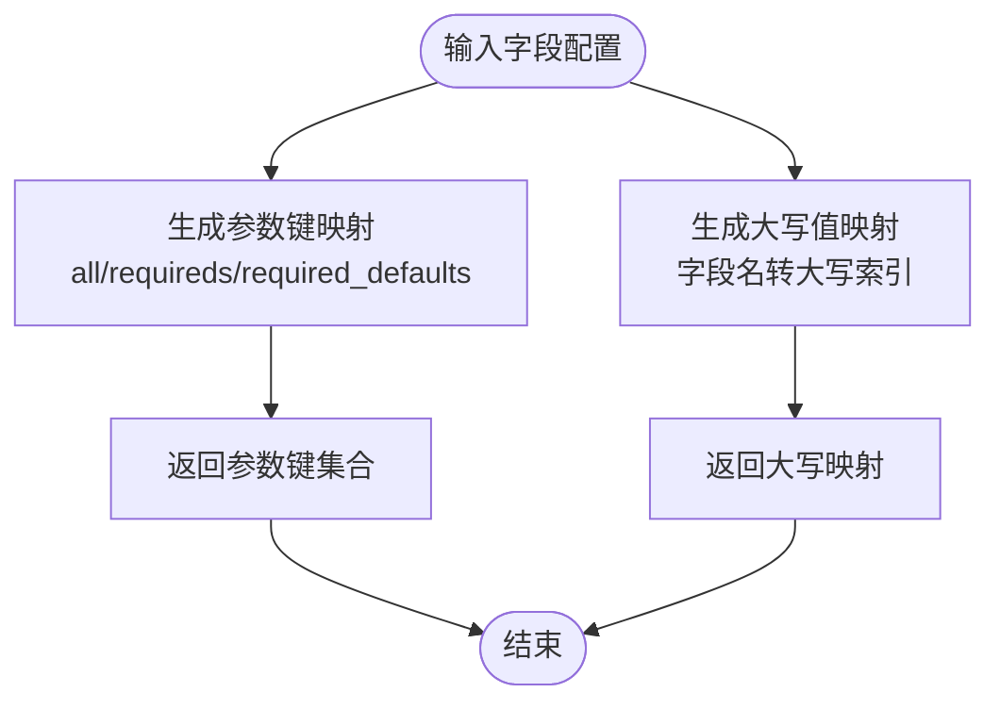
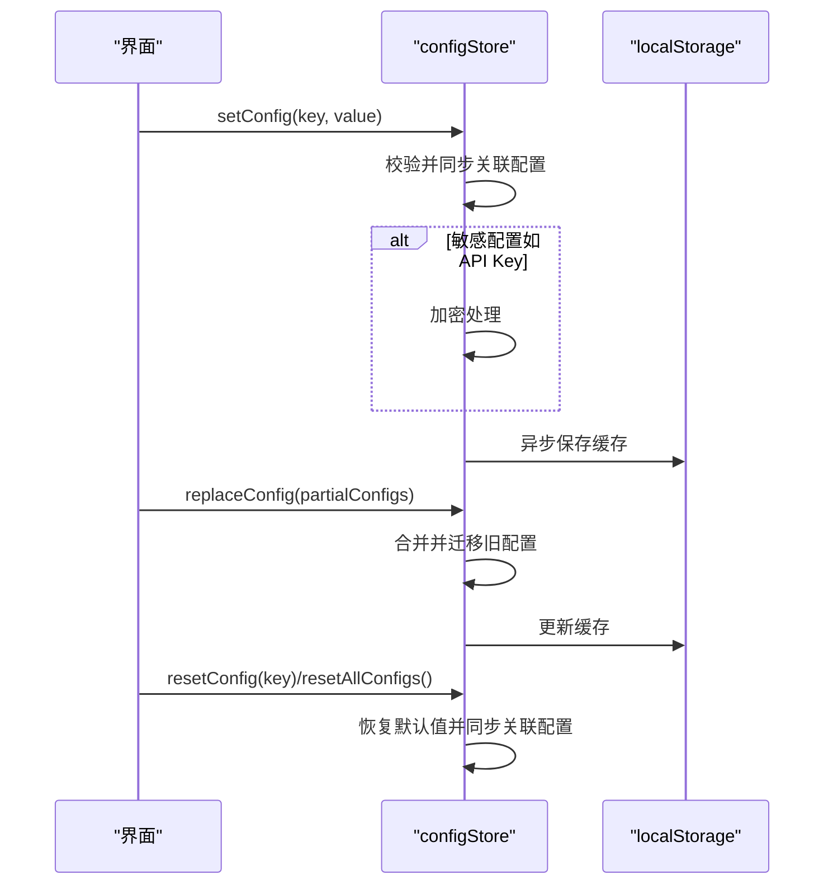
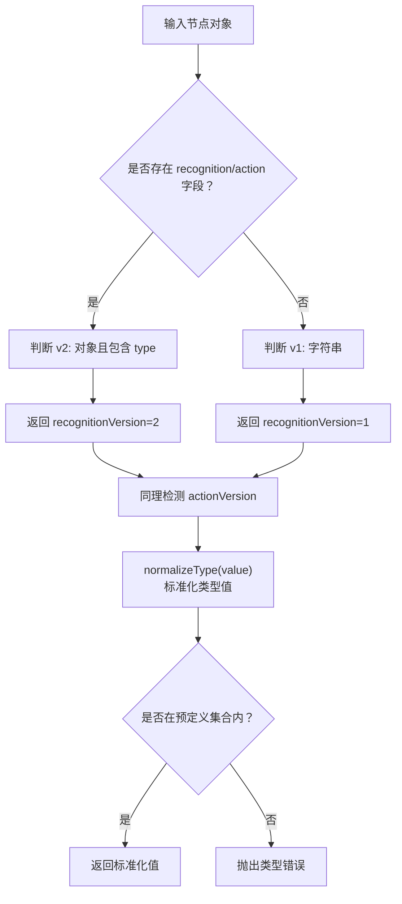
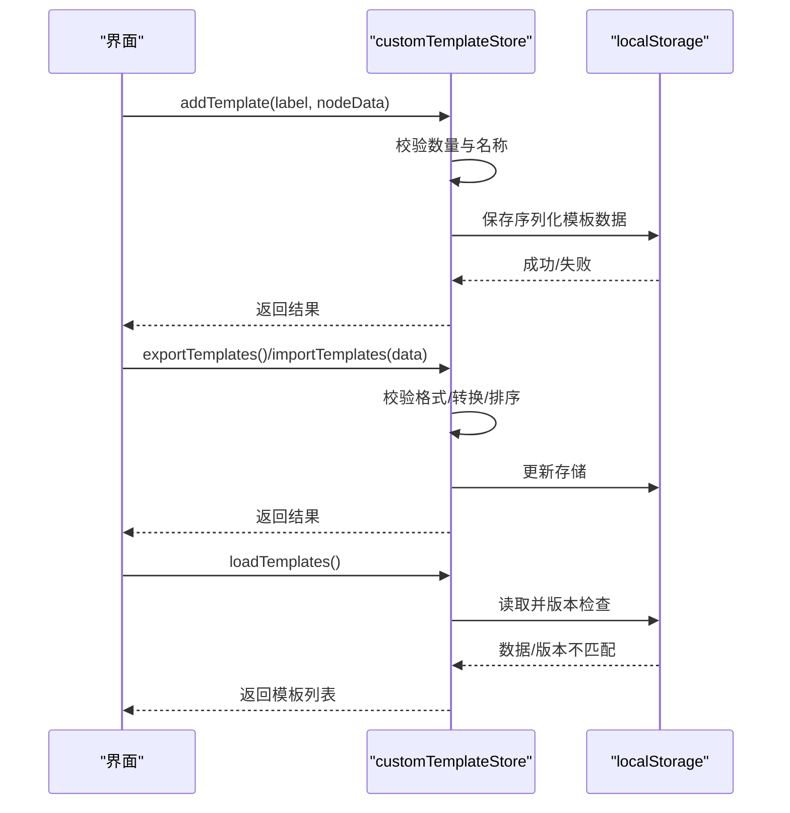
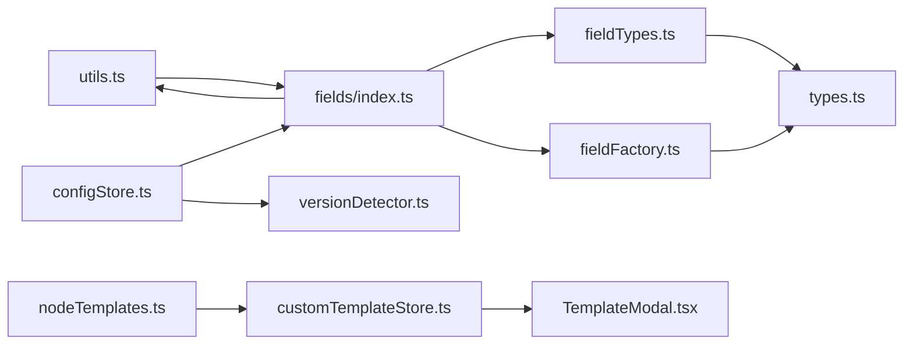

# 字段编辑器配置系统

<cite>
**本文档引用的文件**
- [fieldFactory.ts](file://src/core/fields/fieldFactory.ts)
- [fieldTypes.ts](file://src/core/fields/fieldTypes.ts)
- [types.ts](file://src/core/fields/types.ts)
- [utils.ts](file://src/core/fields/utils.ts)
- [index.ts](file://src/core/fields/index.ts)
- [configStore.ts](file://src/stores/configStore.ts)
- [versionDetector.ts](file://src/core/parser/versionDetector.ts)
- [nodeTemplates.ts](file://src/data/nodeTemplates.ts)
- [customTemplateStore.ts](file://src/stores/customTemplateStore.ts)
- [TemplateModal.tsx](file://src/components/modals/TemplateModal.tsx)
</cite>

## 目录
1. [简介](#简介)
2. [项目结构](#项目结构)
3. [核心组件](#核心组件)
4. [架构总览](#架构总览)
5. [详细组件分析](#详细组件分析)
6. [依赖关系分析](#依赖关系分析)
7. [性能考虑](#性能考虑)
8. [故障排除指南](#故障排除指南)
9. [结论](#结论)
10. [附录](#附录)

## 简介
本文件系统性阐述字段编辑器配置系统的设计与实现，覆盖字段属性定义、默认值设置、配置继承机制、字段类型管理（内置与自定义）、扩展性与灵活性设计、配置模板的创建与管理，以及版本兼容性与迁移策略。目标是帮助开发者与使用者在不深入源码的前提下，理解并高效使用该配置系统。

## 项目结构
字段编辑器配置系统主要由以下层次构成：
- 字段类型与工厂：定义字段类型枚举、字段类型接口、辅助创建函数与工具方法
- 配置存储与状态：集中管理应用配置、默认值、持久化与迁移
- 版本检测与规范化：识别节点版本并标准化类型值
- 模板系统：内置节点模板与自定义模板的增删改查、导入导出与版本迁移
- UI 交互：模板图片编辑等可视化组件

**图表来源**
- [fieldTypes.ts:1-27](file://src/core/fields/fieldTypes.ts#L1-L27)
- [types.ts:1-34](file://src/core/fields/types.ts#L1-L34)
- [fieldFactory.ts:1-16](file://src/core/fields/fieldFactory.ts#L1-L16)
- [utils.ts:1-41](file://src/core/fields/utils.ts#L1-L41)
- [configStore.ts:1-440](file://src/stores/configStore.ts#L1-L440)
- [versionDetector.ts:1-149](file://src/core/parser/versionDetector.ts#L1-L149)
- [nodeTemplates.ts:1-108](file://src/data/nodeTemplates.ts#L1-L108)
- [customTemplateStore.ts:1-327](file://src/stores/customTemplateStore.ts#L1-L327)
- [TemplateModal.tsx:1-991](file://src/components/modals/TemplateModal.tsx#L1-L991)

**章节来源**
- [fieldFactory.ts:1-16](file://src/core/fields/fieldFactory.ts#L1-L16)
- [fieldTypes.ts:1-27](file://src/core/fields/fieldTypes.ts#L1-L27)
- [types.ts:1-34](file://src/core/fields/types.ts#L1-L34)
- [utils.ts:1-41](file://src/core/fields/utils.ts#L1-L41)
- [configStore.ts:1-440](file://src/stores/configStore.ts#L1-L440)
- [versionDetector.ts:1-149](file://src/core/parser/versionDetector.ts#L1-L149)
- [nodeTemplates.ts:1-108](file://src/data/nodeTemplates.ts#L1-L108)
- [customTemplateStore.ts:1-327](file://src/stores/customTemplateStore.ts#L1-L327)
- [TemplateModal.tsx:1-991](file://src/components/modals/TemplateModal.tsx#L1-L991)

## 核心组件
本节聚焦字段配置模式的核心组成与职责划分。

- 字段类型与属性
  - 字段类型枚举：涵盖基础类型、列表类型、数组类型、任意类型及图片路径类型等
  - 字段属性接口：统一描述字段键、类型、是否必填、选项、默认值、步长、描述、子参数、显示名等
  - 字段工厂：提供便捷的字段创建与批量创建能力
  - 工具函数：生成参数键映射、生成大写值映射，便于规范化与索引

- 配置存储与默认值
  - 集中式配置状态：包含导出、节点、连接、画布、组件、本地服务、AI 等多个分类
  - 默认值与只读默认集：确保重置与对比一致性
  - 配置同步逻辑：如导出配置开关与处理模式之间的联动
  - 加密与持久化：敏感配置（如 API Key）加密存储，支持本地缓存恢复

- 版本检测与规范化
  - 节点版本检测：识别 recognition 与 action 的版本（v1/v2）
  - 类型规范化：将输入类型标准化为预定义值，异常时抛错

- 模板系统
  - 内置模板：提供常用节点模板，包含预设数据
  - 自定义模板：支持增删改查、导入导出、版本迁移与数量限制
  - 模板图片编辑：提供截图、框选、遮罩、导出等可视化能力

**章节来源**
- [fieldTypes.ts:1-27](file://src/core/fields/fieldTypes.ts#L1-L27)
- [types.ts:1-34](file://src/core/fields/types.ts#L1-L34)
- [fieldFactory.ts:1-16](file://src/core/fields/fieldFactory.ts#L1-L16)
- [utils.ts:1-41](file://src/core/fields/utils.ts#L1-L41)
- [configStore.ts:1-440](file://src/stores/configStore.ts#L1-L440)
- [versionDetector.ts:1-149](file://src/core/parser/versionDetector.ts#L1-L149)
- [nodeTemplates.ts:1-108](file://src/data/nodeTemplates.ts#L1-L108)
- [customTemplateStore.ts:1-327](file://src/stores/customTemplateStore.ts#L1-L327)
- [TemplateModal.tsx:1-991](file://src/components/modals/TemplateModal.tsx#L1-L991)

## 架构总览
字段编辑器配置系统采用“类型定义 + 状态存储 + 工具函数 + 模板系统”的分层架构，通过工厂与工具函数抽象字段配置细节，通过状态存储集中管理配置与默认值，并通过版本检测保障不同版本节点的兼容性。

**图表来源**
- [fieldTypes.ts:1-27](file://src/core/fields/fieldTypes.ts#L1-L27)
- [types.ts:1-34](file://src/core/fields/types.ts#L1-L34)
- [fieldFactory.ts:1-16](file://src/core/fields/fieldFactory.ts#L1-L16)
- [utils.ts:1-41](file://src/core/fields/utils.ts#L1-L41)
- [configStore.ts:1-440](file://src/stores/configStore.ts#L1-L440)
- [versionDetector.ts:1-149](file://src/core/parser/versionDetector.ts#L1-L149)
- [nodeTemplates.ts:1-108](file://src/data/nodeTemplates.ts#L1-L108)
- [customTemplateStore.ts:1-327](file://src/stores/customTemplateStore.ts#L1-L327)
- [TemplateModal.tsx:1-991](file://src/components/modals/TemplateModal.tsx#L1-L991)

## 详细组件分析

### 字段类型与配置模式
字段类型与配置模式通过类型枚举、接口与工厂函数协同工作，形成可扩展、可维护的配置定义体系。

- 设计要点
  - 类型约束：通过枚举限定字段类型，支持基础类型、列表、数组与图片路径等
  - 属性完备：字段接口覆盖必填、选项、默认值、步长、描述、子参数与显示名
  - 工厂简化：提供便捷创建与批量创建，降低重复样板代码

**图表来源**
- [fieldTypes.ts:1-27](file://src/core/fields/fieldTypes.ts#L1-L27)
- [types.ts:1-34](file://src/core/fields/types.ts#L1-L34)
- [fieldFactory.ts:1-16](file://src/core/fields/fieldFactory.ts#L1-L16)

**章节来源**
- [fieldTypes.ts:1-27](file://src/core/fields/fieldTypes.ts#L1-L27)
- [types.ts:1-34](file://src/core/fields/types.ts#L1-L34)
- [fieldFactory.ts:1-16](file://src/core/fields/fieldFactory.ts#L1-L16)

### 字段工具与参数键生成
工具函数负责生成参数键映射与大写值映射，提升字段配置的可索引性与规范化程度。

- 参数键映射：按字段聚合其子参数键、必填键与对应默认值，便于运行时校验与渲染
- 大写映射：将字段名转换为大写形式，便于忽略大小写的查找与匹配

**图表来源**
- [utils.ts:1-41](file://src/core/fields/utils.ts#L1-L41)

**章节来源**
- [utils.ts:1-41](file://src/core/fields/utils.ts#L1-L41)
- [index.ts:37-46](file://src/core/fields/index.ts#L37-L46)

### 配置存储与默认值管理
配置存储以集中式状态管理为核心，提供默认值、持久化、迁移与加密等能力。

- 关联配置同步：如导出配置开关与处理模式之间的联动
- 加密存储：敏感配置加密后再持久化
- 缓存恢复：从本地缓存恢复配置与已配置键集合
- 迁移策略：基于字段映射与大写映射进行版本兼容处理

**图表来源**
- [configStore.ts:270-440](file://src/stores/configStore.ts#L270-L440)

**章节来源**
- [configStore.ts:1-440](file://src/stores/configStore.ts#L1-L440)

### 版本检测与类型规范化
版本检测模块负责识别节点版本并规范化类型值，确保系统在多版本场景下的稳定性。

- 节点版本检测：根据字段形态与特征判断 v1/v2
- 类型规范化：将输入类型映射到预定义值，异常时抛错

**图表来源**
- [versionDetector.ts:23-149](file://src/core/parser/versionDetector.ts#L23-L149)

**章节来源**
- [versionDetector.ts:1-149](file://src/core/parser/versionDetector.ts#L1-L149)

### 模板系统与配置模板
模板系统分为内置模板与自定义模板两部分，支持增删改查、导入导出与版本迁移；同时提供模板图片编辑功能。

- 自定义模板：数量限制、名称校验、序列化存储、版本迁移
- 导入导出：格式校验、转换与排序，保证数据一致性
- 内置模板：提供常用节点模板，便于快速创建节点

**图表来源**
- [customTemplateStore.ts:50-327](file://src/stores/customTemplateStore.ts#L50-L327)
- [nodeTemplates.ts:1-108](file://src/data/nodeTemplates.ts#L1-L108)

**章节来源**
- [customTemplateStore.ts:1-327](file://src/stores/customTemplateStore.ts#L1-L327)
- [nodeTemplates.ts:1-108](file://src/data/nodeTemplates.ts#L1-L108)
- [TemplateModal.tsx:1-991](file://src/components/modals/TemplateModal.tsx#L1-L991)

### 字段面板模式与配置分类
配置存储定义了多种配置分类与面板模式，便于在不同场景下灵活展示与管理字段。

- 配置分类：导出、节点、连接、画布、组件、本地服务、AI、管理等
- 面板模式：固定、可拖拽、内联三种模式
- 关联配置：如导出配置开关与处理模式的联动

**章节来源**
- [configStore.ts:19-82](file://src/stores/configStore.ts#L19-L82)
- [configStore.ts:117-177](file://src/stores/configStore.ts#L117-L177)

## 依赖关系分析
字段编辑器配置系统内部依赖清晰，各模块职责明确，耦合度低，便于扩展与维护。

**图表来源**
- [fieldTypes.ts:1-27](file://src/core/fields/fieldTypes.ts#L1-L27)
- [types.ts:1-34](file://src/core/fields/types.ts#L1-L34)
- [fieldFactory.ts:1-16](file://src/core/fields/fieldFactory.ts#L1-L16)
- [utils.ts:1-41](file://src/core/fields/utils.ts#L1-L41)
- [index.ts:1-46](file://src/core/fields/index.ts#L1-L46)
- [configStore.ts:1-440](file://src/stores/configStore.ts#L1-L440)
- [versionDetector.ts:1-149](file://src/core/parser/versionDetector.ts#L1-L149)
- [nodeTemplates.ts:1-108](file://src/data/nodeTemplates.ts#L1-L108)
- [customTemplateStore.ts:1-327](file://src/stores/customTemplateStore.ts#L1-L327)
- [TemplateModal.tsx:1-991](file://src/components/modals/TemplateModal.tsx#L1-L991)

**章节来源**
- [index.ts:1-46](file://src/core/fields/index.ts#L1-L46)
- [configStore.ts:1-440](file://src/stores/configStore.ts#L1-L440)

## 性能考虑
- 字段工具函数：参数键与大写映射在初始化时一次性生成，避免运行时重复计算
- 配置存储：使用轻量的状态管理，异步加密与持久化，减少主线程阻塞
- 模板系统：自定义模板数量限制与序列化存储，控制内存占用与 IO 开销
- 版本检测：基于简单键存在性与类型判断，复杂度低，适合大规模节点处理

## 故障排除指南
- 配置恢复失败
  - 现象：本地缓存恢复后配置异常
  - 排查：检查缓存键与数据格式，确认已配置键集合过滤
  - 处理：清理无效缓存，重新导入或重置配置

- 敏感配置未加密
  - 现象：API Key 明文存储
  - 排查：确认加密流程触发条件与异步回调
  - 处理：触发替换配置流程，系统会自动加密并更新

- 模板导入失败
  - 现象：导入模板数据格式错误或版本不匹配
  - 排查：验证模板数据结构与版本号
  - 处理：清理旧版本数据或修正导入数据

- 类型错误
  - 现象：识别算法类型或动作类型不在预定义集合
  - 排查：核对类型值是否经过大写映射与规范化
  - 处理：使用标准化函数或修正输入值

**章节来源**
- [configStore.ts:415-440](file://src/stores/configStore.ts#L415-L440)
- [customTemplateStore.ts:88-94](file://src/stores/customTemplateStore.ts#L88-L94)
- [versionDetector.ts:118-149](file://src/core/parser/versionDetector.ts#L118-L149)

## 结论
字段编辑器配置系统通过清晰的类型定义、集中化的配置存储、完善的工具函数与模板系统，实现了高扩展性与灵活性。版本检测与规范化机制确保了多版本场景的兼容性，而配置模板则提供了便捷的创建与管理能力。整体设计兼顾易用性与可维护性，适合在复杂工作流场景中长期演进。

## 附录

### 字段属性定义清单
- key：字段唯一标识
- type：字段类型（支持单值或数组）
- required：是否必填
- options：可选项列表
- default：默认值
- step：步长（数值类）
- desc：字段描述
- params：子参数列表（结构化字段）
- displayName：显示名（用于 UI）

**章节来源**
- [types.ts:6-16](file://src/core/fields/types.ts#L6-L16)

### 配置分类与默认值速览
- 导出配置：导出样式、默认动作、空参数处理、协议版本、跳过校验、缩进等
- 节点配置：节点样式、详情字段显示、模板图显示、流程区域显示、磁吸对齐等
- 连接配置：边路径模式、标签显示、控制点显示、连接空白处快速创建节点等
- 画布配置：背景模式、自动聚焦、聚焦透明度、深色模式等
- 组件配置：导出开关、调试前保存、字段面板模式、内联面板缩放等
- 本地服务配置：端口、自动连接、文件自动重载、跨文件搜索等
- AI 配置：API 地址、密钥、模型、温度、提供商类型、代理等

**章节来源**
- [configStore.ts:34-82](file://src/stores/configStore.ts#L34-L82)
- [configStore.ts:118-177](file://src/stores/configStore.ts#L118-L177)

### 字段类型速览
- 基础类型：整数、浮点、布尔、字符串
- 列表类型：整数列表、浮点列表、字符串列表、对象列表、字符串或对象列表
- 数组类型：二维/四维整数数组、字符串二元组列表等
- 特殊类型：任意类型、图片路径与列表
- 组合类型：结构化字段（如焦点参数）支持子参数

**章节来源**
- [fieldTypes.ts:4-26](file://src/core/fields/fieldTypes.ts#L4-L26)