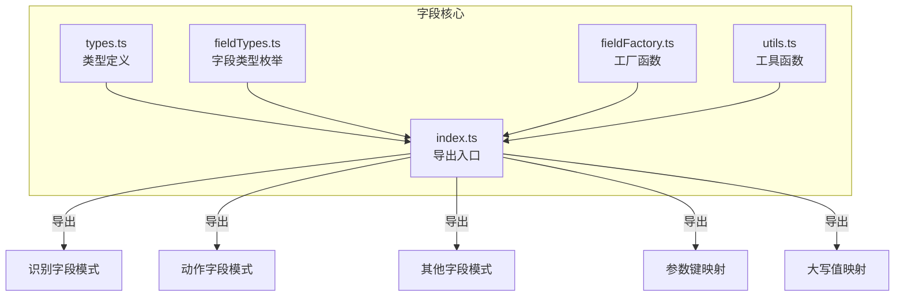
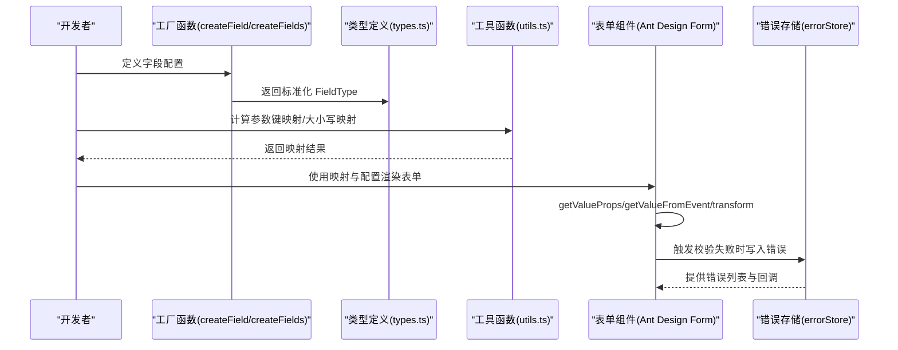
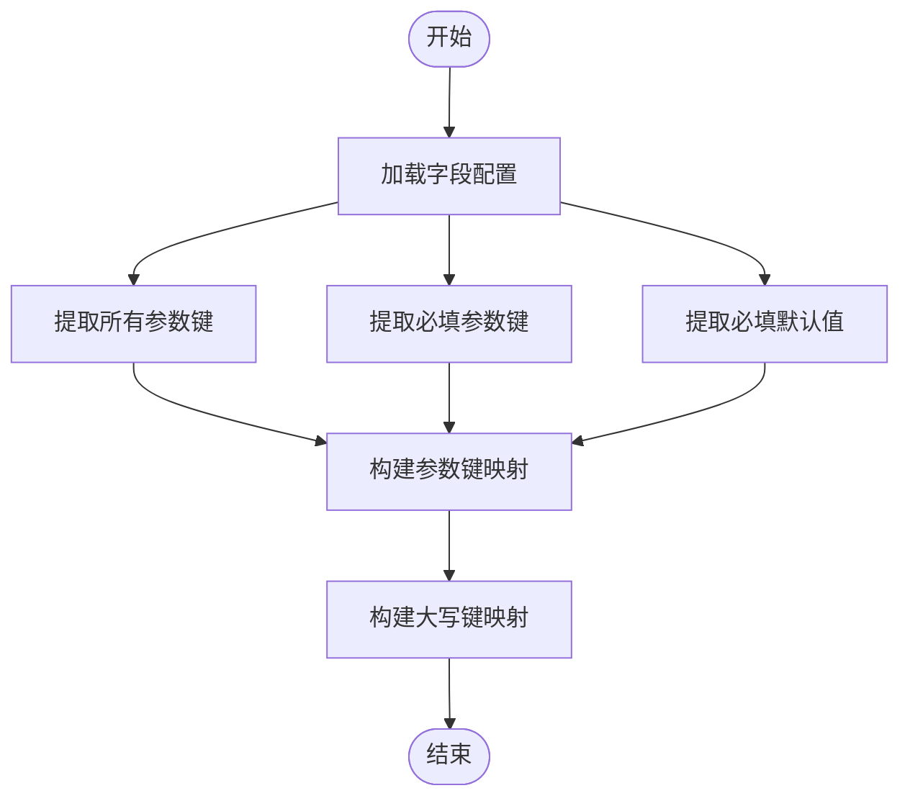
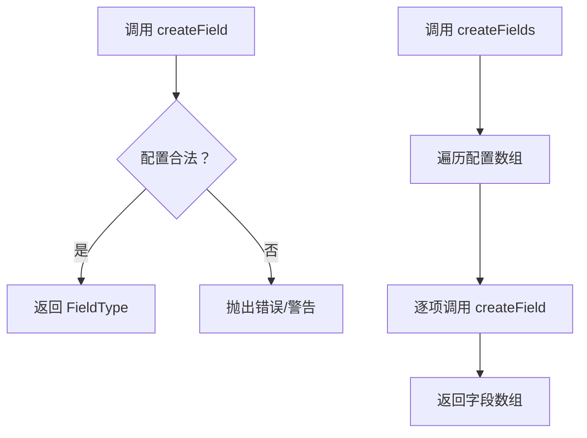
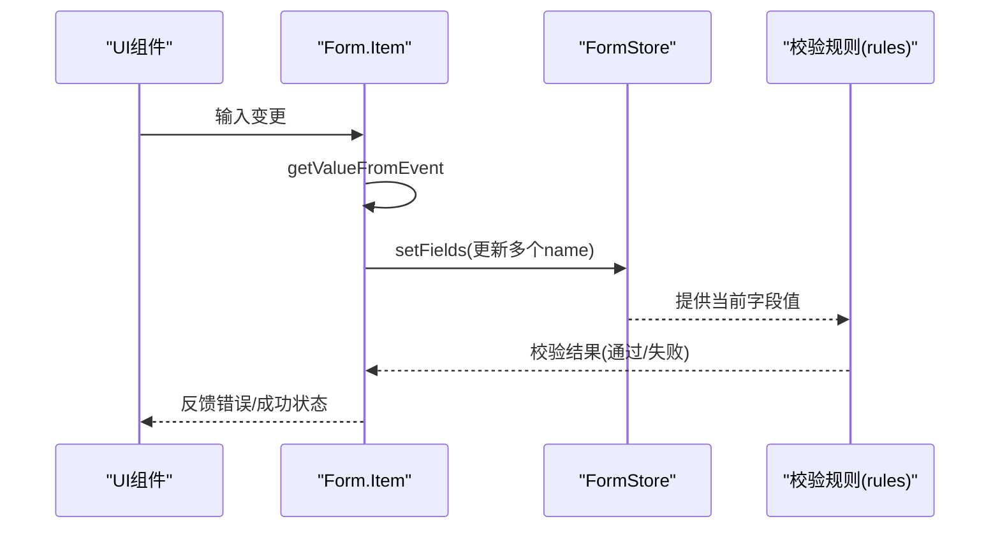
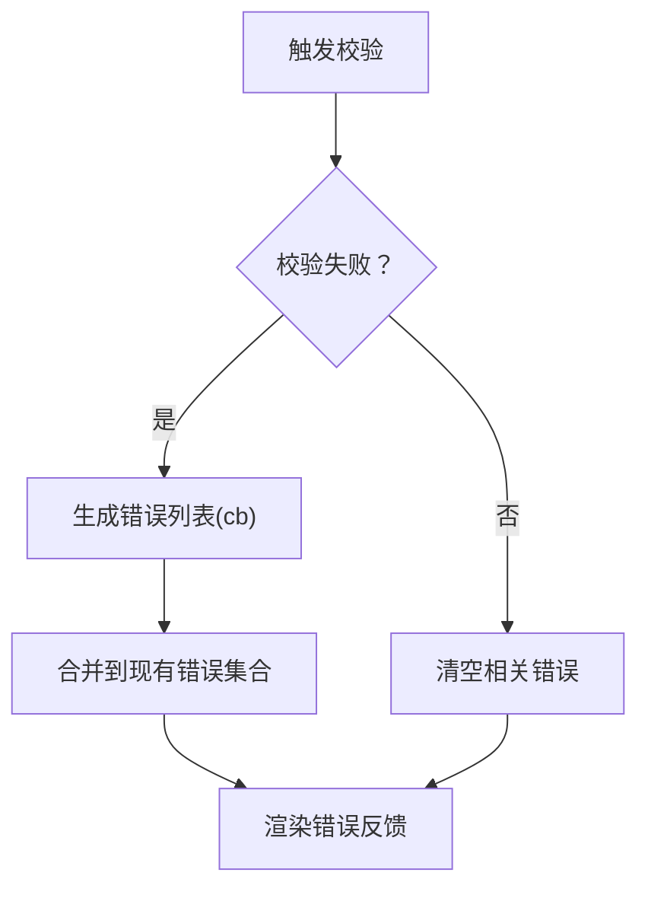
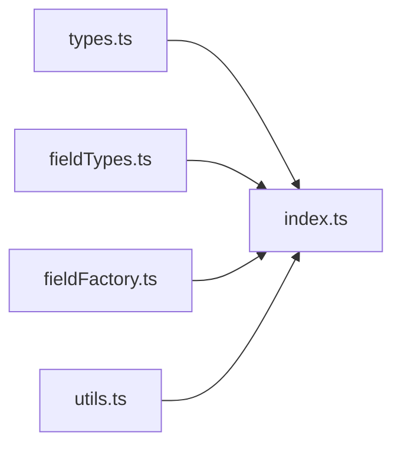

# 字段验证与数据绑定

<cite>
**本文引用的文件**
- [fieldFactory.ts](file://src/core/fields/fieldFactory.ts)
- [types.ts](file://src/core/fields/types.ts)
- [utils.ts](file://src/core/fields/utils.ts)
- [index.ts](file://src/core/fields/index.ts)
- [fieldTypes.ts](file://src/core/fields/fieldTypes.ts)
- [errorStore.ts](file://src/stores/errorStore.ts)
- [form-names.zh-CN.md](file://dev/instructions/ant-design/blog/form-names.zh-CN.md)
</cite>

## 目录
1. [简介](#简介)
2. [项目结构](#项目结构)
3. [核心组件](#核心组件)
4. [架构总览](#架构总览)
5. [详细组件分析](#详细组件分析)
6. [依赖关系分析](#依赖关系分析)
7. [性能考虑](#性能考虑)
8. [故障排查指南](#故障排查指南)
9. [结论](#结论)

## 简介
本文件聚焦于字段验证与数据绑定系统，围绕以下目标展开：
- 字段验证规则设计与实现：必填、格式、范围等规则如何在字段配置层表达与落地。
- 数据绑定机制：双向绑定、单向绑定与事件驱动的数据更新方式。
- 不同类型字段的验证策略与绑定逻辑差异。
- 自定义验证规则的实现指南。
- 验证错误处理与用户反馈机制。

该系统以“字段配置 + 工厂 + 工具函数”的方式组织，结合前端表单库的通用实践，形成可扩展、可维护的验证与绑定框架。

## 项目结构
字段验证与数据绑定相关的核心位于 src/core/fields 目录，主要由以下模块组成：
- 类型定义：FieldType、FieldsType、ParamKeysType 等，统一描述字段元信息与参数键集合。
- 字段类型枚举：FieldTypeEnum，覆盖基础类型、列表类型、复合数组类型及图片路径类型。
- 工厂函数：createField/createFields，用于简化字段定义与批量创建。
- 工具函数：generateParamKeys/generateUpperValues，用于从字段配置生成参数键映射与大小写映射。
- 导出入口：index.ts 汇总导出识别、动作、其他类字段的模式与工具，并预先计算常用映射。

图表来源
- [index.ts:1-46](file://src/core/fields/index.ts#L1-L46)
- [types.ts:1-34](file://src/core/fields/types.ts#L1-L34)
- [fieldTypes.ts:1-27](file://src/core/fields/fieldTypes.ts#L1-L27)
- [fieldFactory.ts:1-16](file://src/core/fields/fieldFactory.ts#L1-L16)
- [utils.ts:1-41](file://src/core/fields/utils.ts#L1-L41)

章节来源
- [index.ts:1-46](file://src/core/fields/index.ts#L1-L46)

## 核心组件
- 字段类型定义（FieldType）：包含键名、类型、是否必填、选项、默认值、步长、描述、子参数列表、显示名等，支撑验证与渲染。
- 字段集合（FieldsType）：描述一组字段及其参数列表与整体描述。
- 参数键集合（ParamKeysType）：记录所有参数键、必填键与必填默认值，便于运行期快速判断。
- 字段类型枚举（FieldTypeEnum）：覆盖整数、浮点、布尔、字符串、列表、复合数组、图片路径等类型，确保类型安全与一致性。
- 工厂函数（createField/createFields）：简化字段声明，提升可读性与复用性。
- 工具函数（generateParamKeys/generateUpperValues）：预计算参数键集合与大小写映射，降低运行时开销。

章节来源
- [types.ts:6-24](file://src/core/fields/types.ts#L6-L24)
- [fieldTypes.ts:4-26](file://src/core/fields/fieldTypes.ts#L4-L26)
- [fieldFactory.ts:6-15](file://src/core/fields/fieldFactory.ts#L6-L15)
- [utils.ts:6-40](file://src/core/fields/utils.ts#L6-L40)

## 架构总览
字段验证与数据绑定的总体流程：
- 字段配置层：通过 FieldType/FieldsType 描述字段与参数，定义必填、默认值、类型等。
- 工厂与工具层：createField/createFields 用于声明；generateParamKeys/generateUpperValues 用于预计算。
- 表单层：基于前端表单库（参考 Ant Design 的 Form.Item 能力），通过 getValueProps、getValueFromEvent、transform 等钩子实现聚合字段与跨字段联动校验。
- 错误层：使用全局错误存储（errorStore）集中管理错误状态与用户反馈。

图表来源
- [fieldFactory.ts:6-15](file://src/core/fields/fieldFactory.ts#L6-L15)
- [types.ts:6-24](file://src/core/fields/types.ts#L6-L24)
- [utils.ts:6-40](file://src/core/fields/utils.ts#L6-L40)
- [errorStore.ts:17-38](file://src/stores/errorStore.ts#L17-L38)
- [form-names.zh-CN.md:44-74](file://dev/instructions/ant-design/blog/form-names.zh-CN.md#L44-L74)

## 详细组件分析

### 字段类型与参数键映射
- 字段类型枚举（FieldTypeEnum）覆盖基础与复合类型，保证字段配置的类型一致性。
- 参数键映射（generateParamKeys）从字段配置中提取 all、requires、required_default，便于运行时快速判断参数是否满足必填条件与默认值。
- 大小写映射（generateUpperValues）将字段键转换为大写形式，便于忽略大小写的匹配场景。

图表来源
- [utils.ts:6-25](file://src/core/fields/utils.ts#L6-L25)
- [utils.ts:30-40](file://src/core/fields/utils.ts#L30-L40)

章节来源
- [fieldTypes.ts:4-26](file://src/core/fields/fieldTypes.ts#L4-L26)
- [utils.ts:6-40](file://src/core/fields/utils.ts#L6-L40)

### 工厂函数与字段声明
- createField：接收标准化的 FieldType 配置，直接返回，便于链式或条件式声明。
- createFields：批量创建字段，适合从配置数组一次性生成字段集合。

图表来源
- [fieldFactory.ts:6-15](file://src/core/fields/fieldFactory.ts#L6-L15)

章节来源
- [fieldFactory.ts:6-15](file://src/core/fields/fieldFactory.ts#L6-L15)

### 表单绑定与验证策略（基于 Ant Design）
- 单向绑定：通过 Form.Item 的 name 与 initialValue，将字段初始值注入表单状态。
- 双向绑定：通过 getValueProps/getValueFromEvent 在组件与 FormStore 之间同步值。
- 跨字段联动：使用 transform 在 rules 中读取多个字段值，实现跨字段校验（如范围校验、组合字段必填）。
- 聚合字段：通过封装 Form.Item，支持一个控件写入多个 name，实现数组到对象的转换与联动。

图表来源
- [form-names.zh-CN.md:44-74](file://dev/instructions/ant-design/blog/form-names.zh-CN.md#L44-L74)
- [form-names.zh-CN.md:91-136](file://dev/instructions/ant-design/blog/form-names.zh-CN.md#L91-L136)

章节来源
- [form-names.zh-CN.md:44-74](file://dev/instructions/ant-design/blog/form-names.zh-CN.md#L44-L74)
- [form-names.zh-CN.md:91-136](file://dev/instructions/ant-design/blog/form-names.zh-CN.md#L91-L136)

### 错误处理与用户反馈
- 错误存储：使用全局错误存储（errorStore）集中管理错误类型、消息、标记与点击回调。
- 错误过滤与合并：按类型过滤旧错误，应用新错误回调生成新错误列表，再合并到现有错误集合。
- 用户反馈：在表单渲染层根据错误列表展示提示信息，必要时提供点击跳转或修复建议。

图表来源
- [errorStore.ts:17-38](file://src/stores/errorStore.ts#L17-L38)

章节来源
- [errorStore.ts:17-38](file://src/stores/errorStore.ts#L17-L38)

## 依赖关系分析
字段系统内部依赖清晰，耦合度低：
- types.ts 与 fieldTypes.ts 提供类型与枚举，被 index.ts 引用。
- fieldFactory.ts 与 utils.ts 作为工具层，被 index.ts 调用以生成映射。
- index.ts 作为统一出口，向上层（表单与业务）暴露字段模式与映射。

图表来源
- [index.ts:1-46](file://src/core/fields/index.ts#L1-L46)
- [types.ts:1-34](file://src/core/fields/types.ts#L1-L34)
- [fieldTypes.ts:1-27](file://src/core/fields/fieldTypes.ts#L1-L27)
- [fieldFactory.ts:1-16](file://src/core/fields/fieldFactory.ts#L1-L16)
- [utils.ts:1-41](file://src/core/fields/utils.ts#L1-L41)

章节来源
- [index.ts:1-46](file://src/core/fields/index.ts#L1-L46)

## 性能考虑
- 预计算映射：通过 generateParamKeys/generateUpperValues 在应用启动阶段完成映射构建，避免运行时重复计算。
- 类型约束：FieldTypeEnum 与 FieldType 的明确约束减少运行时类型检查成本。
- 工厂函数：createField/createFields 简化字段声明，减少样板代码与解析成本。
- 表单联动：使用 transform 仅在规则执行时读取必要字段值，避免全量数据拷贝。

## 故障排查指南
- 必填字段缺失：检查 ParamKeysType.requires 与 required_default，确认必填键是否已填充默认值或用户输入。
- 类型不匹配：核对 FieldType.type 与 FieldTypeEnum，确保输入值符合期望类型（如整数、浮点、列表等）。
- 跨字段校验失败：在 rules 中使用 transform 读取多个字段值，确认字段名一致且顺序正确。
- 错误未显示：检查 errorStore 的错误类型与消息是否正确写入，确认渲染层已订阅错误状态。

章节来源
- [utils.ts:13-22](file://src/core/fields/utils.ts#L13-L22)
- [fieldTypes.ts:4-26](file://src/core/fields/fieldTypes.ts#L4-L26)
- [form-names.zh-CN.md:115-127](file://dev/instructions/ant-design/blog/form-names.zh-CN.md#L115-L127)
- [errorStore.ts:17-38](file://src/stores/errorStore.ts#L17-L38)

## 结论
本字段验证与数据绑定系统通过“配置 + 工厂 + 工具 + 表单 + 错误存储”的分层设计，实现了：
- 清晰的字段类型与参数键管理；
- 简洁的字段声明与批量创建；
- 可扩展的验证规则与跨字段联动；
- 集中的错误处理与用户反馈。

建议在后续迭代中：
- 将更多验证规则抽象为可插拔的校验器；
- 支持动态字段与条件渲染；
- 增强错误定位与自动修复提示。