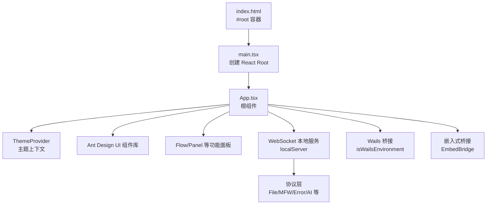
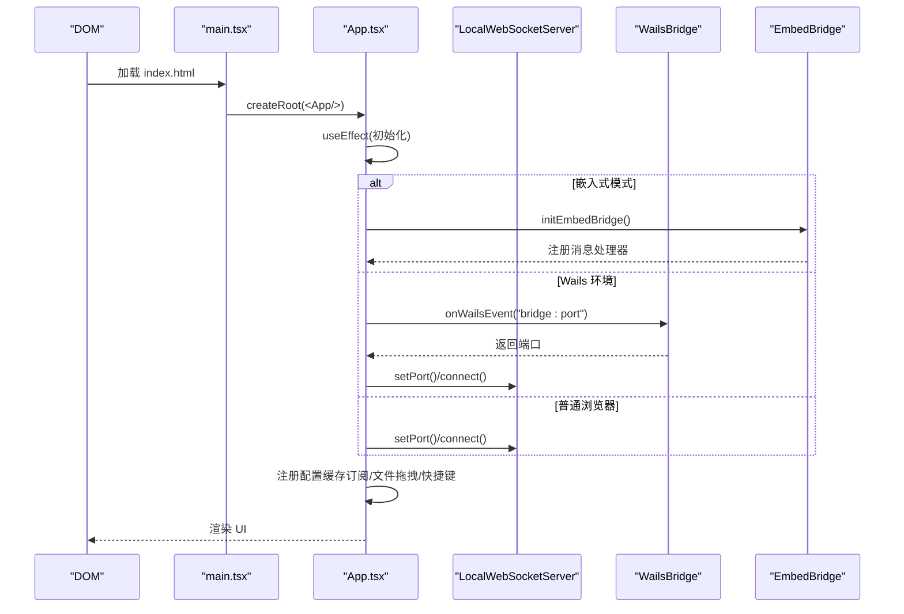
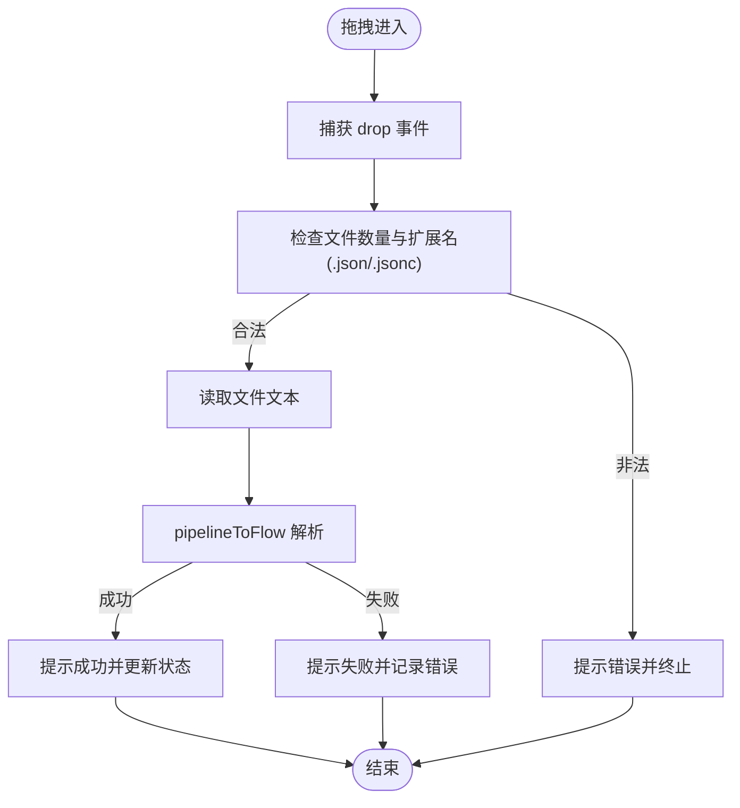
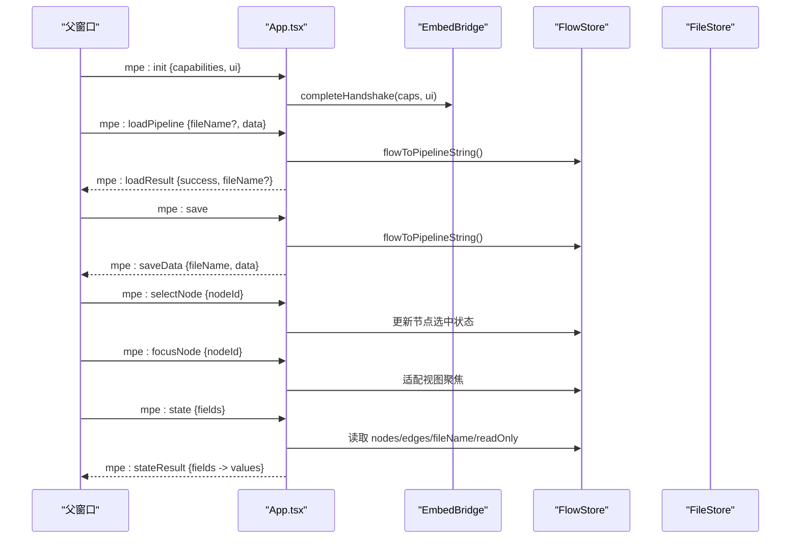
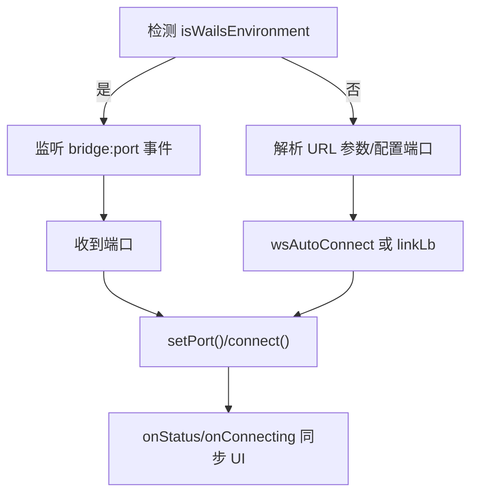
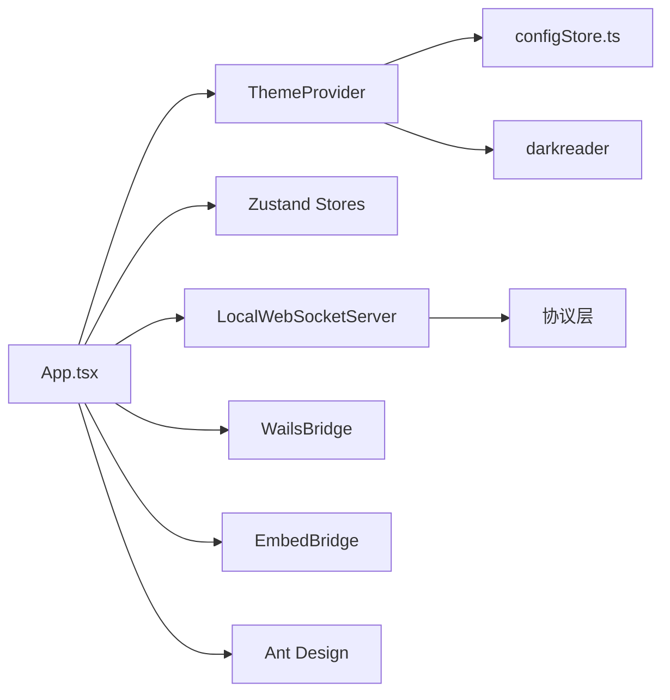

# 应用根组件

<cite>
**本文引用的文件列表**
- [App.tsx](file://src/App.tsx)
- [main.tsx](file://src/main.tsx)
- [ThemeContext.tsx](file://src/contexts/ThemeContext.tsx)
- [server.ts](file://src/services/server.ts)
- [wailsBridge.ts](file://src/utils/wailsBridge.ts)
- [embedBridge.ts](file://src/utils/embedBridge.ts)
- [configStore.ts](file://src/stores/configStore.ts)
- [App.module.less](file://src/styles/layout/App.module.less)
- [index.html](file://index.html)
- [package.json](file://package.json)
</cite>

## 目录
1. [简介](#简介)
2. [项目结构](#项目结构)
3. [核心组件](#核心组件)
4. [架构总览](#架构总览)
5. [组件详解](#组件详解)
6. [依赖关系分析](#依赖关系分析)
7. [性能考量](#性能考量)
8. [故障排查指南](#故障排查指南)
9. [结论](#结论)
10. [附录](#附录)

## 简介
本文件聚焦于应用根组件 App.tsx 的设计与实现，系统性阐述其在应用生命周期中的职责、全局状态管理策略、路由与主题 Provider 的集成方式、以及与嵌入式环境、Wails 桥接、WebSocket 本地服务的协同机制。同时，结合 main.tsx 的应用初始化与挂载流程，说明根组件如何协调各子系统的启动与销毁，最后给出扩展与定制指南，包括中间件集成与插件机制建议。

## 项目结构
应用采用 React 19 + Vite 的现代前端栈，根组件位于 src/App.tsx，入口脚本位于 src/main.tsx，通过 index.html 中的 #root 容器进行挂载。主题能力通过 ThemeProvider 提供，全局状态使用 Zustand 管理，WebSocket 本地服务通过独立模块封装，Wails 与嵌入式桥接分别提供跨进程与跨页面通信能力。

图表来源
- [index.html:34-35](file://index.html#L34-L35)
- [main.tsx:14-19](file://src/main.tsx#L14-L19)
- [App.tsx:43-596](file://src/App.tsx#L43-L596)
- [server.ts:22-345](file://src/services/server.ts#L22-L345)

章节来源
- [index.html:1-38](file://index.html#L1-L38)
- [main.tsx:1-20](file://src/main.tsx#L1-L20)
- [package.json:1-75](file://package.json#L1-L75)

## 核心组件
- 根组件 App.tsx：负责应用初始化、条件渲染、事件监听、嵌入式与 Wails 环境适配、WebSocket 连接与状态同步、全局快捷键启用、新手引导与星标提醒等。
- ThemeProvider：提供暗黑模式切换与状态同步至 darkreader。
- LocalWebSocketServer：封装 WebSocket 连接、握手、路由分发、状态监听与清理。
- WailsBridge：检测 Wails 环境、事件监听、后端方法调用、日志输出等。
- EmbedBridge：iframe 嵌入模式的消息协议、握手、能力声明与 UI 配置。

章节来源
- [App.tsx:136-596](file://src/App.tsx#L136-L596)
- [ThemeContext.tsx:22-67](file://src/contexts/ThemeContext.tsx#L22-L67)
- [server.ts:22-345](file://src/services/server.ts#L22-L345)
- [wailsBridge.ts:54-144](file://src/utils/wailsBridge.ts#L54-L144)
- [embedBridge.ts:75-282](file://src/utils/embedBridge.ts#L75-L282)

## 架构总览
App.tsx 作为应用的“中枢”，在 useEffect 生命周期内完成以下关键动作：
- 环境检测：优先判断嵌入式模式，其次判断 Wails 环境，最后回退到普通浏览器环境。
- 初始化与清理：注册并清理嵌入式消息处理器、Wails 事件监听、文件拖拽监听、WebSocket 状态监听、定时提醒等。
- 子系统协调：加载本地缓存、注册协议路由、自动连接本地服务、处理分享链接与导入请求、加载自定义模板、启用快捷键、打开新手引导与星标提醒。
- 条件渲染：根据嵌入式能力与 UI 配置决定面板可见性。

图表来源
- [main.tsx:14-19](file://src/main.tsx#L14-L19)
- [App.tsx:184-529](file://src/App.tsx#L184-L529)
- [server.ts:109-255](file://src/services/server.ts#L109-L255)
- [wailsBridge.ts:64-76](file://src/utils/wailsBridge.ts#L64-L76)
- [embedBridge.ts:179-244](file://src/utils/embedBridge.ts#L179-L244)

## 组件详解

### 根组件 App.tsx 设计与职责
- 生命周期与初始化
  - 在 useEffect 中执行一次性初始化，包含环境检测、消息处理器注册、WebSocket 连接、配置缓存订阅、导入与分享处理、模板加载、快捷键启用、新手引导与星标提醒等。
  - 返回清理函数，确保移除事件监听、注销订阅、断开 WebSocket、清理定时器等。
- 条件渲染与嵌入式适配
  - 通过 useEmbedMode 与 useEmbedStore 控制头部、工具栏、面板的可见性；支持隐藏面板、只读模式、撤销重做等能力开关。
- 全局状态管理
  - 使用多个 Zustand Store：文件、配置、WebSocket、MFW、自定义模板、嵌入式、新手引导等，集中管理应用状态。
  - 订阅配置变更并持久化缓存，避免重复写入。
- 本地服务与协议
  - 通过 localServer 注册各类协议（文件、MFW、错误、配置、调试、资源、日志、AI），并在连接状态变化时同步 UI。
- 跨环境适配
  - Wails 环境：监听 bridge:port 事件，动态设置端口并连接；非 Wails 环境：优先使用 URL 参数或配置端口，支持自动连接。
  - 嵌入式环境：通过 postMessage 协议与父窗口双向通信，完成握手、加载/保存管道、选中/聚焦节点、查询状态等。
- 用户体验增强
  - 文件拖拽导入、快捷键（撤销/重做）、新手引导弹窗、定期星标提醒通知。

章节来源
- [App.tsx:136-596](file://src/App.tsx#L136-L596)
- [configStore.ts:118-177](file://src/stores/configStore.ts#L118-L177)

### 主题 Provider 与样式体系
- ThemeProvider
  - 从配置 Store 读取 useDarkMode，并通过 darkreader 同步到页面样式；提供 toggleTheme/setTheme 方法供组件使用。
- 样式组织
  - App.module.less 定义容器、布局、头部、内容区与工作区的基础样式，配合 Ant Design 组件库实现统一视觉与交互。

章节来源
- [ThemeContext.tsx:22-67](file://src/contexts/ThemeContext.tsx#L22-L67)
- [App.module.less:1-32](file://src/styles/layout/App.module.less#L1-L32)

### 应用初始化与挂载流程（main.tsx）
- 初始化顺序
  - 先初始化 WebSocket 服务与开发控制台，再创建 React Root 并渲染 App。
- 挂载点
  - index.html 中的 #root 容器承载整个应用。
- React 19 严格模式
  - 使用 StrictMode 包裹，便于开发阶段发现潜在问题。

章节来源
- [main.tsx:1-20](file://src/main.tsx#L1-L20)
- [index.html:34-35](file://index.html#L34-L35)

### 跨环境桥接与协议
- WailsBridge
  - 检测 window.runtime 存在性，提供事件监听、后端方法调用、日志输出、版本与更新检查等。
  - 在 Wails 环境中，优先监听 bridge:port 事件获取端口，再建立 WebSocket 连接。
- EmbedBridge
  - 检测 URL 参数 embed=true，注册 message 监听，完成握手后允许双向通信。
  - 支持能力声明（只读、复制、撤销重做、自动布局、AI、搜索、自定义模板）与 UI 配置（隐藏头部/工具栏、隐藏面板）。

章节来源
- [wailsBridge.ts:54-144](file://src/utils/wailsBridge.ts#L54-L144)
- [embedBridge.ts:75-282](file://src/utils/embedBridge.ts#L75-L282)

### 本地 WebSocket 服务与协议层
- LocalWebSocketServer
  - 封装连接、握手、消息路由、状态监听与清理；内置系统路由（握手响应）与多协议注册。
  - 提供 onStatus/onConnecting 回调，供 UI 层感知连接状态变化。
- 协议注册
  - 在 initializeWebSocket 中统一注册 File/MFW/Error/Config/Debug/Resource/Logger/AI 等协议，确保前后端消息互通。

章节来源
- [server.ts:22-345](file://src/services/server.ts#L22-L345)
- [server.ts:361-387](file://src/services/server.ts#L361-L387)

### 文件拖拽与导入流程

图表来源
- [App.tsx:144-168](file://src/App.tsx#L144-L168)

章节来源
- [App.tsx:144-168](file://src/App.tsx#L144-L168)

### 嵌入式消息协议与状态查询

图表来源
- [App.tsx:193-331](file://src/App.tsx#L193-L331)
- [embedBridge.ts:179-282](file://src/utils/embedBridge.ts#L179-L282)

章节来源
- [App.tsx:193-331](file://src/App.tsx#L193-L331)
- [embedBridge.ts:179-282](file://src/utils/embedBridge.ts#L179-L282)

### Wails 环境下的连接策略

图表来源
- [App.tsx:438-493](file://src/App.tsx#L438-L493)
- [wailsBridge.ts:64-76](file://src/utils/wailsBridge.ts#L64-L76)
- [server.ts:78-88](file://src/services/server.ts#L78-L88)

章节来源
- [App.tsx:438-493](file://src/App.tsx#L438-L493)
- [wailsBridge.ts:64-76](file://src/utils/wailsBridge.ts#L64-L76)
- [server.ts:78-88](file://src/services/server.ts#L78-L88)

## 依赖关系分析
- 组件耦合
  - App.tsx 依赖 ThemeProvider、多个 Store、协议服务、桥接模块与工具函数，承担“粘合层”角色。
  - ThemeProvider 与配置 Store 强关联，主题切换直接影响 darkreader。
  - LocalWebSocketServer 与协议层解耦，通过路由注册实现松耦合。
- 外部依赖
  - Ant Design 提供 UI 组件与通知/模态框等全局反馈。
  - darkreader 提供暗黑模式渲染。
  - Zustand 提供轻量级状态管理。
  - React 19 严格模式提升开发期质量。

图表来源
- [App.tsx:1-75](file://src/App.tsx#L1-L75)
- [ThemeContext.tsx:22-56](file://src/contexts/ThemeContext.tsx#L22-L56)
- [server.ts:345-387](file://src/services/server.ts#L345-L387)
- [wailsBridge.ts:54-144](file://src/utils/wailsBridge.ts#L54-L144)
- [embedBridge.ts:75-282](file://src/utils/embedBridge.ts#L75-L282)

章节来源
- [App.tsx:1-75](file://src/App.tsx#L1-L75)
- [ThemeContext.tsx:22-56](file://src/contexts/ThemeContext.tsx#L22-L56)
- [server.ts:345-387](file://src/services/server.ts#L345-L387)
- [wailsBridge.ts:54-144](file://src/utils/wailsBridge.ts#L54-L144)
- [embedBridge.ts:75-282](file://src/utils/embedBridge.ts#L75-L282)

## 性能考量
- 渲染优化
  - 使用 Suspense 懒加载 JsonViewer 与 DebugModal，减少首屏负载。
  - 条件渲染按嵌入式能力与 UI 配置动态控制面板，避免不必要的 DOM。
- 状态管理
  - 配置变更订阅仅在关键字段变化时触发持久化，降低写盘频率。
  - FlowStore 与相关状态通过 Store 管理，避免跨组件重复计算。
- 网络与连接
  - WebSocket 连接超时与错误提示，避免长时间阻塞 UI。
  - 连接状态变化通过 onStatus/onConnecting 回调同步 UI，减少轮询。
- 主题切换
  - 主题切换通过 darkreader 动态注入/移除样式，避免全量重绘。

章节来源
- [App.tsx:75-80](file://src/App.tsx#L75-L80)
- [App.tsx:531-596](file://src/App.tsx#L531-L596)
- [configStore.ts:366-379](file://src/stores/configStore.ts#L366-L379)
- [server.ts:129-163](file://src/services/server.ts#L129-L163)

## 故障排查指南
- 无法连接本地服务
  - 检查 wsAutoConnect 与 wsPort 配置，确认端口占用与防火墙。
  - 观察 onStatus/onConnecting 回调输出，定位连接超时或错误。
- Wails 环境未生效
  - 确认 window.runtime 是否存在，检查 bridge:port 事件是否触发。
  - 若 bridge 未就绪，等待事件或手动触发连接。
- 嵌入式消息不响应
  - 确认 URL 参数 embed=true 且父窗口 origin 校验通过。
  - 检查握手是否完成，确认 mpe:ready 是否返回。
- 主题切换无效
  - 确认 useDarkMode 配置项与 darkreader 版本兼容。
- 文件拖拽导入失败
  - 确认文件扩展名为 .json 或 .jsonc，检查 pipelineToFlow 解析结果。

章节来源
- [server.ts:129-255](file://src/services/server.ts#L129-L255)
- [wailsBridge.ts:54-144](file://src/utils/wailsBridge.ts#L54-L144)
- [embedBridge.ts:179-282](file://src/utils/embedBridge.ts#L179-L282)
- [ThemeContext.tsx:27-37](file://src/contexts/ThemeContext.tsx#L27-L37)
- [App.tsx:144-168](file://src/App.tsx#L144-L168)

## 结论
App.tsx 作为应用中枢，通过严格的生命周期管理、清晰的环境适配、完善的跨系统协作与用户体验增强，实现了从初始化到运行期的稳定过渡。其设计遵循“低耦合、高内聚”的原则，既保证了功能完整性，也为后续扩展与定制提供了良好基础。

## 附录

### 扩展与定制指南
- 中间件集成
  - 在 App.tsx 的初始化阶段插入自定义中间件逻辑（如鉴权、埋点、A/B 实验），注意在清理函数中释放资源。
- 插件机制
  - 通过协议层扩展新功能：在 initializeWebSocket 中注册新的 Protocol 实例，并在 App.tsx 中添加对应的消息处理与 UI 适配。
- 嵌入式能力扩展
  - 在 EmbedCapabilities 中新增能力项，并在 App.tsx 中根据 isCapAllowed 判断启用相应功能。
- 主题与样式
  - 通过 ThemeProvider 的 setTheme/toggleTheme 与配置 Store 的 useDarkMode 协同，实现主题切换与持久化。
- WebSocket 协议扩展
  - 在 LocalWebSocketServer 上注册新路由，确保前后端消息契约一致，并在 UI 中增加状态反馈。

章节来源
- [App.tsx:184-529](file://src/App.tsx#L184-L529)
- [server.ts:97-106](file://src/services/server.ts#L97-L106)
- [embedBridge.ts:18-51](file://src/utils/embedBridge.ts#L18-L51)
- [ThemeContext.tsx:43-51](file://src/contexts/ThemeContext.tsx#L43-L51)