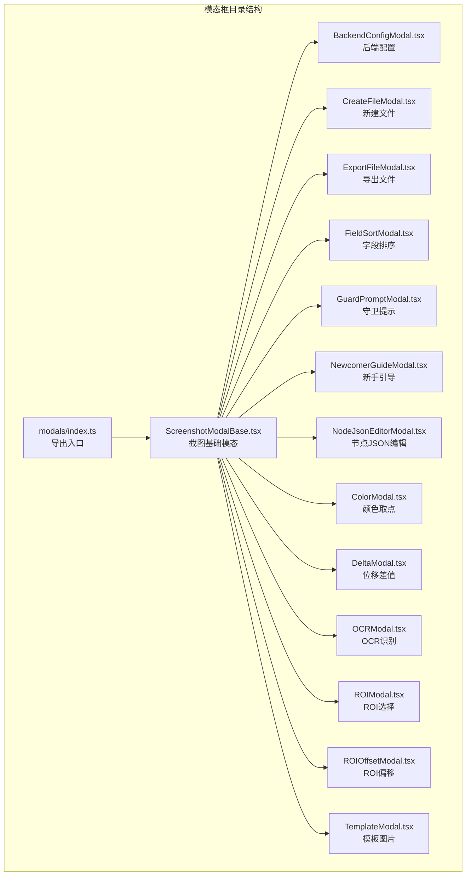
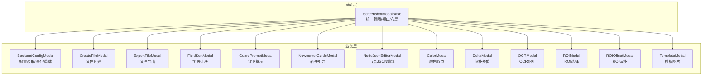
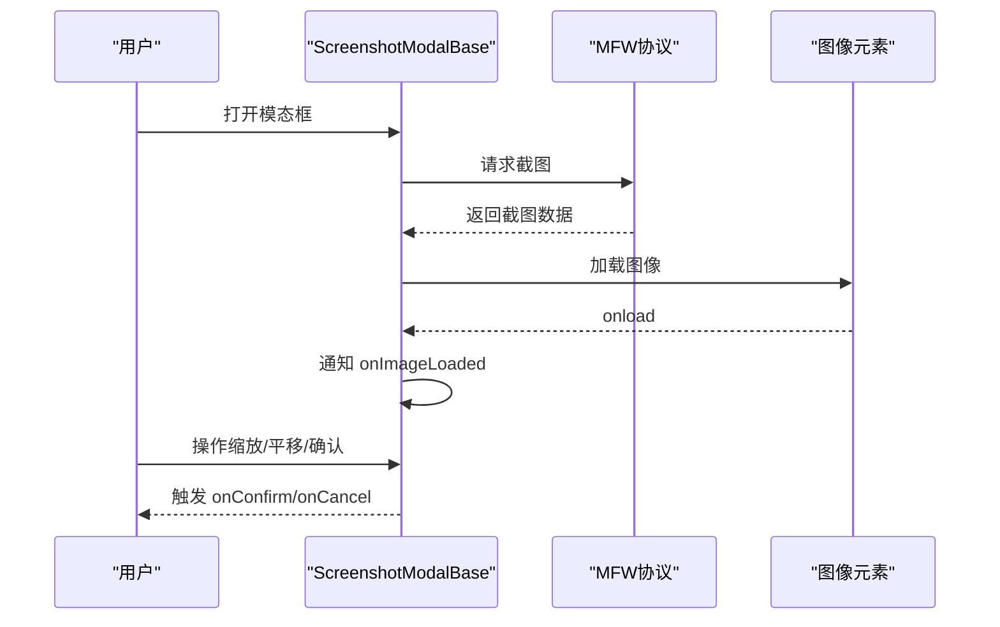
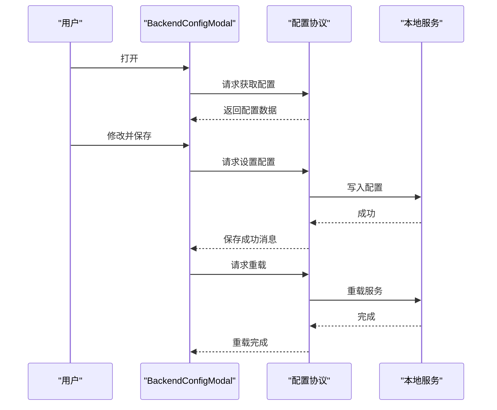
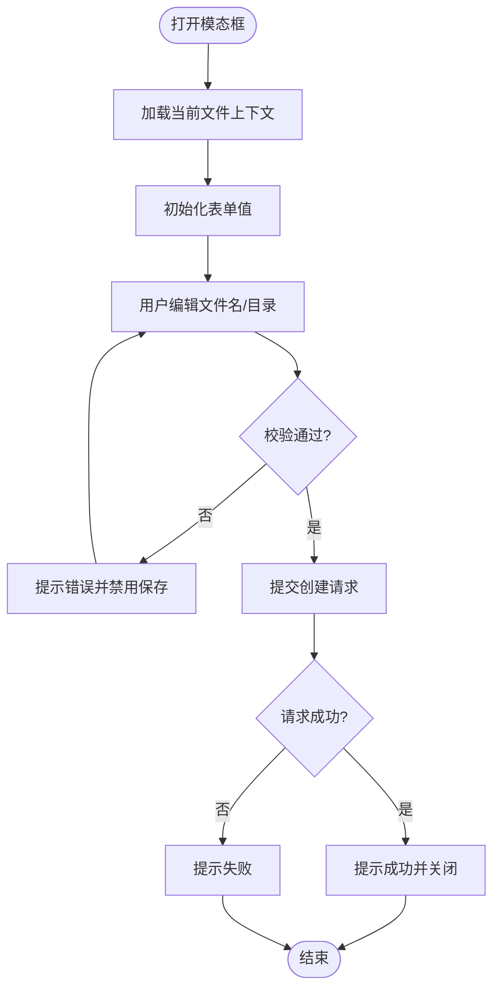
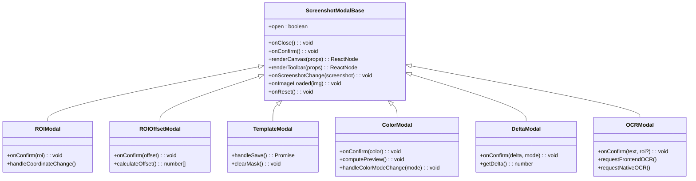
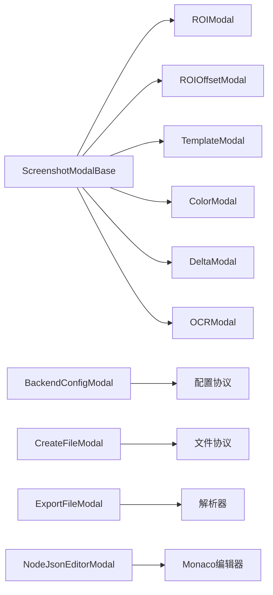

# 模态框与对话框

<cite>
**本文档引用的文件**
- [src/components/modals/index.ts](file://src/components/modals/index.ts)
- [src/components/modals/BackendConfigModal.tsx](file://src/components/modals/BackendConfigModal.tsx)
- [src/components/modals/CreateFileModal.tsx](file://src/components/modals/CreateFileModal.tsx)
- [src/components/modals/ColorModal.tsx](file://src/components/modals/ColorModal.tsx)
- [src/components/modals/DeltaModal.tsx](file://src/components/modals/DeltaModal.tsx)
- [src/components/modals/ExportFileModal.tsx](file://src/components/modals/ExportFileModal.tsx)
- [src/components/modals/FieldSortModal.tsx](file://src/components/modals/FieldSortModal.tsx)
- [src/components/modals/GuardPromptModal.tsx](file://src/components/modals/GuardPromptModal.tsx)
- [src/components/modals/NewcomerGuideModal.tsx](file://src/components/modals/NewcomerGuideModal.tsx)
- [src/components/modals/NodeJsonEditorModal.tsx](file://src/components/modals/NodeJsonEditorModal.tsx)
- [src/components/modals/OCRModal.tsx](file://src/components/modals/OCRModal.tsx)
- [src/components/modals/ROIModal.tsx](file://src/components/modals/ROIModal.tsx)
- [src/components/modals/ROIOffsetModal.tsx](file://src/components/modals/ROIOffsetModal.tsx)
- [src/components/modals/TemplateModal.tsx](file://src/components/modals/TemplateModal.tsx)
- [src/components/modals/ScreenshotModalBase.tsx](file://src/components/modals/ScreenshotModalBase.tsx)
</cite>

## 目录
1. [简介](#简介)
2. [项目结构](#项目结构)
3. [核心组件](#核心组件)
4. [架构总览](#架构总览)
5. [详细组件分析](#详细组件分析)
6. [依赖关系分析](#依赖关系分析)
7. [性能考虑](#性能考虑)
8. [故障排除指南](#故障排除指南)
9. [结论](#结论)
10. [附录](#附录)

## 简介
本文件系统性梳理了 MaaPipelineEditor（MPE）中的模态框与对话框体系，覆盖配置类、操作类、视觉识别类、文件与导出类、向导与守卫类等多类场景。文档重点阐述：
- 模态框系统的整体设计与实现策略
- 各类模态框的功能实现与交互细节
- 生命周期管理与状态控制
- 与父组件的通信机制与数据传递
- 定制与扩展方法
- 动画与用户体验优化

## 项目结构
模态框组件集中位于 src/components/modals 目录，采用“按功能分组”的组织方式，每个模态框独立封装，遵循统一的“截图基础模态”抽象，便于复用与扩展。



**图表来源**
- [src/components/modals/index.ts:1-8](file://src/components/modals/index.ts#L1-L8)
- [src/components/modals/ScreenshotModalBase.tsx:78-405](file://src/components/modals/ScreenshotModalBase.tsx#L78-L405)

**章节来源**
- [src/components/modals/index.ts:1-8](file://src/components/modals/index.ts#L1-L8)

## 核心组件
- 截图基础模态（ScreenshotModalBase）
  - 统一的截图拉取、图像加载、视口控制（缩放、平移）、工具栏与参数区布局
  - 通过 renderCanvas/renderToolbar/children 插槽扩展具体功能
  - 提供 confirm/cancel/重试截图等标准行为
- 后端配置模态（BackendConfigModal）
  - 与本地服务协议交互，支持读取/保存/重载配置，跨平台环境同步
- 新建文件模态（CreateFileModal）
  - 文件名校验、去重检测、目录选择、内容生成与提交
- 导出文件模态（ExportFileModal）
  - 集成/分离两种导出模式，兼容现代浏览器文件系统 API
- 字段排序模态（FieldSortModal）
  - 基于 DnDKit 的拖拽排序，支持重置默认
- 守卫提示模态（GuardPromptModal）
  - 基于守卫系统，引导用户完成关键配置
- 新手引导模态（NewcomerGuideModal）
  - 三步式引导 + 测试，通过状态存储驱动
- 节点JSON编辑器模态（NodeJsonEditorModal）
  - JSON 校验、格式化、转换与回填
- 视觉识别相关模态
  - ROI 选择（ROIModal）、ROI 偏移（ROIOffsetModal）、模板图片（TemplateModal）、颜色取点（ColorModal）、位移差值（DeltaModal）、OCR（OCRModal）

**章节来源**
- [src/components/modals/ScreenshotModalBase.tsx:78-405](file://src/components/modals/ScreenshotModalBase.tsx#L78-L405)
- [src/components/modals/BackendConfigModal.tsx:1-480](file://src/components/modals/BackendConfigModal.tsx#L1-L480)
- [src/components/modals/CreateFileModal.tsx:1-450](file://src/components/modals/CreateFileModal.tsx#L1-L450)
- [src/components/modals/ExportFileModal.tsx:1-302](file://src/components/modals/ExportFileModal.tsx#L1-L302)
- [src/components/modals/FieldSortModal.tsx:1-360](file://src/components/modals/FieldSortModal.tsx#L1-L360)
- [src/components/modals/GuardPromptModal.tsx:1-172](file://src/components/modals/GuardPromptModal.tsx#L1-L172)
- [src/components/modals/NewcomerGuideModal.tsx:1-423](file://src/components/modals/NewcomerGuideModal.tsx#L1-L423)
- [src/components/modals/NodeJsonEditorModal.tsx:1-244](file://src/components/modals/NodeJsonEditorModal.tsx#L1-L244)
- [src/components/modals/ColorModal.tsx:1-972](file://src/components/modals/ColorModal.tsx#L1-L972)
- [src/components/modals/DeltaModal.tsx:1-401](file://src/components/modals/DeltaModal.tsx#L1-L401)
- [src/components/modals/OCRModal.tsx:1-1104](file://src/components/modals/OCRModal.tsx#L1-L1104)
- [src/components/modals/ROIModal.tsx:1-564](file://src/components/modals/ROIModal.tsx#L1-L564)
- [src/components/modals/ROIOffsetModal.tsx:1-937](file://src/components/modals/ROIOffsetModal.tsx#L1-L937)
- [src/components/modals/TemplateModal.tsx:1-991](file://src/components/modals/TemplateModal.tsx#L1-L991)

## 架构总览
模态框系统采用“基础抽象 + 功能扩展”的分层架构：
- 基础层：ScreenshotModalBase 提供统一的截图、视口、工具栏与布局
- 业务层：各功能模态框基于基础层扩展，实现各自业务逻辑
- 通信层：通过 onConfirm/onCancel/onReset 等回调与父组件通信，配合 store 与协议层完成数据持久化与服务交互



**图表来源**
- [src/components/modals/ScreenshotModalBase.tsx:78-405](file://src/components/modals/ScreenshotModalBase.tsx#L78-L405)
- [src/components/modals/BackendConfigModal.tsx:1-480](file://src/components/modals/BackendConfigModal.tsx#L1-L480)
- [src/components/modals/CreateFileModal.tsx:1-450](file://src/components/modals/CreateFileModal.tsx#L1-L450)
- [src/components/modals/ExportFileModal.tsx:1-302](file://src/components/modals/ExportFileModal.tsx#L1-L302)
- [src/components/modals/FieldSortModal.tsx:1-360](file://src/components/modals/FieldSortModal.tsx#L1-L360)
- [src/components/modals/GuardPromptModal.tsx:1-172](file://src/components/modals/GuardPromptModal.tsx#L1-L172)
- [src/components/modals/NewcomerGuideModal.tsx:1-423](file://src/components/modals/NewcomerGuideModal.tsx#L1-L423)
- [src/components/modals/NodeJsonEditorModal.tsx:1-244](file://src/components/modals/NodeJsonEditorModal.tsx#L1-L244)
- [src/components/modals/ColorModal.tsx:1-972](file://src/components/modals/ColorModal.tsx#L1-L972)
- [src/components/modals/DeltaModal.tsx:1-401](file://src/components/modals/DeltaModal.tsx#L1-L401)
- [src/components/modals/OCRModal.tsx:1-1104](file://src/components/modals/OCRModal.tsx#L1-L1104)
- [src/components/modals/ROIModal.tsx:1-564](file://src/components/modals/ROIModal.tsx#L1-L564)
- [src/components/modals/ROIOffsetModal.tsx:1-937](file://src/components/modals/ROIOffsetModal.tsx#L1-L937)
- [src/components/modals/TemplateModal.tsx:1-991](file://src/components/modals/TemplateModal.tsx#L1-L991)

## 详细组件分析

### 截图基础模态（ScreenshotModalBase）
- 职责
  - 统一管理截图拉取、图像加载、视口控制（缩放/平移/重置）、工具栏与参数区布局
  - 通过 renderCanvas/renderToolbar/children 插槽扩展具体功能
- 关键能力
  - 截图请求与结果监听
  - 视口 Hook（useCanvasViewport）提供 scale/panOffset/isPanning/isSpacePressed 等状态
  - 重新截图、取消、确认等标准按钮
- 生命周期
  - 打开时清空旧状态、请求截图、重置视口
  - 关闭时清理状态并调用 onReset 回调
- 与子组件通信
  - 通过 onScreenshotChange/onImageLoaded/onReset 回调传递状态
  - 通过 renderCanvas 注入 CanvasRenderProps（包含截图数据、视口状态、图像元素）



**图表来源**
- [src/components/modals/ScreenshotModalBase.tsx:124-188](file://src/components/modals/ScreenshotModalBase.tsx#L124-L188)

**章节来源**
- [src/components/modals/ScreenshotModalBase.tsx:78-405](file://src/components/modals/ScreenshotModalBase.tsx#L78-L405)

### 后端配置模态（BackendConfigModal）
- 功能要点
  - 读取/保存/重载本地服务配置
  - 表单校验与错误提示
  - 与 Extremer 环境同步根目录
  - 重载后自动提示与延迟触发
- 生命周期
  - 打开时订阅配置数据与重载响应，加载配置
  - 保存时序列化表单并请求设置，成功后自动触发重载
- 数据流
  - Form -> 配置对象 -> 协议请求 -> 服务端 -> 响应回调 -> UI 更新



**图表来源**
- [src/components/modals/BackendConfigModal.tsx:46-127](file://src/components/modals/BackendConfigModal.tsx#L46-L127)
- [src/components/modals/BackendConfigModal.tsx:129-203](file://src/components/modals/BackendConfigModal.tsx#L129-L203)

**章节来源**
- [src/components/modals/BackendConfigModal.tsx:1-480](file://src/components/modals/BackendConfigModal.tsx#L1-L480)

### 新建文件模态（CreateFileModal）
- 功能要点
  - 文件名校验（非法字符、后缀规范）、去重检测、目录选择
  - 从画布内容生成 Pipeline 并提交创建请求
- 生命周期
  - 打开时根据当前文件上下文自动填充初始值
  - 提交时校验并调用协议发起创建
- 数据流
  - 表单 -> 校验 -> 生成内容 -> 协议请求 -> 成功/失败提示



**图表来源**
- [src/components/modals/CreateFileModal.tsx:89-131](file://src/components/modals/CreateFileModal.tsx#L89-L131)
- [src/components/modals/CreateFileModal.tsx:218-262](file://src/components/modals/CreateFileModal.tsx#L218-L262)

**章节来源**
- [src/components/modals/CreateFileModal.tsx:1-450](file://src/components/modals/CreateFileModal.tsx#L1-L450)

### 导出文件模态（ExportFileModal）
- 功能要点
  - 集成/分离两种导出模式，动态预览文件名
  - 使用现代浏览器文件系统 API 或传统下载
- 生命周期
  - 打开时根据当前文件名与配置模式初始化
  - 提交时根据模式分别导出
- 数据流
  - 表单 -> 内容生成 -> 文件系统 API/下载 -> 成功提示

```mermaid
sequenceDiagram
participant U as "用户"
participant EXM as "ExportFileModal"
participant PAR as "解析器"
participant FS as "文件系统API/下载"
U->>EXM : 打开
EXM->>PAR : 生成内容集成/分离
PAR-->>EXM : 返回内容
U->>EXM : 点击导出
EXM->>FS : 保存/下载
FS-->>EXM : 完成
EXM-->>U : 提示成功
```

**图表来源**
- [src/components/modals/ExportFileModal.tsx:31-52](file://src/components/modals/ExportFileModal.tsx#L31-L52)
- [src/components/modals/ExportFileModal.tsx:102-139](file://src/components/modals/ExportFileModal.tsx#L102-L139)

**章节来源**
- [src/components/modals/ExportFileModal.tsx:1-302](file://src/components/modals/ExportFileModal.tsx#L1-L302)

### 字段排序模态（FieldSortModal）
- 功能要点
  - 基于 DnDKit 的拖拽排序，支持重置默认
  - 与配置存储联动，保存时可归零为默认
- 生命周期
  - 打开时从配置存储读取或使用默认值
  - 保存时比较与默认值差异，决定是否归零
- 数据流
  - DnDKit -> 状态变更 -> 保存到配置存储

**章节来源**
- [src/components/modals/FieldSortModal.tsx:108-191](file://src/components/modals/FieldSortModal.tsx#L108-L191)
- [src/components/modals/FieldSortModal.tsx:193-215](file://src/components/modals/FieldSortModal.tsx#L193-L215)

### 守卫提示模态（GuardPromptModal）
- 功能要点
  - 基于守卫系统，收集未配置项并引导用户前往设置
  - 支持“继续并标记已配置”与“前往设置”
- 生命周期
  - 通过 hook 触发检查，返回 Promise 控制放行/阻断
- 数据流
  - 守卫检查 -> 弹窗 -> 用户选择 -> 标记配置/打开设置

**章节来源**
- [src/components/modals/GuardPromptModal.tsx:38-131](file://src/components/modals/GuardPromptModal.tsx#L38-L131)
- [src/components/modals/GuardPromptModal.tsx:138-172](file://src/components/modals/GuardPromptModal.tsx#L138-L172)

### 新手引导模态（NewcomerGuideModal）
- 功能要点
  - 三步式引导：了解、基础、通关
  - 测试通过后发放证书并关闭
- 生命周期
  - 通过状态存储控制步骤与开关
  - 测试结果驱动步骤推进
- 数据流
  - 步骤状态 -> 渲染页面 -> 测试结果 -> 关闭并触发事件

**章节来源**
- [src/components/modals/NewcomerGuideModal.tsx:40-176](file://src/components/modals/NewcomerGuideModal.tsx#L40-L176)
- [src/components/modals/NewcomerGuideModal.tsx:178-423](file://src/components/modals/NewcomerGuideModal.tsx#L178-L423)

### 节点JSON编辑器模态（NodeJsonEditorModal）
- 功能要点
  - JSON 校验、格式化、转换与回填
  - 与编辑器集成，提供自动补全
- 生命周期
  - 打开时根据节点类型转换为 MFW 格式并初始化
  - 保存时验证并转换回 Store 格式
- 数据流
  - 节点数据 -> 转换 -> 编辑器 -> 校验 -> 转换回 Store -> 回填

**章节来源**
- [src/components/modals/NodeJsonEditorModal.tsx:57-129](file://src/components/modals/NodeJsonEditorModal.tsx#L57-L129)
- [src/components/modals/NodeJsonEditorModal.tsx:131-147](file://src/components/modals/NodeJsonEditorModal.tsx#L131-L147)

### 视觉识别相关模态
- ROI 选择（ROIModal）
  - 支持负数坐标解析与拆分显示，手动输入与拖拽绘制
- ROI 偏移（ROIOffsetModal）
  - 原 ROI 与期望 ROI 的对比与偏移计算，支持交换/复制/重置
- 模板图片（TemplateModal）
  - 框选 + 画笔/橡皮擦遮罩，保存为 PNG 并请求后端解析相对路径
- 颜色取点（ColorModal）
  - RGB/HSV/GRAY 三种模式，取色后自动填入边界，支持预览与转换
- 位移差值（DeltaModal）
  - 水平/垂直差值计算，可视化连线与数值显示
- OCR（OCRModal）
  - 前端/原生两种识别模式，支持负数坐标与资源加载失败提示



**图表来源**
- [src/components/modals/ScreenshotModalBase.tsx:46-76](file://src/components/modals/ScreenshotModalBase.tsx#L46-L76)
- [src/components/modals/ROIModal.tsx:13-18](file://src/components/modals/ROIModal.tsx#L13-L18)
- [src/components/modals/ROIOffsetModal.tsx:15-20](file://src/components/modals/ROIOffsetModal.tsx#L15-L20)
- [src/components/modals/TemplateModal.tsx:27-36](file://src/components/modals/TemplateModal.tsx#L27-L36)
- [src/components/modals/ColorModal.tsx:13-21](file://src/components/modals/ColorModal.tsx#L13-L21)
- [src/components/modals/DeltaModal.tsx:10-15](file://src/components/modals/DeltaModal.tsx#L10-L15)
- [src/components/modals/OCRModal.tsx:32-37](file://src/components/modals/OCRModal.tsx#L32-L37)

**章节来源**
- [src/components/modals/ROIModal.tsx:20-301](file://src/components/modals/ROIModal.tsx#L20-L301)
- [src/components/modals/ROIOffsetModal.tsx:31-540](file://src/components/modals/ROIOffsetModal.tsx#L31-L540)
- [src/components/modals/TemplateModal.tsx:40-641](file://src/components/modals/TemplateModal.tsx#L40-L641)
- [src/components/modals/ColorModal.tsx:23-424](file://src/components/modals/ColorModal.tsx#L23-L424)
- [src/components/modals/DeltaModal.tsx:22-217](file://src/components/modals/DeltaModal.tsx#L22-L217)
- [src/components/modals/OCRModal.tsx:56-570](file://src/components/modals/OCRModal.tsx#L56-L570)

## 依赖关系分析
- 组件耦合
  - 所有视觉识别类模态均依赖 ScreenshotModalBase，形成高内聚低耦合
  - 配置类与文件类模态依赖协议层与存储层，职责清晰
- 外部依赖
  - 视觉识别类依赖 MFW 协议与控制器状态
  - 文件导出类依赖浏览器文件系统 API
  - JSON 编辑器依赖 Monaco 编辑器与自动补全提供者
- 循环依赖
  - 未发现循环依赖，依赖方向自上而下



**图表来源**
- [src/components/modals/ScreenshotModalBase.tsx:103-112](file://src/components/modals/ScreenshotModalBase.tsx#L103-L112)
- [src/components/modals/BackendConfigModal.tsx:22-26](file://src/components/modals/BackendConfigModal.tsx#L22-L26)
- [src/components/modals/CreateFileModal.tsx:6-7](file://src/components/modals/CreateFileModal.tsx#L6-L7)
- [src/components/modals/ExportFileModal.tsx:6-9](file://src/components/modals/ExportFileModal.tsx#L6-L9)
- [src/components/modals/NodeJsonEditorModal.tsx:14-23](file://src/components/modals/NodeJsonEditorModal.tsx#L14-L23)

**章节来源**
- [src/components/modals/index.ts:1-8](file://src/components/modals/index.ts#L1-L8)

## 性能考虑
- 截图与图像处理
  - 截图请求在打开时触发，避免重复请求；图像加载完成后才渲染 Canvas，减少闪烁
  - 前端 OCR 使用 Tesseract.js，首次加载模型后复用，避免重复初始化
- Canvas 绘制
  - ROI/遮罩/预览等绘制采用 requestAnimationFrame 与局部重绘，降低主线程压力
  - 预览计算时仅在必要时更新 overlay canvas，避免全量重绘
- 文件导出
  - 优先使用浏览器文件系统 API，失败时降级为传统下载，兼顾性能与兼容性
- 状态管理
  - 使用 memo 与 useCallback 优化渲染与回调，减少不必要的重渲染

## 故障排除指南
- 截图失败
  - 检查控制器连接状态与 ID；确认权限与窗口状态
  - 使用“重新截图”按钮重试
- 配置保存失败
  - 确认本地服务连接；查看协议返回的错误信息并按提示修复
- 文件导出失败
  - 若浏览器不支持文件系统 API，将降级为下载；检查下载是否被拦截
- OCR 识别失败
  - 检查资源路径配置；查看详细错误提示并按建议排查
- 模态框无法关闭或状态异常
  - 确认 onReset 回调是否正确执行；检查 store 状态是否被意外修改

**章节来源**
- [src/components/modals/ScreenshotModalBase.tsx:124-188](file://src/components/modals/ScreenshotModalBase.tsx#L124-L188)
- [src/components/modals/BackendConfigModal.tsx:185-203](file://src/components/modals/BackendConfigModal.tsx#L185-L203)
- [src/components/modals/ExportFileModal.tsx:141-188](file://src/components/modals/ExportFileModal.tsx#L141-L188)
- [src/components/modals/OCRModal.tsx:296-366](file://src/components/modals/OCRModal.tsx#L296-L366)

## 结论
本模态框系统通过“截图基础模态 + 功能扩展”的架构实现了高度复用与可维护性。各功能模态框围绕统一的生命周期与通信机制协作，既保证了用户体验的一致性，也为后续扩展提供了清晰的接口与模式。建议在新增模态框时遵循现有约定，充分利用基础模态的能力，确保整体一致性与性能表现。

## 附录
- 定制与扩展方法
  - 新增模态框：继承 ScreenshotModalBase，实现 renderCanvas/renderToolbar/children 与 onConfirm/onReset
  - 自定义工具栏：通过 renderToolbar 注入视口控制与自定义控件
  - 数据回填：在 onConfirm 中将结果通过回调传给父组件，结合 store 或协议层持久化
- 动画与用户体验优化
  - 使用 Spin 提示加载状态，避免界面空白
  - 合理使用 Tooltip 与占位提示，提升可发现性
  - 对复杂计算（如 OCR 预览）使用防抖与进度反馈