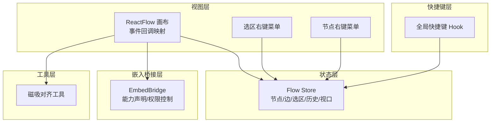
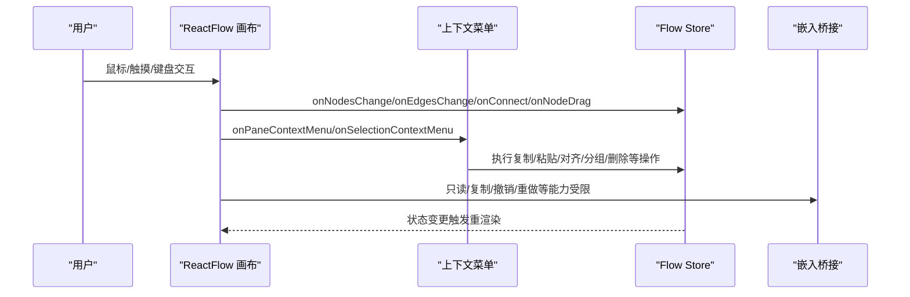
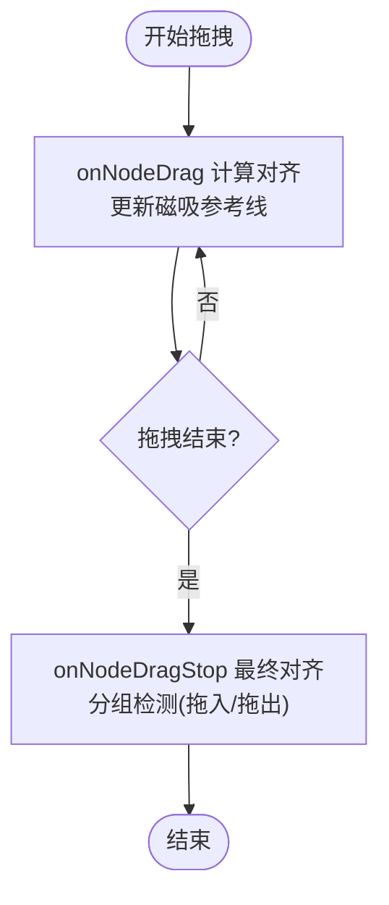
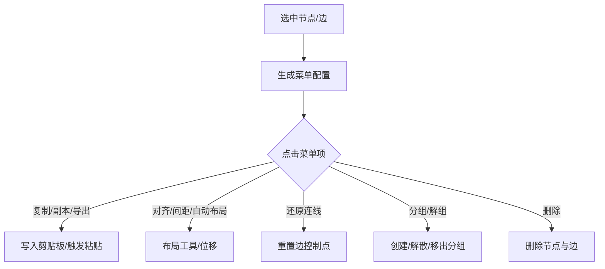
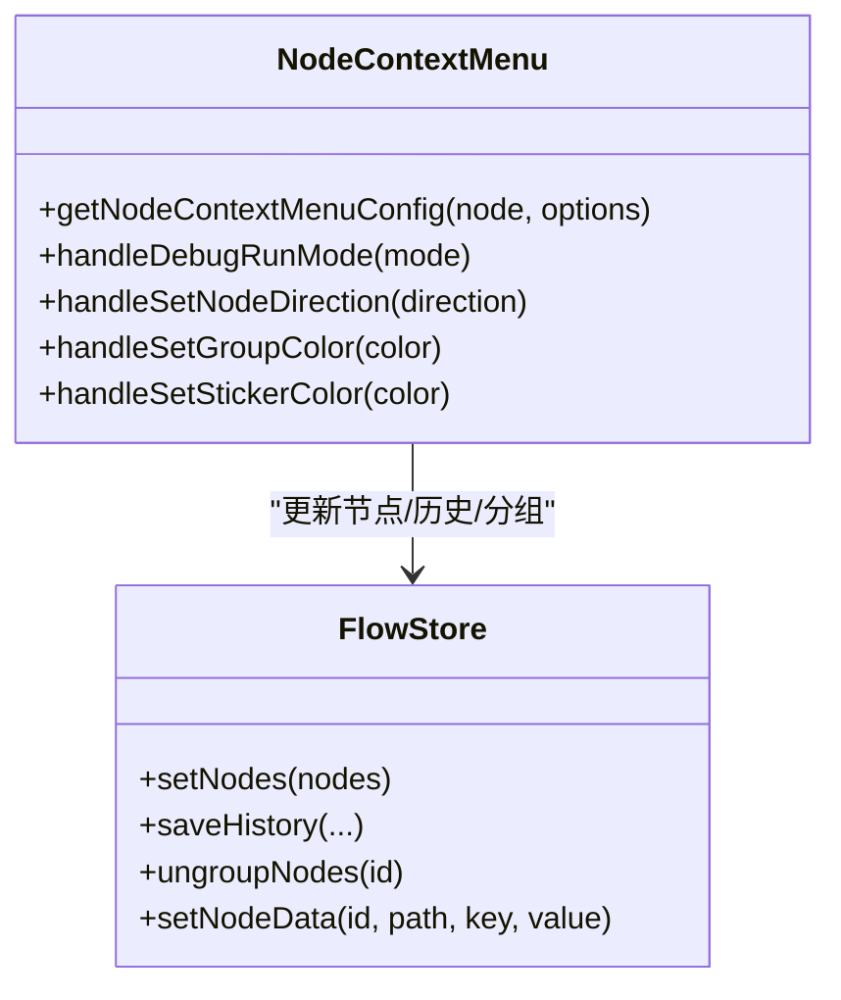
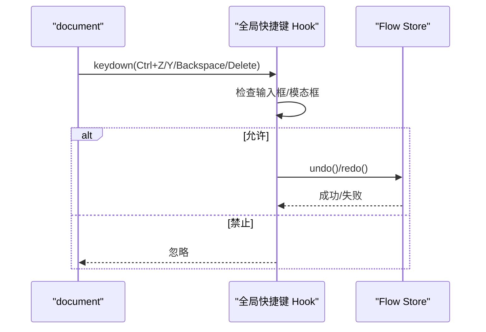
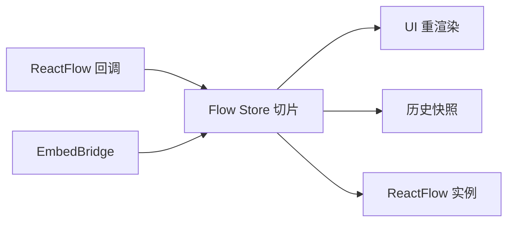
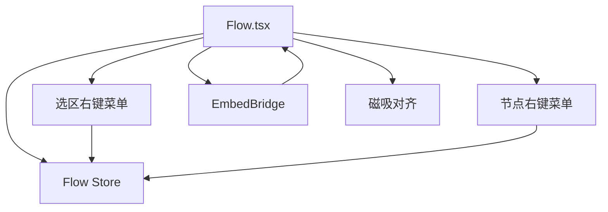

# 交互处理器

<cite>
**本文引用的文件**
- [Flow.tsx](file://src/components/Flow.tsx)
- [SelectionContextMenu.tsx](file://src/components/flow/selectionContextMenu.tsx)
- [NodeContextMenu.tsx](file://src/components/flow/nodes/nodeContextMenu.tsx)
- [useGlobalShortcuts.ts](file://src/hooks/useGlobalShortcuts.ts)
- [index.ts](file://src/stores/flow/index.ts)
- [embedBridge.ts](file://src/utils/embedBridge.ts)
- [useEmbedMode.ts](file://src/hooks/useEmbedMode.ts)
- [snapUtils.ts](file://src/core/snapUtils.ts)
- [GlobalPanel.tsx](file://src/components/panels/tools/GlobalPanel.tsx)
- [menus.mdx](file://dev/instructions/wails/reference/menus.mdx)
- [mouse-buttons.mdx](file://dev/instructions/wails/guides/mouse-buttons.mdx)
- [Action Types.md](file://dev/instructions/maafw-golang-binding/Action Types.md)
- [selection-drag-handler.mdx](file://dev/instructions/react-flow/api-reference/types/selection-drag-handler.mdx)
</cite>

## 目录
1. [简介](#简介)
2. [项目结构](#项目结构)
3. [核心组件](#核心组件)
4. [架构总览](#架构总览)
5. [详细组件分析](#详细组件分析)
6. [依赖关系分析](#依赖关系分析)
7. [性能考量](#性能考量)
8. [故障排查指南](#故障排查指南)
9. [结论](#结论)
10. [附录](#附录)

## 简介
本文件系统化梳理“交互处理器”的设计与实现，覆盖节点拖拽、连线连接、右键菜单、键盘快捷键、鼠标与触摸事件差异、以及交互状态管理与同步机制。文档以 Flow 工作流画布为中心，串联上下文菜单、全局快捷键、嵌入模式权限控制、磁吸对齐与自动布局等关键交互能力，并提供扩展与定制建议。

## 项目结构
交互处理器主要由以下层次构成：
- 视图层（ReactFlow 画布）：负责事件捕获、回调映射与状态更新
- 上下文菜单层：节点右键菜单与选区右键菜单
- 快捷键层：全局快捷键与按键组合处理
- 状态层（Zustand Store）：统一管理节点、边、选区、历史、视口等状态
- 嵌入桥接层：iframe 嵌入模式下的能力声明与权限控制
- 辅助工具层：磁吸对齐、布局算法、坐标换算

图表来源
- [Flow.tsx:648-705](file://src/components/Flow.tsx#L648-L705)
- [index.ts:1-28](file://src/stores/flow/index.ts#L1-L28)
- [useGlobalShortcuts.ts:156-168](file://src/hooks/useGlobalShortcuts.ts#L156-L168)
- [embedBridge.ts:70-96](file://src/utils/embedBridge.ts#L70-L96)
- [snapUtils.ts:109-161](file://src/core/snapUtils.ts#L109-L161)

章节来源
- [Flow.tsx:235-709](file://src/components/Flow.tsx#L235-L709)
- [index.ts:1-124](file://src/stores/flow/index.ts#L1-L124)

## 核心组件
- 画布交互中枢：在画布上注册节点拖拽、连线连接、双击、右键、选区右键等事件回调，同时根据嵌入模式动态调整交互能力（只读、复制、撤销/重做等）。
- 选区右键菜单：基于当前选中节点与边，动态生成“复制/创建副本/部分导出/对齐/间距/自动布局/还原连线路径/分组/删除”等操作。
- 节点右键菜单：针对不同节点类型（Pipeline/External/Anchor/Sticker/Group）提供差异化操作，如调试运行、端点方向、颜色、模板保存、删除等。
- 全局快捷键：统一处理撤销/重做/删除键重定向，避免与文本输入框冲突，并在模态框开启时禁用相关快捷键。
- 磁吸对齐：在拖拽过程中计算对齐参考线，支持仅视口内对齐与位置微调。
- 嵌入模式：通过 postMessage 协议声明能力集，动态限制画布交互能力。

章节来源
- [Flow.tsx:299-709](file://src/components/Flow.tsx#L299-L709)
- [SelectionContextMenu.tsx:322-504](file://src/components/flow/selectionContextMenu.tsx#L322-L504)
- [NodeContextMenu.tsx:466-700](file://src/components/flow/nodes/nodeContextMenu.tsx#L466-L700)
- [useGlobalShortcuts.ts:140-168](file://src/hooks/useGlobalShortcuts.ts#L140-L168)
- [snapUtils.ts:109-161](file://src/core/snapUtils.ts#L109-L161)
- [embedBridge.ts:179-244](file://src/utils/embedBridge.ts#L179-L244)

## 架构总览
交互处理器围绕 ReactFlow 画布展开，通过 onNodesChange/onEdgesChange/onConnect/onNodeDrag/onPaneClick/onPaneContextMenu 等回调将用户交互转化为状态变更；上下文菜单通过 Flow Store 的选择状态动态生成；全局快捷键在文档层面拦截键盘事件；嵌入模式通过桥接模块注入能力声明与 UI 配置。

图表来源
- [Flow.tsx:300-460](file://src/components/Flow.tsx#L300-L460)
- [SelectionContextMenu.tsx:322-504](file://src/components/flow/selectionContextMenu.tsx#L322-L504)
- [NodeContextMenu.tsx:466-700](file://src/components/flow/nodes/nodeContextMenu.tsx#L466-L700)
- [embedBridge.ts:179-244](file://src/utils/embedBridge.ts#L179-L244)

## 详细组件分析

### 画布交互中枢（节点拖拽/连线/右键/双击）
- 节点拖拽与磁吸对齐
  - onNodeDrag/onNodeDragStop：在拖拽过程中计算磁吸对齐并更新节点位置；支持仅视口内对齐与分组节点过滤。
  - onNodeDrag：实时更新磁吸参考线；若发生对齐，触发一次位置变更。
  - onNodeDragStop：结束拖拽后进行最终对齐与分组检测（拖入/拖出）。
- 连线连接
  - onConnectStart/onConnectEnd：记录连接起始参数；在空白处结束且未完成有效连接时，根据配置决定是否弹出“节点添加面板”。
  - onConnect：完成有效连接后写入边集合。
- 右键与双击
  - onPaneContextMenu：右键空白区域弹出“节点添加面板”，并阻止默认菜单。
  - onDoubleClick：双击空白区域弹出“节点添加面板”。
  - onPaneClick：抑制“连接-添加面板”联动导致的误开。
- 选区右键菜单
  - onSelectionContextMenu：记录右键坐标，触发选区右键菜单显示。
- 嵌入模式权限
  - onNodesChange/onEdgesChange：在只读模式下仅允许选择类变更，其他修改类变更将被拦截并向宿主发送错误消息。
  - nodesDraggable/nodesConnectable：根据能力开关动态禁用拖拽与连线。

图表来源
- [Flow.tsx:468-608](file://src/components/Flow.tsx#L468-L608)
- [snapUtils.ts:109-161](file://src/core/snapUtils.ts#L109-L161)

章节来源
- [Flow.tsx:299-460](file://src/components/Flow.tsx#L299-L460)
- [Flow.tsx:468-608](file://src/components/Flow.tsx#L468-L608)
- [embedBridge.ts:179-244](file://src/utils/embedBridge.ts#L179-L244)

### 选区右键菜单（SelectionContextMenu）
- 动态配置
  - 基于当前选中节点与边，生成“复制/创建副本/部分导出/对齐/间距/自动布局/还原连线路径/分组/删除”等菜单项。
  - 子菜单按功能分组，支持可见性与禁用条件判断。
- 关联边计算
  - 相关边：同时与选中节点源/目标相连的边。
  - 连接边：与选中节点存在任意端点相连的边。
- 行为实现
  - 复制/创建副本：写入剪贴板或触发 Flow Store 的粘贴逻辑。
  - 部分导出：将选中节点与相关边转换为导出格式并写入剪贴板。
  - 对齐/间距/自动布局：委托布局工具与 Flow Store 的位移/重排逻辑。
  - 还原连线路径：重置边的控制点。
  - 分组/解组：创建/解散分组或从分组中移出节点。
  - 删除：删除选中节点与相关边。

图表来源
- [SelectionContextMenu.tsx:322-504](file://src/components/flow/selectionContextMenu.tsx#L322-L504)
- [SelectionContextMenu.tsx:52-98](file://src/components/flow/selectionContextMenu.tsx#L52-L98)

章节来源
- [SelectionContextMenu.tsx:1-505](file://src/components/flow/selectionContextMenu.tsx#L1-L505)

### 节点右键菜单（NodeContextMenu）
- 动态配置
  - 针对 Group/Pipeline/External/Anchor/Sticker/Group 等节点类型生成差异化菜单。
  - 支持子菜单（端点方向、便签颜色、调试运行模式）、分隔线与可见/禁用条件。
- 调试运行
  - “设为入口节点”、“从此节点运行”、“单节点运行”、“仅识别”、“仅动作”等模式，结合能力清单与资源预检结果动态可用。
- 其他操作
  - 复制节点名、编辑 JSON、复制 Reco JSON、保存为模板、设置端点方向、分组颜色、复制便签内容等。

图表来源
- [NodeContextMenu.tsx:466-700](file://src/components/flow/nodes/nodeContextMenu.tsx#L466-L700)
- [index.ts:1-28](file://src/stores/flow/index.ts#L1-L28)

章节来源
- [NodeContextMenu.tsx:1-701](file://src/components/flow/nodes/nodeContextMenu.tsx#L1-L701)

### 键盘快捷键（全局与按键组合）
- 全局快捷键
  - 撤销（Ctrl/Cmd+Z）、重做（Ctrl/Cmd+Y 或 Ctrl+Shift+Z），在输入框与模态框开启时自动忽略。
  - Delete 键重定向为 Backspace，确保在画布焦点下触发删除行为。
- 按键组合
  - 使用 ahooks 的 useKeyPress 监听 Ctrl+C/V，仅在允许复制且未聚焦文本编辑器时生效。
- 文档级拦截
  - 通过 useGlobalShortcuts 在 document 上注册 keydown 监听，采用事件冒泡阶段拦截，避免与页面其他输入控件冲突。

图表来源
- [useGlobalShortcuts.ts:72-138](file://src/hooks/useGlobalShortcuts.ts#L72-L138)
- [Flow.tsx:103-131](file://src/components/Flow.tsx#L103-L131)

章节来源
- [useGlobalShortcuts.ts:1-169](file://src/hooks/useGlobalShortcuts.ts#L1-L169)
- [GlobalPanel.tsx:38-74](file://src/components/panels/tools/GlobalPanel.tsx#L38-L74)

### 鼠标与触摸事件处理差异
- 事件参数差异
  - onConnectEnd 接收 MouseEvent 或 TouchEvent，内部通过“changedTouches”判断触摸事件并提取 clientX/clientY。
- 触摸生命周期
  - 支持 TouchDown/TouchMove/TouchUp 生命周期，可在底层框架中实现多触点与压力感知。
- 鼠标按钮识别
  - 通过 MouseEvent.button 判断左右中键与回退/前进按键，便于在画布上区分拖拽与菜单触发。

章节来源
- [Flow.tsx:367-417](file://src/components/Flow.tsx#L367-L417)
- [Action Types.md:265-295](file://dev/instructions/maafw-golang-binding/Action Types.md#L265-L295)
- [mouse-buttons.mdx:1-27](file://dev/instructions/wails/guides/mouse-buttons.mdx#L1-L27)

### 交互状态管理与同步
- 状态切片
  - Flow Store 通过多个 slice 组合（视图、选择、历史、节点、边、图、路径、锚点引用、探索），统一管理交互状态。
- 历史与撤销/重做
  - 每次交互操作均记录历史快照，支持撤销/重做与成功/失败反馈。
- 选区与实例
  - onSelectionChange 将选中节点/边写入 Store；useReactFlow 实例用于外部操作（如删除元素）。
- 嵌入模式状态
  - 通过 initEmbedBridge 完成握手，声明能力集与 UI 配置，后续在画布与菜单中按能力开关进行权限控制。

图表来源
- [index.ts:1-28](file://src/stores/flow/index.ts#L1-L28)
- [Flow.tsx:137-189](file://src/components/Flow.tsx#L137-L189)
- [embedBridge.ts:179-244](file://src/utils/embedBridge.ts#L179-L244)

章节来源
- [index.ts:1-124](file://src/stores/flow/index.ts#L1-L124)
- [Flow.tsx:137-189](file://src/components/Flow.tsx#L137-L189)
- [embedBridge.ts:179-244](file://src/utils/embedBridge.ts#L179-L244)

## 依赖关系分析
- 组件耦合
  - Flow.tsx 作为中枢，依赖 Flow Store、上下文菜单组件、嵌入桥接模块与磁吸工具。
  - 上下文菜单通过 Flow Store 的选择状态与操作接口生成菜单项与执行动作。
- 外部依赖
  - ReactFlow 提供事件回调与实例访问；ahooks 提供按键监听；Ant Design Dropdown 提供菜单渲染。
- 能力耦合
  - 嵌入模式通过能力声明限制交互能力，避免在只读/禁止复制等场景下产生无效交互。

图表来源
- [Flow.tsx:648-705](file://src/components/Flow.tsx#L648-L705)
- [SelectionContextMenu.tsx:322-504](file://src/components/flow/selectionContextMenu.tsx#L322-L504)
- [NodeContextMenu.tsx:466-700](file://src/components/flow/nodes/nodeContextMenu.tsx#L466-L700)
- [embedBridge.ts:179-244](file://src/utils/embedBridge.ts#L179-L244)

章节来源
- [Flow.tsx:648-705](file://src/components/Flow.tsx#L648-L705)
- [SelectionContextMenu.tsx:322-504](file://src/components/flow/selectionContextMenu.tsx#L322-L504)
- [NodeContextMenu.tsx:466-700](file://src/components/flow/nodes/nodeContextMenu.tsx#L466-L700)

## 性能考量
- 事件节流与防抖
  - 视口变化与画布尺寸变化使用防抖更新，减少频繁写入 Store 导致的重渲染。
- 选择性渲染
  - 上下文菜单按需生成，仅在触发时计算可见性与禁用状态。
- 磁吸计算优化
  - 仅在启用磁吸时计算对齐；可选“仅视口内对齐”，缩小计算范围。
- 历史记录批处理
  - 操作完成后批量保存历史快照，避免高频操作造成历史膨胀。

## 故障排查指南
- 右键菜单不出现
  - 检查 onPaneContextMenu 是否被只读模式拦截；确认事件未被上层容器阻止。
- 拖拽无响应
  - 确认 nodesDraggable 未被禁用；检查嵌入模式能力开关。
- 连线无法建立
  - 检查 onConnectStart/onConnectEnd 流程与只读模式；确认 handle 方向与端点类型匹配。
- 快捷键无效
  - 确认未在输入框或模态框中；检查 useGlobalShortcuts 的事件监听是否注册。
- 磁吸对齐异常
  - 检查 enableNodeSnap 与 snapOnlyInViewport 配置；确认节点尺寸与 measured 字段存在。

章节来源
- [Flow.tsx:300-460](file://src/components/Flow.tsx#L300-L460)
- [useGlobalShortcuts.ts:72-138](file://src/hooks/useGlobalShortcuts.ts#L72-L138)
- [snapUtils.ts:109-161](file://src/core/snapUtils.ts#L109-L161)

## 结论
交互处理器以 ReactFlow 为核心，结合上下文菜单、全局快捷键、嵌入模式与磁吸对齐等能力，构建了完整的可视化编辑体验。通过 Flow Store 的集中式状态管理与能力声明机制，既能保证交互一致性，又便于扩展与定制。建议在新增交互行为时遵循“事件回调 → Store 更新 → UI 同步”的闭环，并在嵌入模式下严格遵守能力声明，确保跨环境的一致性与安全性。

## 附录
- 键盘快捷键参考
  - 撤销：Ctrl/Cmd+Z
  - 重做：Ctrl/Cmd+Y 或 Ctrl+Shift+Z
  - 删除键重定向：Delete → Backspace
- 鼠标按钮参考
  - 0：左键；1：中键；2：右键；3：返回；4：前进
- 触摸生命周期参考
  - TouchDown → TouchMove（多次）→ TouchUp

章节来源
- [menus.mdx:134-169](file://dev/instructions/wails/reference/menus.mdx#L134-L169)
- [mouse-buttons.mdx:1-27](file://dev/instructions/wails/guides/mouse-buttons.mdx#L1-L27)
- [Action Types.md:265-295](file://dev/instructions/maafw-golang-binding/Action Types.md#L265-L295)
- [selection-drag-handler.mdx:1-18](file://dev/instructions/react-flow/api-reference/types/selection-drag-handler.mdx#L1-L18)