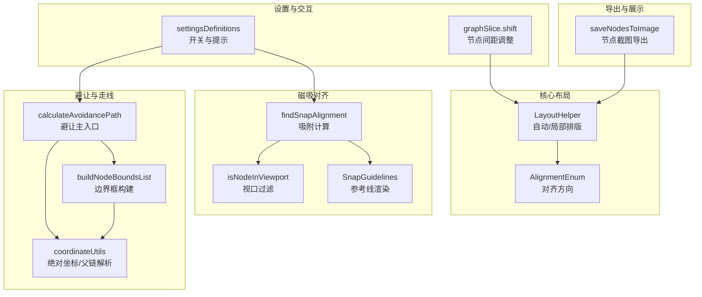
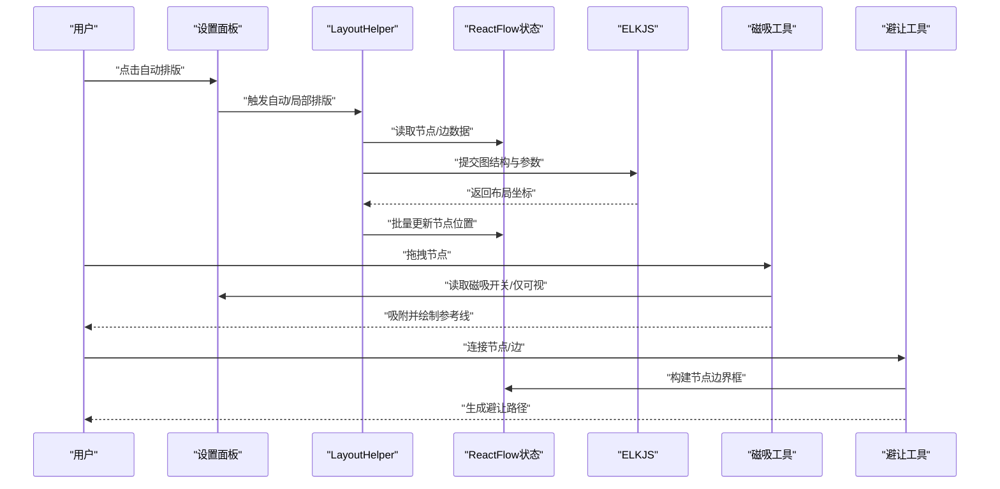
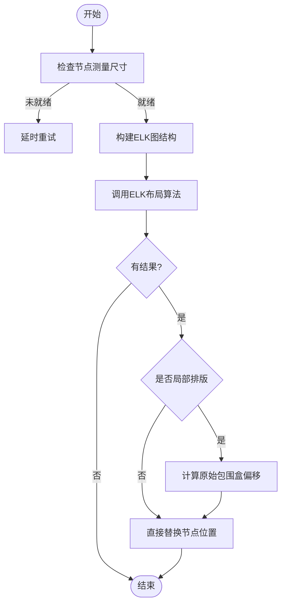
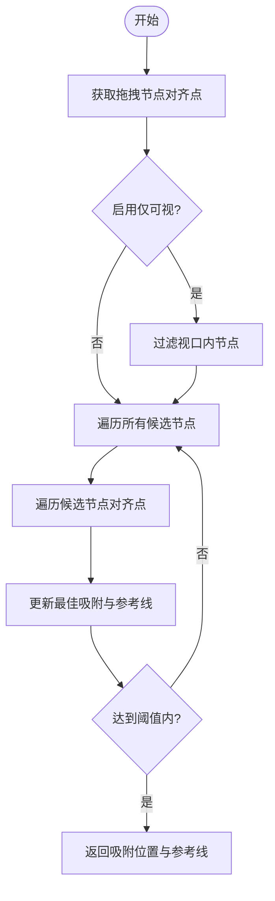
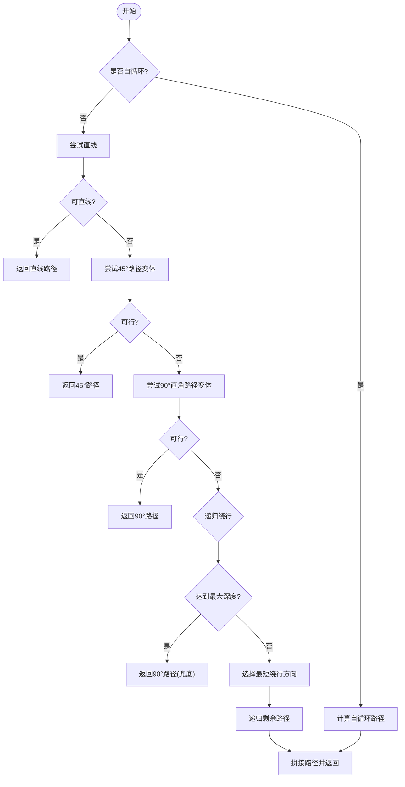
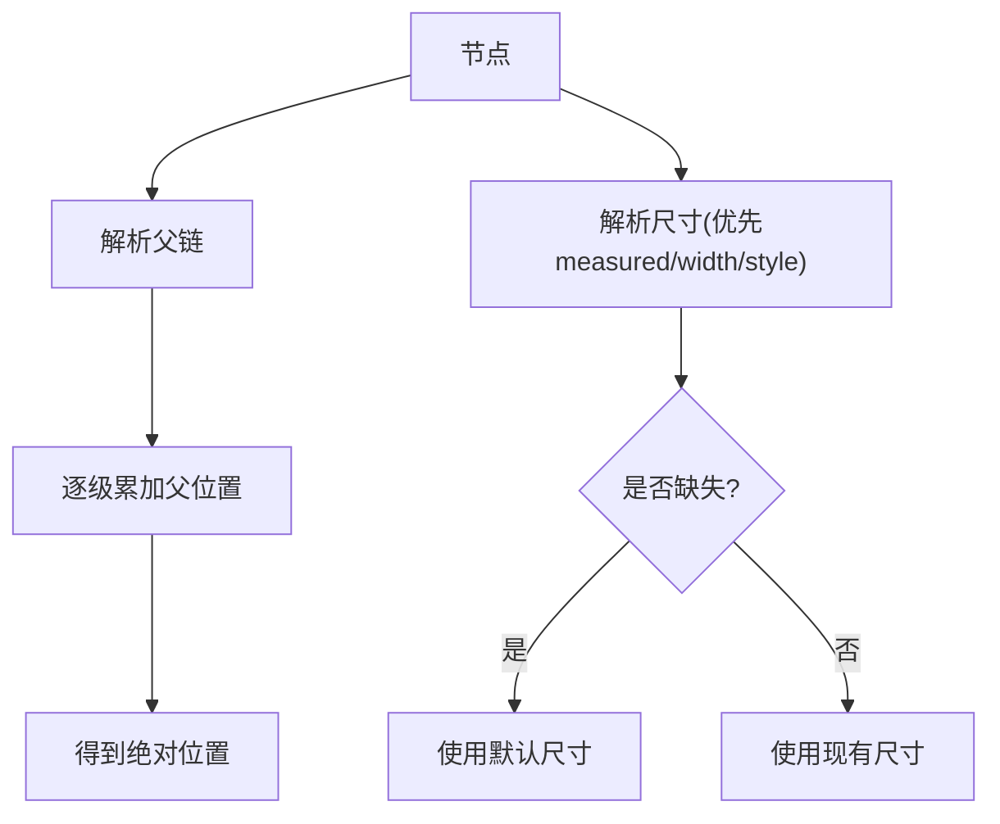
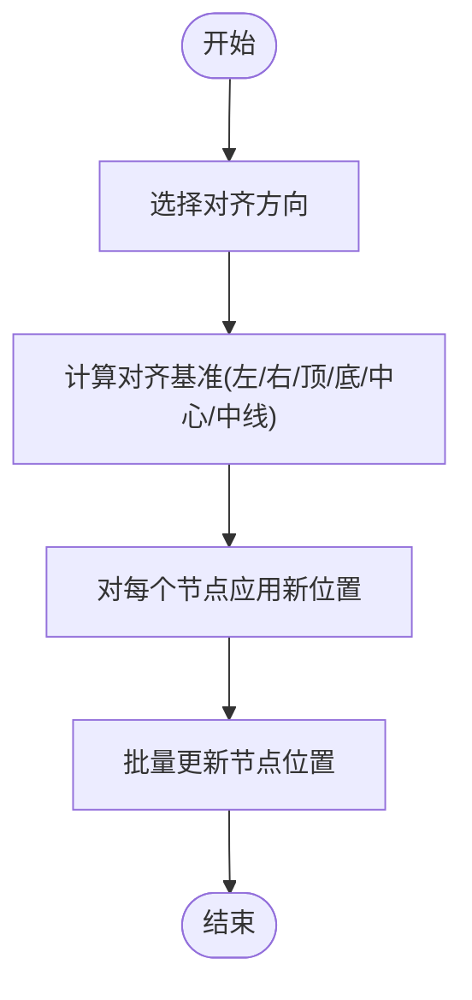
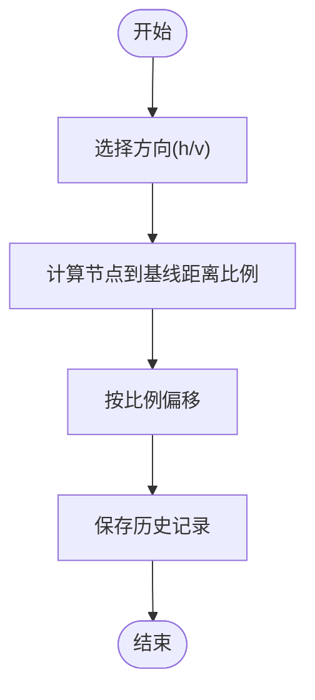
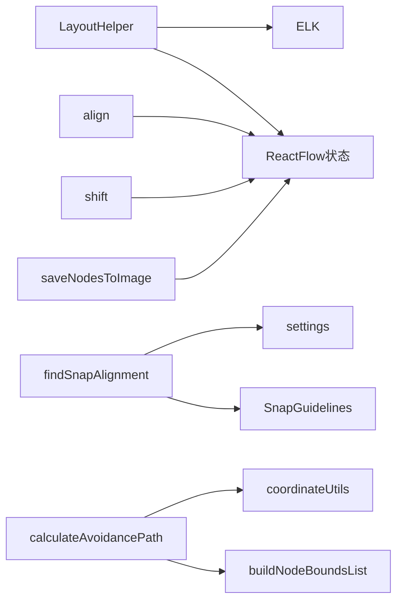

# 布局算法

<cite>
**本文引用的文件**
- [layout.ts](file://src/core/layout.ts)
- [snapUtils.ts](file://src/core/snapUtils.ts)
- [avoidanceUtils.ts](file://src/core/avoidanceUtils.ts)
- [coordinateUtils.ts](file://src/stores/flow/utils/coordinateUtils.ts)
- [settingsDefinitions.ts](file://src/components/panels/settings/settingsDefinitions.ts)
- [SnapGuidelines.tsx](file://src/components/flow/SnapGuidelines.tsx)
- [snapper.ts](file://src/utils/ui/snapper.ts)
- [graphSlice.ts](file://src/stores/flow/slices/graphSlice.ts)
</cite>

## 目录
1. [简介](#简介)
2. [项目结构](#项目结构)
3. [核心组件](#核心组件)
4. [架构总览](#架构总览)
5. [详细组件分析](#详细组件分析)
6. [依赖关系分析](#依赖关系分析)
7. [性能考量](#性能考量)
8. [故障排查指南](#故障排查指南)
9. [结论](#结论)
10. [附录](#附录)

## 简介
本文件系统性梳理了本项目的布局算法体系，覆盖节点自动排列、手动调整（磁吸对齐）、网格对齐与智能避让、冲突解决与优化策略，并给出可扩展与性能优化建议。文档面向不同技术背景读者，既提供高层概览也包含代码级细节与可视化图示。

## 项目结构
与布局相关的关键模块分布如下：
- 核心布局与对齐：src/core/layout.ts
- 磁吸对齐工具：src/core/snapUtils.ts、src/components/flow/SnapGuidelines.tsx
- 边避让与走线：src/core/avoidanceUtils.ts、src/stores/flow/utils/coordinateUtils.ts
- 设置项与开关：src/components/panels/settings/settingsDefinitions.ts
- 图片导出辅助：src/utils/ui/snapper.ts
- 间距调整与局部布局：src/stores/flow/slices/graphSlice.ts

图表来源
- [layout.ts:1-220](file://src/core/layout.ts#L1-L220)
- [snapUtils.ts:1-162](file://src/core/snapUtils.ts#L1-L162)
- [avoidanceUtils.ts:1-780](file://src/core/avoidanceUtils.ts#L1-L780)
- [coordinateUtils.ts:1-199](file://src/stores/flow/utils/coordinateUtils.ts#L1-L199)
- [settingsDefinitions.ts:280-304](file://src/components/panels/settings/settingsDefinitions.ts#L280-L304)
- [graphSlice.ts:288-309](file://src/stores/flow/slices/graphSlice.ts#L288-L309)
- [snapper.ts:1-87](file://src/utils/ui/snapper.ts#L1-L87)

章节来源
- [layout.ts:1-220](file://src/core/layout.ts#L1-L220)
- [snapUtils.ts:1-162](file://src/core/snapUtils.ts#L1-L162)
- [avoidanceUtils.ts:1-780](file://src/core/avoidanceUtils.ts#L1-L780)
- [coordinateUtils.ts:1-199](file://src/stores/flow/utils/coordinateUtils.ts#L1-L199)
- [settingsDefinitions.ts:280-304](file://src/components/panels/settings/settingsDefinitions.ts#L280-L304)
- [graphSlice.ts:288-309](file://src/stores/flow/slices/graphSlice.ts#L288-L309)
- [snapper.ts:1-87](file://src/utils/ui/snapper.ts#L1-L87)

## 核心组件
- 自动/局部排版：基于 ELK 的分层布局算法，支持全局与局部节点的重新定位，并保证局部排版时的相对位置不变。
- 磁吸对齐：在拖拽节点时，按节点边缘与中心线进行吸附，支持仅对可视节点吸附与阈值控制。
- 边避让：针对连接边的路径规划，自动避开节点，支持自循环与平行边偏移。
- 坐标与层级：提供节点绝对坐标、父链解析与尺寸回退策略，保障复杂层级下的定位正确性。
- 设置与交互：通过设置面板控制磁吸、仅可视吸附、边走线模式等行为。

章节来源
- [layout.ts:31-218](file://src/core/layout.ts#L31-L218)
- [snapUtils.ts:100-161](file://src/core/snapUtils.ts#L100-L161)
- [avoidanceUtils.ts:691-779](file://src/core/avoidanceUtils.ts#L691-L779)
- [coordinateUtils.ts:85-144](file://src/stores/flow/utils/coordinateUtils.ts#L85-L144)
- [settingsDefinitions.ts:280-304](file://src/components/panels/settings/settingsDefinitions.ts#L280-L304)

## 架构总览
整体流程分为“自动排版”“手动磁吸”“边避让”三大块，分别由不同的工具函数与组件协作完成。设置项贯穿其中，决定行为与性能权衡。

图表来源
- [layout.ts:31-148](file://src/core/layout.ts#L31-L148)
- [snapUtils.ts:100-161](file://src/core/snapUtils.ts#L100-L161)
- [avoidanceUtils.ts:691-779](file://src/core/avoidanceUtils.ts#L691-L779)

## 详细组件分析

### 自动/局部排版（ELK 分层布局）
- 功能要点
  - 全局排版：对所有节点进行一次布局，替换整个图。
  - 局部排版：仅对选中节点进行布局，同时保持其相对位置不变。
  - 参数：方向、层间距、节点间距、交叉最小化策略、网络单纯形节点放置等。
- 数据准备
  - 从状态管理读取节点与边，确保测量尺寸可用；不可用则延时重试。
  - 局部排版时仅保留选中节点之间的边，减少计算规模。
- 输出
  - 将 ELK 返回的布局坐标映射回节点，批量更新位置。

图表来源
- [layout.ts:41-148](file://src/core/layout.ts#L41-L148)

章节来源
- [layout.ts:31-148](file://src/core/layout.ts#L31-L148)

### 磁吸对齐（拖拽吸附与参考线）
- 功能要点
  - 计算拖拽节点与其它节点的对齐点（左/中/右、上/中/下），在阈值内进行吸附。
  - 支持“仅磁吸可视节点”，通过视口信息过滤候选节点。
  - 渲染对齐参考线（垂直/水平），提升视觉反馈。
- 关键流程
  - 计算拖拽节点与候选节点的对齐点集合。
  - 遍历候选节点，比较对齐点距离，记录最佳吸附位移与参考线位置。
  - 返回新的吸附位置与参考线集合。

图表来源
- [snapUtils.ts:100-161](file://src/core/snapUtils.ts#L100-L161)
- [snapUtils.ts:38-78](file://src/core/snapUtils.ts#L38-L78)
- [SnapGuidelines.tsx:1-58](file://src/components/flow/SnapGuidelines.tsx#L1-L58)

章节来源
- [snapUtils.ts:100-161](file://src/core/snapUtils.ts#L100-L161)
- [snapUtils.ts:38-78](file://src/core/snapUtils.ts#L38-L78)
- [SnapGuidelines.tsx:1-58](file://src/components/flow/SnapGuidelines.tsx#L1-L58)
- [settingsDefinitions.ts:280-304](file://src/components/panels/settings/settingsDefinitions.ts#L280-L304)

### 边避让与智能走线
- 功能要点
  - 主入口根据源/目标位置与句柄方位，计算避让路径。
  - 支持自循环边的特殊路径与平行边的偏移分散。
  - 提供圆角转角、路径中点标注等输出。
- 算法策略
  - 直线优先：若无节点穿过则直接连接。
  - 斜线/直角路径：在水平或垂直主导方向尝试 45° 或 90° 路径变体。
  - 递归绕行：超过最大深度或被反复阻挡时，选择最短绕行方向。
  - 自循环：依据句柄方位选择上/下/左/右绕行。
- 性能与稳定性
  - 通过最大递归深度与“同一节点重复阻挡次数”限制避免无限分支。
  - 平行边偏移步长控制边簇分布，避免重叠。

图表来源
- [avoidanceUtils.ts:691-779](file://src/core/avoidanceUtils.ts#L691-L779)
- [avoidanceUtils.ts:380-577](file://src/core/avoidanceUtils.ts#L380-L577)
- [avoidanceUtils.ts:582-660](file://src/core/avoidanceUtils.ts#L582-L660)

章节来源
- [avoidanceUtils.ts:691-779](file://src/core/avoidanceUtils.ts#L691-L779)
- [avoidanceUtils.ts:380-577](file://src/core/avoidanceUtils.ts#L380-L577)
- [avoidanceUtils.ts:582-660](file://src/core/avoidanceUtils.ts#L582-L660)

### 坐标与层级（绝对坐标与父链）
- 绝对坐标：从子节点沿父链累加，得到绝对位置。
- 尺寸回退：若节点未测量尺寸，采用默认宽高。
- 运行时定位：在运行时实例中获取节点绝对矩形，作为避让与吸附的输入。

图表来源
- [coordinateUtils.ts:64-98](file://src/stores/flow/utils/coordinateUtils.ts#L64-L98)
- [coordinateUtils.ts:37-52](file://src/stores/flow/utils/coordinateUtils.ts#L37-L52)
- [avoidanceUtils.ts:666-683](file://src/core/avoidanceUtils.ts#L666-L683)

章节来源
- [coordinateUtils.ts:64-98](file://src/stores/flow/utils/coordinateUtils.ts#L64-L98)
- [coordinateUtils.ts:37-52](file://src/stores/flow/utils/coordinateUtils.ts#L37-L52)
- [avoidanceUtils.ts:666-683](file://src/core/avoidanceUtils.ts#L666-L683)

### 节点对齐（左/右/顶/底/中/居中）
- 功能：将一组节点按指定方向对齐，支持左右、上下、水平居中、垂直居中。
- 实现：计算边界或中心线，统一设置节点位置，然后批量更新。

图表来源
- [layout.ts:150-218](file://src/core/layout.ts#L150-L218)

章节来源
- [layout.ts:150-218](file://src/core/layout.ts#L150-L218)

### 节点间距调整（平行方向均匀分布）
- 功能：在水平或垂直方向上，按与基线的距离对节点进行偏移，使间距更均匀。
- 适用场景：局部排版后微调，或手动调整节点分布。

图表来源
- [graphSlice.ts:288-309](file://src/stores/flow/slices/graphSlice.ts#L288-L309)

章节来源
- [graphSlice.ts:288-309](file://src/stores/flow/slices/graphSlice.ts#L288-L309)

### 磁吸设置与开关
- 节点磁吸对齐：拖拽时自动吸附到边缘/中心线并显示参考线。
- 仅磁吸可视节点：仅与可视范围内的节点进行吸附。
- 边走线模式：曲线/直角/避让三种模式切换。
- 边标签与控制点：可显示边标签与拖拽手柄。

章节来源
- [settingsDefinitions.ts:280-304](file://src/components/panels/settings/settingsDefinitions.ts#L280-L304)
- [settingsDefinitions.ts:306-345](file://src/components/panels/settings/settingsDefinitions.ts#L306-L345)

## 依赖关系分析
- LayoutHelper 依赖 ELKJS 进行自动排版，依赖 ReactFlow 状态管理进行节点/边读取与更新。
- 磁吸工具依赖设置项控制行为，并通过 SnapGuidelines 组件渲染参考线。
- 避让工具依赖坐标工具计算绝对位置与边界框，支持自循环与平行边处理。
- 节点对齐与间距调整通过批量更新节点位置集成到状态管理。
- 导出工具与布局算法解耦，仅用于截图导出。

图表来源
- [layout.ts:15-148](file://src/core/layout.ts#L15-L148)
- [snapUtils.ts:100-161](file://src/core/snapUtils.ts#L100-L161)
- [avoidanceUtils.ts:691-779](file://src/core/avoidanceUtils.ts#L691-L779)
- [coordinateUtils.ts:85-144](file://src/stores/flow/utils/coordinateUtils.ts#L85-L144)
- [graphSlice.ts:288-309](file://src/stores/flow/slices/graphSlice.ts#L288-L309)
- [snapper.ts:22-86](file://src/utils/ui/snapper.ts#L22-L86)

章节来源
- [layout.ts:15-148](file://src/core/layout.ts#L15-L148)
- [snapUtils.ts:100-161](file://src/core/snapUtils.ts#L100-L161)
- [avoidanceUtils.ts:691-779](file://src/core/avoidanceUtils.ts#L691-L779)
- [coordinateUtils.ts:85-144](file://src/stores/flow/utils/coordinateUtils.ts#L85-L144)
- [graphSlice.ts:288-309](file://src/stores/flow/slices/graphSlice.ts#L288-L309)
- [snapper.ts:22-86](file://src/utils/ui/snapper.ts#L22-L86)

## 性能考量
- 自动排版
  - ELK 复杂度与节点/边数量相关，建议在大规模图时：
    - 使用局部排版，仅对选中子图布局。
    - 确保节点测量尺寸可用，避免延时重试带来的抖动。
- 磁吸对齐
  - 仅可视吸附可显著减少候选节点数量，建议开启。
  - 吸附阈值与参考线渲染应结合实际画布规模与性能表现调节。
- 边避让
  - 控制最大递归深度与重复阻挡次数，防止复杂拓扑导致的指数分支。
  - 平行边偏移步长与圆角半径影响路径复杂度，适度降低可提升性能。
- 坐标计算
  - 父链解析与绝对坐标计算在层级深时有一定成本，建议缓存必要结果。
- 导出与渲染
  - 截图导出涉及 DOM 转图片，建议在空闲时段或小规模节点集执行。

[本节为通用性能指导，不直接分析具体文件]

## 故障排查指南
- 自动排版无效
  - 检查节点是否具备测量尺寸；若缺失，等待延时重试或手动设置尺寸。
  - 局部排版时确认选中节点集合与边集合正确。
- 磁吸对齐不生效
  - 确认“节点磁吸对齐”已开启；如开启“仅磁吸可视节点”，请检查目标节点是否在视口内。
  - 调整吸附阈值，避免过小导致难以吸附。
- 边路径异常
  - 检查避让配置（最大递归深度、避让边距、圆角半径）是否合理。
  - 自循环边路径受句柄方位影响，确认源/目标句柄位置。
- 参考线不显示
  - 确认磁吸吸附计算返回了参考线；检查渲染组件是否挂载。
- 导出图片空白
  - 确认画布元素存在且视口计算正确；检查导出尺寸与缩放参数。

章节来源
- [layout.ts:51-59](file://src/core/layout.ts#L51-L59)
- [snapUtils.ts:38-78](file://src/core/snapUtils.ts#L38-L78)
- [avoidanceUtils.ts:496-512](file://src/core/avoidanceUtils.ts#L496-L512)
- [SnapGuidelines.tsx:1-58](file://src/components/flow/SnapGuidelines.tsx#L1-L58)
- [snapper.ts:35-86](file://src/utils/ui/snapper.ts#L35-L86)

## 结论
本项目的布局算法以 ELK 为基础实现自动排版，辅以磁吸对齐与智能避让，满足从“结构化布局”到“交互式微调”的全场景需求。通过设置项与工具函数的协同，系统在可用性与性能间取得平衡。对于大规模节点，建议采用局部排版、仅可视吸附、合理避让参数与缓存策略，以获得稳定体验。

[本节为总结性内容，不直接分析具体文件]

## 附录

### 配置项与行为对照
- 节点磁吸对齐：拖拽时吸附到边缘/中心线并显示参考线。
- 仅磁吸可视节点：仅与可视范围内的节点吸附。
- 边走线模式：曲线/直角/避让。
- 边标签与控制点：显示边标签与拖拽手柄。

章节来源
- [settingsDefinitions.ts:280-345](file://src/components/panels/settings/settingsDefinitions.ts#L280-L345)

### 自定义与扩展建议
- 自定义对齐策略
  - 在对齐函数中新增方向枚举与计算逻辑，复用批量更新接口。
- 自定义吸附阈值与参考线样式
  - 通过设置项与渲染组件扩展吸附行为与视觉反馈。
- 自定义避让策略
  - 在避让主入口中加入新的路径变体或启发式规则，注意控制递归深度与性能。
- 扩展坐标系统
  - 在坐标工具中增加新的定位模式或缓存策略，减少重复计算。

[本节为概念性建议，不直接分析具体文件]