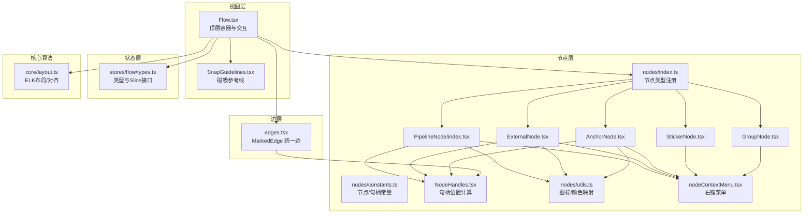
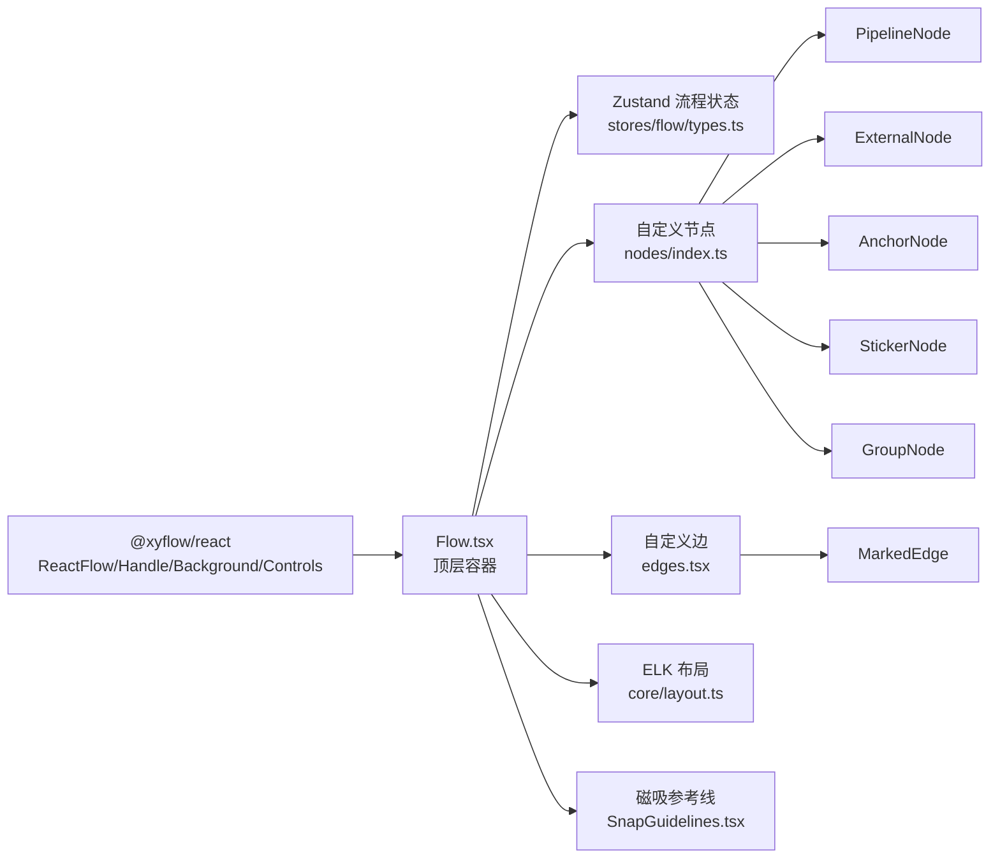
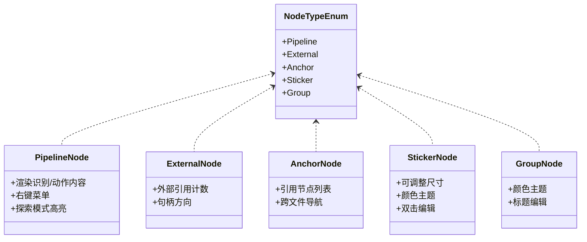
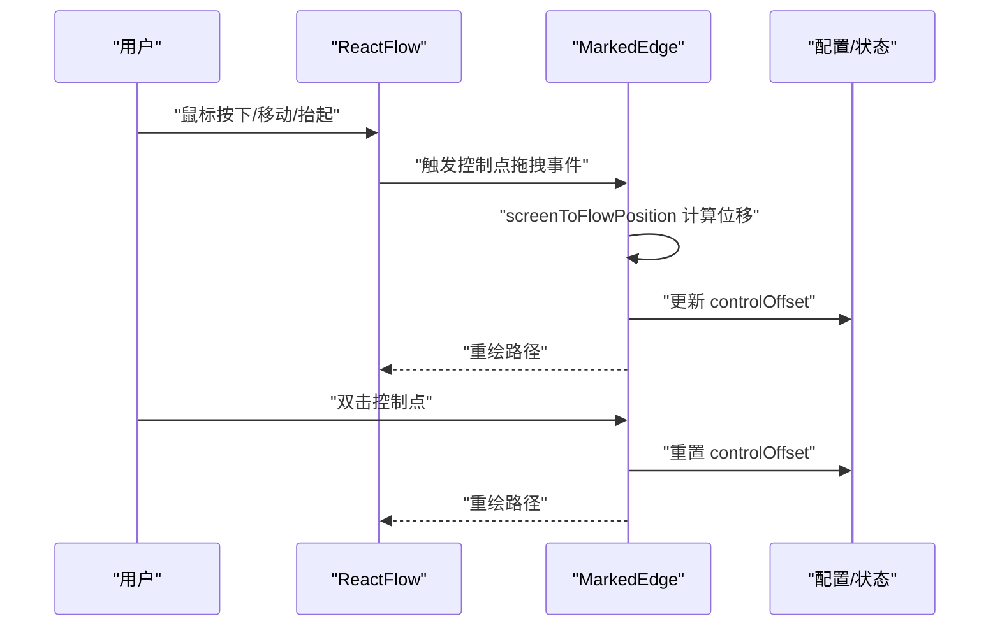
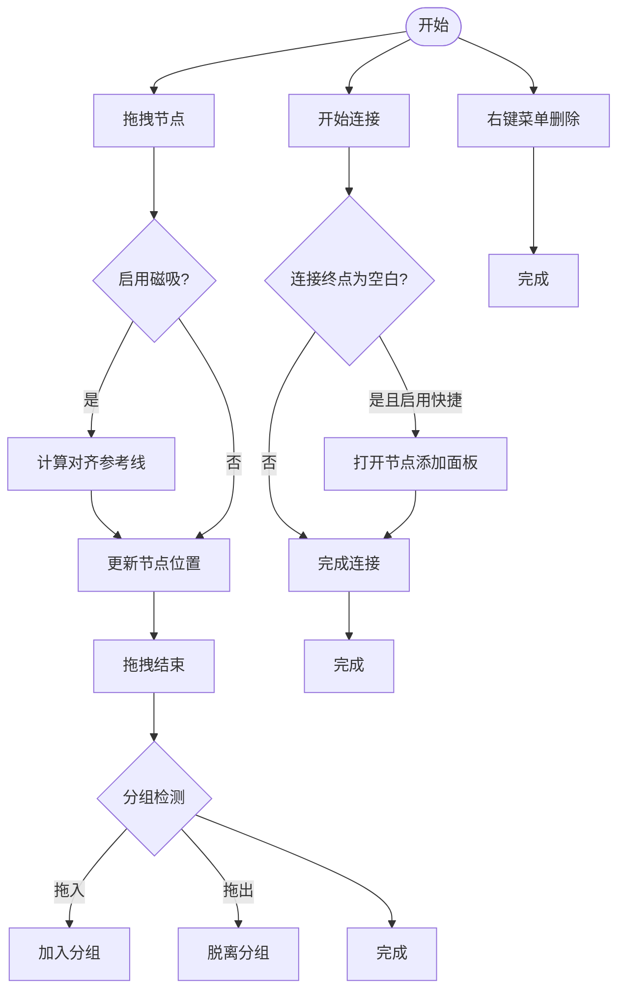
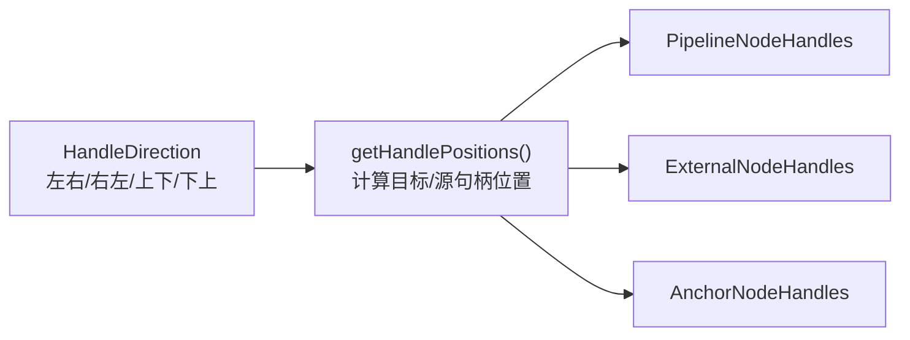
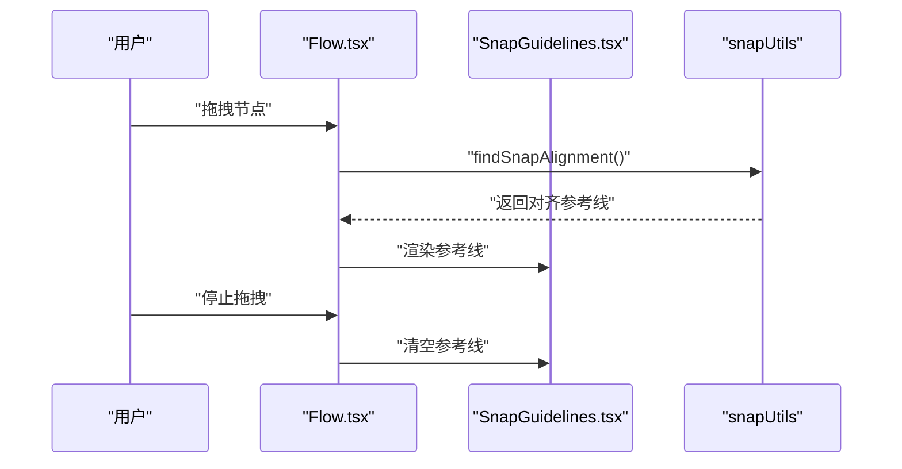
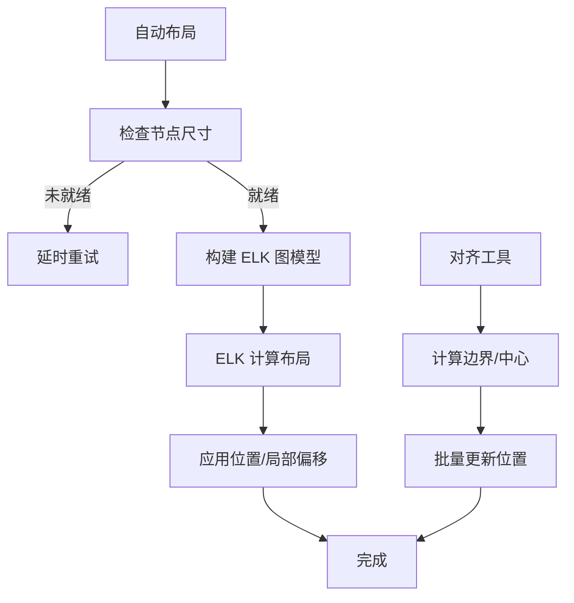
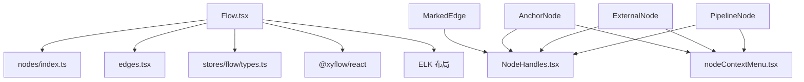

# 流程图组件

<cite>
**本文档引用的文件**
- [Flow.tsx](file://src/components/Flow.tsx)
- [edges.tsx](file://src/components/flow/edges.tsx)
- [types.ts](file://src/stores/flow/types.ts)
- [layout.ts](file://src/core/layout.ts)
- [constants.ts](file://src/components/flow/nodes/constants.ts)
- [index.ts](file://src/components/flow/nodes/index.ts)
- [PipelineNode/index.tsx](file://src/components/flow/nodes/PipelineNode/index.tsx)
- [ExternalNode.tsx](file://src/components/flow/nodes/ExternalNode.tsx)
- [AnchorNode.tsx](file://src/components/flow/nodes/AnchorNode.tsx)
- [StickerNode.tsx](file://src/components/flow/nodes/StickerNode.tsx)
- [GroupNode.tsx](file://src/components/flow/nodes/GroupNode.tsx)
- [utils.ts](file://src/components/flow/nodes/utils.ts)
- [NodeHandles.tsx](file://src/components/flow/nodes/components/NodeHandles.tsx)
- [nodeContextMenu.tsx](file://src/components/flow/nodes/nodeContextMenu.tsx)
- [SnapGuidelines.tsx](file://src/components/flow/SnapGuidelines.tsx)
</cite>

## 目录
1. [简介](#简介)
2. [项目结构](#项目结构)
3. [核心组件](#核心组件)
4. [架构总览](#架构总览)
5. [详细组件分析](#详细组件分析)
6. [依赖分析](#依赖分析)
7. [性能考虑](#性能考虑)
8. [故障排查指南](#故障排查指南)
9. [结论](#结论)
10. [附录](#附录)

## 简介
本文件系统化梳理了基于 React Flow 的流程图组件体系，涵盖节点系统（PipelineNode、ExternalNode、AnchorNode、StickerNode、GroupNode）、连线组件与交互机制（拖拽、连接、删除、分组、磁吸对齐、路径模式、聚焦透明度等），以及布局算法与视觉优化策略。文档面向不同技术背景读者，既提供高层架构说明，也包含代码级关系图与实现要点。

## 项目结构
流程图系统主要由以下层次构成：
- 视图层：顶层容器组件负责实例管理、键盘监听、视口持久化、更新节流、磁吸对齐与右键菜单等。
- 节点层：五种节点类型分别承担识别/动作节点、外部引用节点、锚点重定向节点、便签节点与分组节点的渲染与交互。
- 边层：统一的 MarkedEdge 组件支持贝塞尔曲线、直角阶梯与避让路径三种模式，支持控制点拖拽与标签渲染。
- 状态层：Zustand 流程状态存储，集中管理节点/边/选择/历史/路径/锚点引用等。
- 核心算法：ELK 布局、避让路径、磁吸对齐、快照保存等。

**图表来源**
- [Flow.tsx:1-709](file://src/components/Flow.tsx#L1-L709)
- [edges.tsx:1-676](file://src/components/flow/edges.tsx#L1-L676)
- [types.ts:1-439](file://src/stores/flow/types.ts#L1-L439)
- [layout.ts:1-220](file://src/core/layout.ts#L1-L220)
- [constants.ts:1-47](file://src/components/flow/nodes/constants.ts#L1-L47)
- [index.ts:1-26](file://src/components/flow/nodes/index.ts#L1-L26)
- [NodeHandles.tsx:1-277](file://src/components/flow/nodes/components/NodeHandles.tsx#L1-L277)
- [PipelineNode/index.tsx:1-310](file://src/components/flow/nodes/PipelineNode/index.tsx#L1-L310)
- [ExternalNode.tsx:1-203](file://src/components/flow/nodes/ExternalNode.tsx#L1-L203)
- [AnchorNode.tsx:1-371](file://src/components/flow/nodes/AnchorNode.tsx#L1-L371)
- [StickerNode.tsx:1-243](file://src/components/flow/nodes/StickerNode.tsx#L1-L243)
- [GroupNode.tsx:1-178](file://src/components/flow/nodes/GroupNode.tsx#L1-L178)
- [utils.ts:1-139](file://src/components/flow/nodes/utils.ts#L1-L139)
- [nodeContextMenu.tsx:1-701](file://src/components/flow/nodes/nodeContextMenu.tsx#L1-L701)
- [SnapGuidelines.tsx:1-59](file://src/components/flow/SnapGuidelines.tsx#L1-L59)

**章节来源**
- [Flow.tsx:1-709](file://src/components/Flow.tsx#L1-L709)
- [edges.tsx:1-676](file://src/components/flow/edges.tsx#L1-L676)
- [types.ts:1-439](file://src/stores/flow/types.ts#L1-L439)
- [layout.ts:1-220](file://src/core/layout.ts#L1-L220)

## 核心组件
- 顶层容器与交互中枢：负责实例注入、键盘快捷键（复制/粘贴）、视口变更监听与持久化、尺寸观测、节点/边变更节流保存、磁吸对齐与分组拖拽检测、空白处双击/右键添加节点面板、选区右键菜单等。
- 节点系统：五类节点各司其职，均支持右键菜单、可选聚焦透明度、路径模式高亮、锚点引用高亮等通用行为；句柄位置可配置（左右/上下）。
- 边系统：统一的 MarkedEdge 支持三种路径模式（贝塞尔/直角/避让），可拖拽控制点微调路径，支持边标签渲染与聚焦透明度。
- 状态存储：集中管理节点/边/选择/历史/路径/锚点引用/探索模式等，提供批量更新、替换、粘贴、历史撤销/重做等能力。
- 布局与对齐：基于 ELK 的自动/局部布局，以及节点对齐（左/右/上/下/居中/中间）。

**章节来源**
- [Flow.tsx:235-709](file://src/components/Flow.tsx#L235-L709)
- [index.ts:1-26](file://src/components/flow/nodes/index.ts#L1-L26)
- [edges.tsx:311-676](file://src/components/flow/edges.tsx#L311-L676)
- [types.ts:237-439](file://src/stores/flow/types.ts#L237-L439)
- [layout.ts:31-220](file://src/core/layout.ts#L31-L220)

## 架构总览
React Flow 作为底层渲染引擎，本系统通过自定义节点与边组件扩展其能力，配合 Zustand 状态管理与核心算法模块，形成完整的可视化流程编辑体验。

**图表来源**
- [Flow.tsx:13-27](file://src/components/Flow.tsx#L13-L27)
- [types.ts:1-439](file://src/stores/flow/types.ts#L1-L439)
- [index.ts:8-14](file://src/components/flow/nodes/index.ts#L8-L14)
- [edges.tsx:311-676](file://src/components/flow/edges.tsx#L311-L676)
- [layout.ts:15-30](file://src/core/layout.ts#L15-L30)
- [SnapGuidelines.tsx:5-59](file://src/components/flow/SnapGuidelines.tsx#L5-L59)

## 详细组件分析

### 节点系统架构
五类节点共享统一的焦点/路径/锚点高亮策略，差异在于内容渲染、句柄配置与特定交互（如便签的可调整尺寸、分组的颜色主题、锚点的跨文件导航）。

**图表来源**
- [constants.ts:14-20](file://src/components/flow/nodes/constants.ts#L14-L20)
- [PipelineNode/index.tsx:29-310](file://src/components/flow/nodes/PipelineNode/index.tsx#L29-L310)
- [ExternalNode.tsx:45-203](file://src/components/flow/nodes/ExternalNode.tsx#L45-L203)
- [AnchorNode.tsx:120-371](file://src/components/flow/nodes/AnchorNode.tsx#L120-L371)
- [StickerNode.tsx:168-243](file://src/components/flow/nodes/StickerNode.tsx#L168-L243)
- [GroupNode.tsx:110-178](file://src/components/flow/nodes/GroupNode.tsx#L110-L178)

**章节来源**
- [constants.ts:1-47](file://src/components/flow/nodes/constants.ts#L1-L47)
- [PipelineNode/index.tsx:1-310](file://src/components/flow/nodes/PipelineNode/index.tsx#L1-L310)
- [ExternalNode.tsx:1-203](file://src/components/flow/nodes/ExternalNode.tsx#L1-L203)
- [AnchorNode.tsx:1-371](file://src/components/flow/nodes/AnchorNode.tsx#L1-L371)
- [StickerNode.tsx:1-243](file://src/components/flow/nodes/StickerNode.tsx#L1-L243)
- [GroupNode.tsx:1-178](file://src/components/flow/nodes/GroupNode.tsx#L1-L178)

### 连线组件与交互
- MarkedEdge 支持三种路径模式：标准贝塞尔、直角阶梯（smoothstep）、避让路径（避免节点与平行边冲突）。贝塞尔模式支持控制点拖拽微调，双击重置。
- 标签渲染与聚焦透明度：根据选中状态、路径模式、锚点高亮与全局 focusOpacity 计算透明度。
- 控制点拖拽：将屏幕坐标转换为 flow 坐标差值，实时更新控制偏移，支持拖拽态样式与双击重置。

**图表来源**
- [edges.tsx:461-511](file://src/components/flow/edges.tsx#L461-L511)
- [edges.tsx:514-518](file://src/components/flow/edges.tsx#L514-L518)
- [edges.tsx:391-458](file://src/components/flow/edges.tsx#L391-L458)

**章节来源**
- [edges.tsx:311-676](file://src/components/flow/edges.tsx#L311-L676)

### 交互流程：节点拖拽、连接、删除
- 节点拖拽与磁吸：拖拽过程中计算与其他节点的对齐参考线，必要时更新节点位置；拖拽结束进行分组拖入/拖出检测。
- 连接建立：支持从句柄拖拽连接，支持“空白处连接即新建节点”快捷模式；连接开始/结束/完成状态机保障交互一致性。
- 删除与右键菜单：统一的右键菜单支持复制/粘贴、删除、设置端点位置、颜色、保存模板、编辑 JSON 等。

**图表来源**
- [Flow.tsx:469-608](file://src/components/Flow.tsx#L469-L608)
- [Flow.tsx:360-418](file://src/components/Flow.tsx#L360-L418)
- [nodeContextMenu.tsx:130-138](file://src/components/flow/nodes/nodeContextMenu.tsx#L130-L138)

**章节来源**
- [Flow.tsx:300-450](file://src/components/Flow.tsx#L300-L450)
- [nodeContextMenu.tsx:467-701](file://src/components/flow/nodes/nodeContextMenu.tsx#L467-L701)

### 节点句柄与方向
- 句柄位置根据方向枚举（左右/右左/上下/下上）动态计算，支持垂直/水平两种布局风格。
- 不同节点类型共享句柄组件，但针对自身语义（如 External/Anchor 的“回跳”句柄）进行差异化样式与位置微调。

**图表来源**
- [NodeHandles.tsx:16-53](file://src/components/flow/nodes/components/NodeHandles.tsx#L16-L53)
- [NodeHandles.tsx:62-156](file://src/components/flow/nodes/components/NodeHandles.tsx#L62-L156)
- [NodeHandles.tsx:165-214](file://src/components/flow/nodes/components/NodeHandles.tsx#L165-L214)
- [NodeHandles.tsx:223-272](file://src/components/flow/nodes/components/NodeHandles.tsx#L223-L272)

**章节来源**
- [NodeHandles.tsx:1-277](file://src/components/flow/nodes/components/NodeHandles.tsx#L1-L277)
- [constants.ts:28-47](file://src/components/flow/nodes/constants.ts#L28-L47)

### 磁吸对齐与参考线
- 拖拽时计算与其他节点的对齐候选，生成垂直/水平参考线，绘制于画布覆盖层。
- 支持仅对视口内节点进行对齐，减少不必要的计算。

**图表来源**
- [Flow.tsx:469-504](file://src/components/Flow.tsx#L469-L504)
- [Flow.tsx:506-538](file://src/components/Flow.tsx#L506-L538)
- [SnapGuidelines.tsx:5-59](file://src/components/flow/SnapGuidelines.tsx#L5-L59)

**章节来源**
- [Flow.tsx:290-292](file://src/components/Flow.tsx#L290-L292)
- [SnapGuidelines.tsx:1-59](file://src/components/flow/SnapGuidelines.tsx#L1-L59)

### 布局算法与视觉优化
- 自动布局：基于 ELK 的分层布局算法，支持全局与局部（选中节点）两种模式；若节点未测量尺寸则延迟重试。
- 对齐工具：提供左/右/上/下/居中/中间对齐，批量更新节点位置。
- 视觉优化：边的聚焦透明度、标签渲染、控制点拖拽、节点样式主题（现代/经典/极简）、颜色主题（便签/分组）。

**图表来源**
- [layout.ts:41-148](file://src/core/layout.ts#L41-L148)
- [layout.ts:150-218](file://src/core/layout.ts#L150-L218)

**章节来源**
- [layout.ts:1-220](file://src/core/layout.ts#L1-L220)

### 扩展与自定义方法
- 新增节点类型：在 nodes/index.ts 注册新节点组件；在 constants.ts 增加 NodeTypeEnum 与句柄方向枚举；在节点组件中实现内容渲染、右键菜单与交互。
- 新增边类型：在 edges.tsx 中新增边组件并导出 edgeTypes；在 Flow.tsx 中注册使用。
- 自定义句柄：通过 NodeHandles 组件传入方向参数，或在节点内部自定义 Handle 位置与样式。
- 自定义右键菜单：在 nodeContextMenu.tsx 中扩展菜单项与子菜单，绑定对应操作函数。
- 自定义布局：在 core/layout.ts 中扩展布局策略或引入新的算法模块。

**章节来源**
- [index.ts:8-14](file://src/components/flow/nodes/index.ts#L8-L14)
- [constants.ts:14-47](file://src/components/flow/nodes/constants.ts#L14-L47)
- [nodeContextMenu.tsx:467-701](file://src/components/flow/nodes/nodeContextMenu.tsx#L467-L701)
- [layout.ts:31-148](file://src/core/layout.ts#L31-L148)

## 依赖分析
- 组件耦合：Flow.tsx 作为中枢，依赖 nodes/index.ts 与 edges.tsx；各节点组件依赖 NodeHandles 与右键菜单；MarkedEdge 依赖句柄位置与核心算法。
- 状态耦合：Flow.tsx 通过 useFlowStore 与 useConfigStore 访问全局状态；节点组件通过 useFlowStore 读取/更新节点/边数据。
- 外部依赖：@xyflow/react 提供节点/边渲染与交互；ELK 提供自动布局；Ant Design 提供 UI 组件与图标。

**图表来源**
- [Flow.tsx:30-36](file://src/components/Flow.tsx#L30-L36)
- [index.ts:8-14](file://src/components/flow/nodes/index.ts#L8-L14)
- [edges.tsx:311-353](file://src/components/flow/edges.tsx#L311-L353)
- [layout.ts:15-15](file://src/core/layout.ts#L15-L15)

**章节来源**
- [Flow.tsx:1-709](file://src/components/Flow.tsx#L1-L709)
- [edges.tsx:1-676](file://src/components/flow/edges.tsx#L1-L676)
- [types.ts:1-439](file://src/stores/flow/types.ts#L1-L439)

## 性能考虑
- 节流与去抖：节点/边/目标节点变更采用去抖保存，降低频繁写入与重绘开销。
- 尺寸观测：使用 ResizeObserver 监听画布尺寸变化，延迟更新以减少抖动。
- 局部布局：仅对选中节点进行 ELK 布局，避免全图重算。
- 条件渲染：边与句柄按需渲染，控制点仅在启用贝塞尔模式且存在偏移时显示。
- 视口持久化：视口变更时同步保存，避免页面刷新丢失状态。

**章节来源**
- [Flow.tsx:173-186](file://src/components/Flow.tsx#L173-L186)
- [Flow.tsx:625-645](file://src/components/Flow.tsx#L625-L645)
- [layout.ts:36-39](file://src/core/layout.ts#L36-L39)
- [edges.tsx:644-671](file://src/components/flow/edges.tsx#L644-L671)

## 故障排查指南
- 只读模式限制：嵌入模式下若为只读，节点/边的添加/删除/位置变更会被拦截并上报错误码。
- 快捷连接无效：当“空白处连接即新建节点”未启用或连接有效时，不会弹出节点添加面板。
- 磁吸无效：若未启用磁吸或视口内无可对齐节点，不会生成参考线。
- 路径模式与聚焦：当开启路径模式或全局聚焦透明度为 1 时，非相关元素会保持可见；否则按透明度降权显示。
- 调试运行前置条件：调试运行前需满足资源路径检测、设备连接等前置条件，否则提示相应错误。

**章节来源**
- [Flow.tsx:300-359](file://src/components/Flow.tsx#L300-L359)
- [Flow.tsx:372-418](file://src/components/Flow.tsx#L372-L418)
- [Flow.tsx:469-538](file://src/components/Flow.tsx#L469-L538)
- [edges.tsx:531-571](file://src/components/flow/edges.tsx#L531-L571)

## 结论
本流程图组件系统以 React Flow 为核心，结合自定义节点/边、Zustand 状态管理与 ELK 布局，提供了完善的节点类型、连线交互与视觉优化能力。通过模块化的扩展点（节点/边/句柄/右键菜单/布局），可灵活适配复杂业务场景；同时通过节流、去抖与局部布局等手段保障性能与用户体验。

## 附录
- 节点图标与颜色映射：提供识别/动作/节点类型的图标映射与极简节点颜色方案。
- 句柄方向枚举：支持左右、右左、上下、下上四种方向，便于不同流向的流程设计。
- 右键菜单项：统一的菜单配置，支持调试运行、复制/粘贴、删除、颜色/方向设置、编辑 JSON 等。

**章节来源**
- [utils.ts:1-139](file://src/components/flow/nodes/utils.ts#L1-L139)
- [constants.ts:28-47](file://src/components/flow/nodes/constants.ts#L28-L47)
- [nodeContextMenu.tsx:467-701](file://src/components/flow/nodes/nodeContextMenu.tsx#L467-L701)