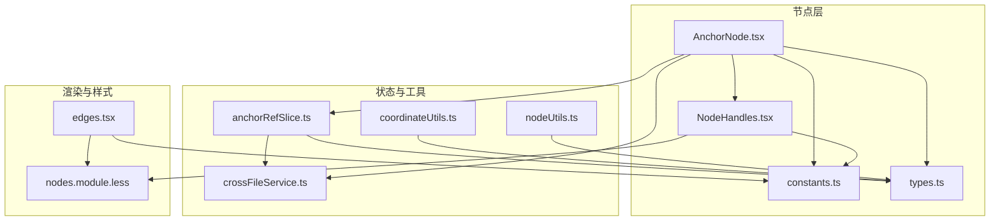
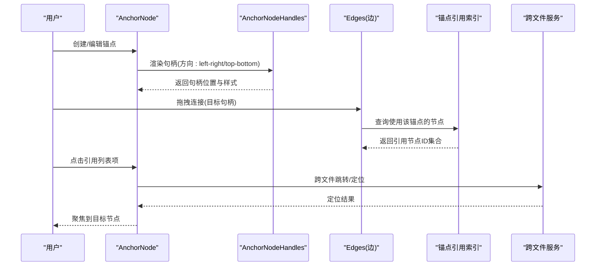
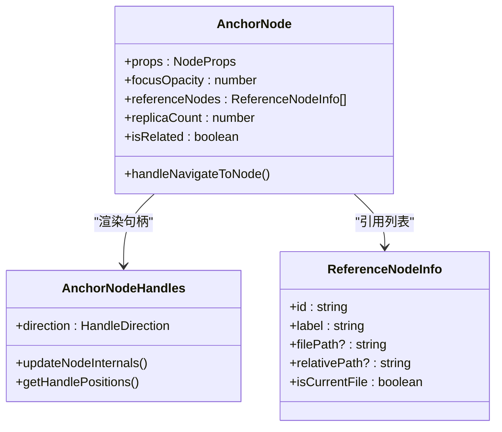
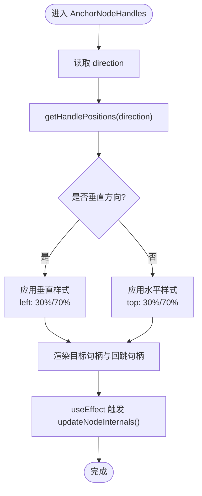
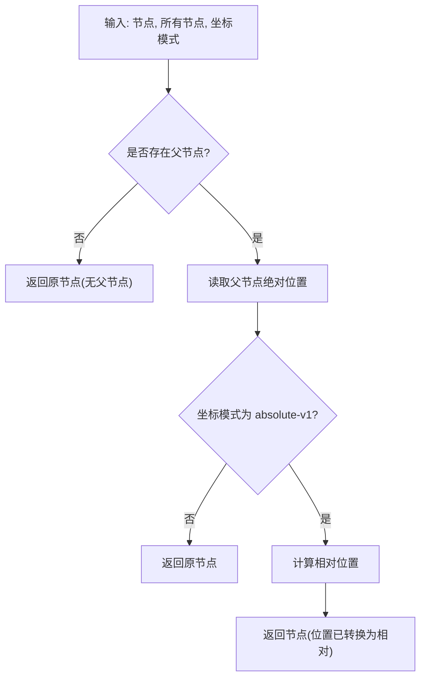
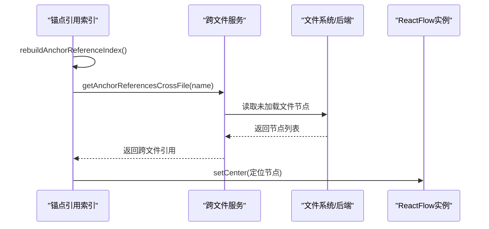
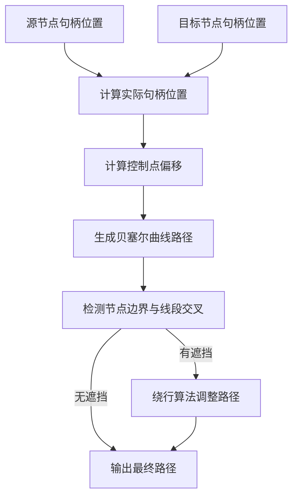
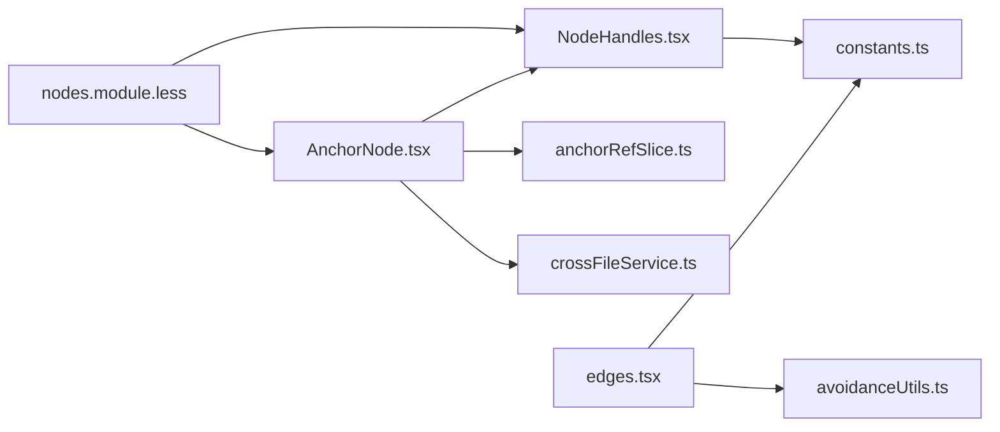

# Anchor锚点节点

<cite>
**本文档引用的文件**
- [AnchorNode.tsx](file://src/components/flow/nodes/AnchorNode.tsx)
- [NodeHandles.tsx](file://src/components/flow/nodes/components/NodeHandles.tsx)
- [constants.ts](file://src/components/flow/nodes/constants.ts)
- [types.ts](file://src/stores/flow/types.ts)
- [nodeUtils.ts](file://src/stores/flow/utils/nodeUtils.ts)
- [coordinateUtils.ts](file://src/stores/flow/utils/coordinateUtils.ts)
- [edges.tsx](file://src/components/flow/edges.tsx)
- [nodes.module.less](file://src/styles/flow/nodes.module.less)
- [anchorRefSlice.ts](file://src/stores/flow/slices/anchorRefSlice.ts)
- [crossFileService.ts](file://src/services/crossFileService.ts)
</cite>

## 目录
1. [简介](#简介)
2. [项目结构](#项目结构)
3. [核心组件](#核心组件)
4. [架构总览](#架构总览)
5. [详细组件分析](#详细组件分析)
6. [依赖关系分析](#依赖关系分析)
7. [性能考量](#性能考量)
8. [故障排查指南](#故障排查指南)
9. [结论](#结论)

## 简介
Anchor锚点节点是工作流编辑器中的关键连接枢纽，用于实现跨节点、跨文件的引用与跳转。它通过目标句柄（Target）和回跳句柄（JumpBack）提供灵活的连接能力，并支持动态方向调整、跨文件引用展示与导航。本文档深入解析Anchor节点的定位、坐标计算、位置锁定与动态调整机制，以及输入输出连接点、连接规则与约束条件，并提供布局优化与连接路径规划的实用技巧。

## 项目结构
Anchor锚点节点由前端组件、样式系统、状态管理与跨文件服务共同构成，主要涉及以下模块：
- 节点渲染与交互：AnchorNode.tsx、NodeHandles.tsx
- 节点类型与句柄方向：constants.ts、types.ts
- 坐标与布局：coordinateUtils.ts、nodeUtils.ts
- 边缘绘制与避障：edges.tsx
- 样式与主题：nodes.module.less
- 锚点引用索引与跨文件导航：anchorRefSlice.ts、crossFileService.ts



**图表来源**
- [AnchorNode.tsx:120-371](file://src/components/flow/nodes/AnchorNode.tsx#L120-L371)
- [NodeHandles.tsx:15-277](file://src/components/flow/nodes/components/NodeHandles.tsx#L15-L277)
- [constants.ts:1-47](file://src/components/flow/nodes/constants.ts#L1-L47)
- [types.ts:132-136](file://src/stores/flow/types.ts#L132-L136)
- [anchorRefSlice.ts:57-100](file://src/stores/flow/slices/anchorRefSlice.ts#L57-L100)
- [coordinateUtils.ts:171-198](file://src/stores/flow/utils/coordinateUtils.ts#L171-L198)
- [nodeUtils.ts:90-118](file://src/stores/flow/utils/nodeUtils.ts#L90-L118)
- [edges.tsx:336-370](file://src/components/flow/edges.tsx#L336-L370)
- [nodes.module.less:420-466](file://src/styles/flow/nodes.module.less#L420-L466)

**章节来源**
- [AnchorNode.tsx:120-371](file://src/components/flow/nodes/AnchorNode.tsx#L120-L371)
- [NodeHandles.tsx:15-277](file://src/components/flow/nodes/components/NodeHandles.tsx#L15-L277)
- [constants.ts:1-47](file://src/components/flow/nodes/constants.ts#L1-L47)
- [types.ts:132-136](file://src/stores/flow/types.ts#L132-L136)

## 核心组件
- AnchorNode组件：负责锚点节点的渲染、引用节点展示、跨文件跳转与焦点状态管理。
- AnchorNodeHandles句柄组件：根据句柄方向动态生成目标句柄与回跳句柄，支持水平/垂直布局与样式差异化。
- 常量与类型：定义句柄方向枚举、节点类型与锚点数据结构。
- 状态与工具：锚点引用索引、坐标转换、节点创建与位置计算。
- 边缘与样式：平滑曲线边、避障算法与锚点专用样式。

**章节来源**
- [AnchorNode.tsx:120-371](file://src/components/flow/nodes/AnchorNode.tsx#L120-L371)
- [NodeHandles.tsx:223-272](file://src/components/flow/nodes/components/NodeHandles.tsx#L223-L272)
- [constants.ts:7-35](file://src/components/flow/nodes/constants.ts#L7-L35)
- [types.ts:132-136](file://src/stores/flow/types.ts#L132-L136)

## 架构总览
Anchor锚点节点在工作流中的定位与连接关系如下：



**图表来源**
- [AnchorNode.tsx:163-240](file://src/components/flow/nodes/AnchorNode.tsx#L163-L240)
- [NodeHandles.tsx:223-272](file://src/components/flow/nodes/components/NodeHandles.tsx#L223-L272)
- [edges.tsx:336-370](file://src/components/flow/edges.tsx#L336-L370)
- [anchorRefSlice.ts:94-100](file://src/stores/flow/slices/anchorRefSlice.ts#L94-L100)
- [crossFileService.ts:373-413](file://src/services/crossFileService.ts#L373-L413)

## 详细组件分析

### AnchorNode组件分析
- 渲染与交互
  - 标题区包含锚点标签、视觉副本计数与引用节点导航按钮。
  - 引用节点列表支持当前文件与跨文件展示，点击可跳转至对应节点。
- 焦点与关联
  - 根据焦点不透明度、路径模式与选中状态决定节点视觉关联程度。
  - 与分组父子关系、边连接关系联动，确保相关节点高亮。
- 跨文件跳转
  - 当目标节点位于其他文件时，调用跨文件服务进行文件切换与节点定位。
- 句柄渲染
  - 通过AnchorNodeHandles传入handleDirection，动态生成目标句柄与回跳句柄。



**图表来源**
- [AnchorNode.tsx:120-371](file://src/components/flow/nodes/AnchorNode.tsx#L120-L371)
- [NodeHandles.tsx:223-272](file://src/components/flow/nodes/components/NodeHandles.tsx#L223-L272)

**章节来源**
- [AnchorNode.tsx:120-371](file://src/components/flow/nodes/AnchorNode.tsx#L120-L371)

### AnchorNodeHandles句柄组件分析
- 句柄方向与位置
  - 通过getHandlePositions根据方向返回目标/源句柄位置与是否垂直布局。
  - 支持"left-right"、"right-left"、"top-bottom"、"bottom-top"四种方向。
- 动态更新
  - 使用useEffect在方向变更时触发updateNodeInternals，确保句柄位置即时生效。
- 样式差异化
  - 水平/垂直方向采用不同样式类；锚点句柄使用专用背景色。
- 回跳句柄
  - 同时提供JumpBack句柄，支持反向连接与回跳逻辑。



**图表来源**
- [NodeHandles.tsx:15-53](file://src/components/flow/nodes/components/NodeHandles.tsx#L15-L53)
- [NodeHandles.tsx:223-272](file://src/components/flow/nodes/components/NodeHandles.tsx#L223-L272)

**章节来源**
- [NodeHandles.tsx:15-53](file://src/components/flow/nodes/components/NodeHandles.tsx#L15-L53)
- [NodeHandles.tsx:223-272](file://src/components/flow/nodes/components/NodeHandles.tsx#L223-L272)

### 坐标计算与位置锁定
- 绝对/相对坐标转换
  - serializeNodePosition基于父节点位置与坐标模式，将节点位置转换为绝对坐标。
  - getNodeAbsolutePosition用于获取节点绝对位置，支持分组场景。
- 新节点位置计算
  - calcuNodePosition根据选中节点与视口信息，计算新节点的初始位置。
- 位置锁定
  - 分组场景下，子节点位置以相对父节点位置存储，切换为绝对位置时保持一致性。



**图表来源**
- [coordinateUtils.ts:171-198](file://src/stores/flow/utils/coordinateUtils.ts#L171-L198)

**章节来源**
- [coordinateUtils.ts:171-198](file://src/stores/flow/utils/coordinateUtils.ts#L171-L198)
- [nodeUtils.ts:195-226](file://src/stores/flow/utils/nodeUtils.ts#L195-L226)

### 输入输出连接点与连接规则
- 句柄类型
  - 目标句柄(Target)：用于接收上游节点的连接。
  - 回跳句柄(JumpBack)：用于特殊回跳连接。
- 连接方向
  - 通过HandleDirection控制句柄位置：左入右出、右入左出、上入下出、下入上出。
- 边属性
  - EdgeAttributesType支持jump_back与anchor标记，用于区分连接类型与行为。
- 连接稳定性
  - 通过useEffect在方向变化时强制刷新句柄，避免连接断开。
  - 边缘绘制采用平滑曲线与避障算法，减少遮挡与交叉。

```mermaid
classDiagram
class EdgeAttributesType {
+jump_back? : boolean
+anchor? : boolean
}
class HandleDirection {
<<enumeration>>
"left-right"
"right-left"
"top-bottom"
"bottom-top"
}
class TargetHandleTypeEnum {
<<enumeration>>
"target"
"jump_back"
}
EdgeAttributesType --> TargetHandleTypeEnum : "标记连接类型"
HandleDirection --> TargetHandleTypeEnum : "决定句柄位置"
```

**图表来源**
- [types.ts:24-40](file://src/stores/flow/types.ts#L24-L40)
- [constants.ts:28-35](file://src/components/flow/nodes/constants.ts#L28-L35)
- [constants.ts:8-11](file://src/components/flow/nodes/constants.ts#L8-L11)

**章节来源**
- [types.ts:24-40](file://src/stores/flow/types.ts#L24-L40)
- [constants.ts:28-35](file://src/components/flow/nodes/constants.ts#L28-L35)
- [constants.ts:8-11](file://src/components/flow/nodes/constants.ts#L8-L11)

### 锚点引用索引与跨文件导航
- 引用索引构建
  - 遍历所有节点，提取others.anchor字段中的锚点名称，建立名称到节点ID集合的映射。
- 引用查询
  - getNodesUsingAnchor根据锚点名称返回引用节点ID列表。
- 跨文件引用
  - crossFileService扫描已加载与未加载文件，收集引用锚点的节点信息，支持文件路径与相对路径展示。
- 导航与定位
  - navigateToNodeByFileAndLabel支持跨文件跳转，定位节点并聚焦视图。



**图表来源**
- [anchorRefSlice.ts:68-100](file://src/stores/flow/slices/anchorRefSlice.ts#L68-L100)
- [crossFileService.ts:626-709](file://src/services/crossFileService.ts#L626-L709)
- [crossFileService.ts:373-413](file://src/services/crossFileService.ts#L373-L413)

**章节来源**
- [anchorRefSlice.ts:68-100](file://src/stores/flow/slices/anchorRefSlice.ts#L68-L100)
- [crossFileService.ts:626-709](file://src/services/crossFileService.ts#L626-L709)
- [crossFileService.ts:373-413](file://src/services/crossFileService.ts#L373-L413)

### 边缘绘制与路径规划
- 边类型与方向
  - edges.tsx根据源/目标节点的handleDirection计算实际句柄位置，确保路径与句柄一致。
- 贝塞尔曲线与控制点
  - getCustomBezierPath与getStandardBezierPath计算平滑曲线路径，支持拖拽控制点调整曲率。
- 避障算法
  - calculateAvoidancePath与buildNodeBoundsList检测线段与节点边界交叉，自动绕行以提升可读性。



**图表来源**
- [edges.tsx:355-370](file://src/components/flow/edges.tsx#L355-L370)
- [edges.tsx:38-140](file://src/components/flow/edges.tsx#L38-L140)
- [edges.tsx:142-200](file://src/components/flow/edges.tsx#L142-L200)

**章节来源**
- [edges.tsx:355-370](file://src/components/flow/edges.tsx#L355-L370)
- [edges.tsx:38-140](file://src/components/flow/edges.tsx#L38-L140)
- [edges.tsx:142-200](file://src/components/flow/edges.tsx#L142-L200)

## 依赖关系分析
- 组件耦合
  - AnchorNode依赖AnchorNodeHandles进行句柄渲染，依赖crossFileService进行跨文件导航。
  - edges.tsx依赖constants.ts中的句柄方向与类型，结合avoidanceUtils进行路径规划。
- 状态管理
  - anchorRefSlice维护锚点引用索引，支撑跨文件引用查询与高亮。
- 外部依赖
  - @xyflow/react提供Handle、BaseEdge等基础组件与坐标系统。



**图表来源**
- [AnchorNode.tsx:120-371](file://src/components/flow/nodes/AnchorNode.tsx#L120-L371)
- [NodeHandles.tsx:223-272](file://src/components/flow/nodes/components/NodeHandles.tsx#L223-L272)
- [edges.tsx:336-370](file://src/components/flow/edges.tsx#L336-L370)
- [anchorRefSlice.ts:68-100](file://src/stores/flow/slices/anchorRefSlice.ts#L68-L100)
- [crossFileService.ts:626-709](file://src/services/crossFileService.ts#L626-L709)

**章节来源**
- [AnchorNode.tsx:120-371](file://src/components/flow/nodes/AnchorNode.tsx#L120-L371)
- [NodeHandles.tsx:223-272](file://src/components/flow/nodes/components/NodeHandles.tsx#L223-L272)
- [edges.tsx:336-370](file://src/components/flow/edges.tsx#L336-L370)

## 性能考量
- 句柄动态更新
  - 方向变更时通过多次updateNodeInternals确保句柄位置稳定，避免连接断裂。
- 引用索引重建
  - 节点列表变化或锚点字段更新时重建索引，保证查询效率。
- 路径绘制优化
  - 避障算法仅在必要时计算绕行路径，减少复杂度。
- 聚焦动画
  - 跳转定位使用带持续时间的动画，兼顾流畅性与性能。

[本节为通用指导，无需特定文件引用]

## 故障排查指南
- 连接断开
  - 确认方向变更后是否触发updateNodeInternals；检查句柄位置是否与实际节点边界一致。
- 引用列表为空
  - 检查others.anchor字段是否正确；确认anchorRefSlice.rebuildAnchorReferenceIndex是否被调用。
- 跨文件跳转失败
  - 确认crossFileService连接状态与文件加载情况；验证navigateToNodeByFileAndLabel的参数。
- 路径遮挡严重
  - 调整句柄方向或手动拖拽控制点；启用避障算法以自动绕行。

**章节来源**
- [NodeHandles.tsx:233-244](file://src/components/flow/nodes/components/NodeHandles.tsx#L233-L244)
- [anchorRefSlice.ts:68-73](file://src/stores/flow/slices/anchorRefSlice.ts#L68-L73)
- [crossFileService.ts:373-413](file://src/services/crossFileService.ts#L373-L413)
- [edges.tsx:38-140](file://src/components/flow/edges.tsx#L38-L140)

## 结论
Anchor锚点节点通过目标句柄与回跳句柄实现了灵活的工作流连接，配合动态方向调整、坐标转换与跨文件导航，提供了强大的引用与跳转能力。借助锚点引用索引与避障路径规划，系统在复杂布局中仍能保持连接稳定性与可视化清晰度。遵循本文档提供的坐标计算、连接规则与布局优化建议，可进一步提升工作流编辑体验与开发效率。