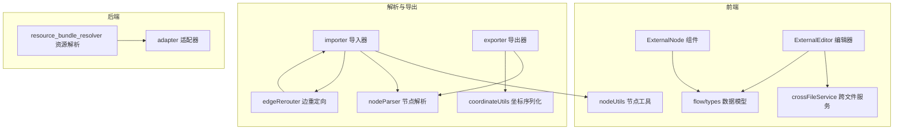
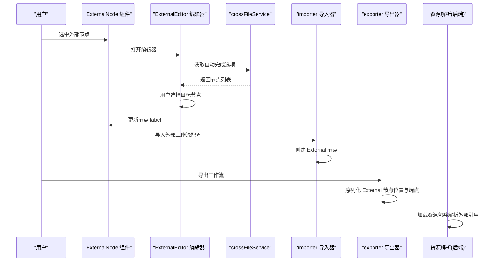
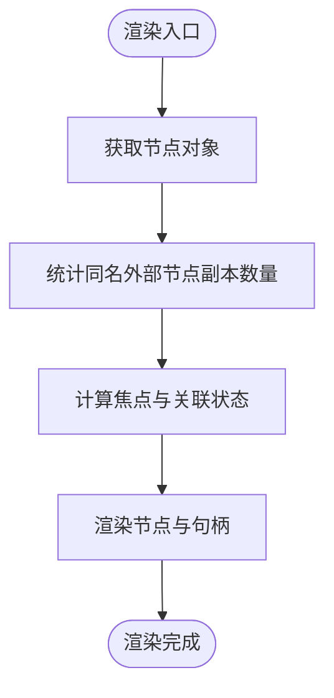
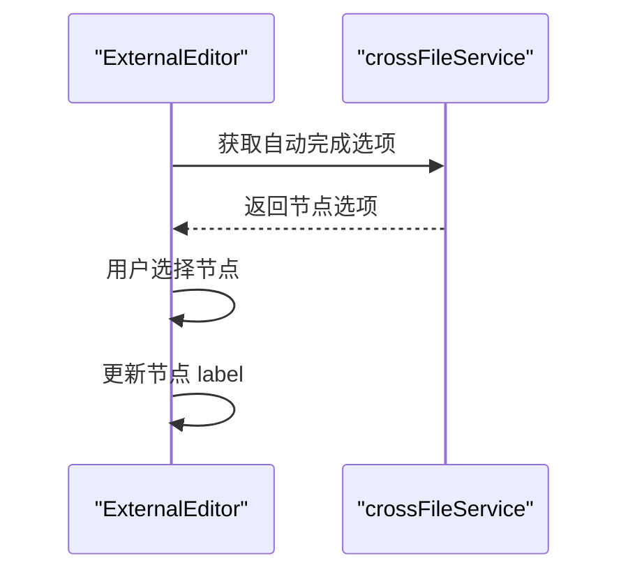
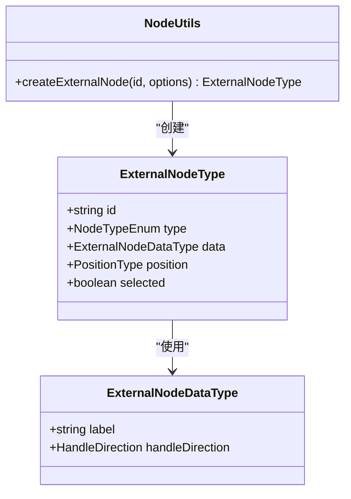
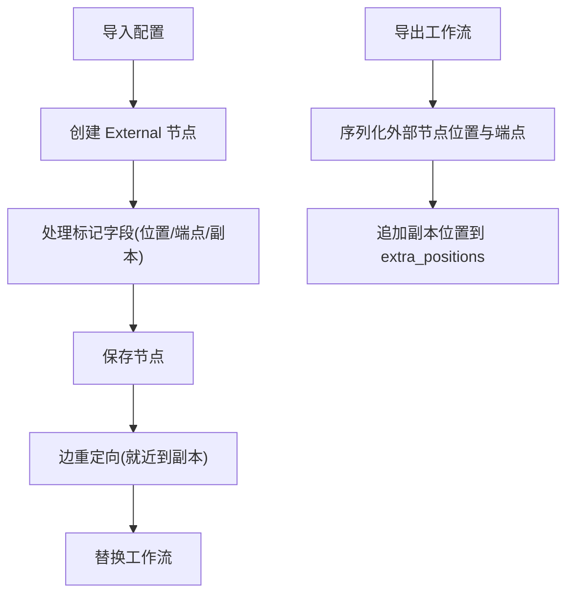
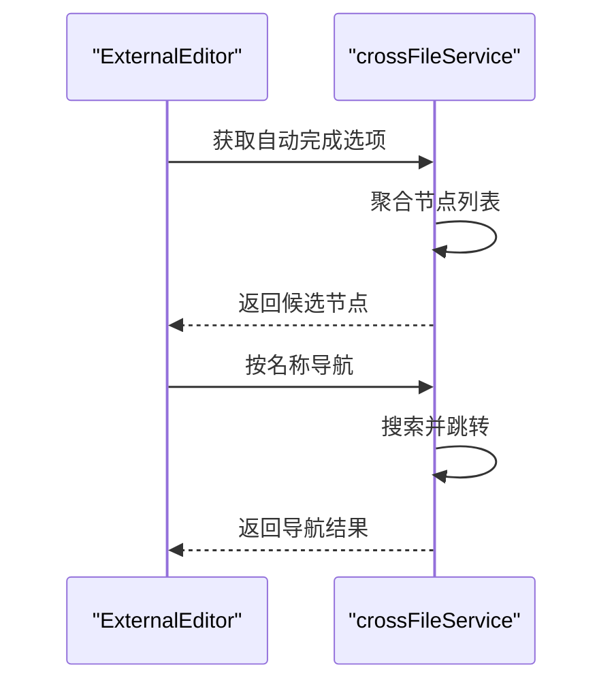
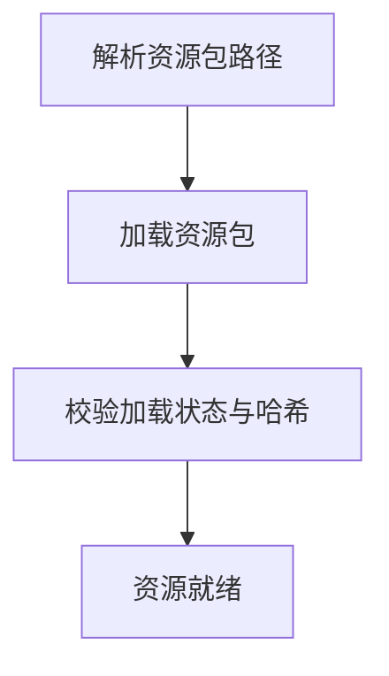
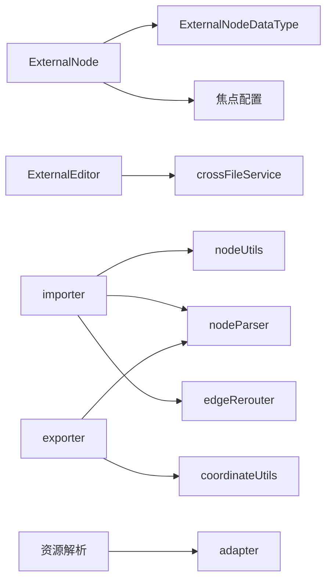

# External外部节点

<cite>
**本文档引用的文件**
- [ExternalNode.tsx](file://src/components/flow/nodes/ExternalNode.tsx)
- [ExternalEditor.tsx](file://src/components/panels/node-editors/ExternalEditor.tsx)
- [index.ts](file://src/components/flow/nodes/index.ts)
- [constants.ts](file://src/components/flow/nodes/constants.ts)
- [types.ts](file://src/stores/flow/types.ts)
- [nodeUtils.ts](file://src/stores/flow/utils/nodeUtils.ts)
- [importer.ts](file://src/core/parser/importer.ts)
- [exporter.ts](file://src/core/parser/exporter.ts)
- [nodeParser.ts](file://src/core/parser/nodeParser.ts)
- [edgeRerouter.ts](file://src/core/parser/edgeRerouter.ts)
- [crossFileService.ts](file://src/services/crossFileService.ts)
- [coordinateUtils.ts](file://src/stores/flow/utils/coordinateUtils.ts)
- [resource_bundle_resolver.go](file://LocalBridge/internal/mfw/resource_bundle_resolver.go)
- [adapter.go](file://LocalBridge/internal/mfw/adapter.go)
</cite>

## 目录
1. [简介](#简介)
2. [项目结构](#项目结构)
3. [核心组件](#核心组件)
4. [架构总览](#架构总览)
5. [详细组件分析](#详细组件分析)
6. [依赖关系分析](#依赖关系分析)
7. [性能考量](#性能考量)
8. [故障排查指南](#故障排查指南)
9. [结论](#结论)
10. [附录](#附录)

## 简介
External外部节点用于在工作流中引用“外部工作流或资源”的占位节点。其设计目的是：
- 在主工作流中以轻量方式声明对外部资源的依赖；
- 通过标签（label）与跨文件节点服务协作，实现节点名解析与跳转；
- 支持视觉副本（replica）机制，便于在不同位置展示同一外部引用；
- 与导入/导出管线配合，保留外部节点的位置与端点方向等元信息。

External节点本身不承载识别/动作逻辑，而是作为“引用锚点”，在运行时由底层资源系统解析到具体的目标工作流节点。

## 项目结构
External节点涉及前端可视化、编辑器、数据模型与导入导出管线，以及后端资源解析能力：

图表来源
- [ExternalNode.tsx:1-203](file://src/components/flow/nodes/ExternalNode.tsx#L1-L203)
- [ExternalEditor.tsx:1-106](file://src/components/panels/node-editors/ExternalEditor.tsx#L1-L106)
- [crossFileService.ts:1-740](file://src/services/crossFileService.ts#L1-L740)
- [types.ts:127-130](file://src/stores/flow/types.ts#L127-L130)
- [nodeUtils.ts:60-88](file://src/stores/flow/utils/nodeUtils.ts#L60-L88)
- [importer.ts:366-443](file://src/core/parser/importer.ts#L366-L443)
- [exporter.ts:108-131](file://src/core/parser/exporter.ts#L108-L131)
- [nodeParser.ts:191-210](file://src/core/parser/nodeParser.ts#L191-L210)
- [edgeRerouter.ts:37-88](file://src/core/parser/edgeRerouter.ts#L37-L88)
- [coordinateUtils.ts:193-198](file://src/stores/flow/utils/coordinateUtils.ts#L193-L198)
- [resource_bundle_resolver.go:236-256](file://LocalBridge/internal/mfw/resource_bundle_resolver.go#L236-L256)
- [adapter.go:316-335](file://LocalBridge/internal/mfw/adapter.go#L316-L335)

章节来源
- [ExternalNode.tsx:1-203](file://src/components/flow/nodes/ExternalNode.tsx#L1-L203)
- [ExternalEditor.tsx:1-106](file://src/components/panels/node-editors/ExternalEditor.tsx#L1-L106)
- [crossFileService.ts:58-206](file://src/services/crossFileService.ts#L58-L206)
- [types.ts:127-130](file://src/stores/flow/types.ts#L127-L130)
- [nodeUtils.ts:60-88](file://src/stores/flow/utils/nodeUtils.ts#L60-L88)
- [importer.ts:366-443](file://src/core/parser/importer.ts#L366-L443)
- [exporter.ts:108-131](file://src/core/parser/exporter.ts#L108-L131)
- [nodeParser.ts:191-210](file://src/core/parser/nodeParser.ts#L191-L210)
- [edgeRerouter.ts:37-88](file://src/core/parser/edgeRerouter.ts#L37-L88)
- [coordinateUtils.ts:193-198](file://src/stores/flow/utils/coordinateUtils.ts#L193-L198)
- [resource_bundle_resolver.go:236-256](file://LocalBridge/internal/mfw/resource_bundle_resolver.go#L236-L256)
- [adapter.go:316-335](file://LocalBridge/internal/mfw/adapter.go#L316-L335)

## 核心组件
- 外部节点组件：负责渲染外部节点、处理焦点与选中态、计算视觉副本数量，并挂载右键菜单。
- 外部节点编辑器：提供基于跨文件服务的自动完成功能，支持按名称搜索并选择外部引用的目标节点。
- 数据模型：ExternalNodeDataType定义外部节点的核心字段（label、handleDirection）。
- 节点工具：createExternalNode用于创建外部节点实例。
- 导入/导出：导入器在解析配置时创建外部节点；导出器在序列化时保留位置与端点方向，并支持副本位置追加。
- 边重定向：当存在多个同名外部节点副本时，将指向外部节点的边就近重定向到最近副本。
- 跨文件服务：提供节点搜索、跳转、自动完成等能力，支持区分当前文件与外部文件。
- 资源解析：后端通过资源包解析策略加载资源，为外部引用提供运行时解析基础。

章节来源
- [ExternalNode.tsx:45-181](file://src/components/flow/nodes/ExternalNode.tsx#L45-L181)
- [ExternalEditor.tsx:8-105](file://src/components/panels/node-editors/ExternalEditor.tsx#L8-L105)
- [types.ts:127-130](file://src/stores/flow/types.ts#L127-L130)
- [nodeUtils.ts:60-88](file://src/stores/flow/utils/nodeUtils.ts#L60-L88)
- [importer.ts:366-443](file://src/core/parser/importer.ts#L366-L443)
- [exporter.ts:108-131](file://src/core/parser/exporter.ts#L108-L131)
- [nodeParser.ts:191-210](file://src/core/parser/nodeParser.ts#L191-L210)
- [edgeRerouter.ts:37-88](file://src/core/parser/edgeRerouter.ts#L37-L88)
- [crossFileService.ts:58-206](file://src/services/crossFileService.ts#L58-L206)
- [resource_bundle_resolver.go:236-256](file://LocalBridge/internal/mfw/resource_bundle_resolver.go#L236-L256)

## 架构总览
External节点在工作流中的角色与交互如下：

图表来源
- [ExternalNode.tsx:45-181](file://src/components/flow/nodes/ExternalNode.tsx#L45-L181)
- [ExternalEditor.tsx:8-105](file://src/components/panels/node-editors/ExternalEditor.tsx#L8-L105)
- [crossFileService.ts:58-206](file://src/services/crossFileService.ts#L58-L206)
- [importer.ts:366-443](file://src/core/parser/importer.ts#L366-L443)
- [exporter.ts:108-131](file://src/core/parser/exporter.ts#L108-L131)
- [resource_bundle_resolver.go:236-256](file://LocalBridge/internal/mfw/resource_bundle_resolver.go#L236-L256)

## 详细组件分析

### 外部节点组件（ExternalNode）
- 渲染标题与副本徽章，显示同名外部节点的数量；
- 根据焦点配置与选中状态动态调整透明度；
- 计算与选中元素的关联关系，支持路径模式高亮；
- 通过句柄组件渲染输入/输出端点，方向可配置。

图表来源
- [ExternalNode.tsx:45-181](file://src/components/flow/nodes/ExternalNode.tsx#L45-L181)

章节来源
- [ExternalNode.tsx:45-181](file://src/components/flow/nodes/ExternalNode.tsx#L45-L181)

### 外部节点编辑器（ExternalEditor）
- 基于跨文件服务提供自动完成功能；
- 支持按名称与描述筛选节点；
- 更新节点的label字段，作为外部引用的目标标识。

图表来源
- [ExternalEditor.tsx:8-105](file://src/components/panels/node-editors/ExternalEditor.tsx#L8-L105)
- [crossFileService.ts:58-206](file://src/services/crossFileService.ts#L58-L206)

章节来源
- [ExternalEditor.tsx:8-105](file://src/components/panels/node-editors/ExternalEditor.tsx#L8-L105)
- [crossFileService.ts:58-206](file://src/services/crossFileService.ts#L58-L206)

### 数据模型与节点工具
- ExternalNodeDataType：包含label与handleDirection两个关键字段；
- createExternalNode：创建外部节点实例，支持自动生成label与初始位置。

图表来源
- [types.ts:127-130](file://src/stores/flow/types.ts#L127-L130)
- [types.ts:172-183](file://src/stores/flow/types.ts#L172-L183)
- [nodeUtils.ts:60-88](file://src/stores/flow/utils/nodeUtils.ts#L60-L88)

章节来源
- [types.ts:127-130](file://src/stores/flow/types.ts#L127-L130)
- [types.ts:172-183](file://src/stores/flow/types.ts#L172-L183)
- [nodeUtils.ts:60-88](file://src/stores/flow/utils/nodeUtils.ts#L60-L88)

### 导入与导出流程
- 导入：解析配置时根据节点类型创建External节点，并处理标记字段（如位置、端点方向、额外副本位置）；
- 导出：序列化外部节点位置与端点方向；同名外部节点的额外副本位置追加到entry的extra_positions数组中；
- 边重定向：当存在多个同名外部节点副本时，将指向外部节点的边就近重定向到最近副本。

图表来源
- [importer.ts:366-443](file://src/core/parser/importer.ts#L366-L443)
- [exporter.ts:108-131](file://src/core/parser/exporter.ts#L108-L131)
- [nodeParser.ts:191-210](file://src/core/parser/nodeParser.ts#L191-L210)
- [edgeRerouter.ts:37-88](file://src/core/parser/edgeRerouter.ts#L37-L88)
- [coordinateUtils.ts:193-198](file://src/stores/flow/utils/coordinateUtils.ts#L193-L198)

章节来源
- [importer.ts:366-443](file://src/core/parser/importer.ts#L366-L443)
- [exporter.ts:108-131](file://src/core/parser/exporter.ts#L108-L131)
- [nodeParser.ts:191-210](file://src/core/parser/nodeParser.ts#L191-L210)
- [edgeRerouter.ts:37-88](file://src/core/parser/edgeRerouter.ts#L37-L88)
- [coordinateUtils.ts:193-198](file://src/stores/flow/utils/coordinateUtils.ts#L193-L198)

### 跨文件服务与节点解析
- getAllNodes：聚合本地文件与前端tab中的节点，支持当前文件优先与过滤；
- searchNodes：模糊匹配节点名，支持跨文件搜索；
- navigateToNodeByName：根据节点名跳转到目标节点；
- getAutoCompleteOptions：提供可用于外部/锚点引用的节点自动完成选项（排除当前文件的外部/锚点节点）。

图表来源
- [crossFileService.ts:58-206](file://src/services/crossFileService.ts#L58-L206)
- [crossFileService.ts:588-619](file://src/services/crossFileService.ts#L588-L619)

章节来源
- [crossFileService.ts:58-206](file://src/services/crossFileService.ts#L58-L206)
- [crossFileService.ts:588-619](file://src/services/crossFileService.ts#L588-L619)

### 资源解析与运行时集成
- 资源包解析：根据路径策略解析资源包根目录，支持多种祖先/后代路径分类；
- 资源加载：逐个加载资源包，校验加载状态与哈希；
- 适配器：统一管理资源加载生命周期与并发控制。

图表来源
- [resource_bundle_resolver.go:332-367](file://LocalBridge/internal/mfw/resource_bundle_resolver.go#L332-L367)
- [resource_bundle_resolver.go:236-256](file://LocalBridge/internal/mfw/resource_bundle_resolver.go#L236-L256)
- [adapter.go:316-335](file://LocalBridge/internal/mfw/adapter.go#L316-L335)

章节来源
- [resource_bundle_resolver.go:332-367](file://LocalBridge/internal/mfw/resource_bundle_resolver.go#L332-L367)
- [resource_bundle_resolver.go:236-256](file://LocalBridge/internal/mfw/resource_bundle_resolver.go#L236-L256)
- [adapter.go:316-335](file://LocalBridge/internal/mfw/adapter.go#L316-L335)

## 依赖关系分析
- 组件耦合：ExternalNode依赖节点数据模型与焦点配置；ExternalEditor依赖跨文件服务；
- 导入导出：importer与exporter共同维护External节点的元信息一致性；
- 边重定向：edgeRerouter依赖节点位置计算，确保副本就近匹配；
- 资源解析：后端资源解析为External节点的运行时解析提供基础。

图表来源
- [ExternalNode.tsx:45-181](file://src/components/flow/nodes/ExternalNode.tsx#L45-L181)
- [ExternalEditor.tsx:8-105](file://src/components/panels/node-editors/ExternalEditor.tsx#L8-L105)
- [crossFileService.ts:58-206](file://src/services/crossFileService.ts#L58-L206)
- [nodeUtils.ts:60-88](file://src/stores/flow/utils/nodeUtils.ts#L60-L88)
- [importer.ts:366-443](file://src/core/parser/importer.ts#L366-L443)
- [exporter.ts:108-131](file://src/core/parser/exporter.ts#L108-L131)
- [nodeParser.ts:191-210](file://src/core/parser/nodeParser.ts#L191-L210)
- [edgeRerouter.ts:37-88](file://src/core/parser/edgeRerouter.ts#L37-L88)
- [coordinateUtils.ts:193-198](file://src/stores/flow/utils/coordinateUtils.ts#L193-L198)
- [resource_bundle_resolver.go:236-256](file://LocalBridge/internal/mfw/resource_bundle_resolver.go#L236-L256)
- [adapter.go:316-335](file://LocalBridge/internal/mfw/adapter.go#L316-L335)

章节来源
- [ExternalNode.tsx:45-181](file://src/components/flow/nodes/ExternalNode.tsx#L45-L181)
- [ExternalEditor.tsx:8-105](file://src/components/panels/node-editors/ExternalEditor.tsx#L8-L105)
- [crossFileService.ts:58-206](file://src/services/crossFileService.ts#L58-L206)
- [nodeUtils.ts:60-88](file://src/stores/flow/utils/nodeUtils.ts#L60-L88)
- [importer.ts:366-443](file://src/core/parser/importer.ts#L366-L443)
- [exporter.ts:108-131](file://src/core/parser/exporter.ts#L108-L131)
- [nodeParser.ts:191-210](file://src/core/parser/nodeParser.ts#L191-L210)
- [edgeRerouter.ts:37-88](file://src/core/parser/edgeRerouter.ts#L37-L88)
- [coordinateUtils.ts:193-198](file://src/stores/flow/utils/coordinateUtils.ts#L193-L198)
- [resource_bundle_resolver.go:236-256](file://LocalBridge/internal/mfw/resource_bundle_resolver.go#L236-L256)
- [adapter.go:316-335](file://LocalBridge/internal/mfw/adapter.go#L316-L335)

## 性能考量
- 视觉副本数量：同名External节点越多，边重定向计算成本越高；建议合理控制副本数量。
- 自动完成选项：限制返回数量与过滤范围，避免大规模节点列表带来的渲染压力。
- 资源加载：批量加载资源包时应考虑并发与锁机制，避免重复加载与竞争条件。
- 坐标序列化：导出时对位置进行四舍五入，减少冗余精度带来的文件体积。

## 故障排查指南
- 外部节点无法跳转：检查跨文件服务是否连接、节点是否已加载、文件路径是否正确。
- 副本边未就近重定向：确认副本是否存在、节点位置是否正确、重定向逻辑是否生效。
- 导出后位置异常：检查坐标序列化逻辑与extra_positions追加逻辑。
- 资源加载失败：查看资源包解析策略与加载日志，确认路径与权限。

章节来源
- [crossFileService.ts:330-413](file://src/services/crossFileService.ts#L330-L413)
- [edgeRerouter.ts:37-88](file://src/core/parser/edgeRerouter.ts#L37-L88)
- [exporter.ts:108-131](file://src/core/parser/exporter.ts#L108-L131)
- [coordinateUtils.ts:193-198](file://src/stores/flow/utils/coordinateUtils.ts#L193-L198)
- [resource_bundle_resolver.go:236-256](file://LocalBridge/internal/mfw/resource_bundle_resolver.go#L236-L256)

## 结论
External外部节点通过简洁的数据模型与完善的导入/导出机制，在主工作流中实现了对外部资源的轻量引用。结合跨文件服务与资源解析能力，它既保证了编辑体验，也为运行时解析提供了稳定基础。建议在团队协作中规范外部节点命名与版本管理，以提升可维护性与可追溯性。

## 附录
- 配置选项
  - label：外部节点的标识名，用于跨文件解析与跳转。
  - handleDirection：节点端点方向（左右/右左/上下/下上），影响连线布局。
- 参数传递与数据交换
  - 外部节点本身不携带识别/动作参数，参数传递通过目标工作流节点完成。
- 与主工作流集成
  - 通过导入器创建External节点，通过导出器序列化位置与端点信息。
- 依赖管理
  - 依赖跨文件服务提供的节点列表与导航能力。
- 外部资源管理与版本控制实践
  - 使用统一的前缀与命名规范，便于跨文件引用与自动完成；
  - 在导出时保留副本位置信息，确保多处引用的一致性；
  - 后端资源解析采用路径策略与哈希校验，保障资源加载的稳定性与可验证性。