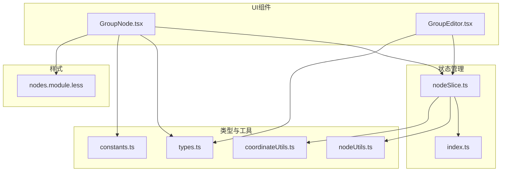
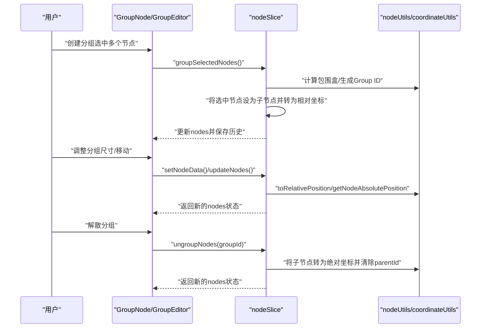
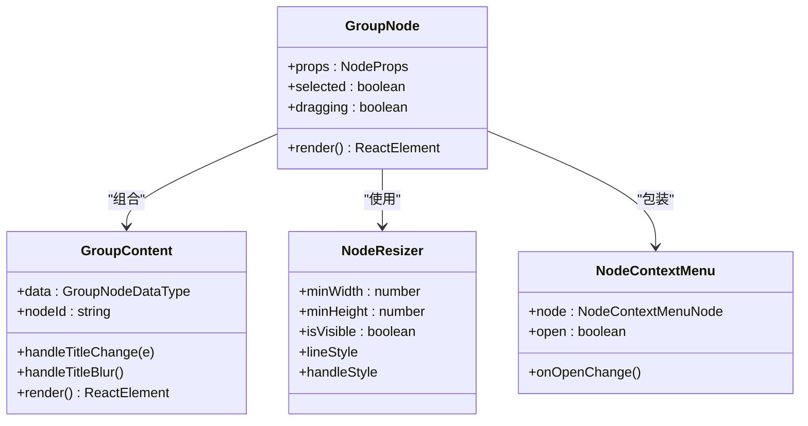
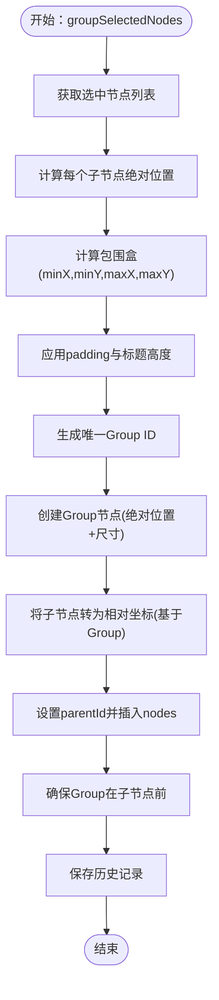
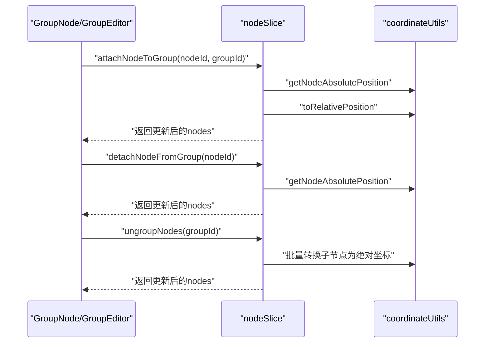
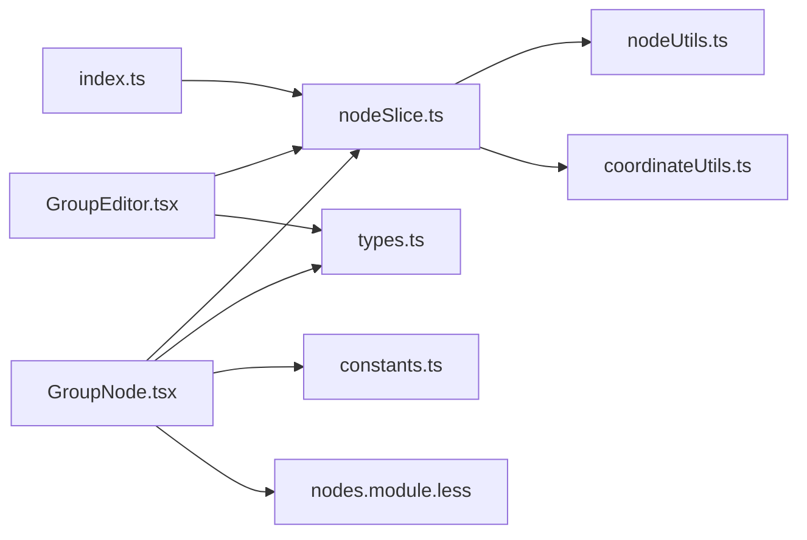

# Group分组节点

<cite>
**本文档引用的文件**
- [GroupNode.tsx](file://src/components/flow/nodes/GroupNode.tsx)
- [GroupEditor.tsx](file://src/components/panels/node-editors/GroupEditor.tsx)
- [nodeSlice.ts](file://src/stores/flow/slices/nodeSlice.ts)
- [types.ts](file://src/stores/flow/types.ts)
- [constants.ts](file://src/components/flow/nodes/constants.ts)
- [index.ts](file://src/stores/flow/index.ts)
- [nodeUtils.ts](file://src/stores/flow/utils/nodeUtils.ts)
- [coordinateUtils.ts](file://src/stores/flow/utils/coordinateUtils.ts)
- [nodes.module.less](file://src/styles/flow/nodes.module.less)
- [nodeContextMenu.tsx](file://src/components/flow/nodes/nodeContextMenu.tsx)
</cite>

## 目录
1. [简介](#简介)
2. [项目结构](#项目结构)
3. [核心组件](#核心组件)
4. [架构总览](#架构总览)
5. [详细组件分析](#详细组件分析)
6. [依赖关系分析](#依赖关系分析)
7. [性能考量](#性能考量)
8. [故障排除指南](#故障排除指南)
9. [结论](#结论)
10. [附录](#附录)

## 简介
本文件系统性地阐述Group分组节点的设计理念、实现细节与使用方法。Group节点用于在可视化流程画布中组织和管理多个子节点，提供统一的边界框、可调整尺寸、整体移动以及子节点的层级管理能力。本文将围绕以下主题展开：
- 分组的创建、添加、移除与解散
- 分组边界计算、缩放控制与整体移动机制
- 分组内节点状态同步与事件传播
- 分组嵌套、层次管理与复杂场景的最佳实践

## 项目结构
Group分组节点由前端UI组件与状态管理两部分协同实现：
- UI层：GroupNode.tsx负责渲染分组节点的外观、标题编辑与尺寸调整
- 状态层：nodeSlice.ts提供分组的创建、解散、子节点挂载/卸载等核心逻辑
- 类型与常量：types.ts定义数据结构；constants.ts定义节点类型枚举
- 编辑器：GroupEditor.tsx提供面板式编辑入口
- 工具函数：nodeUtils.ts与coordinateUtils.ts提供节点查找、相对/绝对坐标转换等支撑能力

**图表来源**
- [GroupNode.tsx:1-178](file://src/components/flow/nodes/GroupNode.tsx#L1-L178)
- [GroupEditor.tsx:1-102](file://src/components/panels/node-editors/GroupEditor.tsx#L1-L102)
- [nodeSlice.ts:570-718](file://src/stores/flow/slices/nodeSlice.ts#L570-L718)
- [types.ts:150-227](file://src/stores/flow/types.ts#L150-L227)
- [constants.ts:14-20](file://src/components/flow/nodes/constants.ts#L14-L20)
- [nodeUtils.ts:1-200](file://src/stores/flow/utils/nodeUtils.ts#L1-L200)
- [coordinateUtils.ts:1-200](file://src/stores/flow/utils/coordinateUtils.ts#L1-L200)
- [nodes.module.less:859-906](file://src/styles/flow/nodes.module.less#L859-L906)

**章节来源**
- [GroupNode.tsx:1-178](file://src/components/flow/nodes/GroupNode.tsx#L1-L178)
- [GroupEditor.tsx:1-102](file://src/components/panels/node-editors/GroupEditor.tsx#L1-L102)
- [nodeSlice.ts:570-718](file://src/stores/flow/slices/nodeSlice.ts#L570-L718)
- [types.ts:150-227](file://src/stores/flow/types.ts#L150-L227)
- [constants.ts:14-20](file://src/components/flow/nodes/constants.ts#L14-L20)
- [nodeUtils.ts:1-200](file://src/stores/flow/utils/nodeUtils.ts#L1-L200)
- [coordinateUtils.ts:1-200](file://src/stores/flow/utils/coordinateUtils.ts#L1-L200)
- [nodes.module.less:859-906](file://src/styles/flow/nodes.module.less#L859-L906)

## 核心组件
- GroupNode：渲染分组节点，支持标题编辑、颜色主题、尺寸调整与上下文菜单
- GroupEditor：面板式编辑器，提供名称与颜色的主题化设置
- nodeSlice：状态层，提供分组创建、解散、子节点挂载/卸载、历史记录等
- GroupNodeDataType/GroupNodeType：分组节点的数据与类型定义
- 工具函数：节点查找、相对/绝对坐标转换、节点顺序保证等

**章节来源**
- [GroupNode.tsx:110-178](file://src/components/flow/nodes/GroupNode.tsx#L110-L178)
- [GroupEditor.tsx:20-102](file://src/components/panels/node-editors/GroupEditor.tsx#L20-L102)
- [nodeSlice.ts:570-718](file://src/stores/flow/slices/nodeSlice.ts#L570-L718)
- [types.ts:150-227](file://src/stores/flow/types.ts#L150-L227)

## 架构总览
Group分组节点采用“UI组件 + 状态管理 + 工具函数”的分层架构：
- UI层负责交互与视觉呈现（标题输入、颜色主题、尺寸调整）
- 状态层负责业务逻辑（创建/解散分组、子节点挂载/卸载、历史记录）
- 工具层负责坐标转换与节点管理（相对/绝对坐标、节点顺序）

**图表来源**
- [GroupNode.tsx:110-178](file://src/components/flow/nodes/GroupNode.tsx#L110-L178)
- [GroupEditor.tsx:20-102](file://src/components/panels/node-editors/GroupEditor.tsx#L20-L102)
- [nodeSlice.ts:570-718](file://src/stores/flow/slices/nodeSlice.ts#L570-L718)
- [nodeUtils.ts:1-200](file://src/stores/flow/utils/nodeUtils.ts#L1-L200)
- [coordinateUtils.ts:1-200](file://src/stores/flow/utils/coordinateUtils.ts#L1-L200)

## 详细组件分析

### GroupNode组件
- 设计要点
  - 使用NodeResizer提供可视化的尺寸调整，最小宽高限制为200x150
  - 标题输入支持直接编辑，失焦时保存历史记录
  - 颜色主题通过GROUP_COLOR_THEMES映射，支持蓝/绿/紫/橙/灰五种
  - 选中态通过CSS类group-node-selected添加阴影效果
- 交互行为
  - 标题变更触发setNodeData，随后调用saveHistory记录“编辑分组标题”
  - 上下文菜单集成NodeContextMenu，支持分组相关操作
- 样式与主题
  - groupInner/groupHeader/groupBody构成分组的容器、标题栏与内容区
  - 选中态下groupInner获得外发光阴影

**图表来源**
- [GroupNode.tsx:52-178](file://src/components/flow/nodes/GroupNode.tsx#L52-L178)

**章节来源**
- [GroupNode.tsx:110-178](file://src/components/flow/nodes/GroupNode.tsx#L110-L178)
- [nodes.module.less:859-906](file://src/styles/flow/nodes.module.less#L859-L906)

### GroupEditor编辑器
- 设计要点
  - 提供名称与颜色主题的面板式编辑入口
  - 颜色下拉框支持五种主题，变更后保存历史记录
- 交互行为
  - 输入框变更触发setNodeData，失焦保存历史
  - 颜色变更触发setNodeData并保存历史

**章节来源**
- [GroupEditor.tsx:20-102](file://src/components/panels/node-editors/GroupEditor.tsx#L20-L102)

### 分组创建与边界计算
- 创建流程
  - 选中多个节点后调用groupSelectedNodes
  - 计算选中节点的最小包围盒（考虑padding与标题高度），生成Group ID
  - 将选中节点设为Group子节点，并转换为相对坐标
  - 确保Group节点在子节点之前，避免层级问题
- 边界计算
  - 基于子节点绝对位置计算min/max X/Y，加上padding与标题高度得到Group尺寸
  - 使用getNodeAbsolutePosition与toRelativePosition进行坐标转换

**图表来源**
- [nodeSlice.ts:570-624](file://src/stores/flow/slices/nodeSlice.ts#L570-L624)
- [nodeUtils.ts:1-200](file://src/stores/flow/utils/nodeUtils.ts#L1-L200)
- [coordinateUtils.ts:1-200](file://src/stores/flow/utils/coordinateUtils.ts#L1-L200)

**章节来源**
- [nodeSlice.ts:570-624](file://src/stores/flow/slices/nodeSlice.ts#L570-L624)

### 分组尺寸调整与整体移动
- 尺寸调整
  - 通过NodeResizer提供拖拽手柄，最小宽高限制为200x150
  - 选中态显示边框与手柄，颜色主题随分组颜色变化
- 整体移动
  - Group节点作为父容器，其移动会影响所有子节点的相对位置
  - 移动时通过toRelativePosition与getNodeAbsolutePosition保持坐标一致性

**章节来源**
- [GroupNode.tsx:144-153](file://src/components/flow/nodes/GroupNode.tsx#L144-L153)
- [coordinateUtils.ts:1-200](file://src/stores/flow/utils/coordinateUtils.ts#L1-L200)

### 分组添加、移除与解散
- 添加子节点
  - attachNodeToGroup：将单个节点加入指定Group，转换为相对坐标并保证顺序
- 移除子节点
  - detachNodeFromGroup：将节点从Group中移出，清除parentId并转为绝对坐标
- 解散分组
  - ungroupNodes：遍历nodes，将Group的子节点转为绝对坐标并清除parentId，同时清理选中状态

**图表来源**
- [nodeSlice.ts:663-718](file://src/stores/flow/slices/nodeSlice.ts#L663-L718)
- [coordinateUtils.ts:1-200](file://src/stores/flow/utils/coordinateUtils.ts#L1-L200)

**章节来源**
- [nodeSlice.ts:626-718](file://src/stores/flow/slices/nodeSlice.ts#L626-L718)

### 分组内节点状态同步与事件传播
- 状态同步
  - 子节点继承Group的相对坐标体系，Group移动/调整尺寸会联动子节点
  - 删除Group时，子节点自动脱离父级并恢复绝对坐标
- 事件传播
  - 标题编辑与颜色变更通过setNodeData触发状态更新
  - saveHistory记录操作历史，支持撤销/重做

**章节来源**
- [GroupNode.tsx:61-75](file://src/components/flow/nodes/GroupNode.tsx#L61-L75)
- [GroupEditor.tsx:44-55](file://src/components/panels/node-editors/GroupEditor.tsx#L44-L55)
- [nodeSlice.ts:619-623](file://src/stores/flow/slices/nodeSlice.ts#L619-L623)

### 分组嵌套与层次管理
- 嵌套策略
  - Group节点支持作为其他Group的子节点，形成嵌套分组
  - 嵌套时同样遵循相对坐标转换与顺序保证规则
- 层次管理
  - ensureGroupNodeOrder确保Group节点在子节点之前，避免渲染与交互异常
  - 删除Group时，会先将该Group的子节点脱离父级并恢复绝对坐标

**章节来源**
- [nodeSlice.ts:610-617](file://src/stores/flow/slices/nodeSlice.ts#L610-L617)
- [nodeSlice.ts:644-651](file://src/stores/flow/slices/nodeSlice.ts#L644-L651)

## 依赖关系分析
- 组件耦合
  - GroupNode依赖NodeResizer、NodeContextMenu、样式模块与颜色主题配置
  - GroupEditor依赖Ant Design的Input/Select与FlowStore
- 状态依赖
  - nodeSlice依赖nodeUtils与coordinateUtils进行节点管理与坐标转换
  - useFlowStore聚合各slice，提供统一的状态访问接口

**图表来源**
- [GroupNode.tsx:1-178](file://src/components/flow/nodes/GroupNode.tsx#L1-L178)
- [GroupEditor.tsx:1-102](file://src/components/panels/node-editors/GroupEditor.tsx#L1-L102)
- [nodeSlice.ts:1-200](file://src/stores/flow/slices/nodeSlice.ts#L1-L200)
- [types.ts:150-227](file://src/stores/flow/types.ts#L150-L227)
- [constants.ts:14-20](file://src/components/flow/nodes/constants.ts#L14-L20)
- [nodeUtils.ts:1-200](file://src/stores/flow/utils/nodeUtils.ts#L1-L200)
- [coordinateUtils.ts:1-200](file://src/stores/flow/utils/coordinateUtils.ts#L1-L200)
- [nodes.module.less:859-906](file://src/styles/flow/nodes.module.less#L859-L906)
- [index.ts:18-28](file://src/stores/flow/index.ts#L18-L28)

**章节来源**
- [index.ts:18-28](file://src/stores/flow/index.ts#L18-L28)

## 性能考量
- 渲染优化
  - GroupNodeMemo通过浅比较减少不必要的重渲染
  - NodeResizer仅在选中态显示，降低非必要DOM开销
- 状态更新
  - 批量更新nodes时尽量减少多次set调用
  - ensureGroupNodeOrder仅在必要时重新排序
- 坐标转换
  - getNodeAbsolutePosition与toRelativePosition为O(n)遍历，建议在大量节点场景下避免频繁调用

[本节为通用性能建议，不直接分析具体文件]

## 故障排除指南
- 无法创建分组
  - 确认至少选中一个非Group节点
  - 检查是否有重复的Group ID冲突
- 分组尺寸异常
  - 确认NodeResizer的最小宽高限制是否满足需求
  - 检查padding与标题高度计算是否正确
- 子节点位置错乱
  - 确认相对/绝对坐标转换逻辑是否正确
  - 检查ensureGroupNodeOrder是否生效
- 解散分组后节点丢失选中状态
  - 确认ungroupNodes是否清理了targetNode与debouncedTargetNode

**章节来源**
- [nodeSlice.ts:570-624](file://src/stores/flow/slices/nodeSlice.ts#L570-L624)
- [nodeSlice.ts:626-661](file://src/stores/flow/slices/nodeSlice.ts#L626-L661)

## 结论
Group分组节点通过清晰的UI与状态分离设计，提供了直观的节点组织能力。其核心优势包括：
- 直观的尺寸调整与整体移动
- 稳健的相对/绝对坐标转换
- 完整的历史记录与撤销/重做支持
- 支持嵌套与层次管理

在实际使用中，建议遵循本文档的最佳实践，以确保复杂场景下的稳定性与可维护性。

## 附录
- 数据类型定义
  - GroupNodeDataType：包含label与color两个字段
  - GroupNodeType：扩展自基础节点类型，增加style与measured属性
- 节点类型枚举
  - NodeTypeEnum.Group：用于区分Group节点类型

**章节来源**
- [types.ts:150-227](file://src/stores/flow/types.ts#L150-L227)
- [constants.ts:14-20](file://src/components/flow/nodes/constants.ts#L14-L20)