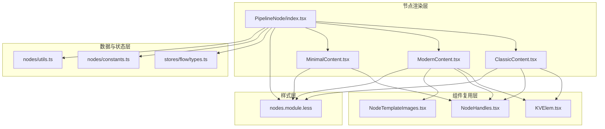
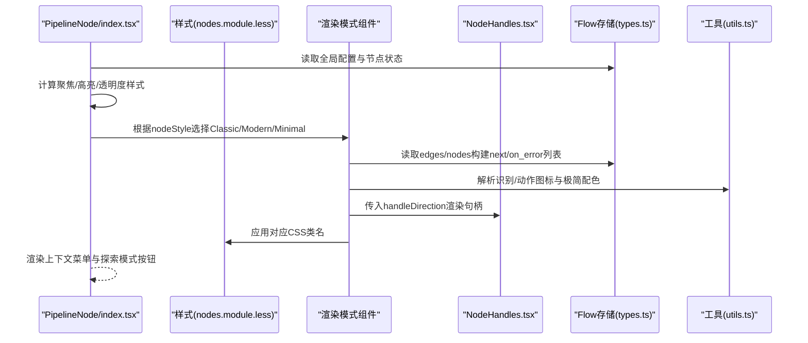
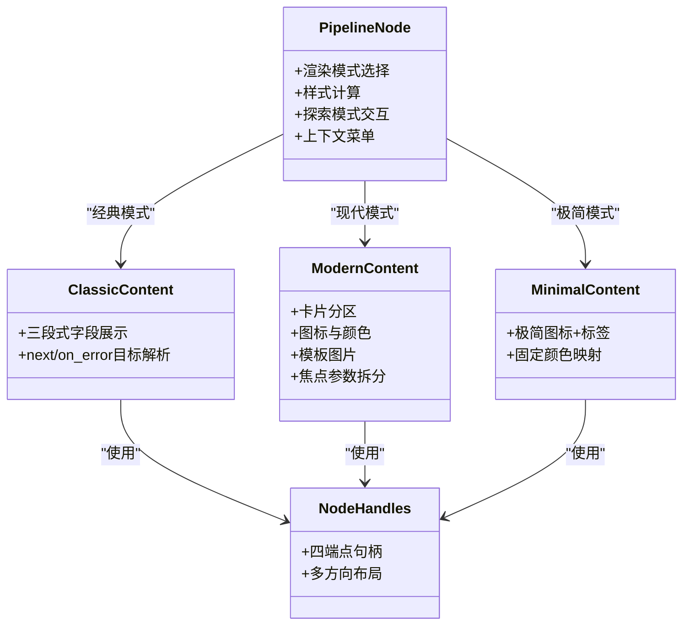
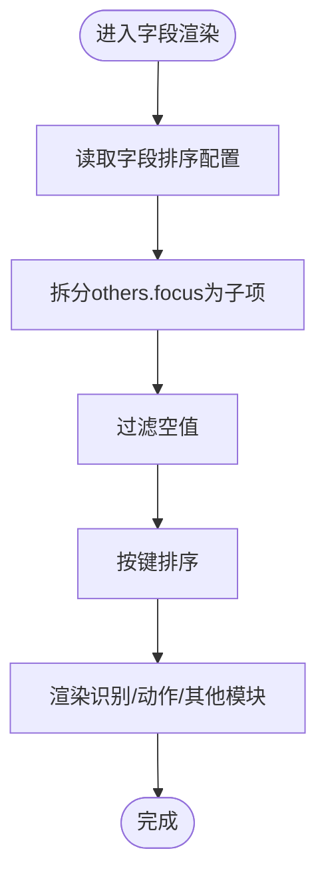
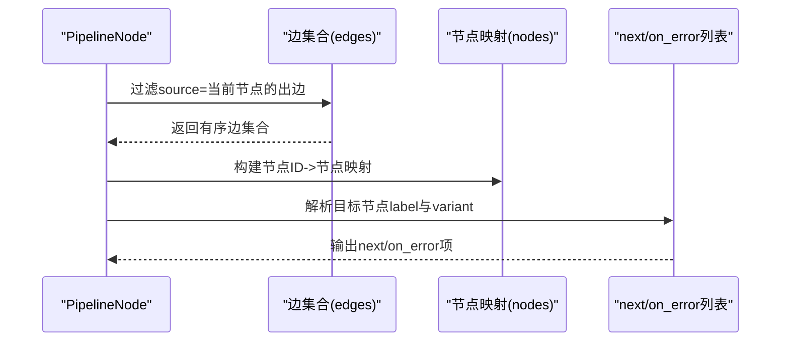
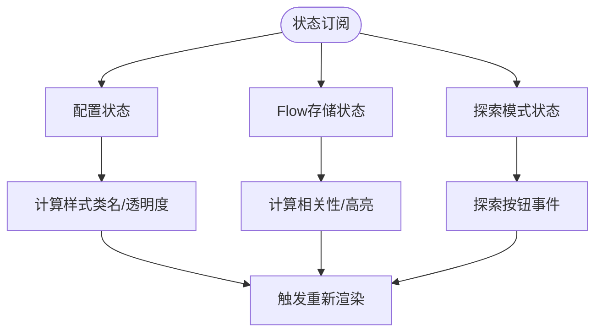
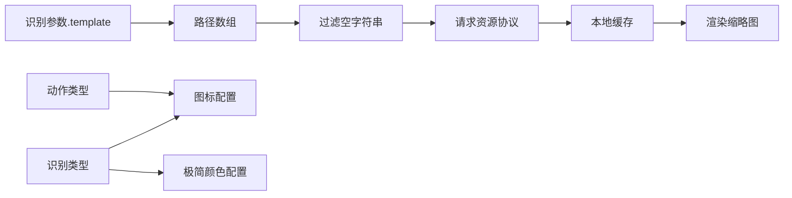
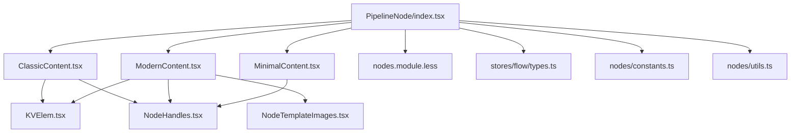

# Pipeline节点

<cite>
**本文档引用的文件**
- [PipelineNode/index.tsx](file://src/components/flow/nodes/PipelineNode/index.tsx)
- [PipelineNode/ClassicContent.tsx](file://src/components/flow/nodes/PipelineNode/ClassicContent.tsx)
- [PipelineNode/ModernContent.tsx](file://src/components/flow/nodes/PipelineNode/ModernContent.tsx)
- [PipelineNode/MinimalContent.tsx](file://src/components/flow/nodes/PipelineNode/MinimalContent.tsx)
- [nodes模块样式](file://src/styles/flow/nodes.module.less)
- [节点常量](file://src/components/flow/nodes/constants.ts)
- [节点工具函数](file://src/components/flow/nodes/utils.ts)
- [节点句柄组件](file://src/components/flow/nodes/components/NodeHandles.tsx)
- [键值对元素组件](file://src/components/flow/nodes/components/KVElem.tsx)
- [节点模板图片组件](file://src/components/flow/nodes/components/NodeTemplateImages.tsx)
- [Flow存储类型定义](file://src/stores/flow/types.ts)
</cite>

## 目录
1. [简介](#简介)
2. [项目结构](#项目结构)
3. [核心组件](#核心组件)
4. [架构总览](#架构总览)
5. [详细组件分析](#详细组件分析)
6. [依赖关系分析](#依赖关系分析)
7. [性能考量](#性能考量)
8. [故障排查指南](#故障排查指南)
9. [结论](#结论)
10. [附录](#附录)

## 简介
本文件系统化梳理了Pipeline节点作为工作流核心节点的设计理念与实现方式，重点覆盖以下方面：
- 三种渲染模式（ClassicContent、ModernContent、MinimalContent）的差异与适用场景
- 节点属性配置、字段编辑、连接点管理
- 节点状态管理、数据绑定与事件处理机制
- 节点自定义与扩展的最佳实践

Pipeline节点承载“识别类型 + 动作类型 + 其他参数”的完整任务定义，同时通过可配置的渲染模式与连接点布局，满足从入门到专业用户的多样化需求。

## 项目结构
Pipeline节点位于前端Flow可视化编辑器中，采用按功能分层的组织方式：
- 节点渲染层：PipelineNode主组件及其三种内容子组件
- 组件复用层：句柄、键值对展示、模板图片等通用组件
- 样式层：统一的节点样式与主题变量
- 数据与状态层：Flow存储类型定义与运行时状态

**图表来源**
- [PipelineNode/index.tsx:1-310](file://src/components/flow/nodes/PipelineNode/index.tsx#L1-L310)
- [PipelineNode/ClassicContent.tsx:1-169](file://src/components/flow/nodes/PipelineNode/ClassicContent.tsx#L1-L169)
- [PipelineNode/ModernContent.tsx:1-331](file://src/components/flow/nodes/PipelineNode/ModernContent.tsx#L1-L331)
- [PipelineNode/MinimalContent.tsx:1-58](file://src/components/flow/nodes/PipelineNode/MinimalContent.tsx#L1-L58)
- [nodes模块样式:1-907](file://src/styles/flow/nodes.module.less#L1-L907)
- [Flow存储类型定义:1-439](file://src/stores/flow/types.ts#L1-L439)
- [节点常量:1-47](file://src/components/flow/nodes/constants.ts#L1-L47)
- [节点工具函数:1-139](file://src/components/flow/nodes/utils.ts#L1-L139)
- [节点句柄组件:1-277](file://src/components/flow/nodes/components/NodeHandles.tsx#L1-L277)
- [键值对元素组件:1-20](file://src/components/flow/nodes/components/KVElem.tsx#L1-L20)
- [节点模板图片组件:1-124](file://src/components/flow/nodes/components/NodeTemplateImages.tsx#L1-L124)

**章节来源**
- [PipelineNode/index.tsx:1-310](file://src/components/flow/nodes/PipelineNode/index.tsx#L1-L310)
- [nodes模块样式:1-907](file://src/styles/flow/nodes.module.less#L1-L907)

## 核心组件
- PipelineNode主组件：负责根据全局配置选择渲染模式、计算节点样式、处理探索模式下的交互按钮、整合上下文菜单与调试高亮。
- 三种内容组件：
  - ClassicContent：传统列表式展示，适合初学者理解字段结构
  - ModernContent：现代卡片式布局，支持图标、模板图片、分模块折叠
  - MinimalContent：极简图标+标签，适合密集画布与快速浏览
- 通用组件：
  - NodeHandles：统一的四端点（target/jump_back/next/error）句柄，支持多方向布局
  - KVElem：键值对渲染单元，统一字段展示格式
  - NodeTemplateImages：基于模板路径的图片缩略图展示

**章节来源**
- [PipelineNode/index.tsx:28-309](file://src/components/flow/nodes/PipelineNode/index.tsx#L28-L309)
- [PipelineNode/ClassicContent.tsx:17-168](file://src/components/flow/nodes/PipelineNode/ClassicContent.tsx#L17-L168)
- [PipelineNode/ModernContent.tsx:35-330](file://src/components/flow/nodes/PipelineNode/ModernContent.tsx#L35-L330)
- [PipelineNode/MinimalContent.tsx:10-57](file://src/components/flow/nodes/PipelineNode/MinimalContent.tsx#L10-L57)
- [节点句柄组件:62-158](file://src/components/flow/nodes/components/NodeHandles.tsx#L62-L158)
- [键值对元素组件:5-19](file://src/components/flow/nodes/components/KVElem.tsx#L5-L19)
- [节点模板图片组件:21-123](file://src/components/flow/nodes/components/NodeTemplateImages.tsx#L21-L123)

## 架构总览
Pipeline节点的控制流与数据流如下：

**图表来源**
- [PipelineNode/index.tsx:29-307](file://src/components/flow/nodes/PipelineNode/index.tsx#L29-L307)
- [PipelineNode/ClassicContent.tsx:24-40](file://src/components/flow/nodes/PipelineNode/ClassicContent.tsx#L24-L40)
- [PipelineNode/ModernContent.tsx:64-80](file://src/components/flow/nodes/PipelineNode/ModernContent.tsx#L64-L80)
- [PipelineNode/MinimalContent.tsx:12-54](file://src/components/flow/nodes/PipelineNode/MinimalContent.tsx#L12-L54)
- [节点句柄组件:62-158](file://src/components/flow/nodes/components/NodeHandles.tsx#L62-L158)
- [Flow存储类型定义:109-124](file://src/stores/flow/types.ts#L109-L124)
- [节点工具函数:14-138](file://src/components/flow/nodes/utils.ts#L14-L138)
- [nodes模块样式:70-339](file://src/styles/flow/nodes.module.less#L70-L339)

## 详细组件分析

### 渲染模式对比与适用场景
- ClassicContent（经典模式）
  - 特点：三段式列表（识别、动作、其他），紧凑展示所有字段
  - 适用：学习期、需要逐项核对参数的场景
  - 关键逻辑：遍历识别/动作/其他参数键，按排序配置输出；根据边信息生成next/on_error目标列表
- ModernContent（现代模式）
  - 特点：卡片式分区、图标、模板图片、分模块折叠、焦点参数拆分
  - 适用：专业用户、需要快速浏览与视觉区分的场景
  - 关键逻辑：解析焦点参数displayName映射、模板路径提取、图标与颜色动态选择
- MinimalContent（极简模式）
  - 特点：仅图标+标签，句柄极简化
  - 适用：超大画布、强调连接关系而非字段细节
  - 关键逻辑：根据识别类型返回固定颜色与图标

**图表来源**
- [PipelineNode/index.tsx:190-200](file://src/components/flow/nodes/PipelineNode/index.tsx#L190-L200)
- [PipelineNode/ClassicContent.tsx:17-168](file://src/components/flow/nodes/PipelineNode/ClassicContent.tsx#L17-L168)
- [PipelineNode/ModernContent.tsx:35-330](file://src/components/flow/nodes/PipelineNode/ModernContent.tsx#L35-L330)
- [PipelineNode/MinimalContent.tsx:10-57](file://src/components/flow/nodes/PipelineNode/MinimalContent.tsx#L10-L57)
- [节点句柄组件:62-158](file://src/components/flow/nodes/components/NodeHandles.tsx#L62-L158)

**章节来源**
- [PipelineNode/ClassicContent.tsx:17-168](file://src/components/flow/nodes/PipelineNode/ClassicContent.tsx#L17-L168)
- [PipelineNode/ModernContent.tsx:35-330](file://src/components/flow/nodes/PipelineNode/ModernContent.tsx#L35-L330)
- [PipelineNode/MinimalContent.tsx:10-57](file://src/components/flow/nodes/PipelineNode/MinimalContent.tsx#L10-L57)

### 属性配置与字段编辑
- 数据模型（PipelineNodeDataType）
  - label：节点显示名称
  - recognition：识别类型与参数
  - action：动作类型与参数
  - others：通用控制参数（如超时、前置/后置延时、focus等）
  - extras：额外扩展字段
  - handleDirection：句柄方向（左右/上下等）
- 字段排序与显示
  - 通过配置合并与排序函数，确保字段以稳定顺序呈现
  - 支持按配置开关显示“详细字段”和“流程连接区”
- 焦点参数处理
  - ModernContent会将others.focus对象按schema映射为可读的子项
  - 空值会被过滤，避免冗余展示

**图表来源**
- [Flow存储类型定义:109-124](file://src/stores/flow/types.ts#L109-L124)
- [PipelineNode/ModernContent.tsx:97-125](file://src/components/flow/nodes/PipelineNode/ModernContent.tsx#L97-L125)
- [PipelineNode/ClassicContent.tsx:64-79](file://src/components/flow/nodes/PipelineNode/ClassicContent.tsx#L64-L79)

**章节来源**
- [Flow存储类型定义:109-124](file://src/stores/flow/types.ts#L109-L124)
- [PipelineNode/ClassicContent.tsx:56-103](file://src/components/flow/nodes/PipelineNode/ClassicContent.tsx#L56-L103)
- [PipelineNode/ModernContent.tsx:97-149](file://src/components/flow/nodes/PipelineNode/ModernContent.tsx#L97-L149)

### 连接点管理与流程可视化
- 四端点语义
  - target：常规目标
  - jump_back：回跳目标（通常用于错误分支回退）
  - next：成功流转
  - error：错误流转
- 边解析与高亮
  - 基于出边集合，按sourceHandle分类生成next/on_error列表
  - 根据targetHandle与锚点类型标注不同样式（普通/回跳/锚点）
- 句柄方向
  - 支持left-right、right-left、top-bottom、bottom-top四种方向
  - 句柄样式随方向切换垂直/水平布局

**图表来源**
- [PipelineNode/ClassicContent.tsx:24-40](file://src/components/flow/nodes/PipelineNode/ClassicContent.tsx#L24-L40)
- [PipelineNode/ModernContent.tsx:64-80](file://src/components/flow/nodes/PipelineNode/ModernContent.tsx#L64-L80)
- [节点句柄组件:16-53](file://src/components/flow/nodes/components/NodeHandles.tsx#L16-L53)

**章节来源**
- [PipelineNode/ClassicContent.tsx:24-40](file://src/components/flow/nodes/PipelineNode/ClassicContent.tsx#L24-L40)
- [PipelineNode/ModernContent.tsx:64-80](file://src/components/flow/nodes/PipelineNode/ModernContent.tsx#L64-L80)
- [节点常量:1-47](file://src/components/flow/nodes/constants.ts#L1-L47)
- [节点句柄组件:62-158](file://src/components/flow/nodes/components/NodeHandles.tsx#L62-L158)

### 状态管理、数据绑定与事件处理
- 状态来源
  - 全局配置：nodeStyle、focusOpacity、showNodeDetailFields、showNodeFlowSection、showNodeTemplateImages、fieldSortConfig
  - Flow存储：nodes、edges、selectedNodes/Edges、pathMode、pathNodeIds、anchorRefHighlightedNodeIds、debugOverlay
  - 探索模式：status、ghostNodeId、execute/confirm/regenerate
- 数据绑定
  - 通过useFlowStore与useConfigStore订阅状态变化，驱动渲染与样式计算
  - 通过useReactFlow获取节点实例，支持交互与定位
- 事件处理
  - 探索模式按钮：执行、重新生成、确认
  - 右键菜单：统一的上下文菜单组件封装
  - 调试高亮：currentNodeId与activeRecognitionNodeIds联动高亮

**图表来源**
- [PipelineNode/index.tsx:30-188](file://src/components/flow/nodes/PipelineNode/index.tsx#L30-L188)
- [PipelineNode/index.tsx:202-216](file://src/components/flow/nodes/PipelineNode/index.tsx#L202-L216)
- [PipelineNode/index.tsx:262-305](file://src/components/flow/nodes/PipelineNode/index.tsx#L262-L305)

**章节来源**
- [PipelineNode/index.tsx:30-188](file://src/components/flow/nodes/PipelineNode/index.tsx#L30-L188)
- [PipelineNode/index.tsx:202-216](file://src/components/flow/nodes/PipelineNode/index.tsx#L202-L216)

### 模板图片与图标/颜色策略
- 模板图片
  - 从识别参数的template字段提取路径列表，去空后请求资源协议加载
  - 使用本地缓存与防抖机制，限制最大高度与宽度，提升性能
- 图标与颜色
  - 识别类型与动作类型分别映射到图标配置
  - 极简模式按识别类型返回固定主色与背景色，保证一致性

**图表来源**
- [PipelineNode/ModernContent.tsx:177-190](file://src/components/flow/nodes/PipelineNode/ModernContent.tsx#L177-L190)
- [节点模板图片组件:31-78](file://src/components/flow/nodes/components/NodeTemplateImages.tsx#L31-L78)
- [节点工具函数:14-138](file://src/components/flow/nodes/utils.ts#L14-L138)

**章节来源**
- [PipelineNode/ModernContent.tsx:177-190](file://src/components/flow/nodes/PipelineNode/ModernContent.tsx#L177-L190)
- [节点模板图片组件:21-123](file://src/components/flow/nodes/components/NodeTemplateImages.tsx#L21-L123)
- [节点工具函数:14-138](file://src/components/flow/nodes/utils.ts#L14-L138)

## 依赖关系分析
- 组件耦合
  - PipelineNode主组件低耦合，通过条件渲染选择内容组件
  - 内容组件共享KVElem与NodeHandles，形成高内聚低耦合
- 外部依赖
  - ReactFlow句柄系统：Handle、Position、useUpdateNodeInternals
  - Ant Design组件：按钮、消息提示、图片预览
  - Zustand状态管理：Flow存储与配置存储
- 样式依赖
  - 三种渲染模式共享同一套CSS类名体系，通过类名组合实现差异化外观

**图表来源**
- [PipelineNode/index.tsx:1-31](file://src/components/flow/nodes/PipelineNode/index.tsx#L1-L31)
- [PipelineNode/ClassicContent.tsx:1-11](file://src/components/flow/nodes/PipelineNode/ClassicContent.tsx#L1-L11)
- [PipelineNode/ModernContent.tsx:1-16](file://src/components/flow/nodes/PipelineNode/ModernContent.tsx#L1-L16)
- [PipelineNode/MinimalContent.tsx:1-8](file://src/components/flow/nodes/PipelineNode/MinimalContent.tsx#L1-L8)
- [节点句柄组件:1-13](file://src/components/flow/nodes/components/NodeHandles.tsx#L1-L13)
- [键值对元素组件:1-3](file://src/components/flow/nodes/components/KVElem.tsx#L1-L3)
- [节点模板图片组件:1-6](file://src/components/flow/nodes/components/NodeTemplateImages.tsx#L1-L6)
- [Flow存储类型定义:1-16](file://src/stores/flow/types.ts#L1-L16)
- [节点常量:1-13](file://src/components/flow/nodes/constants.ts#L1-L13)
- [节点工具函数:1-7](file://src/components/flow/nodes/utils.ts#L1-L7)

**章节来源**
- [PipelineNode/index.tsx:1-31](file://src/components/flow/nodes/PipelineNode/index.tsx#L1-L31)
- [nodes模块样式:1-907](file://src/styles/flow/nodes.module.less#L1-L907)

## 性能考量
- 渲染优化
  - 使用memo包裹内容组件与通用子组件，减少不必要的重渲染
  - useMemo计算next/on_error列表与排序键，避免重复计算
- 资源加载
  - 模板图片请求采用防抖与本地缓存，降低网络与渲染压力
- 样式与布局
  - 通过CSS类名组合实现样式切换，避免运行时复杂计算
  - 句柄方向变更时使用定时器多次调用更新，确保布局稳定

[本节为通用性能建议，无需特定文件引用]

## 故障排查指南
- 探索模式按钮无效
  - 检查探索状态与ghostNodeId是否匹配，确认execute/confirm/regenerate回调可用
- 流程连接区不显示
  - 确认showNodeFlowSection开启，且存在有效的出边
- 模板图片不显示
  - 检查template字段是否为空或无效路径，确认WebSocket连接状态与缓存命中
- 极简模式颜色异常
  - 确认识别类型是否在颜色映射范围内，必要时扩展映射规则

**章节来源**
- [PipelineNode/index.tsx:202-216](file://src/components/flow/nodes/PipelineNode/index.tsx#L202-L216)
- [PipelineNode/ClassicContent.tsx:142-163](file://src/components/flow/nodes/PipelineNode/ClassicContent.tsx#L142-L163)
- [PipelineNode/ModernContent.tsx:297-324](file://src/components/flow/nodes/PipelineNode/ModernContent.tsx#L297-L324)
- [节点模板图片组件:66-83](file://src/components/flow/nodes/components/NodeTemplateImages.tsx#L66-L83)
- [节点工具函数:110-138](file://src/components/flow/nodes/utils.ts#L110-L138)

## 结论
Pipeline节点通过“主组件 + 多种内容组件 + 通用子组件”的分层设计，在保证功能完整性的同时兼顾了可维护性与可扩展性。三种渲染模式覆盖不同使用场景，配合统一的句柄系统与样式体系，能够高效支撑从新手到专家的工作流编辑体验。建议在扩展新功能时遵循现有模式，优先考虑复用通用组件与工具函数，确保一致的用户体验与稳定的性能表现。

[本节为总结性内容，无需特定文件引用]

## 附录

### 最佳实践清单
- 自定义渲染模式
  - 基于现有内容组件抽象公共逻辑，新增模式时复用KVElem与NodeHandles
- 字段编辑与校验
  - 通过排序配置与schema映射，确保字段展示一致性；对空值进行过滤
- 连接点管理
  - 明确next/error语义，合理使用jump_back与锚点，避免环路
- 性能优化
  - 使用memo与useMemo，减少重渲染；对图片请求加防抖与缓存
- 主题与样式
  - 严格遵循nodes.module.less的类名体系，避免破坏整体风格

[本节为通用建议，无需特定文件引用]