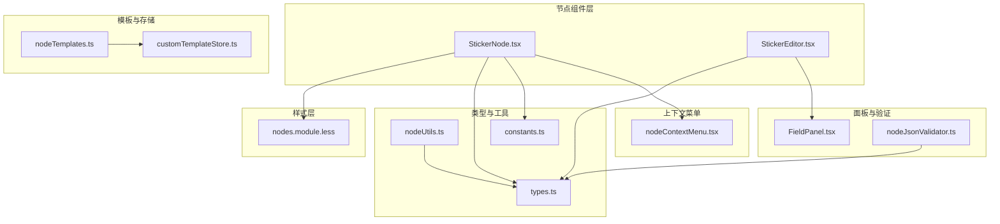
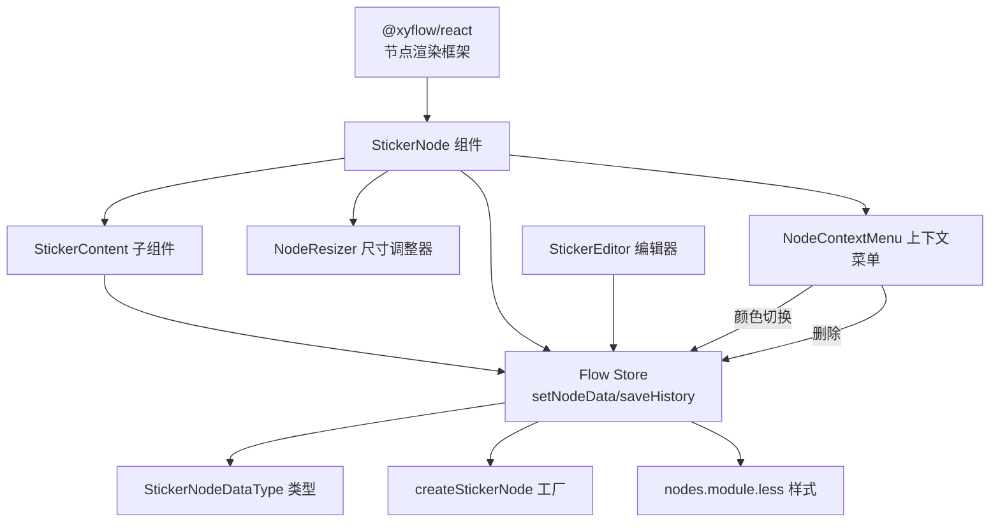
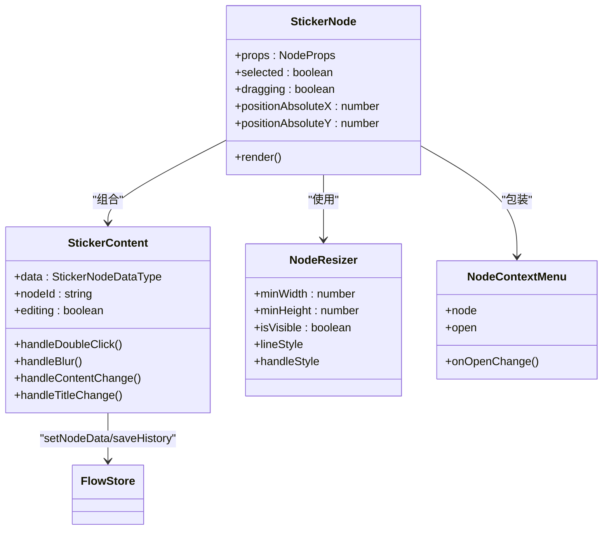
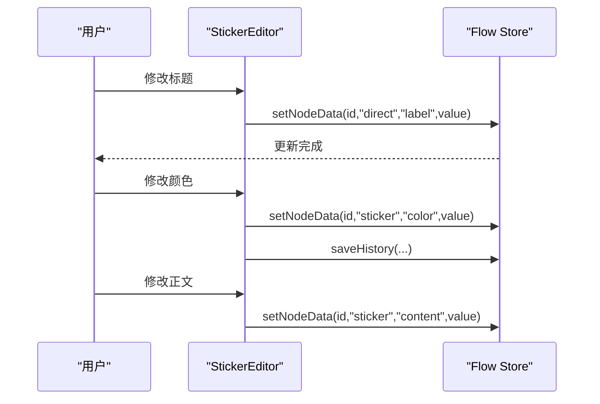
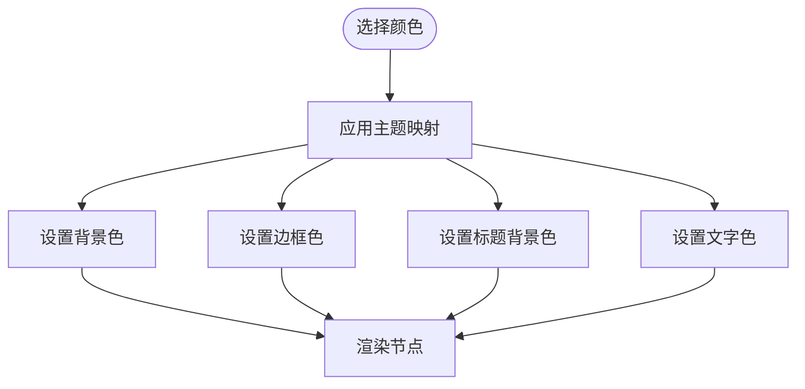
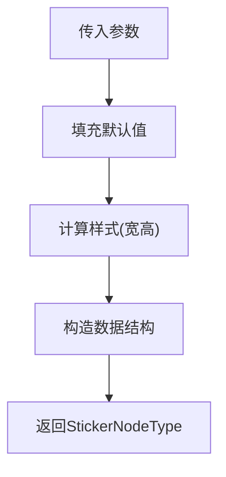
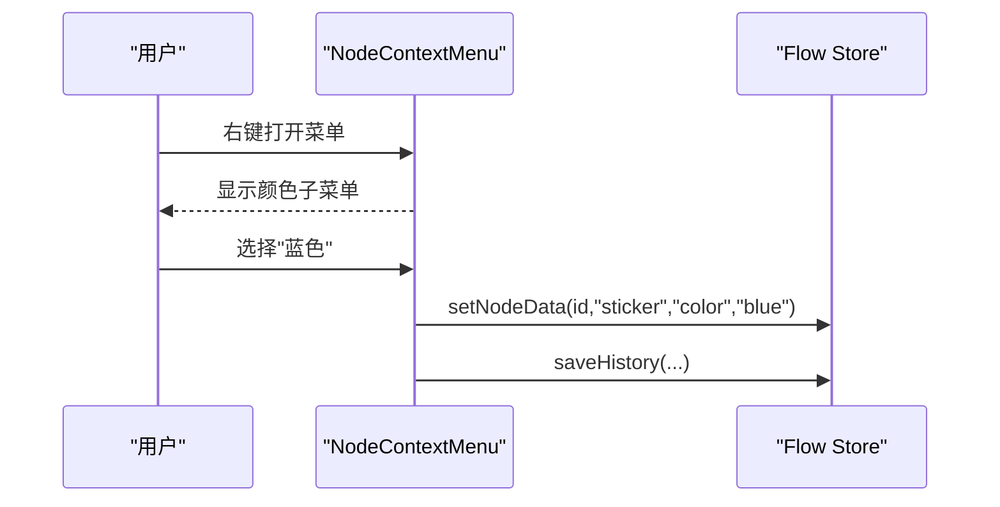
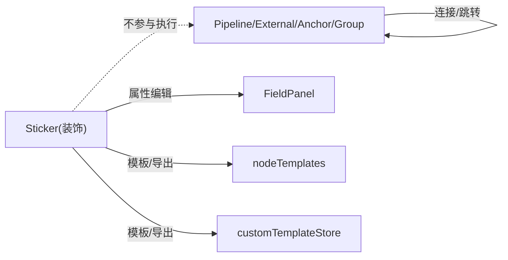
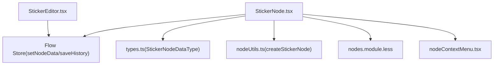
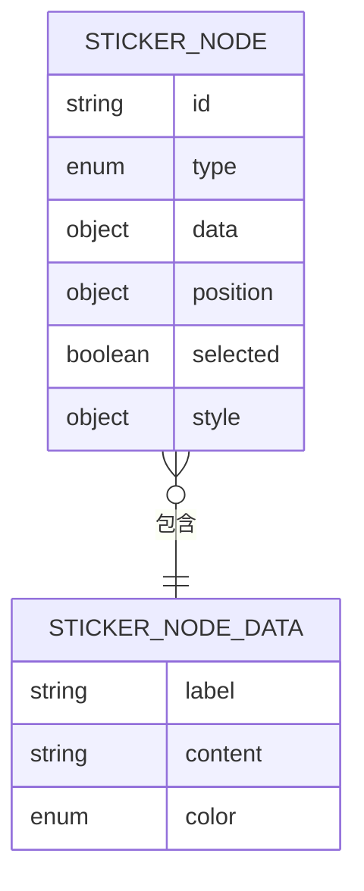

# Sticker贴纸节点

<cite>
**本文档引用的文件**
- [StickerNode.tsx](file://src/components/flow/nodes/StickerNode.tsx)
- [StickerEditor.tsx](file://src/components/panels/node-editors/StickerEditor.tsx)
- [types.ts](file://src/stores/flow/types.ts)
- [nodeUtils.ts](file://src/stores/flow/utils/nodeUtils.ts)
- [constants.ts](file://src/components/flow/nodes/constants.ts)
- [nodes.module.less](file://src/styles/flow/nodes.module.less)
- [nodeContextMenu.tsx](file://src/components/flow/nodes/nodeContextMenu.tsx)
- [nodeTemplates.ts](file://src/data/nodeTemplates.ts)
- [customTemplateStore.ts](file://src/stores/customTemplateStore.ts)
- [FieldPanel.tsx](file://src/components/panels/main/FieldPanel.tsx)
- [nodeJsonValidator.ts](file://src/utils/node/nodeJsonValidator.ts)
</cite>

## 目录
1. [简介](#简介)
2. [项目结构](#项目结构)
3. [核心组件](#核心组件)
4. [架构总览](#架构总览)
5. [详细组件分析](#详细组件分析)
6. [依赖关系分析](#依赖关系分析)
7. [性能考虑](#性能考虑)
8. [故障排除指南](#故障排除指南)
9. [结论](#结论)
10. [附录](#附录)

## 简介
Sticker贴纸节点是工作流编辑器中的装饰性与标注性元素，用于在画布上添加可拖拽、可调整大小、可着色的便签块。它不参与工作流的执行逻辑，而是作为辅助信息载体，帮助用户标注说明、记录临时备注或进行视觉分组提示。Sticker节点具备如下设计要点：
- 装饰性优先：不承载业务参数，仅展示标签与文本内容
- 可交互编辑：双击进入编辑模式，支持标题与正文修改
- 主题化外观：内置多种颜色主题，统一视觉风格
- 尺寸可调：支持通过拖拽调整宽高，最小尺寸限制
- 层级管理：与React Flow的选中态、缩放、层级保持一致
- 与工作流解耦：不影响连接关系与执行路径

## 项目结构
Sticker节点由前端组件、样式、类型定义、工具函数与上下文菜单共同组成，并通过节点注册机制接入React Flow。

**图表来源**
- [StickerNode.tsx:1-243](file://src/components/flow/nodes/StickerNode.tsx#L1-L243)
- [StickerEditor.tsx:1-137](file://src/components/panels/node-editors/StickerEditor.tsx#L1-L137)
- [types.ts:138-212](file://src/stores/flow/types.ts#L138-L212)
- [nodeUtils.ts:120-161](file://src/stores/flow/utils/nodeUtils.ts#L120-L161)
- [constants.ts:14-20](file://src/components/flow/nodes/constants.ts#L14-L20)
- [nodes.module.less:750-843](file://src/styles/flow/nodes.module.less#L750-L843)
- [nodeContextMenu.tsx:637-700](file://src/components/flow/nodes/nodeContextMenu.tsx#L637-L700)
- [nodeTemplates.ts:31-36](file://src/data/nodeTemplates.ts#L31-L36)
- [customTemplateStore.ts:212-265](file://src/stores/customTemplateStore.ts#L212-L265)
- [FieldPanel.tsx:271-273](file://src/components/panels/main/FieldPanel.tsx#L271-L273)
- [nodeJsonValidator.ts:262-311](file://src/utils/node/nodeJsonValidator.ts#L262-L311)

**章节来源**
- [StickerNode.tsx:1-243](file://src/components/flow/nodes/StickerNode.tsx#L1-L243)
- [StickerEditor.tsx:1-137](file://src/components/panels/node-editors/StickerEditor.tsx#L1-L137)
- [types.ts:138-212](file://src/stores/flow/types.ts#L138-L212)
- [nodeUtils.ts:120-161](file://src/stores/flow/utils/nodeUtils.ts#L120-L161)
- [constants.ts:14-20](file://src/components/flow/nodes/constants.ts#L14-L20)
- [nodes.module.less:750-843](file://src/styles/flow/nodes.module.less#L750-L843)
- [nodeContextMenu.tsx:637-700](file://src/components/flow/nodes/nodeContextMenu.tsx#L637-L700)
- [nodeTemplates.ts:31-36](file://src/data/nodeTemplates.ts#L31-L36)
- [customTemplateStore.ts:212-265](file://src/stores/customTemplateStore.ts#L212-L265)
- [FieldPanel.tsx:271-273](file://src/components/panels/main/FieldPanel.tsx#L271-L273)
- [nodeJsonValidator.ts:262-311](file://src/utils/node/nodeJsonValidator.ts#L262-L311)

## 核心组件
- StickerNode：渲染便签节点UI，包含标题栏、正文区域、尺寸调整器与上下文菜单
- StickerEditor：侧边栏属性编辑器，提供标题、颜色与正文编辑入口
- StickerNodeDataType：便签节点的数据结构，包含标签、内容与颜色主题
- STICKER_COLOR_THEMES：颜色主题映射，控制背景、边框、标题背景与文字颜色
- createStickerNode：工厂函数，用于创建Sticker节点实例
- 节点上下文菜单：支持颜色切换与删除等操作

**章节来源**
- [StickerNode.tsx:16-51](file://src/components/flow/nodes/StickerNode.tsx#L16-L51)
- [StickerEditor.tsx:13-19](file://src/components/panels/node-editors/StickerEditor.tsx#L13-L19)
- [types.ts:138-146](file://src/stores/flow/types.ts#L138-L146)
- [nodeUtils.ts:120-161](file://src/stores/flow/utils/nodeUtils.ts#L120-L161)
- [nodeContextMenu.tsx:637-700](file://src/components/flow/nodes/nodeContextMenu.tsx#L637-L700)

## 架构总览
Sticker节点采用“组件-样式-类型-工具-上下文菜单”的分层架构，通过React Flow的节点注册机制接入画布，同时与Flow Store交互实现数据更新与历史记录保存。

**图表来源**
- [StickerNode.tsx:167-219](file://src/components/flow/nodes/StickerNode.tsx#L167-L219)
- [StickerEditor.tsx:21-69](file://src/components/panels/node-editors/StickerEditor.tsx#L21-L69)
- [types.ts:138-146](file://src/stores/flow/types.ts#L138-L146)
- [nodeUtils.ts:120-161](file://src/stores/flow/utils/nodeUtils.ts#L120-L161)
- [nodes.module.less:750-843](file://src/styles/flow/nodes.module.less#L750-L843)
- [nodeContextMenu.tsx:637-700](file://src/components/flow/nodes/nodeContextMenu.tsx#L637-L700)

## 详细组件分析

### StickerNode组件
- 设计思路
  - 将便签分为标题栏与正文两部分，标题栏支持直接编辑，正文支持双击进入编辑
  - 使用NodeResizer提供尺寸调整能力，限定最小宽高
  - 通过STICKER_COLOR_THEMES根据颜色主题动态应用样式
  - 与NodeContextMenu集成，提供颜色切换与删除等操作
- 关键交互
  - 双击正文进入编辑模式，失焦保存
  - 修改标题与正文通过Flow Store的setNodeData更新
  - 选中态时显示阴影与调整器
- 性能优化
  - 使用memo包裹StickerNode与StickerContent，避免不必要的重渲染
  - 仅在关键字段变化时触发重渲染

**图表来源**
- [StickerNode.tsx:55-165](file://src/components/flow/nodes/StickerNode.tsx#L55-L165)
- [StickerNode.tsx:167-219](file://src/components/flow/nodes/StickerNode.tsx#L167-L219)

**章节来源**
- [StickerNode.tsx:55-165](file://src/components/flow/nodes/StickerNode.tsx#L55-L165)
- [StickerNode.tsx:167-219](file://src/components/flow/nodes/StickerNode.tsx#L167-L219)

### StickerEditor编辑器
- 设计思路
  - 提供标题、颜色与正文三类属性编辑入口
  - 颜色选择器绑定到StickerColorTheme枚举
  - 正文编辑使用多行文本域，支持自动高度
- 交互行为
  - 标题与正文变更即时写入Flow Store
  - 颜色变更后保存历史记录

**图表来源**
- [StickerEditor.tsx:21-69](file://src/components/panels/node-editors/StickerEditor.tsx#L21-L69)

**章节来源**
- [StickerEditor.tsx:21-69](file://src/components/panels/node-editors/StickerEditor.tsx#L21-L69)

### 颜色主题与样式
- 颜色主题
  - yellow/green/blue/pink/purple五种主题，分别定义背景、边框、标题背景与文字颜色
- 样式细节
  - 标题栏使用白色粗体字，正文支持换行与滚动
  - 选中态显示蓝色描边阴影
  - 最小宽度140px，最小高度100px

**图表来源**
- [StickerNode.tsx:16-51](file://src/components/flow/nodes/StickerNode.tsx#L16-L51)
- [nodes.module.less:750-843](file://src/styles/flow/nodes.module.less#L750-L843)

**章节来源**
- [StickerNode.tsx:16-51](file://src/components/flow/nodes/StickerNode.tsx#L16-L51)
- [nodes.module.less:750-843](file://src/styles/flow/nodes.module.less#L750-L843)

### 节点创建与工厂
- createStickerNode
  - 支持传入标签、初始位置、是否选中、数据与样式
  - 默认尺寸200×160，若未提供则使用默认值
  - 默认颜色为yellow
- 类型约束
  - StickerNodeDataType包含label、content、color三项
  - StickerColorTheme为枚举类型

**图表来源**
- [nodeUtils.ts:120-161](file://src/stores/flow/utils/nodeUtils.ts#L120-L161)
- [types.ts:138-146](file://src/stores/flow/types.ts#L138-L146)

**章节来源**
- [nodeUtils.ts:120-161](file://src/stores/flow/utils/nodeUtils.ts#L120-L161)
- [types.ts:138-146](file://src/stores/flow/types.ts#L138-L146)

### 上下文菜单与交互
- 颜色切换
  - 支持在上下文菜单中切换至green/blue/pink/purple
- 端点位置
  - Sticker节点不参与端点方向配置（可见性条件排除）
- 删除
  - 提供删除节点操作

**图表来源**
- [nodeContextMenu.tsx:637-700](file://src/components/flow/nodes/nodeContextMenu.tsx#L637-L700)

**章节来源**
- [nodeContextMenu.tsx:637-700](file://src/components/flow/nodes/nodeContextMenu.tsx#L637-L700)

### 与工作流节点的关系与影响范围
- 关系定位
  - Sticker节点属于装饰性节点，不参与工作流执行
  - 不提供端点（handle），不参与连接与跳转
- 影响范围
  - 仅影响画布布局与视觉表达
  - 与FieldPanel联动，支持属性编辑
  - 与模板系统结合，支持模板化创建与导出

**图表来源**
- [constants.ts:14-20](file://src/components/flow/nodes/constants.ts#L14-L20)
- [FieldPanel.tsx:271-273](file://src/components/panels/main/FieldPanel.tsx#L271-L273)
- [nodeTemplates.ts:31-36](file://src/data/nodeTemplates.ts#L31-L36)
- [customTemplateStore.ts:212-265](file://src/stores/customTemplateStore.ts#L212-L265)

**章节来源**
- [constants.ts:14-20](file://src/components/flow/nodes/constants.ts#L14-L20)
- [FieldPanel.tsx:271-273](file://src/components/panels/main/FieldPanel.tsx#L271-L273)
- [nodeTemplates.ts:31-36](file://src/data/nodeTemplates.ts#L31-L36)
- [customTemplateStore.ts:212-265](file://src/stores/customTemplateStore.ts#L212-L265)

### 贴纸模板库与自定义样式
- 模板库
  - nodeTemplates中定义了“便签贴纸”模板项，可用于快速创建Sticker节点
  - customTemplateStore按固定顺序整合预设与自定义模板，确保Sticker模板位于特定位置
- 自定义样式
  - 通过StickerEditor的颜色选择器切换主题
  - 通过StickerNode的NodeResizer调整尺寸
  - 通过StickerContent的标题与正文编辑实现内容定制

**章节来源**
- [nodeTemplates.ts:31-36](file://src/data/nodeTemplates.ts#L31-L36)
- [customTemplateStore.ts:212-265](file://src/stores/customTemplateStore.ts#L212-L265)
- [StickerEditor.tsx:13-19](file://src/components/panels/node-editors/StickerEditor.tsx#L13-L19)
- [StickerNode.tsx:204-210](file://src/components/flow/nodes/StickerNode.tsx#L204-L210)

## 依赖关系分析
- 组件依赖
  - StickerNode依赖Flow Store以更新数据与保存历史
  - StickerEditor依赖Flow Store以批量更新节点数据
  - 样式依赖nodes.module.less中的类名与变量
- 类型与工具
  - StickerNodeDataType与StickerColorTheme定义于types.ts
  - createStickerNode定义于nodeUtils.ts
- 上下文菜单
  - nodeContextMenu.tsx提供Sticker节点的颜色切换与删除入口

**图表来源**
- [StickerNode.tsx:1-243](file://src/components/flow/nodes/StickerNode.tsx#L1-L243)
- [StickerEditor.tsx:1-137](file://src/components/panels/node-editors/StickerEditor.tsx#L1-L137)
- [types.ts:138-146](file://src/stores/flow/types.ts#L138-L146)
- [nodeUtils.ts:120-161](file://src/stores/flow/utils/nodeUtils.ts#L120-L161)
- [nodes.module.less:750-843](file://src/styles/flow/nodes.module.less#L750-L843)
- [nodeContextMenu.tsx:637-700](file://src/components/flow/nodes/nodeContextMenu.tsx#L637-L700)

**章节来源**
- [StickerNode.tsx:1-243](file://src/components/flow/nodes/StickerNode.tsx#L1-L243)
- [StickerEditor.tsx:1-137](file://src/components/panels/node-editors/StickerEditor.tsx#L1-L137)
- [types.ts:138-146](file://src/stores/flow/types.ts#L138-L146)
- [nodeUtils.ts:120-161](file://src/stores/flow/utils/nodeUtils.ts#L120-L161)
- [nodes.module.less:750-843](file://src/styles/flow/nodes.module.less#L750-L843)
- [nodeContextMenu.tsx:637-700](file://src/components/flow/nodes/nodeContextMenu.tsx#L637-L700)

## 性能考虑
- 渲染优化
  - StickerNode与StickerContent均使用memo，减少重复渲染
  - 仅在关键字段（label/content/color）变化时触发重渲染
- 事件处理
  - 使用useCallback缓存回调，降低子组件重渲染概率
- 样式与尺寸
  - 固定最小尺寸，避免过小导致频繁重排
  - 使用NodeResizer而非实时DOM测量，提升交互流畅度

[本节为通用性能建议，无需具体文件分析]

## 故障排除指南
- 无法编辑内容
  - 检查StickerContent的双击与失焦逻辑是否被父容器阻止
  - 确认Flow Store的setNodeData调用链路正常
- 颜色不生效
  - 确认传入的color值在StickerColorTheme枚举范围内
  - 检查STICKER_COLOR_THEMES映射是否正确
- 尺寸调整无效
  - 确认NodeResizer的minWidth/minHeight设置与选中态
- 导入/导出异常
  - 使用nodeJsonValidator对Sticker节点数据进行校验
  - 确保label/content/color字段齐全且类型正确

**章节来源**
- [StickerNode.tsx:74-97](file://src/components/flow/nodes/StickerNode.tsx#L74-L97)
- [nodeJsonValidator.ts:262-311](file://src/utils/node/nodeJsonValidator.ts#L262-L311)

## 结论
Sticker贴纸节点通过清晰的组件拆分、严格的类型约束与完善的上下文菜单，实现了装饰性与实用性的平衡。其与工作流节点解耦的设计使其专注于可视化与标注场景，同时借助模板系统与编辑器提供了良好的扩展性与易用性。建议在团队协作中统一颜色主题与命名规范，以提升工作流的可读性与一致性。

[本节为总结性内容，无需具体文件分析]

## 附录

### 数据模型图

**图表来源**
- [types.ts:141-212](file://src/stores/flow/types.ts#L141-L212)

**章节来源**
- [types.ts:141-212](file://src/stores/flow/types.ts#L141-L212)