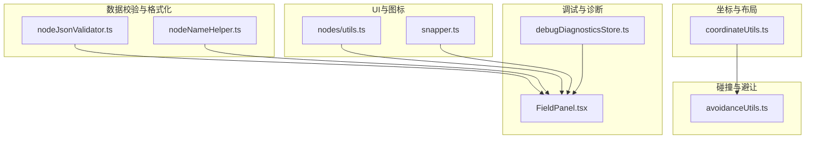
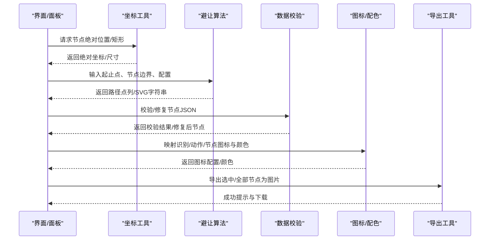
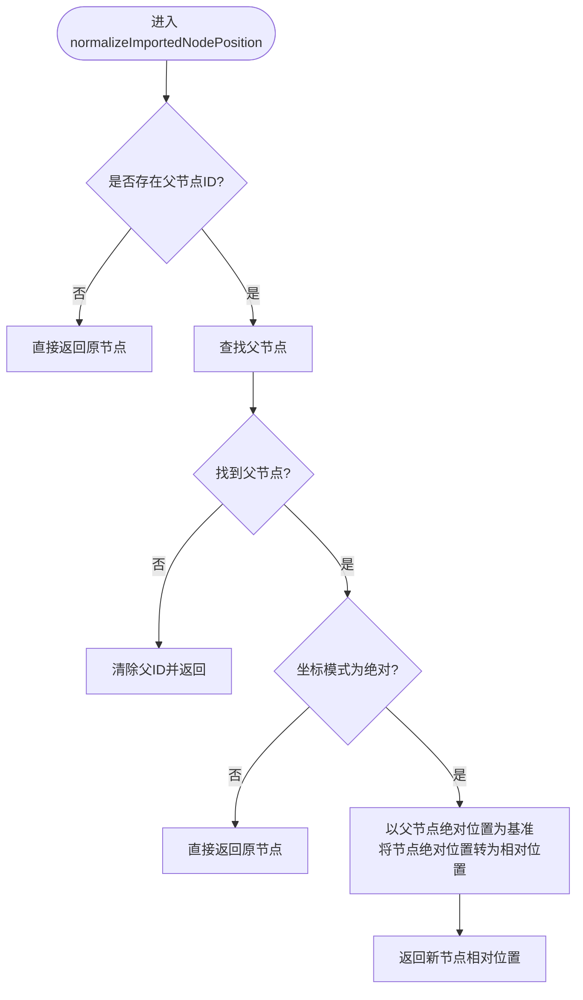
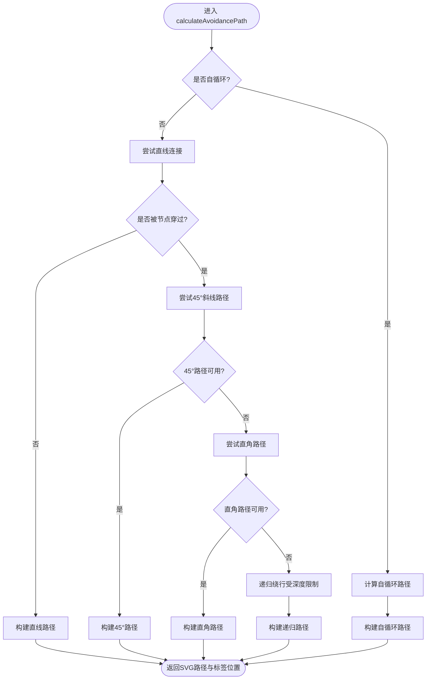
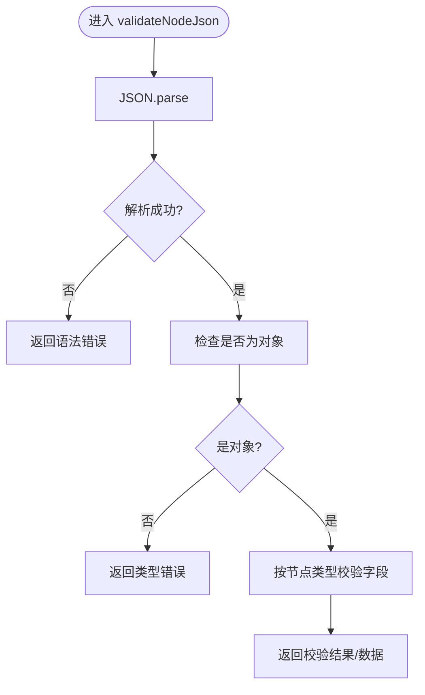
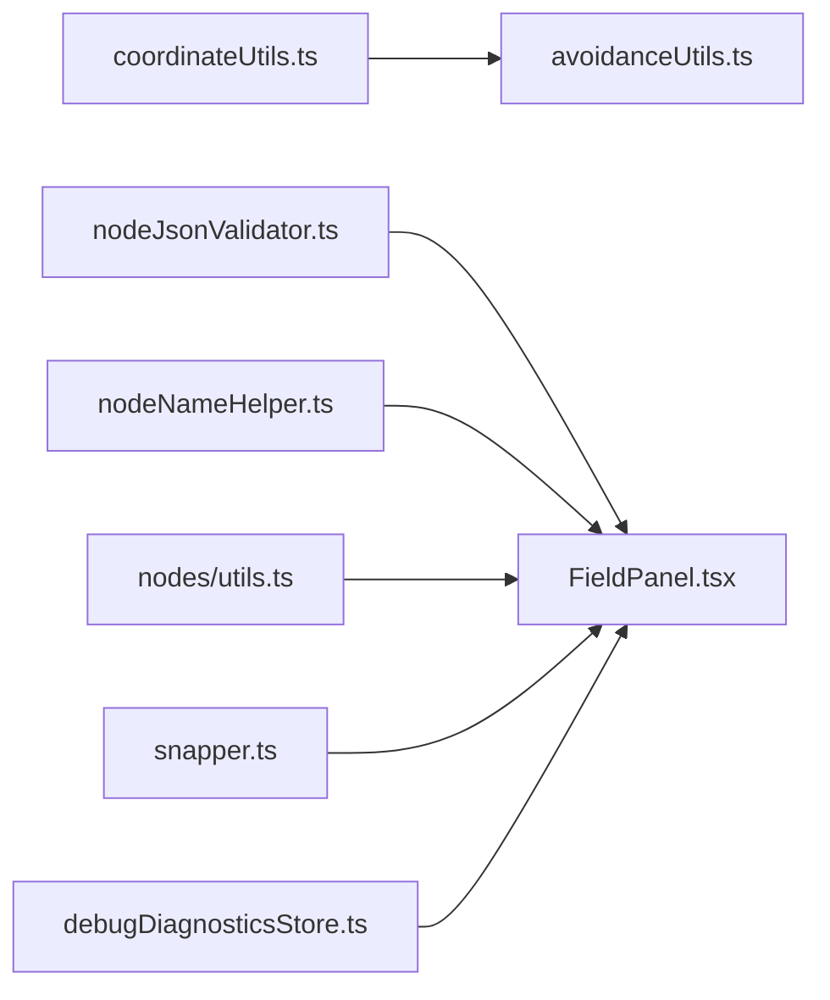

# 节点工具函数

<cite>
**本文档引用的文件**
- [coordinateUtils.ts](file://src/stores/flow/utils/coordinateUtils.ts)
- [avoidanceUtils.ts](file://src/core/avoidanceUtils.ts)
- [nodeJsonValidator.ts](file://src/utils/node/nodeJsonValidator.ts)
- [nodeNameHelper.ts](file://src/utils/node/nodeNameHelper.ts)
- [nodes/utils.ts](file://src/components/flow/nodes/utils.ts)
- [snapper.ts](file://src/utils/ui/snapper.ts)
- [FieldPanel.tsx](file://src/components/panels/main/FieldPanel.tsx)
- [debugDiagnosticsStore.ts](file://src/stores/debugDiagnosticsStore.ts)
</cite>

## 目录
1. [简介](#简介)
2. [项目结构](#项目结构)
3. [核心组件](#核心组件)
4. [架构总览](#架构总览)
5. [详细组件分析](#详细组件分析)
6. [依赖关系分析](#依赖关系分析)
7. [性能考虑](#性能考虑)
8. [故障排查指南](#故障排查指南)
9. [结论](#结论)
10. [附录](#附录)

## 简介
本文件系统性梳理节点工具函数的设计与实现，覆盖节点操作、坐标转换、碰撞检测、状态管理、数据验证与格式化、渲染优化与性能监控、调试辅助以及扩展与自定义开发指南。内容基于仓库中实际代码进行分析，并提供可视化图示帮助理解。

## 项目结构
围绕节点系统的工具函数主要分布于以下模块：
- 坐标与布局：坐标转换、绝对/相对定位、序列化与反序列化
- 碰撞与避让：线段与矩形相交、路径避让算法、自循环路径
- 数据校验与格式化：节点 JSON 校验、自动修复、格式化
- 名称与标识：节点前缀处理、标签提取
- 图标与配色：识别/动作/节点类型的图标映射、极简配色
- 渲染与导出：节点截图导出、视口适配
- 调试与诊断：诊断事件收集与展示

**图表来源**
- [coordinateUtils.ts:1-199](file://src/stores/flow/utils/coordinateUtils.ts#L1-L199)
- [avoidanceUtils.ts:1-780](file://src/core/avoidanceUtils.ts#L1-L780)
- [nodeJsonValidator.ts:1-368](file://src/utils/node/nodeJsonValidator.ts#L1-L368)
- [nodeNameHelper.ts:1-44](file://src/utils/node/nodeNameHelper.ts#L1-L44)
- [nodes/utils.ts:1-139](file://src/components/flow/nodes/utils.ts#L1-L139)
- [snapper.ts:1-87](file://src/utils/ui/snapper.ts#L1-L87)
- [FieldPanel.tsx:196-234](file://src/components/panels/main/FieldPanel.tsx#L196-L234)
- [debugDiagnosticsStore.ts:1-49](file://src/stores/debugDiagnosticsStore.ts#L1-L49)

**章节来源**
- [coordinateUtils.ts:1-199](file://src/stores/flow/utils/coordinateUtils.ts#L1-L199)
- [avoidanceUtils.ts:1-780](file://src/core/avoidanceUtils.ts#L1-L780)
- [nodeJsonValidator.ts:1-368](file://src/utils/node/nodeJsonValidator.ts#L1-L368)
- [nodeNameHelper.ts:1-44](file://src/utils/node/nodeNameHelper.ts#L1-L44)
- [nodes/utils.ts:1-139](file://src/components/flow/nodes/utils.ts#L1-L139)
- [snapper.ts:1-87](file://src/utils/ui/snapper.ts#L1-L87)
- [FieldPanel.tsx:196-234](file://src/components/panels/main/FieldPanel.tsx#L196-L234)
- [debugDiagnosticsStore.ts:1-49](file://src/stores/debugDiagnosticsStore.ts#L1-L49)

## 核心组件
- 坐标工具集：提供父子节点坐标换算、绝对/相对定位转换、节点绝对矩形计算、运行时绝对矩形获取、导入节点位置规范化、序列化位置等能力。
- 碰撞与避让：提供点/线段/矩形关系判断、路径避让算法（直线、45°斜线、直角、递归绕行）、自循环路径、SVG 路径构建与标签居中点计算。
- 数据校验与格式化：对节点 JSON 进行格式校验、按类型校验必填字段、自动修复缺失字段、格式化 JSON 字符串。
- 名称处理：统一节点标签与前缀拼接、去除前缀获取标签。
- 图标与配色：识别/动作/节点类型图标映射、极简节点颜色配置。
- 导出与渲染：将节点区域导出为 PNG 图片、计算视口与缩放。
- 调试与诊断：从调试事件构造诊断项、聚合与清空诊断记录。

**章节来源**
- [coordinateUtils.ts:1-199](file://src/stores/flow/utils/coordinateUtils.ts#L1-L199)
- [avoidanceUtils.ts:1-780](file://src/core/avoidanceUtils.ts#L1-L780)
- [nodeJsonValidator.ts:1-368](file://src/utils/node/nodeJsonValidator.ts#L1-L368)
- [nodeNameHelper.ts:1-44](file://src/utils/node/nodeNameHelper.ts#L1-L44)
- [nodes/utils.ts:1-139](file://src/components/flow/nodes/utils.ts#L1-L139)
- [snapper.ts:1-87](file://src/utils/ui/snapper.ts#L1-L87)
- [debugDiagnosticsStore.ts:1-49](file://src/stores/debugDiagnosticsStore.ts#L1-L49)

## 架构总览
节点工具函数围绕“坐标—碰撞—渲染—调试”主线协作：
- 坐标工具为避让算法提供节点绝对位置与尺寸
- 避让算法为边绘制提供路径点列与 SVG 字符串
- 数据校验与格式化保障节点数据一致性
- 图标与配色提升节点可读性
- 导出工具支持离线分析与分享
- 调试存储为问题定位提供上下文

**图表来源**
- [coordinateUtils.ts:85-144](file://src/stores/flow/utils/coordinateUtils.ts#L85-L144)
- [avoidanceUtils.ts:691-779](file://src/core/avoidanceUtils.ts#L691-L779)
- [nodeJsonValidator.ts:21-95](file://src/utils/node/nodeJsonValidator.ts#L21-L95)
- [nodes/utils.ts:14-139](file://src/components/flow/nodes/utils.ts#L14-L139)
- [snapper.ts:22-86](file://src/utils/ui/snapper.ts#L22-L86)

## 详细组件分析

### 坐标与位置工具
职责与能力：
- 父子链解析与绝对位置计算
- 绝对/相对坐标互转
- 节点绝对矩形与运行时绝对矩形获取
- 导入节点位置规范化
- 位置序列化

关键函数与行为：
- 解析父链与绝对位置：遍历父节点链累加位置，得到绝对坐标
- 绝对/相对互转：以父节点绝对位置为基准进行换算
- 绝对矩形：结合节点尺寸（优先测量/显式宽度/样式宽度/默认值）计算
- 运行时绝对矩形：优先从运行时实例获取，否则回退到静态计算
- 导入位置规范化：当坐标模式为绝对时，将节点位置转换为相对父节点
- 位置序列化：输出节点绝对位置

**图表来源**
- [coordinateUtils.ts:161-191](file://src/stores/flow/utils/coordinateUtils.ts#L161-L191)

**章节来源**
- [coordinateUtils.ts:1-199](file://src/stores/flow/utils/coordinateUtils.ts#L1-L199)

### 碰撞检测与避让算法
职责与能力：
- 点/线段/矩形关系判断
- 线段与矩形相交检测
- 路径避让：直线、45°斜线、直角、递归绕行
- 自循环路径：针对同源同目标边的特殊路径
- SVG 路径构建与标签居中点计算

算法要点：
- 快速排斥与跨立试验组合判断线段与矩形相交
- 多策略路径尝试（直线、45°、直角）与递归绕行
- 自循环路径依据 handle 位置与节点边界选择最优绕行方向
- 路径点列构建圆角路径，计算中点作为标签放置位置

**图表来源**
- [avoidanceUtils.ts:691-779](file://src/core/avoidanceUtils.ts#L691-L779)
- [avoidanceUtils.ts:380-577](file://src/core/avoidanceUtils.ts#L380-L577)
- [avoidanceUtils.ts:582-660](file://src/core/avoidanceUtils.ts#L582-L660)

**章节来源**
- [avoidanceUtils.ts:1-780](file://src/core/avoidanceUtils.ts#L1-L780)

### 数据验证与格式化工具
职责与能力：
- 节点 JSON 格式校验与对象类型检查
- 按节点类型校验必填字段与类型
- 对 Pipeline 节点自动修复缺失字段（识别/动作/others）
- 格式化 JSON 字符串（异常输入保持原样）

典型流程：
- 先解析 JSON，捕获语法错误
- 再检查对象类型与必填字段
- 对 Pipeline 节点补全默认值并返回修复后的节点
- 提供格式化函数，美化 JSON 输出

**图表来源**
- [nodeJsonValidator.ts:103-144](file://src/utils/node/nodeJsonValidator.ts#L103-L144)

**章节来源**
- [nodeJsonValidator.ts:1-368](file://src/utils/node/nodeJsonValidator.ts#L1-L368)

### 名称处理工具
职责与能力：
- 统一节点标签与前缀拼接
- 从完整节点名中移除前缀，还原标签

实现要点：
- 从文件配置中读取当前前缀，若不存在则直接返回
- 去除前缀时需匹配“前缀_”形式

**章节来源**
- [nodeNameHelper.ts:1-44](file://src/utils/node/nodeNameHelper.ts#L1-L44)

### 图标与配色工具
职责与能力：
- 识别类型 → 图标/大小映射
- 动作类型 → 图标/大小映射
- 节点类型 → 固定图标映射
- 识别类型 → 极简颜色（主色/背景色）

应用价值：
- 统一节点视觉语言，提升可读性
- 便于主题扩展与定制

**章节来源**
- [nodes/utils.ts:1-139](file://src/components/flow/nodes/utils.ts#L1-L139)

### 导出与渲染工具
职责与能力：
- 将选中或全部节点导出为 PNG 图片
- 计算节点边界、视口变换与缩放
- 支持下载与用户反馈

实现要点：
- 使用 html-to-image 将画布区域转为数据 URL
- 通过 @xyflow/react 计算节点边界与视口
- 统一背景色与尺寸，避免截取空白

**章节来源**
- [snapper.ts:1-87](file://src/utils/ui/snapper.ts#L1-L87)

### 调试与诊断工具
职责与能力：
- 从调试事件构造诊断项（严重级别、代码、消息、文件/节点/字段路径等）
- 聚合诊断列表、追加新诊断、清空诊断

与面板集成：
- 在字段面板中展示节点数据校验警告与修复提示

**章节来源**
- [debugDiagnosticsStore.ts:1-49](file://src/stores/debugDiagnosticsStore.ts#L1-L49)
- [FieldPanel.tsx:196-234](file://src/components/panels/main/FieldPanel.tsx#L196-L234)

## 依赖关系分析
- 坐标工具依赖节点类型定义与 React Flow 实例接口
- 避让算法依赖坐标工具提供的绝对位置与尺寸
- 数据校验依赖节点类型枚举与节点类型定义
- 导出工具依赖 @xyflow/react 与 html-to-image
- 调试存储独立，但与面板交互用于展示诊断

**图表来源**
- [coordinateUtils.ts:1-199](file://src/stores/flow/utils/coordinateUtils.ts#L1-L199)
- [avoidanceUtils.ts:1-780](file://src/core/avoidanceUtils.ts#L1-L780)
- [nodeJsonValidator.ts:1-368](file://src/utils/node/nodeJsonValidator.ts#L1-L368)
- [nodeNameHelper.ts:1-44](file://src/utils/node/nodeNameHelper.ts#L1-L44)
- [nodes/utils.ts:1-139](file://src/components/flow/nodes/utils.ts#L1-L139)
- [snapper.ts:1-87](file://src/utils/ui/snapper.ts#L1-L87)
- [FieldPanel.tsx:196-234](file://src/components/panels/main/FieldPanel.tsx#L196-L234)
- [debugDiagnosticsStore.ts:1-49](file://src/stores/debugDiagnosticsStore.ts#L1-L49)

**章节来源**
- [coordinateUtils.ts:1-199](file://src/stores/flow/utils/coordinateUtils.ts#L1-L199)
- [avoidanceUtils.ts:1-780](file://src/core/avoidanceUtils.ts#L1-L780)
- [nodeJsonValidator.ts:1-368](file://src/utils/node/nodeJsonValidator.ts#L1-L368)
- [nodeNameHelper.ts:1-44](file://src/utils/node/nodeNameHelper.ts#L1-L44)
- [nodes/utils.ts:1-139](file://src/components/flow/nodes/utils.ts#L1-L139)
- [snapper.ts:1-87](file://src/utils/ui/snapper.ts#L1-L87)
- [FieldPanel.tsx:196-234](file://src/components/panels/main/FieldPanel.tsx#L196-L234)
- [debugDiagnosticsStore.ts:1-49](file://src/stores/debugDiagnosticsStore.ts#L1-L49)

## 性能考虑
- 坐标计算：绝对位置计算沿父链累加，复杂度 O(h)，其中 h 为层级深度；建议控制节点层级，避免过深父链。
- 碰撞检测：线段与矩形相交采用快速排斥与跨立试验，整体复杂度较低；路径避让在递归深度受限下运行，避免无限展开。
- 导出渲染：图片导出涉及 DOM 截取与图像生成，建议在批量导出时合并请求并设置合理的尺寸上限。
- 数据校验：JSON 解析与字段检查为轻量操作，但在频繁编辑场景下应避免重复解析，可缓存中间结果。

[本节为通用性能讨论，无需特定文件引用]

## 故障排查指南
常见问题与定位：
- 节点数据损坏：使用数据校验工具查看错误信息，必要时使用修复功能；面板会提示修复警告。
- 坐标异常：检查父节点是否存在与坐标模式是否正确；确认导入时是否执行了位置规范化。
- 路径遮挡：调整避让配置（边距、圆角、递归深度、直连阈值）或手动移动节点以减少交叉。
- 导出失败：确认画布元素存在、节点边界有效、浏览器支持 html-to-image；检查网络与权限。
- 调试信息：通过调试诊断存储查看诊断列表，定位具体文件/节点/字段路径。

**章节来源**
- [FieldPanel.tsx:196-234](file://src/components/panels/main/FieldPanel.tsx#L196-L234)
- [debugDiagnosticsStore.ts:1-49](file://src/stores/debugDiagnosticsStore.ts#L1-L49)

## 结论
节点工具函数体系以“坐标—碰撞—渲染—调试”为主线，提供了从数据校验、坐标换算、路径避让到导出与诊断的完整能力。通过模块化的工具函数设计，既保证了核心算法的稳定性，也为扩展与自定义留出了空间。

## 附录

### 扩展与自定义开发指南
- 新增节点类型：在数据校验模块中增加对应类型的数据校验与修复逻辑；在图标/配色模块中补充类型映射。
- 自定义避让策略：在避让算法中新增策略分支，结合配置参数控制路径生成；注意维护递归深度与性能。
- 自定义坐标模式：在坐标工具中扩展坐标模式枚举与转换逻辑，确保导入/导出流程一致。
- 自定义导出行为：在导出工具中扩展参数（背景色、尺寸、质量），并提供批量导出接口。
- 调试增强：在调试存储中扩展诊断事件类型与字段，完善问题定位能力。

[本节为概念性指导，无需特定文件引用]