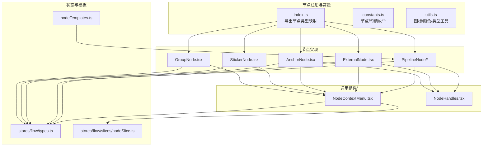
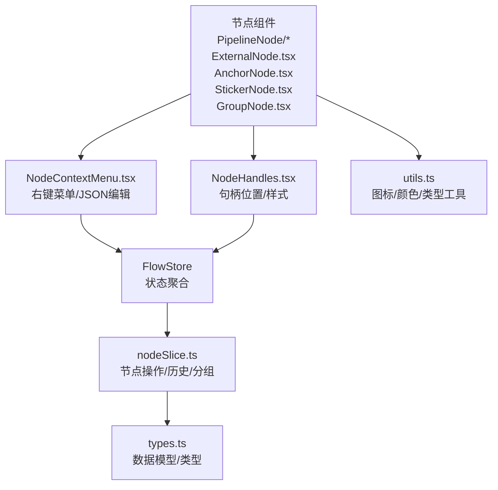
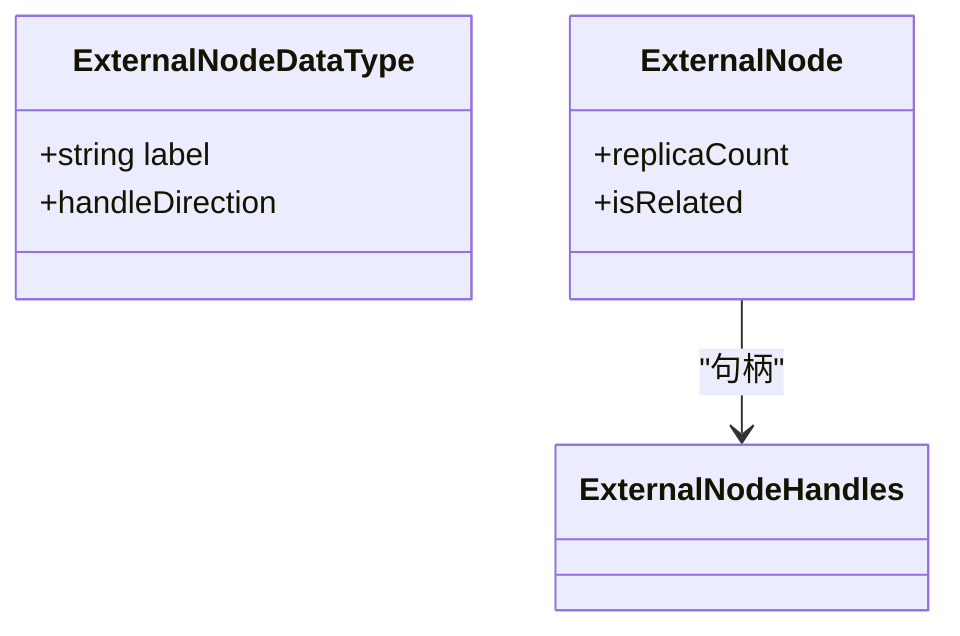
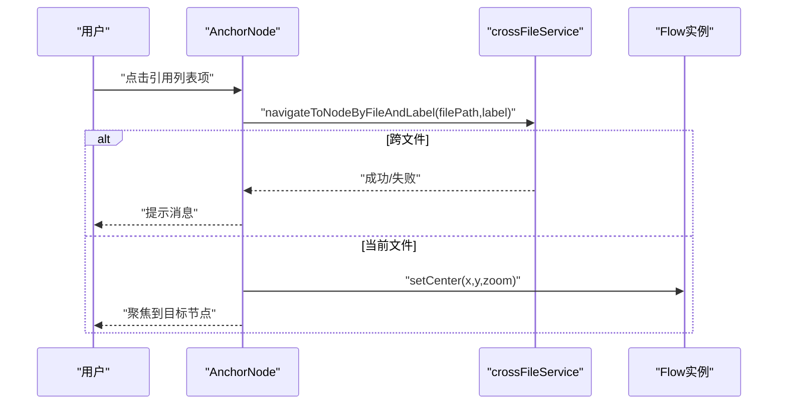
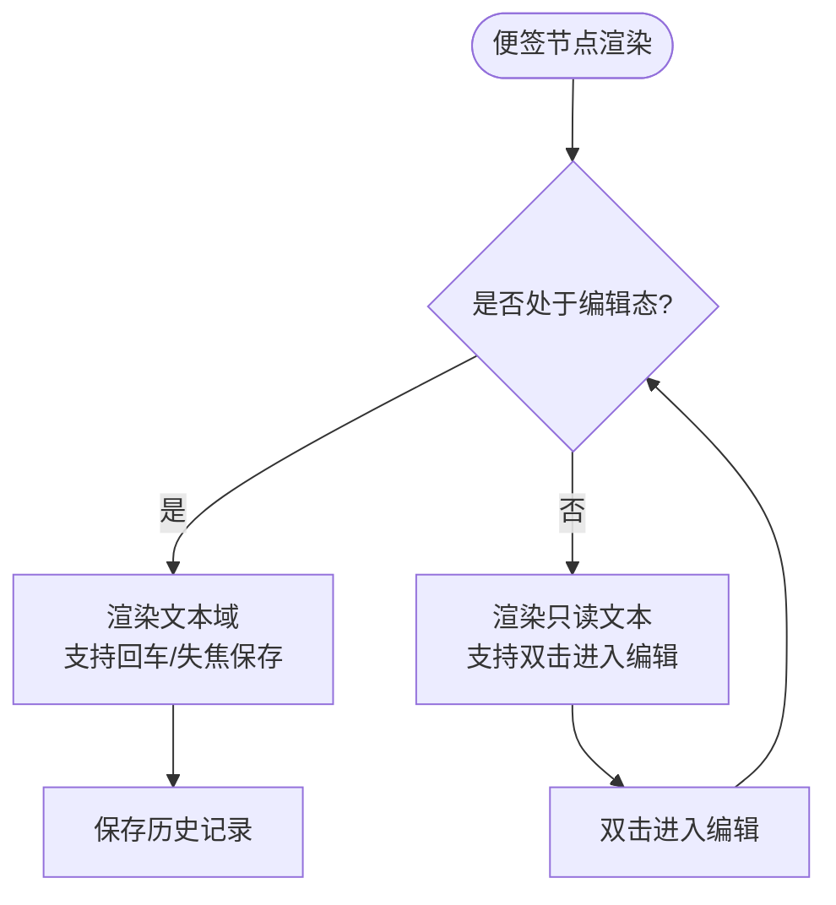
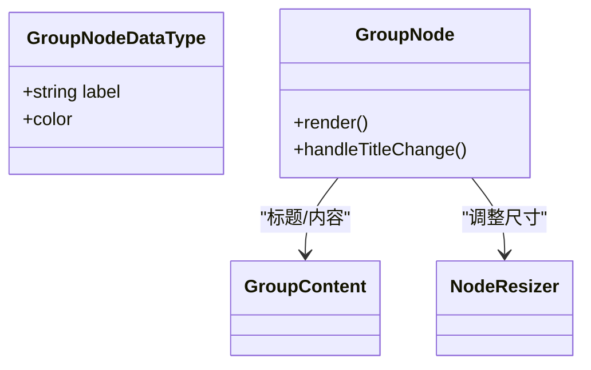
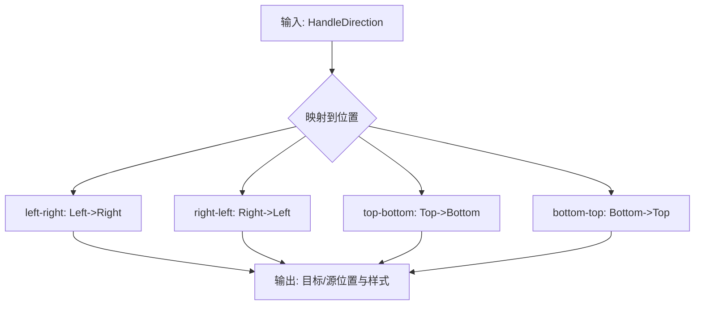
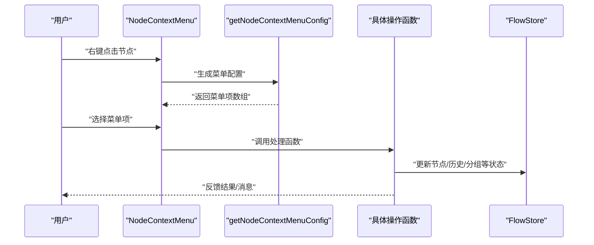
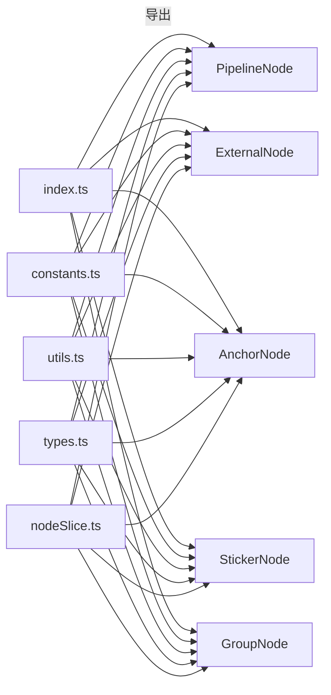

# 节点系统

<cite>
**本文档引用的文件**
- [src/components/flow/nodes/index.ts](file://src/components/flow/nodes/index.ts)
- [src/components/flow/nodes/constants.ts](file://src/components/flow/nodes/constants.ts)
- [src/components/flow/nodes/utils.ts](file://src/components/flow/nodes/utils.ts)
- [src/components/flow/nodes/nodeContextMenu.tsx](file://src/components/flow/nodes/nodeContextMenu.tsx)
- [src/components/flow/nodes/PipelineNode/index.tsx](file://src/components/flow/nodes/PipelineNode/index.tsx)
- [src/components/flow/nodes/PipelineNode/ClassicContent.tsx](file://src/components/flow/nodes/PipelineNode/ClassicContent.tsx)
- [src/components/flow/nodes/PipelineNode/ModernContent.tsx](file://src/components/flow/nodes/PipelineNode/ModernContent.tsx)
- [src/components/flow/nodes/PipelineNode/MinimalContent.tsx](file://src/components/flow/nodes/PipelineNode/MinimalContent.tsx)
- [src/components/flow/nodes/ExternalNode.tsx](file://src/components/flow/nodes/ExternalNode.tsx)
- [src/components/flow/nodes/AnchorNode.tsx](file://src/components/flow/nodes/AnchorNode.tsx)
- [src/components/flow/nodes/StickerNode.tsx](file://src/components/flow/nodes/StickerNode.tsx)
- [src/components/flow/nodes/GroupNode.tsx](file://src/components/flow/nodes/GroupNode.tsx)
- [src/components/flow/nodes/components/NodeContextMenu.tsx](file://src/components/flow/nodes/components/NodeContextMenu.tsx)
- [src/components/flow/nodes/components/NodeHandles.tsx](file://src/components/flow/nodes/components/NodeHandles.tsx)
- [src/stores/flow/types.ts](file://src/stores/flow/types.ts)
- [src/stores/flow/slices/nodeSlice.ts](file://src/stores/flow/slices/nodeSlice.ts)
- [src/data/nodeTemplates.ts](file://src/data/nodeTemplates.ts)
</cite>

## 目录
1. [简介](#简介)
2. [项目结构](#项目结构)
3. [核心组件](#核心组件)
4. [架构总览](#架构总览)
5. [详细组件分析](#详细组件分析)
6. [依赖分析](#依赖分析)
7. [性能考虑](#性能考虑)
8. [故障排除指南](#故障排除指南)
9. [结论](#结论)
10. [附录](#附录)

## 简介
本文件系统性梳理了节点系统的实现，覆盖 PipelineNode、ExternalNode、AnchorNode、StickerNode、GroupNode 等节点类型的数据结构、属性定义、渲染逻辑与交互行为；阐述拖拽、选择、编辑、调试、模板与预设配置等能力；分析节点生命周期管理与状态同步机制；并提供扩展与自定义节点的方法。

## 项目结构
节点系统位于前端模块 src/components/flow/nodes 下，采用“按类型分目录”的组织方式，结合 store 层的状态管理与 UI 组件解耦设计：
- 节点注册与常量：index.ts、constants.ts、utils.ts
- 节点实现：各节点类型独立目录，如 PipelineNode/
- 通用组件：NodeContextMenu、NodeHandles
- 状态模型：stores/flow/types.ts
- 节点操作：stores/flow/slices/nodeSlice.ts
- 模板与预设：src/data/nodeTemplates.ts



图表来源
- [src/components/flow/nodes/index.ts:1-26](file://src/components/flow/nodes/index.ts#L1-L26)
- [src/components/flow/nodes/constants.ts:1-47](file://src/components/flow/nodes/constants.ts#L1-L47)
- [src/components/flow/nodes/utils.ts:1-139](file://src/components/flow/nodes/utils.ts#L1-L139)
- [src/components/flow/nodes/PipelineNode/index.tsx:1-310](file://src/components/flow/nodes/PipelineNode/index.tsx#L1-L310)
- [src/components/flow/nodes/ExternalNode.tsx:1-203](file://src/components/flow/nodes/ExternalNode.tsx#L1-L203)
- [src/components/flow/nodes/AnchorNode.tsx:1-371](file://src/components/flow/nodes/AnchorNode.tsx#L1-L371)
- [src/components/flow/nodes/StickerNode.tsx:1-243](file://src/components/flow/nodes/StickerNode.tsx#L1-L243)
- [src/components/flow/nodes/GroupNode.tsx:1-178](file://src/components/flow/nodes/GroupNode.tsx#L1-L178)
- [src/components/flow/nodes/components/NodeContextMenu.tsx:1-260](file://src/components/flow/nodes/components/NodeContextMenu.tsx#L1-L260)
- [src/components/flow/nodes/components/NodeHandles.tsx:1-277](file://src/components/flow/nodes/components/NodeHandles.tsx#L1-L277)
- [src/stores/flow/types.ts:1-439](file://src/stores/flow/types.ts#L1-L439)
- [src/stores/flow/slices/nodeSlice.ts:1-718](file://src/stores/flow/slices/nodeSlice.ts#L1-L718)
- [src/data/nodeTemplates.ts:1-108](file://src/data/nodeTemplates.ts#L1-L108)

章节来源
- [src/components/flow/nodes/index.ts:1-26](file://src/components/flow/nodes/index.ts#L1-L26)
- [src/components/flow/nodes/constants.ts:1-47](file://src/components/flow/nodes/constants.ts#L1-L47)

## 核心组件
- 节点类型与句柄方向：通过 NodeTypeEnum、SourceHandleTypeEnum、TargetHandleTypeEnum、HandleDirection 等统一定义，确保跨节点一致的连接语义。
- 节点渲染策略：PipelineNode 支持 classic/modern/minimal 三种风格，其余节点采用简洁布局。
- 通用交互：NodeContextMenu 提供右键菜单与 JSON 编辑器；NodeHandles 抽象句柄位置与样式。
- 状态模型：FlowStore 将节点、边、选择、历史、路径、探索等状态聚合管理。
- 模板与预设：nodeTemplates.ts 提供常用节点模板，便于快速创建。

章节来源
- [src/components/flow/nodes/constants.ts:1-47](file://src/components/flow/nodes/constants.ts#L1-L47)
- [src/components/flow/nodes/utils.ts:1-139](file://src/components/flow/nodes/utils.ts#L1-L139)
- [src/stores/flow/types.ts:1-439](file://src/stores/flow/types.ts#L1-L439)
- [src/data/nodeTemplates.ts:1-108](file://src/data/nodeTemplates.ts#L1-L108)

## 架构总览
节点系统遵循“组件-状态-工具”三层架构：
- 组件层：各节点组件负责渲染与交互；通用组件封装上下文菜单与句柄。
- 状态层：FlowStore 管理节点、边、选择、历史、路径、探索等状态；nodeSlice 提供增删改、分组、历史快照等操作。
- 工具层：constants、utils 提供类型与图标/颜色映射；nodeUtils 提供节点创建、位置计算等。



图表来源
- [src/components/flow/nodes/PipelineNode/index.tsx:1-310](file://src/components/flow/nodes/PipelineNode/index.tsx#L1-L310)
- [src/components/flow/nodes/ExternalNode.tsx:1-203](file://src/components/flow/nodes/ExternalNode.tsx#L1-L203)
- [src/components/flow/nodes/AnchorNode.tsx:1-371](file://src/components/flow/nodes/AnchorNode.tsx#L1-L371)
- [src/components/flow/nodes/StickerNode.tsx:1-243](file://src/components/flow/nodes/StickerNode.tsx#L1-L243)
- [src/components/flow/nodes/GroupNode.tsx:1-178](file://src/components/flow/nodes/GroupNode.tsx#L1-L178)
- [src/components/flow/nodes/components/NodeContextMenu.tsx:1-260](file://src/components/flow/nodes/components/NodeContextMenu.tsx#L1-L260)
- [src/components/flow/nodes/components/NodeHandles.tsx:1-277](file://src/components/flow/nodes/components/NodeHandles.tsx#L1-L277)
- [src/stores/flow/types.ts:1-439](file://src/stores/flow/types.ts#L1-L439)
- [src/stores/flow/slices/nodeSlice.ts:1-718](file://src/stores/flow/slices/nodeSlice.ts#L1-L718)
- [src/components/flow/nodes/utils.ts:1-139](file://src/components/flow/nodes/utils.ts#L1-L139)

## 详细组件分析

### PipelineNode（管道节点）
- 数据结构：PipelineNodeDataType 包含 label、recognition/action/others/extras、handleDirection 等字段。
- 渲染策略：根据配置切换 classic/modern/minimal 三种内容组件；classic 显示 KV 列表与流向标签；modern 增加图标与模板图展示；minimal 仅展示识别图标与颜色。
- 交互与样式：支持 Ghost Node 探索模式下的执行/重新生成/确认按钮；焦点模式下通过透明度控制相关节点高亮；支持 Anchor 引用高亮与调试高亮。
- 句柄：PipelineNodeHandles 根据 handleDirection 计算目标/源句柄位置与垂直/水平样式。

```mermaid
classDiagram
class PipelineNodeDataType {
+string label
+recognition : {type,param}
+action : {type,param}
+others
+extras
+handleDirection
}
class PipelineNode {
+renderContent()
+handleConfirm()
+handleRegenerate()
}
class ClassicContent
class ModernContent
class MinimalContent
class PipelineNodeHandles
PipelineNode --> ClassicContent : "classic"
PipelineNode --> ModernContent : "modern"
PipelineNode --> MinimalContent : "minimal"
PipelineNode --> PipelineNodeHandles : "句柄"
```

图表来源
- [src/components/flow/nodes/PipelineNode/index.tsx:1-310](file://src/components/flow/nodes/PipelineNode/index.tsx#L1-L310)
- [src/components/flow/nodes/PipelineNode/ClassicContent.tsx:1-169](file://src/components/flow/nodes/PipelineNode/ClassicContent.tsx#L1-L169)
- [src/components/flow/nodes/PipelineNode/ModernContent.tsx:1-331](file://src/components/flow/nodes/PipelineNode/ModernContent.tsx#L1-L331)
- [src/components/flow/nodes/PipelineNode/MinimalContent.tsx:1-58](file://src/components/flow/nodes/PipelineNode/MinimalContent.tsx#L1-L58)
- [src/stores/flow/types.ts:109-124](file://src/stores/flow/types.ts#L109-L124)
- [src/components/flow/nodes/components/NodeHandles.tsx:62-156](file://src/components/flow/nodes/components/NodeHandles.tsx#L62-L156)

章节来源
- [src/components/flow/nodes/PipelineNode/index.tsx:1-310](file://src/components/flow/nodes/PipelineNode/index.tsx#L1-L310)
- [src/components/flow/nodes/PipelineNode/ClassicContent.tsx:1-169](file://src/components/flow/nodes/PipelineNode/ClassicContent.tsx#L1-L169)
- [src/components/flow/nodes/PipelineNode/ModernContent.tsx:1-331](file://src/components/flow/nodes/PipelineNode/ModernContent.tsx#L1-L331)
- [src/components/flow/nodes/PipelineNode/MinimalContent.tsx:1-58](file://src/components/flow/nodes/PipelineNode/MinimalContent.tsx#L1-L58)
- [src/stores/flow/types.ts:109-124](file://src/stores/flow/types.ts#L109-L124)

### ExternalNode（外部节点）
- 数据结构：ExternalNodeDataType 包含 label 与 handleDirection。
- 渲染：标题显示 label，并统计同名 External 节点副本数量；句柄由 ExternalNodeHandles 根据方向渲染。
- 关联判断：基于焦点透明度、路径模式、选中边/节点、分组父子关系等计算“相关性”，决定透明度。



图表来源
- [src/components/flow/nodes/ExternalNode.tsx:1-203](file://src/components/flow/nodes/ExternalNode.tsx#L1-L203)
- [src/stores/flow/types.ts:126-130](file://src/stores/flow/types.ts#L126-L130)
- [src/components/flow/nodes/components/NodeHandles.tsx:164-214](file://src/components/flow/nodes/components/NodeHandles.tsx#L164-L214)

章节来源
- [src/components/flow/nodes/ExternalNode.tsx:1-203](file://src/components/flow/nodes/ExternalNode.tsx#L1-L203)
- [src/stores/flow/types.ts:126-130](file://src/stores/flow/types.ts#L126-L130)

### AnchorNode（锚点/重定向节点）
- 数据结构：AnchorNodeDataType 包含 label 与 handleDirection。
- 渲染：标题显示 label；支持“引用此锚点的节点”弹出列表，支持跨文件导航；句柄由 AnchorNodeHandles 根据方向渲染。
- 导航：通过 crossFileService 实现跨文件定位节点，支持当前文件内与跨文件两种跳转场景。



图表来源
- [src/components/flow/nodes/AnchorNode.tsx:198-240](file://src/components/flow/nodes/AnchorNode.tsx#L198-L240)
- [src/components/flow/nodes/AnchorNode.tsx:180-195](file://src/components/flow/nodes/AnchorNode.tsx#L180-L195)

章节来源
- [src/components/flow/nodes/AnchorNode.tsx:1-371](file://src/components/flow/nodes/AnchorNode.tsx#L1-L371)
- [src/stores/flow/types.ts:132-136](file://src/stores/flow/types.ts#L132-L136)

### StickerNode（便签节点）
- 数据结构：StickerNodeDataType 包含 label、content、color（主题）。
- 渲染：可调整大小的便签容器，支持双击编辑内容与标题；支持多种颜色主题；始终不受焦点透明度影响。
- 交互：NodeResizer 控制尺寸；右键菜单支持复制便签内容与颜色主题切换。



图表来源
- [src/components/flow/nodes/StickerNode.tsx:56-165](file://src/components/flow/nodes/StickerNode.tsx#L56-L165)
- [src/components/flow/nodes/StickerNode.tsx:168-219](file://src/components/flow/nodes/StickerNode.tsx#L168-L219)

章节来源
- [src/components/flow/nodes/StickerNode.tsx:1-243](file://src/components/flow/nodes/StickerNode.tsx#L1-L243)
- [src/stores/flow/types.ts:141-146](file://src/stores/flow/types.ts#L141-L146)

### GroupNode（分组节点）
- 数据结构：GroupNodeDataType 包含 label、color（主题）。
- 渲染：可调整大小的分组容器，支持标题编辑；子节点渲染在其内部；始终不受焦点透明度影响。
- 交互：NodeResizer 控制尺寸；右键菜单支持解散分组与颜色主题切换。



图表来源
- [src/components/flow/nodes/GroupNode.tsx:51-107](file://src/components/flow/nodes/GroupNode.tsx#L51-L107)
- [src/components/flow/nodes/GroupNode.tsx:110-157](file://src/components/flow/nodes/GroupNode.tsx#L110-L157)

章节来源
- [src/components/flow/nodes/GroupNode.tsx:1-178](file://src/components/flow/nodes/GroupNode.tsx#L1-L178)
- [src/stores/flow/types.ts:151-155](file://src/stores/flow/types.ts#L151-L155)

### 句柄系统（NodeHandles）
- 功能：根据 HandleDirection 返回目标/源句柄位置（左/右/上/下），并应用垂直/水平样式。
- 适用：PipelineNodeHandles、ExternalNodeHandles、AnchorNodeHandles 三类句柄组件复用同一逻辑。



图表来源
- [src/components/flow/nodes/components/NodeHandles.tsx:15-53](file://src/components/flow/nodes/components/NodeHandles.tsx#L15-L53)
- [src/components/flow/nodes/components/NodeHandles.tsx:62-156](file://src/components/flow/nodes/components/NodeHandles.tsx#L62-L156)

章节来源
- [src/components/flow/nodes/components/NodeHandles.tsx:1-277](file://src/components/flow/nodes/components/NodeHandles.tsx#L1-L277)
- [src/components/flow/nodes/constants.ts:28-46](file://src/components/flow/nodes/constants.ts#L28-L46)

### 右键菜单系统（NodeContextMenu）
- 功能：统一生成节点右键菜单，支持调试运行、复制节点名/Reco JSON、保存为模板、端点位置设置、颜色主题切换、删除等。
- 事件：监听全局“编辑 JSON”事件，触发对应节点的 JSON 编辑器弹窗。
- 调试：根据 LocalBridge 能力动态请求调试能力清单，支持多种运行模式与资源预检。



图表来源
- [src/components/flow/nodes/components/NodeContextMenu.tsx:109-236](file://src/components/flow/nodes/components/NodeContextMenu.tsx#L109-L236)
- [src/components/flow/nodes/nodeContextMenu.tsx:467-700](file://src/components/flow/nodes/nodeContextMenu.tsx#L467-L700)

章节来源
- [src/components/flow/nodes/components/NodeContextMenu.tsx:1-260](file://src/components/flow/nodes/components/NodeContextMenu.tsx#L1-L260)
- [src/components/flow/nodes/nodeContextMenu.tsx:1-701](file://src/components/flow/nodes/nodeContextMenu.tsx#L1-L701)

## 依赖分析
- 节点注册：index.ts 将各节点类型映射到 NodeTypeEnum，供 Flow 容器使用。
- 常量与工具：constants.ts 定义枚举；utils.ts 提供图标与颜色映射。
- 状态依赖：各节点组件依赖 FlowStore 的选择、历史、路径、探索等状态；nodeSlice 提供节点增删改、分组、历史快照等操作。
- 交互依赖：NodeContextMenu 依赖调试能力状态与 WebSocket 连接状态，动态请求能力清单。



图表来源
- [src/components/flow/nodes/index.ts:8-14](file://src/components/flow/nodes/index.ts#L8-L14)
- [src/components/flow/nodes/constants.ts:14-20](file://src/components/flow/nodes/constants.ts#L14-L20)
- [src/components/flow/nodes/utils.ts:91-102](file://src/components/flow/nodes/utils.ts#L91-L102)
- [src/stores/flow/types.ts:109-155](file://src/stores/flow/types.ts#L109-L155)
- [src/stores/flow/slices/nodeSlice.ts:139-308](file://src/stores/flow/slices/nodeSlice.ts#L139-L308)

章节来源
- [src/components/flow/nodes/index.ts:1-26](file://src/components/flow/nodes/index.ts#L1-L26)
- [src/stores/flow/slices/nodeSlice.ts:1-718](file://src/stores/flow/slices/nodeSlice.ts#L1-L718)

## 性能考虑
- 渲染优化：节点组件普遍使用 memo 与 useMemo，减少不必要的重渲染；PipelineNode 根据配置切换渲染内容，避免冗余字段渲染。
- 句柄更新：NodeHandles 在方向变更时多次触发 updateNodeInternals，确保句柄位置正确，但应避免频繁切换方向导致的多次更新。
- 选择与聚焦：isRelated 计算逻辑考虑多种场景，建议在大量节点时尽量减少不必要的边/节点遍历。
- 模板与图片：ModernContent 的模板图片渲染需注意大图加载与缓存策略，避免阻塞渲染。

## 故障排除指南
- 右键菜单不可用或调试能力缺失
  - 检查 LocalBridge 连接状态与调试能力请求是否成功。
  - 若未请求能力，可在打开菜单时触发能力请求。
- 节点删除后选中状态异常
  - nodeSlice.updateNodes 会清理被删除节点的选中状态与 targetNode，确认是否正确触发。
- 分组解散后子节点位置异常
  - ungroupNodes 会将子节点绝对坐标转换为新的绝对坐标并清除 parentId，确认 FlowStore 中 nodes 是否更新。
- 便签/分组编辑保存未生效
  - setNodeData 与 batchSetNodeData 会深拷贝节点数据并更新 targetNode，确认回调是否触发 saveHistory。

章节来源
- [src/components/flow/nodes/components/NodeContextMenu.tsx:88-106](file://src/components/flow/nodes/components/NodeContextMenu.tsx#L88-L106)
- [src/stores/flow/slices/nodeSlice.ts:44-136](file://src/stores/flow/slices/nodeSlice.ts#L44-L136)
- [src/stores/flow/slices/nodeSlice.ts:626-661](file://src/stores/flow/slices/nodeSlice.ts#L626-L661)
- [src/stores/flow/slices/nodeSlice.ts:310-414](file://src/stores/flow/slices/nodeSlice.ts#L310-L414)

## 结论
节点系统通过清晰的类型定义、可插拔的渲染策略、完善的交互与状态管理，实现了对 Pipeline/External/Anchor/Sticker/Group 五类节点的统一支持。借助模板与预设、右键菜单与调试集成、以及分组与历史管理，系统在易用性与扩展性方面表现良好。后续可通过新增节点类型、扩展模板库与优化渲染性能进一步增强。

## 附录

### 节点数据结构速览
- PipelineNodeDataType：识别/动作/其他参数、扩展字段、句柄方向
- ExternalNodeDataType：标签、句柄方向
- AnchorNodeDataType：标签、句柄方向
- StickerNodeDataType：标题、内容、颜色主题
- GroupNodeDataType：标题、颜色主题

章节来源
- [src/stores/flow/types.ts:109-155](file://src/stores/flow/types.ts#L109-L155)

### 节点模板与预设
- nodeTemplates.ts 提供常用节点模板，包括空节点、外部节点、锚点、便签、分组、文字识别、图像识别、无延迟节点、直接点击、Custom 等，支持自定义模板与时间戳。

章节来源
- [src/data/nodeTemplates.ts:1-108](file://src/data/nodeTemplates.ts#L1-L108)