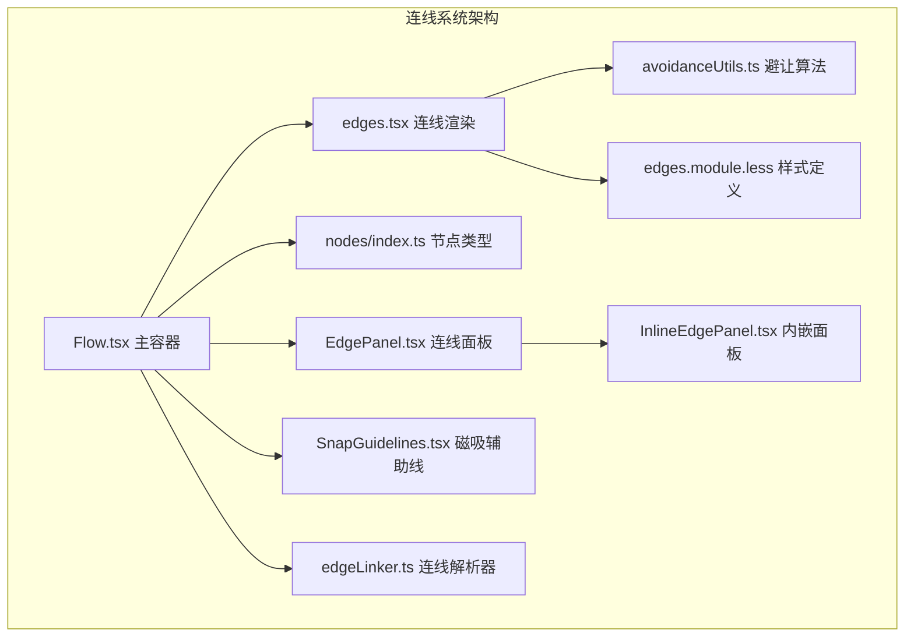
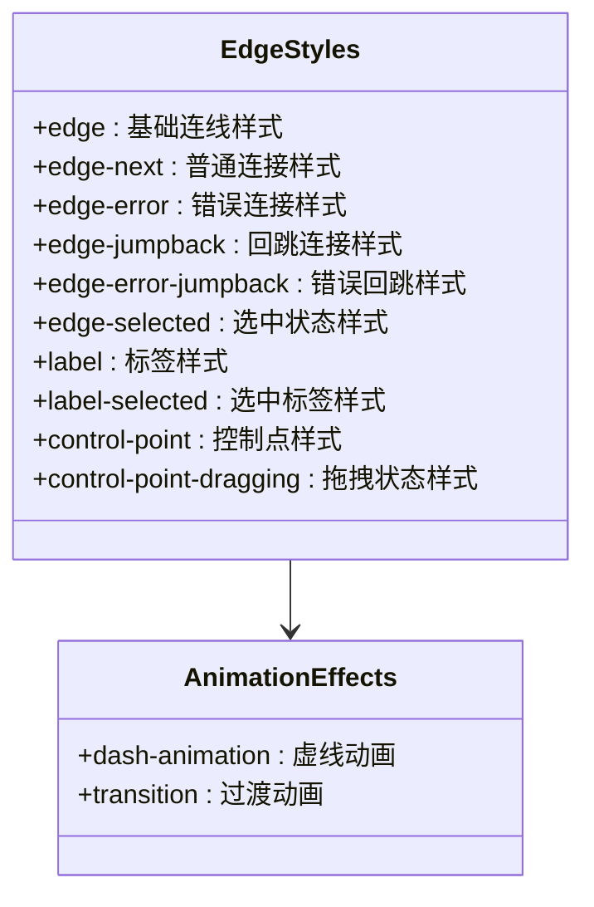
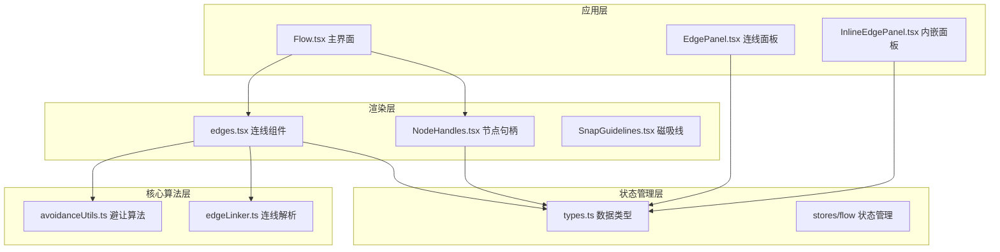
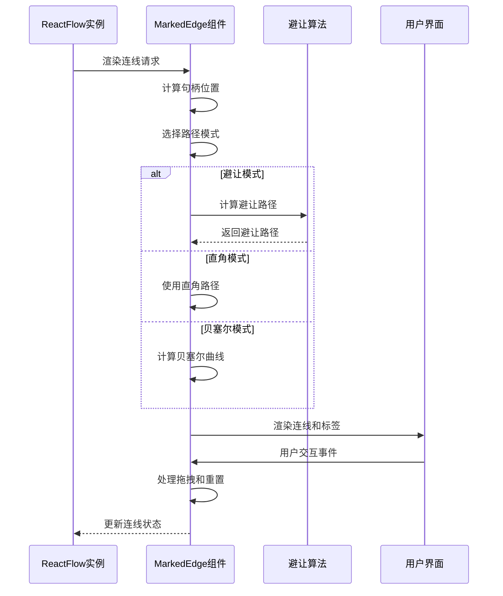
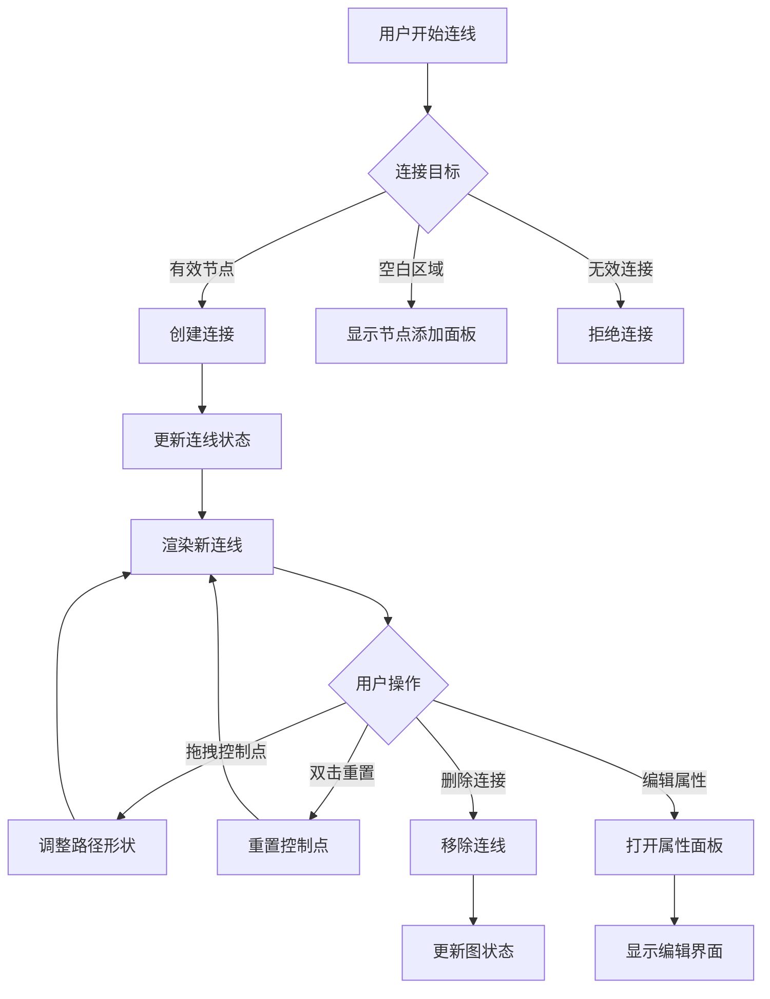
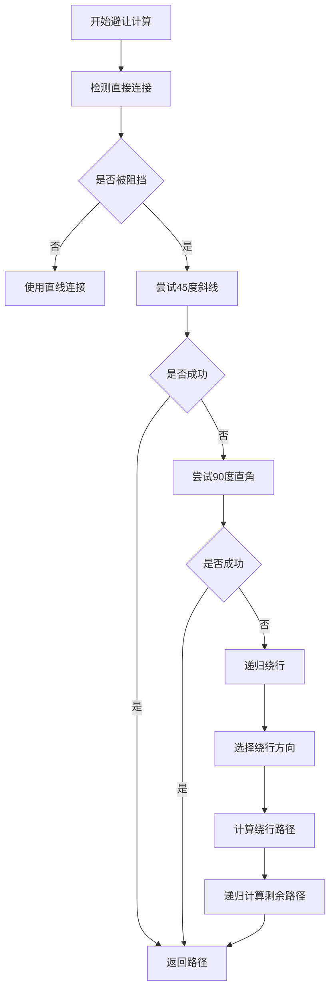
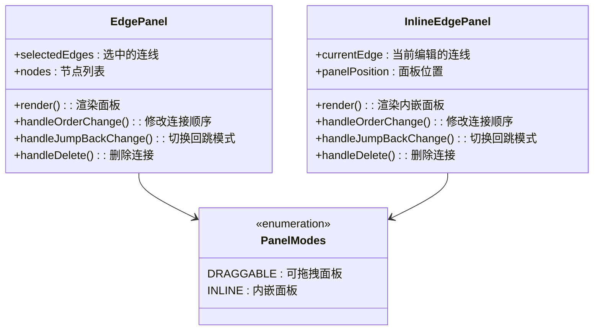
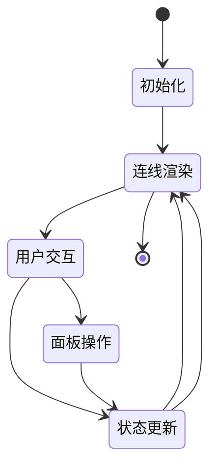

# 连线系统

<cite>
**本文档引用的文件**
- [edges.tsx](file://src/components/flow/edges.tsx)
- [Flow.tsx](file://src/components/Flow.tsx)
- [edgeLinker.ts](file://src/core/parser/edgeLinker.ts)
- [nodes/index.ts](file://src/components/flow/nodes/index.ts)
- [nodes/constants.ts](file://src/components/flow/nodes/constants.ts)
- [nodes/components/NodeHandles.tsx](file://src/components/flow/nodes/components/NodeHandles.tsx)
- [avoidanceUtils.ts](file://src/core/avoidanceUtils.ts)
- [types.ts](file://src/stores/flow/types.ts)
- [edges.module.less](file://src/styles/flow/edges.module.less)
- [EdgePanel.tsx](file://src/components/panels/main/EdgePanel.tsx)
- [InlineEdgePanel.tsx](file://src/components/panels/main/InlineEdgePanel.tsx)
- [SnapGuidelines.tsx](file://src/components/flow/SnapGuidelines.tsx)
</cite>

## 目录
1. [简介](#简介)
2. [项目结构](#项目结构)
3. [核心组件](#核心组件)
4. [架构概览](#架构概览)
5. [详细组件分析](#详细组件分析)
6. [依赖分析](#依赖分析)
7. [性能考虑](#性能考虑)
8. [故障排除指南](#故障排除指南)
9. [结论](#结论)

## 简介

连线系统是 MAA Pipeline Editor 的核心功能模块，负责管理节点间的连接关系、提供可视化连线渲染以及实现复杂的连线交互功能。该系统基于 React Flow 构建，提供了多种连线类型、智能避让算法和丰富的交互体验。

系统主要包含以下核心功能：
- 多种连线类型支持（普通连接、错误连接、回跳连接）
- 智能避让路径算法，避免连线与其他节点发生冲突
- 可拖拽的贝塞尔曲线控制点，支持手动调整连线路径
- 实时连线标签渲染和视觉反馈
- 完整的连线编辑面板，支持连接属性配置

## 项目结构

连线系统采用模块化设计，主要由以下几个核心部分组成：



**图表来源**
- [Flow.tsx:648-695](file://src/components/Flow.tsx#L648-L695)
- [edges.tsx:673-676](file://src/components/flow/edges.tsx#L673-L676)

**章节来源**
- [Flow.tsx:1-709](file://src/components/Flow.tsx#L1-L709)
- [edges.tsx:1-676](file://src/components/flow/edges.tsx#L1-L676)

## 核心组件

### 连线类型定义

系统支持多种连线类型，每种类型都有特定的视觉表现和行为特征：

| 连线类型 | 源句柄类型 | 目标句柄类型 | 视觉特征 | 用途 |
|---------|-----------|-------------|----------|------|
| 普通连接 | Next | Target | 绿色虚线 | 正常执行流程 |
| 错误连接 | Error | Target | 红色虚线 | 错误处理流程 |
| 回跳连接 | Next | JumpBack | 橙色实线 | 直接跳转到前一节点 |
| 错误回跳 | Error | JumpBack | 紫色实线 | 错误时跳转到前一节点 |

### 连线样式系统

连线样式通过 CSS Modules 实现，支持动态样式切换和状态反馈：



**图表来源**
- [edges.module.less:1-98](file://src/styles/flow/edges.module.less#L1-L98)

**章节来源**
- [edges.module.less:1-98](file://src/styles/flow/edges.module.less#L1-L98)
- [nodes/constants.ts:1-47](file://src/components/flow/nodes/constants.ts#L1-L47)

## 架构概览

连线系统采用分层架构设计，各层职责明确，耦合度低：



**图表来源**
- [Flow.tsx:648-695](file://src/components/Flow.tsx#L648-L695)
- [edges.tsx:311-671](file://src/components/flow/edges.tsx#L311-L671)

## 详细组件分析

### 连线渲染引擎

MarkedEdge 组件是连线系统的核心渲染组件，负责处理所有连线的绘制和交互：



**图表来源**
- [edges.tsx:311-671](file://src/components/flow/edges.tsx#L311-L671)

#### 路径计算算法

系统实现了三种不同的路径计算模式：

1. **避让模式**：使用复杂的避让算法，自动避开其他节点
2. **直角模式**：使用直角阶梯路径，适合简单布局
3. **贝塞尔模式**：支持可拖拽的贝塞尔曲线控制点

**章节来源**
- [edges.tsx:38-458](file://src/components/flow/edges.tsx#L38-L458)

### 连线交互系统

连线系统提供了丰富的交互功能：



**图表来源**
- [Flow.tsx:346-418](file://src/components/Flow.tsx#L346-L418)
- [edges.tsx:460-518](file://src/components/flow/edges.tsx#L460-L518)

#### 控制点拖拽机制

贝塞尔模式下的控制点拖拽功能提供了精细的路径调整能力：

- **拖拽开始**：记录初始位置和偏移量
- **拖拽移动**：实时计算屏幕坐标到画布坐标的转换
- **拖拽结束**：更新控制点偏移量
- **双击重置**：一键恢复默认路径

**章节来源**
- [edges.tsx:460-518](file://src/components/flow/edges.tsx#L460-L518)

### 连线解析器

edgeLinker 模块负责将文本格式的连接描述转换为实际的连线对象：

```mermaid
flowchart LR
A[输入: "NodeName"] --> B[解析节点引用]
B --> C{是否包含前缀}
C --> |是| D[提取属性]
C --> |否| E[直接使用节点名]
D --> F[创建外部节点]
E --> G[查找现有节点]
F --> H[创建连接]
G --> H
H --> I[设置连接属性]
I --> J[返回连线对象]
```

**图表来源**
- [edgeLinker.ts:47-81](file://src/core/parser/edgeLinker.ts#L47-L81)

**章节来源**
- [edgeLinker.ts:1-162](file://src/core/parser/edgeLinker.ts#L1-L162)

### 避让算法详解

避让算法是连线系统的核心技术，能够智能地避开其他节点：



**图表来源**
- [avoidanceUtils.ts:380-577](file://src/core/avoidanceUtils.ts#L380-L577)

#### 算法优化特性

- **多路径尝试**：系统会尝试多种路径组合，选择最优解
- **递归深度控制**：防止无限递归，确保性能稳定
- **自循环处理**：特殊处理节点到自身的连接
- **平行边避让**：多条平行边之间的自动偏移

**章节来源**
- [avoidanceUtils.ts:20-780](file://src/core/avoidanceUtils.ts#L20-L780)

### 连线面板系统

系统提供了两种连线编辑面板模式：



**图表来源**
- [EdgePanel.tsx:130-299](file://src/components/panels/main/EdgePanel.tsx#L130-L299)
- [InlineEdgePanel.tsx:56-290](file://src/components/panels/main/InlineEdgePanel.tsx#L56-L290)

**章节来源**
- [EdgePanel.tsx:1-299](file://src/components/panels/main/EdgePanel.tsx#L1-L299)
- [InlineEdgePanel.tsx:1-290](file://src/components/panels/main/InlineEdgePanel.tsx#L1-L290)

## 依赖分析

连线系统的主要依赖关系如下：

```mermaid
graph TB
subgraph "外部依赖"
A[@xyflow/react]
B[zustand]
C[antd]
D[classnames]
end
subgraph "内部模块"
E[Flow.tsx]
F[edges.tsx]
G[nodes/]
H[avoidanceUtils.ts]
I[stores/flow]
J[styles/flow]
end
subgraph "核心功能"
K[连线渲染]
L[避让算法]
M[节点句柄]
N[面板系统]
end
E --> A
F --> A
E --> B
F --> B
E --> C
F --> D
F --> H
F --> I
F --> J
G --> I
K --> F
L --> H
M --> G
N --> I
```

**图表来源**
- [Flow.tsx:1-709](file://src/components/Flow.tsx#L1-L709)
- [edges.tsx:1-676](file://src/components/flow/edges.tsx#L1-L676)

### 状态管理架构

连线系统使用 Zustand 进行状态管理，实现了高效的状态同步：



**章节来源**
- [types.ts:304-314](file://src/stores/flow/types.ts#L304-L314)
- [Flow.tsx:300-345](file://src/components/Flow.tsx#L300-L345)

## 性能考虑

### 渲染优化

连线系统采用了多项性能优化措施：

1. **组件记忆化**：使用 `memo` 包装组件，避免不必要的重渲染
2. **状态选择器**：使用 `useShallow` 减少订阅不必要的状态变化
3. **防抖机制**：对频繁的状态更新使用防抖处理
4. **虚拟化渲染**：大量节点时使用虚拟化技术

### 算法复杂度

- **避让算法**：时间复杂度 O(n²)，其中 n 为节点数量
- **路径计算**：最坏情况 O(n) 递归深度
- **连线渲染**：单次渲染 O(1)，批量渲染 O(m)，其中 m 为连线数量

### 内存管理

- **垃圾回收**：及时清理事件监听器和定时器
- **状态清理**：在组件卸载时清理相关状态
- **缓存策略**：合理使用缓存避免重复计算

## 故障排除指南

### 常见问题及解决方案

| 问题类型 | 症状 | 可能原因 | 解决方案 |
|---------|------|---------|---------|
| 连线无法创建 | 拖拽时无反应 | 权限限制或节点类型不匹配 | 检查节点句柄类型和连接权限 |
| 路径计算失败 | 连线重叠或交叉 | 节点布局过于密集 | 调整节点位置或使用避让模式 |
| 控制点不可拖拽 | 贝塞尔模式下控制点不响应 | 配置禁用了控制点显示 | 检查 `showEdgeControlPoint` 配置 |
| 性能问题 | 大量连线时卡顿 | 渲染优化不足 | 启用虚拟化或减少同时渲染的连线数量 |

### 调试技巧

1. **启用调试模式**：检查连线状态和路径计算结果
2. **监控性能指标**：使用浏览器性能工具分析渲染瓶颈
3. **日志输出**：在关键节点添加日志以跟踪状态变化
4. **单元测试**：为关键算法编写测试用例

**章节来源**
- [Flow.tsx:300-345](file://src/components/Flow.tsx#L300-L345)
- [edges.tsx:372-388](file://src/components/flow/edges.tsx#L372-L388)

## 结论

连线系统是一个功能完整、架构清晰的图形化连线管理解决方案。它通过精心设计的算法和用户友好的界面，为用户提供了一个强大而易用的连线编辑环境。

系统的主要优势包括：

1. **算法先进**：实现了智能避让算法，能够自动处理复杂的连线布局
2. **交互丰富**：提供了多种交互方式，满足不同用户的需求
3. **性能优秀**：通过多项优化措施，确保在大数据量下的流畅运行
4. **扩展性强**：模块化设计便于功能扩展和定制

未来可以考虑的功能增强包括：
- 更高级的连线样式自定义
- 批量连线操作支持
- 连线动画效果
- 更智能的布局算法