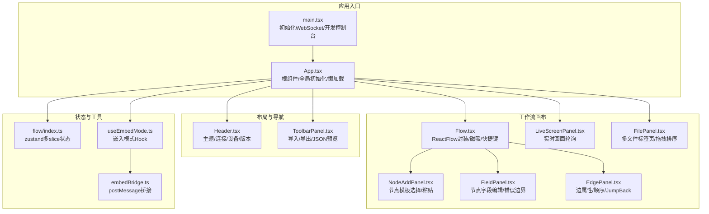
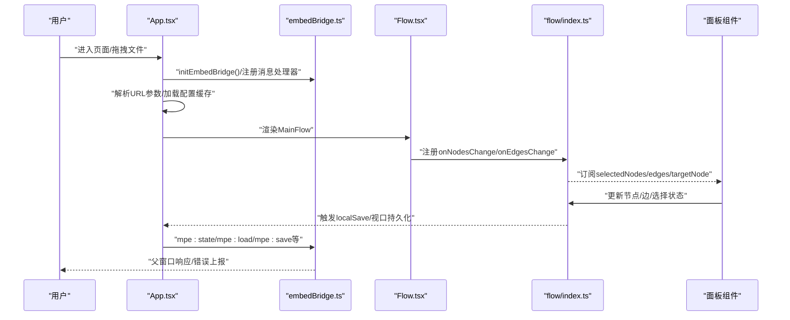
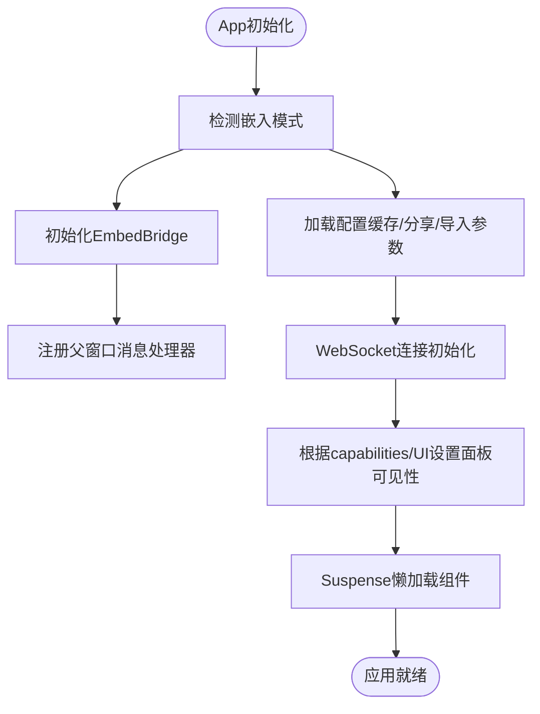
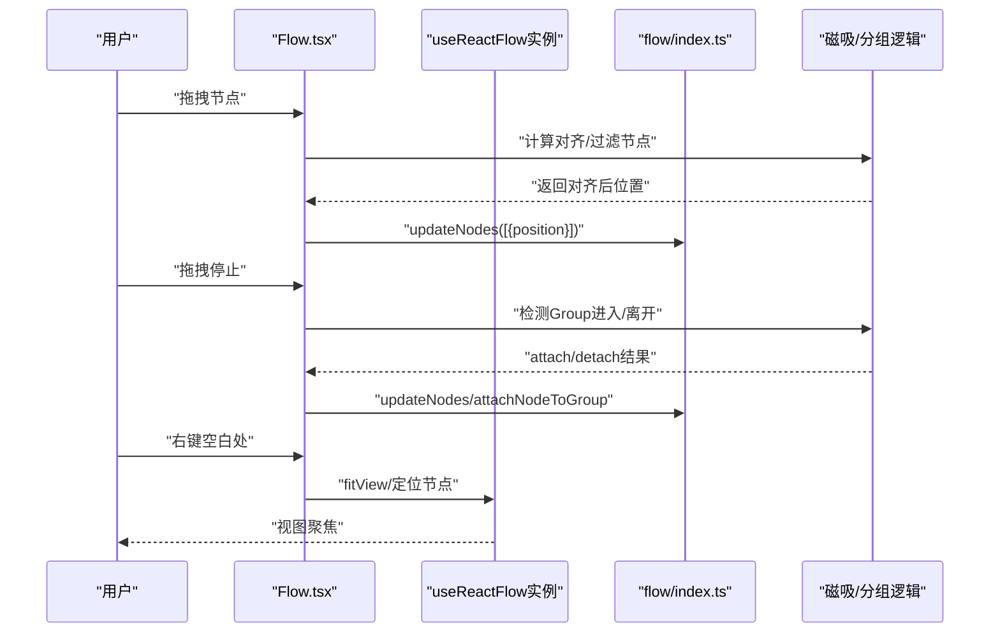
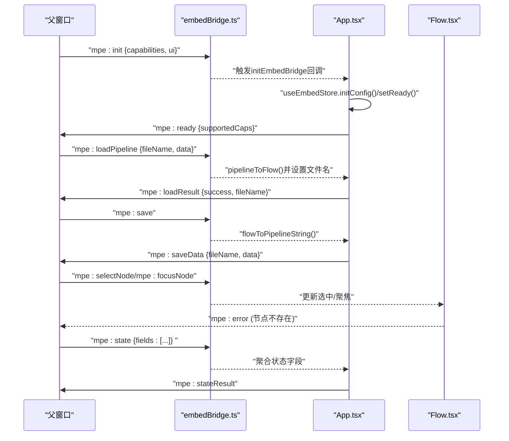
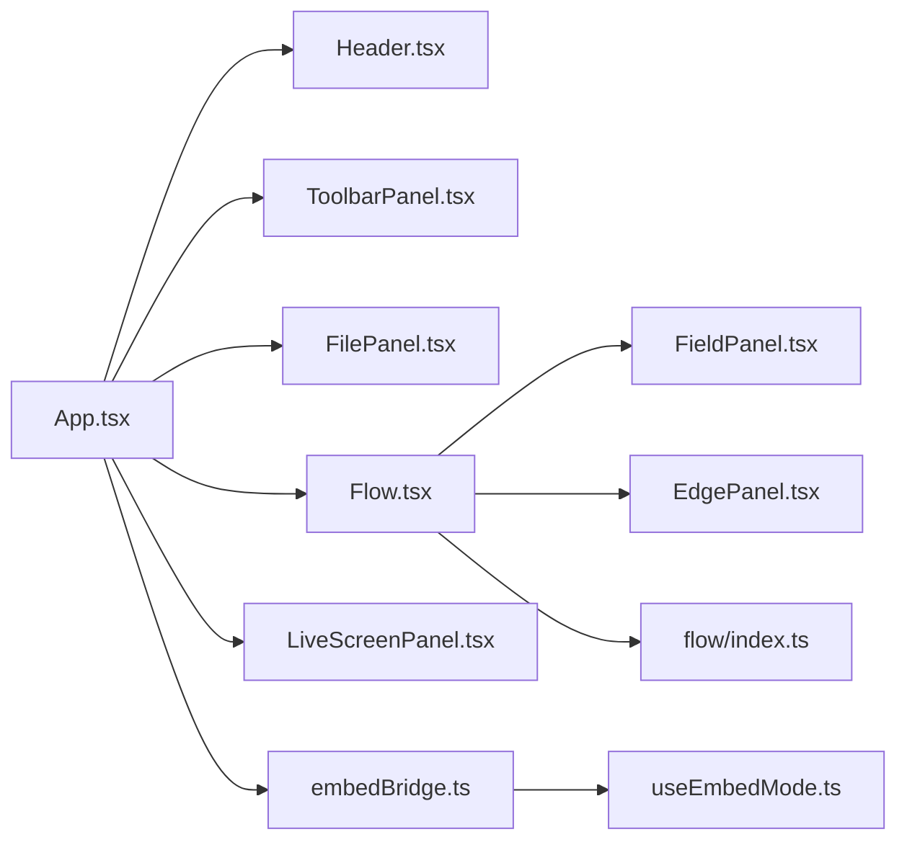

# 组件系统架构

<cite>
**本文档引用的文件**
- [App.tsx](file://src/App.tsx)
- [main.tsx](file://src/main.tsx)
- [Header.tsx](file://src/components/Header.tsx)
- [Flow.tsx](file://src/components/Flow.tsx)
- [FieldPanel.tsx](file://src/components/panels/main/FieldPanel.tsx)
- [EdgePanel.tsx](file://src/components/panels/main/EdgePanel.tsx)
- [NodeAddPanel.tsx](file://src/components/panels/main/NodeAddPanel.tsx)
- [ToolbarPanel.tsx](file://src/components/panels/main/ToolbarPanel.tsx)
- [LiveScreenPanel.tsx](file://src/components/panels/main/LiveScreenPanel.tsx)
- [FilePanel.tsx](file://src/components/panels/main/FilePanel.tsx)
- [useEmbedMode.ts](file://src/hooks/useEmbedMode.ts)
- [embedBridge.ts](file://src/utils/embedBridge.ts)
- [flow/index.ts](file://src/stores/flow/index.ts)
</cite>

## 目录
1. [引言](#引言)
2. [项目结构](#项目结构)
3. [核心组件](#核心组件)
4. [架构总览](#架构总览)
5. [详细组件分析](#详细组件分析)
6. [依赖关系分析](#依赖关系分析)
7. [性能考量](#性能考量)
8. [故障排查指南](#故障排查指南)
9. [结论](#结论)
10. [附录](#附录)

## 引言
本文件面向MaaPipelineEditor前端组件系统，围绕App.tsx根组件及其子组件的层次结构、职责划分、数据流与事件处理机制展开，重点覆盖Header、MainFlow、各类面板组件以及嵌入模式桥接通信。同时总结状态提升策略、组件复用与组合最佳实践，并给出懒加载与性能优化建议。

## 项目结构
- 入口应用：main.tsx负责初始化WebSocket与开发控制台，挂载App根组件。
- 根组件：App.tsx承担全局状态初始化、嵌入模式桥接、面板条件渲染、懒加载组件调度等职责。
- 布局与导航：Header负责主题切换、连接状态、设备连接入口、版本更新提示等。
- 工作流画布：MainFlow基于@xyflow/react构建，封装节点/边变更、磁吸对齐、快捷复制粘贴、内联字段/边面板等。
- 面板体系：文件面板、工具栏、字段面板、边面板、实时画面面板、搜索/设置/错误/日志等辅助面板。
- 状态管理：采用zustand组合多slice的状态仓库，集中管理节点、边、选择、历史、探索等状态。
- 嵌入模式：通过embedBridge与父页面进行postMessage双向通信，支持能力声明与UI隐藏策略。

图表来源
- [main.tsx:1-20](file://src/main.tsx#L1-L20)
- [App.tsx:135-597](file://src/App.tsx#L135-L597)
- [Header.tsx:257-499](file://src/components/Header.tsx#L257-L499)
- [Flow.tsx:235-709](file://src/components/Flow.tsx#L235-L709)
- [NodeAddPanel.tsx:277-708](file://src/components/panels/main/NodeAddPanel.tsx#L277-L708)
- [FieldPanel.tsx:103-491](file://src/components/panels/main/FieldPanel.tsx#L103-L491)
- [EdgePanel.tsx:130-299](file://src/components/panels/main/EdgePanel.tsx#L130-L299)
- [LiveScreenPanel.tsx:15-156](file://src/components/panels/main/LiveScreenPanel.tsx#L15-L156)
- [FilePanel.tsx:48-165](file://src/components/panels/main/FilePanel.tsx#L48-L165)
- [flow/index.ts:17-28](file://src/stores/flow/index.ts#L17-L28)
- [useEmbedMode.ts:10-30](file://src/hooks/useEmbedMode.ts#L10-L30)
- [embedBridge.ts:75-282](file://src/utils/embedBridge.ts#L75-L282)

章节来源
- [main.tsx:1-20](file://src/main.tsx#L1-L20)
- [App.tsx:135-597](file://src/App.tsx#L135-L597)

## 核心组件
- App.tsx（根组件）
  - 负责：嵌入模式检测与桥接、WebSocket连接初始化、文件导入/分享参数处理、新手引导与星标提醒、全局快捷键启用、面板条件渲染、懒加载组件调度。
  - 关键机制：useEmbedMode/useEmbedStore驱动面板可见性；Suspense包裹JsonViewer/DebugModal；全局拖拽导入；配置缓存订阅持久化。
- Header.tsx（顶部导航）
  - 负责：主题切换、本地服务连接按钮、设备连接入口、版本信息与更新提示、移动端适配告警。
  - 关键机制：WebSocket状态监听、设备信息展示、版本更新检测、连接面板弹窗。
- Flow.tsx（工作流画布）
  - 负责：节点/边增删改、连接建立/取消、选择变更、磁吸对齐、分组拖拽、内联字段/边面板、快捷键复制粘贴、视口变化持久化。
  - 关键机制：useReactFlow实例管理、onConnectStart/onConnectEnd智能节点创建、磁吸算法、只读模式下的能力限制。
- 面板组件
  - FilePanel：多文件标签页、拖拽排序、文件名校验。
  - ToolbarPanel：导入/导出/JSON预览按钮集合。
  - FieldPanel：节点字段编辑、错误边界、JSON编辑器、邻接信息、占位系统联动。
  - EdgePanel：边属性编辑、顺序与JumpBack开关、删除。
  - LiveScreenPanel：实时画面轮询、失败阈值自动断连、可见性控制。

章节来源
- [App.tsx:135-597](file://src/App.tsx#L135-L597)
- [Header.tsx:257-499](file://src/components/Header.tsx#L257-L499)
- [Flow.tsx:235-709](file://src/components/Flow.tsx#L235-L709)
- [FilePanel.tsx:48-165](file://src/components/panels/main/FilePanel.tsx#L48-L165)
- [ToolbarPanel.tsx:11-22](file://src/components/panels/main/ToolbarPanel.tsx#L11-L22)
- [FieldPanel.tsx:103-491](file://src/components/panels/main/FieldPanel.tsx#L103-L491)
- [EdgePanel.tsx:130-299](file://src/components/panels/main/EdgePanel.tsx#L130-L299)
- [LiveScreenPanel.tsx:15-156](file://src/components/panels/main/LiveScreenPanel.tsx#L15-L156)

## 架构总览
- 组件分层
  - 布局层：App/Header/ToolbarPanel
  - 画布层：MainFlow/NodeAddPanel/FieldPanel/EdgePanel
  - 面板层：FilePanel/LiveScreenPanel/搜索/设置/错误/日志等
  - 工具层：嵌入桥接/状态仓库/快捷键/占位系统
- 数据流
  - 画布事件（节点/边/选择）写入flow状态仓库，触发本地持久化与视口保存。
  - 面板读取flow状态，部分写回flow状态，形成单向数据流。
  - 嵌入模式下，App通过embedBridge与父窗口通信，实现只读/复制/撤销重做等能力控制。
- 事件流
  - 全局拖拽导入、快捷键（Ctrl+C/V）、右键菜单、双击空白处、磁吸对齐、分组拖拽检测等。

图表来源
- [App.tsx:180-352](file://src/App.tsx#L180-L352)
- [embedBridge.ts:134-170](file://src/utils/embedBridge.ts#L134-L170)
- [Flow.tsx:300-359](file://src/components/Flow.tsx#L300-L359)
- [flow/index.ts:17-28](file://src/stores/flow/index.ts#L17-L28)

## 详细组件分析

### App.tsx（根组件）
- 设计模式与职责
  - 条件渲染：根据嵌入模式与UI配置决定Header/Toolbar/各面板可见性。
  - 生命周期：useEffect内完成嵌入桥接初始化、WebSocket连接、分享/导入参数处理、新手引导与星标提醒。
  - 懒加载：JsonViewer/DebugModal通过React.lazy与Suspense延迟加载，降低首屏负担。
  - 事件处理：全局拖拽导入、键盘快捷键（嵌入模式下按能力控制）。
- 状态提升策略
  - 全局配置缓存：订阅configStore变更，异步持久化。
  - 嵌入模式：useEmbedMode统一读取capabilities/ui，驱动面板隐藏与只读策略。
- 组件复用
  - Panel通用渲染器：通过条件分支与useEmbedMode返回的隐藏策略，减少重复判断。
- 性能优化
  - 懒加载组件；拖拽事件在卸载时清理；WebSocket状态变化回调去抖保存。

图表来源
- [App.tsx:180-529](file://src/App.tsx#L180-L529)
- [embedBridge.ts:179-244](file://src/utils/embedBridge.ts#L179-L244)

章节来源
- [App.tsx:135-597](file://src/App.tsx#L135-L597)

### Header.tsx（顶部导航）
- 功能要点
  - 连接按钮：根据WebSocket状态动态显示连接/断开/连接中；嵌入模式显示EmbedBridge提示。
  - 设备连接：连接成功后展示设备名称，点击打开连接面板。
  - 版本更新：检测新版本并弹窗提示；新手测试通过后延迟显示更新日志。
  - 主题切换：通过ThemeContext切换明暗主题。
- 交互细节
  - 定时轮询WebSocket状态；窗口宽度小于阈值时显示警告提示。

章节来源
- [Header.tsx:257-499](file://src/components/Header.tsx#L257-L499)

### Flow.tsx（工作流画布）
- 核心能力
  - 节点/边变更：onNodesChange/onEdgesChange过滤只读模式下的修改，保留select变更。
  - 连接策略：onConnectStart/onConnectEnd在空白处结束时触发NodeAddPanel。
  - 磁吸对齐：onNodeDrag/onNodeDragStop结合snap算法自动对齐与微调。
  - 分组拖拽：检测节点拖入/拖出Group，自动attach/detach。
  - 内联面板：InlineFieldPanel/InlineEdgePanel随选择变化显示。
  - 快捷键：仅在文本编辑器外生效的Ctrl+C/V复制粘贴。
- 性能要点
  - 使用useMemo/useCallback稳定回调与对象引用，避免@xyflow组件重复渲染。
  - 视口变化与节点/边/目标节点变更触发debounce本地保存。

图表来源
- [Flow.tsx:469-608](file://src/components/Flow.tsx#L469-L608)
- [flow/index.ts:17-28](file://src/stores/flow/index.ts#L17-L28)

章节来源
- [Flow.tsx:235-709](file://src/components/Flow.tsx#L235-L709)

### 面板组件

#### FieldPanel.tsx（字段面板）
- 结构与职责
  - 根据目标节点类型渲染对应编辑器（Pipeline/External/Anchor/Sticker/Group），内置EditorErrorBoundary。
  - 支持JSON编辑器、节点修复、邻接信息Tab、占位系统联动。
  - 加载遮罩与进度提示，配合异步编辑流程。
- 错误处理
  - 节点数据损坏时提示并提供修复按钮；修复后替换节点数据并更新targetNode。

章节来源
- [FieldPanel.tsx:103-491](file://src/components/panels/main/FieldPanel.tsx#L103-L491)

#### EdgePanel.tsx（边面板）
- 结构与职责
  - 展示源/目标节点标签、连接类型标签（next/error/jumpback）、顺序输入与最大值。
  - 提供JumpBack开关与删除连接。
  - 与占位系统联动，避免与字段面板冲突。

章节来源
- [EdgePanel.tsx:130-299](file://src/components/panels/main/EdgePanel.tsx#L130-L299)

#### NodeAddPanel.tsx（节点添加面板）
- 结构与职责
  - 模板列表：支持搜索、键盘导航、自定义模板删除。
  - 预览区域：根据模板动态展示识别/动作/其他参数摘要。
  - 粘贴板集成：在空节点模板后插入“粘贴”项，支持批量粘贴。
  - 位置计算：根据容器宽度与鼠标位置自动左/右布局，避免越界。
- 交互细节
  - ESC关闭；Enter确认；右键在新位置重新打开。

章节来源
- [NodeAddPanel.tsx:277-708](file://src/components/panels/main/NodeAddPanel.tsx#L277-L708)

#### LiveScreenPanel.tsx（实时画面面板）
- 结构与职责
  - 条件显示：仅在设备连接且未被占位时显示。
  - 轮询策略：按配置周期请求截图，连续失败超过阈值自动断开设备连接。
  - 状态反馈：加载中/错误/成功三种状态容器。

章节来源
- [LiveScreenPanel.tsx:15-156](file://src/components/panels/main/LiveScreenPanel.tsx#L15-L156)

#### FilePanel.tsx（文件面板）
- 结构与职责
  - 多文件标签页：支持拖拽排序、新增/删除、重命名校验。
  - 本地文件：点击“本地文件”按钮打开本地文件列表面板。
- 交互细节
  - 使用@drag-and-drop工具链实现横向排序；文件名输入状态提示。

章节来源
- [FilePanel.tsx:48-165](file://src/components/panels/main/FilePanel.tsx#L48-L165)

#### ToolbarPanel.tsx（工具栏）
- 结构与职责
  - 导入/导出/JSON预览按钮集合，位于界面右上角。

章节来源
- [ToolbarPanel.tsx:11-22](file://src/components/panels/main/ToolbarPanel.tsx#L11-L22)

### 嵌入模式与通信

图表来源
- [App.tsx:193-331](file://src/App.tsx#L193-L331)
- [embedBridge.ts:134-170](file://src/utils/embedBridge.ts#L134-L170)
- [useEmbedMode.ts:10-30](file://src/hooks/useEmbedMode.ts#L10-L30)

章节来源
- [App.tsx:135-597](file://src/App.tsx#L135-L597)
- [embedBridge.ts:75-282](file://src/utils/embedBridge.ts#L75-L282)
- [useEmbedMode.ts:10-30](file://src/hooks/useEmbedMode.ts#L10-L30)

## 依赖关系分析
- 组件耦合
  - App.tsx对各面板与Flow具有直接依赖，但通过嵌入模式Hook与条件渲染降低耦合度。
  - Flow.tsx依赖flow状态仓库与配置仓库，内部通过useShallow浅订阅减少无关重渲染。
- 外部依赖
  - @xyflow/react：画布渲染与交互；@dnd-kit：文件面板拖拽排序。
  - zustand：多slice状态仓库，集中管理节点/边/选择/历史/探索等。
  - Ant Design：UI组件库，统一风格与交互。
- 循环依赖
  - 未发现直接循环依赖；Flow.tsx与面板组件通过状态仓库间接通信，符合单向数据流。

图表来源
- [App.tsx:22-41](file://src/App.tsx#L22-L41)
- [Flow.tsx:30-49](file://src/components/Flow.tsx#L30-L49)
- [flow/index.ts:17-28](file://src/stores/flow/index.ts#L17-L28)
- [useEmbedMode.ts:10-30](file://src/hooks/useEmbedMode.ts#L10-L30)
- [embedBridge.ts:75-282](file://src/utils/embedBridge.ts#L75-L282)

章节来源
- [App.tsx:22-41](file://src/App.tsx#L22-L41)
- [Flow.tsx:30-49](file://src/components/Flow.tsx#L30-L49)
- [flow/index.ts:17-28](file://src/stores/flow/index.ts#L17-L28)

## 性能考量
- 组件懒加载
  - JsonViewer/DebugModal通过lazy与Suspense延迟加载，显著降低首屏资源占用。
- 渲染优化
  - Flow.tsx中对节点/边/回调使用useMemo/useCallback稳定引用，避免@xyflow重复渲染。
  - 使用useShallow浅订阅flow状态，减少无关组件重渲染。
- I/O节流
  - 视口变化与节点/边/目标节点变更采用debounce保存，降低频繁写入。
  - LiveScreenPanel按配置周期轮询截图，连续失败阈值自动断连，避免无效请求。
- 嵌入模式限制
  - 只读模式下过滤修改类变更，减少无效状态更新与UI闪烁。

## 故障排查指南
- 嵌入模式无响应
  - 检查握手是否完成（mpe:ready），确认父窗口origin匹配；查看消息处理器注册与清理。
- 节点编辑器崩溃
  - 查看EditorErrorBoundary提示，尝试“应用修复”或删除节点重建。
- 实时画面异常
  - 检查设备连接状态与控制器ID；关注连续失败计数，超过阈值会自动断开。
- 导入/导出失败
  - 确认文件格式（.json/.jsonc），查看控制台错误信息；检查WebSocket连接状态。

章节来源
- [embedBridge.ts:179-244](file://src/utils/embedBridge.ts#L179-L244)
- [FieldPanel.tsx:40-100](file://src/components/panels/main/FieldPanel.tsx#L40-L100)
- [LiveScreenPanel.tsx:64-73](file://src/components/panels/main/LiveScreenPanel.tsx#L64-L73)

## 结论
MaaPipelineEditor组件系统以App.tsx为核心，采用清晰的分层设计与状态仓库，实现了画布交互、面板编辑、嵌入通信与性能优化的平衡。通过条件渲染、懒加载、浅订阅与能力控制，系统在复杂工作流场景下仍保持良好的可维护性与用户体验。

## 附录
- 最佳实践
  - 使用memo与useCallback稳定@xyflow回调与组件引用。
  - 通过useShallow浅订阅避免不必要的重渲染。
  - 嵌入模式下严格遵循capabilities约束，避免UI/行为差异。
  - 面板与画布间通过状态仓库单向通信，保持数据一致性。
- 懒加载清单
  - JsonViewer、DebugModal（App.tsx中Suspense包裹）。
- 性能优化清单
  - Flow.tsx：useMemo/useCallback稳定回调；debounce保存；磁吸对齐按需触发。
  - LiveScreenPanel：周期轮询与失败阈值；页面不可见时暂停请求。