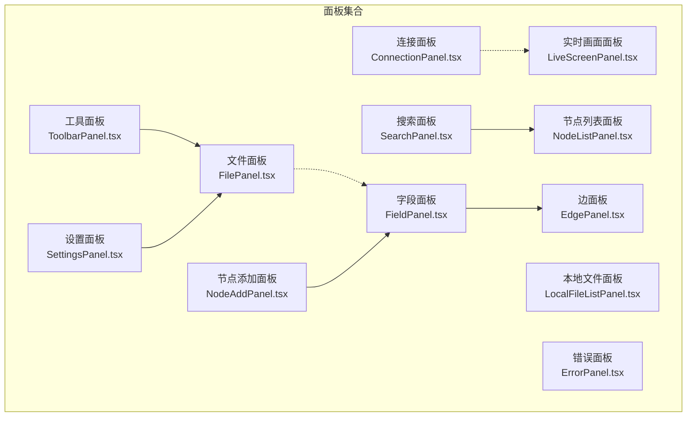
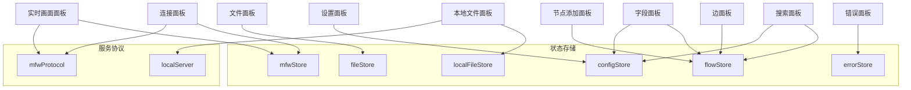
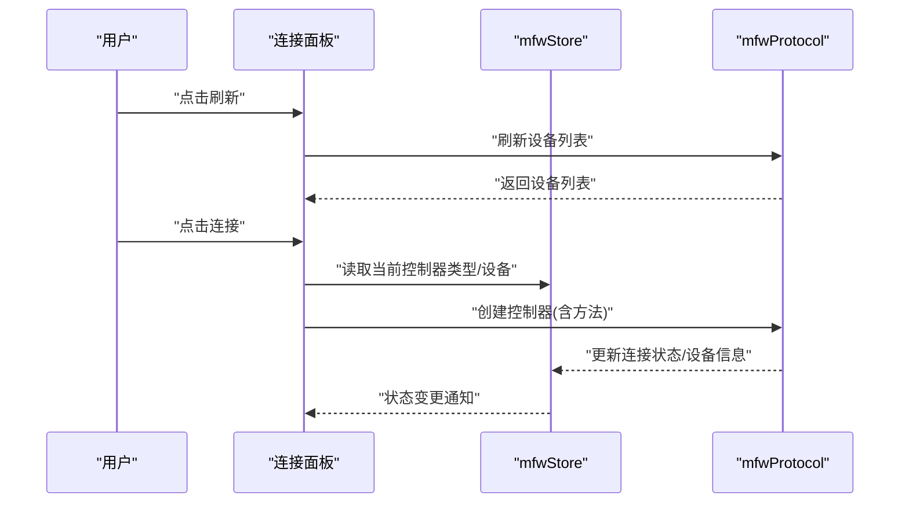
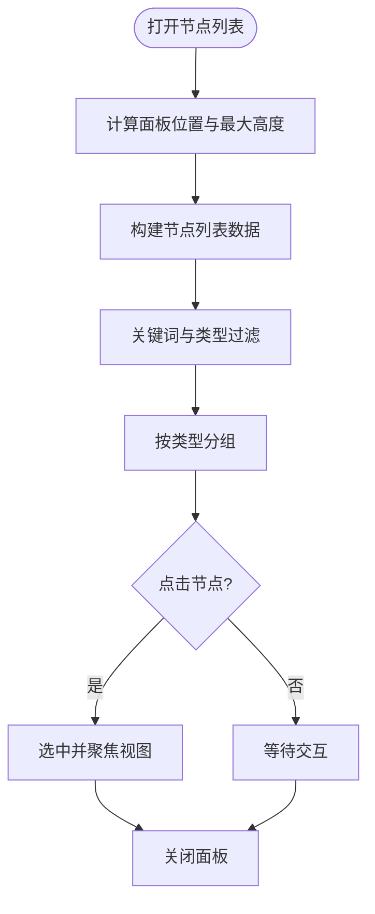
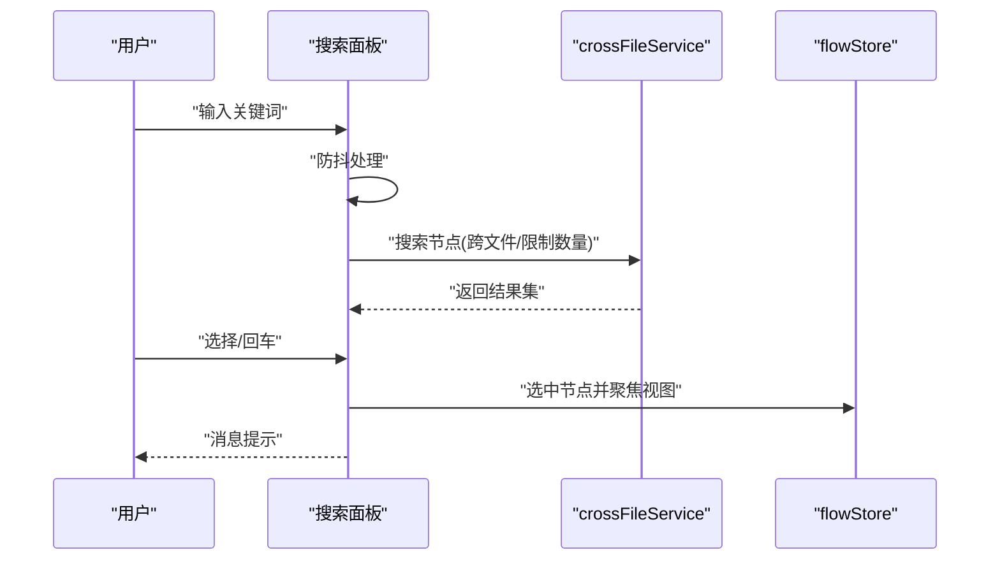
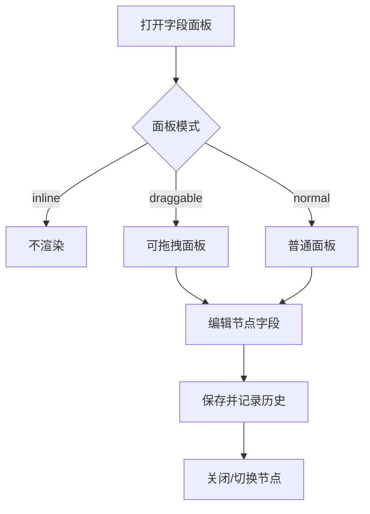
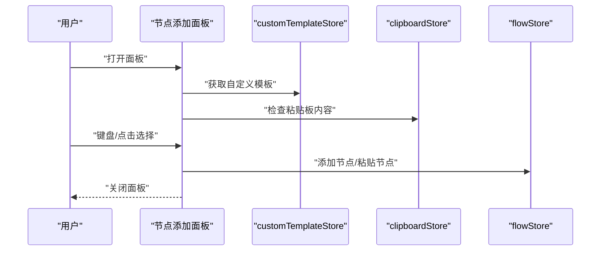
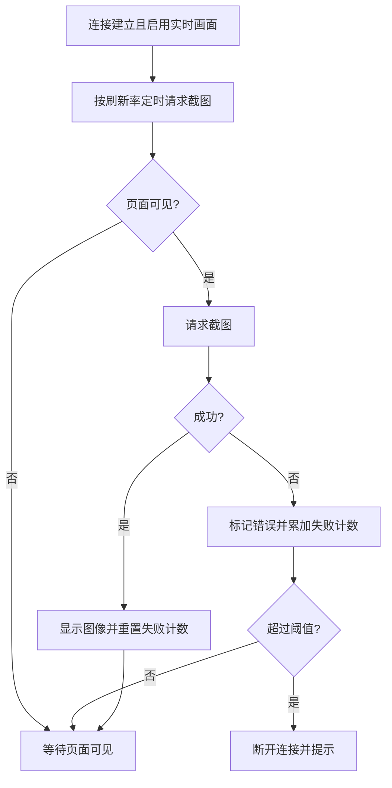
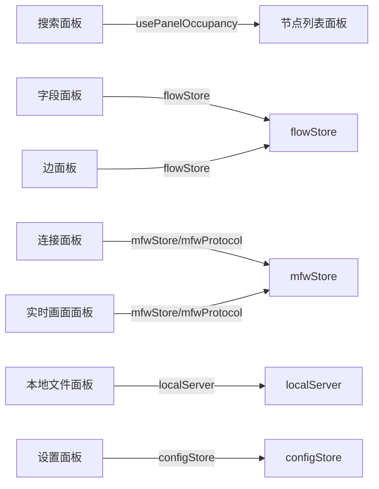

# 主要面板

<cite>
**本文档引用的文件**
- [src/components/panels/main/FilePanel.tsx](file://src/components/panels/main/FilePanel.tsx)
- [src/components/panels/main/ConnectionPanel.tsx](file://src/components/panels/main/ConnectionPanel.tsx)
- [src/components/panels/main/node-list/NodeListPanel.tsx](file://src/components/panels/main/node-list/NodeListPanel.tsx)
- [src/components/panels/main/ToolbarPanel.tsx](file://src/components/panels/main/ToolbarPanel.tsx)
- [src/components/panels/main/SearchPanel.tsx](file://src/components/panels/main/SearchPanel.tsx)
- [src/components/panels/main/FieldPanel.tsx](file://src/components/panels/main/FieldPanel.tsx)
- [src/components/panels/main/LocalFileListPanel.tsx](file://src/components/panels/main/LocalFileListPanel.tsx)
- [src/components/panels/main/NodeAddPanel.tsx](file://src/components/panels/main/NodeAddPanel.tsx)
- [src/components/panels/main/EdgePanel.tsx](file://src/components/panels/main/EdgePanel.tsx)
- [src/components/panels/main/ErrorPanel.tsx](file://src/components/panels/main/ErrorPanel.tsx)
- [src/components/panels/main/LiveScreenPanel.tsx](file://src/components/panels/main/LiveScreenPanel.tsx)
- [src/components/panels/settings/SettingsPanel.tsx](file://src/components/panels/settings/SettingsPanel.tsx)
</cite>

## 目录
1. [简介](#简介)
2. [项目结构](#项目结构)
3. [核心组件](#核心组件)
4. [架构总览](#架构总览)
5. [详细组件分析](#详细组件分析)
6. [依赖关系分析](#依赖关系分析)
7. [性能考虑](#性能考虑)
8. [故障排查指南](#故障排查指南)
9. [结论](#结论)
10. [附录](#附录)

## 简介
本文件面向主要面板组件，系统梳理文件面板、连接面板、节点列表面板、工具面板、搜索面板、字段面板、设置面板等核心 UI 面板的功能实现、数据结构与交互逻辑，并解释面板间的协作、状态同步与配置扩展方式。同时给出响应式布局与用户体验优化建议，帮助开发者与使用者高效理解与定制。

## 项目结构
主要面板集中于 src/components/panels 目录，按功能域划分为 main（主工作区面板）、settings（设置面板）等子模块；每个面板通常由组件文件、样式文件与配套工具/类型组成。面板通过全局状态存储（stores）与服务协议（services/server）进行数据与行为协调。

图表来源
- [src/components/panels/main/FilePanel.tsx:48-165](file://src/components/panels/main/FilePanel.tsx#L48-L165)
- [src/components/panels/main/ConnectionPanel.tsx:51-954](file://src/components/panels/main/ConnectionPanel.tsx#L51-L954)
- [src/components/panels/main/node-list/NodeListPanel.tsx:46-426](file://src/components/panels/main/node-list/NodeListPanel.tsx#L46-L426)
- [src/components/panels/main/ToolbarPanel.tsx:11-22](file://src/components/panels/main/ToolbarPanel.tsx#L11-L22)
- [src/components/panels/main/SearchPanel.tsx:28-437](file://src/components/panels/main/SearchPanel.tsx#L28-L437)
- [src/components/panels/main/FieldPanel.tsx:103-491](file://src/components/panels/main/FieldPanel.tsx#L103-L491)
- [src/components/panels/main/LocalFileListPanel.tsx:21-174](file://src/components/panels/main/LocalFileListPanel.tsx#L21-L174)
- [src/components/panels/main/NodeAddPanel.tsx:277-708](file://src/components/panels/main/NodeAddPanel.tsx#L277-L708)
- [src/components/panels/main/EdgePanel.tsx:130-299](file://src/components/panels/main/EdgePanel.tsx#L130-L299)
- [src/components/panels/main/ErrorPanel.tsx:8-38](file://src/components/panels/main/ErrorPanel.tsx#L8-L38)
- [src/components/panels/main/LiveScreenPanel.tsx:15-156](file://src/components/panels/main/LiveScreenPanel.tsx#L15-L156)
- [src/components/panels/settings/SettingsPanel.tsx:35-176](file://src/components/panels/settings/SettingsPanel.tsx#L35-L176)

章节来源
- [src/components/panels/main/FilePanel.tsx:1-165](file://src/components/panels/main/FilePanel.tsx#L1-L165)
- [src/components/panels/main/ConnectionPanel.tsx:1-954](file://src/components/panels/main/ConnectionPanel.tsx#L1-L954)
- [src/components/panels/main/node-list/NodeListPanel.tsx:1-426](file://src/components/panels/main/node-list/NodeListPanel.tsx#L1-L426)
- [src/components/panels/main/ToolbarPanel.tsx:1-22](file://src/components/panels/main/ToolbarPanel.tsx#L1-L22)
- [src/components/panels/main/SearchPanel.tsx:1-437](file://src/components/panels/main/SearchPanel.tsx#L1-L437)
- [src/components/panels/main/FieldPanel.tsx:1-491](file://src/components/panels/main/FieldPanel.tsx#L1-L491)
- [src/components/panels/main/LocalFileListPanel.tsx:1-174](file://src/components/panels/main/LocalFileListPanel.tsx#L1-L174)
- [src/components/panels/main/NodeAddPanel.tsx:1-708](file://src/components/panels/main/NodeAddPanel.tsx#L1-L708)
- [src/components/panels/main/EdgePanel.tsx:1-299](file://src/components/panels/main/EdgePanel.tsx#L1-L299)
- [src/components/panels/main/ErrorPanel.tsx:1-38](file://src/components/panels/main/ErrorPanel.tsx#L1-L38)
- [src/components/panels/main/LiveScreenPanel.tsx:1-156](file://src/components/panels/main/LiveScreenPanel.tsx#L1-L156)
- [src/components/panels/settings/SettingsPanel.tsx:1-176](file://src/components/panels/settings/SettingsPanel.tsx#L1-L176)

## 核心组件
- 文件面板：多标签页文件管理，拖拽排序，文件名校验与切换，本地文件弹窗入口。
- 连接面板：设备发现与连接配置，ADB/Win32/Wayland/macOS/手柄等多种控制器配置与连接。
- 节点列表面板：按类型分组的节点浏览与定位，关键词与类型过滤，点击高亮与视图聚焦。
- 工具面板：右上角横向工具条，提供导入、导出、JSON 预览等快捷入口。
- 搜索面板：节点名称搜索与跨文件跳转，支持 AI 智能搜索，节点列表下拉。
- 字段面板：节点字段编辑与邻接信息展示，支持 JSON 编辑器、错误修复、进度遮罩。
- 本地文件面板：本地文件浏览、搜索、刷新与打开文件。
- 节点添加面板：模板节点选择与预览，粘贴板节点批量粘贴，键盘导航与自定义模板删除。
- 边面板：边连接属性编辑（顺序、JumpBack），删除连接。
- 错误面板：全局错误聚合展示。
- 实时画面面板：基于控制器的实时截图展示与异常自动断连。
- 设置面板：系统配置项分类与搜索，条件显隐与排序。

章节来源
- [src/components/panels/main/FilePanel.tsx:48-165](file://src/components/panels/main/FilePanel.tsx#L48-L165)
- [src/components/panels/main/ConnectionPanel.tsx:51-954](file://src/components/panels/main/ConnectionPanel.tsx#L51-L954)
- [src/components/panels/main/node-list/NodeListPanel.tsx:46-426](file://src/components/panels/main/node-list/NodeListPanel.tsx#L46-L426)
- [src/components/panels/main/ToolbarPanel.tsx:11-22](file://src/components/panels/main/ToolbarPanel.tsx#L11-L22)
- [src/components/panels/main/SearchPanel.tsx:28-437](file://src/components/panels/main/SearchPanel.tsx#L28-L437)
- [src/components/panels/main/FieldPanel.tsx:103-491](file://src/components/panels/main/FieldPanel.tsx#L103-L491)
- [src/components/panels/main/LocalFileListPanel.tsx:21-174](file://src/components/panels/main/LocalFileListPanel.tsx#L21-L174)
- [src/components/panels/main/NodeAddPanel.tsx:277-708](file://src/components/panels/main/NodeAddPanel.tsx#L277-L708)
- [src/components/panels/main/EdgePanel.tsx:130-299](file://src/components/panels/main/EdgePanel.tsx#L130-L299)
- [src/components/panels/main/ErrorPanel.tsx:8-38](file://src/components/panels/main/ErrorPanel.tsx#L8-L38)
- [src/components/panels/main/LiveScreenPanel.tsx:15-156](file://src/components/panels/main/LiveScreenPanel.tsx#L15-L156)
- [src/components/panels/settings/SettingsPanel.tsx:35-176](file://src/components/panels/settings/SettingsPanel.tsx#L35-L176)

## 架构总览
各面板通过全局状态存储（如 fileStore、mfwStore、configStore、flow、errorStore 等）与服务协议（如 mfwProtocol、localServer）进行数据与行为协调。面板之间通过状态联动实现“占位系统”（panel occupancy）与“嵌入模式”（embed mode）下的可见性与交互约束。

图表来源
- [src/components/panels/main/FilePanel.tsx:48-165](file://src/components/panels/main/FilePanel.tsx#L48-L165)
- [src/components/panels/main/ConnectionPanel.tsx:51-954](file://src/components/panels/main/ConnectionPanel.tsx#L51-L954)
- [src/components/panels/main/SearchPanel.tsx:28-437](file://src/components/panels/main/SearchPanel.tsx#L28-L437)
- [src/components/panels/main/FieldPanel.tsx:103-491](file://src/components/panels/main/FieldPanel.tsx#L103-L491)
- [src/components/panels/main/EdgePanel.tsx:130-299](file://src/components/panels/main/EdgePanel.tsx#L130-L299)
- [src/components/panels/main/LocalFileListPanel.tsx:21-174](file://src/components/panels/main/LocalFileListPanel.tsx#L21-L174)
- [src/components/panels/main/LiveScreenPanel.tsx:15-156](file://src/components/panels/main/LiveScreenPanel.tsx#L15-L156)
- [src/components/panels/main/ErrorPanel.tsx:8-38](file://src/components/panels/main/ErrorPanel.tsx#L8-L38)
- [src/components/panels/settings/SettingsPanel.tsx:35-176](file://src/components/panels/settings/SettingsPanel.tsx#L35-L176)

## 详细组件分析

### 文件面板（FilePanel）
- 核心功能
  - 多标签页文件管理：动态生成标签项，支持拖拽排序与可编辑卡片。
  - 文件名校验与切换：输入校验状态反馈，成功时激活对应标签。
  - 本地文件入口：点击“+”打开本地文件列表面板。
- 数据结构与交互
  - 依赖 fileStore：files、currentFile、setFileName、switchFile、onDragEnd、addFile、removeFile。
  - 使用 DndKit 实现标签拖拽排序，closestCenter 碰撞检测，horizontalListSortingStrategy 策略。
- 状态同步
  - activeKey 与当前文件名保持一致；拖拽结束后通过 onDragEnd 同步顺序。
- 响应式与体验
  - 标签栏使用 DndContext 包裹，支持指针传感器与拖拽反馈。
  - 输入状态（warning/error）即时反馈，提升编辑体验。

章节来源
- [src/components/panels/main/FilePanel.tsx:48-165](file://src/components/panels/main/FilePanel.tsx#L48-L165)

### 连接面板（ConnectionPanel）
- 核心功能
  - 设备类型与平台适配：ADB、Win32、PlayCover、手柄、WlRoots、macOS。
  - 设备发现与连接：自动/手动模式，方法选择（截图/输入），连接/断开/刷新。
  - 状态展示：连接状态徽章、错误提示、当前设备标识。
- 数据结构与交互
  - 依赖 mfwStore：连接状态、控制器类型与设备信息、设备列表。
  - 依赖 mfwProtocol：设备刷新、控制器创建、断开连接。
  - 使用持久化状态（usePersistedState）记忆用户配置。
- 状态同步与流程
  - 首次打开时根据连接状态初始化 Tab 与选中设备。
  - 连接新设备前先断开旧连接，再发起新连接。
  - 连接失败达到阈值自动断开并提示。
- 响应式与体验
  - 按平台动态显示可用 Tab；设备列表首次打开自动刷新。
  - 支持手动模式与设备模式双路径，方法默认值按设备能力过滤。

图表来源
- [src/components/panels/main/ConnectionPanel.tsx:344-511](file://src/components/panels/main/ConnectionPanel.tsx#L344-L511)

章节来源
- [src/components/panels/main/ConnectionPanel.tsx:51-954](file://src/components/panels/main/ConnectionPanel.tsx#L51-L954)

### 节点列表面板（NodeListPanel）
- 核心功能
  - 节点浏览：按类型分组（Pipeline/External/Anchor/Sticker/Group），统计总数与类型分布。
  - 搜索与过滤：关键词与类型过滤，支持展开/折叠分组。
  - 交互定位：点击节点选中并聚焦视图中心。
- 数据结构与交互
  - 依赖 flowStore：nodes、edges、instance。
  - 计算边连接数（入/出）辅助展示；构建节点列表数据并过滤分组。
  - 使用 getNodeAbsolutePosition 计算绝对坐标，setCenter 聚焦视图。
- 状态同步与事件
  - ESC 关闭；点击面板外部关闭；窗口尺寸变化时重算位置。
- 响应式与体验
  - 右对齐定位，最大高度随窗口自适应；过渡动画结束后延迟卸载以保证动画流畅。

图表来源
- [src/components/panels/main/node-list/NodeListPanel.tsx:85-330](file://src/components/panels/main/node-list/NodeListPanel.tsx#L85-L330)

章节来源
- [src/components/panels/main/node-list/NodeListPanel.tsx:46-426](file://src/components/panels/main/node-list/NodeListPanel.tsx#L46-L426)

### 工具面板（ToolbarPanel）
- 核心功能
  - 右上角横向工具条：导出、导入、JSON 预览。
- 交互与状态
  - 作为轻量入口，依赖各自按钮组件实现具体行为。

章节来源
- [src/components/panels/main/ToolbarPanel.tsx:11-22](file://src/components/panels/main/ToolbarPanel.tsx#L11-L22)

### 搜索面板（SearchPanel）
- 核心功能
  - 节点名称搜索：防抖搜索、下拉选项、跨文件跳转。
  - AI 智能搜索：构建节点上下文，调用 AIClient 发送提示词。
  - 节点列表下拉：通过 Portal 渲染，支持占位系统与定位。
- 数据结构与交互
  - 依赖 flowStore：nodes、instance；configStore：enableCrossFileSearch。
  - 依赖 crossFileService：跨文件节点检索与跳转。
  - 依赖 usePanelOccupancy：与节点列表面板协同。
- 状态同步与流程
  - 输入变化触发防抖搜索；回车优先跳转首个结果，否则在当前文件定位。
  - AI 搜索中显示加载态，异常统一提示。
- 响应式与体验
  - 下拉选项自定义渲染（节点名+文件路径）；支持嵌入模式权限控制。

图表来源
- [src/components/panels/main/SearchPanel.tsx:66-193](file://src/components/panels/main/SearchPanel.tsx#L66-L193)

章节来源
- [src/components/panels/main/SearchPanel.tsx:28-437](file://src/components/panels/main/SearchPanel.tsx#L28-L437)

### 字段面板（FieldPanel）
- 核心功能
  - 节点字段编辑：按节点类型渲染对应编辑器（Pipeline/External/Anchor/Sticker/Group）。
  - 邻接信息：展示上下游连接关系与统计。
  - JSON 编辑器：打开/保存节点数据，历史记录。
  - 错误修复：节点数据校验与一键修复。
- 数据结构与交互
  - 依赖 flowStore：targetNode、updateNodes、setTargetNode、saveHistory。
  - 依赖 configStore：fieldPanelMode（inline/draggable/normal）。
  - 依赖 usePanelOccupancy：与占位系统联动。
- 状态同步与流程
  - 打开/关闭面板时同步占位系统；被其他面板“挤占”时自动取消选择。
  - JSON 编辑保存后更新节点并写入历史。
- 响应式与体验
  - 支持内联/可拖拽/普通三种模式；加载遮罩与进度提示；数据损坏时提供修复入口。

图表来源
- [src/components/panels/main/FieldPanel.tsx:120-175](file://src/components/panels/main/FieldPanel.tsx#L120-L175)

章节来源
- [src/components/panels/main/FieldPanel.tsx:103-491](file://src/components/panels/main/FieldPanel.tsx#L103-L491)

### 本地文件面板（LocalFileListPanel）
- 核心功能
  - 本地文件浏览：根路径显示、文件列表、搜索过滤。
  - 刷新与打开：刷新文件列表、打开指定文件。
- 数据结构与交互
  - 依赖 localFileStore：rootPath、files、setRefreshing。
  - 依赖 configStore：crossFileSearchFolderFilter。
  - 依赖 localServer：连接与发送命令。
- 状态同步与流程
  - 未连接时尝试连接；刷新时设置刷新状态并提示。
  - 打开文件后关闭面板。
- 响应式与体验
  - 列表为空时显示占位；支持文件名与相对路径搜索。

章节来源
- [src/components/panels/main/LocalFileListPanel.tsx:21-174](file://src/components/panels/main/LocalFileListPanel.tsx#L21-L174)

### 节点添加面板（NodeAddPanel）
- 核心功能
  - 模板节点选择：搜索模板、键盘导航、模板预览。
  - 粘贴板节点：在“空节点”模板后插入粘贴项，支持批量粘贴。
  - 自定义模板：悬停显示删除按钮，确认后删除。
- 数据结构与交互
  - 依赖 flowStore：addNode、paste、flow 尺寸。
  - 依赖 customTemplateStore：自定义模板增删查。
  - 依赖 clipboardStore：剪贴板节点与边。
- 状态同步与流程
  - 面板位置根据鼠标位置与容器宽度自动调整，避免越界。
  - Enter 选择、Esc 关闭、上下箭头导航。
- 响应式与体验
  - 左右布局自适应（预览区与列表区），快捷键提示清晰。

图表来源
- [src/components/panels/main/NodeAddPanel.tsx:350-378](file://src/components/panels/main/NodeAddPanel.tsx#L350-L378)

章节来源
- [src/components/panels/main/NodeAddPanel.tsx:277-708](file://src/components/panels/main/NodeAddPanel.tsx#L277-L708)

### 边面板（EdgePanel）
- 核心功能
  - 边属性编辑：顺序（order）、JumpBack（仅错误边）。
  - 删除连接：一键移除当前边。
- 数据结构与交互
  - 依赖 flowStore：selectedEdges、nodes、targetNode、setEdgeLabel、setEdgeData、updateEdges。
  - 依赖 configStore：fieldPanelMode。
  - 依赖 usePanelOccupancy：与占位系统联动。
- 状态同步与流程
  - 仅当仅选中一条边且未选中节点时显示；被其他面板“挤占”时自动取消选择。
  - 顺序最大值按同源同类型边数计算。
- 响应式与体验
  - 按边类型与目标节点类型动态展示标签（next/on_error/anchor/jumpback）。

章节来源
- [src/components/panels/main/EdgePanel.tsx:130-299](file://src/components/panels/main/EdgePanel.tsx#L130-L299)

### 错误面板（ErrorPanel）
- 核心功能
  - 全局错误聚合展示：类型与消息列表。
- 数据结构与交互
  - 依赖 errorStore：errors。
- 响应式与体验
  - 有错误时显示，无错误隐藏。

章节来源
- [src/components/panels/main/ErrorPanel.tsx:8-38](file://src/components/panels/main/ErrorPanel.tsx#L8-L38)

### 实时画面面板（LiveScreenPanel）
- 核心功能
  - 实时截图展示：定时请求截图，显示图像或加载/错误状态。
  - 异常处理：连续失败达到阈值自动断开连接。
- 数据结构与交互
  - 依赖 mfwStore：connectionStatus、controllerId、clearConnection。
  - 依赖 configStore：enableLiveScreen、liveScreenRefreshRate。
  - 依赖 mfwProtocol：注册截图结果监听、请求截图。
- 状态同步与流程
  - 页面不可见时暂停请求；连接断开时清理状态。
  - 连续失败计数超过阈值自动断开并提示。
- 响应式与体验
  - 按配置刷新频率轮询；加载态与错误态明确提示。

图表来源
- [src/components/panels/main/LiveScreenPanel.tsx:50-108](file://src/components/panels/main/LiveScreenPanel.tsx#L50-L108)

章节来源
- [src/components/panels/main/LiveScreenPanel.tsx:15-156](file://src/components/panels/main/LiveScreenPanel.tsx#L15-L156)

### 设置面板（SettingsPanel）
- 核心功能
  - 配置项分类与搜索：按类别筛选，跨 Tab 搜索。
  - 条件显隐与排序：依据配置项定义的可见性与顺序。
- 数据结构与交互
  - 依赖 configStore：configs、status.showConfigPanel。
  - 依赖 settingsDefinitions：配置项定义与 Tab 映射。
- 响应式与体验
  - 搜索模式下按类别分组显示；正常模式下按当前 Tab 展示。

章节来源
- [src/components/panels/settings/SettingsPanel.tsx:35-176](file://src/components/panels/settings/SettingsPanel.tsx#L35-L176)

## 依赖关系分析
- 面板间耦合
  - 搜索面板与节点列表面板：通过 usePanelOccupancy 协同，避免冲突。
  - 字段面板与边面板：均依赖 flowStore 的选中状态，且与占位系统联动。
  - 连接面板与实时画面面板：共享 mfwStore 的连接状态，实现可见性联动。
- 外部依赖
  - mfwProtocol：设备连接、截图请求与结果监听。
  - localServer：本地文件服务通信。
  - crossFileService：跨文件节点搜索与跳转。
- 状态存储
  - fileStore、mfwStore、configStore、flow、errorStore、localFileStore 提供数据与行为入口。

图表来源
- [src/components/panels/main/SearchPanel.tsx:53-53](file://src/components/panels/main/SearchPanel.tsx#L53-L53)
- [src/components/panels/main/FieldPanel.tsx:109-110](file://src/components/panels/main/FieldPanel.tsx#L109-L110)
- [src/components/panels/main/EdgePanel.tsx:137-138](file://src/components/panels/main/EdgePanel.tsx#L137-L138)
- [src/components/panels/main/ConnectionPanel.tsx:62-62](file://src/components/panels/main/ConnectionPanel.tsx#L62-L62)
- [src/components/panels/main/LiveScreenPanel.tsx:16-18](file://src/components/panels/main/LiveScreenPanel.tsx#L16-L18)
- [src/components/panels/main/LocalFileListPanel.tsx:22-25](file://src/components/panels/main/LocalFileListPanel.tsx#L22-L25)
- [src/components/panels/settings/SettingsPanel.tsx:36-40](file://src/components/panels/settings/SettingsPanel.tsx#L36-L40)

章节来源
- [src/components/panels/main/SearchPanel.tsx:28-437](file://src/components/panels/main/SearchPanel.tsx#L28-L437)
- [src/components/panels/main/FieldPanel.tsx:103-491](file://src/components/panels/main/FieldPanel.tsx#L103-L491)
- [src/components/panels/main/EdgePanel.tsx:130-299](file://src/components/panels/main/EdgePanel.tsx#L130-L299)
- [src/components/panels/main/ConnectionPanel.tsx:51-954](file://src/components/panels/main/ConnectionPanel.tsx#L51-L954)
- [src/components/panels/main/LiveScreenPanel.tsx:15-156](file://src/components/panels/main/LiveScreenPanel.tsx#L15-L156)
- [src/components/panels/main/LocalFileListPanel.tsx:21-174](file://src/components/panels/main/LocalFileListPanel.tsx#L21-L174)
- [src/components/panels/settings/SettingsPanel.tsx:35-176](file://src/components/panels/settings/SettingsPanel.tsx#L35-L176)

## 性能考虑
- 防抖搜索：搜索面板对输入进行防抖，降低跨文件服务调用频率。
- 视图聚焦：节点列表与搜索面板仅在可见时计算位置，减少不必要的 DOM 计算。
- 连续失败阈值：实时画面面板在多次失败后自动断开，避免无效请求占用资源。
- 占位系统：字段/边面板与节点列表面板通过占位系统避免重叠，减少重绘与布局抖动。
- 图像加载：实时画面采用懒加载与可见性感知，降低带宽与 CPU 占用。

## 故障排查指南
- 连接面板
  - 未连接且设备列表为空：检查本地服务与设备驱动；使用“刷新”按钮重试。
  - 连接失败：查看错误提示；确认方法选择与设备兼容性；必要时切换到手动模式。
  - 连续截图失败：实时画面面板会自动断开并提示，检查设备连接与方法配置。
- 搜索面板
  - 无结果：确认跨文件搜索开关与关键词；尝试更精确的节点名称。
  - AI 搜索异常：检查网络与模型可用性；查看错误提示。
- 字段面板
  - 节点数据损坏：使用“尝试修复节点”按钮；若无法修复，建议删除后重建。
  - 编辑器渲染失败：查看错误边界提示，确认节点类型与数据完整性。
- 实时画面面板
  - 截图异常：检查设备权限与方法；确认刷新频率设置合理。
  - 页面不可见时无画面：属预期行为，页面可见时自动恢复。

章节来源
- [src/components/panels/main/ConnectionPanel.tsx:514-518](file://src/components/panels/main/ConnectionPanel.tsx#L514-L518)
- [src/components/panels/main/SearchPanel.tsx:273-278](file://src/components/panels/main/SearchPanel.tsx#L273-L278)
- [src/components/panels/main/FieldPanel.tsx:58-99](file://src/components/panels/main/FieldPanel.tsx#L58-L99)
- [src/components/panels/main/LiveScreenPanel.tsx:64-72](file://src/components/panels/main/LiveScreenPanel.tsx#L64-L72)

## 结论
主要面板围绕状态存储与服务协议构建，形成清晰的职责划分与低耦合交互。通过占位系统与嵌入模式，面板在复杂工作流中保持良好可用性与可定制性。建议在扩展新面板时遵循现有模式：使用 store 管理状态、通过服务协议解耦外部依赖、利用占位系统避免冲突，并提供明确的错误提示与性能优化策略。

## 附录
- 面板配置与定制化
  - 设置面板：通过 settingsDefinitions 定义配置项类别、图标、可见性与排序，支持跨 Tab 搜索。
  - 字段面板模式：inline/draggable/normal 三种模式，按需切换以适配不同工作流。
  - 嵌入模式：通过 useEmbedMode 控制搜索与 AI 能力的权限，保障安全与合规。
- 响应式布局与用户体验
  - 面板位置计算：根据锚点元素与容器尺寸动态定位，避免越界。
  - 动画与过渡：面板显示/隐藏采用过渡动画，关闭后延迟卸载确保动画完整。
  - 键盘导航：节点添加面板与搜索面板提供键盘快捷键，提升效率。