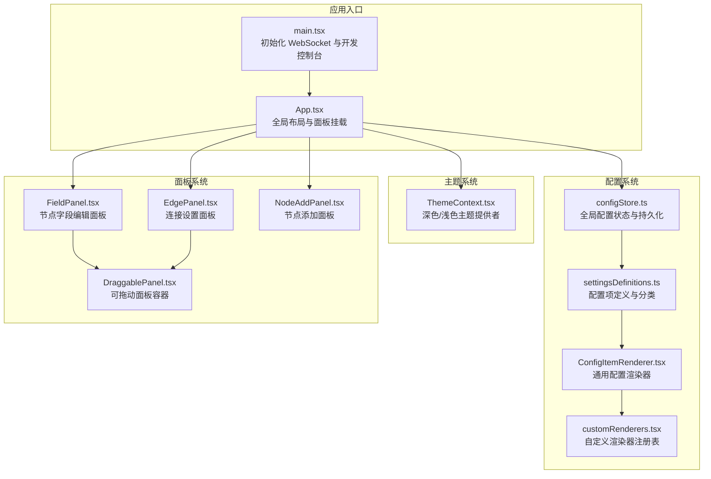
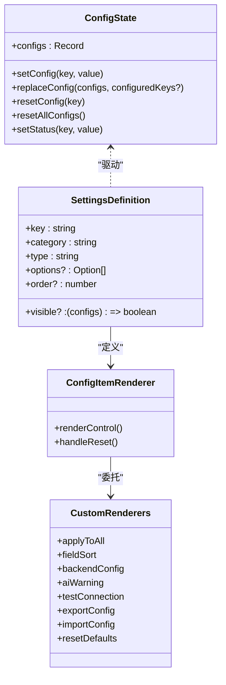
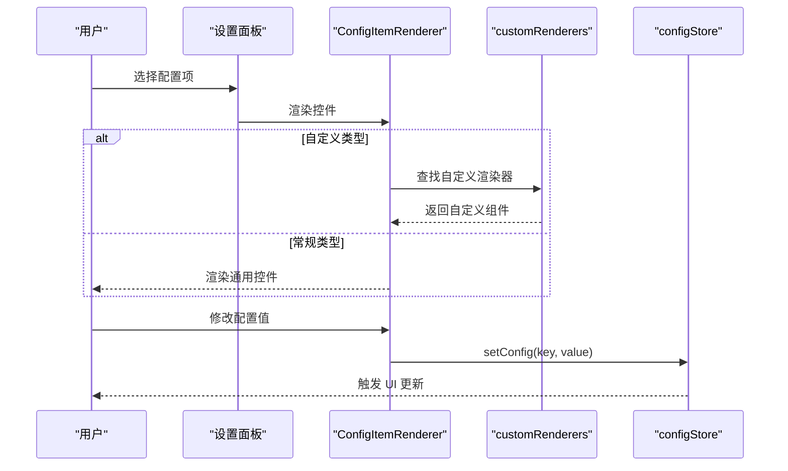
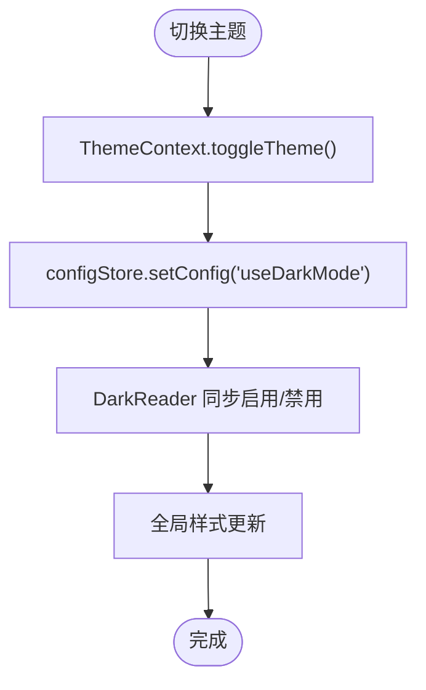
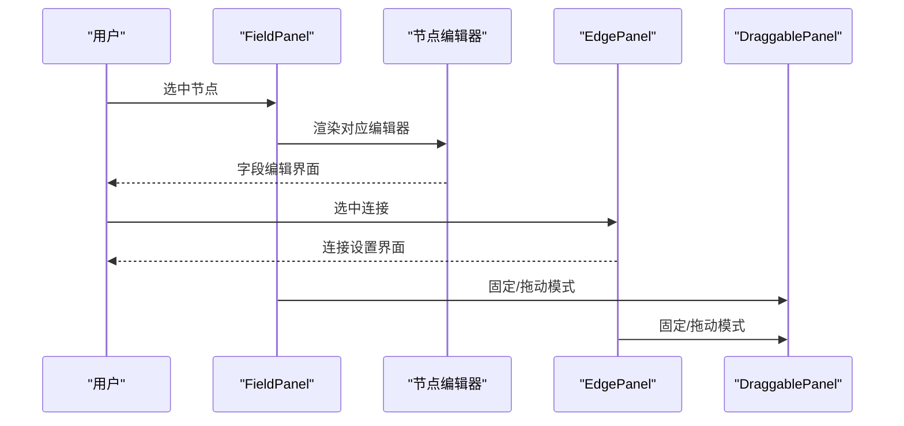
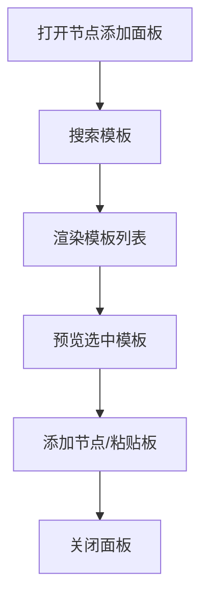
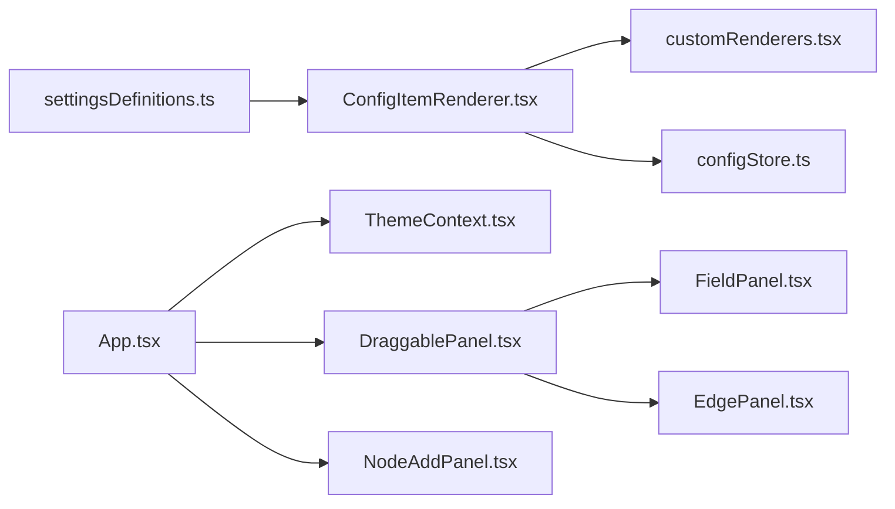

# 面板定制与扩展

<cite>
**本文档引用的文件**
- [App.tsx](file://src/App.tsx)
- [main.tsx](file://src/main.tsx)
- [ThemeContext.tsx](file://src/contexts/ThemeContext.tsx)
- [configStore.ts](file://src/stores/configStore.ts)
- [settingsDefinitions.ts](file://src/components/panels/settings/settingsDefinitions.ts)
- [ConfigItemRenderer.tsx](file://src/components/panels/settings/ConfigItemRenderer.tsx)
- [customRenderers.tsx](file://src/components/panels/settings/customRenderers.tsx)
- [DraggablePanel.tsx](file://src/components/panels/common/DraggablePanel.tsx)
- [FieldPanel.tsx](file://src/components/panels/main/FieldPanel.tsx)
- [EdgePanel.tsx](file://src/components/panels/main/EdgePanel.tsx)
- [NodeAddPanel.tsx](file://src/components/panels/main/NodeAddPanel.tsx)
</cite>

## 目录
1. [引言](#引言)
2. [项目结构](#项目结构)
3. [核心组件](#核心组件)
4. [架构总览](#架构总览)
5. [详细组件分析](#详细组件分析)
6. [依赖关系分析](#依赖关系分析)
7. [性能考量](#性能考量)
8. [故障排查指南](#故障排查指南)
9. [结论](#结论)
10. [附录](#附录)

## 引言
本文件面向希望深度定制与扩展 MaaPipelineEditor 面板系统的工程师与高级用户。文档围绕以下目标展开：
- 面板配置系统的设计原理与实现机制
- 自定义渲染器的开发与集成方法
- 面板主题定制与样式覆盖技术
- 新面板类型的开发流程与接口规范
- 面板扩展点与插件系统的使用指南
- 面板性能调优与用户体验优化技巧

## 项目结构
本项目采用前端 React + Zustand 状态管理的单页应用架构，面板系统由设置面板、字段面板、连接面板、节点添加面板等组成，配合可拖动面板容器与主题上下文实现灵活的布局与外观定制。

**图表来源**
- [main.tsx:1-20](file://src/main.tsx#L1-L20)
- [App.tsx:136-597](file://src/App.tsx#L136-L597)
- [ThemeContext.tsx:22-68](file://src/contexts/ThemeContext.tsx#L22-L68)
- [configStore.ts:270-440](file://src/stores/configStore.ts#L270-L440)
- [settingsDefinitions.ts:97-708](file://src/components/panels/settings/settingsDefinitions.ts#L97-L708)
- [ConfigItemRenderer.tsx:23-281](file://src/components/panels/settings/ConfigItemRenderer.tsx#L23-L281)
- [customRenderers.tsx:288-299](file://src/components/panels/settings/customRenderers.tsx#L288-L299)
- [FieldPanel.tsx:103-491](file://src/components/panels/main/FieldPanel.tsx#L103-L491)
- [EdgePanel.tsx:130-299](file://src/components/panels/main/EdgePanel.tsx#L130-L299)
- [NodeAddPanel.tsx:277-708](file://src/components/panels/main/NodeAddPanel.tsx#L277-L708)
- [DraggablePanel.tsx:37-178](file://src/components/panels/common/DraggablePanel.tsx#L37-L178)

**章节来源**
- [main.tsx:1-20](file://src/main.tsx#L1-L20)
- [App.tsx:136-597](file://src/App.tsx#L136-L597)

## 核心组件
- 主应用与布局：App.tsx 负责全局布局、嵌入模式桥接、面板可见性控制与主题提供者包裹。
- 主题系统：ThemeContext.tsx 提供深色/浅色主题切换与 DarkReader 同步。
- 配置系统：configStore.ts 定义配置项、默认值、分类映射、持久化与迁移逻辑；settingsDefinitions.ts 定义配置项元数据；ConfigItemRenderer.tsx 通用渲染器；customRenderers.tsx 自定义渲染器注册表。
- 面板系统：FieldPanel.tsx 与 EdgePanel.tsx 分别负责节点字段与连接设置；NodeAddPanel.tsx 负责节点模板选择与添加；DraggablePanel.tsx 提供统一的可拖动容器。

**章节来源**
- [ThemeContext.tsx:22-68](file://src/contexts/ThemeContext.tsx#L22-L68)
- [configStore.ts:118-440](file://src/stores/configStore.ts#L118-L440)
- [settingsDefinitions.ts:16-708](file://src/components/panels/settings/settingsDefinitions.ts#L16-L708)
- [ConfigItemRenderer.tsx:23-281](file://src/components/panels/settings/ConfigItemRenderer.tsx#L23-L281)
- [customRenderers.tsx:17-299](file://src/components/panels/settings/customRenderers.tsx#L17-L299)
- [FieldPanel.tsx:103-491](file://src/components/panels/main/FieldPanel.tsx#L103-L491)
- [EdgePanel.tsx:130-299](file://src/components/panels/main/EdgePanel.tsx#L130-L299)
- [NodeAddPanel.tsx:277-708](file://src/components/panels/main/NodeAddPanel.tsx#L277-L708)
- [DraggablePanel.tsx:37-178](file://src/components/panels/common/DraggablePanel.tsx#L37-L178)

## 架构总览
配置系统采用声明式定义 + 通用渲染器 + 自定义渲染器的组合模式：
- settingsDefinitions.ts 声明配置项元数据（分类、类型、提示、可见性、排序等）
- ConfigItemRenderer.tsx 根据类型渲染通用控件或委托给自定义渲染器
- customRenderers.tsx 注册自定义渲染器，实现复杂交互（如导出配置、测试连接、字段排序等）

**图表来源**
- [configStore.ts:178-413](file://src/stores/configStore.ts#L178-L413)
- [settingsDefinitions.ts:16-64](file://src/components/panels/settings/settingsDefinitions.ts#L16-L64)
- [ConfigItemRenderer.tsx:58-191](file://src/components/panels/settings/ConfigItemRenderer.tsx#L58-L191)
- [customRenderers.tsx:288-299](file://src/components/panels/settings/customRenderers.tsx#L288-L299)

## 详细组件分析

### 配置系统与设置面板
- 配置项定义：settingsDefinitions.ts 提供完整的配置项清单，包含分类、控件类型、选项、动态占位、动态提示、可见性与排序等。
- 通用渲染器：ConfigItemRenderer.tsx 支持开关、下拉、数字输入、文本输入、滑块、按钮等控件类型，并支持自定义渲染标识。
- 自定义渲染器：customRenderers.tsx 注册复杂交互组件，如一键应用端点方向、字段排序配置、后端配置卡片、AI 连接测试、配置导入导出与重置默认值等。
- 配置存储：configStore.ts 提供默认值、分类映射、持久化、迁移与批量替换能力；支持配置项的加解密（如 AI Key）与已配置追踪。

**图表来源**
- [settingsDefinitions.ts:97-708](file://src/components/panels/settings/settingsDefinitions.ts#L97-L708)
- [ConfigItemRenderer.tsx:58-191](file://src/components/panels/settings/ConfigItemRenderer.tsx#L58-L191)
- [customRenderers.tsx:17-299](file://src/components/panels/settings/customRenderers.tsx#L17-L299)
- [configStore.ts:270-311](file://src/stores/configStore.ts#L270-L311)

**章节来源**
- [settingsDefinitions.ts:97-708](file://src/components/panels/settings/settingsDefinitions.ts#L97-L708)
- [ConfigItemRenderer.tsx:23-281](file://src/components/panels/settings/ConfigItemRenderer.tsx#L23-L281)
- [customRenderers.tsx:17-299](file://src/components/panels/settings/customRenderers.tsx#L17-L299)
- [configStore.ts:118-440](file://src/stores/configStore.ts#L118-L440)

### 主题定制与样式覆盖
- 主题提供者：ThemeContext.tsx 通过 DarkReader 同步深色/浅色模式，并暴露切换与设置函数。
- 样式覆盖：各面板模块通过 Less 模块化样式文件进行局部覆盖，如 FieldPanel.module.less、EdgePanel.module.less 等，支持主题变量与组件样式隔离。

**图表来源**
- [ThemeContext.tsx:39-51](file://src/contexts/ThemeContext.tsx#L39-L51)
- [configStore.ts:270-311](file://src/stores/configStore.ts#L270-L311)

**章节来源**
- [ThemeContext.tsx:22-68](file://src/contexts/ThemeContext.tsx#L22-L68)
- [configStore.ts:118-177](file://src/stores/configStore.ts#L118-L177)

### 字段面板与连接面板
- 字段面板：FieldPanel.tsx 根据选中节点类型动态渲染对应编辑器（Pipeline、External、Anchor、Sticker、Group），内置错误边界与数据修复逻辑，支持进度遮罩与邻接信息 Tab。
- 连接面板：EdgePanel.tsx 展示连接信息（源/目标节点、类型标签、顺序、JumpBack），支持顺序调整与 JumpBack 开关。
- 可拖动容器：DraggablePanel.tsx 提供统一的拖动逻辑与位置持久化，支持固定/拖动两种模式。

**图表来源**
- [FieldPanel.tsx:236-288](file://src/components/panels/main/FieldPanel.tsx#L236-L288)
- [EdgePanel.tsx:24-50](file://src/components/panels/main/EdgePanel.tsx#L24-L50)
- [DraggablePanel.tsx:37-178](file://src/components/panels/common/DraggablePanel.tsx#L37-L178)

**章节来源**
- [FieldPanel.tsx:103-491](file://src/components/panels/main/FieldPanel.tsx#L103-L491)
- [EdgePanel.tsx:130-299](file://src/components/panels/main/EdgePanel.tsx#L130-L299)
- [DraggablePanel.tsx:37-178](file://src/components/panels/common/DraggablePanel.tsx#L37-L178)

### 节点添加面板与模板系统
- NodeAddPanel.tsx 提供节点模板选择、搜索、预览与添加功能；支持自定义模板与粘贴板节点批量粘贴；键盘导航与视口适配。
- 模板描述与图标：通过节点类型与识别/动作类型生成描述与图标，支持自定义模板删除。

**图表来源**
- [NodeAddPanel.tsx:277-708](file://src/components/panels/main/NodeAddPanel.tsx#L277-L708)

**章节来源**
- [NodeAddPanel.tsx:277-708](file://src/components/panels/main/NodeAddPanel.tsx#L277-L708)

### 新面板类型的开发流程与接口规范
- 面板容器：使用 DraggablePanel.tsx 作为统一容器，支持固定/拖动模式与位置持久化。
- 面板挂载：在 App.tsx 中根据嵌入模式与面板可见性控制渲染。
- 面板接口：
  - 状态管理：通过 useFlowStore 读写节点/连接状态，通过 useConfigStore 控制面板模式与可见性。
  - 错误处理：建议实现错误边界组件，捕获并提示修复方案。
  - 数据验证：对关键数据进行校验与修复，必要时提供一键修复按钮。
  - 用户体验：提供进度遮罩、Tab 切换、工具栏与快捷键支持。

**章节来源**
- [DraggablePanel.tsx:37-178](file://src/components/panels/common/DraggablePanel.tsx#L37-L178)
- [App.tsx:531-597](file://src/App.tsx#L531-L597)
- [FieldPanel.tsx:39-100](file://src/components/panels/main/FieldPanel.tsx#L39-L100)

### 面板扩展点与插件系统
- 配置扩展：在 settingsDefinitions.ts 中新增配置项定义，通过 type 与 customRender 标识扩展设置面板。
- 自定义渲染器：在 customRenderers.tsx 中注册新的渲染器组件，实现复杂交互。
- 模板扩展：通过自定义模板存储与 NodeAddPanel 的模板列表扩展节点模板库。
- 主题扩展：通过 ThemeContext.tsx 的主题变量与样式覆盖实现主题定制。

**章节来源**
- [settingsDefinitions.ts:97-708](file://src/components/panels/settings/settingsDefinitions.ts#L97-L708)
- [customRenderers.tsx:288-299](file://src/components/panels/settings/customRenderers.tsx#L288-L299)
- [NodeAddPanel.tsx:292-301](file://src/components/panels/main/NodeAddPanel.tsx#L292-L301)
- [ThemeContext.tsx:22-68](file://src/contexts/ThemeContext.tsx#L22-L68)

## 依赖关系分析
- 配置系统依赖：settingsDefinitions.ts → ConfigItemRenderer.tsx → customRenderers.tsx → configStore.ts
- 面板系统依赖：App.tsx → ThemeContext.tsx → DraggablePanel.tsx → FieldPanel.tsx/EdgePanel.tsx/NodeAddPanel.tsx
- 状态管理：configStore.ts 与 flowStore（在面板中使用）共同驱动 UI 更新

**图表来源**
- [settingsDefinitions.ts:97-708](file://src/components/panels/settings/settingsDefinitions.ts#L97-L708)
- [ConfigItemRenderer.tsx:23-281](file://src/components/panels/settings/ConfigItemRenderer.tsx#L23-L281)
- [customRenderers.tsx:288-299](file://src/components/panels/settings/customRenderers.tsx#L288-L299)
- [configStore.ts:270-440](file://src/stores/configStore.ts#L270-L440)
- [App.tsx:136-597](file://src/App.tsx#L136-L597)
- [ThemeContext.tsx:22-68](file://src/contexts/ThemeContext.tsx#L22-L68)
- [DraggablePanel.tsx:37-178](file://src/components/panels/common/DraggablePanel.tsx#L37-L178)
- [FieldPanel.tsx:103-491](file://src/components/panels/main/FieldPanel.tsx#L103-L491)
- [EdgePanel.tsx:130-299](file://src/components/panels/main/EdgePanel.tsx#L130-L299)
- [NodeAddPanel.tsx:277-708](file://src/components/panels/main/NodeAddPanel.tsx#L277-L708)

**章节来源**
- [configStore.ts:270-440](file://src/stores/configStore.ts#L270-L440)
- [App.tsx:136-597](file://src/App.tsx#L136-L597)

## 性能考量
- 配置渲染性能：ConfigItemRenderer.tsx 通过 memo 与 useMemo 降低重渲染频率；自定义渲染器应避免不必要的副作用。
- 面板渲染性能：FieldPanel.tsx/EdgePanel.tsx 在加载时使用遮罩层与进度提示，避免长时间阻塞 UI；建议对耗时操作异步执行。
- 主题切换性能：ThemeContext.tsx 通过 DarkReader 同步切换，注意避免频繁切换导致的样式抖动。
- 拖动性能：DraggablePanel.tsx 在拖动过程中限制边界与节流更新，确保拖动顺滑。

[本节为通用指导，不涉及具体文件分析]

## 故障排查指南
- 配置异常：检查 configStore.ts 的默认值与分类映射，确认配置项是否正确持久化与迁移。
- 渲染异常：FieldPanel.tsx/EdgePanel.tsx 内置错误边界，捕获节点编辑器渲染错误并提供修复建议。
- 主题异常：确认 ThemeContext.tsx 的主题状态与 DarkReader 同步状态一致。
- 面板定位异常：检查 DraggablePanel.tsx 的位置计算与边界限制逻辑。

**章节来源**
- [configStore.ts:312-366](file://src/stores/configStore.ts#L312-L366)
- [FieldPanel.tsx:39-100](file://src/components/panels/main/FieldPanel.tsx#L39-L100)
- [ThemeContext.tsx:27-37](file://src/contexts/ThemeContext.tsx#L27-L37)
- [DraggablePanel.tsx:103-146](file://src/components/panels/common/DraggablePanel.tsx#L103-L146)

## 结论
本项目通过声明式配置定义、通用渲染器与自定义渲染器的组合，实现了高度可扩展的面板配置系统；通过主题上下文与可拖动面板容器，提供了灵活的外观与布局定制能力。遵循本文档的开发流程与最佳实践，可高效地扩展新面板类型、完善配置项与提升用户体验。

[本节为总结性内容，不涉及具体文件分析]

## 附录
- 嵌入模式与面板可见性：App.tsx 中根据嵌入模式与面板隐藏策略控制面板渲染。
- 面板模式：configStore.ts 定义了字段面板模式（固定/拖动/内嵌），不同模式影响面板布局与交互。

**章节来源**
- [App.tsx:531-597](file://src/App.tsx#L531-L597)
- [configStore.ts:155-173](file://src/stores/configStore.ts#L155-L173)