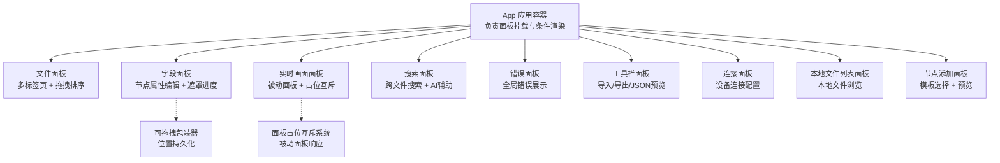
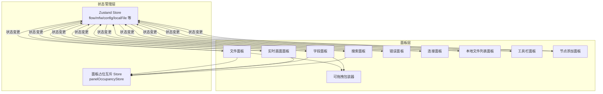
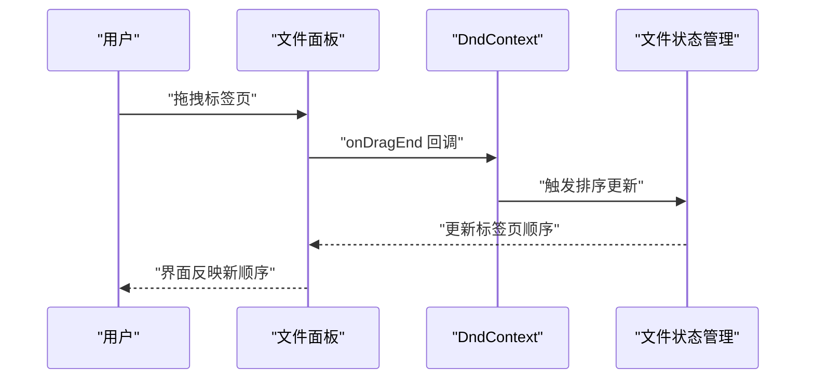
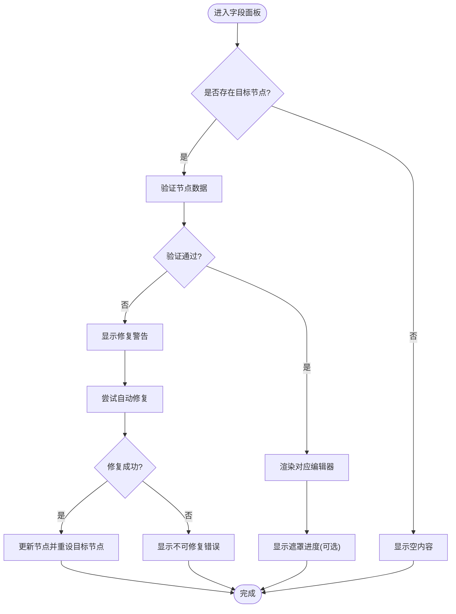
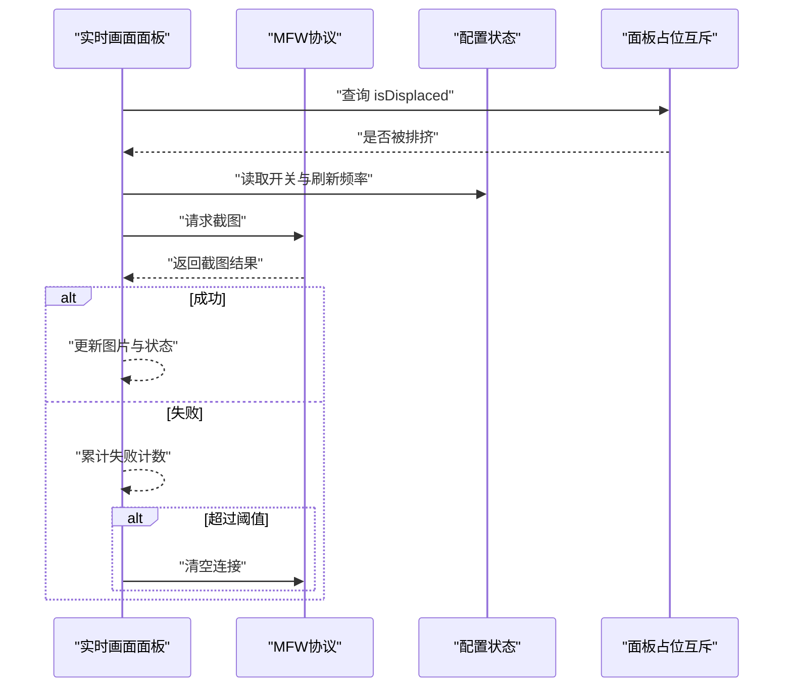
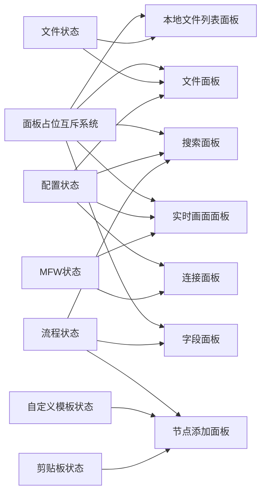

# 面板组件系统

<cite>
**本文档引用的文件**
- [App.tsx](file://src/App.tsx)
- [FilePanel.tsx](file://src/components/panels/main/FilePanel.tsx)
- [ConnectionPanel.tsx](file://src/components/panels/main/ConnectionPanel.tsx)
- [FieldPanel.tsx](file://src/components/panels/main/FieldPanel.tsx)
- [DraggablePanel.tsx](file://src/components/panels/common/DraggablePanel.tsx)
- [panelOccupancyStore.ts](file://src/stores/panelOccupancyStore.ts)
- [usePanelOccupancy.ts](file://src/hooks/usePanelOccupancy.ts)
- [LiveScreenPanel.tsx](file://src/components/panels/main/LiveScreenPanel.tsx)
- [LocalFileListPanel.tsx](file://src/components/panels/main/LocalFileListPanel.tsx)
- [SearchPanel.tsx](file://src/components/panels/main/SearchPanel.tsx)
- [ErrorPanel.tsx](file://src/components/panels/main/ErrorPanel.tsx)
- [ToolbarPanel.tsx](file://src/components/panels/main/ToolbarPanel.tsx)
- [NodeAddPanel.tsx](file://src/components/panels/main/NodeAddPanel.tsx)
- [flow/index.ts](file://src/stores/flow/index.ts)
</cite>

## 目录
1. [简介](#简介)
2. [项目结构](#项目结构)
3. [核心组件](#核心组件)
4. [架构总览](#架构总览)
5. [详细组件分析](#详细组件分析)
6. [依赖关系分析](#依赖关系分析)
7. [性能考量](#性能考量)
8. [故障排查指南](#故障排查指南)
9. [结论](#结论)
10. [附录](#附录)

## 简介
本文件系统性梳理面板组件体系的整体架构与布局策略，深入分析文件面板、连接面板、工具面板等关键组件的功能实现，详解状态管理与数据绑定机制，阐述面板间通信与协作模式，并提供定制与扩展指南以及拖拽、缩放等交互功能的实现要点。

## 项目结构
面板组件系统采用“右侧主工作区 + 多面板组合”的布局策略，核心面板包括：文件面板、字段面板、边缘面板、实时画面面板、搜索面板、错误面板、工具面板、连接面板、本地文件列表面板等。这些面板通过统一的布局容器进行挂载，部分面板支持可拖拽定位与占位互斥。

图表来源
- [App.tsx:537-593](file://src/App.tsx#L537-L593)
- [FilePanel.tsx:48-165](file://src/components/panels/main/FilePanel.tsx#L48-L165)
- [FieldPanel.tsx:103-491](file://src/components/panels/main/FieldPanel.tsx#L103-L491)
- [DraggablePanel.tsx:37-178](file://src/components/panels/common/DraggablePanel.tsx#L37-L178)
- [LiveScreenPanel.tsx:15-156](file://src/components/panels/main/LiveScreenPanel.tsx#L15-L156)
- [panelOccupancyStore.ts:87-136](file://src/stores/panelOccupancyStore.ts#L87-L136)
- [SearchPanel.tsx:28-437](file://src/components/panels/main/SearchPanel.tsx#L28-L437)
- [ErrorPanel.tsx:8-38](file://src/components/panels/main/ErrorPanel.tsx#L8-L38)
- [ToolbarPanel.tsx:11-22](file://src/components/panels/main/ToolbarPanel.tsx#L11-L22)
- [ConnectionPanel.tsx:51-954](file://src/components/panels/main/ConnectionPanel.tsx#L51-L954)
- [LocalFileListPanel.tsx:21-174](file://src/components/panels/main/LocalFileListPanel.tsx#L21-L174)
- [NodeAddPanel.tsx:277-708](file://src/components/panels/main/NodeAddPanel.tsx#L277-L708)

章节来源
- [App.tsx:537-593](file://src/App.tsx#L537-L593)

## 核心组件
- 文件面板：提供文件名输入、本地文件入口、可拖拽排序的标签页集合，支持新增/删除文件标签。
- 字段面板：基于目标节点类型动态渲染对应编辑器，支持遮罩进度、错误边界与节点修复。
- 实时画面面板：被动面板，随连接状态与占位互斥自动显示/隐藏，定时抓取设备画面。
- 搜索面板：支持跨文件节点搜索、AI辅助定位、节点列表弹出。
- 错误面板：全局错误聚合展示。
- 工具栏面板：导入、导出、JSON预览等常用工具入口。
- 连接面板：设备连接配置抽屉，支持ADB、Win32、PlayCover、Gamepad、WlRoots、macOS等多平台。
- 本地文件列表面板：本地文件浏览与打开。
- 节点添加面板：模板选择、粘贴板节点粘贴、节点预览与键盘导航。
- 可拖拽包装器：统一的面板拖拽定位与位置持久化。

章节来源
- [FilePanel.tsx:48-165](file://src/components/panels/main/FilePanel.tsx#L48-L165)
- [FieldPanel.tsx:103-491](file://src/components/panels/main/FieldPanel.tsx#L103-L491)
- [LiveScreenPanel.tsx:15-156](file://src/components/panels/main/LiveScreenPanel.tsx#L15-L156)
- [SearchPanel.tsx:28-437](file://src/components/panels/main/SearchPanel.tsx#L28-L437)
- [ErrorPanel.tsx:8-38](file://src/components/panels/main/ErrorPanel.tsx#L8-L38)
- [ToolbarPanel.tsx:11-22](file://src/components/panels/main/ToolbarPanel.tsx#L11-L22)
- [ConnectionPanel.tsx:51-954](file://src/components/panels/main/ConnectionPanel.tsx#L51-L954)
- [LocalFileListPanel.tsx:21-174](file://src/components/panels/main/LocalFileListPanel.tsx#L21-L174)
- [NodeAddPanel.tsx:277-708](file://src/components/panels/main/NodeAddPanel.tsx#L277-L708)
- [DraggablePanel.tsx:37-178](file://src/components/panels/common/DraggablePanel.tsx#L37-L178)

## 架构总览
面板系统采用“声明式注册 + 响应式互斥”的占位系统，主动面板可抢占区域，被动面板仅观察；同时通过Zustand状态管理实现面板间解耦的数据绑定与事件传播。文件面板与字段面板分别绑定文件状态与流程状态，连接面板与实时画面面板通过MFW协议与本地服务进行双向通信。

图表来源
- [panelOccupancyStore.ts:87-136](file://src/stores/panelOccupancyStore.ts#L87-L136)
- [usePanelOccupancy.ts:16-61](file://src/hooks/usePanelOccupancy.ts#L16-L61)
- [flow/index.ts:18-28](file://src/stores/flow/index.ts#L18-L28)
- [App.tsx:537-593](file://src/App.tsx#L537-L593)

## 详细组件分析

### 文件面板（多标签页 + 拖拽排序）
- 功能要点
  - 文件名输入与校验，错误状态反馈。
  - 本地文件入口按钮，切换本地文件面板显示。
  - 可拖拽排序的标签页集合，支持新增/删除标签。
  - DnDKit实现拖拽排序，碰撞检测与排序策略。
- 状态绑定
  - 绑定文件状态：文件列表、当前文件名、切换文件、重命名校验、拖拽排序回调。
  - 绑定配置状态：控制本地文件面板显隐。
- 交互细节
  - 标签页渲染通过SortableContext包裹，DndContext提供传感器与碰撞检测。
  - 拖拽结束回调由文件状态管理器处理，保证排序持久化。

图表来源
- [FilePanel.tsx:136-158](file://src/components/panels/main/FilePanel.tsx#L136-L158)
- [FilePanel.tsx:84-86](file://src/components/panels/main/FilePanel.tsx#L84-L86)

章节来源
- [FilePanel.tsx:48-165](file://src/components/panels/main/FilePanel.tsx#L48-L165)

### 字段面板（节点属性编辑 + 遮罩进度）
- 功能要点
  - 基于目标节点类型动态渲染编辑器（Pipeline/External/Anchor/Sticker/Group）。
  - 支持遮罩层显示异步进度与阶段说明。
  - 错误边界捕获渲染异常并提供修复建议。
  - 节点数据验证与自动修复。
  - JSON编辑器模态框。
- 状态绑定
  - 绑定流程状态：目标节点、节点更新、历史记录。
  - 绑定配置状态：面板模式（内联/可拖拽/固定）。
  - 绑定面板占位：激活/释放区域，被动面板被排挤时自动取消选择。
- 交互细节
  - 面板模式为可拖拽时，使用可拖拽包装器定位与持久化位置。
  - 节点被修复后自动更新目标节点引用。

图表来源
- [FieldPanel.tsx:192-204](file://src/components/panels/main/FieldPanel.tsx#L192-L204)
- [FieldPanel.tsx:178-189](file://src/components/panels/main/FieldPanel.tsx#L178-L189)
- [FieldPanel.tsx:207-345](file://src/components/panels/main/FieldPanel.tsx#L207-L345)

章节来源
- [FieldPanel.tsx:103-491](file://src/components/panels/main/FieldPanel.tsx#L103-L491)
- [DraggablePanel.tsx:37-178](file://src/components/panels/common/DraggablePanel.tsx#L37-L178)
- [usePanelOccupancy.ts:16-61](file://src/hooks/usePanelOccupancy.ts#L16-L61)

### 实时画面面板（被动面板 + 占位互斥）
- 功能要点
  - 被动面板：当区域有主动面板激活时自动隐藏。
  - 定时抓取设备画面，失败阈值自动断开连接。
  - 页面不可见时暂停请求，降低资源消耗。
- 状态绑定
  - 绑定MFW状态：连接状态、控制器ID、清空连接。
  - 绑定配置状态：开关与刷新频率。
  - 绑定面板占位：isDisplaced决定显示/隐藏。
- 交互细节
  - 监听截图结果，成功更新图片，失败累计计数并触发断连。

图表来源
- [LiveScreenPanel.tsx:50-78](file://src/components/panels/main/LiveScreenPanel.tsx#L50-L78)
- [LiveScreenPanel.tsx:80-108](file://src/components/panels/main/LiveScreenPanel.tsx#L80-L108)
- [LiveScreenPanel.tsx:19-22](file://src/components/panels/main/LiveScreenPanel.tsx#L19-L22)

章节来源
- [LiveScreenPanel.tsx:15-156](file://src/components/panels/main/LiveScreenPanel.tsx#L15-L156)
- [panelOccupancyStore.ts:87-136](file://src/stores/panelOccupancyStore.ts#L87-L136)
- [usePanelOccupancy.ts:16-61](file://src/hooks/usePanelOccupancy.ts#L16-L61)

### 搜索面板（跨文件搜索 + AI辅助）
- 功能要点
  - 跨文件节点搜索，防抖优化，支持当前文件与其它文件跳转。
  - AI辅助搜索：构建节点上下文，发送给AI客户端，定位节点。
  - 节点列表弹出，支持占位互斥与焦点管理。
- 状态绑定
  - 绑定流程状态：节点列表、画布实例、节点定位。
  - 绑定配置状态：跨文件搜索开关。
  - 绑定面板占位：节点列表面板的激活/释放。
- 交互细节
  - 输入变化触发防抖搜索，生成下拉选项。
  - 回车键优先跳转到首个结果，否则在当前文件定位。

章节来源
- [SearchPanel.tsx:28-437](file://src/components/panels/main/SearchPanel.tsx#L28-L437)

### 连接面板（设备连接配置）
- 功能要点
  - 多平台设备连接：ADB、Win32、PlayCover、Gamepad、WlRoots、macOS。
  - 设备列表刷新、手动连接参数、默认方法过滤、连接/断开。
  - 连接状态徽章、错误提示、当前设备判断。
- 状态绑定
  - 绑定MFW状态：连接状态、控制器ID、设备信息、设备列表。
  - 绑定持久化配置：各平台参数与默认值。
  - 绑定协议：通过mfwProtocol发起连接/断开/刷新。
- 交互细节
  - 首次打开未连接时自动刷新设备列表。
  - 已连接设备时根据类型自动定位Tab与选中设备。

章节来源
- [ConnectionPanel.tsx:51-954](file://src/components/panels/main/ConnectionPanel.tsx#L51-L954)

### 本地文件列表面板（本地文件浏览）
- 功能要点
  - 展示本地文件根路径、文件数量、搜索过滤。
  - 刷新文件列表、打开文件、关闭面板。
- 状态绑定
  - 绑定本地文件状态：根路径、文件列表、刷新状态。
  - 绑定配置状态：跨文件搜索文件夹过滤规则。
  - 绑定本地服务：连接状态与消息协议。
- 交互细节
  - 搜索框支持大小写不敏感模糊匹配文件名与相对路径。

章节来源
- [LocalFileListPanel.tsx:21-174](file://src/components/panels/main/LocalFileListPanel.tsx#L21-L174)

### 工具栏面板（导入/导出/JSON预览）
- 功能要点
  - 集成导入、导出、JSON预览按钮。
  - 位于界面右上角，便于快速操作。
- 状态绑定
  - 通过App容器条件渲染，支持嵌入模式隐藏。

章节来源
- [ToolbarPanel.tsx:11-22](file://src/components/panels/main/ToolbarPanel.tsx#L11-L22)
- [App.tsx:549-549](file://src/App.tsx#L549-L549)

### 节点添加面板（模板选择 + 预览）
- 功能要点
  - 模板搜索与过滤，支持自定义模板删除。
  - 节点预览：识别/动作/其他参数可视化。
  - 粘贴板节点粘贴，键盘导航（上下/回车/ESC）。
- 状态绑定
  - 绑定流程状态：添加节点、粘贴节点。
  - 绑定自定义模板状态：模板增删改查。
  - 绑定剪贴板状态：节点/边集合。
- 交互细节
  - 面板位置根据鼠标位置与容器宽度自动调整左右布局，避免越界。

章节来源
- [NodeAddPanel.tsx:277-708](file://src/components/panels/main/NodeAddPanel.tsx#L277-L708)

### 可拖拽包装器（位置持久化）
- 功能要点
  - 通过标题栏拖动面板，拖动时限制边界，拖动结束后写入位置存储。
  - 面板位置来自store，若未设置则按默认位置初始化。
- 状态绑定
  - 使用独立的面板位置store，字段面板与边缘面板共享位置。
- 交互细节
  - 仅标题区域可拖动，避免误触按钮。

章节来源
- [DraggablePanel.tsx:37-178](file://src/components/panels/common/DraggablePanel.tsx#L37-L178)

## 依赖关系分析
- 面板占位互斥系统
  - 主动面板：field、edge、nodeList、json等，可抢占区域。
  - 被动面板：liveScreen、recognition、explorationFAB等，区域有激活者即隐藏。
  - 反应形态：close（关闭）、hide（隐藏）、offset（偏移）。
- 状态依赖
  - 文件面板依赖文件状态与配置状态。
  - 字段面板依赖流程状态与配置状态，同时与面板占位系统联动。
  - 实时画面面板依赖MFW状态与面板占位系统。
  - 搜索面板依赖流程状态与配置状态，同时与节点列表面板联动。
  - 连接面板依赖MFW状态与持久化配置。
  - 本地文件列表面板依赖本地文件状态与配置状态。
  - 节点添加面板依赖流程状态、自定义模板状态与剪贴板状态。

图表来源
- [panelOccupancyStore.ts:47-84](file://src/stores/panelOccupancyStore.ts#L47-L84)
- [usePanelOccupancy.ts:16-61](file://src/hooks/usePanelOccupancy.ts#L16-L61)
- [flow/index.ts:18-28](file://src/stores/flow/index.ts#L18-L28)
- [App.tsx:537-593](file://src/App.tsx#L537-L593)

章节来源
- [panelOccupancyStore.ts:87-136](file://src/stores/panelOccupancyStore.ts#L87-L136)
- [usePanelOccupancy.ts:16-61](file://src/hooks/usePanelOccupancy.ts#L16-L61)
- [flow/index.ts:18-28](file://src/stores/flow/index.ts#L18-L28)

## 性能考量
- 防抖搜索：搜索面板对跨文件搜索使用防抖，减少频繁请求。
- 页面可见性：实时画面面板在页面不可见时暂停截图请求，降低CPU/GPU占用。
- 连续失败阈值：实时画面面板在多次失败后自动断开连接，避免无效重试。
- 节点验证与修复：字段面板在渲染前进行数据验证，失败时提供修复路径，减少无效渲染。
- 视图适配：节点添加面板根据容器宽度自动调整布局方向，避免越界导致的重绘。

## 故障排查指南
- 实时画面面板不显示
  - 检查连接状态与控制器ID是否有效。
  - 确认面板占位互斥系统是否被主动面板抢占。
  - 检查配置中的开关与刷新频率设置。
- 搜索面板无结果
  - 确认跨文件搜索开关已启用。
  - 检查节点上下文是否为空，AI搜索需要至少一个节点。
- 连接面板无法连接
  - 检查设备列表是否已刷新，手动连接模式需填写ADB路径与地址。
  - 确认所选设备方法列表非空。
- 字段面板渲染异常
  - 查看错误边界提示，尝试应用自动修复。
  - 检查节点数据结构完整性。
- 文件面板标签拖拽无效
  - 确认DnD传感器与碰撞检测配置正确。
  - 检查排序回调是否被正确触发。

章节来源
- [LiveScreenPanel.tsx:44-48](file://src/components/panels/main/LiveScreenPanel.tsx#L44-L48)
- [SearchPanel.tsx:66-92](file://src/components/panels/main/SearchPanel.tsx#L66-L92)
- [ConnectionPanel.tsx:345-355](file://src/components/panels/main/ConnectionPanel.tsx#L345-L355)
- [FieldPanel.tsx:40-100](file://src/components/panels/main/FieldPanel.tsx#L40-L100)
- [FilePanel.tsx:71-73](file://src/components/panels/main/FilePanel.tsx#L71-L73)

## 结论
面板组件系统通过声明式注册与响应式互斥实现了清晰的区域管理，结合Zustand状态管理与协议层通信，形成了高内聚低耦合的架构。文件面板、字段面板、实时画面面板、搜索面板、连接面板等核心组件覆盖了从文件管理、节点编辑、设备连接到跨文件检索的完整工作流。可拖拽包装器与占位互斥系统提升了用户体验与空间利用率。未来可在以下方面持续优化：进一步抽象面板生命周期钩子、增强面板间事件总线、完善主题与无障碍支持。

## 附录
- 定制与扩展指南
  - 新增主动面板：在注册表中注册面板描述符，选择合适的反应形态与区域。
  - 新增被动面板：标记为passive，利用占位系统自动响应。
  - 面板拖拽：使用可拖拽包装器，注意标题区域拦截与边界限制。
  - 状态绑定：遵循单一职责，尽量通过Zustand切片管理状态，避免跨面板紧耦合。
  - 交互优化：为复杂面板增加防抖、节流与错误边界，提升稳定性与用户体验。