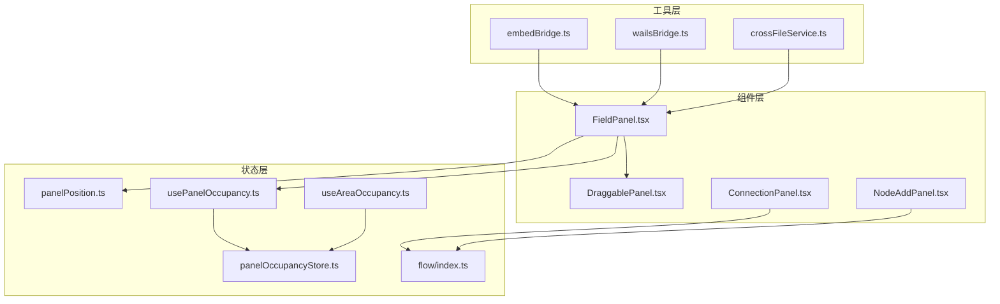
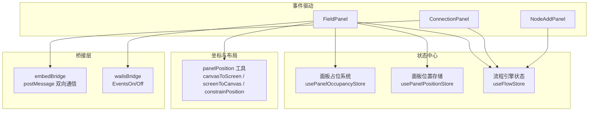
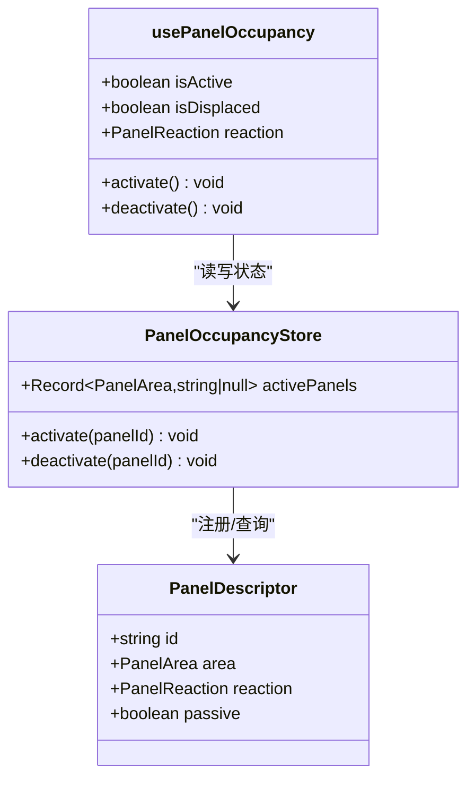
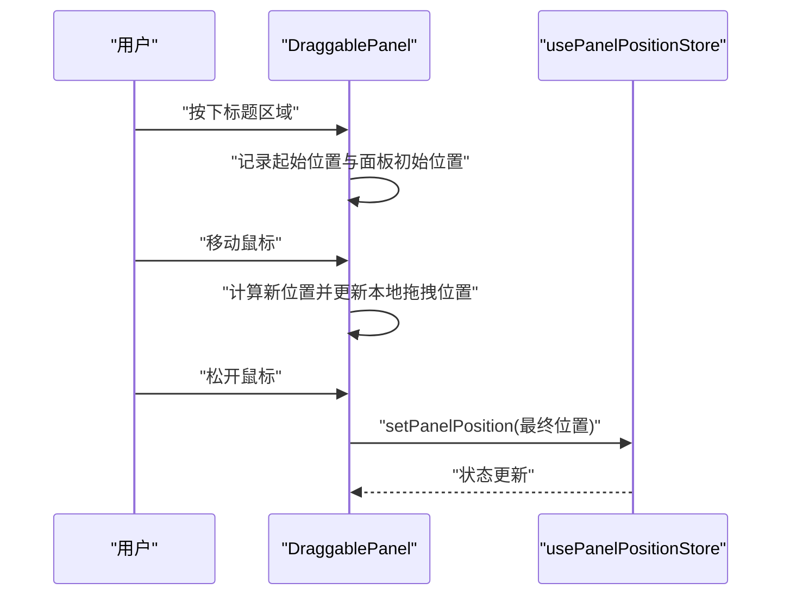
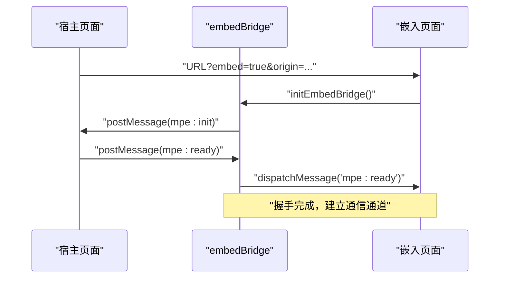
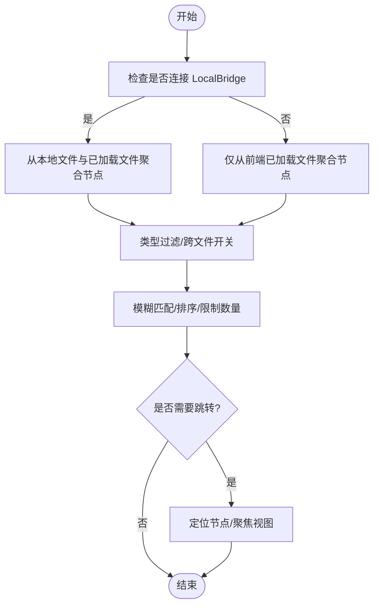
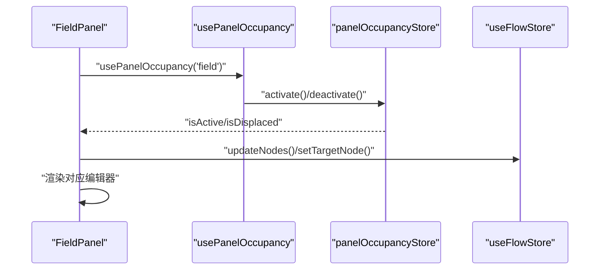
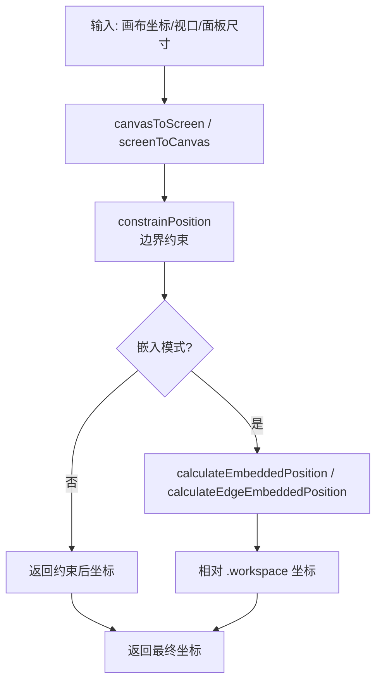
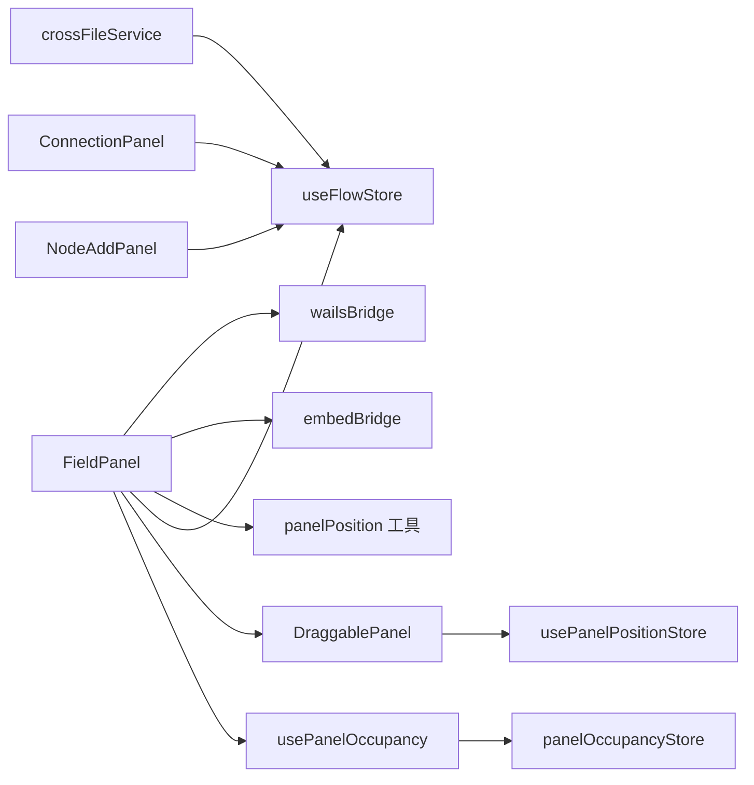

# 面板通信机制

<cite>
**本文档引用的文件**
- [DraggablePanel.tsx](file://src/components/panels/common/DraggablePanel.tsx)
- [panelOccupancyStore.ts](file://src/stores/panelOccupancyStore.ts)
- [usePanelOccupancy.ts](file://src/hooks/usePanelOccupancy.ts)
- [useAreaOccupancy.ts](file://src/hooks/useAreaOccupancy.ts)
- [panelPosition.ts](file://src/utils/ui/panelPosition.ts)
- [FieldPanel.tsx](file://src/components/panels/main/FieldPanel.tsx)
- [ConnectionPanel.tsx](file://src/components/panels/main/ConnectionPanel.tsx)
- [NodeAddPanel.tsx](file://src/components/panels/main/NodeAddPanel.tsx)
- [crossFileService.ts](file://src/services/crossFileService.ts)
- [embedBridge.ts](file://src/utils/embedBridge.ts)
- [wailsBridge.ts](file://src/utils/wailsBridge.ts)
- [flow/index.ts](file://src/stores/flow/index.ts)
</cite>

## 目录
1. [引言](#引言)
2. [项目结构](#项目结构)
3. [核心组件](#核心组件)
4. [架构总览](#架构总览)
5. [详细组件分析](#详细组件分析)
6. [依赖关系分析](#依赖关系分析)
7. [性能考虑](#性能考虑)
8. [故障排查指南](#故障排查指南)
9. [结论](#结论)

## 引言
本文件系统性梳理面板通信机制，涵盖面板间数据交换与事件传递、拖拽面板组件的实现原理与交互逻辑、面板占用空间管理与布局协调算法、面板状态同步与数据绑定方式，并提供最佳实践与性能优化建议以及生命周期与内存清理策略。

## 项目结构
本项目采用“功能域 + 层次化”的组织方式：
- 组件层：面板组件位于 `src/components/panels/`，通用可复用组件位于 `src/components/panels/common/`
- 状态层：使用 Zustand 管理全局状态，面板占用系统位于 `src/stores/panelOccupancyStore.ts`
- 工具层：UI 布局与坐标转换位于 `src/utils/ui/panelPosition.ts`，嵌入桥接位于 `src/utils/embedBridge.ts`，Wails 桥接位于 `src/utils/wailsBridge.ts`
- 服务层：跨文件节点搜索与导航位于 `src/services/crossFileService.ts`
- 流程引擎状态：位于 `src/stores/flow/`

**图表来源**
- [DraggablePanel.tsx:1-178](file://src/components/panels/common/DraggablePanel.tsx#L1-L178)
- [panelOccupancyStore.ts:1-136](file://src/stores/panelOccupancyStore.ts#L1-L136)
- [usePanelOccupancy.ts:1-61](file://src/hooks/usePanelOccupancy.ts#L1-L61)
- [useAreaOccupancy.ts:1-30](file://src/hooks/useAreaOccupancy.ts#L1-L30)
- [panelPosition.ts:1-263](file://src/utils/ui/panelPosition.ts#L1-L263)
- [FieldPanel.tsx:1-491](file://src/components/panels/main/FieldPanel.tsx#L1-L491)
- [ConnectionPanel.tsx:1-954](file://src/components/panels/main/ConnectionPanel.tsx#L1-L954)
- [NodeAddPanel.tsx:1-708](file://src/components/panels/main/NodeAddPanel.tsx#L1-L708)
- [crossFileService.ts:1-740](file://src/services/crossFileService.ts#L1-L740)
- [embedBridge.ts:1-282](file://src/utils/embedBridge.ts#L1-L282)
- [wailsBridge.ts:1-387](file://src/utils/wailsBridge.ts#L1-L387)
- [flow/index.ts:1-124](file://src/stores/flow/index.ts#L1-L124)

**章节来源**
- [DraggablePanel.tsx:1-178](file://src/components/panels/common/DraggablePanel.tsx#L1-L178)
- [panelOccupancyStore.ts:1-136](file://src/stores/panelOccupancyStore.ts#L1-L136)
- [usePanelOccupancy.ts:1-61](file://src/hooks/usePanelOccupancy.ts#L1-L61)
- [useAreaOccupancy.ts:1-30](file://src/hooks/useAreaOccupancy.ts#L1-L30)
- [panelPosition.ts:1-263](file://src/utils/ui/panelPosition.ts#L1-L263)
- [FieldPanel.tsx:1-491](file://src/components/panels/main/FieldPanel.tsx#L1-L491)
- [ConnectionPanel.tsx:1-954](file://src/components/panels/main/ConnectionPanel.tsx#L1-L954)
- [NodeAddPanel.tsx:1-708](file://src/components/panels/main/NodeAddPanel.tsx#L1-L708)
- [crossFileService.ts:1-740](file://src/services/crossFileService.ts#L1-L740)
- [embedBridge.ts:1-282](file://src/utils/embedBridge.ts#L1-L282)
- [wailsBridge.ts:1-387](file://src/utils/wailsBridge.ts#L1-L387)
- [flow/index.ts:1-124](file://src/stores/flow/index.ts#L1-L124)

## 核心组件
- 面板占位互斥系统：通过注册表与 Zustand store 管理面板区域的激活状态，实现主动/被动面板的抢占与排挤行为
- 可拖动面板包装器：提供统一的拖拽交互、位置存储与边界约束
- 嵌入桥接与 Wails 桥接：分别负责 iframe 嵌入模式双向通信与桌面端事件监听
- 跨文件服务：提供节点搜索、跳转、自动完成等跨文件能力
- 流程引擎状态：集中管理节点、连线、视图、历史等状态，为面板提供数据绑定

**章节来源**
- [panelOccupancyStore.ts:1-136](file://src/stores/panelOccupancyStore.ts#L1-L136)
- [DraggablePanel.tsx:1-178](file://src/components/panels/common/DraggablePanel.tsx#L1-L178)
- [embedBridge.ts:1-282](file://src/utils/embedBridge.ts#L1-L282)
- [wailsBridge.ts:1-387](file://src/utils/wailsBridge.ts#L1-L387)
- [crossFileService.ts:1-740](file://src/services/crossFileService.ts#L1-L740)
- [flow/index.ts:1-124](file://src/stores/flow/index.ts#L1-L124)

## 架构总览
面板通信机制由“状态中心 + 事件驱动 + 坐标转换 + 嵌入桥接”构成：

**图表来源**
- [panelOccupancyStore.ts:87-135](file://src/stores/panelOccupancyStore.ts#L87-L135)
- [DraggablePanel.tsx:19-22](file://src/components/panels/common/DraggablePanel.tsx#L19-L22)
- [panelPosition.ts:15-82](file://src/utils/ui/panelPosition.ts#L15-L82)
- [FieldPanel.tsx:103-128](file://src/components/panels/main/FieldPanel.tsx#L103-L128)
- [ConnectionPanel.tsx:1-954](file://src/components/panels/main/ConnectionPanel.tsx#L1-L954)
- [NodeAddPanel.tsx:1-708](file://src/components/panels/main/NodeAddPanel.tsx#L1-L708)
- [embedBridge.ts:179-244](file://src/utils/embedBridge.ts#L179-L244)
- [wailsBridge.ts:64-86](file://src/utils/wailsBridge.ts#L64-L86)
- [flow/index.ts:1-28](file://src/stores/flow/index.ts#L1-L28)

## 详细组件分析

### 面板占位互斥系统
- 注册表：在应用初始化时注册各面板的区域、反应形态与被动属性
- 激活/释放：主动面板可抢占区域；仅当面板为当前激活者时才允许释放
- 被动面板：区域被激活时即视为被排挤，反应形态决定关闭、隐藏或偏移

**图表来源**
- [panelOccupancyStore.ts:18-45](file://src/stores/panelOccupancyStore.ts#L18-L45)
- [panelOccupancyStore.ts:87-135](file://src/stores/panelOccupancyStore.ts#L87-L135)
- [usePanelOccupancy.ts:16-60](file://src/hooks/usePanelOccupancy.ts#L16-L60)

**章节来源**
- [panelOccupancyStore.ts:1-136](file://src/stores/panelOccupancyStore.ts#L1-L136)
- [usePanelOccupancy.ts:1-61](file://src/hooks/usePanelOccupancy.ts#L1-L61)

### 可拖动面板组件
- 交互：仅标题区域可拖拽，拦截图标按钮点击；拖拽过程中实时更新本地拖拽位置
- 存储：拖拽结束后将最终位置写入全局 store，供其他组件读取
- 边界约束：根据窗口尺寸限制面板移动范围，防止移出可视区域

**图表来源**
- [DraggablePanel.tsx:83-146](file://src/components/panels/common/DraggablePanel.tsx#L83-L146)
- [DraggablePanel.tsx:19-22](file://src/components/panels/common/DraggablePanel.tsx#L19-L22)

**章节来源**
- [DraggablePanel.tsx:1-178](file://src/components/panels/common/DraggablePanel.tsx#L1-L178)

### 嵌入与桌面桥接
- 嵌入桥接：iframe 嵌入模式下通过 postMessage 实现宿主与嵌入页面的双向通信，握手阶段协商能力集与 UI 配置
- Wails 桥接：在桌面端环境中提供事件监听、调用后端能力、日志输出等

**图表来源**
- [embedBridge.ts:179-244](file://src/utils/embedBridge.ts#L179-L244)
- [embedBridge.ts:249-274](file://src/utils/embedBridge.ts#L249-L274)

**章节来源**
- [embedBridge.ts:1-282](file://src/utils/embedBridge.ts#L1-L282)
- [wailsBridge.ts:1-387](file://src/utils/wailsBridge.ts#L1-L387)

### 跨文件节点搜索与导航
- 能力：在连接 LocalBridge 与未连接两种状态下聚合节点，支持模糊匹配、类型过滤、跨文件搜索与自动完成
- 跳转：支持按节点名、文件路径+标签跳转，未加载文件时通过后端加载并等待节点就绪

**图表来源**
- [crossFileService.ts:61-206](file://src/services/crossFileService.ts#L61-L206)
- [crossFileService.ts:214-275](file://src/services/crossFileService.ts#L214-L275)
- [crossFileService.ts:330-448](file://src/services/crossFileService.ts#L330-L448)

**章节来源**
- [crossFileService.ts:1-740](file://src/services/crossFileService.ts#L1-L740)

### 面板状态同步与数据绑定
- FieldPanel：根据当前选中节点渲染对应编辑器，面板打开/关闭时同步占位系统；当面板被排挤时自动取消节点选中
- NodeAddPanel：基于流程引擎状态添加/粘贴节点，支持键盘导航与预览
- ConnectionPanel：通过 mfw 协议与控制器交互，维护连接状态与设备列表

**图表来源**
- [FieldPanel.tsx:103-128](file://src/components/panels/main/FieldPanel.tsx#L103-L128)
- [usePanelOccupancy.ts:48-59](file://src/hooks/usePanelOccupancy.ts#L48-L59)
- [panelOccupancyStore.ts:98-135](file://src/stores/panelOccupancyStore.ts#L98-L135)
- [flow/index.ts:1-28](file://src/stores/flow/index.ts#L1-L28)

**章节来源**
- [FieldPanel.tsx:1-491](file://src/components/panels/main/FieldPanel.tsx#L1-L491)
- [NodeAddPanel.tsx:1-708](file://src/components/panels/main/NodeAddPanel.tsx#L1-L708)
- [ConnectionPanel.tsx:1-954](file://src/components/panels/main/ConnectionPanel.tsx#L1-L954)
- [flow/index.ts:1-124](file://src/stores/flow/index.ts#L1-L124)

### 面板占用空间管理与布局协调
- 区域观察：useAreaOccupancy 提供区域占用状态，便于布局组件或非面板组件观察区域占位
- 坐标转换：提供画布坐标与屏幕坐标互转、视口范围约束、嵌入跟随模式位置计算、连接中点嵌入位置计算
- 节流工具：提供通用节流函数，降低高频事件的计算压力

**图表来源**
- [panelPosition.ts:15-82](file://src/utils/ui/panelPosition.ts#L15-L82)
- [panelPosition.ts:56-79](file://src/utils/ui/panelPosition.ts#L56-L79)
- [panelPosition.ts:93-157](file://src/utils/ui/panelPosition.ts#L93-L157)
- [panelPosition.ts:171-231](file://src/utils/ui/panelPosition.ts#L171-L231)
- [panelPosition.ts:239-262](file://src/utils/ui/panelPosition.ts#L239-L262)

**章节来源**
- [useAreaOccupancy.ts:1-30](file://src/hooks/useAreaOccupancy.ts#L1-L30)
- [panelPosition.ts:1-263](file://src/utils/ui/panelPosition.ts#L1-L263)

## 依赖关系分析
- 组件依赖：面板组件依赖状态钩子与工具函数；拖拽面板依赖位置存储；跨文件服务依赖多个 store 与后端协议
- 状态耦合：面板占位系统与流程引擎状态相互独立，通过面板组件间接耦合
- 外部集成：嵌入桥接与 Wails 桥接为系统提供与宿主/后端的通信通道

**图表来源**
- [FieldPanel.tsx:103-128](file://src/components/panels/main/FieldPanel.tsx#L103-L128)
- [NodeAddPanel.tsx:283-311](file://src/components/panels/main/NodeAddPanel.tsx#L283-L311)
- [ConnectionPanel.tsx:1-954](file://src/components/panels/main/ConnectionPanel.tsx#L1-L954)
- [usePanelOccupancy.ts:1-61](file://src/hooks/usePanelOccupancy.ts#L1-L61)
- [panelOccupancyStore.ts:1-136](file://src/stores/panelOccupancyStore.ts#L1-L136)
- [DraggablePanel.tsx:1-178](file://src/components/panels/common/DraggablePanel.tsx#L1-L178)
- [panelPosition.ts:1-263](file://src/utils/ui/panelPosition.ts#L1-L263)
- [embedBridge.ts:1-282](file://src/utils/embedBridge.ts#L1-L282)
- [wailsBridge.ts:1-387](file://src/utils/wailsBridge.ts#L1-L387)
- [crossFileService.ts:1-740](file://src/services/crossFileService.ts#L1-L740)
- [flow/index.ts:1-124](file://src/stores/flow/index.ts#L1-L124)

**章节来源**
- [FieldPanel.tsx:1-491](file://src/components/panels/main/FieldPanel.tsx#L1-L491)
- [NodeAddPanel.tsx:1-708](file://src/components/panels/main/NodeAddPanel.tsx#L1-L708)
- [ConnectionPanel.tsx:1-954](file://src/components/panels/main/ConnectionPanel.tsx#L1-L954)
- [usePanelOccupancy.ts:1-61](file://src/hooks/usePanelOccupancy.ts#L1-L61)
- [panelOccupancyStore.ts:1-136](file://src/stores/panelOccupancyStore.ts#L1-L136)
- [DraggablePanel.tsx:1-178](file://src/components/panels/common/DraggablePanel.tsx#L1-L178)
- [panelPosition.ts:1-263](file://src/utils/ui/panelPosition.ts#L1-L263)
- [embedBridge.ts:1-282](file://src/utils/embedBridge.ts#L1-L282)
- [wailsBridge.ts:1-387](file://src/utils/wailsBridge.ts#L1-L387)
- [crossFileService.ts:1-740](file://src/services/crossFileService.ts#L1-L740)
- [flow/index.ts:1-124](file://src/stores/flow/index.ts#L1-L124)

## 性能考虑
- 状态粒度：使用 zustand 的 slice 拆分，避免无关组件订阅导致的重渲染
- 事件节流：利用工具函数对高频事件进行节流，减少计算与渲染压力
- 坐标计算：在嵌入模式下优先使用缓存的视口状态，避免重复计算
- 面板渲染：面板组件使用 memo 包装，减少不必要的重渲染
- 跨文件搜索：限制返回数量、延迟加载、类型过滤，降低前端与后端压力

[本节为通用指导，无需特定文件引用]

## 故障排查指南
- 面板被排挤：检查面板注册表与被动面板配置，确认激活/释放逻辑是否符合预期
- 拖拽异常：确认标题区域命中与按钮点击拦截逻辑，检查边界约束与 store 写入时机
- 嵌入通信：检查握手流程、origin 校验与消息分发，确认超时回退逻辑
- 跨文件跳转：检查连接状态、文件加载状态与节点就绪轮询，关注超时与错误日志
- Wails 事件：确认环境检测与事件监听器的注册/注销，避免内存泄漏

**章节来源**
- [panelOccupancyStore.ts:98-135](file://src/stores/panelOccupancyStore.ts#L98-L135)
- [DraggablePanel.tsx:83-146](file://src/components/panels/common/DraggablePanel.tsx#L83-L146)
- [embedBridge.ts:189-228](file://src/utils/embedBridge.ts#L189-L228)
- [crossFileService.ts:453-526](file://src/services/crossFileService.ts#L453-L526)
- [wailsBridge.ts:64-86](file://src/utils/wailsBridge.ts#L64-L86)

## 结论
面板通信机制通过“占位互斥 + 拖拽存储 + 坐标转换 + 嵌入桥接”的组合，实现了面板间的协同与隔离。状态层以 zustand 为核心，组件层以钩子与工具函数为桥梁，既保证了高内聚低耦合，又提供了良好的扩展性与可维护性。结合性能优化与故障排查策略，可在复杂场景下稳定运行。