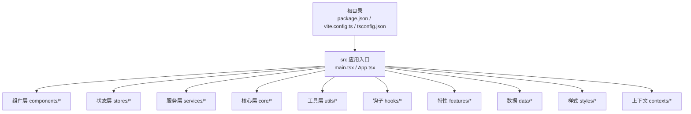
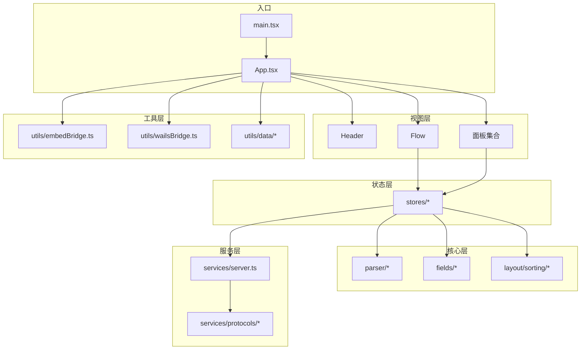
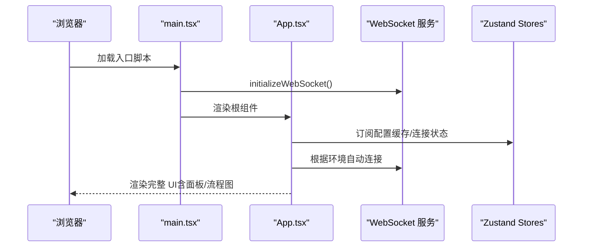
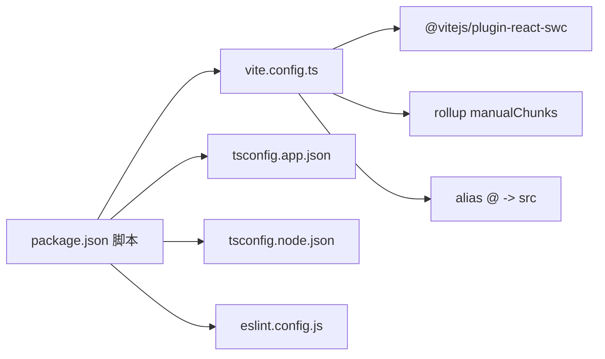

# 项目结构与目录说明

<cite>
**本文引用的文件**
- [package.json](file://package.json)
- [vite.config.ts](file://vite.config.ts)
- [tsconfig.json](file://tsconfig.json)
- [tsconfig.app.json](file://tsconfig.app.json)
- [tsconfig.node.json](file://tsconfig.node.json)
- [eslint.config.js](file://eslint.config.js)
- [src/main.tsx](file://src/main.tsx)
- [src/App.tsx](file://src/App.tsx)
</cite>

## 目录
1. [引言](#引言)
2. [项目结构](#项目结构)
3. [核心组件](#核心组件)
4. [架构总览](#架构总览)
5. [详细组件分析](#详细组件分析)
6. [依赖关系分析](#依赖关系分析)
7. [性能考虑](#性能考虑)
8. [故障排查指南](#故障排查指南)
9. [结论](#结论)
10. [附录](#附录)

## 引言
本文件系统性梳理 MaaPipelineEditor 的前端工程结构与配置，重点覆盖 src 目录的组织方式（components、stores、services、core、utils 等），TypeScript 多配置文件的作用与差异，Vite 构建与开发服务器配置，以及 package.json 中的依赖与脚本命令。同时给出目录设计原则、模块化组织策略、代码分层架构与文件命名约定建议，帮助读者快速理解并高效扩展该编辑器前端。

## 项目结构
MaaPipelineEditor 采用多包/多入口的工程布局，其中前端编辑器位于仓库根目录的 src 子树，配合 Vite、React 19、Ant Design 6 与 Zustand 状态管理等技术栈。整体结构遵循“功能域+分层”的混合组织方式：以功能域划分组件与页面，以分层抽象封装跨域通用能力。

- 根目录关键文件
  - package.json：统一管理依赖与脚本命令，包含多工作区/子任务命令（如 landing、server、doc）。
  - vite.config.ts：Vite 构建与开发服务器配置，含别名、分包策略、测试环境等。
  - tsconfig.json：聚合 tsconfig.app.json 与 tsconfig.node.json，分别面向应用与构建配置。
  - eslint.config.js：统一 ESLint 规则与忽略项，覆盖多工作区路径。

- src 目录组织（核心）
  - components：可复用 UI 组件与业务面板，如 Flow.tsx、Header.tsx、各面板与模态框。
  - core：领域模型与解析器，负责 pipeline 与可视化节点之间的双向转换、布局、排序等。
  - stores：基于 Zustand 的状态切片，涵盖文件、WS、MFW、面板占用、调试等状态域。
  - services：协议与服务层，封装与后端桥接、本地服务交互、文件/资源协议等。
  - utils：工具函数库，涵盖数据处理、剪贴板、嵌入桥接、Wails 桥接、AI 辅助等。
  - hooks：自定义 Hook，封装画布视口、嵌入模式、全局快捷键、持久化状态等。
  - features：特性域（如 debug、wiki），用于隔离实验性或独立功能。
  - data：静态数据与配置，如新手问答、模板、更新日志等。
  - styles：样式体系，按基础、布局、面板、流程图等维度组织 LESS 模块。
  - contexts：上下文提供者，如主题上下文。
  - 入口：main.tsx 与 App.tsx，负责初始化、路由/面板组合、嵌入模式与桥接逻辑。

**图表来源**
- [src/main.tsx:1-20](file://src/main.tsx#L1-L20)
- [src/App.tsx:1-597](file://src/App.tsx#L1-L597)

**章节来源**
- [package.json:1-75](file://package.json#L1-L75)
- [vite.config.ts:1-66](file://vite.config.ts#L1-L66)
- [tsconfig.json:1-8](file://tsconfig.json#L1-L8)

## 核心组件
- 组件层（components）
  - 功能定位：可复用 UI 组件与业务面板，如 Flow.tsx（流程图容器）、Header.tsx（顶部导航）、各类面板（FieldPanel、EdgePanel、LiveScreenPanel 等）与模态框。
  - 设计原则：单一职责、可组合、可配置；与 stores 解耦，通过 props 与事件交互。
  - 关键文件路径示例：[src/components/Flow.tsx](file://src/components/Flow.tsx)，[src/components/panels/main/FieldPanel.tsx](file://src/components/panels/main/FieldPanel.tsx)。

- 核心层（core）
  - 功能定位：领域模型与解析器，负责 pipeline 字符串与可视化节点/边之间的双向转换、版本检测、导入导出、布局与对齐、排序规则等。
  - 关键文件路径示例：[src/core/parser/index.ts](file://src/core/parser/index.ts)，[src/core/fields.ts](file://src/core/fields.ts)。

- 状态层（stores）
  - 功能定位：Zustand 切片式状态管理，覆盖文件、WS、MFW、面板占用、调试、嵌入模式、错误日志等。
  - 关键文件路径示例：[src/stores/fileStore.ts](file://src/stores/fileStore.ts)，[src/stores/wsStore.ts](file://src/stores/wsStore.ts)。

- 服务层（services）
  - 功能定位：协议与服务封装，如本地服务连接、协议客户端（AI、Config、File、Resource 等）、跨文件服务等。
  - 关键文件路径示例：[src/services/server.ts](file://src/services/server.ts)，[src/services/protocols/index.ts](file://src/services/protocols/index.ts)。

- 工具层（utils）
  - 功能定位：通用工具函数，如数据处理（JSON、ROI、URL）、剪贴板、嵌入桥接、Wails 桥接、AI 客户端与提示词等。
  - 关键文件路径示例：[src/utils/data/jsonHelper.ts](file://src/utils/data/jsonHelper.ts)，[src/utils/embedBridge.ts](file://src/utils/embedBridge.ts)。

- 钩子层（hooks）
  - 功能定位：封装可复用行为，如画布视口、嵌入模式、全局快捷键、面板占用、持久化状态等。
  - 关键文件路径示例：[src/hooks/useEmbedMode.ts](file://src/hooks/useEmbedMode.ts)，[src/hooks/useGlobalShortcuts.ts](file://src/hooks/useGlobalShortcuts.ts)。

- 特性层（features）
  - 功能定位：实验性或独立特性域，如 debug、wiki 等。
  - 关键文件路径示例：[src/features/debug](file://src/features/debug)，[src/features/wiki](file://src/features/wiki)。

- 数据层（data）
  - 功能定位：静态数据与配置，如新手问答、模板、更新日志等。
  - 关键文件路径示例：[src/data/nodeTemplates.ts](file://src/data/nodeTemplates.ts)，[src/data/updateLogs.ts](file://src/data/updateLogs.ts)。

- 样式层（styles）
  - 功能定位：按基础、布局、面板、流程图等维度组织 LESS 模块，实现主题化与组件化样式。
  - 关键文件路径示例：[src/styles/base/global.less](file://src/styles/base/global.less)，[src/styles/layout/App.module.less](file://src/styles/layout/App.module.less)。

- 上下文层（contexts）
  - 功能定位：提供主题等上下文，贯穿组件树。
  - 关键文件路径示例：[src/contexts/ThemeContext.tsx](file://src/contexts/ThemeContext.tsx)。

**章节来源**
- [src/main.tsx:1-20](file://src/main.tsx#L1-L20)
- [src/App.tsx:1-597](file://src/App.tsx#L1-L597)

## 架构总览
前端采用“入口 -> 组件 -> 核心 -> 服务 -> 工具”的分层架构，结合 Zustand 切片式状态管理与 React 19 的并发特性，实现高性能与高可维护性的编辑器体验。嵌入模式与 Wails 桥接通过 utils 层进行解耦，保证在不同运行环境下的一致行为。

**图表来源**
- [src/main.tsx:1-20](file://src/main.tsx#L1-L20)
- [src/App.tsx:1-597](file://src/App.tsx#L1-L597)

## 详细组件分析

### TypeScript 配置体系
- tsconfig.json（聚合）
  - 作用：通过 references 聚合应用与构建配置，避免重复声明。
  - 影响范围：影响 Vite、ESLint、IDE 等工具链的类型检查行为。
  - 参考路径：[tsconfig.json:1-8](file://tsconfig.json#L1-L8)

- tsconfig.app.json（应用配置）
  - 作用：面向浏览器端应用的编译选项，启用 bundler 模式、严格模式、JSX 等。
  - 关键点：moduleResolution/bundler、verbatimModuleSyntax、noEmit、jsx=react-jsx。
  - 参考路径：[tsconfig.app.json:1-27](file://tsconfig.app.json#L1-L27)

- tsconfig.node.json（构建配置）
  - 作用：面向构建脚本（vite.config.ts）的编译选项，限制仅包含构建相关文件。
  - 关键点：moduleResolution/bundler、noEmit、erasableSyntaxOnly 等。
  - 参考路径：[tsconfig.node.json:1-26](file://tsconfig.node.json#L1-L26)

- ESLint 配置
  - 作用：统一规则与忽略项，覆盖多工作区路径，减少噪音与提升一致性。
  - 关键点：忽略 src/components/iconfonts/**、docsite/docs/.vitepress/cache/** 等。
  - 参考路径：[eslint.config.js:1-41](file://eslint.config.js#L1-L41)

**章节来源**
- [tsconfig.json:1-8](file://tsconfig.json#L1-L8)
- [tsconfig.app.json:1-27](file://tsconfig.app.json#L1-L27)
- [tsconfig.node.json:1-26](file://tsconfig.node.json#L1-L26)
- [eslint.config.js:1-41](file://eslint.config.js#L1-L41)

### Vite 构建与开发服务器配置
- 基础与开发服务器
  - host/port：固定开发服务器地址与端口，便于后端联调与嵌入调试。
  - base：根据模式动态设置，支持 preview/extremer/stable 等模式。
  - 参考路径：[vite.config.ts:5-20](file://vite.config.ts#L5-L20)

- 插件与别名
  - @vitejs/plugin-react-swc：加速开发体验。
  - @：指向 src 目录，简化导入路径。
  - 参考路径：[vite.config.ts:20-46](file://vite.config.ts#L20-L46)

- 分包策略（Rollup manualChunks）
  - 将 monaco-editor、@monaco-editor/react、tesseract.js、@microlink/react-json-view 独立分包，优化缓存与加载性能。
  - 参考路径：[vite.config.ts:21-41](file://vite.config.ts#L21-L41)

- 测试配置
  - 环境：happy-dom，全局变量开启，覆盖率报告器与排除规则明确。
  - 参考路径：[vite.config.ts:47-63](file://vite.config.ts#L47-L63)

**章节来源**
- [vite.config.ts:1-66](file://vite.config.ts#L1-L66)

### 入口与应用初始化
- 入口文件
  - main.tsx：引入全局样式、初始化 WebSocket 与开发控制台，挂载 React 根节点。
  - 参考路径：[src/main.tsx:1-20](file://src/main.tsx#L1-L20)

- 应用主组件
  - App.tsx：集中处理嵌入模式、Wails 桥接、URL 参数解析、自动连接、面板组合、懒加载组件、全局快捷键与事件监听等。
  - 参考路径：[src/App.tsx:1-597](file://src/App.tsx#L1-L597)

**图表来源**
- [src/main.tsx:1-20](file://src/main.tsx#L1-L20)
- [src/App.tsx:1-597](file://src/App.tsx#L1-L597)

**章节来源**
- [src/main.tsx:1-20](file://src/main.tsx#L1-L20)
- [src/App.tsx:1-597](file://src/App.tsx#L1-L597)

### 目录设计原则与模块化组织策略
- 分层清晰
  - 视图层（components）：只负责展示与用户交互，不包含业务逻辑。
  - 核心层（core）：封装领域模型与算法，保持纯函数与可测试性。
  - 服务层（services）：封装外部系统交互与协议，屏蔽实现细节。
  - 工具层（utils）：提供通用能力，避免重复造轮子。
  - 状态层（stores）：集中管理跨组件共享状态，避免全局污染。

- 功能域划分
  - 按业务面板与功能模块拆分目录，如 panels、modals、tools 等，便于团队协作与独立演进。

- 解耦与可替换
  - 通过协议接口与工厂模式（如 fieldFactory）降低耦合，便于替换实现或扩展新类型。

- 命名约定
  - 组件：大驼峰（如 Header.tsx、FieldPanel.tsx）。
  - 状态：小驼峰（如 fileStore.ts、wsStore.ts）。
  - 工具：动词短语（如 jsonHelper.ts、embedBridge.ts）。
  - 类型：大驼峰（如 EmbedCapabilities、EmbedUIConfig）。
  - 样式：模块化命名（如 *.module.less）。

- 文件组织
  - 单文件组件（SFC）优先，复杂组件拆分为 index.ts + 子文件。
  - 常量与配置集中管理，避免散落各处。

**章节来源**
- [src/App.tsx:1-597](file://src/App.tsx#L1-L597)

## 依赖关系分析
- 依赖管理
  - 生产依赖：React 19、Ant Design 6、@xyflow/react、Monaco Editor、Zustand、ahooks 等，满足编辑器与可视化需求。
  - 开发依赖：Vite 7、@vitejs/plugin-react-swc、TypeScript、ESLint、Vitest 等，保障开发体验与质量。
  - 参考路径：[package.json:24-73](file://package.json#L24-L73)

- 脚本命令
  - dev/build/preview：标准 Vite 生命周期。
  - landing/server/doc：多工作区/子任务命令，便于并行开发与预览。
  - icon：图标字体生成工具链。
  - 参考路径：[package.json:6-23](file://package.json#L6-L23)

**图表来源**
- [package.json:1-75](file://package.json#L1-L75)
- [vite.config.ts:1-66](file://vite.config.ts#L1-L66)
- [tsconfig.app.json:1-27](file://tsconfig.app.json#L1-L27)
- [tsconfig.node.json:1-26](file://tsconfig.node.json#L1-L26)
- [eslint.config.js:1-41](file://eslint.config.js#L1-L41)

**章节来源**
- [package.json:1-75](file://package.json#L1-L75)
- [vite.config.ts:1-66](file://vite.config.ts#L1-L66)

## 性能考虑
- 代码分割
  - 使用 Vite 的 manualChunks 将大型依赖（Monaco、Tesseract、JSON View）独立打包，提升缓存命中率与首屏性能。
  - 参考路径：[vite.config.ts:24-38](file://vite.config.ts#L24-L38)

- 构建与运行时优化
  - React 19 并发特性与 Suspense 懒加载，减少阻塞渲染。
  - 参考路径：[src/App.tsx:75-80](file://src/App.tsx#L75-L80)

- 开发体验
  - SWC 插件加速 HMR，合理配置别名与测试环境，缩短反馈周期。
  - 参考路径：[vite.config.ts:20-20](file://vite.config.ts#L20-L20)，[vite.config.ts:47-63](file://vite.config.ts#L47-L63)

**章节来源**
- [vite.config.ts:21-41](file://vite.config.ts#L21-L41)
- [src/App.tsx:75-80](file://src/App.tsx#L75-L80)

## 故障排查指南
- 常见问题与定位
  - WebSocket 连接失败：检查 App.tsx 中的自动连接逻辑与端口解析，确认本地服务状态。
    - 参考路径：[src/App.tsx:430-493](file://src/App.tsx#L430-L493)
  - 嵌入模式异常：核对 utils/embedBridge.ts 的握手与消息处理，确认父窗口消息通道。
    - 参考路径：[src/App.tsx:186-352](file://src/App.tsx#L186-L352)
  - Monaco 编辑器卡顿：确认 manualChunks 是否生效，避免单体 bundle 过大。
    - 参考路径：[vite.config.ts:24-38](file://vite.config.ts#L24-L38)
  - ESLint 忽略规则导致的误报：检查 eslint.config.js 的 ignores 与 rules。
    - 参考路径：[eslint.config.js:8-40](file://eslint.config.js#L8-L40)

**章节来源**
- [src/App.tsx:186-352](file://src/App.tsx#L186-L352)
- [src/App.tsx:430-493](file://src/App.tsx#L430-L493)
- [vite.config.ts:24-38](file://vite.config.ts#L24-L38)
- [eslint.config.js:8-40](file://eslint.config.js#L8-L40)

## 结论
MaaPipelineEditor 的前端工程以清晰的分层与功能域划分实现了高内聚低耦合的架构。通过 TypeScript 多配置文件、Vite 高效构建与测试配置、Zustand 状态管理以及完善的工具层，项目在开发效率、运行性能与可维护性之间取得了良好平衡。建议在后续迭代中持续完善核心层的单元测试、增强服务层的协议抽象，并探索更多可视化与 AI 辅助能力。

## 附录
- 关键文件速览
  - 入口与应用：[src/main.tsx:1-20](file://src/main.tsx#L1-L20)，[src/App.tsx:1-597](file://src/App.tsx#L1-L597)
  - 构建与配置：[vite.config.ts:1-66](file://vite.config.ts#L1-L66)，[tsconfig.json:1-8](file://tsconfig.json#L1-L8)，[tsconfig.app.json:1-27](file://tsconfig.app.json#L1-L27)，[tsconfig.node.json:1-26](file://tsconfig.node.json#L1-L26)，[eslint.config.js:1-41](file://eslint.config.js#L1-L41)
  - 依赖与脚本：[package.json:1-75](file://package.json#L1-L75)