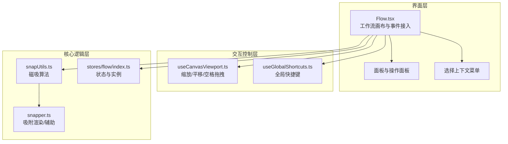
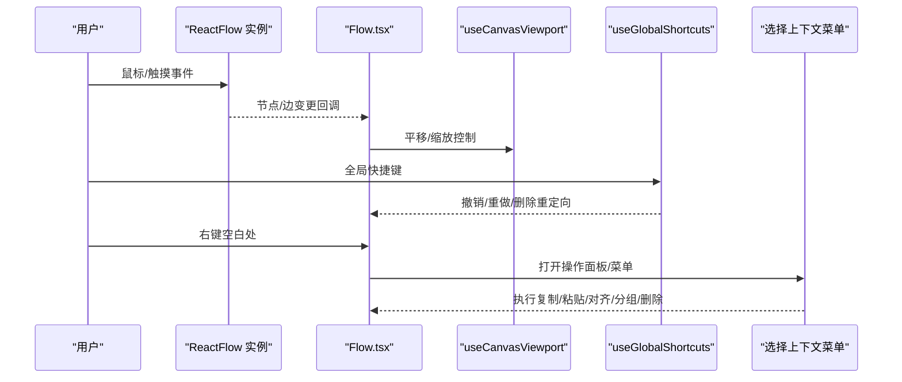
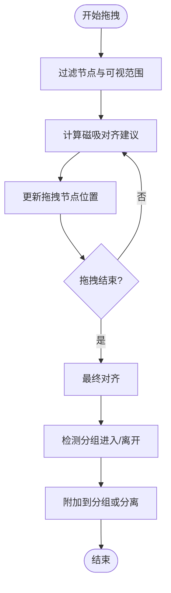
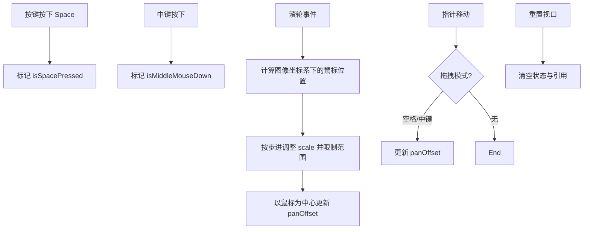
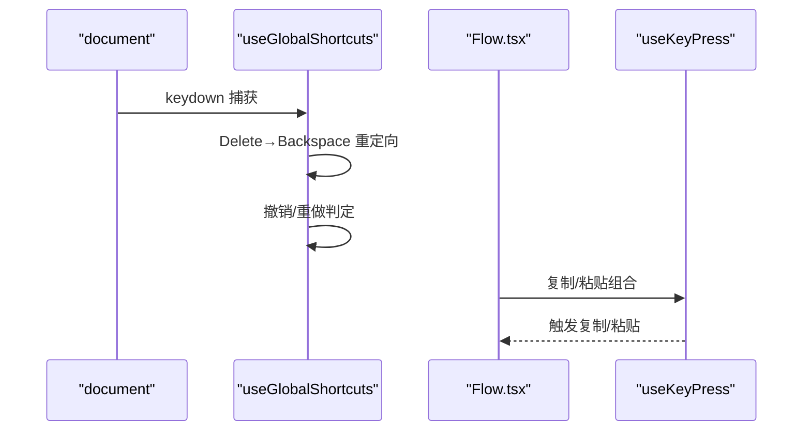
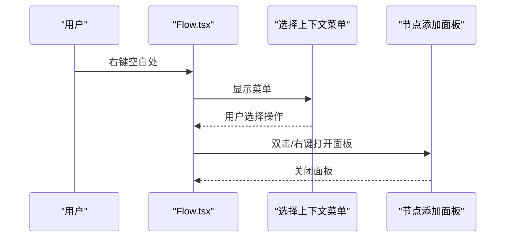
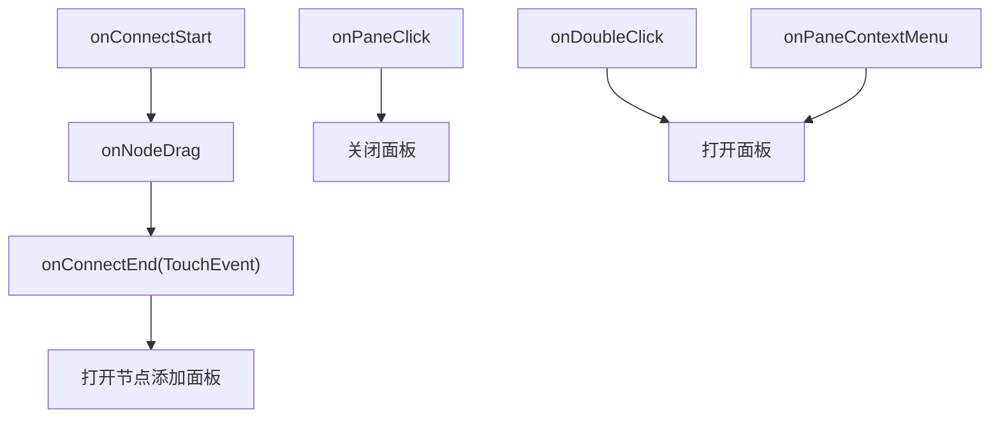
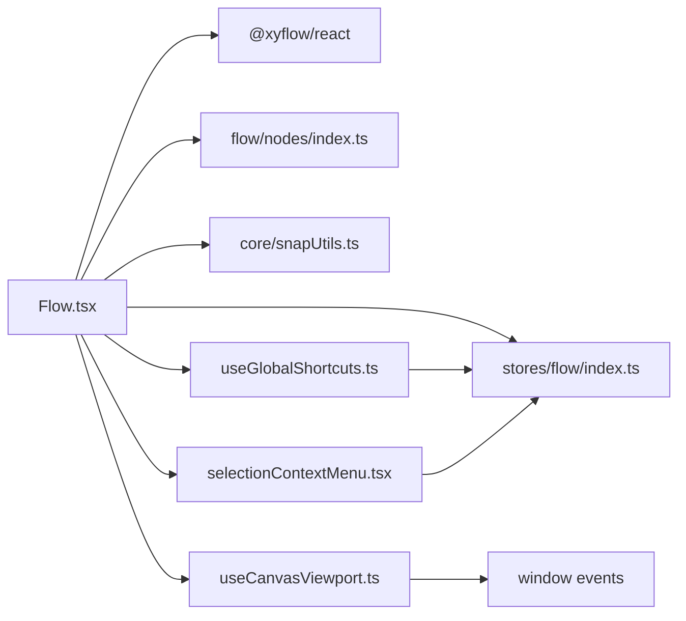

# 交互处理

<cite>
**本文引用的文件**
- [src/components/Flow.tsx](file://src/components/Flow.tsx)
- [src/hooks/useCanvasViewport.ts](file://src/hooks/useCanvasViewport.ts)
- [src/hooks/useGlobalShortcuts.ts](file://src/hooks/useGlobalShortcuts.ts)
- [src/components/flow/selectionContextMenu.tsx](file://src/components/flow/selectionContextMenu.tsx)
- [src/components/flow/nodes/index.ts](file://src/components/flow/nodes/index.ts)
- [src/utils/ui/snapper.ts](file://src/utils/ui/snapper.ts)
- [src/core/snapUtils.ts](file://src/core/snapUtils.ts)
- [src/stores/flow/index.ts](file://src/stores/flow/index.ts)
- [dev/instructions/react-flow/learn/concepts/the-viewport.mdx](file://dev/instructions/react-flow/learn/concepts/the-viewport.mdx)
- [dev/instructions/react-flow/learn/advanced-use/accessibility.mdx](file://dev/instructions/react-flow/learn/advanced-use/accessibility.mdx)
</cite>

## 目录
1. [引言](#引言)
2. [项目结构](#项目结构)
3. [核心组件](#核心组件)
4. [架构总览](#架构总览)
5. [详细组件分析](#详细组件分析)
6. [依赖关系分析](#依赖关系分析)
7. [性能考量](#性能考量)
8. [故障排查指南](#故障排查指南)
9. [结论](#结论)
10. [附录](#附录)

## 引言
本文件面向“交互处理系统”的技术文档，聚焦以下关键能力：
- 节点选择、拖拽、磁吸与分组联动
- 拖拽视口（平移）与滚轮缩放
- 键盘快捷键系统、全局快捷键监听与组合处理
- 右键菜单系统、上下文菜单与操作面板
- 鼠标事件与触摸事件支持及跨平台兼容性
- 交互体验优化与无障碍访问（WCAG 2.1 AA）

## 项目结构
该系统围绕 ReactFlow 工作流画布构建，采用模块化组织：
- 顶层画布组件负责事件接入、视口持久化与面板挂载
- 视口控制 Hook 管理缩放、平移与空格拖拽
- 快捷键 Hook 提供全局撤销/重做与 Delete→Backspace 重定向
- 选择上下文菜单提供复制/粘贴/对齐/分组/删除等操作
- 磁吸与分组联动通过核心工具与存储层协同完成

**图表来源**
- [src/components/Flow.tsx:648-705](file://src/components/Flow.tsx#L648-L705)
- [src/hooks/useCanvasViewport.ts:69-306](file://src/hooks/useCanvasViewport.ts#L69-L306)
- [src/hooks/useGlobalShortcuts.ts:156-169](file://src/hooks/useGlobalShortcuts.ts#L156-L169)
- [src/components/flow/selectionContextMenu.tsx:322-504](file://src/components/flow/selectionContextMenu.tsx#L322-L504)
- [src/core/snapUtils.ts](file://src/core/snapUtils.ts)
- [src/utils/ui/snapper.ts](file://src/utils/ui/snapper.ts)
- [src/stores/flow/index.ts](file://src/stores/flow/index.ts)

**章节来源**
- [src/components/Flow.tsx:1-709](file://src/components/Flow.tsx#L1-L709)
- [src/hooks/useCanvasViewport.ts:69-306](file://src/hooks/useCanvasViewport.ts#L69-L306)
- [src/hooks/useGlobalShortcuts.ts:156-169](file://src/hooks/useGlobalShortcuts.ts#L156-L169)
- [src/components/flow/selectionContextMenu.tsx:322-504](file://src/components/flow/selectionContextMenu.tsx#L322-L504)

## 核心组件
- 工作流画布与事件接入：集中处理节点/边变更、连接、选择、双击/右键空白处、节点拖拽磁吸与分组联动、视口变化监听与持久化、尺寸自适应等。
- 视口控制 Hook：封装滚轮缩放、空格键拖拽、中键拖拽、平移边界与初始缩放、重置视口、光标样式等。
- 全局快捷键 Hook：统一处理撤销/重做、Delete→Backspace 重定向，并在输入框与模态框场景下进行条件拦截。
- 选择上下文菜单：提供复制/粘贴/导出/对齐/间距/自动布局/连线路径还原/分组/删除等操作项及其可见性/可用性规则。

**章节来源**
- [src/components/Flow.tsx:235-709](file://src/components/Flow.tsx#L235-L709)
- [src/hooks/useCanvasViewport.ts:69-306](file://src/hooks/useCanvasViewport.ts#L69-L306)
- [src/hooks/useGlobalShortcuts.ts:156-169](file://src/hooks/useGlobalShortcuts.ts#L156-L169)
- [src/components/flow/selectionContextMenu.tsx:322-504](file://src/components/flow/selectionContextMenu.tsx#L322-L504)

## 架构总览
系统采用“画布组件 + 控制 Hook + 上下文菜单 + 核心工具 + 状态存储”的分层设计，事件从 DOM 层进入，经由 ReactFlow 与自定义 Hook/工具协调，最终更新状态并驱动 UI。

**图表来源**
- [src/components/Flow.tsx:648-705](file://src/components/Flow.tsx#L648-L705)
- [src/hooks/useCanvasViewport.ts:123-249](file://src/hooks/useCanvasViewport.ts#L123-L249)
- [src/hooks/useGlobalShortcuts.ts:143-148](file://src/hooks/useGlobalShortcuts.ts#L143-L148)
- [src/components/flow/selectionContextMenu.tsx:322-504](file://src/components/flow/selectionContextMenu.tsx#L322-L504)

## 详细组件分析

### 节点选择与拖拽、磁吸与分组联动
- 选择与变更：通过 onSelectionChange 同步选中节点/边；onNodesChange/onEdgesChange 区分只读模式下的阻断与允许类型变更。
- 拖拽磁吸：onNodeDrag 中根据配置过滤节点与可视范围，计算对齐建议并实时更新位置；onNodeDragStop 完成时执行最终对齐与分组检测。
- 分组联动：拖拽停止后检测节点是否进入/离开分组，必要时附加/分离至父分组。

**图表来源**
- [src/components/Flow.tsx:469-608](file://src/components/Flow.tsx#L469-L608)
- [src/core/snapUtils.ts](file://src/core/snapUtils.ts)
- [src/utils/ui/snapper.ts](file://src/utils/ui/snapper.ts)

**章节来源**
- [src/components/Flow.tsx:420-608](file://src/components/Flow.tsx#L420-L608)
- [src/core/snapUtils.ts](file://src/core/snapUtils.ts)
- [src/utils/ui/snapper.ts](file://src/utils/ui/snapper.ts)

### 拖拽视口（平移）、滚轮缩放与空格拖拽
- 空格键拖拽：监听窗口 keydown/keyup，设置 isSpacePressed；当按下空格且触发指针移动时切换为抓取样式并进入平移模式。
- 中键拖拽：区分中键按下与抬起，配合指针移动实现平移。
- 滚轮缩放：基于容器与图片偏移计算鼠标在图像坐标系中的相对位置，按步进与边界限制更新缩放，并以鼠标位置为中心进行缩放。
- 初始缩放与重置：记录 initialScale，提供重置视口方法清理状态与引用。

**图表来源**
- [src/hooks/useCanvasViewport.ts:92-121](file://src/hooks/useCanvasViewport.ts#L92-L121)
- [src/hooks/useCanvasViewport.ts:123-170](file://src/hooks/useCanvasViewport.ts#L123-L170)
- [src/hooks/useCanvasViewport.ts:171-249](file://src/hooks/useCanvasViewport.ts#L171-L249)
- [src/hooks/useCanvasViewport.ts:252-260](file://src/hooks/useCanvasViewport.ts#L252-L260)

**章节来源**
- [src/hooks/useCanvasViewport.ts:69-306](file://src/hooks/useCanvasViewport.ts#L69-L306)

### 键盘快捷键系统与全局快捷键监听
- 全局快捷键：在 document 上以捕获阶段监听 keydown，优先处理 Delete→Backspace 重定向，再处理撤销/重做；在输入框或模态框打开时跳过。
- 画布内快捷键：使用 useKeyPress 监听复制/粘贴组合，结合当前焦点判断是否处于文本编辑器中，避免干扰。

**图表来源**
- [src/hooks/useGlobalShortcuts.ts:143-148](file://src/hooks/useGlobalShortcuts.ts#L143-L148)
- [src/hooks/useGlobalShortcuts.ts:156-169](file://src/hooks/useGlobalShortcuts.ts#L156-L169)
- [src/components/Flow.tsx:102-131](file://src/components/Flow.tsx#L102-L131)

**章节来源**
- [src/hooks/useGlobalShortcuts.ts:1-169](file://src/hooks/useGlobalShortcuts.ts#L1-L169)
- [src/components/Flow.tsx:53-135](file://src/components/Flow.tsx#L53-L135)

### 右键菜单系统、上下文菜单与操作面板
- 选区右键菜单：在空白处右键时显示上下文菜单，提供复制/粘贴/导出/对齐/间距/自动布局/连线路径还原/分组/删除等操作项。
- 菜单项规则：通过可见性/可用性函数动态控制，如多选节点数量、是否选中节点、是否在分组中等。
- 操作面板：双击空白处或右键空白处打开“节点添加面板”，支持在指定屏幕坐标转换为画布坐标后展示。

**图表来源**
- [src/components/Flow.tsx:453-461](file://src/components/Flow.tsx#L453-L461)
- [src/components/Flow.tsx:427-450](file://src/components/Flow.tsx#L427-L450)
- [src/components/Flow.tsx:696-704](file://src/components/Flow.tsx#L696-L704)
- [src/components/flow/selectionContextMenu.tsx:322-504](file://src/components/flow/selectionContextMenu.tsx#L322-L504)

**章节来源**
- [src/components/Flow.tsx:293-461](file://src/components/Flow.tsx#L293-L461)
- [src/components/flow/selectionContextMenu.tsx:100-321](file://src/components/flow/selectionContextMenu.tsx#L100-L321)

### 鼠标事件处理、触摸事件支持与跨平台兼容
- 鼠标事件：统一使用 ReactFlow 的 onConnectStart/End、onPaneClick、onDoubleClick、onPaneContextMenu、onNodeDrag 等回调；在连接空白处时可触发“节点添加面板”。
- 触摸事件：onConnectEnd 对 TouchEvent 进行适配，提取 changedTouches 坐标，确保在移动端同样能触发连接与面板打开。
- 跨平台兼容：通过统一的事件参数与坐标换算（屏幕坐标↔画布坐标），保证在桌面端与移动端一致的行为。

**图表来源**
- [src/components/Flow.tsx:360-418](file://src/components/Flow.tsx#L360-L418)
- [src/components/Flow.tsx:427-461](file://src/components/Flow.tsx#L427-L461)

**章节来源**
- [src/components/Flow.tsx:360-461](file://src/components/Flow.tsx#L360-L461)

### 无障碍访问与交互体验优化
- 无障碍支持：ReactFlow 默认提供键盘焦点与屏幕阅读器支持，可通过 nodesFocusable、edgesFocusable、disableKeyboardA11y 等属性控制；提供 ariaLabelConfig 自定义提示文案。
- 体验优化：提供磁吸对齐参考线、自动平移/缩放边界、默认视口、背景色模式、防滚动、选中提升层级等策略，提升可用性与一致性。

**章节来源**
- [dev/instructions/react-flow/learn/advanced-use/accessibility.mdx:15-27](file://dev/instructions/react-flow/learn/advanced-use/accessibility.mdx#L15-L27)
- [dev/instructions/react-flow/learn/advanced-use/accessibility.mdx:114-123](file://dev/instructions/react-flow/learn/advanced-use/accessibility.mdx#L114-L123)
- [src/components/Flow.tsx:619-621](file://src/components/Flow.tsx#L619-L621)
- [src/components/Flow.tsx:663-678](file://src/components/Flow.tsx#L663-L678)

## 依赖关系分析
- Flow.tsx 依赖 ReactFlow、状态存储、节点/边类型注册、视口变化监听、磁吸工具与吸附渲染、上下文菜单配置。
- useCanvasViewport.ts 依赖窗口事件、容器与图片引用、缩放边界与步进常量。
- useGlobalShortcuts.ts 依赖状态存储的 undo/redo 方法与消息提示。
- selectionContextMenu.tsx 依赖布局工具、剪贴板与存储层的复制/粘贴/删除/对齐/分组等动作。

**图表来源**
- [src/components/Flow.tsx:13-35](file://src/components/Flow.tsx#L13-L35)
- [src/components/flow/nodes/index.ts:8-14](file://src/components/flow/nodes/index.ts#L8-L14)
- [src/components/flow/selectionContextMenu.tsx:1-9](file://src/components/flow/selectionContextMenu.tsx#L1-L9)
- [src/hooks/useCanvasViewport.ts:87-89](file://src/hooks/useCanvasViewport.ts#L87-L89)
- [src/hooks/useGlobalShortcuts.ts:3,196](file://src/hooks/useGlobalShortcuts.ts#L3,L96)

**章节来源**
- [src/components/Flow.tsx:13-35](file://src/components/Flow.tsx#L13-L35)
- [src/components/flow/nodes/index.ts:8-14](file://src/components/flow/nodes/index.ts#L8-L14)
- [src/components/flow/selectionContextMenu.tsx:1-9](file://src/components/flow/selectionContextMenu.tsx#L1-L9)
- [src/hooks/useCanvasViewport.ts:87-89](file://src/hooks/useCanvasViewport.ts#L87-L89)
- [src/hooks/useGlobalShortcuts.ts:3,196](file://src/hooks/useGlobalShortcuts.ts#L3,L96)

## 性能考量
- 事件节流与去抖：尺寸变化使用去抖更新，减少频繁重排；视口变化监听在结束时写入文件配置，降低写入频率。
- 视口边界与缩放步进：通过最小/最大缩放与步进限制，避免过度缩放导致的重绘压力。
- 磁吸范围过滤：仅在可视范围内或排除分组节点时进行对齐计算，减少不必要的遍历。
- 只读模式阻断：在嵌入模式下阻止修改性变更，避免无效状态更新。

**章节来源**
- [src/components/Flow.tsx:625-628](file://src/components/Flow.tsx#L625-L628)
- [src/components/Flow.tsx:149-155](file://src/components/Flow.tsx#L149-L155)
- [src/components/Flow.tsx:476-482](file://src/components/Flow.tsx#L476-L482)
- [src/components/Flow.tsx:300-325](file://src/components/Flow.tsx#L300-L325)

## 故障排查指南
- 删除键行为异常：确认 Delete→Backspace 重定向是否生效，检查是否处于可编辑元素或模态框打开状态。
- 撤销/重做无效：检查全局快捷键是否被输入框或模态框拦截；确认状态存储的 undo/redo 方法可用。
- 空格拖拽无效：确认窗口事件监听是否在画布打开状态下注册；检查 isSpacePressed 状态与光标样式。
- 滚轮缩放异常：检查容器与图片引用是否正确；确认缩放边界与步进参数；验证鼠标坐标换算逻辑。
- 右键菜单不显示：确认 onPaneContextMenu 是否被只读模式阻断；检查 selectionMenuPos 状态与菜单组件可见性。
- 磁吸不生效：检查 enableNodeSnap 与 snapOnlyInViewport 配置；确认过滤节点与可视范围逻辑。

**章节来源**
- [src/hooks/useGlobalShortcuts.ts:32-67](file://src/hooks/useGlobalShortcuts.ts#L32-L67)
- [src/hooks/useGlobalShortcuts.ts:72-138](file://src/hooks/useGlobalShortcuts.ts#L72-L138)
- [src/hooks/useCanvasViewport.ts:92-121](file://src/hooks/useCanvasViewport.ts#L92-L121)
- [src/hooks/useCanvasViewport.ts:123-170](file://src/hooks/useCanvasViewport.ts#L123-L170)
- [src/components/Flow.tsx:453-461](file://src/components/Flow.tsx#L453-L461)
- [src/components/Flow.tsx:476-482](file://src/components/Flow.tsx#L476-L482)

## 结论
该交互处理系统以 ReactFlow 为核心，结合自定义 Hook 与工具模块，实现了完善的节点选择、拖拽磁吸、分组联动、视口缩放与平移、全局快捷键与上下文菜单等功能。通过配置化的视口边界、磁吸范围与只读模式控制，兼顾了可用性与安全性；同时提供无障碍支持与跨平台事件适配，满足多端一致的交互体验。

## 附录
- 视口概念与默认行为参考：[the-viewport.mdx:8-45](file://dev/instructions/react-flow/learn/concepts/the-viewport.mdx#L8-L45)
- 无障碍访问指南：[accessibility.mdx:15-27](file://dev/instructions/react-flow/learn/advanced-use/accessibility.mdx#L15-L27)