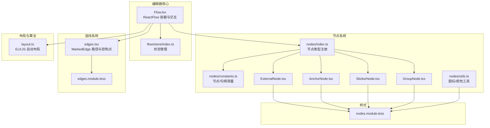
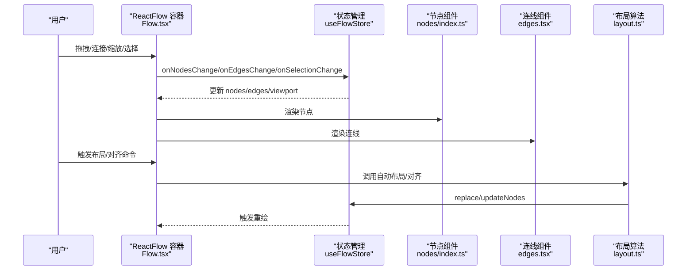
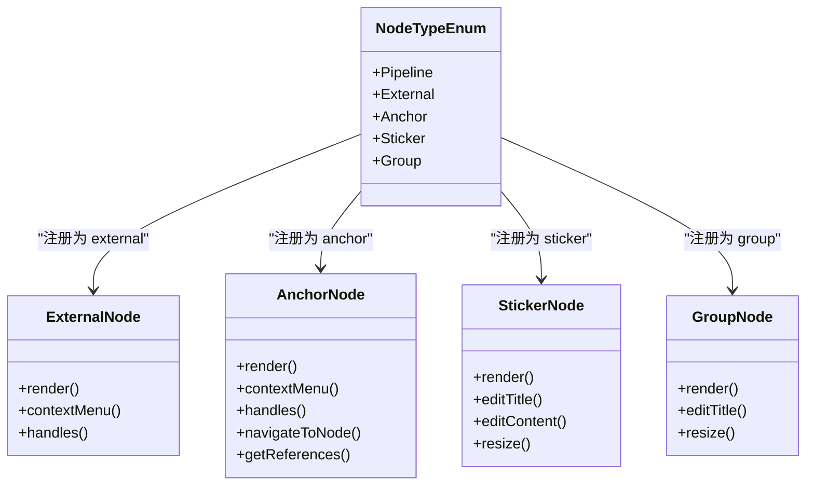
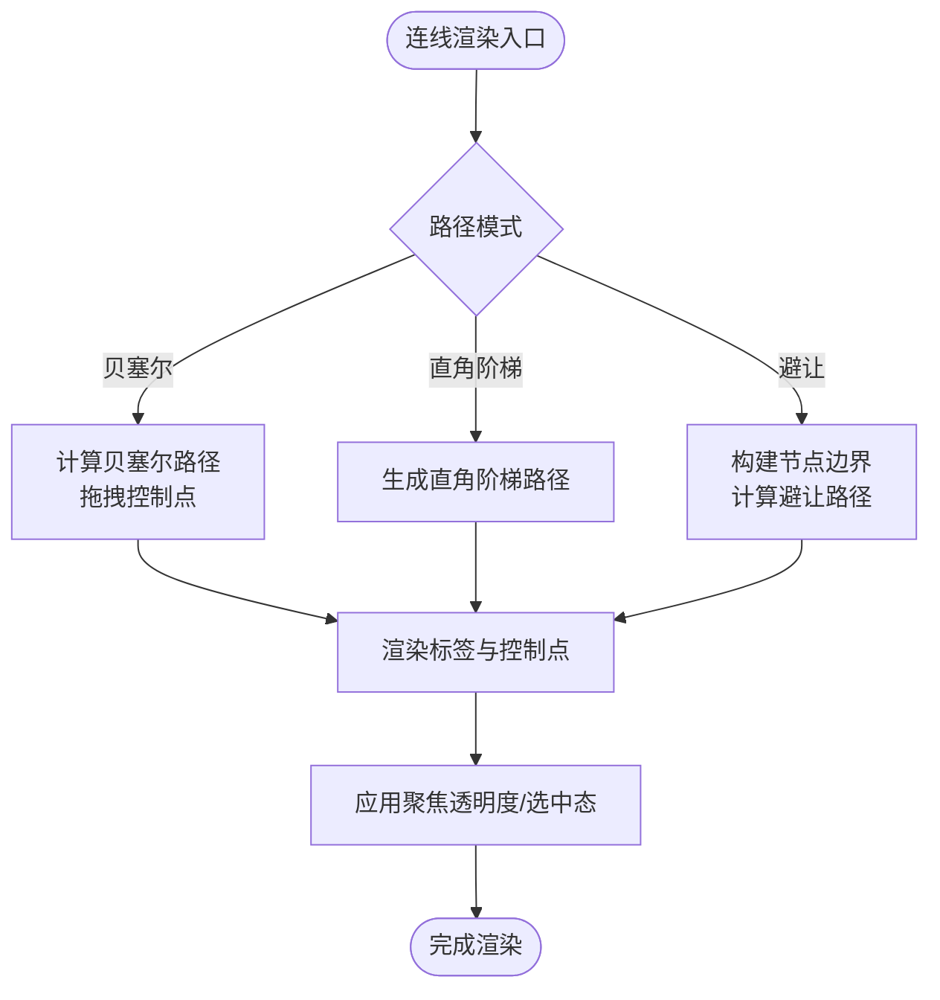
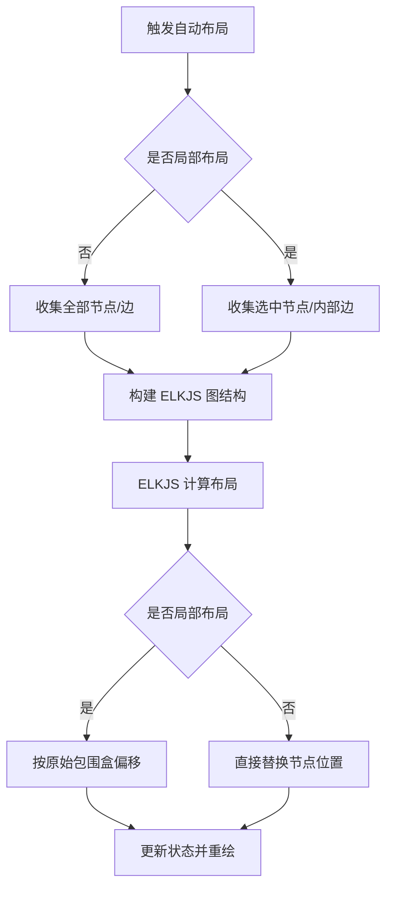
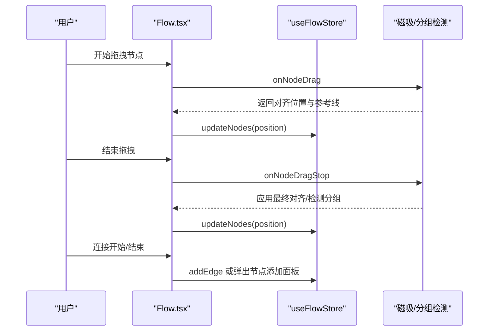
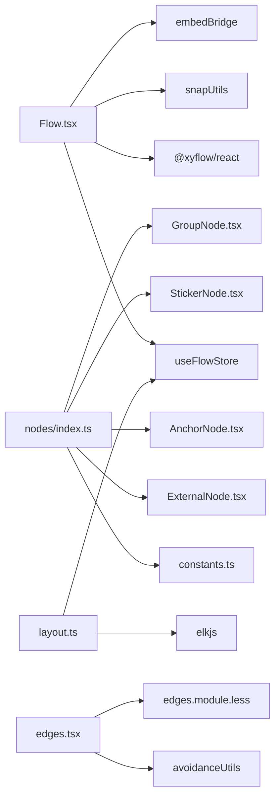

# 可视化编辑器

<cite>
**本文档引用的文件**
- [Flow.tsx](file://src/components/Flow.tsx)
- [nodes/index.ts](file://src/components/flow/nodes/index.ts)
- [edges.tsx](file://src/components/flow/edges.tsx)
- [layout.ts](file://src/core/layout.ts)
- [flow/store/index.ts](file://src/stores/flow/index.ts)
- [nodes/constants.ts](file://src/components/flow/nodes/constants.ts)
- [nodes/ExternalNode.tsx](file://src/components/flow/nodes/ExternalNode.tsx)
- [nodes/AnchorNode.tsx](file://src/components/flow/nodes/AnchorNode.tsx)
- [nodes/StickerNode.tsx](file://src/components/flow/nodes/StickerNode.tsx)
- [nodes/GroupNode.tsx](file://src/components/flow/nodes/GroupNode.tsx)
- [nodes/utils.ts](file://src/components/flow/nodes/utils.ts)
- [styles/flow/nodes.module.less](file://src/styles/flow/nodes.module.less)
- [styles/flow/edges.module.less](file://src/styles/flow/edges.module.less)
</cite>

## 目录
1. [简介](#简介)
2. [项目结构](#项目结构)
3. [核心组件](#核心组件)
4. [架构总览](#架构总览)
5. [详细组件分析](#详细组件分析)
6. [依赖关系分析](#依赖关系分析)
7. [性能考量](#性能考量)
8. [故障排查指南](#故障排查指南)
9. [结论](#结论)
10. [附录](#附录)

## 简介
本项目基于 React Flow 构建的可视化编辑器，围绕“流程图”与“节点/连线”进行设计，支持多种节点类型（Pipeline、External、Anchor、Sticker、Group），提供连线样式与智能路由、布局与自动排列、节点选择/拖拽/缩放/视口管理、以及可扩展的节点与连线体系。本文档将从架构、组件、数据流、交互与样式等方面进行深入解析，并给出扩展与优化建议。

## 项目结构
- 编辑器主容器与交互控制位于 Flow.tsx，负责实例管理、视口变化、键盘快捷键、节点/连线变更回调、磁吸对齐与分组拖拽检测等。
- 节点注册与类型定义集中在 nodes/index.ts 与 nodes/constants.ts，统一导出各节点组件与常量。
- 连线系统位于 edges.tsx，提供贝塞尔/直角阶梯/避让三种路径模式，支持控制点拖拽与标签渲染。
- 布局算法采用 ELKJS，提供全局与局部自动布局、对齐工具。
- 样式分别定义于 nodes.module.less 与 edges.module.less，覆盖节点与连线的外观与交互态。

**图表来源**
- [Flow.tsx:1-709](file://src/components/Flow.tsx#L1-L709)
- [nodes/index.ts:1-26](file://src/components/flow/nodes/index.ts#L1-L26)
- [edges.tsx:1-676](file://src/components/flow/edges.tsx#L1-L676)
- [layout.ts:1-220](file://src/core/layout.ts#L1-L220)
- [flow/store/index.ts:1-124](file://src/stores/flow/index.ts#L1-L124)
- [nodes/constants.ts:1-47](file://src/components/flow/nodes/constants.ts#L1-L47)
- [nodes/ExternalNode.tsx:1-203](file://src/components/flow/nodes/ExternalNode.tsx#L1-L203)
- [nodes/AnchorNode.tsx:1-371](file://src/components/flow/nodes/AnchorNode.tsx#L1-L371)
- [nodes/StickerNode.tsx:1-243](file://src/components/flow/nodes/StickerNode.tsx#L1-L243)
- [nodes/GroupNode.tsx:1-178](file://src/components/flow/nodes/GroupNode.tsx#L1-L178)
- [nodes/utils.ts:1-139](file://src/components/flow/nodes/utils.ts#L1-L139)
- [styles/flow/nodes.module.less:1-907](file://src/styles/flow/nodes.module.less#L1-L907)
- [styles/flow/edges.module.less:1-98](file://src/styles/flow/edges.module.less#L1-L98)

**章节来源**
- [Flow.tsx:1-709](file://src/components/Flow.tsx#L1-L709)
- [nodes/index.ts:1-26](file://src/components/flow/nodes/index.ts#L1-L26)
- [edges.tsx:1-676](file://src/components/flow/edges.tsx#L1-L676)
- [layout.ts:1-220](file://src/core/layout.ts#L1-L220)
- [flow/store/index.ts:1-124](file://src/stores/flow/index.ts#L1-L124)

## 核心组件
- ReactFlow 容器与交互控制：负责节点/连线变更、连接事件、选择事件、拖拽事件、视口变化、键盘快捷键、节点添加面板、磁吸对齐与分组拖拽检测。
- 节点注册表：集中导出五种节点类型，供 ReactFlow 使用。
- 连线组件：MarkedEdge 支持贝塞尔/直角阶梯/避让三种路径模式，可拖拽控制点，支持标签渲染与聚焦透明度。
- 布局与算法：ELKJS 自动布局，支持全局与局部；提供对齐工具。
- 样式系统：节点与连线样式分离，支持主题色、透明度、聚焦效果与交互态。

**章节来源**
- [Flow.tsx:235-709](file://src/components/Flow.tsx#L235-L709)
- [nodes/index.ts:8-14](file://src/components/flow/nodes/index.ts#L8-L14)
- [edges.tsx:311-676](file://src/components/flow/edges.tsx#L311-L676)
- [layout.ts:31-220](file://src/core/layout.ts#L31-L220)

## 架构总览
编辑器以 Flow.tsx 为核心容器，通过 useFlowStore 管理节点与连线状态，结合 React Flow 的节点/连线渲染与交互能力，形成“状态驱动渲染”的架构。节点类型由 nodes/index.ts 注册，连线由 edges.tsx 渲染。布局算法由 layout.ts 调用 ELKJS 执行，最终通过 replace/updateNodes 更新视图。

**图表来源**
- [Flow.tsx:300-450](file://src/components/Flow.tsx#L300-L450)
- [flow/store/index.ts:18-28](file://src/stores/flow/index.ts#L18-L28)
- [nodes/index.ts:8-14](file://src/components/flow/nodes/index.ts#L8-L14)
- [edges.tsx:311-458](file://src/components/flow/edges.tsx#L311-L458)
- [layout.ts:31-148](file://src/core/layout.ts#L31-L148)

## 详细组件分析

### 节点类型与渲染系统
- Pipeline 节点：未在当前上下文中找到具体实现文件，但其类型已在常量中定义，注册在 nodes/index.ts 中。
- External 节点：展示标签与副本计数，支持右键菜单与句柄渲染，具备聚焦透明度与路径模式感知。
- Anchor 节点：支持引用节点导航（跨文件/当前文件），展示引用列表与跳转能力。
- Sticker 节点：可编辑便签，支持主题色、尺寸调整与标题编辑。
- Group 节点：可编辑分组，支持主题色、尺寸调整与标题编辑。

**图表来源**
- [nodes/constants.ts:14-20](file://src/components/flow/nodes/constants.ts#L14-L20)
- [nodes/index.ts:8-14](file://src/components/flow/nodes/index.ts#L8-L14)
- [nodes/ExternalNode.tsx:45-181](file://src/components/flow/nodes/ExternalNode.tsx#L45-L181)
- [nodes/AnchorNode.tsx:120-349](file://src/components/flow/nodes/AnchorNode.tsx#L120-L349)
- [nodes/StickerNode.tsx:168-219](file://src/components/flow/nodes/StickerNode.tsx#L168-L219)
- [nodes/GroupNode.tsx:110-157](file://src/components/flow/nodes/GroupNode.tsx#L110-L157)

**章节来源**
- [nodes/ExternalNode.tsx:14-181](file://src/components/flow/nodes/ExternalNode.tsx#L14-L181)
- [nodes/AnchorNode.tsx:29-349](file://src/components/flow/nodes/AnchorNode.tsx#L29-L349)
- [nodes/StickerNode.tsx:55-219](file://src/components/flow/nodes/StickerNode.tsx#L55-L219)
- [nodes/GroupNode.tsx:52-157](file://src/components/flow/nodes/GroupNode.tsx#L52-L157)
- [nodes/utils.ts:14-139](file://src/components/flow/nodes/utils.ts#L14-L139)

### 连线系统与智能路由
- 路径模式
  - 贝塞尔曲线：支持控制点拖拽，双击重置，动态计算控制点强度与切线长度，保证平滑与可读性。
  - 直角阶梯（Smooth Step）：适合层级化流程，路径折线清晰。
  - 避让模式：基于 ELKJS 节点边界构建避让路径，支持平行边偏移与节点避障。
- 标签与控制点
  - EdgeLabelRenderer 渲染标签，支持聚焦透明度与选中态样式。
  - 控制点可拖拽，支持 hover/active 态与偏移指示。
- 句柄与方向
  - 通过 getHandlePositions 与方向枚举，支持 left-right/right-left/top-bottom/bottom-top 四种句柄方向。

**图表来源**
- [edges.tsx:311-676](file://src/components/flow/edges.tsx#L311-L676)
- [edges.tsx:253-309](file://src/components/flow/edges.tsx#L253-L309)
- [edges.tsx:224-251](file://src/components/flow/edges.tsx#L224-L251)
- [edges.tsx:38-140](file://src/components/flow/edges.tsx#L38-L140)

**章节来源**
- [edges.tsx:311-676](file://src/components/flow/edges.tsx#L311-L676)

### 布局算法与自动排列
- 全局/局部自动布局：基于 ELKJS 的 layered 算法，支持跨层间距、节点间距、交叉最小化策略等参数。
- 局部布局：仅对选中节点及其内部边进行重排，并保持相对位置不变。
- 对齐工具：支持左对齐、右对齐、顶部对齐、底部对齐、水平居中、垂直居中。

**图表来源**
- [layout.ts:31-148](file://src/core/layout.ts#L31-L148)

**章节来源**
- [layout.ts:31-220](file://src/core/layout.ts#L31-L220)

### 交互行为与视口管理
- 节点拖拽与磁吸对齐：拖拽过程中实时计算对齐参考线，拖拽结束时应用对齐位置；支持仅对视口内节点进行对齐。
- 分组拖拽检测：拖拽节点进入/离开分组时自动挂载/脱离父分组。
- 连接行为：支持在空白处连接后快速弹出节点添加面板；支持只读模式下的能力限制与错误上报。
- 视口管理：监听视口变化并持久化保存；支持最小/最大缩放、阻止滚动、悬停选择提升等。

**图表来源**
- [Flow.tsx:469-608](file://src/components/Flow.tsx#L469-L608)
- [Flow.tsx:346-418](file://src/components/Flow.tsx#L346-L418)

**章节来源**
- [Flow.tsx:235-709](file://src/components/Flow.tsx#L235-L709)

### 样式定制与主题
- 节点样式：通过 nodes.module.less 定义节点基础样式、现代风格、极简风格、外部/锚点/便签/分组主题色与交互态。
- 连线样式：通过 edges.module.less 定义不同边类型的色彩与动画、标签样式、控制点样式。
- 主题色与透明度：支持聚焦透明度、选中态高亮、路径模式下的关联边高亮。

**章节来源**
- [styles/flow/nodes.module.less:1-907](file://src/styles/flow/nodes.module.less#L1-L907)
- [styles/flow/edges.module.less:1-98](file://src/styles/flow/edges.module.less#L1-L98)

## 依赖关系分析
- Flow.tsx 依赖 React Flow、Zustand 状态管理、嵌入模式与桥接工具、磁吸与快照工具。
- 节点系统依赖节点常量、句柄工具、上下文菜单、样式模块。
- 连线系统依赖句柄方向、避让工具、配置存储、样式模块。
- 布局系统依赖 ELKJS、Zustand 状态管理。

**图表来源**
- [Flow.tsx:1-709](file://src/components/Flow.tsx#L1-L709)
- [nodes/index.ts:1-26](file://src/components/flow/nodes/index.ts#L1-L26)
- [edges.tsx:1-676](file://src/components/flow/edges.tsx#L1-L676)
- [layout.ts:1-220](file://src/core/layout.ts#L1-L220)

**章节来源**
- [Flow.tsx:1-709](file://src/components/Flow.tsx#L1-L709)
- [nodes/index.ts:1-26](file://src/components/flow/nodes/index.ts#L1-L26)
- [edges.tsx:1-676](file://src/components/flow/edges.tsx#L1-L676)
- [layout.ts:1-220](file://src/core/layout.ts#L1-L220)

## 性能考量
- 渲染优化
  - 节点与连线组件均使用 memo 包裹，减少不必要的重渲染。
  - 使用 ResizeObserver 监听画布尺寸变化，配合防抖更新，避免频繁重排。
- 数据流优化
  - 使用 Zustand 分片 store，按需订阅，降低无关更新。
  - debounce 更新本地持久化，减少 I/O 压力。
- 布局性能
  - ELKJS 布局在 requestAnimationFrame 中执行，避免阻塞主线程。
  - 局部布局仅处理选中节点集，降低复杂度。
- 交互性能
  - 磁吸对齐与分组检测在拖拽阶段按需计算，避免全量扫描。
  - 控制点拖拽使用屏幕坐标转换为 flow 坐标，减少 DOM 查询。

[本节为通用性能建议，无需特定文件引用]

## 故障排查指南
- 连接无效或无法添加
  - 检查只读模式与能力限制，确认嵌入模式权限。
  - 查看连接开始/结束回调与状态更新。
- 节点无法拖拽或磁吸无效
  - 确认启用磁吸配置与视口过滤设置。
  - 检查分组节点与父子关系判断逻辑。
- 布局异常或卡顿
  - 确认节点尺寸测量完成后再执行布局。
  - 局部布局时确保选中节点集合正确。
- 样式不生效
  - 检查样式模块引入顺序与类名拼接。
  - 确认聚焦透明度与选中态条件。

**章节来源**
- [Flow.tsx:300-418](file://src/components/Flow.tsx#L300-L418)
- [Flow.tsx:469-608](file://src/components/Flow.tsx#L469-L608)
- [layout.ts:41-148](file://src/core/layout.ts#L41-L148)

## 结论
本可视化编辑器以 React Flow 为基础，结合自研节点/连线系统与 ELKJS 布局算法，提供了完善的流程图编辑体验。通过模块化的节点注册、灵活的连线路径模式、智能的磁吸与分组交互、以及可定制的样式体系，满足了从简单到复杂的可视化编辑需求。同时，状态管理与性能优化策略确保了在大规模图上的流畅运行。

## 附录

### 节点扩展与自定义指南
- 新增节点类型
  - 在 nodes/constants.ts 中定义 NodeTypeEnum 与句柄方向枚举。
  - 在 nodes/index.ts 中注册新节点组件。
  - 在 nodes/ 下创建对应组件文件，遵循现有样式与交互规范。
- 自定义连线样式
  - 在 edges.tsx 中新增路径计算函数或复用现有模式。
  - 在 edges.module.less 中定义样式类与动画。
- 自定义布局
  - 在 layout.ts 中扩展算法参数或新增模式。
  - 通过 ELKJS 的布局选项与策略进行调优。
- 样式与主题
  - 在 nodes.module.less/edges.module.less 中新增主题色与交互态。
  - 使用配置项控制聚焦透明度、标签显示与控制点可见性。

[本节为通用扩展指导，无需特定文件引用]