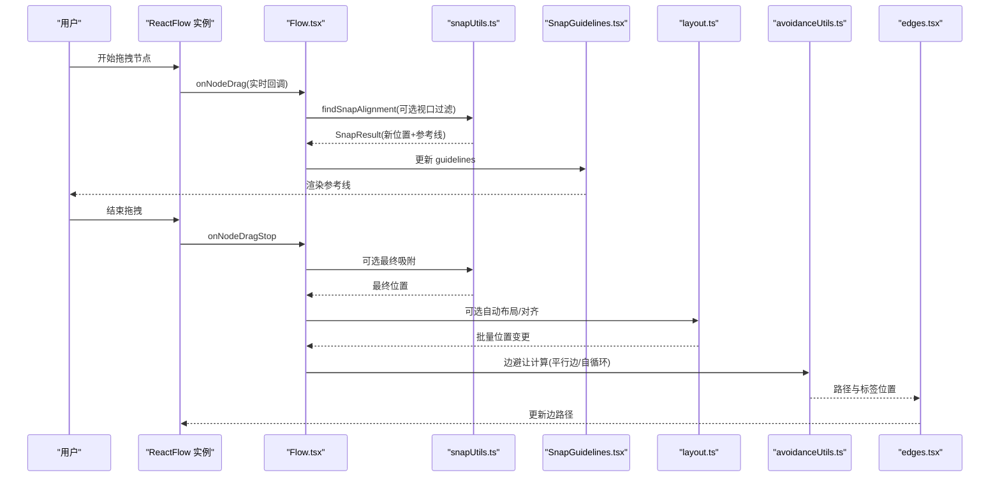
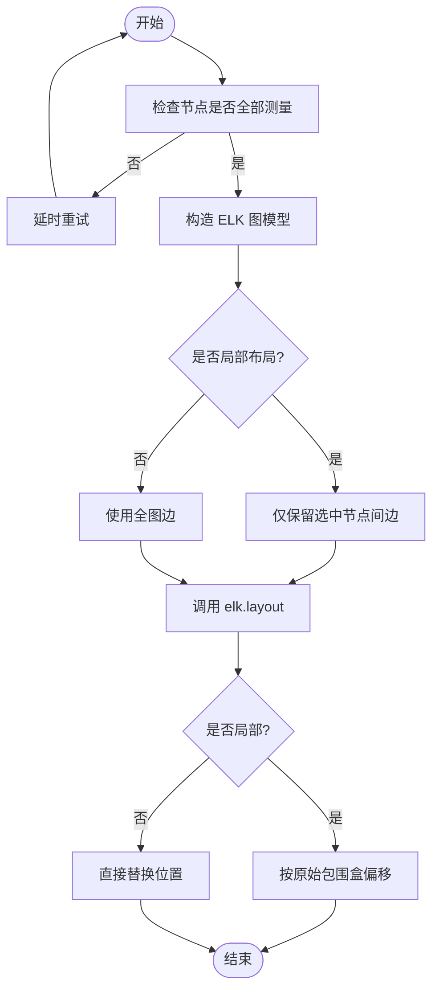
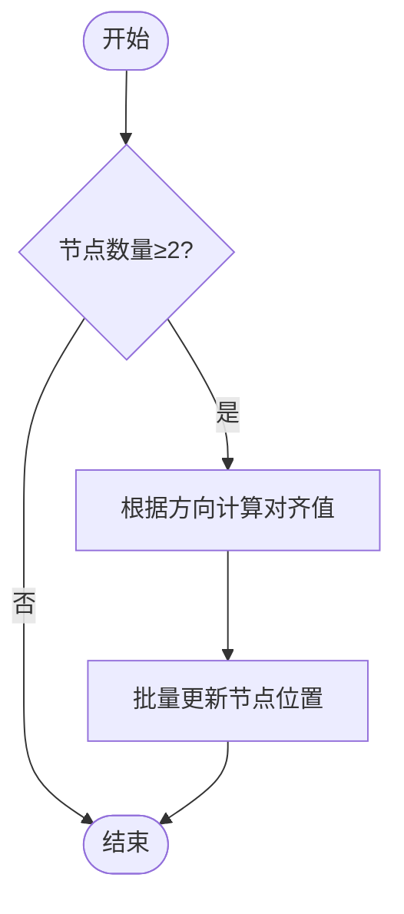
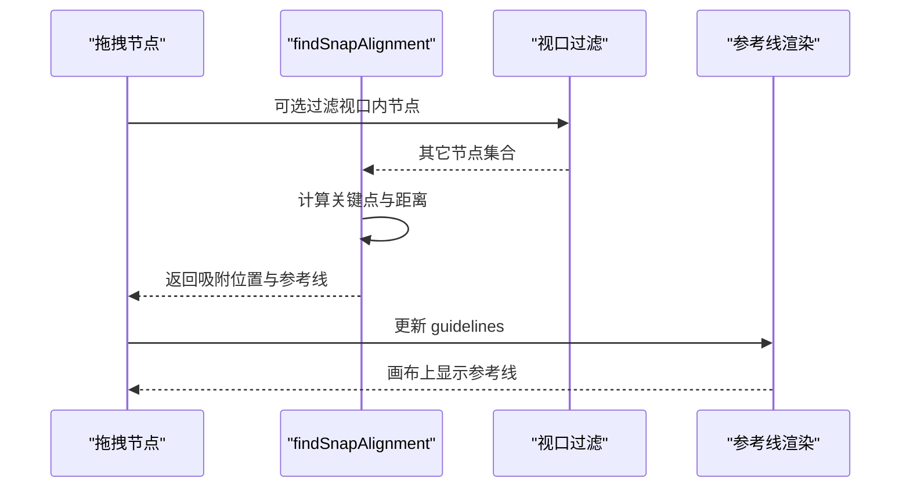
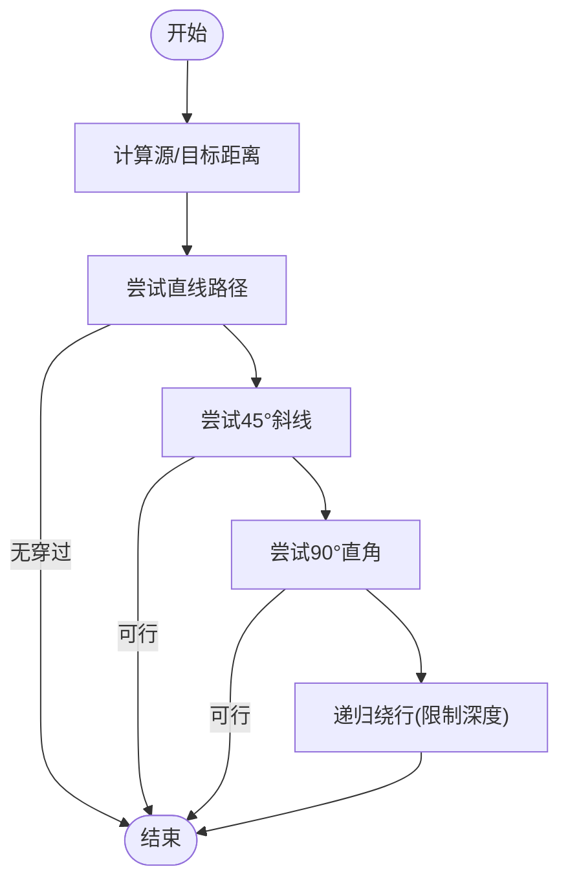
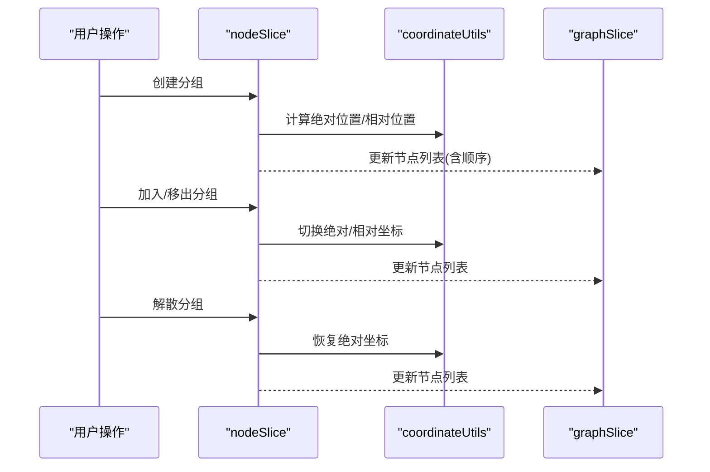
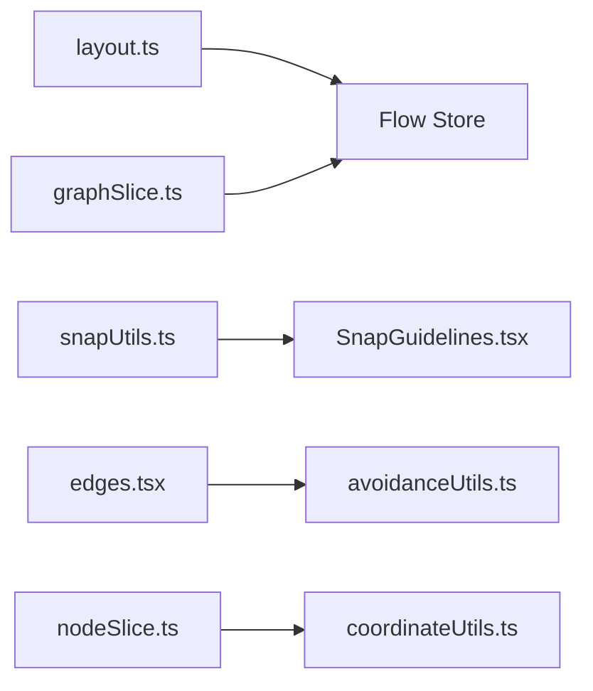

# 布局算法

<cite>
**本文引用的文件**
- [layout.ts](file://src/core/layout.ts)
- [snapUtils.ts](file://src/core/snapUtils.ts)
- [SnapGuidelines.tsx](file://src/components/flow/SnapGuidelines.tsx)
- [Flow.tsx](file://src/components/Flow.tsx)
- [avoidanceUtils.ts](file://src/core/avoidanceUtils.ts)
- [edges.tsx](file://src/components/flow/edges.tsx)
- [graphSlice.ts](file://src/stores/flow/slices/graphSlice.ts)
- [nodeSlice.ts](file://src/stores/flow/slices/nodeSlice.ts)
- [coordinateUtils.ts](file://src/stores/flow/utils/coordinateUtils.ts)
- [GroupNode.tsx](file://src/components/flow/nodes/GroupNode.tsx)
</cite>

## 目录
1. [简介](#简介)
2. [项目结构](#项目结构)
3. [核心组件](#核心组件)
4. [架构总览](#架构总览)
5. [详细组件分析](#详细组件分析)
6. [依赖关系分析](#依赖关系分析)
7. [性能考量](#性能考量)
8. [故障排查指南](#故障排查指南)
9. [结论](#结论)
10. [附录](#附录)

## 简介
本文件系统化梳理了编辑器中的布局算法体系，覆盖自动布局、节点对齐、磁吸对齐、对齐参考线与视觉引导、节点拖拽过程中的实时对齐与最终对齐、分组节点的布局处理与嵌套结构管理，以及边避让走线与路径优化。文档同时提供算法复杂度分析、性能调优建议与最佳实践，帮助开发者在保证交互流畅的同时实现高质量的空间布局。

## 项目结构
围绕布局与对齐的关键模块分布如下：
- 核心布局与对齐
  - 自动布局：基于 ELK 的分层布局算法，支持全局与局部（选中节点）两种模式
  - 节点对齐：支持左对齐、右对齐、顶部对齐、底部对齐、水平居中、垂直居中
- 磁吸对齐与视觉引导
  - 磁吸对齐：计算拖拽节点与其它节点的对齐候选，按阈值吸附
  - 参考线渲染：在画布上绘制垂直/水平参考线，提供视觉引导
- 边避让与路径优化
  - 避让路径：针对节点遮挡与自循环场景，提供多策略路径规划与圆角处理
  - 平行边偏移：同源同目标边的分散策略，避免路径重叠
- 分组与嵌套
  - 分组节点：支持创建/解散/加入/移出分组；相对/绝对坐标转换；自动排序
  - 嵌套结构：父子节点的绝对位置与相对位置转换，保证层级一致性

**图表来源**
- [layout.ts:31-218](file://src/core/layout.ts#L31-L218)
- [snapUtils.ts:100-161](file://src/core/snapUtils.ts#L100-L161)
- [SnapGuidelines.tsx:5-59](file://src/components/flow/SnapGuidelines.tsx#L5-L59)
- [avoidanceUtils.ts:691-779](file://src/core/avoidanceUtils.ts#L691-L779)
- [nodeSlice.ts:579-717](file://src/stores/flow/slices/nodeSlice.ts#L579-L717)
- [coordinateUtils.ts:85-105](file://src/stores/flow/utils/coordinateUtils.ts#L85-L105)

**章节来源**
- [layout.ts:1-220](file://src/core/layout.ts#L1-L220)
- [snapUtils.ts:1-162](file://src/core/snapUtils.ts#L1-L162)
- [avoidanceUtils.ts:1-780](file://src/core/avoidanceUtils.ts#L1-L780)
- [nodeSlice.ts:579-717](file://src/stores/flow/slices/nodeSlice.ts#L579-L717)
- [coordinateUtils.ts:1-105](file://src/stores/flow/utils/coordinateUtils.ts#L1-L105)

## 核心组件
- 自动布局（ELK 分层）
  - 全局/局部两种模式，自动等待节点测量完成后再执行布局
  - 局部布局时保持原始包围盒的相对位置，避免整体漂移
- 节点对齐
  - 支持六种对齐方式，统一通过变更批量应用到 Store
- 磁吸对齐
  - 基于节点九宫格关键点（左右中、上下中）的两轴扫描，按阈值吸附
  - 支持视口过滤，提升拖拽性能
- 参考线渲染
  - 将吸附产生的垂直/水平参考线映射到画布坐标，提供视觉反馈
- 边避让
  - 直线优先，否则尝试 45° 斜线、90° 直角路径，必要时递归绕行
  - 自循环与平行边分别采用专用策略，路径圆角化处理
- 分组与嵌套
  - 创建/解散/加入/移出分组，自动维护节点顺序与父子关系
  - 绝对/相对坐标转换，保证嵌套结构稳定

**章节来源**
- [layout.ts:31-218](file://src/core/layout.ts#L31-L218)
- [snapUtils.ts:100-161](file://src/core/snapUtils.ts#L100-L161)
- [SnapGuidelines.tsx:5-59](file://src/components/flow/SnapGuidelines.tsx#L5-L59)
- [avoidanceUtils.ts:691-779](file://src/core/avoidanceUtils.ts#L691-L779)
- [nodeSlice.ts:579-717](file://src/stores/flow/slices/nodeSlice.ts#L579-L717)
- [coordinateUtils.ts:85-105](file://src/stores/flow/utils/coordinateUtils.ts#L85-L105)

## 架构总览
布局相关模块的运行时交互如下：

**图表来源**
- [Flow.tsx:506-543](file://src/components/Flow.tsx#L506-L543)
- [snapUtils.ts:100-161](file://src/core/snapUtils.ts#L100-L161)
- [SnapGuidelines.tsx:5-59](file://src/components/flow/SnapGuidelines.tsx#L5-L59)
- [layout.ts:31-218](file://src/core/layout.ts#L31-L218)
- [avoidanceUtils.ts:691-779](file://src/core/avoidanceUtils.ts#L691-L779)
- [edges.tsx:253-309](file://src/components/flow/edges.tsx#L253-L309)

## 详细组件分析

### 自动布局（ELK 分层）
- 算法选择与参数
  - 算法：分层布局（layered）
  - 方向：从左到右（RIGHT）
  - 关键参数：层间间距、节点间距、交叉最小化、网络单纯形节点放置、环破坏策略、后压缩策略、自环放置
- 执行流程
  - 等待节点测量完成（measured.width/height）
  - 局部模式仅保留选中节点之间的边
  - 构造 ELK 图模型（children/edges），调用 elk.layout
  - 局部布局将结果偏移回原始包围盒位置；全局布局直接替换节点位置
- 性能要点
  - 未测量时延迟重试，避免无效计算
  - 局部布局减少图规模，显著降低 ELK 计算成本

**图表来源**
- [layout.ts:41-148](file://src/core/layout.ts#L41-L148)

**章节来源**
- [layout.ts:17-29](file://src/core/layout.ts#L17-L29)
- [layout.ts:41-148](file://src/core/layout.ts#L41-L148)

### 节点对齐
- 支持方向：左、右、顶、底、水平居中、垂直居中
- 实现要点
  - 计算目标节点集合的边界（含宽度/高度）
  - 将所有目标节点的对应坐标设置为目标对齐位置
  - 通过 Store 批量更新节点位置

**图表来源**
- [layout.ts:150-218](file://src/core/layout.ts#L150-L218)

**章节来源**
- [layout.ts:6-13](file://src/core/layout.ts#L6-L13)
- [layout.ts:150-218](file://src/core/layout.ts#L150-L218)

### 磁吸对齐与参考线
- 磁吸对齐
  - 关键点：left/centerX/right（X 轴）与 top/centerY/bottom（Y 轴）
  - 两轴双重循环扫描，计算与其它节点关键点的距离，取小于阈值的最优吸附
  - 支持视口过滤（可选），减少计算量
- 参考线渲染
  - 将吸附产生的参考线（垂直/水平）映射到画布坐标（考虑缩放与平移）
  - 使用重复渐变背景实现视觉引导

**图表来源**
- [snapUtils.ts:100-161](file://src/core/snapUtils.ts#L100-L161)
- [snapUtils.ts:38-78](file://src/core/snapUtils.ts#L38-L78)
- [SnapGuidelines.tsx:5-59](file://src/components/flow/SnapGuidelines.tsx#L5-L59)

**章节来源**
- [snapUtils.ts:100-161](file://src/core/snapUtils.ts#L100-L161)
- [snapUtils.ts:38-78](file://src/core/snapUtils.ts#L38-L78)
- [SnapGuidelines.tsx:5-59](file://src/components/flow/SnapGuidelines.tsx#L5-L59)
- [Flow.tsx:506-543](file://src/components/Flow.tsx#L506-L543)

### 边避让与路径优化
- 避让策略
  - 直线优先：若无节点穿过则直接连接
  - 45° 斜线：先斜后直或先直后斜两种变体
  - 90° 直角：先水平后垂直或先垂直后水平
  - 递归绕行：达到最大深度前选择最短绕行路径
- 自循环与平行边
  - 自循环：根据 handle 位置选择绕行方向
  - 平行边：按索引与步长在中心线两侧分散
- 圆角与标签
  - 路径圆角化处理
  - 计算路径中点作为标签位置

**图表来源**
- [avoidanceUtils.ts:398-577](file://src/core/avoidanceUtils.ts#L398-L577)
- [avoidanceUtils.ts:691-779](file://src/core/avoidanceUtils.ts#L691-L779)

**章节来源**
- [avoidanceUtils.ts:691-779](file://src/core/avoidanceUtils.ts#L691-L779)
- [edges.tsx:253-309](file://src/components/flow/edges.tsx#L253-L309)

### 分组节点的布局处理与嵌套结构
- 分组生命周期
  - 创建：生成唯一组 ID，创建 Group 节点，将选中节点设为子节点并转换为相对坐标
  - 解散：将子节点脱离父关系，恢复绝对坐标
  - 加入/移出：更新 parentId 与坐标模式
- 坐标转换
  - 绝对坐标：逐级累加父节点 position
  - 相对坐标：相对于父节点的绝对位置做差
- 顺序与渲染
  - 确保 Group 节点在子节点之前，避免层级错乱

**图表来源**
- [nodeSlice.ts:579-717](file://src/stores/flow/slices/nodeSlice.ts#L579-L717)
- [coordinateUtils.ts:85-105](file://src/stores/flow/utils/coordinateUtils.ts#L85-L105)
- [graphSlice.ts:25-62](file://src/stores/flow/slices/graphSlice.ts#L25-L62)

**章节来源**
- [nodeSlice.ts:579-717](file://src/stores/flow/slices/nodeSlice.ts#L579-L717)
- [coordinateUtils.ts:85-105](file://src/stores/flow/utils/coordinateUtils.ts#L85-L105)
- [graphSlice.ts:25-62](file://src/stores/flow/slices/graphSlice.ts#L25-L62)
- [GroupNode.tsx:127-177](file://src/components/flow/nodes/GroupNode.tsx#L127-L177)

## 依赖关系分析
- 模块耦合
  - layout.ts 依赖 Store 读取/写入节点与边状态
  - snapUtils.ts 与 SnapGuidelines.tsx 协作提供磁吸与视觉反馈
  - avoidanceUtils.ts 与 edges.tsx 协作生成避让路径
  - nodeSlice.ts 与 coordinateUtils.ts 协作处理分组与坐标转换
- 外部依赖
  - ELKJS：自动布局引擎
  - React Flow：节点/边渲染与事件驱动

**图表来源**
- [layout.ts:1-5](file://src/core/layout.ts#L1-L5)
- [snapUtils.ts:1-162](file://src/core/snapUtils.ts#L1-L162)
- [SnapGuidelines.tsx:1-59](file://src/components/flow/SnapGuidelines.tsx#L1-L59)
- [avoidanceUtils.ts:1-780](file://src/core/avoidanceUtils.ts#L1-L780)
- [edges.tsx:253-309](file://src/components/flow/edges.tsx#L253-L309)
- [nodeSlice.ts:1-35](file://src/stores/flow/slices/nodeSlice.ts#L1-L35)
- [coordinateUtils.ts:1-105](file://src/stores/flow/utils/coordinateUtils.ts#L1-L105)
- [graphSlice.ts:1-62](file://src/stores/flow/slices/graphSlice.ts#L1-L62)

**章节来源**
- [layout.ts:1-5](file://src/core/layout.ts#L1-L5)
- [nodeSlice.ts:1-35](file://src/stores/flow/slices/nodeSlice.ts#L1-L35)

## 性能考量
- 自动布局
  - 局部布局显著降低 ELK 计算规模，推荐在选中节点较多时使用
  - 未测量节点延迟重试，避免无效计算
- 磁吸对齐
  - 视口过滤可大幅减少扫描节点数量，建议开启
  - 阈值与关键点枚举控制吸附敏感度与性能
- 边避让
  - 优先直线，减少绕行次数
  - 递归深度与最大距离阈值限制，防止过度计算
  - 平行边偏移步长影响路径分散效果与性能平衡
- 分组与嵌套
  - 坐标转换按父链向上累加，注意深层嵌套时的计算成本
  - 确保 Group 节点顺序在子节点之前，避免渲染抖动

[本节为通用性能讨论，无需列出具体文件来源]

## 故障排查指南
- 自动布局无响应
  - 检查节点是否具备 measured 宽高；未测量会触发延迟重试
  - 局部布局时确认选中节点数量与边集合正确
- 磁吸对齐无效
  - 确认阈值设置合理；过大导致不吸附，过小导致频繁吸附
  - 检查视口过滤是否误将目标节点过滤掉
- 参考线不显示
  - 确认 guidelines 数组非空且已传入 SnapGuidelines
  - 检查缩放与平移参数是否正确传递给渲染组件
- 边路径异常
  - 检查节点边界框构建是否包含 Group 节点（Group 不应参与避让）
  - 平行边数量变化时，确认 edgeIndex 与 totalParallelEdges 正确
- 分组坐标错乱
  - 确认绝对/相对坐标转换逻辑正确
  - 检查 Group 节点顺序是否在子节点之前

**章节来源**
- [layout.ts:51-59](file://src/core/layout.ts#L51-L59)
- [snapUtils.ts:100-161](file://src/core/snapUtils.ts#L100-L161)
- [SnapGuidelines.tsx:5-59](file://src/components/flow/SnapGuidelines.tsx#L5-L59)
- [avoidanceUtils.ts:691-779](file://src/core/avoidanceUtils.ts#L691-L779)
- [edges.tsx:253-309](file://src/components/flow/edges.tsx#L253-L309)
- [coordinateUtils.ts:85-105](file://src/stores/flow/utils/coordinateUtils.ts#L85-L105)

## 结论
本布局算法体系以 ELK 分层布局为核心，结合磁吸对齐与参考线引导，辅以边避让与分组嵌套管理，形成一套完整、可扩展且高性能的可视化布局解决方案。通过局部布局、视口过滤、阈值控制与递归深度限制等手段，可在保证交互体验的同时有效控制计算成本。建议在实际工程中根据场景选择合适的策略组合，并持续监控节点测量与坐标转换的稳定性。

[本节为总结性内容，无需列出具体文件来源]

## 附录
- 算法复杂度与优化建议
  - 自动布局：ELK 分层布局通常为 O(N log N) 到 O(N^2)，局部布局可显著降低规模
  - 磁吸对齐：两轴关键点扫描为 O(S·T)，其中 S/T 为拖拽节点与其它节点数量；可通过视口过滤与阈值优化
  - 边避让：最坏情况下递归绕行可能达到 O(K·M)，其中 K 为策略分支数，M 为递归深度；通过阈值与深度限制控制
  - 分组与嵌套：坐标转换为 O(H)，H 为父链深度；深层嵌套时建议缓存中间结果
- 最佳实践
  - 优先使用局部自动布局处理选中区域
  - 开启视口过滤与合理阈值，提升磁吸性能
  - 控制递归深度与最大距离阈值，避免极端情况下的高开销
  - 保持 Group 节点顺序在子节点之前，简化渲染与交互

[本节为通用指导，无需列出具体文件来源]